# Дизайн Accessibility Service

## Обзор

Accessibility Service обеспечивает полную доступность российской Steam-платформы для людей с ограниченными возможностями через поддержку скринридеров, голосовое управление, адаптивные интерфейсы, интеграцию с ассистивными технологиями и соответствие российским стандартам доступности.

## Архитектура

### Высокоуровневая архитектура

```mermaid
graph TB
    subgraph "Accessibility Service"
        API[Accessibility API Gateway]
        SCREEN[Screen Reader Support]
        VOICE[Voice Control Engine]
        ADAPTIVE[Adaptive Interface Manager]
        ASSISTIVE[Assistive Technology Integration]
        GAME[Game Accessibility Manager]
        PROFILE[Accessibility Profile Manager]
        ANALYTICS[Accessibility Analytics]
    end
    
    subgraph "Accessibility Technologies"
        TTS[Text-to-Speech Engine]
        STT[Speech-to-Text Engine]
        OCR[Optical Character Recognition]
        GESTURE[Gesture Recognition]
    end
    
    subgraph "External Assistive Devices"
        NVDA[NVDA Screen Reader]
        JAWS[JAWS Screen Reader]
        EYE_TRACK[Eye Tracking Devices]
        SWITCH[Switch Controls]
        BRAILLE[Braille Displays]
    end
    
    subgraph "Internal Services"
        USER[User Service]
        GAME_CATALOG[Game Catalog Service]
        UI[UI Service]
        NOTIFICATION[Notification Service]
        SOCIAL[Social Service]
    end
    
    API --> SCREEN
    API --> VOICE
    API --> ADAPTIVE
    API --> ASSISTIVE
    API --> GAME
    API --> PROFILE
    API --> ANALYTICS
    
    SCREEN --> TTS
    VOICE --> STT
    ADAPTIVE --> OCR
    ASSISTIVE --> GESTURE
    
    SCREEN --> NVDA
    SCREEN --> JAWS
    ASSISTIVE --> EYE_TRACK
    ASSISTIVE --> SWITCH
    SCREEN --> BRAILLE
    
    API --> USER
    API --> GAME_CATALOG
    API --> UI
    API --> NOTIFICATION
    API --> SOCIAL
```



### Микросервисная архитектура

Accessibility Service состоит из следующих основных компонентов:

1. **Accessibility API Gateway** - единая точка входа для всех операций доступности
2. **Screen Reader Support** - поддержка программ экранного доступа
3. **Voice Control Engine** - система голосового управления
4. **Adaptive Interface Manager** - управление адаптивными интерфейсами
5. **Assistive Technology Integration** - интеграция с ассистивными технологиями
6. **Game Accessibility Manager** - управление доступностью игр
7. **Accessibility Profile Manager** - управление профилями доступности
8. **Accessibility Analytics** - аналитика использования функций доступности

## Компоненты и интерфейсы

### Accessibility API Gateway

**Назначение:** Централизованная точка доступа ко всем функциям доступности

**Основные функции:**
- Аутентификация и авторизация accessibility операций
- Маршрутизация запросов к соответствующим accessibility сервисам
- Интеграция с внешними ассистивными технологиями
- Мониторинг и логирование accessibility операций
- Соответствие российским стандартам доступности

**API Endpoints:**
```
GET /api/v1/accessibility/profile/{userId}
POST /api/v1/accessibility/screen-reader/enable
POST /api/v1/accessibility/voice-control/command
GET /api/v1/accessibility/games/{gameId}/features
POST /api/v1/accessibility/interface/adapt
GET /api/v1/accessibility/assistive-devices
POST /api/v1/accessibility/training/start
GET /api/v1/accessibility/analytics/usage
```

### Screen Reader Support

**Назначение:** Полная поддержка программ экранного доступа

**Поддерживаемые скринридеры:**
- **NVDA** - бесплатный российский скринридер
- **JAWS** - профессиональный скринридер
- **Narrator** - встроенный Windows скринридер
- **Orca** - Linux скринридер
- **VoiceOver** - macOS скринридер

**Основные функции:**
- Семантическая разметка всех UI элементов
- Аудио-описание интерфейса и контента
- Навигация по заголовкам и ландмаркам
- Озвучивание состояний и изменений
- Поддержка ARIA атрибутов

**Технологии реализации:**
- ARIA (Accessible Rich Internet Applications)
- Semantic HTML5 разметка
- Screen Reader API интеграция
- Custom accessibility tree
- Live regions для динамического контента

### Voice Control Engine

**Назначение:** Система голосового управления платформой

**Поддерживаемые языки:**
- Русский язык (основной)
- Английский язык
- Региональные диалекты

**Голосовые команды:**
```
"Открыть магазин" -> Навигация в магазин
"Найти игру [название]" -> Поиск игры
"Купить игру" -> Инициация покупки
"Подтвердить покупку" -> Подтверждение
"Отменить" -> Отмена операции
"Помощь" -> Вызов справки
"Повторить" -> Повтор последней информации
```

**Технологии распознавания:**
- Web Speech API
- Azure Speech Services (для русского языка)
- Yandex SpeechKit
- Offline распознавание для приватности
- Custom acoustic models для игровой терминологии

### Adaptive Interface Manager

**Назначение:** Управление адаптивными интерфейсами

**Типы адаптаций:**
- **Visual Adaptations** - визуальные адаптации
  - Высокий контраст
  - Крупные шрифты (до 200% увеличения)
  - Цветовые фильтры для дальтонизма
  - Уменьшение анимаций
  - Упрощенный интерфейс

- **Motor Adaptations** - адаптации для моторных нарушений
  - Увеличенные области клика
  - Sticky keys поддержка
  - Замедленное взаимодействие
  - Альтернативные способы ввода
  - Gesture customization

- **Cognitive Adaptations** - когнитивные адаптации
  - Упрощенная навигация
  - Дополнительные подсказки
  - Пошаговые инструкции
  - Уменьшение отвлекающих элементов
  - Consistent layout patterns

### Assistive Technology Integration

**Назначение:** Интеграция с внешними ассистивными технологиями

**Поддерживаемые устройства:**
- **Eye Tracking** - управление взглядом
  - Tobii Eye Tracker
  - EyeTech TM5
  - Российские eye-tracking решения

- **Switch Controls** - переключатели
  - Одиночные переключатели
  - Множественные переключатели
  - Sip-and-puff переключатели
  - Foot switches

- **Alternative Keyboards** - альтернативные клавиатуры
  - On-screen keyboards
  - Большие клавиши
  - Программируемые клавиатуры
  - Braille клавиатуры

**Протоколы интеграции:**
- USB HID протокол
- Bluetooth LE
- Windows Accessibility API
- Custom device drivers
- Plugin architecture для новых устройств

### Game Accessibility Manager

**Назначение:** Управление доступностью игр

**Функции для игр:**
- **Visual Accessibility**
  - Субтитры и closed captions
  - Цветовые индикаторы вместо звуков
  - Настройка контрастности
  - Масштабирование UI элементов

- **Audio Accessibility**
  - Визуальные индикаторы звуков
  - Haptic feedback
  - Spatial audio описания
  - Настройка частот звука

- **Motor Accessibility**
  - Переназначение клавиш
  - Автоматические действия
  - Настройка чувствительности
  - Pause-anywhere функциональность

**Game Accessibility Standards:**
```json
{
  "accessibility_features": {
    "visual": {
      "colorblind_support": true,
      "high_contrast": true,
      "font_scaling": true,
      "subtitle_support": true
    },
    "audio": {
      "visual_sound_indicators": true,
      "haptic_feedback": true,
      "audio_descriptions": true
    },
    "motor": {
      "key_remapping": true,
      "difficulty_options": true,
      "pause_anywhere": true,
      "auto_aim": true
    },
    "cognitive": {
      "simplified_ui": true,
      "tutorial_mode": true,
      "progress_indicators": true
    }
  }
}
```

### Accessibility Profile Manager

**Назначение:** Управление персональными профилями доступности

**Компоненты профиля:**
- Тип и степень ограничений
- Предпочитаемые адаптации
- Используемые ассистивные технологии
- Настройки интерфейса
- Игровые предпочтения

**Автоматическая адаптация:**
- Применение профиля при входе
- Синхронизация между устройствами
- Адаптация новых игр под профиль
- Рекомендации улучшений

### Accessibility Analytics

**Назначение:** Аналитика использования функций доступности

**Собираемые метрики (анонимно):**
- Популярность различных адаптаций
- Эффективность accessibility features
- Проблемные области интерфейса
- Успешность голосовых команд
- Время адаптации новых пользователей

**Цели аналитики:**
- Улучшение существующих функций
- Приоритизация новых разработок
- Выявление accessibility gaps
- Оптимизация пользовательского опыта

## Модели данных

### Accessibility Profile
```json
{
  "profile_id": "string",
  "user_id": "string",
  "created_at": "2025-08-24T10:00:00Z",
  "updated_at": "2025-08-24T12:00:00Z",
  "disabilities": [
    {
      "type": "visual",
      "severity": "severe",
      "details": "полная слепота",
      "assistive_technologies": ["nvda", "braille_display"]
    }
  ],
  "interface_preferences": {
    "high_contrast": true,
    "font_size_multiplier": 1.5,
    "reduce_animations": true,
    "screen_reader_enabled": true,
    "voice_control_enabled": false
  },
  "game_preferences": {
    "subtitles_always_on": true,
    "audio_descriptions": true,
    "simplified_controls": false,
    "pause_anywhere": true
  },
  "assistive_devices": [
    {
      "device_type": "braille_display",
      "model": "Focus 40 Blue",
      "settings": {"dots": 40, "cursor_routing": true}
    }
  ]
}
```

### Accessibility Feature Usage
```json
{
  "usage_id": "string",
  "user_id": "string",
  "feature_type": "screen_reader",
  "feature_name": "interface_narration",
  "session_start": "2025-08-24T10:00:00Z",
  "session_end": "2025-08-24T12:00:00Z",
  "usage_duration_minutes": 120,
  "effectiveness_rating": 4.5,
  "issues_encountered": [
    {
      "issue_type": "navigation_difficulty",
      "description": "Сложно найти кнопку покупки",
      "timestamp": "2025-08-24T10:30:00Z"
    }
  ],
  "success_metrics": {
    "tasks_completed": 5,
    "errors_count": 1,
    "help_requests": 0
  }
}
```

### Game Accessibility Rating
```json
{
  "rating_id": "string",
  "game_id": "string",
  "overall_score": 85,
  "last_updated": "2025-08-24T10:00:00Z",
  "accessibility_features": {
    "visual": {
      "score": 90,
      "features": [
        "colorblind_friendly",
        "high_contrast_mode",
        "subtitle_support",
        "ui_scaling"
      ]
    },
    "audio": {
      "score": 80,
      "features": [
        "visual_sound_indicators",
        "haptic_feedback",
        "audio_descriptions"
      ]
    },
    "motor": {
      "score": 85,
      "features": [
        "key_remapping",
        "difficulty_options",
        "pause_anywhere"
      ]
    },
    "cognitive": {
      "score": 75,
      "features": [
        "simplified_ui_option",
        "tutorial_mode",
        "progress_indicators"
      ]
    }
  },
  "user_reviews": [
    {
      "user_id": "string",
      "disability_type": "visual",
      "rating": 4,
      "comment": "Отличная поддержка скринридера"
    }
  ],
  "certification": {
    "certified": true,
    "certifying_body": "Russian Accessibility Standards",
    "certificate_id": "RAS-2025-001234"
  }
}
```

### Voice Command
```json
{
  "command_id": "string",
  "user_id": "string",
  "timestamp": "2025-08-24T10:00:00Z",
  "spoken_text": "открыть магазин игр",
  "recognized_intent": "navigate_to_store",
  "confidence_score": 0.95,
  "execution_status": "success",
  "response_time_ms": 150,
  "context": {
    "current_page": "main_menu",
    "user_state": "browsing",
    "previous_commands": ["помощь", "что нового"]
  },
  "feedback": {
    "user_satisfied": true,
    "correction_needed": false,
    "alternative_suggested": null
  }
}
```

### Assistive Device Configuration
```json
{
  "config_id": "string",
  "user_id": "string",
  "device_type": "eye_tracker",
  "device_model": "Tobii Eye Tracker 5",
  "connection_status": "connected",
  "last_calibrated": "2025-08-24T09:00:00Z",
  "settings": {
    "sensitivity": 0.8,
    "dwell_time_ms": 800,
    "gaze_trail": true,
    "click_method": "dwell",
    "calibration_points": 9
  },
  "performance_metrics": {
    "accuracy": 0.92,
    "precision": 0.88,
    "tracking_ratio": 0.95,
    "calibration_quality": "good"
  },
  "custom_gestures": [
    {
      "gesture_name": "scroll_down",
      "eye_movement": "look_down_hold",
      "duration_ms": 1000
    }
  ]
}
```

## Обработка ошибок

### Стратегии обработки ошибок

1. **Screen Reader Failures**
   - Fallback на alternative text descriptions
   - Graceful degradation к базовому HTML
   - Audio feedback при критических ошибках
   - Manual accessibility mode activation

2. **Voice Recognition Errors**
   - Multiple recognition attempts
   - Context-aware error correction
   - Alternative command suggestions
   - Fallback на keyboard/mouse input

3. **Assistive Device Disconnections**
   - Automatic reconnection attempts
   - Alternative input method activation
   - User notification с инструкциями
   - Graceful degradation functionality

4. **Accessibility Profile Sync Failures**
   - Local profile caching
   - Manual profile restoration
   - Default accessibility settings fallback
   - Cross-device sync retry mechanisms

### Коды ошибок

```
ACCESS_001: Screen reader not detected
ACCESS_002: Voice recognition failed
ACCESS_003: Assistive device disconnected
ACCESS_004: Accessibility profile sync failed
ACCESS_005: Game accessibility features unavailable
ACCESS_006: Interface adaptation failed
ACCESS_007: Audio description not available
ACCESS_008: Braille display communication error
ACCESS_009: Eye tracking calibration failed
ACCESS_010: Accessibility standards violation
```

## Стратегия тестирования

### Accessibility Testing
- Automated accessibility scanning (axe-core, WAVE)
- Screen reader testing с реальными пользователями
- Keyboard navigation testing
- Color contrast и visual testing
- Voice control accuracy testing

### User Testing
- Testing с пользователями различных типов ограничений
- Usability testing accessibility features
- Performance testing assistive technologies
- Cross-platform accessibility testing

### Compliance Testing
- WCAG 2.1 AA compliance testing
- Russian accessibility standards testing
- Section 508 compliance (для международных пользователей)
- EN 301 549 European standard testing

### Device Integration Testing
- Testing с различными ассистивными устройствами
- Cross-browser accessibility testing
- Mobile accessibility testing
- Gaming accessibility testing

## Безопасность и конфиденциальность

### Privacy Protection
- Минимизация сбора accessibility данных
- Анонимизация usage analytics
- Secure storage accessibility profiles
- User consent для accessibility data collection

### Data Security
- Encrypted transmission accessibility данных
- Secure storage assistive device configurations
- Access control для accessibility settings
- Audit logging accessibility operations

### Assistive Technology Security
- Secure communication с внешними устройствами
- Validation assistive device inputs
- Protection от malicious accessibility tools
- Secure voice command processing

## Мониторинг и метрики

### Accessibility Metrics
- Screen reader usage statistics
- Voice control success rates
- Assistive device connectivity rates
- Game accessibility feature adoption

### User Experience Metrics
- Task completion rates для пользователей с ограничениями
- Time to complete common tasks
- Error rates в accessibility workflows
- User satisfaction с accessibility features

### Technical Performance Metrics
- Screen reader response times
- Voice recognition accuracy
- Assistive device latency
- Interface adaptation performance

### Compliance Metrics
- WCAG compliance score
- Russian accessibility standards adherence
- Accessibility issue resolution time
- Developer accessibility training completion

## Соответствие российским стандартам

### ГОСТ Р 52872-2019
- Соответствие требованиям доступности веб-ресурсов
- Поддержка российских ассистивных технологий
- Русскоязычная accessibility документация
- Интеграция с российскими скринридерами

### Федеральный закон "О социальной защите инвалидов"
- Обеспечение равного доступа к информационным ресурсам
- Поддержка различных типов ограничений
- Бесплатный доступ к accessibility функциям
- Интеграция с государственными accessibility программами

### Региональные требования
- Поддержка региональных accessibility стандартов
- Интеграция с местными disability services
- Локализация accessibility features
- Compliance с региональными законами

## Масштабирование и будущее развитие

### Advanced Accessibility Features
- AI-powered accessibility improvements
- Machine learning для персонализации
- Advanced voice recognition с NLP
- Predictive accessibility adaptations

### Emerging Technologies
- VR/AR accessibility support
- Brain-computer interface integration
- Advanced haptic feedback systems
- Real-time sign language translation

### Global Expansion
- Multi-language accessibility support
- International accessibility standards compliance
- Cross-cultural accessibility considerations
- Global assistive technology partnerships