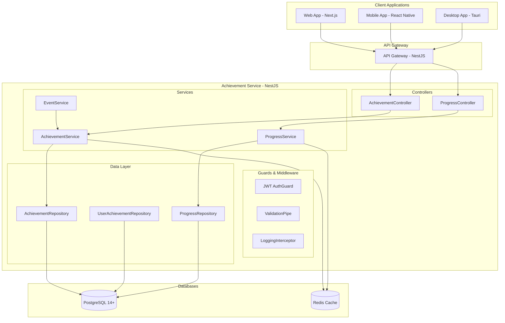

# Design Document - Achievement Service MVP

## Overview

Achievement Service - базовый сервис достижений для MVP российской игровой платформы. Обеспечивает простую систему достижений за основные действия пользователей на платформе.

## Technology Stack

- **Framework**: NestJS (встроенная поддержка микросервисов, DI, декораторы)
- **Runtime**: Node.js 18+ / TypeScript
- **База данных**: PostgreSQL 14+ (primary), Redis (cache)
- **ORM**: TypeORM с декораторами
- **Тестирование**: Jest + Supertest (встроенные в NestJS)
- **Документация**: Swagger/OpenAPI (автогенерация)
- **Валидация**: class-validator + class-transformer
- **Контейнеризация**: Docker + Kubernetes

## Architecture

### NestJS Modular Architecture



## Components and Interfaces

### NestJS Modules Structure

```typescript
@Module({
  imports: [
    TypeOrmModule.forFeature([Achievement, UserAchievement, UserProgress]),
    CacheModule.register(),
  ],
  controllers: [AchievementController, ProgressController],
  providers: [AchievementService, ProgressService, EventService],
  exports: [AchievementService, ProgressService],
})
export class AchievementModule {}
```

### REST API Endpoints

#### AchievementController

```typescript
@Controller('achievements')
@ApiTags('achievements')
@UseGuards(JwtAuthGuard)
export class AchievementController {
  
  @Get()
  @ApiOperation({ summary: 'Получить все достижения' })
  async getAllAchievements(): Promise<AchievementResponseDto[]>
  
  @Get('user/:userId')
  @ApiOperation({ summary: 'Получить достижения пользователя' })
  async getUserAchievements(@Param('userId') userId: string): Promise<UserAchievementResponseDto[]>
  
  @Post('unlock')
  @ApiOperation({ summary: 'Разблокировать достижение' })
  async unlockAchievement(@Body() dto: UnlockAchievementDto): Promise<UserAchievementResponseDto>
}
```

#### ProgressController

```typescript
@Controller('progress')
@ApiTags('progress')
@UseGuards(JwtAuthGuard)
export class ProgressController {
  
  @Get('user/:userId')
  @ApiOperation({ summary: 'Получить прогресс пользователя' })
  async getUserProgress(@Param('userId') userId: string): Promise<UserProgressResponseDto[]>
  
  @Post('update')
  @ApiOperation({ summary: 'Обновить прогресс' })
  async updateProgress(@Body() dto: UpdateProgressDto): Promise<UserProgressResponseDto>
}
```

### Business Logic Services

#### AchievementService

```typescript
@Injectable()
export class AchievementService {
  constructor(
    @InjectRepository(Achievement)
    private achievementRepository: Repository<Achievement>,
    @InjectRepository(UserAchievement)
    private userAchievementRepository: Repository<UserAchievement>,
    @Inject(CACHE_MANAGER)
    private cacheManager: Cache,
  ) {}

  async getAllAchievements(): Promise<Achievement[]>
  async getUserAchievements(userId: string): Promise<UserAchievement[]>
  async unlockAchievement(userId: string, achievementId: string): Promise<UserAchievement>
  async isAchievementUnlocked(userId: string, achievementId: string): Promise<boolean>
}
```

#### ProgressService

```typescript
@Injectable()
export class ProgressService {
  constructor(
    @InjectRepository(UserProgress)
    private progressRepository: Repository<UserProgress>,
    private achievementService: AchievementService,
  ) {}

  async updateProgress(userId: string, eventType: string, data: any): Promise<UserProgress[]>
  async getUserProgress(userId: string): Promise<UserProgress[]>
  async checkAchievements(userId: string): Promise<UserAchievement[]>
  private async evaluateCondition(condition: any, userStats: any): Promise<boolean>
}
```

#### EventService

```typescript
@Injectable()
export class EventService {
  constructor(
    private progressService: ProgressService,
    private notificationService: NotificationService,
  ) {}

  async handleGamePurchase(userId: string, gameId: string): Promise<void>
  async handleReviewCreated(userId: string, reviewId: string): Promise<void>
  async handleFriendAdded(userId: string, friendId: string): Promise<void>
  async notifyAchievementUnlocked(userId: string, achievementId: string): Promise<void>
}
```

## Data Models

### TypeORM Entities

#### Achievement Entity

```typescript
@Entity('achievements')
export class Achievement {
  @PrimaryGeneratedColumn('uuid')
  id: string;

  @Column({ type: 'varchar', length: 100, unique: true })
  @Index()
  name: string;

  @Column({ type: 'text' })
  description: string;

  @Column({ 
    type: 'enum', 
    enum: ['first_purchase', 'first_review', 'first_friend', 'games_purchased', 'reviews_written'] 
  })
  @Index()
  type: AchievementType;

  @Column({ type: 'jsonb' })
  condition: AchievementCondition;

  @Column({ type: 'varchar', length: 255, nullable: true })
  iconUrl: string;

  @Column({ type: 'int', default: 0 })
  points: number;

  @Column({ type: 'boolean', default: true })
  isActive: boolean;

  @CreateDateColumn()
  createdAt: Date;

  @UpdateDateColumn()
  updatedAt: Date;

  @OneToMany(() => UserAchievement, userAchievement => userAchievement.achievement)
  userAchievements: UserAchievement[];
}
```

#### UserAchievement Entity

```typescript
@Entity('user_achievements')
@Index(['userId', 'achievementId'], { unique: true })
export class UserAchievement {
  @PrimaryGeneratedColumn('uuid')
  id: string;

  @Column({ type: 'uuid' })
  @Index()
  userId: string;

  @Column({ type: 'uuid' })
  @Index()
  achievementId: string;

  @CreateDateColumn()
  unlockedAt: Date;

  @ManyToOne(() => Achievement, achievement => achievement.userAchievements)
  @JoinColumn({ name: 'achievementId' })
  achievement: Achievement;
}
```

#### UserProgress Entity

```typescript
@Entity('user_progress')
@Index(['userId', 'achievementId'], { unique: true })
export class UserProgress {
  @PrimaryGeneratedColumn('uuid')
  id: string;

  @Column({ type: 'uuid' })
  @Index()
  userId: string;

  @Column({ type: 'uuid' })
  @Index()
  achievementId: string;

  @Column({ type: 'int', default: 0 })
  currentValue: number;

  @Column({ type: 'int' })
  targetValue: number;

  @UpdateDateColumn()
  updatedAt: Date;

  @ManyToOne(() => Achievement)
  @JoinColumn({ name: 'achievementId' })
  achievement: Achievement;
}
```

### DTOs with Validation

#### Request DTOs

```typescript
export class UnlockAchievementDto {
  @IsUUID()
  @ApiProperty({ description: 'ID пользователя' })
  userId: string;

  @IsUUID()
  @ApiProperty({ description: 'ID достижения' })
  achievementId: string;
}

export class UpdateProgressDto {
  @IsUUID()
  @ApiProperty({ description: 'ID пользователя' })
  userId: string;

  @IsEnum(['game_purchase', 'review_created', 'friend_added'])
  @ApiProperty({ description: 'Тип события' })
  eventType: string;

  @IsObject()
  @ApiProperty({ description: 'Данные события' })
  eventData: any;
}
```

#### Response DTOs

```typescript
export class AchievementResponseDto {
  @ApiProperty()
  id: string;

  @ApiProperty()
  name: string;

  @ApiProperty()
  description: string;

  @ApiProperty()
  type: string;

  @ApiProperty()
  iconUrl: string;

  @ApiProperty()
  points: number;

  @ApiProperty()
  condition: any;
}

export class UserAchievementResponseDto {
  @ApiProperty()
  id: string;

  @ApiProperty()
  userId: string;

  @ApiProperty()
  achievement: AchievementResponseDto;

  @ApiProperty()
  unlockedAt: Date;
}

export class UserProgressResponseDto {
  @ApiProperty()
  id: string;

  @ApiProperty()
  userId: string;

  @ApiProperty()
  achievement: AchievementResponseDto;

  @ApiProperty()
  currentValue: number;

  @ApiProperty()
  targetValue: number;

  @ApiProperty()
  progressPercentage: number;

  @ApiProperty()
  updatedAt: Date;
}
```

### Types and Enums

```typescript
export enum AchievementType {
  FIRST_PURCHASE = 'first_purchase',
  FIRST_REVIEW = 'first_review',
  FIRST_FRIEND = 'first_friend',
  GAMES_PURCHASED = 'games_purchased',
  REVIEWS_WRITTEN = 'reviews_written',
}

export interface AchievementCondition {
  type: 'count' | 'first_time' | 'threshold';
  target?: number;
  field?: string;
}
```

## Error Handling

### Custom Exception Filters

```typescript
@Catch()
export class AllExceptionsFilter implements ExceptionFilter {
  catch(exception: unknown, host: ArgumentsHost) {
    const ctx = host.switchToHttp();
    const response = ctx.getResponse<Response>();
    const request = ctx.getRequest<Request>();

    let status = HttpStatus.INTERNAL_SERVER_ERROR;
    let message = 'Internal server error';

    if (exception instanceof HttpException) {
      status = exception.getStatus();
      message = exception.message;
    }

    response.status(status).json({
      statusCode: status,
      timestamp: new Date().toISOString(),
      path: request.url,
      message,
    });
  }
}
```

### Custom Exceptions

```typescript
export class AchievementNotFoundException extends NotFoundException {
  constructor(achievementId: string) {
    super(`Achievement with ID ${achievementId} not found`);
  }
}

export class AchievementAlreadyUnlockedException extends ConflictException {
  constructor(achievementId: string, userId: string) {
    super(`Achievement ${achievementId} already unlocked for user ${userId}`);
  }
}

export class InvalidProgressDataException extends BadRequestException {
  constructor(message: string) {
    super(`Invalid progress data: ${message}`);
  }
}
```

### Guards and Interceptors

```typescript
@Injectable()
export class JwtAuthGuard extends AuthGuard('jwt') {
  canActivate(context: ExecutionContext): boolean | Promise<boolean> {
    return super.canActivate(context);
  }
}

@Injectable()
export class LoggingInterceptor implements NestInterceptor {
  intercept(context: ExecutionContext, next: CallHandler): Observable<any> {
    const request = context.switchToHttp().getRequest();
    const method = request.method;
    const url = request.url;
    
    console.log(`${method} ${url} - ${new Date().toISOString()}`);
    
    return next.handle().pipe(
      tap(() => console.log(`${method} ${url} - Completed`)),
    );
  }
}
```

## Testing Strategy

### Unit Tests (Jest)

```typescript
describe('AchievementService', () => {
  let service: AchievementService;
  let repository: Repository<Achievement>;

  beforeEach(async () => {
    const module: TestingModule = await Test.createTestingModule({
      providers: [
        AchievementService,
        {
          provide: getRepositoryToken(Achievement),
          useClass: Repository,
        },
      ],
    }).compile();

    service = module.get<AchievementService>(AchievementService);
    repository = module.get<Repository<Achievement>>(getRepositoryToken(Achievement));
  });

  it('should get all achievements', async () => {
    // Test implementation
  });
});
```

### Integration Tests (Supertest)

```typescript
describe('AchievementController (e2e)', () => {
  let app: INestApplication;

  beforeEach(async () => {
    const moduleFixture: TestingModule = await Test.createTestingModule({
      imports: [AchievementModule],
    }).compile();

    app = moduleFixture.createNestApplication();
    await app.init();
  });

  it('/achievements (GET)', () => {
    return request(app.getHttpServer())
      .get('/achievements')
      .expect(200)
      .expect((res) => {
        expect(Array.isArray(res.body)).toBe(true);
      });
  });
});
```

### Test Coverage Requirements
- Unit Tests: 90%+ coverage для services
- Integration Tests: Все API endpoints
- E2E Tests: Основные пользовательские сценарии
- Performance Tests: Нагрузочное тестирование API