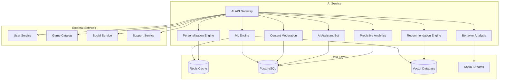

# Дизайн AI Service

## Обзор

AI Service представляет собой централизованную платформу искусственного интеллекта для российской Steam-платформы, предоставляющую персонализированные рекомендации, автоматическую модерацию контента, ИИ-ассистентов поддержки, анализ игрового поведения и предсказательную аналитику.

## Архитектура

### Высокоуровневая архитектура



### Микросервисная архитектура

AI Service состоит из следующих основных компонентов:

1. **AI API Gateway** - единая точка входа для всех ИИ-запросов
2. **ML Engine** - ядро машинного обучения с моделями
3. **Recommendation Engine** - система персональных рекомендаций
4. **Content Moderation** - автоматическая модерация контента
5. **AI Assistant Bot** - чат-бот поддержки
6. **Predictive Analytics** - предсказательная аналитика
7. **Behavior Analysis** - анализ игрового поведения
8. **Personalization Engine** - персонализация интерфейса

## Компоненты и интерфейсы

### AI API Gateway

**Назначение:** Централизованная точка доступа ко всем ИИ-сервисам

**Основные функции:**
- Маршрутизация запросов к соответствующим ИИ-движкам
- Аутентификация и авторизация
- Rate limiting и throttling
- Кэширование часто запрашиваемых результатов
- Мониторинг и логирование

**API Endpoints:**
```
POST /api/v1/recommendations/games
POST /api/v1/moderation/content
POST /api/v1/assistant/chat
POST /api/v1/analytics/predict
POST /api/v1/behavior/analyze
POST /api/v1/personalization/interface
```

### ML Engine

**Назначение:** Ядро машинного обучения с обученными моделями

**Модели:**
- Collaborative Filtering для рекомендаций
- Content-based Filtering для анализа игр
- NLP модели для обработки текста
- Computer Vision для анализа изображений
- Time Series для предсказательной аналитики

**Технологии:**
- TensorFlow/PyTorch для глубокого обучения
- Scikit-learn для классических ML алгоритмов
- Transformers для NLP задач
- OpenCV для обработки изображений

### Recommendation Engine

**Назначение:** Персональные рекомендации игр и контента

**Алгоритмы:**
- Коллаборативная фильтрация (User-based, Item-based)
- Content-based рекомендации
- Гибридные подходы
- Deep Learning рекомендации (Neural Collaborative Filtering)

**Входные данные:**
- История покупок и игр пользователя
- Рейтинги и отзывы
- Демографические данные
- Поведенческие метрики

### Content Moderation

**Назначение:** Автоматическая модерация пользовательского контента

**Функции:**
- Детекция токсичности в тексте
- Распознавание неподходящих изображений
- Выявление спама и ботов
- Анализ нарушений правил сообщества

**ML Модели:**
- BERT для анализа токсичности текста
- CNN для классификации изображений
- Anomaly Detection для выявления подозрительного поведения

### AI Assistant Bot

**Назначение:** Интеллектуальный помощник для поддержки пользователей

**Возможности:**
- Понимание естественного языка (русский)
- База знаний с FAQ
- Интеграция с системой тикетов
- Эскалация сложных вопросов

**Технологии:**
- Rasa или DialogFlow для NLU
- Elasticsearch для поиска в базе знаний
- Интеграция с Support Service

### Predictive Analytics

**Назначение:** Предсказание трендов и поведения пользователей

**Модели предсказания:**
- Успешность новых игр
- Вероятность покупки
- Риск оттока пользователей
- Оптимальные цены и акции

**Алгоритмы:**
- Time Series Forecasting (ARIMA, LSTM)
- Classification для предсказания покупок
- Survival Analysis для анализа оттока
- Reinforcement Learning для ценообразования

### Behavior Analysis

**Назначение:** Анализ игрового поведения и паттернов

**Анализируемые метрики:**
- Время в игре и сессии
- Достижения и прогресс
- Социальные взаимодействия
- Покупки внутри игр

**Выходные данные:**
- Сегментация игроков
- Выявление проблемных мест в играх
- Рекомендации по улучшению баланса
- Детекция читерства

### Personalization Engine

**Назначение:** Персонализация пользовательского интерфейса

**Функции:**
- Адаптивное расположение элементов UI
- Персональные ярлыки и меню
- Контекстные подсказки
- A/B тестирование интерфейсов

## Модели данных

### User Profile
```json
{
  "user_id": "string",
  "preferences": {
    "genres": ["action", "rpg", "strategy"],
    "platforms": ["pc", "mobile"],
    "price_sensitivity": "medium",
    "language": "ru"
  },
  "behavior": {
    "avg_session_time": 120,
    "favorite_game_types": ["multiplayer", "singleplayer"],
    "purchase_frequency": "monthly"
  },
  "embeddings": {
    "user_vector": [0.1, 0.2, ...],
    "last_updated": "2025-08-24T10:00:00Z"
  }
}
```

### Game Features
```json
{
  "game_id": "string",
  "features": {
    "genre": ["action", "adventure"],
    "tags": ["open-world", "story-rich"],
    "price": 1999.99,
    "rating": 4.5,
    "release_date": "2025-01-15"
  },
  "embeddings": {
    "content_vector": [0.3, 0.4, ...],
    "similarity_vector": [0.5, 0.6, ...]
  }
}
```

### Moderation Result
```json
{
  "content_id": "string",
  "content_type": "text|image|video",
  "moderation_result": {
    "is_toxic": false,
    "toxicity_score": 0.1,
    "categories": ["safe"],
    "confidence": 0.95,
    "requires_human_review": false
  },
  "timestamp": "2025-08-24T10:00:00Z"
}
```

### Recommendation
```json
{
  "user_id": "string",
  "recommendations": [
    {
      "game_id": "string",
      "score": 0.85,
      "reason": "Based on your love for RPG games",
      "algorithm": "collaborative_filtering"
    }
  ],
  "generated_at": "2025-08-24T10:00:00Z",
  "expires_at": "2025-08-24T22:00:00Z"
}
```

## Обработка ошибок

### Стратегии обработки ошибок

1. **Graceful Degradation**
   - При недоступности ML моделей возврат к базовым алгоритмам
   - Кэширование предыдущих результатов
   - Fallback на популярные рекомендации

2. **Circuit Breaker Pattern**
   - Автоматическое отключение неисправных компонентов
   - Мониторинг состояния сервисов
   - Автоматическое восстановление

3. **Retry Logic**
   - Экспоненциальная задержка для повторных попыток
   - Максимальное количество попыток
   - Jitter для избежания thundering herd

### Коды ошибок

```
AI_001: Model not available
AI_002: Insufficient data for prediction
AI_003: Content moderation failed
AI_004: Recommendation engine timeout
AI_005: Invalid input format
AI_006: Rate limit exceeded
AI_007: Authentication failed
AI_008: Model inference error
```

## Стратегия тестирования

### Unit Testing
- Тестирование отдельных ML компонентов
- Мокирование внешних зависимостей
- Валидация входных и выходных данных

### Integration Testing
- Тестирование взаимодействия между компонентами
- Тестирование API endpoints
- Проверка интеграции с внешними сервисами

### ML Model Testing
- A/B тестирование новых моделей
- Offline evaluation метрик
- Shadow testing в продакшене
- Мониторинг drift моделей

### Performance Testing
- Load testing для высоких нагрузок
- Latency testing для real-time рекомендаций
- Memory usage testing для больших моделей

### Security Testing
- Тестирование на adversarial attacks
- Проверка data privacy
- Валидация входных данных
- Тестирование авторизации

## Безопасность и конфиденциальность

### Data Privacy
- Анонимизация пользовательских данных
- GDPR compliance для европейских пользователей
- Локальное хранение данных российских пользователей
- Право на удаление персональных данных

### Model Security
- Защита от adversarial attacks
- Валидация входных данных
- Rate limiting для предотвращения abuse
- Мониторинг аномальных запросов

### Access Control
- JWT токены для аутентификации
- Role-based access control (RBAC)
- API key management
- Audit logging всех операций

## Мониторинг и метрики

### Business Metrics
- Click-through rate для рекомендаций
- Conversion rate после рекомендаций
- User engagement metrics
- Content moderation accuracy

### Technical Metrics
- Model inference latency
- API response times
- Error rates по компонентам
- Resource utilization (CPU, Memory, GPU)

### ML Metrics
- Model accuracy и precision
- Recommendation diversity
- Coverage метрики
- Model drift detection

## Масштабирование

### Horizontal Scaling
- Kubernetes для оркестрации контейнеров
- Load balancing между репликами
- Auto-scaling на основе нагрузки
- Distributed model serving

### Caching Strategy
- Redis для кэширования рекомендаций
- CDN для статических ML моделей
- In-memory кэширование часто используемых данных
- Cache invalidation стратегии

### Database Optimization
- Партиционирование больших таблиц
- Индексирование для быстрых запросов
- Read replicas для аналитических запросов
- Vector database для similarity search