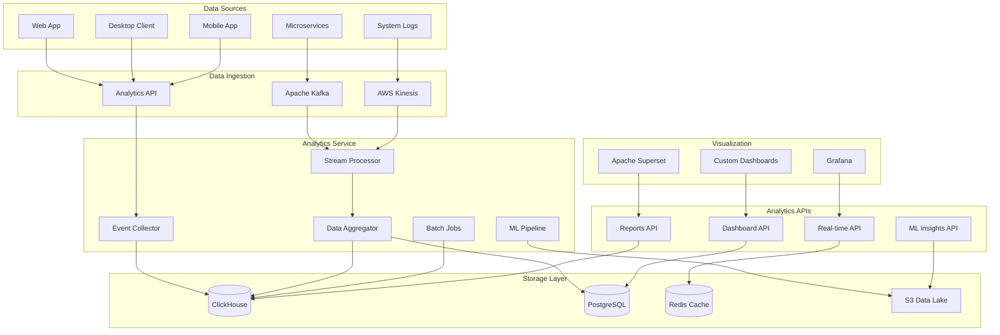
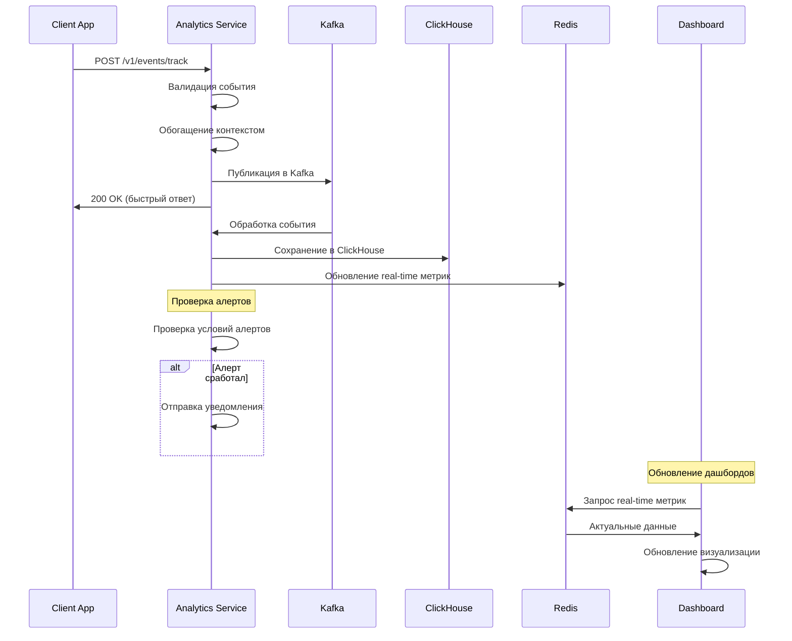
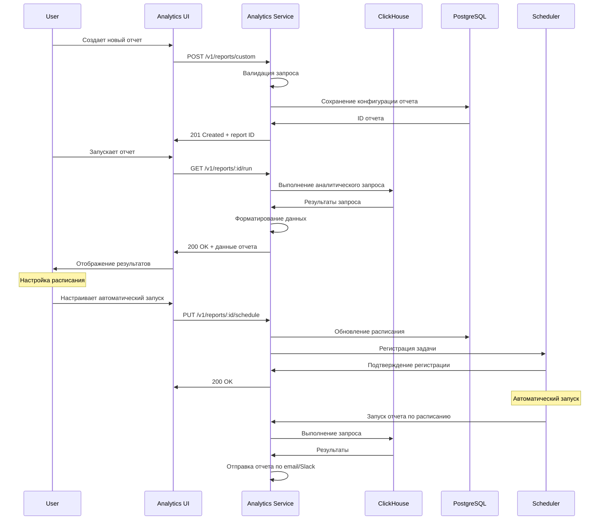
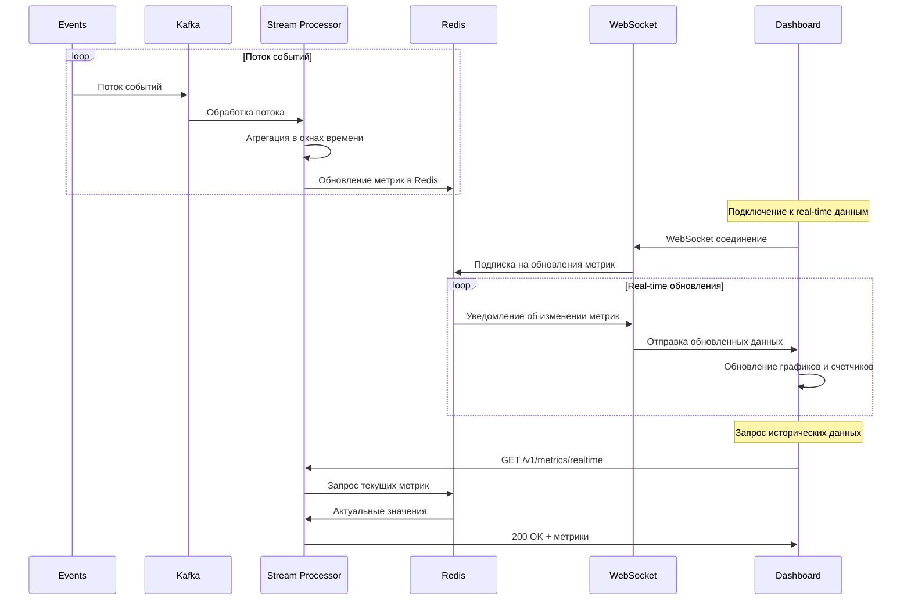
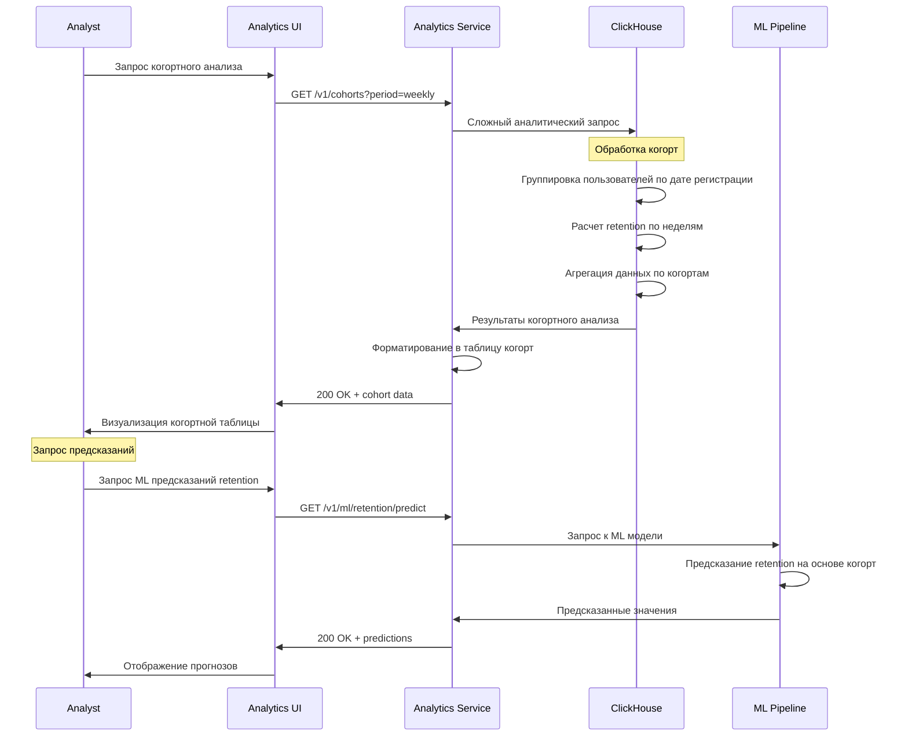

# Дизайн Analytics Service

## Обзор

Analytics Service является центральным сервисом для сбора, обработки и анализа данных российской игровой платформы. Сервис обеспечивает real-time аналитику пользовательского поведения, бизнес-метрики, системную телеметрию и предоставляет инсайты для принятия решений.

### Ключевые принципы дизайна

- **Real-time обработка**: Потоковая обработка событий с минимальной задержкой
- **Масштабируемость**: Обработка миллионов событий в день
- **Гибкость**: Поддержка произвольных событий и метрик
- **Производительность**: Быстрые запросы к аналитическим данным
- **Приватность**: Соблюдение GDPR и российского законодательства

## Архитектура

### Общая архитектура



## API Эндпоинты и маршруты

### Event Collection API

```typescript
// Сбор событий
POST   /v1/events                      // Отправка одного события
POST   /v1/events/batch                // Пакетная отправка событий
POST   /v1/events/track                // Трекинг пользовательских действий
POST   /v1/events/page                 // Трекинг просмотров страниц

// Пользовательские сессии
POST   /v1/sessions/start              // Начало сессии
PUT    /v1/sessions/:id                // Обновление сессии
POST   /v1/sessions/:id/end            // Завершение сессии

// Конверсии и воронки
POST   /v1/conversions                 // Трекинг конверсий
POST   /v1/funnels/:id/step            // Шаг в воронке
```

### Analytics Query API

```typescript
// Real-time метрики
GET    /v1/metrics/realtime            // Текущие метрики
GET    /v1/metrics/realtime/:metric    // Конкретная метрика
GET    /v1/metrics/live-users          // Активные пользователи

// Исторические данные
GET    /v1/analytics/events            // Запрос событий
GET    /v1/analytics/users             // Аналитика пользователей
GET    /v1/analytics/games             // Аналитика игр
GET    /v1/analytics/revenue           // Финансовая аналитика

// Сегментация
GET    /v1/segments                    // Список сегментов
POST   /v1/segments                    // Создание сегмента
GET    /v1/segments/:id/users          // Пользователи в сегменте

// Воронки и когорты
GET    /v1/funnels                     // Анализ воронок
GET    /v1/cohorts                     // Когортный анализ
GET    /v1/retention                   // Анализ удержания
```

### Reports API

```typescript
// Предустановленные отчеты
GET    /v1/reports/daily               // Ежедневные отчеты
GET    /v1/reports/weekly              // Еженедельные отчеты
GET    /v1/reports/monthly             // Ежемесячные отчеты

// Кастомные отчеты
POST   /v1/reports/custom              // Создание отчета
GET    /v1/reports/:id                 // Получение отчета
PUT    /v1/reports/:id                 // Обновление отчета
DELETE /v1/reports/:id                 // Удаление отчета

// Экспорт данных
GET    /v1/export/events               // Экспорт событий
GET    /v1/export/users                // Экспорт пользователей
POST   /v1/export/custom               // Кастомный экспорт
```

## Модели данных

### Основные сущности

```typescript
interface AnalyticsEvent {
  id: string
  timestamp: Date
  
  // Пользователь
  userId?: string
  sessionId: string
  anonymousId?: string
  
  // Событие
  eventType: string
  eventName: string
  properties: Record<string, any>
  
  // Контекст
  context: EventContext
  
  // Метаданные
  receivedAt: Date
  processedAt?: Date
}

interface EventContext {
  // Устройство
  device: {
    type: 'desktop' | 'mobile' | 'tablet'
    os: string
    browser?: string
    version?: string
  }
  
  // Локация
  location: {
    country: string
    region?: string
    city?: string
    timezone: string
  }
  
  // Приложение
  app: {
    name: string
    version: string
    build?: string
  }
  
  // Сеть
  network: {
    ip: string
    userAgent: string
  }
  
  // Страница (для веб)
  page?: {
    url: string
    title: string
    referrer?: string
  }
}

interface UserSession {
  id: string
  userId?: string
  anonymousId: string
  
  // Сессия
  startedAt: Date
  endedAt?: Date
  duration?: number
  
  // Активность
  eventsCount: number
  pagesViewed: number
  
  // Контекст
  context: EventContext
  
  // Конверсии
  conversions: string[]
  revenue?: number
}

interface Metric {
  name: string
  value: number
  timestamp: Date
  dimensions: Record<string, string>
  tags: Record<string, string>
}

interface UserSegment {
  id: string
  name: string
  description: string
  
  // Условия сегментации
  conditions: SegmentCondition[]
  
  // Статистика
  userCount: number
  lastUpdated: Date
  
  createdAt: Date
  updatedAt: Date
}

interface SegmentCondition {
  field: string
  operator: 'equals' | 'not_equals' | 'greater_than' | 'less_than' | 'contains' | 'in'
  value: any
  logicalOperator?: 'AND' | 'OR'
}

interface AnalyticsReport {
  id: string
  name: string
  description: string
  
  // Конфигурация
  query: ReportQuery
  schedule?: ReportSchedule
  
  // Результаты
  lastRunAt?: Date
  nextRunAt?: Date
  
  createdAt: Date
  updatedAt: Date
}

interface ReportQuery {
  metrics: string[]
  dimensions: string[]
  filters: QueryFilter[]
  dateRange: DateRange
  granularity: 'hour' | 'day' | 'week' | 'month'
}
```

## Детальная схема базы данных

### PostgreSQL (Метаданные и конфигурация)

```sql
-- Пользовательские сегменты
CREATE TABLE user_segments (
    id UUID PRIMARY KEY DEFAULT gen_random_uuid(),
    name VARCHAR(255) NOT NULL,
    description TEXT,
    conditions JSONB NOT NULL,
    user_count INTEGER DEFAULT 0,
    is_active BOOLEAN DEFAULT TRUE,
    created_at TIMESTAMP DEFAULT NOW(),
    updated_at TIMESTAMP DEFAULT NOW()
);

-- Отчеты
CREATE TABLE analytics_reports (
    id UUID PRIMARY KEY DEFAULT gen_random_uuid(),
    name VARCHAR(255) NOT NULL,
    description TEXT,
    query_config JSONB NOT NULL,
    schedule_config JSONB,
    last_run_at TIMESTAMP,
    next_run_at TIMESTAMP,
    is_active BOOLEAN DEFAULT TRUE,
    created_by UUID,
    created_at TIMESTAMP DEFAULT NOW(),
    updated_at TIMESTAMP DEFAULT NOW()
);

-- Дашборды
CREATE TABLE dashboards (
    id UUID PRIMARY KEY DEFAULT gen_random_uuid(),
    name VARCHAR(255) NOT NULL,
    description TEXT,
    config JSONB NOT NULL,
    is_public BOOLEAN DEFAULT FALSE,
    created_by UUID,
    created_at TIMESTAMP DEFAULT NOW(),
    updated_at TIMESTAMP DEFAULT NOW()
);

-- Алерты
CREATE TABLE analytics_alerts (
    id UUID PRIMARY KEY DEFAULT gen_random_uuid(),
    name VARCHAR(255) NOT NULL,
    metric_name VARCHAR(255) NOT NULL,
    condition_operator VARCHAR(20) NOT NULL,
    threshold_value DECIMAL(15,4) NOT NULL,
    notification_channels TEXT[] DEFAULT '{}',
    is_active BOOLEAN DEFAULT TRUE,
    last_triggered_at TIMESTAMP,
    created_at TIMESTAMP DEFAULT NOW()
);
```

### ClickHouse (Аналитические данные)

```sql
-- События
CREATE TABLE events (
    id String,
    timestamp DateTime,
    user_id Nullable(String),
    session_id String,
    anonymous_id Nullable(String),
    
    -- Событие
    event_type String,
    event_name String,
    properties String, -- JSON
    
    -- Контекст
    device_type String,
    os String,
    browser Nullable(String),
    country String,
    region Nullable(String),
    city Nullable(String),
    
    -- Приложение
    app_name String,
    app_version String,
    
    -- Метаданные
    received_at DateTime,
    processed_at Nullable(DateTime),
    
    date Date MATERIALIZED toDate(timestamp)
) ENGINE = MergeTree()
PARTITION BY toYYYYMM(date)
ORDER BY (event_type, timestamp, user_id)
SETTINGS index_granularity = 8192;

-- Сессии пользователей
CREATE TABLE user_sessions (
    id String,
    user_id Nullable(String),
    anonymous_id String,
    
    started_at DateTime,
    ended_at Nullable(DateTime),
    duration Nullable(UInt32),
    
    events_count UInt32,
    pages_viewed UInt32,
    
    device_type String,
    os String,
    country String,
    
    conversions Array(String),
    revenue Nullable(Decimal(15,2)),
    
    date Date MATERIALIZED toDate(started_at)
) ENGINE = MergeTree()
PARTITION BY toYYYYMM(date)
ORDER BY (user_id, started_at)
SETTINGS index_granularity = 8192;

-- Агрегированные метрики по дням
CREATE TABLE daily_metrics (
    date Date,
    metric_name String,
    metric_value Float64,
    dimensions Map(String, String),
    
    updated_at DateTime DEFAULT now()
) ENGINE = ReplacingMergeTree(updated_at)
PARTITION BY toYYYYMM(date)
ORDER BY (date, metric_name, dimensions)
SETTINGS index_granularity = 8192;

-- Материализованные представления для популярных запросов
CREATE MATERIALIZED VIEW daily_active_users
ENGINE = SummingMergeTree()
PARTITION BY toYYYYMM(date)
ORDER BY (date, country, device_type)
AS SELECT
    date,
    country,
    device_type,
    uniqExact(user_id) as dau
FROM events
WHERE user_id IS NOT NULL
GROUP BY date, country, device_type;

CREATE MATERIALIZED VIEW hourly_events_stats
ENGINE = SummingMergeTree()
PARTITION BY toYYYYMM(date)
ORDER BY (date, hour, event_type)
AS SELECT
    date,
    toHour(timestamp) as hour,
    event_type,
    count() as events_count,
    uniqExact(user_id) as unique_users
FROM events
GROUP BY date, hour, event_type;
```

## User Flows (Пользовательские сценарии)

### 1. Трекинг пользовательского события



### 2. Создание аналитического отчета



### 3. Real-time аналитика



### 4. Когортный анализ



Этот дизайн обеспечивает мощную, масштабируемую систему аналитики для российской игровой платформы с поддержкой real-time обработки, сложных аналитических запросов и машинного обучения.