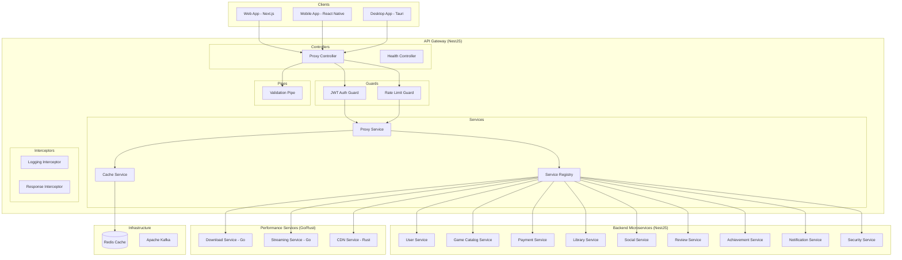

# Design Document - API Gateway

## Overview

API Gateway служит единой точкой входа для российской игровой платформы, обеспечивая маршрутизацию REST API запросов, JWT аутентификацию, rate limiting и стандартизацию ответов. Реализован с использованием единого технологического стека для максимального переиспользования кода и упрощения поддержки.

**Технологический стек:**
- **Framework**: NestJS (встроенная поддержка микросервисов, DI, декораторы)
- **Runtime**: Node.js 18+ / TypeScript
- **База данных**: Redis (кеширование, rate limiting, сессии)
- **Тестирование**: Jest + Supertest (встроенные в NestJS)
- **Документация**: Swagger/OpenAPI (автогенерация)
- **Контейнеризация**: Docker + Kubernetes готовность

## Architecture

### NestJS Модульная Архитектура



## Components and Interfaces

### NestJS Controllers

#### ProxyController
```typescript
@Controller('api')
@UseGuards(RateLimitGuard)
@UseInterceptors(LoggingInterceptor, ResponseInterceptor)
export class ProxyController {
  @Get('*')
  @UseGuards(OptionalAuthGuard)
  async handleGetRequest(@Req() request: Request, @Res() response: Response): Promise<any>
  
  @Post('*')
  @UseGuards(AuthGuard)
  @UsePipes(ValidationPipe)
  async handlePostRequest(@Req() request: Request, @Res() response: Response): Promise<any>
  
  @Put('*')
  @UseGuards(AuthGuard)
  @UsePipes(ValidationPipe)
  async handlePutRequest(@Req() request: Request, @Res() response: Response): Promise<any>
  
  @Delete('*')
  @UseGuards(AuthGuard)
  async handleDeleteRequest(@Req() request: Request, @Res() response: Response): Promise<any>
}
```

#### HealthController
```typescript
@Controller('health')
export class HealthController {
  @Get()
  async checkHealth(): Promise<HealthCheckResult>
  
  @Get('services')
  async checkServicesHealth(): Promise<ServiceHealthStatus[]>
}
```

### NestJS Guards

#### JwtAuthGuard
```typescript
@Injectable()
export class JwtAuthGuard implements CanActivate {
  async canActivate(context: ExecutionContext): Promise<boolean>
  private async validateToken(token: string): Promise<User>
  private extractTokenFromHeader(request: Request): string | undefined
}
```

#### RateLimitGuard
```typescript
@Injectable()
export class RateLimitGuard implements CanActivate {
  async canActivate(context: ExecutionContext): Promise<boolean>
  private async checkRateLimit(ip: string, route: string): Promise<boolean>
  private async updateRateLimit(ip: string, route: string): Promise<void>
}
```

### NestJS Services

#### ProxyService
```typescript
@Injectable()
export class ProxyService {
  async forwardRequest(serviceUrl: string, request: ProxyRequest): Promise<ProxyResponse>
  async getServiceUrl(path: string): Promise<string>
  private async makeHttpRequest(url: string, options: RequestOptions): Promise<any>
}
```

#### ServiceRegistryService
```typescript
@Injectable()
export class ServiceRegistryService {
  async registerService(config: ServiceConfig): Promise<void>
  async getServiceConfig(serviceName: string): Promise<ServiceConfig>
  async checkServiceHealth(serviceName: string): Promise<boolean>
  private readonly serviceConfigs: Map<string, ServiceConfig>
}
```

### Route Configuration

#### Public Routes (no authentication required)
```typescript
const PUBLIC_ROUTES = [
  { path: '/api/auth/register', method: 'POST', service: 'user-service' },
  { path: '/api/auth/login', method: 'POST', service: 'user-service' },
  { path: '/api/games', method: 'GET', service: 'game-catalog-service' },
  { path: '/api/games/:id', method: 'GET', service: 'game-catalog-service' },
  { path: '/api/health', method: 'GET', service: 'api-gateway' }
];
```

#### Protected Routes (JWT authentication required)
```typescript
const PROTECTED_ROUTES = [
  { path: '/api/users/profile', method: 'GET', service: 'user-service' },
  { path: '/api/users/profile', method: 'PUT', service: 'user-service' },
  { path: '/api/payments/*', method: '*', service: 'payment-service' },
  { path: '/api/library/*', method: '*', service: 'library-service' },
  { path: '/api/social/*', method: '*', service: 'social-service' },
  { path: '/api/reviews/*', method: '*', service: 'review-service' },
  { path: '/api/achievements/*', method: '*', service: 'achievement-service' },
  { path: '/api/notifications/*', method: '*', service: 'notification-service' },
  { path: '/api/downloads/*', method: '*', service: 'download-service' },
  { path: '/api/security/*', method: '*', service: 'security-service' }
];
```

## Data Models

### TypeScript Interfaces

#### Route Configuration
```typescript
export interface RouteConfig {
  path: string;
  method: HttpMethod;
  service: string;
  requiresAuth: boolean;
  rateLimit?: RateLimitConfig;
  timeout?: number;
}

export enum HttpMethod {
  GET = 'GET',
  POST = 'POST',
  PUT = 'PUT',
  DELETE = 'DELETE',
  PATCH = 'PATCH'
}

export interface RateLimitConfig {
  requests: number;
  windowMs: number;
  skipSuccessfulRequests?: boolean;
  skipFailedRequests?: boolean;
}
```

#### Service Configuration
```typescript
export interface ServiceConfig {
  name: string;
  baseUrl: string;
  timeout: number;
  retries: number;
  healthCheckPath: string;
  circuitBreaker?: CircuitBreakerConfig;
}

export interface CircuitBreakerConfig {
  failureThreshold: number;
  resetTimeout: number;
  monitoringPeriod: number;
}
```

#### Request/Response Models
```typescript
export interface ProxyRequest {
  method: HttpMethod;
  url: string;
  headers: Record<string, string>;
  body?: any;
  query?: Record<string, string>;
  user?: User;
}

export interface ProxyResponse {
  statusCode: number;
  headers: Record<string, string>;
  body: any;
  executionTime: number;
}

export interface User {
  id: string;
  email: string;
  roles: string[];
  permissions: string[];
}
```

#### Health Check Models
```typescript
export interface HealthCheckResult {
  status: 'ok' | 'error';
  timestamp: string;
  uptime: number;
  services: ServiceHealthStatus[];
}

export interface ServiceHealthStatus {
  name: string;
  status: 'healthy' | 'unhealthy' | 'unknown';
  responseTime?: number;
  lastCheck: string;
  error?: string;
}
```

## Error Handling

### NestJS Exception Filters

#### GlobalExceptionFilter
```typescript
@Catch()
export class GlobalExceptionFilter implements ExceptionFilter {
  catch(exception: unknown, host: ArgumentsHost): void
  private handleHttpException(exception: HttpException, response: Response): void
  private handleServiceException(exception: ServiceException, response: Response): void
  private handleUnknownException(exception: Error, response: Response): void
}
```

### Custom Exception Classes
```typescript
export class ServiceUnavailableException extends HttpException {
  constructor(serviceName: string, message?: string) {
    super({
      error: 'SERVICE_UNAVAILABLE',
      message: message || `${serviceName} is temporarily unavailable`,
      service: serviceName,
      statusCode: 503
    }, 503);
  }
}

export class RateLimitExceededException extends HttpException {
  constructor(limit: number, windowMs: number) {
    super({
      error: 'RATE_LIMIT_EXCEEDED',
      message: `Rate limit exceeded: ${limit} requests per ${windowMs}ms`,
      statusCode: 429
    }, 429);
  }
}

export class ProxyTimeoutException extends HttpException {
  constructor(serviceName: string, timeout: number) {
    super({
      error: 'PROXY_TIMEOUT',
      message: `Request to ${serviceName} timed out after ${timeout}ms`,
      service: serviceName,
      statusCode: 504
    }, 504);
  }
}
```

### Standardized Error Response Format
```typescript
export interface ErrorResponse {
  error: string;
  message: string;
  statusCode: number;
  timestamp: string;
  path: string;
  service?: string;
  requestId?: string;
  details?: any;
}
```

### HTTP Status Code Mapping
- `400` - Bad Request (валидация данных)
- `401` - Unauthorized (отсутствует или невалидный токен)
- `403` - Forbidden (недостаточно прав)
- `404` - Not Found (маршрут или ресурс не найден)
- `429` - Too Many Requests (превышен rate limit)
- `500` - Internal Server Error (внутренняя ошибка gateway)
- `502` - Bad Gateway (ошибка upstream сервиса)
- `503` - Service Unavailable (сервис недоступен)
- `504` - Gateway Timeout (таймаут запроса к сервису)

## Testing Strategy

### Unit Tests (Jest)
```typescript
describe('ProxyService', () => {
  describe('forwardRequest', () => {
    it('should forward request to correct service')
    it('should handle service timeout')
    it('should retry failed requests')
  })
})

describe('JwtAuthGuard', () => {
  describe('canActivate', () => {
    it('should allow valid JWT tokens')
    it('should reject invalid tokens')
    it('should handle missing tokens')
  })
})

describe('RateLimitGuard', () => {
  describe('canActivate', () => {
    it('should allow requests within limit')
    it('should block requests exceeding limit')
    it('should reset limits after window expires')
  })
})
```

### Integration Tests (Supertest)
```typescript
describe('API Gateway Integration', () => {
  describe('GET /api/games', () => {
    it('should proxy to game-catalog-service')
    it('should return games list')
    it('should handle service unavailable')
  })
  
  describe('POST /api/users/profile', () => {
    it('should require authentication')
    it('should proxy authenticated requests')
    it('should validate request body')
  })
  
  describe('Rate Limiting', () => {
    it('should enforce rate limits per IP')
    it('should return 429 when limit exceeded')
    it('should include rate limit headers')
  })
})
```

### End-to-End Tests
```typescript
describe('Gateway E2E', () => {
  describe('Authentication Flow', () => {
    it('should complete full auth flow through gateway')
    it('should handle token refresh')
    it('should logout and invalidate tokens')
  })
  
  describe('Service Integration', () => {
    it('should handle requests to all microservices')
    it('should maintain session across services')
    it('should handle service failures gracefully')
  })
})
```

### Performance Tests
- **Load Testing**: 1000 concurrent users для MVP
- **Response Time**: < 200ms для всех операций
- **Basic Stress Testing**: Проверка стабильности под нагрузкой

### Test Coverage Requirements
- **Unit Tests**: 100% coverage всех services, guards, interceptors
- **Integration Tests**: Все API endpoints и middleware
- **E2E Tests**: Критические пользовательские сценарии для MVP
- **Performance Tests**: SLA требования (< 200ms response time)