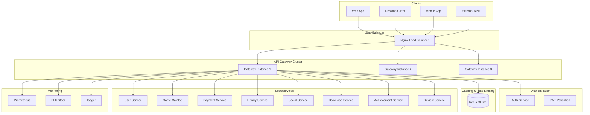
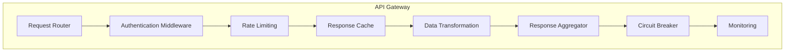
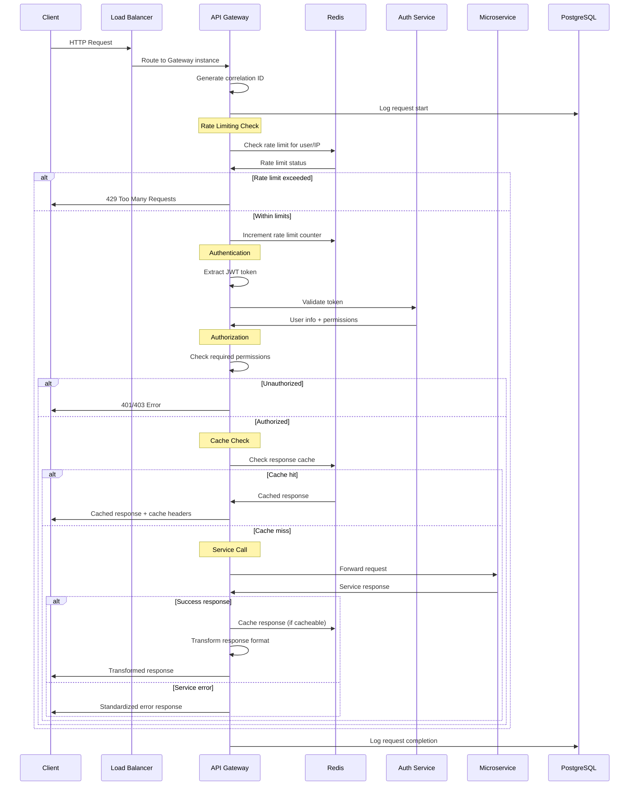
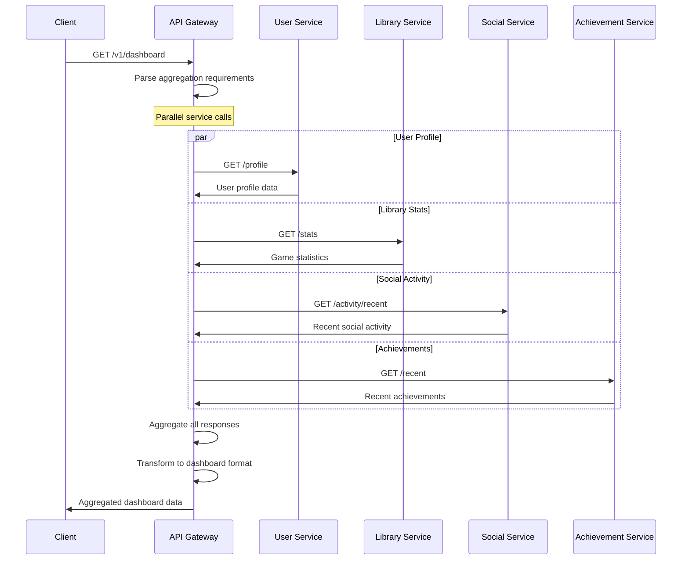
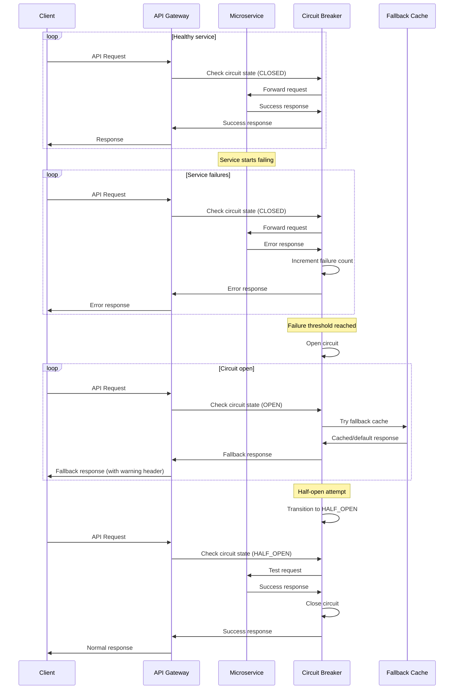
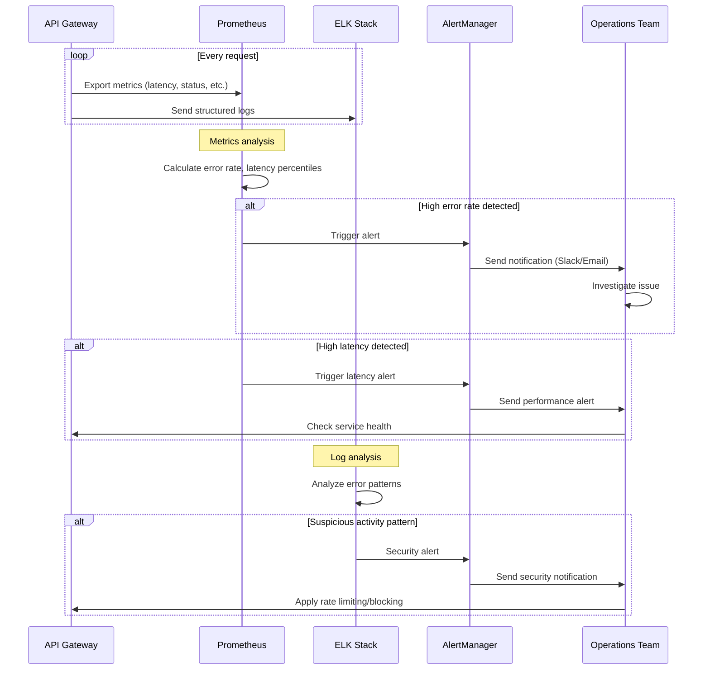

# Дизайн API Gateway

## Обзор

API Gateway является единой точкой входа для всех клиентских приложений российской игровой платформы. Сервис обеспечивает маршрутизацию запросов, аутентификацию, авторизацию, rate limiting, кэширование, агрегацию данных и мониторинг всех API вызовов.

### Ключевые принципы дизайна

- **Единая точка входа**: Все клиенты взаимодействуют только с Gateway
- **Высокая производительность**: Обработка до 100,000 RPS
- **Отказоустойчивость**: Circuit breaker и graceful degradation
- **Безопасность**: Централизованная аутентификация и авторизация
- **Наблюдаемость**: Полное логирование и трейсинг всех запросов

## Архитектура

### Общая архитектура



### Компонентная архитектура



## API Эндпоинты и маршруты

### Структура маршрутизации

```typescript
// Базовая структура URL
// https://api.gaming-platform.ru/v1/{service}/{resource}

// Маршруты пользователей
GET    /v1/users/profile              -> User Service
POST   /v1/users/register             -> User Service
POST   /v1/auth/login                 -> User Service

// Маршруты каталога игр
GET    /v1/games                      -> Game Catalog Service
GET    /v1/games/:id                  -> Game Catalog Service
GET    /v1/search/games               -> Game Catalog Service

// Маршруты библиотеки
GET    /v1/library/games              -> Library Service
POST   /v1/library/collections        -> Library Service
GET    /v1/library/stats              -> Library Service

// Маршруты платежей
POST   /v1/payments                   -> Payment Service
GET    /v1/payments/history           -> Payment Service
POST   /v1/wallet/topup               -> Payment Service

// Маршруты социальных функций
GET    /v1/friends                    -> Social Service
POST   /v1/friends/request            -> Social Service
GET    /v1/chat/conversations         -> Social Service

// Маршруты загрузок
POST   /v1/downloads                  -> Download Service
GET    /v1/downloads/queue            -> Download Service
PUT    /v1/downloads/:id/pause        -> Download Service

// Маршруты достижений
GET    /v1/achievements               -> Achievement Service
GET    /v1/leaderboards               -> Achievement Service
POST   /v1/achievements/events        -> Achievement Service

// Маршруты отзывов
GET    /v1/reviews                    -> Review Service
POST   /v1/reviews                    -> Review Service
GET    /v1/recommendations            -> Review Service

// Агрегированные эндпоинты
GET    /v1/dashboard                  -> Aggregated from multiple services
GET    /v1/user/summary               -> User + Library + Social
GET    /v1/game/:id/details           -> Game Catalog + Reviews + Achievements
```

### Middleware Pipeline

```typescript
interface MiddlewarePipeline {
  // 1. Request Logging
  requestLogger: (req: Request) => void
  
  // 2. CORS Headers
  corsHandler: (req: Request, res: Response) => void
  
  // 3. Rate Limiting
  rateLimiter: (req: Request) => Promise<boolean>
  
  // 4. Authentication
  authenticator: (req: Request) => Promise<User | null>
  
  // 5. Authorization
  authorizer: (req: Request, user: User) => Promise<boolean>
  
  // 6. Request Validation
  validator: (req: Request) => Promise<ValidationResult>
  
  // 7. Cache Check
  cacheChecker: (req: Request) => Promise<CachedResponse | null>
  
  // 8. Service Routing
  router: (req: Request) => Promise<ServiceResponse>
  
  // 9. Response Transformation
  transformer: (response: ServiceResponse) => Promise<APIResponse>
  
  // 10. Response Caching
  cacheWriter: (req: Request, response: APIResponse) => Promise<void>
  
  // 11. Response Logging
  responseLogger: (req: Request, res: Response) => void
}
```

## Модели данных

### Основные интерфейсы

```typescript
interface APIRequest {
  id: string // correlation ID
  method: string
  path: string
  headers: Record<string, string>
  query: Record<string, any>
  body: any
  user?: AuthenticatedUser
  timestamp: Date
  clientInfo: ClientInfo
}

interface APIResponse {
  success: boolean
  data?: any
  error?: APIError
  metadata: ResponseMetadata
  correlationId: string
  timestamp: Date
}

interface APIError {
  code: string
  message: string
  details?: any
  service?: string
  timestamp: Date
}

interface AuthenticatedUser {
  id: string
  username: string
  email: string
  roles: string[]
  permissions: string[]
  sessionId: string
}

interface ClientInfo {
  userAgent: string
  ipAddress: string
  platform: string
  version: string
  deviceId?: string
}

interface ServiceRoute {
  pattern: string
  service: string
  method: string
  requiresAuth: boolean
  permissions: string[]
  rateLimit: RateLimitConfig
  cacheConfig: CacheConfig
  timeout: number
}

interface RateLimitConfig {
  requests: number
  window: string // '1m', '1h', '1d'
  burst?: number
  skipSuccessfulRequests?: boolean
}

interface CacheConfig {
  enabled: boolean
  ttl: number
  varyBy: string[] // ['user', 'query', 'headers']
  invalidateOn: string[] // events that invalidate cache
}
```

## Детальная схема базы данных

```sql
-- Конфигурация маршрутов
CREATE TABLE api_routes (
    id UUID PRIMARY KEY DEFAULT gen_random_uuid(),
    pattern VARCHAR(255) NOT NULL,
    service_name VARCHAR(100) NOT NULL,
    service_url VARCHAR(500) NOT NULL,
    method VARCHAR(10) NOT NULL,
    
    -- Аутентификация
    requires_auth BOOLEAN DEFAULT TRUE,
    required_permissions TEXT[] DEFAULT '{}',
    
    -- Rate limiting
    rate_limit_requests INTEGER DEFAULT 1000,
    rate_limit_window VARCHAR(10) DEFAULT '1h',
    rate_limit_burst INTEGER DEFAULT 100,
    
    -- Кэширование
    cache_enabled BOOLEAN DEFAULT FALSE,
    cache_ttl INTEGER DEFAULT 300, -- секунды
    cache_vary_by TEXT[] DEFAULT '{}',
    
    -- Таймауты
    timeout_seconds INTEGER DEFAULT 30,
    
    -- Статус
    is_active BOOLEAN DEFAULT TRUE,
    
    created_at TIMESTAMP DEFAULT NOW(),
    updated_at TIMESTAMP DEFAULT NOW()
);

-- Логи запросов
CREATE TABLE request_logs (
    id UUID PRIMARY KEY DEFAULT gen_random_uuid(),
    correlation_id VARCHAR(36) NOT NULL,
    
    -- Запрос
    method VARCHAR(10) NOT NULL,
    path VARCHAR(1000) NOT NULL,
    query_params JSONB DEFAULT '{}',
    headers JSONB DEFAULT '{}',
    
    -- Пользователь
    user_id UUID,
    session_id VARCHAR(255),
    
    -- Клиент
    ip_address INET NOT NULL,
    user_agent TEXT,
    client_platform VARCHAR(50),
    client_version VARCHAR(20),
    
    -- Маршрутизация
    target_service VARCHAR(100),
    service_response_time INTEGER, -- миллисекунды
    
    -- Ответ
    status_code INTEGER NOT NULL,
    response_size INTEGER DEFAULT 0,
    
    -- Ошибки
    error_code VARCHAR(50),
    error_message TEXT,
    
    -- Производительность
    total_time INTEGER NOT NULL, -- миллисекунды
    cache_hit BOOLEAN DEFAULT FALSE,
    
    created_at TIMESTAMP DEFAULT NOW()
);

-- Rate limiting
CREATE TABLE rate_limits (
    id UUID PRIMARY KEY DEFAULT gen_random_uuid(),
    key_type VARCHAR(20) NOT NULL, -- 'user', 'ip', 'api_key'
    key_value VARCHAR(255) NOT NULL,
    route_pattern VARCHAR(255) NOT NULL,
    
    -- Лимиты
    requests_count INTEGER DEFAULT 0,
    window_start TIMESTAMP NOT NULL,
    window_end TIMESTAMP NOT NULL,
    
    -- Статус
    is_blocked BOOLEAN DEFAULT FALSE,
    blocked_until TIMESTAMP,
    
    created_at TIMESTAMP DEFAULT NOW(),
    updated_at TIMESTAMP DEFAULT NOW(),
    
    UNIQUE(key_type, key_value, route_pattern, window_start)
);

-- Кэш ответов (метаданные, сами данные в Redis)
CREATE TABLE response_cache (
    id UUID PRIMARY KEY DEFAULT gen_random_uuid(),
    cache_key VARCHAR(255) UNIQUE NOT NULL,
    
    -- Запрос
    method VARCHAR(10) NOT NULL,
    path VARCHAR(1000) NOT NULL,
    query_hash VARCHAR(64) NOT NULL,
    
    -- Кэш
    ttl INTEGER NOT NULL,
    expires_at TIMESTAMP NOT NULL,
    
    -- Метаданные
    content_type VARCHAR(100),
    content_size INTEGER,
    
    created_at TIMESTAMP DEFAULT NOW()
);

-- Статистика сервисов
CREATE TABLE service_stats (
    id UUID PRIMARY KEY DEFAULT gen_random_uuid(),
    service_name VARCHAR(100) NOT NULL,
    date DATE NOT NULL,
    hour INTEGER NOT NULL CHECK (hour >= 0 AND hour <= 23),
    
    -- Запросы
    total_requests INTEGER DEFAULT 0,
    successful_requests INTEGER DEFAULT 0,
    failed_requests INTEGER DEFAULT 0,
    
    -- Производительность
    avg_response_time INTEGER DEFAULT 0,
    p95_response_time INTEGER DEFAULT 0,
    p99_response_time INTEGER DEFAULT 0,
    
    -- Ошибки
    error_4xx_count INTEGER DEFAULT 0,
    error_5xx_count INTEGER DEFAULT 0,
    timeout_count INTEGER DEFAULT 0,
    
    created_at TIMESTAMP DEFAULT NOW(),
    
    UNIQUE(service_name, date, hour)
);

-- Индексы для производительности
CREATE INDEX idx_request_logs_correlation ON request_logs(correlation_id);
CREATE INDEX idx_request_logs_user_time ON request_logs(user_id, created_at DESC);
CREATE INDEX idx_request_logs_service_time ON request_logs(target_service, created_at DESC);
CREATE INDEX idx_request_logs_status_time ON request_logs(status_code, created_at DESC);
CREATE INDEX idx_request_logs_ip_time ON request_logs(ip_address, created_at DESC);

CREATE INDEX idx_rate_limits_key ON rate_limits(key_type, key_value, window_end);
CREATE INDEX idx_rate_limits_cleanup ON rate_limits(window_end) WHERE window_end < NOW();

CREATE INDEX idx_response_cache_expires ON response_cache(expires_at);
CREATE INDEX idx_response_cache_key ON response_cache(cache_key);

CREATE INDEX idx_service_stats_service_date ON service_stats(service_name, date DESC, hour DESC);

-- Функция для очистки старых данных
CREATE OR REPLACE FUNCTION cleanup_old_gateway_data()
RETURNS void AS $$
BEGIN
    -- Удаляем старые логи запросов (старше 30 дней)
    DELETE FROM request_logs WHERE created_at < NOW() - INTERVAL '30 days';
    
    -- Удаляем просроченные rate limits
    DELETE FROM rate_limits WHERE window_end < NOW() - INTERVAL '1 day';
    
    -- Удаляем просроченный кэш
    DELETE FROM response_cache WHERE expires_at < NOW();
    
    -- Агрегируем старую статистику (старше 7 дней) в дневную
    INSERT INTO service_stats (service_name, date, hour, total_requests, successful_requests, failed_requests, avg_response_time)
    SELECT 
        target_service,
        DATE(created_at),
        -1, -- специальное значение для дневной агрегации
        COUNT(*),
        COUNT(*) FILTER (WHERE status_code < 400),
        COUNT(*) FILTER (WHERE status_code >= 400),
        AVG(total_time)::INTEGER
    FROM request_logs 
    WHERE created_at < NOW() - INTERVAL '7 days'
    GROUP BY target_service, DATE(created_at)
    ON CONFLICT (service_name, date, hour) DO NOTHING;
END;
$$ LANGUAGE plpgsql;
```

## User Flows (Пользовательские сценарии)

### 1. Обработка API запроса



### 2. Агрегация данных от нескольких сервисов



### 3. Circuit Breaker Pattern



### 4. Мониторинг и алертинг



Этот дизайн обеспечивает высокопроизводительный, безопасный и наблюдаемый API Gateway для российской игровой платформы с поддержкой всех необходимых функций маршрутизации, аутентификации, кэширования и мониторинга.