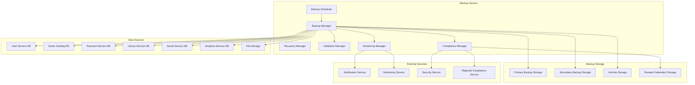
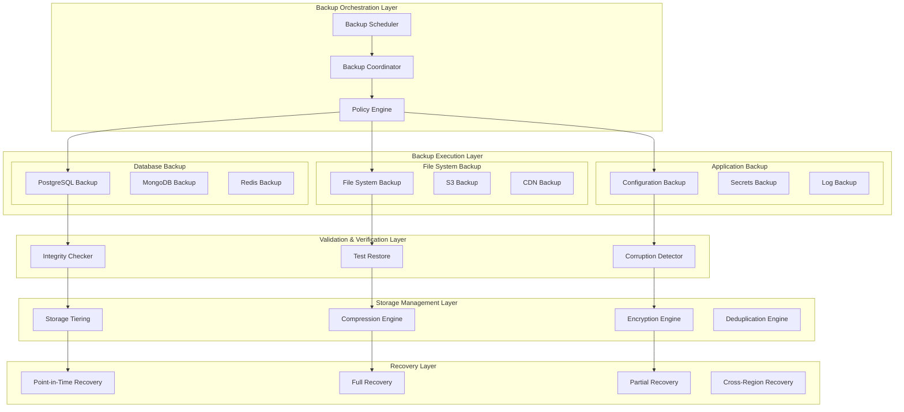

# Архитектурный дизайн - Backup Service

## Обзор

Backup Service является критически важным компонентом российской Steam-платформы, обеспечивающим надежное резервное копирование и восстановление всех данных системы. Сервис гарантирует соблюдение российского законодательства о хранении данных, обеспечивает высокую доступность и быстрое восстановление после сбоев.

## Архитектура

### Высокоуровневая архитектура



### Компонентная архитектура



## Компоненты и интерфейсы

### 1. Backup Scheduler

**Назначение:** Управление расписанием резервного копирования и оркестрация процессов.

**Основные компоненты:**
- Cron-based Scheduler - планирование по расписанию
- Event-driven Scheduler - резервное копирование по событиям
- Priority Queue Manager - управление приоритетами задач
- Resource Allocator - распределение ресурсов

**API Endpoints:**
```typescript
POST /api/v1/backup/schedule
GET /api/v1/backup/schedules
PUT /api/v1/backup/schedules/{scheduleId}
DELETE /api/v1/backup/schedules/{scheduleId}
POST /api/v1/backup/trigger/{backupType}
```

### 2. Backup Manager

**Назначение:** Выполнение резервного копирования различных типов данных.

**Основные компоненты:**
- Database Backup Engine - резервное копирование БД
- File System Backup Engine - резервное копирование файлов
- Incremental Backup Manager - инкрементальное копирование
- Snapshot Manager - создание снимков системы

**API Endpoints:**
```typescript
POST /api/v1/backup/database/{serviceId}
POST /api/v1/backup/files/{path}
POST /api/v1/backup/incremental/{backupId}
POST /api/v1/backup/snapshot
GET /api/v1/backup/status/{backupId}
```

### 3. Recovery Manager

**Назначение:** Восстановление данных из резервных копий.

**Основные компоненты:**
- Point-in-Time Recovery - восстановление на определенный момент
- Full System Recovery - полное восстановление системы
- Selective Recovery - выборочное восстановление
- Cross-Region Recovery - восстановление между регионами

**API Endpoints:**
```typescript
POST /api/v1/recovery/point-in-time
POST /api/v1/recovery/full-system
POST /api/v1/recovery/selective
GET /api/v1/recovery/status/{recoveryId}
GET /api/v1/recovery/available-backups
```

### 4. Validation Manager

**Назначение:** Проверка целостности и валидности резервных копий.

**Основные компоненты:**
- Integrity Checker - проверка целостности файлов
- Corruption Detector - обнаружение повреждений
- Test Restore Engine - тестовое восстановление
- Backup Verification - верификация резервных копий

**API Endpoints:**
```typescript
POST /api/v1/validation/integrity/{backupId}
POST /api/v1/validation/test-restore/{backupId}
GET /api/v1/validation/report/{backupId}
POST /api/v1/validation/verify-all
```

### 5. Compliance Manager

**Назначение:** Обеспечение соответствия российскому законодательству.

**Основные компоненты:**
- Data Residency Controller - контроль местонахождения данных
- Retention Policy Manager - управление политиками хранения
- Audit Logger - логирование для аудита
- Legal Hold Manager - юридическое удержание данных

**API Endpoints:**
```typescript
GET /api/v1/compliance/data-residency/{userId}
POST /api/v1/compliance/retention-policy
GET /api/v1/compliance/audit-log
POST /api/v1/compliance/legal-hold
```

## Модели данных

### Backup Job Model
```typescript
interface BackupJob {
  id: string;
  name: string;
  type: BackupType;
  source: BackupSource;
  destination: BackupDestination;
  schedule: BackupSchedule;
  policy: BackupPolicy;
  status: BackupStatus;
  metadata: BackupMetadata;
  createdAt: Date;
  updatedAt: Date;
  lastRunAt?: Date;
  nextRunAt?: Date;
}

enum BackupType {
  FULL = 'full',
  INCREMENTAL = 'incremental',
  DIFFERENTIAL = 'differential',
  SNAPSHOT = 'snapshot'
}

interface BackupSource {
  type: SourceType;
  connectionString: string;
  databases?: string[];
  paths?: string[];
  filters?: BackupFilter[];
}

enum SourceType {
  POSTGRESQL = 'postgresql',
  MONGODB = 'mongodb',
  REDIS = 'redis',
  FILE_SYSTEM = 'file_system',
  S3_BUCKET = 's3_bucket'
}

interface BackupDestination {
  primary: StorageLocation;
  secondary?: StorageLocation;
  archive?: StorageLocation;
}

interface StorageLocation {
  type: StorageType;
  endpoint: string;
  bucket: string;
  region: string;
  encryption: EncryptionConfig;
}

enum StorageType {
  S3_COMPATIBLE = 's3_compatible',
  LOCAL_STORAGE = 'local_storage',
  NETWORK_STORAGE = 'network_storage',
  CLOUD_STORAGE = 'cloud_storage'
}
```

### Backup Record Model
```typescript
interface BackupRecord {
  id: string;
  jobId: string;
  type: BackupType;
  status: BackupRecordStatus;
  startTime: Date;
  endTime?: Date;
  duration?: number;
  size: number;
  compressedSize: number;
  compressionRatio: number;
  checksum: string;
  location: StorageLocation;
  metadata: BackupRecordMetadata;
  validationResults?: ValidationResult[];
  retentionUntil: Date;
}

enum BackupRecordStatus {
  RUNNING = 'running',
  COMPLETED = 'completed',
  FAILED = 'failed',
  VALIDATING = 'validating',
  VALIDATED = 'validated',
  CORRUPTED = 'corrupted',
  EXPIRED = 'expired'
}

interface BackupRecordMetadata {
  sourceVersion: string;
  backupVersion: string;
  includedTables?: string[];
  includedFiles?: string[];
  excludedPatterns?: string[];
  compressionAlgorithm: string;
  encryptionAlgorithm: string;
}
```

### Recovery Request Model
```typescript
interface RecoveryRequest {
  id: string;
  type: RecoveryType;
  backupId: string;
  targetLocation: RecoveryTarget;
  options: RecoveryOptions;
  status: RecoveryStatus;
  requestedBy: string;
  requestedAt: Date;
  startedAt?: Date;
  completedAt?: Date;
  progress: RecoveryProgress;
  logs: RecoveryLog[];
}

enum RecoveryType {
  FULL_SYSTEM = 'full_system',
  DATABASE_ONLY = 'database_only',
  FILES_ONLY = 'files_only',
  POINT_IN_TIME = 'point_in_time',
  SELECTIVE = 'selective'
}

interface RecoveryTarget {
  type: TargetType;
  location: string;
  credentials?: string;
}

enum TargetType {
  SAME_LOCATION = 'same_location',
  ALTERNATE_LOCATION = 'alternate_location',
  NEW_ENVIRONMENT = 'new_environment'
}

interface RecoveryOptions {
  pointInTime?: Date;
  selectedTables?: string[];
  selectedFiles?: string[];
  overwriteExisting: boolean;
  validateAfterRestore: boolean;
}
```

### Compliance Record Model
```typescript
interface ComplianceRecord {
  id: string;
  userId?: string;
  dataType: DataType;
  location: DataLocation;
  retentionPeriod: number;
  legalHold: boolean;
  auditTrail: AuditEntry[];
  createdAt: Date;
  expiresAt: Date;
}

enum DataType {
  USER_DATA = 'user_data',
  GAME_DATA = 'game_data',
  PAYMENT_DATA = 'payment_data',
  SYSTEM_DATA = 'system_data'
}

interface DataLocation {
  region: string;
  country: string;
  dataCenter: string;
  compliantWithLaws: string[];
}

interface AuditEntry {
  action: AuditAction;
  timestamp: Date;
  userId: string;
  details: Record<string, any>;
}

enum AuditAction {
  BACKUP_CREATED = 'backup_created',
  BACKUP_ACCESSED = 'backup_accessed',
  BACKUP_RESTORED = 'backup_restored',
  BACKUP_DELETED = 'backup_deleted',
  RETENTION_APPLIED = 'retention_applied'
}
```

## Стратегии резервного копирования

### 1. Database Backup Strategy

**PostgreSQL:**
```typescript
interface PostgreSQLBackupStrategy {
  method: 'pg_dump' | 'pg_basebackup' | 'wal_archiving';
  compression: boolean;
  parallelJobs: number;
  excludeTables?: string[];
  customFormat: boolean;
}

// Пример конфигурации
const postgresConfig: PostgreSQLBackupStrategy = {
  method: 'pg_basebackup',
  compression: true,
  parallelJobs: 4,
  customFormat: true
};
```

**MongoDB:**
```typescript
interface MongoDBBackupStrategy {
  method: 'mongodump' | 'filesystem_snapshot' | 'cloud_backup';
  oplogReplay: boolean;
  collections?: string[];
  query?: Record<string, any>;
  gzip: boolean;
}
```

**Redis:**
```typescript
interface RedisBackupStrategy {
  method: 'rdb_snapshot' | 'aof_backup';
  saveInterval: number;
  compressionLevel: number;
  backgroundSave: boolean;
}
```

### 2. File System Backup Strategy

```typescript
interface FileSystemBackupStrategy {
  method: 'rsync' | 'tar' | 'snapshot';
  compression: CompressionConfig;
  deduplication: boolean;
  incrementalBased: boolean;
  excludePatterns: string[];
  followSymlinks: boolean;
}

interface CompressionConfig {
  algorithm: 'gzip' | 'lz4' | 'zstd';
  level: number;
  blockSize: number;
}
```

### 3. Retention Policies

```typescript
interface RetentionPolicy {
  name: string;
  rules: RetentionRule[];
  complianceRequirements: ComplianceRequirement[];
}

interface RetentionRule {
  backupType: BackupType;
  keepDaily: number;
  keepWeekly: number;
  keepMonthly: number;
  keepYearly: number;
  archiveAfterDays: number;
  deleteAfterDays: number;
}

interface ComplianceRequirement {
  jurisdiction: string;
  minimumRetention: number;
  maximumRetention?: number;
  dataResidency: string[];
  encryptionRequired: boolean;
}

// Пример политики для российских пользователей
const russianUserPolicy: RetentionPolicy = {
  name: 'Russian User Data Policy',
  rules: [{
    backupType: BackupType.FULL,
    keepDaily: 7,
    keepWeekly: 4,
    keepMonthly: 12,
    keepYearly: 7,
    archiveAfterDays: 90,
    deleteAfterDays: 2555 // 7 лет согласно российскому законодательству
  }],
  complianceRequirements: [{
    jurisdiction: 'RU',
    minimumRetention: 2555,
    dataResidency: ['RU'],
    encryptionRequired: true
  }]
};
```

## Безопасность и шифрование

### Encryption at Rest
```typescript
interface EncryptionConfig {
  algorithm: 'AES-256-GCM' | 'ChaCha20-Poly1305';
  keyManagement: KeyManagementConfig;
  compressionBeforeEncryption: boolean;
}

interface KeyManagementConfig {
  provider: 'aws_kms' | 'azure_key_vault' | 'hashicorp_vault' | 'local_hsm';
  keyRotationPeriod: number;
  masterKeyId: string;
  dataKeySpec: string;
}
```

### Encryption in Transit
```typescript
interface TransitEncryptionConfig {
  protocol: 'TLS_1_3';
  certificateValidation: boolean;
  mutualTLS: boolean;
  cipherSuites: string[];
}
```

### Access Control
```typescript
interface BackupAccessControl {
  rbac: RoleBasedAccessControl;
  mfa: MultiFactorAuthentication;
  auditLogging: boolean;
  sessionTimeout: number;
}

interface RoleBasedAccessControl {
  roles: BackupRole[];
  permissions: BackupPermission[];
  roleAssignments: RoleAssignment[];
}

enum BackupRole {
  BACKUP_ADMIN = 'backup_admin',
  BACKUP_OPERATOR = 'backup_operator',
  RECOVERY_SPECIALIST = 'recovery_specialist',
  COMPLIANCE_OFFICER = 'compliance_officer',
  READ_ONLY = 'read_only'
}

enum BackupPermission {
  CREATE_BACKUP = 'create_backup',
  DELETE_BACKUP = 'delete_backup',
  RESTORE_DATA = 'restore_data',
  VIEW_BACKUPS = 'view_backups',
  MANAGE_SCHEDULES = 'manage_schedules',
  ACCESS_AUDIT_LOGS = 'access_audit_logs'
}
```

## Мониторинг и алертинг

### Метрики для мониторинга
```typescript
interface BackupMetrics {
  // Операционные метрики
  backupSuccessRate: number;
  backupDuration: number;
  backupSize: number;
  compressionRatio: number;
  
  // Производительность
  throughput: number;
  iops: number;
  networkUtilization: number;
  storageUtilization: number;
  
  // Надежность
  corruptionRate: number;
  recoveryTime: number;
  recoverySuccessRate: number;
  
  // Соответствие требованиям
  complianceViolations: number;
  retentionPolicyViolations: number;
  dataResidencyViolations: number;
}
```

### Алерты
```typescript
interface BackupAlert {
  id: string;
  type: AlertType;
  severity: AlertSeverity;
  message: string;
  details: Record<string, any>;
  timestamp: Date;
  resolved: boolean;
  resolvedAt?: Date;
}

enum AlertType {
  BACKUP_FAILED = 'backup_failed',
  BACKUP_DELAYED = 'backup_delayed',
  CORRUPTION_DETECTED = 'corruption_detected',
  STORAGE_FULL = 'storage_full',
  COMPLIANCE_VIOLATION = 'compliance_violation',
  RECOVERY_FAILED = 'recovery_failed'
}

enum AlertSeverity {
  CRITICAL = 'critical',
  HIGH = 'high',
  MEDIUM = 'medium',
  LOW = 'low',
  INFO = 'info'
}
```

## Disaster Recovery

### RTO и RPO цели
```typescript
interface DisasterRecoveryObjectives {
  rto: number; // Recovery Time Objective в минутах
  rpo: number; // Recovery Point Objective в минутах
  serviceLevel: ServiceLevel;
}

enum ServiceLevel {
  CRITICAL = 'critical',    // RTO: 15 min, RPO: 5 min
  HIGH = 'high',           // RTO: 1 hour, RPO: 15 min
  MEDIUM = 'medium',       // RTO: 4 hours, RPO: 1 hour
  LOW = 'low'             // RTO: 24 hours, RPO: 4 hours
}

// Конфигурация для критических сервисов
const criticalServiceDR: DisasterRecoveryObjectives = {
  rto: 15, // 15 минут
  rpo: 5,  // 5 минут
  serviceLevel: ServiceLevel.CRITICAL
};
```

### Disaster Recovery Plan
```typescript
interface DisasterRecoveryPlan {
  id: string;
  name: string;
  scope: DRScope;
  procedures: DRProcedure[];
  contacts: EmergencyContact[];
  testSchedule: TestSchedule;
  lastTested: Date;
  nextTest: Date;
}

interface DRProcedure {
  step: number;
  description: string;
  estimatedTime: number;
  dependencies: string[];
  automationScript?: string;
  manualSteps?: string[];
}

enum DRScope {
  FULL_SYSTEM = 'full_system',
  CRITICAL_SERVICES = 'critical_services',
  DATA_ONLY = 'data_only',
  SPECIFIC_SERVICE = 'specific_service'
}
```

## Производительность и оптимизация

### Backup Performance Optimization
```typescript
interface PerformanceConfig {
  parallelism: ParallelismConfig;
  compression: CompressionConfig;
  deduplication: DeduplicationConfig;
  networkOptimization: NetworkConfig;
}

interface ParallelismConfig {
  maxConcurrentJobs: number;
  threadsPerJob: number;
  ioThreads: number;
  networkThreads: number;
}

interface DeduplicationConfig {
  enabled: boolean;
  blockSize: number;
  algorithm: 'sha256' | 'blake2b';
  compressionAfterDedup: boolean;
}

interface NetworkConfig {
  bandwidth: number;
  compression: boolean;
  tcpWindowSize: number;
  bufferSize: number;
}
```

### Storage Tiering
```typescript
interface StorageTier {
  name: string;
  type: StorageTierType;
  costPerGB: number;
  accessTime: number;
  durability: number;
  availability: number;
  retentionRules: TierRetentionRule[];
}

enum StorageTierType {
  HOT = 'hot',           // Быстрый доступ, высокая стоимость
  WARM = 'warm',         // Средний доступ, средняя стоимость
  COLD = 'cold',         // Медленный доступ, низкая стоимость
  ARCHIVE = 'archive'    // Очень медленный доступ, очень низкая стоимость
}

interface TierRetentionRule {
  moveToTierAfterDays: number;
  targetTier: StorageTierType;
  conditions?: TierCondition[];
}
```

## Интеграции с внешними сервисами

### Notification Service Integration
```typescript
interface NotificationIntegration {
  sendBackupCompletionNotification(backupId: string, status: BackupStatus): Promise<void>;
  sendBackupFailureAlert(backupId: string, error: string): Promise<void>;
  sendRecoveryStatusUpdate(recoveryId: string, progress: number): Promise<void>;
  sendComplianceViolationAlert(violation: ComplianceViolation): Promise<void>;
}
```

### Monitoring Service Integration
```typescript
interface MonitoringIntegration {
  reportBackupMetrics(metrics: BackupMetrics): Promise<void>;
  createAlert(alert: BackupAlert): Promise<void>;
  updateServiceHealth(health: ServiceHealth): Promise<void>;
  recordPerformanceMetrics(metrics: PerformanceMetrics): Promise<void>;
}
```

### Security Service Integration
```typescript
interface SecurityIntegration {
  validateBackupAccess(userId: string, backupId: string): Promise<boolean>;
  auditBackupOperation(operation: BackupOperation): Promise<void>;
  encryptBackupData(data: Buffer, keyId: string): Promise<Buffer>;
  decryptBackupData(encryptedData: Buffer, keyId: string): Promise<Buffer>;
}
```

## Тестирование

### Backup Testing Strategy
```typescript
interface BackupTestPlan {
  testTypes: BackupTestType[];
  schedule: TestSchedule;
  successCriteria: TestCriteria[];
  automationLevel: number;
}

enum BackupTestType {
  INTEGRITY_TEST = 'integrity_test',
  RESTORE_TEST = 'restore_test',
  PERFORMANCE_TEST = 'performance_test',
  DISASTER_RECOVERY_TEST = 'disaster_recovery_test',
  COMPLIANCE_TEST = 'compliance_test'
}

interface TestCriteria {
  metric: string;
  expectedValue: number;
  tolerance: number;
  critical: boolean;
}
```

### Automated Testing
```typescript
interface AutomatedBackupTest {
  id: string;
  name: string;
  type: BackupTestType;
  schedule: string; // cron expression
  testData: TestDataSet;
  validationRules: ValidationRule[];
  notifications: TestNotification[];
}

interface TestDataSet {
  size: number;
  complexity: TestComplexity;
  dataTypes: DataType[];
  syntheticData: boolean;
}

enum TestComplexity {
  SIMPLE = 'simple',
  MODERATE = 'moderate',
  COMPLEX = 'complex',
  ENTERPRISE = 'enterprise'
}
```

## Развертывание и DevOps

### Containerization
```dockerfile
FROM alpine:3.18
RUN apk add --no-cache \
    postgresql-client \
    mongodb-tools \
    redis-tools \
    rsync \
    gzip \
    openssl \
    python3 \
    py3-pip

WORKDIR /app
COPY requirements.txt .
RUN pip3 install -r requirements.txt

COPY . .
EXPOSE 8080
CMD ["python3", "app.py"]
```

### Kubernetes Deployment
```yaml
apiVersion: apps/v1
kind: Deployment
metadata:
  name: backup-service
spec:
  replicas: 2
  selector:
    matchLabels:
      app: backup-service
  template:
    metadata:
      labels:
        app: backup-service
    spec:
      containers:
      - name: backup-service
        image: backup-service:latest
        ports:
        - containerPort: 8080
        env:
        - name: BACKUP_STORAGE_ENDPOINT
          valueFrom:
            secretKeyRef:
              name: backup-secrets
              key: storage-endpoint
        resources:
          requests:
            memory: "1Gi"
            cpu: "500m"
          limits:
            memory: "4Gi"
            cpu: "2000m"
        volumeMounts:
        - name: backup-storage
          mountPath: /backup-storage
      volumes:
      - name: backup-storage
        persistentVolumeClaim:
          claimName: backup-storage-pvc
```

## Roadmap

### Фаза 1 (MVP) - 2 месяца
- Базовое резервное копирование PostgreSQL и файлов
- Простое восстановление
- Базовое соответствие российскому законодательству

### Фаза 2 (Расширение) - 4 месяца
- Инкрементальное резервное копирование
- Автоматизированное тестирование восстановления
- Продвинутое шифрование и сжатие
- Мониторинг и алертинг

### Фаза 3 (Продвинутые функции) - 6 месяцев
- Cross-region репликация
- AI-powered оптимизация
- Автоматическое disaster recovery
- Продвинутая аналитика и отчетность

### Будущие инновации
- Blockchain-based integrity verification
- Quantum-resistant encryption
- AI-powered predictive failure detection
- Zero-trust backup architecture