# Дизайн Blockchain Service

## Обзор

Blockchain Service обеспечивает интеграцию российской Steam-платформы с блокчейн-технологиями, включая создание и управление NFT-предметами, поддержку криптовалютных платежей, децентрализованную торговлю и соблюдение российского законодательства в области цифровых активов.

## Архитектура

### Высокоуровневая архитектура

```mermaid
graph TB
    subgraph "Blockchain Service"
        API[Blockchain API Gateway]
        NFT[NFT Manager]
        CRYPTO[Crypto Payment Processor]
        MARKET[Decentralized Marketplace]
        WALLET[Wallet Service]
        COMPLIANCE[Compliance Engine]
        BRIDGE[Blockchain Bridge]
    end
    
    subgraph "Blockchain Networks"
        ETH[Ethereum Mainnet]
        POLYGON[Polygon L2]
        BSC[Binance Smart Chain]
        TON[TON Blockchain]
    end
    
    subgraph "External Services"
        EXCHANGE[Crypto Exchanges]
        ORACLE[Price Oracles]
        KYC[KYC/AML Service]
        TAX[Tax Reporting]
    end
    
    subgraph "Internal Services"
        USER[User Service]
        PAYMENT[Payment Service]
        GAME[Game Catalog]
        SECURITY[Security Service]
    end
    
    API --> NFT
    API --> CRYPTO
    API --> MARKET
    API --> WALLET
    API --> COMPLIANCE
    
    BRIDGE --> ETH
    BRIDGE --> POLYGON
    BRIDGE --> BSC
    BRIDGE --> TON
    
    CRYPTO --> EXCHANGE
    CRYPTO --> ORACLE
    COMPLIANCE --> KYC
    COMPLIANCE --> TAX
    
    API --> USER
    API --> PAYMENT
    API --> GAME
    API --> SECURITY
```



### Микросервисная архитектура

Blockchain Service состоит из следующих основных компонентов:

1. **Blockchain API Gateway** - единая точка входа для блокчейн-операций
2. **NFT Manager** - управление NFT-предметами и коллекциями
3. **Crypto Payment Processor** - обработка криптовалютных платежей
4. **Decentralized Marketplace** - децентрализованная торговая площадка
5. **Wallet Service** - управление кошельками пользователей
6. **Compliance Engine** - соблюдение российского законодательства
7. **Blockchain Bridge** - интеграция с различными блокчейн-сетями

## Компоненты и интерфейсы

### Blockchain API Gateway

**Назначение:** Централизованная точка доступа ко всем блокчейн-операциям

**Основные функции:**
- Маршрутизация запросов к соответствующим блокчейн-сервисам
- Аутентификация и авторизация блокчейн-операций
- Rate limiting для предотвращения спама
- Кэширование блокчейн-данных
- Мониторинг и логирование транзакций

**API Endpoints:**
```
POST /api/v1/nft/create
GET /api/v1/nft/{tokenId}
POST /api/v1/crypto/payment
GET /api/v1/wallet/balance
POST /api/v1/marketplace/list
GET /api/v1/compliance/status
```

### NFT Manager

**Назначение:** Создание, управление и верификация NFT-предметов

**Основные функции:**
- Создание NFT-токенов для игровых предметов
- Управление метаданными NFT
- Верификация подлинности NFT
- Интеграция с игровыми активами
- Batch операции для массового создания

**Поддерживаемые стандарты:**
- ERC-721 для уникальных NFT
- ERC-1155 для полу-взаимозаменяемых токенов
- Кастомные стандарты для игровых предметов

**Метаданные NFT:**
```json
{
  "name": "Legendary Sword of Fire",
  "description": "Rare weapon from RPG Game",
  "image": "https://cdn.steam.ru/nft/sword_fire.png",
  "attributes": [
    {"trait_type": "Rarity", "value": "Legendary"},
    {"trait_type": "Game", "value": "Fantasy RPG"},
    {"trait_type": "Type", "value": "Weapon"}
  ],
  "game_id": "game_123",
  "creator": "0x...",
  "created_at": "2025-08-24T10:00:00Z"
}
```

### Crypto Payment Processor

**Назначение:** Обработка криптовалютных платежей

**Поддерживаемые криптовалюты:**
- Bitcoin (BTC)
- Ethereum (ETH)
- Tether (USDT)
- USD Coin (USDC)
- Российские стейблкоины (при наличии)

**Основные функции:**
- Генерация адресов для платежей
- Мониторинг входящих транзакций
- Конвертация курсов в реальном времени
- Интеграция с российскими криптобиржами
- Автоматическое подтверждение платежей

**Процесс платежа:**
1. Пользователь выбирает криптооплату
2. Система генерирует уникальный адрес
3. Пользователь отправляет криптовалюту
4. Система ожидает подтверждения в блокчейне
5. После подтверждения активируется покупка

### Decentralized Marketplace

**Назначение:** Децентрализованная торговая площадка для NFT

**Основные функции:**
- Создание смарт-контрактов для торговли
- Автоматическое исполнение сделок
- Система репутации продавцов
- Механизм арбитража через DAO
- Интеграция с внешними NFT-маркетплейсами

**Смарт-контракт торговли:**
```solidity
contract NFTMarketplace {
    struct Listing {
        address seller;
        uint256 tokenId;
        uint256 price;
        bool active;
    }
    
    mapping(uint256 => Listing) public listings;
    
    function listNFT(uint256 tokenId, uint256 price) external;
    function buyNFT(uint256 tokenId) external payable;
    function cancelListing(uint256 tokenId) external;
}
```

### Wallet Service

**Назначение:** Управление криптокошельками пользователей

**Типы кошельков:**
- Custodial кошельки (управляемые платформой)
- Non-custodial кошельки (пользовательские)
- Multi-signature кошельки для безопасности
- Hardware wallet интеграция

**Основные функции:**
- Создание и управление кошельками
- Безопасное хранение приватных ключей
- Подписание транзакций
- Резервное копирование seed фраз
- Интеграция с внешними кошельками (MetaMask, Trust Wallet)

### Compliance Engine

**Назначение:** Соблюдение российского законодательства

**Основные функции:**
- KYC/AML проверки для криптоопераций
- Отчетность в налоговые органы
- Мониторинг санкционных списков
- Ограничения по суммам операций
- Классификация цифровых активов

**Российские требования:**
- Уведомление о криптооперациях свыше 600,000 рублей
- Запрет на использование криптовалют как средства платежа
- Классификация NFT как цифровых прав
- Соблюдение валютного законодательства

### Blockchain Bridge

**Назначение:** Интеграция с различными блокчейн-сетями

**Поддерживаемые сети:**
- Ethereum (основная сеть для NFT)
- Polygon (Layer 2 для дешевых транзакций)
- Binance Smart Chain (альтернативная сеть)
- TON (российский блокчейн)

**Основные функции:**
- Абстракция различий между блокчейнами
- Cross-chain переводы активов
- Оптимизация газовых комиссий
- Автоматический выбор оптимальной сети

## Модели данных

### NFT Token
```json
{
  "token_id": "string",
  "contract_address": "0x...",
  "blockchain": "ethereum",
  "owner": "0x...",
  "creator": "0x...",
  "metadata": {
    "name": "string",
    "description": "string",
    "image": "string",
    "attributes": []
  },
  "game_id": "string",
  "created_at": "2025-08-24T10:00:00Z",
  "last_transfer": "2025-08-24T10:00:00Z",
  "verified": true
}
```

### Crypto Payment
```json
{
  "payment_id": "string",
  "user_id": "string",
  "cryptocurrency": "BTC",
  "amount_crypto": "0.001",
  "amount_rub": "2500.00",
  "exchange_rate": "2500000.00",
  "wallet_address": "bc1q...",
  "transaction_hash": "string",
  "confirmations": 6,
  "status": "confirmed",
  "created_at": "2025-08-24T10:00:00Z",
  "confirmed_at": "2025-08-24T10:30:00Z"
}
```

### Marketplace Listing
```json
{
  "listing_id": "string",
  "nft_token_id": "string",
  "seller": "0x...",
  "price_eth": "0.1",
  "price_rub": "25000.00",
  "currency": "ETH",
  "status": "active",
  "smart_contract": "0x...",
  "created_at": "2025-08-24T10:00:00Z",
  "expires_at": "2025-09-24T10:00:00Z"
}
```

### User Wallet
```json
{
  "wallet_id": "string",
  "user_id": "string",
  "wallet_type": "custodial",
  "addresses": {
    "ethereum": "0x...",
    "bitcoin": "bc1q...",
    "polygon": "0x..."
  },
  "balances": {
    "ETH": "1.5",
    "BTC": "0.01",
    "USDT": "1000.0"
  },
  "created_at": "2025-08-24T10:00:00Z",
  "last_updated": "2025-08-24T12:00:00Z"
}
```

## Обработка ошибок

### Стратегии обработки ошибок

1. **Blockchain Network Errors**
   - Retry с экспоненциальной задержкой
   - Fallback на альтернативные сети
   - Graceful degradation при недоступности блокчейна

2. **Transaction Failures**
   - Автоматический resubmit с увеличенным gas
   - Уведомление пользователя о статусе
   - Возврат средств при неудачных транзакциях

3. **Smart Contract Errors**
   - Валидация перед отправкой транзакций
   - Simulation транзакций
   - Emergency pause механизмы

### Коды ошибок

```
BLOCKCHAIN_001: Network unavailable
BLOCKCHAIN_002: Insufficient gas fee
BLOCKCHAIN_003: Transaction failed
BLOCKCHAIN_004: Invalid wallet address
BLOCKCHAIN_005: NFT not found
BLOCKCHAIN_006: Insufficient balance
BLOCKCHAIN_007: Compliance violation
BLOCKCHAIN_008: Smart contract error
BLOCKCHAIN_009: Price oracle unavailable
BLOCKCHAIN_010: KYC verification required
```

## Стратегия тестирования

### Unit Testing
- Тестирование смарт-контрактов с Hardhat/Truffle
- Мокирование блокчейн-взаимодействий
- Валидация криптографических операций

### Integration Testing
- Тестирование на тестовых сетях (Goerli, Mumbai)
- Интеграция с реальными криптобиржами в sandbox
- End-to-end тестирование NFT операций

### Security Testing
- Аудит смарт-контрактов
- Penetration testing кошельков
- Тестирование на reentrancy атаки
- Проверка приватности данных

### Performance Testing
- Load testing для высоких нагрузок
- Тестирование газовых оптимизаций
- Benchmark различных блокчейн-сетей

## Безопасность

### Криптографическая безопасность
- Использование проверенных криптографических библиотек
- Secure key generation и storage
- Hardware Security Modules (HSM) для критических ключей
- Multi-signature схемы для больших сумм

### Smart Contract Security
- Формальная верификация контрактов
- Ограничения на gas usage
- Emergency pause функциональность
- Upgradeable proxy patterns

### Wallet Security
- Encrypted storage приватных ключей
- Biometric authentication
- Transaction signing с подтверждением
- Cold storage для больших сумм

### Compliance Security
- Encrypted хранение KYC данных
- Audit trails для всех операций
- Secure communication с регуляторами
- Data retention policies

## Мониторинг и метрики

### Blockchain Metrics
- Transaction success rate
- Average confirmation time
- Gas price optimization
- Network congestion monitoring

### Business Metrics
- NFT creation и trading volume
- Crypto payment conversion rates
- User wallet adoption
- Marketplace activity

### Security Metrics
- Failed authentication attempts
- Suspicious transaction patterns
- Smart contract vulnerabilities
- Compliance violations

### Performance Metrics
- API response times
- Blockchain sync status
- Wallet operation latency
- Cross-chain bridge performance

## Соответствие российскому законодательству

### Криптовалютное законодательство
- Соблюдение ФЗ "О цифровых финансовых активах"
- Уведомления в Росфинмониторинг
- Ограничения на использование криптовалют
- Налоговая отчетность

### NFT регулирование
- Классификация NFT как цифровых прав
- Соблюдение авторских прав
- Защита прав потребителей
- Антимонопольное законодательство

### Валютное законодательство
- Соблюдение валютного законодательства РФ
- Ограничения на валютные операции
- Уведомления о движении средств
- CRS отчетность

## Масштабирование

### Layer 2 Solutions
- Polygon для дешевых NFT операций
- Optimistic Rollups для Ethereum
- State channels для микроплатежей
- Sidechains для игровых активов

### Caching Strategy
- Redis для блокчейн-данных
- IPFS для NFT метаданных
- CDN для изображений NFT
- Database caching для часто запрашиваемых данных

### Load Balancing
- Multiple blockchain nodes
- Geographic distribution
- Failover mechanisms
- Auto-scaling based on transaction volume