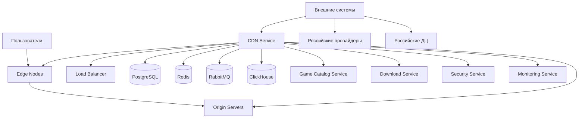
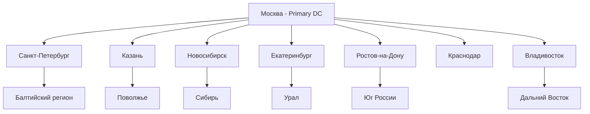

# Дизайн CDN Service

## Обзор

CDN Service управляет сетью доставки контента для российской игровой платформы, обеспечивая быструю загрузку игр, обновлений и медиа-контента пользователям по всей России и СНГ. Сервис оптимизирован для работы с российскими интернет-провайдерами и соблюдения требований локализации данных.

### Расширенная функциональность включает:

- **Расширенная архитектура хранения медиафайлов**: S3-compatible, MinIO, Yandex Object Storage с ГОСТ шифрованием и 3x репликацией
- **Специализированное хранение по типам**: Дедупликация игровых файлов, оптимизация скриншотов, транскодирование видео, кэширование аватаров
- **Система доступа к файлам**: Прямой доступ, CDN, потоковый доступ, защищенные токены, гранулярные права
- **Оптимизация и сжатие медиафайлов**: WebP, AVIF, H.265, AV1 с адаптивным битрейтом и автоматическим выбором качества
- **Географическое распределение контента**: Geo-proximity маршрутизация, автоматический failover, мониторинг здоровья узлов
- **Безопасность и соответствие требованиям**: Сканирование на вирусы, ГОСТ-совместимое шифрование, аудит доступа

## Архитектура

### Высокоуровневая архитектура



### Географическое распределение



### Компоненты сервиса

#### Основные компоненты
1. **Content Distribution Manager** - управление распределением контента
2. **Edge Node Controller** - управление граничными узлами
3. **Cache Management System** - управление кэшированием
4. **Load Balancer** - балансировка нагрузки
5. **Analytics Engine** - аналитика использования CDN
6. **Security Layer** - защита от атак и злоупотреблений
7. **P2P Coordinator** - координация P2P доставки

#### Расширенные компоненты
8. **Media Storage Manager** - управление специализированным хранением медиафайлов
9. **File Access Controller** - контроль доступа к файлам с авторизацией
10. **Media Optimization Engine** - оптимизация и сжатие медиафайлов
11. **Geographic Distribution Manager** - географическое распределение контента
12. **Security & Compliance Manager** - безопасность и соответствие требованиям
13. **Performance Analytics Engine** - расширенная аналитика производительности

## Компоненты и интерфейсы

### API Endpoints

#### Управление контентом
- `POST /api/v1/content/upload` - загрузка контента на CDN
- `DELETE /api/v1/content/{contentId}` - удаление контента
- `POST /api/v1/content/{contentId}/invalidate` - инвалидация кэша
- `GET /api/v1/content/{contentId}/status` - статус распространения
- `POST /api/v1/content/preload` - предварительная загрузка контента

#### Управление узлами
- `GET /api/v1/nodes` - список всех CDN узлов
- `GET /api/v1/nodes/{nodeId}/status` - статус узла
- `POST /api/v1/nodes/{nodeId}/enable` - включить узел
- `POST /api/v1/nodes/{nodeId}/disable` - отключить узел
- `GET /api/v1/nodes/{nodeId}/metrics` - метрики узла

#### Аналитика и мониторинг
- `GET /api/v1/analytics/traffic` - статистика трафика
- `GET /api/v1/analytics/performance` - метрики производительности
- `GET /api/v1/analytics/geographic` - географическое распределение
- `GET /api/v1/analytics/costs` - анализ затрат

#### Конфигурация
- `GET /api/v1/config/routing` - правила маршрутизации
- `PUT /api/v1/config/routing` - обновление правил
- `GET /api/v1/config/cache` - настройки кэширования
- `PUT /api/v1/config/cache` - обновление кэша

### Event-Driven Architecture

#### Входящие события
```typescript
interface ContentUploadEvent {
  contentId: string;
  contentType: 'game' | 'update' | 'media' | 'asset';
  size: number;
  checksum: string;
  priority: 'low' | 'medium' | 'high' | 'critical';
  regions: string[];
  timestamp: Date;
}

interface NodeStatusEvent {
  nodeId: string;
  status: 'online' | 'offline' | 'degraded';
  metrics: {
    cpu: number;
    memory: number;
    disk: number;
    bandwidth: number;
  };
  timestamp: Date;
}
```

#### Исходящие события
```typescript
interface ContentDistributedEvent {
  contentId: string;
  nodeIds: string[];
  distributionTime: number;
  success: boolean;
  errors?: string[];
  timestamp: Date;
}

interface CacheInvalidatedEvent {
  contentId: string;
  nodeIds: string[];
  reason: string;
  timestamp: Date;
}
```

## Расширенные компоненты и интерфейсы

### 1. Media Storage Manager (Новый)

```typescript
interface MediaStorageManager {
  // Основное хранилище
  configureMainStorage(config: MainStorageConfiguration): Promise<StorageSetupResult>
  setupReplication(replicationConfig: ReplicationConfiguration): Promise<ReplicationResult>
  
  // CDN провайдеры
  configureCDNProvider(provider: CDNProvider, config: CDNConfiguration): Promise<CDNSetupResult>
  switchCDNProvider(fromProvider: CDNProvider, toProvider: CDNProvider): Promise<SwitchResult>
  
  // Кэширование
  setupCacheLayer(cacheConfig: CacheLayerConfiguration): Promise<CacheSetupResult>
  optimizeCacheStrategy(fileType: FileType, accessPattern: AccessPattern): Promise<CacheOptimization>
  
  // Географическое распределение
  selectOptimalNodes(userLocation: GeoLocation, fileType: FileType): Promise<OptimalNode[]>
  balanceStorageLoad(nodes: CDNNode[]): Promise<LoadBalanceResult>
}

interface MainStorageConfiguration {
  type: 's3-compatible' | 'minio' | 'yandex-object-storage'
  encryption: 'gost-28147-89' | 'aes-256'
  replicationFactor: number
  backupSchedule: BackupSchedule
  retentionPolicy: RetentionPolicy
}

interface CDNConfiguration {
  provider: 'cloudflare' | 'yandex-cdn' | 'vk-cloud'
  cachingStrategy: 'aggressive' | 'smart' | 'minimal'
  geoDistribution: GeoDistributionConfig
  securitySettings: CDNSecuritySettings
}
```

### 2. Specialized File Storage (Новый)

```typescript
interface SpecializedFileStorage {
  // Игровые файлы
  storeGameFiles(gameId: string, files: GameFile[]): Promise<GameStorageResult>
  enableDeduplication(gameId: string): Promise<DeduplicationResult>
  compressGameAssets(gameId: string, compressionLevel: number): Promise<CompressionResult>
  
  // Скриншоты
  optimizeScreenshots(screenshots: Screenshot[]): Promise<ScreenshotOptimization>
  generateThumbnails(imageId: string, sizes: ThumbnailSize[]): Promise<ThumbnailGeneration>
  
  // Видео
  transcodeVideo(videoId: string, formats: VideoFormat[]): Promise<TranscodingResult>
  generateVideoThumbnails(videoId: string, timestamps: number[]): Promise<VideoThumbnailResult>
  
  // Аватары
  processAvatar(userId: string, avatarFile: File): Promise<AvatarProcessingResult>
  createAvatarVariants(avatarId: string, variants: AvatarVariant[]): Promise<AvatarVariantResult>
  
  // Билды игр
  storeLargeGameBuild(gameId: string, buildData: GameBuildData): Promise<BuildStorageResult>
  createDeltaPatches(gameId: string, fromVersion: string, toVersion: string): Promise<DeltaPatchResult>
}

interface GameFile {
  id: string
  name: string
  size: number
  checksum: string
  type: 'executable' | 'asset' | 'config' | 'data'
  compressionType?: 'zip' | 'lz4' | 'zstd'
}

interface Screenshot {
  id: string
  originalUrl: string
  format: 'png' | 'jpg' | 'webp'
  resolution: Resolution
  quality: number
}
```

### 3. File Access Controller (Новый)

```typescript
interface FileAccessController {
  // Типы доступа
  provideDirectAccess(fileId: string, userId: string): Promise<DirectAccessResult>
  provideCDNAccess(fileId: string, userId: string): Promise<CDNAccessResult>
  provideStreamingAccess(fileId: string, userId: string): Promise<StreamingAccessResult>
  enableDownloadAccess(fileId: string, userId: string): Promise<DownloadAccessResult>
  
  // Авторизованный доступ
  generateSecureToken(fileId: string, userId: string, permissions: FilePermission[]): Promise<SecureToken>
  createPresignedURL(fileId: string, expirationTime: number): Promise<PresignedURL>
  validateTemporaryToken(token: string): Promise<TokenValidation>
  
  // Управление правами
  setFilePermissions(fileId: string, permissions: FilePermission[]): Promise<PermissionResult>
  checkUserAccess(userId: string, fileId: string, action: FileAction): Promise<AccessCheckResult>
  
  // Региональные ограничения
  applyRegionalRestrictions(fileId: string, restrictions: RegionalRestriction[]): Promise<RestrictionResult>
  checkRegionalAccess(userId: string, fileId: string): Promise<RegionalAccessResult>
  
  // Потоковая загрузка
  initializeStreamingSession(fileId: string, userId: string): Promise<StreamingSession>
  handleResumableDownload(fileId: string, userId: string, resumeToken: string): Promise<ResumableDownload>
}

interface FilePermission {
  action: 'read' | 'download' | 'stream' | 'share'
  scope: 'public' | 'authenticated' | 'owner' | 'premium'
  expiresAt?: Date
}

interface SecureToken {
  token: string
  fileId: string
  userId: string
  permissions: FilePermission[]
  expiresAt: Date
  ipRestrictions?: string[]
}
```

### 4. Media Optimization Engine (Новый)

```typescript
interface MediaOptimizationEngine {
  // Оптимизация изображений
  optimizeImage(imageId: string, targetFormat: ImageFormat, quality: number): Promise<ImageOptimization>
  selectOptimalFormat(imageData: ImageData, userAgent: string): Promise<OptimalFormatResult>
  generateResponsiveImages(imageId: string, breakpoints: number[]): Promise<ResponsiveImageSet>
  
  // Сжатие видео
  compressVideo(videoId: string, codec: VideoCodec, bitrate: number): Promise<VideoCompression>
  createAdaptiveBitrate(videoId: string, bitrates: number[]): Promise<AdaptiveBitrateResult>
  
  // Аудио обработка
  compressAudio(audioId: string, format: AudioFormat, quality: AudioQuality): Promise<AudioCompression>
  normalizeAudioLevels(audioId: string): Promise<AudioNormalization>
  
  // Превью и миниатюры
  generateImageThumbnails(imageId: string, sizes: ThumbnailSize[]): Promise<ThumbnailGeneration>
  createVideoPreview(videoId: string, duration: number): Promise<VideoPreview>
  
  // Адаптивная доставка
  selectQualityBasedOnConnection(fileId: string, connectionSpeed: number): Promise<QualitySelection>
  optimizeForDevice(fileId: string, deviceType: DeviceType): Promise<DeviceOptimization>
}

enum ImageFormat {
  WEBP = 'webp',
  AVIF = 'avif',
  JPEG = 'jpeg',
  PNG = 'png'
}

enum VideoCodec {
  H264 = 'h264',
  H265 = 'h265',
  AV1 = 'av1',
  VP9 = 'vp9'
}
```

### 5. Geographic Distribution Manager (Новый)

```typescript
interface GeographicDistributionManager {
  // Маршрутизация
  determineOptimalRoute(userLocation: GeoLocation, fileId: string): Promise<OptimalRoute>
  configureGeoProximityRouting(rules: GeoProximityRule[]): Promise<RoutingConfiguration>
  setupLatencyBasedRouting(latencyThresholds: LatencyThreshold[]): Promise<LatencyRoutingResult>
  optimizeCostBasedRouting(costParameters: CostParameter[]): Promise<CostOptimizationResult>
  
  // Управление узлами
  deployRegionalNodes(regions: Region[], nodeConfig: NodeConfiguration): Promise<RegionalDeployment>
  configureFailoverNodes(primaryNodes: CDNNode[], backupNodes: CDNNode[]): Promise<FailoverConfiguration>
  
  // Мониторинг здоровья
  monitorNodeHealth(nodeId: string): Promise<HealthMonitoringResult>
  performHealthChecks(nodes: CDNNode[]): Promise<HealthCheckResult[]>
  
  // Автоматический failover
  handleNodeFailure(failedNodeId: string): Promise<FailoverResult>
  redistributeTraffic(fromNodeId: string, toNodeIds: string[]): Promise<TrafficRedistribution>
  restoreFailedNode(nodeId: string): Promise<NodeRestoration>
}

interface OptimalRoute {
  primaryNode: CDNNode
  backupNodes: CDNNode[]
  estimatedLatency: number
  estimatedBandwidth: number
  routingMethod: 'geo-proximity' | 'latency-based' | 'cost-optimized'
}

interface GeoProximityRule {
  region: Region
  primaryNodes: string[]
  backupNodes: string[]
  priority: number
}
```

### 6. Security & Compliance Manager (Новый)

```typescript
interface SecurityComplianceManager {
  // Сканирование файлов
  scanFileForViruses(fileId: string): Promise<VirusScanResult>
  performMalwareDetection(fileId: string): Promise<MalwareDetectionResult>
  
  // Соответствие требованиям
  validateContentCompliance(fileId: string, region: string): Promise<ComplianceValidation>
  checkRussianLegislationCompliance(fileId: string): Promise<LegislationComplianceResult>
  
  // Шифрование
  encryptFileWithGOST(fileId: string): Promise<GOSTEncryptionResult>
  setupEndToEndEncryption(fileId: string, recipientKey: string): Promise<E2EEncryptionResult>
  
  // Аудит доступа
  logFileAccess(userId: string, fileId: string, action: string, metadata: AccessMetadata): Promise<AuditLogResult>
  generateAccessReport(fileId: string, period: DateRange): Promise<AccessReport>
  
  // Изоляция угроз
  isolateSuspiciousFile(fileId: string, reason: string): Promise<FileIsolationResult>
  quarantineInfectedFile(fileId: string, threatInfo: ThreatInfo): Promise<QuarantineResult>
  notifySecurityIncident(incident: SecurityIncident): Promise<IncidentNotification>
}

interface VirusScanResult {
  fileId: string
  scanStatus: 'clean' | 'infected' | 'suspicious' | 'error'
  threats: ThreatInfo[]
  scanEngine: string
  scanTime: Date
  quarantineRequired: boolean
}

interface ComplianceValidation {
  fileId: string
  region: string
  isCompliant: boolean
  violations: ComplianceViolation[]
  recommendations: string[]
  lastChecked: Date
}
```

### API Endpoints для новой функциональности

```typescript
// Media Storage Management
POST   /api/v1/storage/configure        // Настройка основного хранилища
POST   /api/v1/storage/replicate        // Настройка репликации
GET    /api/v1/storage/status           // Статус хранилища

// Specialized File Storage
POST   /api/v1/files/games/upload       // Загрузка игровых файлов
POST   /api/v1/files/screenshots/optimize // Оптимизация скриншотов
POST   /api/v1/files/videos/transcode   // Транскодирование видео
POST   /api/v1/files/avatars/process    // Обработка аватаров

// File Access Control
POST   /api/v1/access/token/generate    // Генерация токена доступа
POST   /api/v1/access/url/presigned     // Создание предподписанного URL
GET    /api/v1/access/permissions/{fileId} // Права доступа к файлу
PUT    /api/v1/access/permissions/{fileId} // Обновление прав доступа

// Media Optimization
POST   /api/v1/optimize/image/{imageId} // Оптимизация изображения
POST   /api/v1/optimize/video/{videoId} // Сжатие видео
POST   /api/v1/optimize/audio/{audioId} // Сжатие аудио
GET    /api/v1/optimize/recommendations/{fileId} // Рекомендации по оптимизации

// Geographic Distribution
GET    /api/v1/geo/route/optimal        // Оптимальный маршрут
POST   /api/v1/geo/nodes/deploy         // Развертывание региональных узлов
GET    /api/v1/geo/health/{nodeId}      // Здоровье узла
POST   /api/v1/geo/failover/{nodeId}    // Переключение при сбое

// Security & Compliance
POST   /api/v1/security/scan/{fileId}   // Сканирование файла
GET    /api/v1/compliance/check/{fileId} // Проверка соответствия
POST   /api/v1/security/encrypt/{fileId} // Шифрование файла
GET    /api/v1/audit/access/{fileId}    // Аудит доступа к файлу
```
```

## Модели данных

### Основные сущности

#### CDNNode (CDN узел)
```typescript
interface CDNNode {
  id: string;
  name: string;
  location: {
    country: string;
    region: string;
    city: string;
    coordinates: { lat: number; lng: number };
  };
  provider: string;
  capacity: {
    storage: number;
    bandwidth: number;
    connections: number;
  };
  status: 'online' | 'offline' | 'maintenance' | 'degraded';
  healthScore: number;
  lastHealthCheck: Date;
  configuration: NodeConfiguration;
  createdAt: Date;
  updatedAt: Date;
}

interface NodeConfiguration {
  cacheRules: CacheRule[];
  routingRules: RoutingRule[];
  securityRules: SecurityRule[];
  limits: {
    maxFileSize: number;
    maxConcurrentConnections: number;
    bandwidthLimit: number;
  };
}
```

#### Content (Контент)
```typescript
interface Content {
  id: string;
  name: string;
  type: ContentType;
  size: number;
  checksum: string;
  mimeType: string;
  metadata: {
    gameId?: string;
    version?: string;
    tags: string[];
    description?: string;
  };
  distributionStatus: DistributionStatus;
  nodes: ContentDistribution[];
  uploadedAt: Date;
  lastAccessedAt: Date;
  accessCount: number;
  ttl?: number;
}

interface ContentDistribution {
  nodeId: string;
  status: 'pending' | 'distributing' | 'available' | 'failed';
  distributedAt?: Date;
  lastVerified?: Date;
  hitCount: number;
  bandwidth: number;
}

enum ContentType {
  GAME_INSTALLER = 'game_installer',
  GAME_UPDATE = 'game_update',
  GAME_ASSET = 'game_asset',
  MEDIA_IMAGE = 'media_image',
  MEDIA_VIDEO = 'media_video',
  MEDIA_AUDIO = 'media_audio'
}
```

#### CacheRule (Правило кэширования)
```typescript
interface CacheRule {
  id: string;
  name: string;
  pattern: string;
  contentTypes: ContentType[];
  ttl: number;
  priority: number;
  conditions: {
    fileSize?: { min?: number; max?: number };
    accessFrequency?: number;
    regions?: string[];
  };
  actions: {
    cache: boolean;
    compress: boolean;
    preload: boolean;
  };
  isActive: boolean;
}
```

#### RoutingRule (Правило маршрутизации)
```typescript
interface RoutingRule {
  id: string;
  name: string;
  conditions: {
    userLocation?: string[];
    contentType?: ContentType[];
    fileSize?: { min?: number; max?: number };
    timeOfDay?: { start: string; end: string };
  };
  actions: {
    preferredNodes: string[];
    fallbackNodes: string[];
    loadBalancingMethod: 'round_robin' | 'least_connections' | 'geographic' | 'performance';
  };
  priority: number;
  isActive: boolean;
}
```

### Схема базы данных

```sql
-- CDN узлы
CREATE TABLE cdn_nodes (
    id UUID PRIMARY KEY DEFAULT gen_random_uuid(),
    name VARCHAR(255) NOT NULL,
    location JSONB NOT NULL,
    provider VARCHAR(100) NOT NULL,
    capacity JSONB NOT NULL,
    status node_status NOT NULL DEFAULT 'offline',
    health_score DECIMAL(3,2) DEFAULT 0,
    last_health_check TIMESTAMP,
    configuration JSONB NOT NULL,
    created_at TIMESTAMP DEFAULT NOW(),
    updated_at TIMESTAMP DEFAULT NOW()
);

-- Контент
CREATE TABLE content (
    id UUID PRIMARY KEY DEFAULT gen_random_uuid(),
    name VARCHAR(500) NOT NULL,
    type content_type NOT NULL,
    size BIGINT NOT NULL,
    checksum VARCHAR(128) NOT NULL,
    mime_type VARCHAR(100),
    metadata JSONB,
    distribution_status distribution_status DEFAULT 'pending',
    uploaded_at TIMESTAMP DEFAULT NOW(),
    last_accessed_at TIMESTAMP,
    access_count BIGINT DEFAULT 0,
    ttl INTEGER
);

-- Распределение контента по узлам
CREATE TABLE content_distribution (
    id UUID PRIMARY KEY DEFAULT gen_random_uuid(),
    content_id UUID NOT NULL REFERENCES content(id),
    node_id UUID NOT NULL REFERENCES cdn_nodes(id),
    status distribution_node_status DEFAULT 'pending',
    distributed_at TIMESTAMP,
    last_verified TIMESTAMP,
    hit_count BIGINT DEFAULT 0,
    bandwidth_used BIGINT DEFAULT 0,
    UNIQUE(content_id, node_id)
);

-- Правила кэширования
CREATE TABLE cache_rules (
    id UUID PRIMARY KEY DEFAULT gen_random_uuid(),
    name VARCHAR(255) NOT NULL,
    pattern VARCHAR(500) NOT NULL,
    content_types content_type[],
    ttl INTEGER NOT NULL,
    priority INTEGER DEFAULT 0,
    conditions JSONB,
    actions JSONB NOT NULL,
    is_active BOOLEAN DEFAULT TRUE,
    created_at TIMESTAMP DEFAULT NOW()
);

-- Правила маршрутизации
CREATE TABLE routing_rules (
    id UUID PRIMARY KEY DEFAULT gen_random_uuid(),
    name VARCHAR(255) NOT NULL,
    conditions JSONB NOT NULL,
    actions JSONB NOT NULL,
    priority INTEGER DEFAULT 0,
    is_active BOOLEAN DEFAULT TRUE,
    created_at TIMESTAMP DEFAULT NOW()
);

-- Метрики узлов
CREATE TABLE node_metrics (
    id UUID PRIMARY KEY DEFAULT gen_random_uuid(),
    node_id UUID NOT NULL REFERENCES cdn_nodes(id),
    timestamp TIMESTAMP NOT NULL,
    cpu_usage DECIMAL(5,2),
    memory_usage DECIMAL(5,2),
    disk_usage DECIMAL(5,2),
    bandwidth_in BIGINT,
    bandwidth_out BIGINT,
    connections_active INTEGER,
    requests_per_second INTEGER,
    cache_hit_ratio DECIMAL(5,2)
);

-- Логи доступа (партиционированная таблица)
CREATE TABLE access_logs (
    id UUID DEFAULT gen_random_uuid(),
    timestamp TIMESTAMP NOT NULL,
    node_id UUID NOT NULL,
    content_id UUID,
    user_ip INET,
    user_agent TEXT,
    request_method VARCHAR(10),
    request_path TEXT,
    response_status INTEGER,
    response_size BIGINT,
    response_time INTEGER,
    cache_status VARCHAR(20)
) PARTITION BY RANGE (timestamp);
```

## Алгоритмы и логика

### Алгоритм выбора узла
```typescript
class NodeSelectionAlgorithm {
  async selectOptimalNode(
    userLocation: Location,
    contentId: string,
    contentType: ContentType
  ): Promise<CDNNode> {
    // 1. Получить доступные узлы
    const availableNodes = await this.getAvailableNodes();
    
    // 2. Применить правила маршрутизации
    const routingRules = await this.getApplicableRoutingRules(contentType);
    let candidateNodes = this.applyRoutingRules(availableNodes, routingRules);
    
    // 3. Фильтрация по географии
    candidateNodes = this.filterByGeography(candidateNodes, userLocation);
    
    // 4. Фильтрация по производительности
    candidateNodes = this.filterByPerformance(candidateNodes);
    
    // 5. Выбор оптимального узла
    return this.selectBestNode(candidateNodes, userLocation);
  }
  
  private selectBestNode(nodes: CDNNode[], userLocation: Location): CDNNode {
    return nodes.reduce((best, current) => {
      const bestScore = this.calculateNodeScore(best, userLocation);
      const currentScore = this.calculateNodeScore(current, userLocation);
      return currentScore > bestScore ? current : best;
    });
  }
  
  private calculateNodeScore(node: CDNNode, userLocation: Location): number {
    const distanceScore = this.calculateDistanceScore(node.location, userLocation);
    const performanceScore = node.healthScore;
    const loadScore = this.calculateLoadScore(node);
    
    return (distanceScore * 0.4) + (performanceScore * 0.4) + (loadScore * 0.2);
  }
}
```

### Система кэширования
```typescript
class CacheManager {
  async shouldCache(content: Content, node: CDNNode): Promise<boolean> {
    const rules = await this.getApplicableCacheRules(content);
    
    for (const rule of rules) {
      if (this.matchesRule(content, rule)) {
        return rule.actions.cache;
      }
    }
    
    return this.getDefaultCachePolicy(content);
  }
  
  async invalidateCache(contentId: string, nodes?: string[]): Promise<void> {
    const targetNodes = nodes || await this.getAllNodesWithContent(contentId);
    
    const invalidationTasks = targetNodes.map(nodeId => 
      this.invalidateNodeCache(nodeId, contentId)
    );
    
    await Promise.allSettled(invalidationTasks);
    
    // Отправить событие об инвалидации
    await this.publishCacheInvalidatedEvent(contentId, targetNodes);
  }
}
```

## Обработка ошибок

### Типы ошибок
```typescript
enum CDNErrorCode {
  NODE_UNAVAILABLE = 'NODE_UNAVAILABLE',
  CONTENT_NOT_FOUND = 'CONTENT_NOT_FOUND',
  DISTRIBUTION_FAILED = 'DISTRIBUTION_FAILED',
  CACHE_INVALIDATION_FAILED = 'CACHE_INVALIDATION_FAILED',
  BANDWIDTH_EXCEEDED = 'BANDWIDTH_EXCEEDED',
  STORAGE_FULL = 'STORAGE_FULL',
  GEOGRAPHIC_RESTRICTION = 'GEOGRAPHIC_RESTRICTION'
}

interface CDNError {
  code: CDNErrorCode;
  message: string;
  nodeId?: string;
  contentId?: string;
  details?: Record<string, any>;
  timestamp: Date;
}
```

### Стратегии отказоустойчивости
- **Automatic Failover**: автоматическое переключение на резервные узлы
- **Circuit Breaker**: защита от каскадных сбоев
- **Graceful Degradation**: снижение качества при перегрузке
- **Health Monitoring**: постоянный мониторинг состояния узлов

## Стратегия тестирования

### Unit Tests
- Алгоритмы выбора узлов
- Правила кэширования и маршрутизации
- Логика распределения контента
- Обработка ошибок

### Integration Tests
- Интеграция с CDN провайдерами
- Загрузка и распределение контента
- API endpoints
- Мониторинг и метрики

### Performance Tests
- Нагрузочное тестирование узлов
- Тестирование пропускной способности
- Масштабируемость при росте трафика
- Эффективность кэширования

### Geographic Tests
- Тестирование из разных регионов России
- Проверка соблюдения геоограничений
- Оптимизация для российских провайдеров

## Безопасность

### Защита от атак
- DDoS защита на уровне узлов
- Rate limiting для предотвращения злоупотреблений
- Hotlink protection
- Геоблокировка по требованию

### Соответствие требованиям
- Хранение данных российских пользователей в РФ
- Блокировка контента по требованию регуляторов
- Логирование доступа для аудита
- Шифрование данных в передаче

## Производительность и масштабируемость

### Оптимизация производительности
- Интеллектуальное кэширование на основе паттернов доступа
- Сжатие контента (gzip, brotli)
- HTTP/2 и HTTP/3 поддержка
- Adaptive bitrate для видео контента

### Масштабирование
- Автоматическое добавление узлов при росте нагрузки
- Горизонтальное масштабирование origin серверов
- Динамическое перераспределение контента
- P2P разгрузка для популярного контента

### Мониторинг и метрики
- Real-time мониторинг всех узлов
- Метрики производительности и доступности
- Аналитика использования и затрат
- Предиктивная аналитика для планирования мощностей

## Интеграция с российскими провайдерами

### Оптимизация для российских ISP
```typescript
interface ISPOptimization {
  provider: string;
  peeringPoints: string[];
  cacheServers: string[];
  optimizationRules: {
    preferLocalCache: boolean;
    useProviderCDN: boolean;
    bandwidthLimits: Record<string, number>;
  };
}

class ISPIntegration {
  async optimizeForProvider(userIP: string): Promise<ISPOptimization> {
    const provider = await this.detectISP(userIP);
    return this.getOptimizationConfig(provider);
  }
  
  async useProviderCache(provider: string, content: Content): Promise<boolean> {
    const config = await this.getProviderConfig(provider);
    return config.supportsCaching && this.shouldUseProviderCache(content);
  }
}
```

## P2P система доставки

### P2P координация
```typescript
class P2PCoordinator {
  async shouldUseP2P(content: Content, userLocation: Location): Promise<boolean> {
    // Проверить популярность контента
    const popularity = await this.getContentPopularity(content.id);
    
    // Проверить доступность P2P узлов в регионе
    const p2pNodes = await this.getP2PNodesInRegion(userLocation);
    
    return popularity > this.P2P_THRESHOLD && p2pNodes.length > this.MIN_P2P_NODES;
  }
  
  async coordinateP2PDownload(
    contentId: string,
    userLocation: Location
  ): Promise<P2PDownloadPlan> {
    const peers = await this.findOptimalPeers(contentId, userLocation);
    const chunks = await this.getContentChunks(contentId);
    
    return this.createDownloadPlan(peers, chunks);
  }
}
```