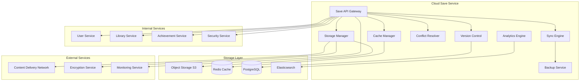

# Дизайн Cloud Save Service

## Обзор

Cloud Save Service обеспечивает надежную синхронизацию игровых сохранений между устройствами пользователей, автоматическое резервное копирование, версионирование и восстановление игрового прогресса с поддержкой офлайн-режима и семейных аккаунтов.

## Архитектура

### Высокоуровневая архитектура



### Микросервисная архитектура

Cloud Save Service состоит из следующих основных компонентов:

1. **Save API Gateway** - единая точка входа для всех операций с сохранениями
2. **Sync Engine** - ядро синхронизации между устройствами
3. **Storage Manager** - управление хранением файлов сохранений
4. **Version Control** - система версионирования сохранений
5. **Conflict Resolver** - разрешение конфликтов при синхронизации
6. **Cache Manager** - кэширование для офлайн-режима
7. **Backup Service** - резервное копирование и disaster recovery
8. **Analytics Engine** - аналитика использования сохранений

## Компоненты и интерфейсы

### Save API Gateway

**Назначение:** Централизованная точка доступа ко всем операциям с сохранениями

**Основные функции:**
- Аутентификация и авторизация пользователей
- Rate limiting для предотвращения злоупотреблений
- Маршрутизация запросов к соответствующим сервисам
- Валидация входных данных
- Мониторинг и логирование операций

**API Endpoints:**
```
POST /api/v1/saves/upload
GET /api/v1/saves/download/{gameId}
GET /api/v1/saves/list/{gameId}
POST /api/v1/saves/sync
DELETE /api/v1/saves/{saveId}
GET /api/v1/saves/versions/{saveId}
POST /api/v1/saves/restore/{versionId}
GET /api/v1/saves/conflicts/{gameId}
POST /api/v1/saves/resolve-conflict
```

### Sync Engine

**Назначение:** Ядро синхронизации сохранений между устройствами

**Алгоритмы синхронизации:**
- Last-Write-Wins для простых случаев
- Three-way merge для сложных конфликтов
- Delta sync для больших файлов
- Batch sync для множественных сохранений

**Основные функции:**
- Детекция изменений в сохранениях
- Дифференциальная синхронизация
- Обработка офлайн-изменений
- Приоритизация критических сохранений

**Процесс синхронизации:**
1. Клиент отправляет хеш локальных сохранений
2. Сервер сравнивает с облачными версиями
3. Определяются файлы для загрузки/скачивания
4. Выполняется дифференциальная синхронизация
5. Обновляются метаданные и версии

### Storage Manager

**Назначение:** Управление хранением файлов сохранений

**Стратегии хранения:**
- Hot storage для активных сохранений (SSD)
- Warm storage для недавних сохранений (HDD)
- Cold storage для архивных сохранений (Glacier)
- Multi-region репликация для disaster recovery

**Основные функции:**
- Загрузка и скачивание файлов сохранений
- Сжатие и дедупликация данных
- Шифрование файлов AES-256
- Управление жизненным циклом данных

**Структура хранения:**
```
/saves/{user_id}/{game_id}/{device_id}/{timestamp}/
├── save.dat (основной файл сохранения)
├── metadata.json (метаданные)
├── checksum.sha256 (контрольная сумма)
└── thumbnail.png (превью сохранения)
```

### Version Control

**Назначение:** Система версионирования сохранений

**Основные функции:**
- Создание снапшотов сохранений
- Хранение истории изменений
- Откат к предыдущим версиям
- Автоматическая очистка старых версий

**Модель версионирования:**
- Каждое сохранение имеет уникальный version_id
- Хранится до 10 последних версий
- Автоматическое удаление версий старше 30 дней
- Возможность создания именованных снапшотов

### Conflict Resolver

**Назначение:** Разрешение конфликтов при синхронизации

**Типы конфликтов:**
- Temporal conflicts (изменения в разное время)
- Device conflicts (изменения на разных устройствах)
- Content conflicts (различия в содержимом)
- Metadata conflicts (различия в метаданных)

**Стратегии разрешения:**
- Автоматическое разрешение для простых случаев
- Пользовательский выбор для сложных конфликтов
- Merge стратегии для совместимых изменений
- Backup конфликтующих версий

### Cache Manager

**Назначение:** Кэширование для офлайн-режима

**Основные функции:**
- Локальное кэширование активных сохранений
- Синхронизация при восстановлении соединения
- Управление размером кэша
- Приоритизация важных сохранений

**Стратегии кэширования:**
- LRU для управления размером кэша
- Prefetching для часто используемых игр
- Compression для экономии места
- Encryption для безопасности

### Backup Service

**Назначение:** Резервное копирование и disaster recovery

**Основные функции:**
- Автоматическое создание резервных копий
- Multi-region репликация
- Point-in-time recovery
- Мониторинг целостности данных

**Стратегии backup:**
- Ежедневные инкрементальные копии
- Еженедельные полные копии
- Ежемесячные архивные копии
- Real-time репликация критических данных

### Analytics Engine

**Назначение:** Аналитика использования сохранений

**Собираемые метрики:**
- Частота синхронизации по играм
- Размеры сохранений и тренды роста
- Географическое распределение пользователей
- Паттерны использования устройств

**Основные функции:**
- Сбор анонимной статистики
- Выявление аномалий в использовании
- Оптимизация производительности
- Прогнозирование нагрузки

## Модели данных

### Save File Metadata
```json
{
  "save_id": "string",
  "user_id": "string",
  "game_id": "string",
  "device_id": "string",
  "version_id": "string",
  "filename": "string",
  "file_size": 1024000,
  "checksum": "sha256_hash",
  "created_at": "2025-08-24T10:00:00Z",
  "updated_at": "2025-08-24T12:00:00Z",
  "last_sync": "2025-08-24T12:00:00Z",
  "is_encrypted": true,
  "compression": "gzip",
  "tags": ["checkpoint", "boss_fight"],
  "thumbnail_url": "https://cdn.steam.ru/saves/thumb.png"
}
```

### Sync Session
```json
{
  "session_id": "string",
  "user_id": "string",
  "device_id": "string",
  "game_id": "string",
  "started_at": "2025-08-24T10:00:00Z",
  "completed_at": "2025-08-24T10:05:00Z",
  "status": "completed",
  "files_uploaded": 3,
  "files_downloaded": 1,
  "bytes_transferred": 5242880,
  "conflicts_detected": 0,
  "errors": []
}
```

### Version History
```json
{
  "version_id": "string",
  "save_id": "string",
  "version_number": 5,
  "created_at": "2025-08-24T10:00:00Z",
  "created_by": "device_123",
  "file_path": "s3://saves/user/game/version5/",
  "file_size": 1024000,
  "changes_description": "Boss defeated, new area unlocked",
  "is_snapshot": false,
  "parent_version": "version_4"
}
```

### Conflict Record
```json
{
  "conflict_id": "string",
  "save_id": "string",
  "user_id": "string",
  "conflict_type": "temporal",
  "detected_at": "2025-08-24T10:00:00Z",
  "resolved_at": null,
  "status": "pending",
  "local_version": "version_5",
  "remote_version": "version_6",
  "resolution_strategy": null,
  "resolved_by": null
}
```

### User Storage Quota
```json
{
  "user_id": "string",
  "total_quota_bytes": 10737418240,
  "used_bytes": 5368709120,
  "available_bytes": 5368709120,
  "quota_type": "premium",
  "last_updated": "2025-08-24T10:00:00Z",
  "games_count": 25,
  "saves_count": 150
}
```

## Обработка ошибок

### Стратегии обработки ошибок

1. **Network Errors**
   - Exponential backoff для повторных попыток
   - Offline mode при отсутствии соединения
   - Queue операций для последующей синхронизации

2. **Storage Errors**
   - Fallback на альтернативные storage endpoints
   - Automatic failover между регионами
   - Graceful degradation при недоступности storage

3. **Conflict Resolution Errors**
   - Manual resolution для сложных конфликтов
   - Backup конфликтующих версий
   - User notification о необходимости выбора

4. **Quota Exceeded Errors**
   - Automatic cleanup старых версий
   - User notification о превышении квоты
   - Upgrade suggestions для увеличения лимитов

### Коды ошибок

```
SAVE_001: File not found
SAVE_002: Quota exceeded
SAVE_003: Sync conflict detected
SAVE_004: Invalid file format
SAVE_005: Encryption failed
SAVE_006: Network timeout
SAVE_007: Storage unavailable
SAVE_008: Version not found
SAVE_009: Access denied
SAVE_010: File corrupted
```

## Стратегия тестирования

### Unit Testing
- Тестирование алгоритмов синхронизации
- Валидация логики разрешения конфликтов
- Проверка шифрования и дешифрования
- Тестирование версионирования

### Integration Testing
- Тестирование взаимодействия с storage
- Проверка интеграции с внешними сервисами
- End-to-end тестирование синхронизации
- Тестирование disaster recovery

### Performance Testing
- Load testing для высоких нагрузок
- Stress testing синхронизации больших файлов
- Latency testing для real-time операций
- Scalability testing для множественных пользователей

### Security Testing
- Тестирование шифрования данных
- Проверка access control
- Penetration testing API endpoints
- Audit trail validation

## Безопасность

### Шифрование данных
- AES-256 для шифрования файлов сохранений
- TLS 1.3 для передачи данных
- End-to-end encryption для критических данных
- Key rotation каждые 90 дней

### Контроль доступа
- JWT токены для аутентификации
- Role-based access control (RBAC)
- Device-based authorization
- API rate limiting

### Аудит и мониторинг
- Логирование всех операций с сохранениями
- Real-time мониторинг подозрительной активности
- Audit trails для compliance
- Automated threat detection

### Соответствие требованиям
- GDPR compliance для европейских пользователей
- Российское законодательство о персональных данных
- SOC 2 Type II сертификация
- Regular security audits

## Мониторинг и метрики

### Business Metrics
- Sync success rate по играм и регионам
- Average sync time и file sizes
- User adoption rate облачных сохранений
- Storage utilization и growth trends

### Technical Metrics
- API response times и error rates
- Storage I/O performance
- Cache hit rates
- Network bandwidth utilization

### User Experience Metrics
- Time to first sync для новых пользователей
- Conflict resolution success rate
- Offline mode usage patterns
- User satisfaction scores

### Operational Metrics
- Service uptime и availability
- Disaster recovery RTO/RPO
- Cost per GB stored
- Support ticket volume

## Масштабирование

### Horizontal Scaling
- Kubernetes для оркестрации контейнеров
- Load balancing между репликами API
- Auto-scaling на основе нагрузки
- Distributed caching с Redis Cluster

### Storage Scaling
- Sharding пользователей по регионам
- Tiered storage для оптимизации затрат
- CDN для ускорения доступа
- Compression и deduplication

### Database Optimization
- Read replicas для аналитических запросов
- Партиционирование больших таблиц
- Индексирование для быстрых поисков
- Connection pooling

### Global Distribution
- Multi-region deployment
- Edge locations для низкой латентности
- Regional data residency compliance
- Cross-region disaster recovery

## Интеграция с семейными аккаунтами

### Family Sharing
- Отдельные storage namespaces для каждого члена семьи
- Parental controls для детских аккаунтов
- Shared family games с индивидуальными сохранениями
- Family admin dashboard

### Parental Controls
- Time-based sync restrictions
- Content filtering для детских сохранений
- Progress monitoring и reporting
- Emergency access для родителей

## Корпоративные функции

### Enterprise Features
- Centralized management для корпоративных аккаунтов
- Bulk operations для множественных пользователей
- Compliance reporting и audit trails
- Integration с корпоративными identity providers

### Educational Use Cases
- Classroom management для образовательных игр
- Progress tracking для обучающих программ
- Bulk deployment и configuration
- Student privacy protection