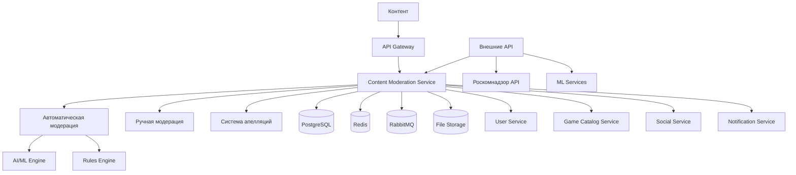

# Дизайн Content Moderation Service

## Обзор

Content Moderation Service является критически важным сервисом для обеспечения соответствия контента российской игровой платформы правилам сообщества и российскому законодательству. Сервис использует комбинацию автоматической модерации на основе ИИ и ручной модерации для обработки различных типов контента.

## Архитектура

### Высокоуровневая архитектура



### Компоненты сервиса

1. **Content Ingestion API** - прием контента для модерации
2. **Automatic Moderation Engine** - автоматическая модерация с ИИ
3. **Manual Moderation Interface** - интерфейс для модераторов
4. **Rules Engine** - система правил и политик
5. **Appeals System** - система обжалования решений
6. **Reporting & Analytics** - отчетность и аналитика
7. **Integration Layer** - интеграция с внешними сервисами

## Компоненты и интерфейсы

### API Endpoints

#### Модерация контента
- `POST /api/v1/content/submit` - отправить контент на модерацию
- `GET /api/v1/content/{contentId}/status` - статус модерации
- `PUT /api/v1/content/{contentId}/approve` - одобрить контент
- `PUT /api/v1/content/{contentId}/reject` - отклонить контент
- `POST /api/v1/content/{contentId}/flag` - пожаловаться на контент

#### Управление правилами
- `GET /api/v1/rules` - получить правила модерации
- `POST /api/v1/rules` - создать новое правило
- `PUT /api/v1/rules/{ruleId}` - обновить правило
- `DELETE /api/v1/rules/{ruleId}` - удалить правило

#### Система апелляций
- `POST /api/v1/appeals` - подать апелляцию
- `GET /api/v1/appeals/{appealId}` - статус апелляции
- `PUT /api/v1/appeals/{appealId}/review` - рассмотреть апелляцию

#### Аналитика и отчеты
- `GET /api/v1/analytics/moderators` - статистика модераторов
- `GET /api/v1/analytics/content` - статистика контента
- `GET /api/v1/reports/compliance` - отчеты для регуляторов

### Event-Driven Architecture

#### Входящие события
```typescript
interface ContentSubmissionEvent {
  contentId: string;
  contentType: 'game' | 'review' | 'message' | 'image' | 'video' | 'stream';
  authorId: string;
  content: {
    text?: string;
    mediaUrls?: string[];
    metadata: Record<string, any>;
  };
  priority: 'low' | 'medium' | 'high' | 'critical';
  timestamp: Date;
}

interface UserReportEvent {
  reportId: string;
  reporterId: string;
  contentId: string;
  reason: string;
  description?: string;
  timestamp: Date;
}
```

#### Исходящие события
```typescript
interface ContentModerationDecisionEvent {
  contentId: string;
  decision: 'approved' | 'rejected' | 'requires_review';
  moderatorId?: string;
  reason?: string;
  sanctions?: {
    type: 'warning' | 'temporary_ban' | 'permanent_ban';
    duration?: number;
    reason: string;
  };
  timestamp: Date;
}

interface ComplianceReportEvent {
  reportId: string;
  contentId: string;
  violationType: string;
  severity: 'low' | 'medium' | 'high' | 'critical';
  requiresReporting: boolean;
  timestamp: Date;
}
```

## Модели данных

### Основные сущности

#### Content (Контент)
```typescript
interface Content {
  id: string;
  type: ContentType;
  authorId: string;
  sourceService: string;
  sourceId: string;
  data: {
    text?: string;
    mediaUrls?: string[];
    metadata: Record<string, any>;
  };
  status: ContentStatus;
  priority: Priority;
  submittedAt: Date;
  reviewedAt?: Date;
  reviewerId?: string;
  decision?: ModerationDecision;
  aiScore?: number;
  flags: ContentFlag[];
}

enum ContentType {
  GAME = 'game',
  REVIEW = 'review',
  MESSAGE = 'message',
  IMAGE = 'image',
  VIDEO = 'video',
  STREAM = 'stream',
  USER_PROFILE = 'user_profile'
}

enum ContentStatus {
  PENDING = 'pending',
  IN_REVIEW = 'in_review',
  APPROVED = 'approved',
  REJECTED = 'rejected',
  APPEALED = 'appealed'
}
```

#### ModerationRule (Правило модерации)
```typescript
interface ModerationRule {
  id: string;
  name: string;
  description: string;
  contentTypes: ContentType[];
  conditions: RuleCondition[];
  actions: RuleAction[];
  severity: 'low' | 'medium' | 'high' | 'critical';
  isActive: boolean;
  createdAt: Date;
  updatedAt: Date;
}

interface RuleCondition {
  type: 'text_contains' | 'ai_score' | 'user_reports' | 'regex_match';
  operator: 'equals' | 'contains' | 'greater_than' | 'less_than';
  value: any;
  weight: number;
}

interface RuleAction {
  type: 'auto_approve' | 'auto_reject' | 'flag_for_review' | 'apply_sanction';
  parameters: Record<string, any>;
}
```

#### ModerationDecision (Решение модерации)
```typescript
interface ModerationDecision {
  id: string;
  contentId: string;
  moderatorId?: string;
  decision: 'approved' | 'rejected';
  reason: string;
  confidence: number;
  isAutomated: boolean;
  appliedRules: string[];
  sanctions?: UserSanction[];
  createdAt: Date;
}

interface UserSanction {
  userId: string;
  type: 'warning' | 'temporary_ban' | 'permanent_ban' | 'content_restriction';
  duration?: number;
  reason: string;
  appliedAt: Date;
  expiresAt?: Date;
}
```

#### Appeal (Апелляция)
```typescript
interface Appeal {
  id: string;
  contentId: string;
  userId: string;
  originalDecisionId: string;
  reason: string;
  description: string;
  status: 'pending' | 'in_review' | 'approved' | 'rejected';
  reviewerId?: string;
  reviewedAt?: Date;
  reviewDecision?: string;
  createdAt: Date;
}
```

### Схема базы данных

```sql
-- Контент для модерации
CREATE TABLE content (
    id UUID PRIMARY KEY DEFAULT gen_random_uuid(),
    type content_type NOT NULL,
    author_id UUID NOT NULL,
    source_service VARCHAR(100) NOT NULL,
    source_id VARCHAR(255) NOT NULL,
    data JSONB NOT NULL,
    status content_status DEFAULT 'pending',
    priority priority_level DEFAULT 'medium',
    submitted_at TIMESTAMP DEFAULT NOW(),
    reviewed_at TIMESTAMP,
    reviewer_id UUID,
    ai_score DECIMAL(3,2),
    created_at TIMESTAMP DEFAULT NOW(),
    updated_at TIMESTAMP DEFAULT NOW()
);

-- Правила модерации
CREATE TABLE moderation_rules (
    id UUID PRIMARY KEY DEFAULT gen_random_uuid(),
    name VARCHAR(255) NOT NULL,
    description TEXT,
    content_types content_type[] NOT NULL,
    conditions JSONB NOT NULL,
    actions JSONB NOT NULL,
    severity severity_level NOT NULL,
    is_active BOOLEAN DEFAULT TRUE,
    created_at TIMESTAMP DEFAULT NOW(),
    updated_at TIMESTAMP DEFAULT NOW()
);

-- Решения модерации
CREATE TABLE moderation_decisions (
    id UUID PRIMARY KEY DEFAULT gen_random_uuid(),
    content_id UUID NOT NULL REFERENCES content(id),
    moderator_id UUID,
    decision decision_type NOT NULL,
    reason TEXT NOT NULL,
    confidence DECIMAL(3,2),
    is_automated BOOLEAN DEFAULT FALSE,
    applied_rules UUID[],
    sanctions JSONB,
    created_at TIMESTAMP DEFAULT NOW()
);

-- Апелляции
CREATE TABLE appeals (
    id UUID PRIMARY KEY DEFAULT gen_random_uuid(),
    content_id UUID NOT NULL REFERENCES content(id),
    user_id UUID NOT NULL,
    original_decision_id UUID NOT NULL REFERENCES moderation_decisions(id),
    reason VARCHAR(500) NOT NULL,
    description TEXT,
    status appeal_status DEFAULT 'pending',
    reviewer_id UUID,
    reviewed_at TIMESTAMP,
    review_decision TEXT,
    created_at TIMESTAMP DEFAULT NOW()
);

-- Жалобы пользователей
CREATE TABLE user_reports (
    id UUID PRIMARY KEY DEFAULT gen_random_uuid(),
    reporter_id UUID NOT NULL,
    content_id UUID NOT NULL REFERENCES content(id),
    reason VARCHAR(255) NOT NULL,
    description TEXT,
    status report_status DEFAULT 'pending',
    reviewed_at TIMESTAMP,
    reviewer_id UUID,
    created_at TIMESTAMP DEFAULT NOW()
);

-- Санкции пользователей
CREATE TABLE user_sanctions (
    id UUID PRIMARY KEY DEFAULT gen_random_uuid(),
    user_id UUID NOT NULL,
    type sanction_type NOT NULL,
    reason TEXT NOT NULL,
    duration INTEGER,
    applied_at TIMESTAMP DEFAULT NOW(),
    expires_at TIMESTAMP,
    is_active BOOLEAN DEFAULT TRUE,
    applied_by UUID
);
```

## Автоматическая модерация

### AI/ML Pipeline

#### Текстовая модерация
```typescript
interface TextModerationResult {
  toxicity: number;
  spam: number;
  hate_speech: number;
  sexual_content: number;
  violence: number;
  extremism: number;
  overall_score: number;
  detected_languages: string[];
  flagged_phrases: string[];
}
```

#### Модерация изображений
```typescript
interface ImageModerationResult {
  nsfw_score: number;
  violence_score: number;
  hate_symbols: boolean;
  faces_detected: number;
  text_in_image?: string;
  overall_score: number;
  flagged_elements: string[];
}
```

#### Модерация видео/стримов
```typescript
interface VideoModerationResult {
  frames_analyzed: number;
  audio_transcription?: string;
  visual_violations: ImageModerationResult[];
  audio_violations: TextModerationResult;
  overall_score: number;
  timestamps_flagged: number[];
}
```

### Rules Engine

#### Система правил
```typescript
class RulesEngine {
  async evaluateContent(content: Content): Promise<RuleEvaluationResult> {
    const applicableRules = await this.getApplicableRules(content.type);
    const results: RuleResult[] = [];
    
    for (const rule of applicableRules) {
      const result = await this.evaluateRule(rule, content);
      results.push(result);
    }
    
    return this.aggregateResults(results);
  }
  
  private async evaluateRule(rule: ModerationRule, content: Content): Promise<RuleResult> {
    let score = 0;
    
    for (const condition of rule.conditions) {
      const conditionMet = await this.evaluateCondition(condition, content);
      if (conditionMet) {
        score += condition.weight;
      }
    }
    
    return {
      ruleId: rule.id,
      score,
      threshold: rule.threshold,
      actions: score >= rule.threshold ? rule.actions : []
    };
  }
}
```

## Обработка ошибок

### Типы ошибок
```typescript
enum ModerationErrorCode {
  CONTENT_NOT_FOUND = 'CONTENT_NOT_FOUND',
  INVALID_CONTENT_TYPE = 'INVALID_CONTENT_TYPE',
  MODERATION_FAILED = 'MODERATION_FAILED',
  INSUFFICIENT_PERMISSIONS = 'INSUFFICIENT_PERMISSIONS',
  APPEAL_ALREADY_EXISTS = 'APPEAL_ALREADY_EXISTS',
  RULE_VALIDATION_FAILED = 'RULE_VALIDATION_FAILED',
  AI_SERVICE_UNAVAILABLE = 'AI_SERVICE_UNAVAILABLE'
}

interface ModerationError {
  code: ModerationErrorCode;
  message: string;
  details?: Record<string, any>;
  timestamp: Date;
}
```

### Стратегии обработки
- **Graceful Degradation**: при недоступности ИИ переход на ручную модерацию
- **Retry Logic**: повторные попытки для временных сбоев
- **Circuit Breaker**: защита от каскадных сбоев внешних сервисов
- **Fallback Rules**: базовые правила при сбое основной системы

## Стратегия тестирования

### Unit Tests
- Тестирование Rules Engine
- Валидация правил модерации
- Обработка различных типов контента
- Система санкций и апелляций

### Integration Tests
- Интеграция с AI/ML сервисами
- Обработка событий через RabbitMQ
- API endpoints
- Интеграция с внешними сервисами

### Performance Tests
- Нагрузочное тестирование (1M контента/день)
- Тестирование производительности ИИ модерации
- Масштабируемость при росте нагрузки

### Compliance Tests
- Соответствие российскому законодательству
- Тестирование блокировки запрещенного контента
- Проверка отчетности для регуляторов

## Безопасность

### Аутентификация и авторизация
- JWT токены для API доступа
- RBAC для модераторов разных уровней
- Аудит всех действий модераторов

### Защита данных
- Шифрование чувствительного контента
- Анонимизация данных в отчетах
- Безопасное хранение медиафайлов

### Соответствие требованиям
- Соблюдение 152-ФЗ о персональных данных
- Интеграция с Роскомнадзором
- Автоматическая отчетность о нарушениях

## Производительность и масштабируемость

### Кэширование
- Redis для кэширования:
  - Правила модерации (TTL: 1 час)
  - Результаты ИИ модерации (TTL: 24 часа)
  - Статистика модераторов (TTL: 15 минут)
  - Часто запрашиваемый контент (TTL: 30 минут)

### Оптимизация производительности
- Асинхронная обработка контента
- Приоритизация критического контента
- Пакетная обработка для массовых операций
- Индексы для быстрого поиска контента

### Горизонтальное масштабирование
- Stateless сервисы для легкого масштабирования
- Очереди для балансировки нагрузки
- Микросервисная архитектура для независимого масштабирования
- Auto-scaling на основе размера очередей

## Мониторинг и наблюдаемость

### Метрики
- Время обработки контента
- Точность автоматической модерации
- Количество апелляций и их результаты
- Производительность модераторов
- Соответствие SLA

### Логирование
- Structured logging всех решений модерации
- Аудит действий модераторов
- Логирование интеграций с внешними API
- Correlation ID для трассировки

### Алерты
- Превышение времени обработки
- Высокий процент ошибок ИИ
- Переполнение очередей модерации
- Критические нарушения требующие немедленного реагирования

### Дашборды
- Общая статистика модерации
- Производительность команды модераторов
- Тренды нарушений по типам контента
- Compliance метрики для регуляторов