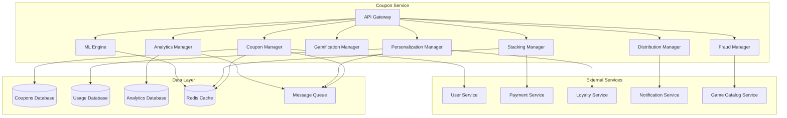

# Coupon Service - Дизайн

## 📋 **Обзор**

Coupon Service представляет собой продвинутый микросервис для управления комплексной системой купонов с поддержкой различных типов скидок, персонализации, стекинга, геймификации и машинного обучения. Сервис обеспечивает гибкую систему скидок с защитой от мошенничества и интеграцией с программами лояльности.

## 🏗️ **Архитектура**

### **Общая архитектура**


### **Микросервисная архитектура**
- **API Gateway**: Единая точка входа с rate limiting и аутентификацией
- **Coupon Manager**: Управление жизненным циклом купонов
- **Personalization Manager**: Генерация персонализированных купонов
- **Stacking Manager**: Управление комбинированием купонов
- **Gamification Manager**: Игровые механики получения купонов
- **Analytics Manager**: Аналитика эффективности купонов
- **Fraud Manager**: Защита от мошенничества и злоупотреблений
- **ML Engine**: Машинное обучение для оптимизации купонов
- **Distribution Manager**: Управление распространением купонов

## 🔧 **Компоненты и интерфейсы**

### **1. Coupon Manager Component**
```typescript
interface CouponManager {
  // Управление купонами
  createCoupon(coupon: CouponCreationRequest): Promise<Coupon>;
  updateCoupon(couponId: string, updates: CouponUpdate): Promise<Coupon>;
  deactivateCoupon(couponId: string, reason: string): Promise<void>;
  
  // Применение купонов
  validateCoupon(code: string, userId: string, items: CartItem[]): Promise<ValidationResult>;
  applyCoupon(code: string, userId: string, orderId: string): Promise<ApplicationResult>;
  
  // Получение купонов
  getUserCoupons(userId: string, filters?: CouponFilters): Promise<UserCoupon[]>;
  getCouponByCode(code: string): Promise<Coupon>;
  getActiveCoupons(filters?: CouponFilters): Promise<Coupon[]>;
  
  // Массовые операции
  generateBulkCoupons(request: BulkGenerationRequest): Promise<BulkGenerationResult>;
  expireCoupons(criteria: ExpirationCriteria): Promise<ExpirationResult>;
}

interface CouponCreationRequest {
  name: string;
  description: string;
  type: CouponType;
  discountType: DiscountType;
  discountValue: number;
  maxDiscountAmount?: number;
  minimumPurchase?: number;
  applicableItems: ApplicableItems;
  validFrom: Date;
  validUntil: Date;
  usageLimit?: number;
  userLimit?: number;
  stackable: boolean;
  personalizable: boolean;
  distributionChannels: DistributionChannel[];
}

interface Coupon {
  id: string;
  code: string;
  name: string;
  description: string;
  type: CouponType;
  discountType: DiscountType;
  discountValue: number;
  maxDiscountAmount?: number;
  minimumPurchase?: number;
  applicableItems: ApplicableItems;
  validFrom: Date;
  validUntil: Date;
  usageLimit?: number;
  usageCount: number;
  userLimit?: number;
  stackable: boolean;
  status: CouponStatus;
  createdAt: Date;
  updatedAt: Date;
}

enum CouponType {
  PERCENTAGE = 'percentage',
  FIXED_AMOUNT = 'fixed_amount',
  BOGO = 'bogo',
  FREE_SHIPPING = 'free_shipping',
  LOYALTY_REWARD = 'loyalty_reward',
  BIRTHDAY_SPECIAL = 'birthday_special',
  WELCOME_BONUS = 'welcome_bonus'
}

enum DiscountType {
  PERCENTAGE_OFF = 'percentage_off',
  FIXED_AMOUNT_OFF = 'fixed_amount_off',
  BUY_ONE_GET_ONE_FREE = 'buy_one_get_one_free',
  BUY_TWO_GET_ONE_FREE = 'buy_two_get_one_free',
  SECOND_ITEM_HALF_PRICE = 'second_item_half_price'
}
```

### **2. Personalization Manager Component**
```typescript
interface PersonalizationManager {
  // Персонализация купонов
  generatePersonalizedCoupons(userId: string): Promise<PersonalizedCoupon[]>;
  analyzeUserBehavior(userId: string): Promise<UserBehaviorProfile>;
  
  // Рекомендации
  recommendCoupons(userId: string, context: RecommendationContext): Promise<CouponRecommendation[]>;
  optimizeCouponForUser(couponId: string, userId: string): Promise<OptimizedCoupon>;
  
  // Триггерные купоны
  createTriggerCoupon(trigger: CouponTrigger): Promise<TriggerCoupon>;
  checkTriggerConditions(userId: string): Promise<TriggeredCoupon[]>;
  
  // Динамические купоны
  generateDynamicCoupon(userId: string, context: DynamicContext): Promise<DynamicCoupon>;
  updatePersonalizationModel(userId: string, feedback: PersonalizationFeedback): Promise<void>;
}

interface PersonalizedCoupon {
  id: string;
  userId: string;
  baseCode: string;
  personalizedCode: string;
  discountValue: number;
  reason: PersonalizationReason;
  confidence: number;
  validUntil: Date;
  targetItems: string[];
  generatedAt: Date;
}

interface UserBehaviorProfile {
  userId: string;
  favoriteGenres: string[];
  averageSpending: number;
  purchaseFrequency: number;
  pricePreferences: PriceRange;
  seasonalPatterns: SeasonalPattern[];
  loyaltyLevel: LoyaltyLevel;
  responsiveness: CouponResponsiveness;
  lastUpdated: Date;
}

interface CouponTrigger {
  name: string;
  condition: TriggerCondition;
  couponTemplate: CouponTemplate;
  cooldownPeriod: number;
  maxActivations: number;
  isActive: boolean;
}

enum PersonalizationReason {
  FAVORITE_GENRE = 'favorite_genre',
  WISHLIST_ITEM = 'wishlist_item',
  PRICE_PREFERENCE = 'price_preference',
  INACTIVITY_RETURN = 'inactivity_return',
  LOYALTY_REWARD = 'loyalty_reward',
  BIRTHDAY_SPECIAL = 'birthday_special',
  SEASONAL_PREFERENCE = 'seasonal_preference'
}

enum TriggerCondition {
  CART_ABANDONMENT = 'cart_abandonment',
  MILESTONE_REACHED = 'milestone_reached',
  INACTIVITY_PERIOD = 'inactivity_period',
  BIRTHDAY = 'birthday',
  ANNIVERSARY = 'anniversary',
  SPENDING_THRESHOLD = 'spending_threshold'
}
```

### **3. Stacking Manager Component**
```typescript
interface StackingManager {
  // Управление стекингом
  validateCouponStack(coupons: string[], userId: string, items: CartItem[]): Promise<StackValidation>;
  optimizeCouponStack(availableCoupons: string[], items: CartItem[]): Promise<OptimalStack>;
  applyCouponStack(coupons: string[], userId: string, orderId: string): Promise<StackApplication>;
  
  // Правила стекинга
  createStackingRule(rule: StackingRule): Promise<void>;
  updateStackingRule(ruleId: string, updates: StackingRuleUpdate): Promise<void>;
  getStackingRules(): Promise<StackingRule[]>;
  
  // Анализ комбинаций
  analyzeCouponCombinations(coupons: string[]): Promise<CombinationAnalysis>;
  previewStackDiscount(coupons: string[], items: CartItem[]): Promise<DiscountPreview>;
}

interface StackValidation {
  isValid: boolean;
  validCoupons: string[];
  invalidCoupons: CouponValidationError[];
  totalDiscount: number;
  finalPrice: number;
  warnings: StackingWarning[];
}

interface OptimalStack {
  coupons: string[];
  totalDiscount: number;
  finalPrice: number;
  savings: number;
  explanation: string;
  alternativeStacks: AlternativeStack[];
}

interface StackingRule {
  id: string;
  name: string;
  priority: number;
  conditions: StackingCondition[];
  actions: StackingAction[];
  isActive: boolean;
}

interface StackingCondition {
  type: ConditionType;
  operator: ComparisonOperator;
  value: any;
  couponTypes?: CouponType[];
}

enum ConditionType {
  COUPON_COUNT = 'coupon_count',
  TOTAL_DISCOUNT = 'total_discount',
  COUPON_TYPE = 'coupon_type',
  USER_TIER = 'user_tier',
  CART_VALUE = 'cart_value'
}

interface StackApplication {
  appliedCoupons: AppliedCoupon[];
  totalDiscount: number;
  finalPrice: number;
  stackingOrder: string[];
  applicationTime: Date;
}
```

### **4. Gamification Manager Component**
```typescript
interface GamificationManager {
  // Игровые механики
  createCouponGame(game: CouponGameRequest): Promise<CouponGame>;
  playCouponGame(userId: string, gameId: string): Promise<GameResult>;
  
  // Колесо фортуны
  spinWheel(userId: string, wheelId: string): Promise<SpinResult>;
  createWheelConfiguration(config: WheelConfiguration): Promise<CouponWheel>;
  
  // Скретч-карты
  scratchCard(userId: string, cardId: string): Promise<ScratchResult>;
  generateScratchCards(request: ScratchCardGeneration): Promise<ScratchCard[]>;
  
  // Коллекционирование
  collectCouponPiece(userId: string, pieceId: string): Promise<CollectionResult>;
  exchangeCollection(userId: string, collectionId: string): Promise<ExchangeResult>;
  
  // Достижения
  checkCouponAchievements(userId: string): Promise<Achievement[]>;
  awardCouponAchievement(userId: string, achievementId: string): Promise<void>;
}

interface CouponGameRequest {
  name: string;
  type: GameType;
  rewards: GameReward[];
  playLimit: PlayLimit;
  duration: number;
  requirements: GameRequirement[];
}

interface CouponGame {
  id: string;
  name: string;
  type: GameType;
  status: GameStatus;
  rewards: GameReward[];
  playCount: number;
  maxPlays: number;
  startDate: Date;
  endDate: Date;
}

interface SpinResult {
  userId: string;
  wheelId: string;
  result: WheelSegment;
  couponAwarded?: Coupon;
  spinTime: Date;
  nextSpinAvailable: Date;
}

interface ScratchResult {
  userId: string;
  cardId: string;
  revealed: boolean;
  prize: ScratchPrize;
  couponAwarded?: Coupon;
  scratchTime: Date;
}

enum GameType {
  WHEEL_OF_FORTUNE = 'wheel_of_fortune',
  SCRATCH_CARD = 'scratch_card',
  SLOT_MACHINE = 'slot_machine',
  MEMORY_GAME = 'memory_game',
  DAILY_CHECK_IN = 'daily_check_in'
}

interface GameReward {
  type: RewardType;
  value: any;
  probability: number;
  rarity: RewardRarity;
}

enum RewardType {
  COUPON = 'coupon',
  DISCOUNT_MULTIPLIER = 'discount_multiplier',
  BONUS_POINTS = 'bonus_points',
  EXCLUSIVE_ACCESS = 'exclusive_access'
}
```

### **5. Analytics Manager Component**
```typescript
interface AnalyticsManager {
  // Метрики использования
  getCouponUsageMetrics(period: DateRange): Promise<UsageMetrics>;
  analyzeCouponPerformance(couponId: string): Promise<PerformanceAnalysis>;
  
  // ROI анализ
  calculateCouponROI(couponId: string): Promise<ROIAnalysis>;
  getOverallCouponROI(period: DateRange): Promise<OverallROI>;
  
  // Пользовательская аналитика
  analyzeUserCouponBehavior(userId: string): Promise<UserCouponBehavior>;
  segmentUsersByCouponUsage(): Promise<UserSegmentation>;
  
  // Прогнозирование
  predictCouponDemand(couponType: CouponType): Promise<DemandForecast>;
  optimizeCouponStrategy(): Promise<StrategyRecommendation>;
  
  // A/B тестирование
  createCouponABTest(test: ABTestRequest): Promise<ABTest>;
  analyzeCouponABTest(testId: string): Promise<ABTestResults>;
}

interface UsageMetrics {
  period: DateRange;
  totalCouponsIssued: number;
  totalCouponsUsed: number;
  usageRate: number;
  averageDiscountAmount: number;
  totalDiscountGiven: number;
  revenueImpact: number;
  topPerformingCoupons: TopCoupon[];
}

interface PerformanceAnalysis {
  couponId: string;
  issuedCount: number;
  usedCount: number;
  usageRate: number;
  averageOrderValue: number;
  totalRevenue: number;
  customerAcquisition: number;
  customerRetention: number;
  profitability: number;
}

interface ROIAnalysis {
  couponId: string;
  totalCost: number;
  totalRevenue: number;
  netProfit: number;
  roi: number;
  paybackPeriod: number;
  customerLifetimeValue: number;
}

interface UserCouponBehavior {
  userId: string;
  couponsReceived: number;
  couponsUsed: number;
  usageRate: number;
  averageDiscountSeeking: number;
  preferredCouponTypes: CouponType[];
  responsiveness: number;
  loyaltyImpact: number;
}
```

### **6. Fraud Manager Component**
```typescript
interface FraudManager {
  // Обнаружение мошенничества
  detectFraudulentActivity(userId: string, couponId: string): Promise<FraudAnalysis>;
  analyzeCouponAbuse(couponId: string): Promise<AbuseReport>;
  
  // Валидация использования
  validateCouponUsage(usage: CouponUsage): Promise<UsageValidation>;
  checkUserEligibility(userId: string, couponId: string): Promise<EligibilityCheck>;
  
  // Защитные меры
  blockSuspiciousActivity(activityId: string): Promise<void>;
  implementRateLimit(userId: string, limitType: RateLimitType): Promise<void>;
  
  // Мониторинг
  monitorCouponPatterns(): Promise<PatternAnalysis>;
  generateFraudReport(period: DateRange): Promise<FraudReport>;
}

interface FraudAnalysis {
  userId: string;
  couponId: string;
  riskScore: number;
  riskFactors: RiskFactor[];
  recommendedAction: FraudAction;
  confidence: number;
}

interface AbuseReport {
  couponId: string;
  abuseType: AbuseType;
  affectedUsers: string[];
  totalLoss: number;
  detectionTime: Date;
  mitigationActions: MitigationAction[];
}

enum AbuseType {
  MULTIPLE_ACCOUNT_ABUSE = 'multiple_account_abuse',
  CODE_SHARING = 'code_sharing',
  AUTOMATED_USAGE = 'automated_usage',
  FAKE_ACCOUNT_CREATION = 'fake_account_creation',
  REFERRAL_FRAUD = 'referral_fraud'
}

interface RiskFactor {
  factor: string;
  weight: number;
  description: string;
  evidence: any;
}

enum FraudAction {
  ALLOW = 'allow',
  FLAG_FOR_REVIEW = 'flag_for_review',
  REQUIRE_VERIFICATION = 'require_verification',
  BLOCK_USAGE = 'block_usage',
  SUSPEND_USER = 'suspend_user'
}
```

### **7. ML Engine Component**
```typescript
interface MLEngine {
  // Модели машинного обучения
  trainPersonalizationModel(trainingData: PersonalizationTrainingData): Promise<ModelTrainingResult>;
  predictCouponEffectiveness(coupon: Coupon, targetAudience: UserSegment): Promise<EffectivenessPrediction>;
  
  // Оптимизация
  optimizeCouponParameters(objectives: OptimizationObjective[]): Promise<OptimizedParameters>;
  recommendOptimalDiscount(userId: string, gameId: string): Promise<DiscountRecommendation>;
  
  // Сегментация
  segmentUsersForCoupons(): Promise<UserSegmentation>;
  identifyHighValueTargets(couponType: CouponType): Promise<TargetUsers>;
  
  // Прогнозирование
  forecastCouponDemand(period: DateRange): Promise<DemandForecast>;
  predictUserResponse(userId: string, coupon: Coupon): Promise<ResponsePrediction>;
}

interface EffectivenessPrediction {
  couponId: string;
  targetSegment: UserSegment;
  predictedUsageRate: number;
  predictedROI: number;
  confidence: number;
  factors: PredictionFactor[];
}

interface OptimizedParameters {
  discountValue: number;
  validityPeriod: number;
  targetAudience: UserSegment;
  distributionChannels: DistributionChannel[];
  expectedPerformance: PerformanceMetrics;
}

interface ResponsePrediction {
  userId: string;
  couponId: string;
  usageProbability: number;
  expectedOrderValue: number;
  conversionProbability: number;
  factors: ResponseFactor[];
}
```

## 📊 **Модели данных**

### **Основные сущности**
```typescript
interface Coupon {
  id: string;
  code: string;
  name: string;
  description: string;
  type: CouponType;
  discountType: DiscountType;
  discountValue: number;
  maxDiscountAmount?: number;
  minimumPurchase?: number;
  applicableItems: ApplicableItems;
  validFrom: Date;
  validUntil: Date;
  usageLimit?: number;
  usageCount: number;
  userLimit?: number;
  stackable: boolean;
  status: CouponStatus;
  createdBy: string;
  createdAt: Date;
  updatedAt: Date;
}

interface CouponUsage {
  id: string;
  couponId: string;
  userId: string;
  orderId: string;
  discountAmount: number;
  originalPrice: number;
  finalPrice: number;
  usedAt: Date;
  ipAddress: string;
  userAgent: string;
  isValid: boolean;
}

interface PersonalizedCoupon {
  id: string;
  userId: string;
  baseCode: string;
  personalizedCode: string;
  discountValue: number;
  reason: PersonalizationReason;
  confidence: number;
  validUntil: Date;
  targetItems: string[];
  generatedAt: Date;
  usedAt?: Date;
}

interface CouponGame {
  id: string;
  name: string;
  type: GameType;
  status: GameStatus;
  rewards: GameReward[];
  playCount: number;
  maxPlays: number;
  startDate: Date;
  endDate: Date;
  participants: GameParticipant[];
}
```

### **Типы и перечисления**
```typescript
enum CouponStatus {
  ACTIVE = 'active',
  INACTIVE = 'inactive',
  EXPIRED = 'expired',
  EXHAUSTED = 'exhausted',
  SUSPENDED = 'suspended'
}

enum DistributionChannel {
  EMAIL = 'email',
  PUSH_NOTIFICATION = 'push_notification',
  IN_APP = 'in_app',
  SOCIAL_MEDIA = 'social_media',
  REFERRAL = 'referral',
  GAMIFICATION = 'gamification'
}

enum GameStatus {
  SCHEDULED = 'scheduled',
  ACTIVE = 'active',
  PAUSED = 'paused',
  COMPLETED = 'completed',
  CANCELLED = 'cancelled'
}
```

## 🛡️ **Обработка ошибок**

### **Стратегия обработки ошибок**
```typescript
enum CouponErrorCode {
  // Ошибки купонов
  COUPON_NOT_FOUND = 'COUPON_NOT_FOUND',
  COUPON_EXPIRED = 'COUPON_EXPIRED',
  COUPON_EXHAUSTED = 'COUPON_EXHAUSTED',
  COUPON_NOT_APPLICABLE = 'COUPON_NOT_APPLICABLE',
  
  // Ошибки использования
  USER_NOT_ELIGIBLE = 'USER_NOT_ELIGIBLE',
  USAGE_LIMIT_EXCEEDED = 'USAGE_LIMIT_EXCEEDED',
  MINIMUM_PURCHASE_NOT_MET = 'MINIMUM_PURCHASE_NOT_MET',
  
  // Ошибки стекинга
  STACKING_NOT_ALLOWED = 'STACKING_NOT_ALLOWED',
  INCOMPATIBLE_COUPONS = 'INCOMPATIBLE_COUPONS',
  MAX_DISCOUNT_EXCEEDED = 'MAX_DISCOUNT_EXCEEDED',
  
  // Ошибки мошенничества
  SUSPICIOUS_ACTIVITY = 'SUSPICIOUS_ACTIVITY',
  FRAUD_DETECTED = 'FRAUD_DETECTED',
  ACCOUNT_BLOCKED = 'ACCOUNT_BLOCKED'
}
```

## 🧪 **Стратегия тестирования**

### **Модульное тестирование**
- Тестирование логики расчета скидок
- Валидация правил стекинга
- Проверка персонализации купонов
- Тестирование игровых механик

### **Интеграционное тестирование**
- Интеграция с Payment Service
- Интеграция с Loyalty Service
- Интеграция с User Service
- Тестирование ML моделей

### **A/B тестирование**
- Эффективность различных типов купонов
- Оптимизация размеров скидок
- Тестирование игровых механик
- Персонализация vs стандартные купоны

## 🔧 **Технические детали реализации**

### **База данных**
- **PostgreSQL**: Основное хранилище купонов и использования
- **Redis**: Кэширование активных купонов и защита от спама
- **ClickHouse**: Аналитические данные и ML модели

### **Машинное обучение**
- **TensorFlow/PyTorch**: Модели персонализации
- **Scikit-learn**: Анализ поведения пользователей
- **Apache Spark**: Обработка больших данных
- **MLflow**: Управление ML экспериментами

### **Безопасность**
- Защита от злоупотребления купонами
- Rate limiting для предотвращения спама
- Fraud detection алгоритмы
- Audit logging всех операций

### **Производительность**
- Кэширование часто используемых купонов
- Асинхронная обработка персонализации
- Оптимизация ML инференса
- Горизонтальное масштабирование

### **Мониторинг**
- Метрики использования купонов в реальном времени
- Мониторинг эффективности ML моделей
- Алерты на подозрительную активность
- Дашборды ROI и конверсии