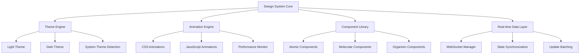

# Cryo Frontend Design System - Design Document

## Overview

The Cryo Frontend Design System is a comprehensive UI framework built for modern web applications requiring real-time data updates, responsive animations, and adaptive theming. The system follows atomic design principles and provides a cohesive visual language that adapts to user preferences and system settings.

## Architecture

### High-Level Architecture



### Technology Stack

#### Cross-Platform Core
- **Next.js 14+**: Web platform with SSR/SSG capabilities
- **React Native 0.72+**: Mobile applications (iOS/Android)
- **Tauri 1.5+**: Desktop applications (Windows/Linux/macOS)
- **TypeScript**: Type safety across all platforms

#### Shared Technologies
- **React 18+**: UI framework with Concurrent Features
- **Zustand**: Lightweight state management
- **TanStack Query**: API caching and synchronization
- **Socket.IO**: Real-time communication
- **React Hook Form**: Form management

#### Platform-Specific
- **Web (Next.js)**: Tailwind CSS, Framer Motion, next-pwa
- **Mobile (React Native)**: NativeWind, React Native Reanimated 3, Expo SDK
- **Desktop (Tauri)**: Rust backend, system integrations, auto-updater

#### Development Tools
- **Vite**: Fast development server (web)
- **Metro**: React Native bundler
- **ESLint + Prettier**: Code quality
- **Jest + Testing Library**: Unit testing
- **Playwright**: E2E testing

## Components and Interfaces

### Theme Engine

#### Theme Provider Interface
```typescript
interface ThemeConfig {
  mode: 'light' | 'dark' | 'system';
  accentColor: string;
  density: 'compact' | 'comfortable' | 'spacious';
  animations: 'full' | 'reduced' | 'none';
  fontSize: 'small' | 'medium' | 'large';
}

interface ThemeContextValue {
  theme: ThemeConfig;
  setTheme: (theme: Partial<ThemeConfig>) => void;
  resolvedTheme: 'light' | 'dark';
  systemTheme: 'light' | 'dark';
}
```

#### Color System
```typescript
interface ColorPalette {
  // Primary colors
  primary: ColorScale;
  secondary: ColorScale;
  accent: ColorScale;
  
  // Semantic colors
  success: ColorScale;
  warning: ColorScale;
  error: ColorScale;
  info: ColorScale;
  
  // Neutral colors
  neutral: ColorScale;
  
  // Surface colors
  background: string;
  surface: string;
  surfaceVariant: string;
}

interface ColorScale {
  50: string;
  100: string;
  200: string;
  300: string;
  400: string;
  500: string; // Base color
  600: string;
  700: string;
  800: string;
  900: string;
  950: string;
}
```

### Animation Engine

#### Animation Configuration
```typescript
interface AnimationConfig {
  duration: {
    fast: number;    // 150ms
    normal: number;  // 300ms
    slow: number;    // 500ms
  };
  easing: {
    easeOut: string;     // cubic-bezier(0.0, 0.0, 0.2, 1)
    easeIn: string;      // cubic-bezier(0.4, 0.0, 1, 1)
    easeInOut: string;   // cubic-bezier(0.4, 0.0, 0.2, 1)
    bounce: string;      // cubic-bezier(0.68, -0.55, 0.265, 1.55)
  };
  reducedMotion: boolean;
}

interface AnimationHooks {
  useSpring: (config: SpringConfig) => SpringValue;
  useTransition: (items: any[], config: TransitionConfig) => Transition[];
  useGesture: (handlers: GestureHandlers) => void;
}
```

### Real-time Data Layer

#### WebSocket Manager
```typescript
interface WebSocketManager {
  connect: (url: string, options?: ConnectionOptions) => void;
  disconnect: () => void;
  subscribe: (channel: string, callback: (data: any) => void) => () => void;
  emit: (event: string, data: any) => void;
  getConnectionState: () => 'connecting' | 'connected' | 'disconnected' | 'error';
}

interface RealTimeStore {
  data: Record<string, any>;
  subscribe: (key: string, callback: (data: any) => void) => () => void;
  update: (key: string, data: any) => void;
  batch: (updates: Record<string, any>) => void;
}
```

### Component Library Structure

#### Atomic Components
- **Button**: Primary, secondary, ghost, icon variants
- **Input**: Text, password, search, textarea variants
- **Icon**: SVG-based icon system with size variants
- **Avatar**: User avatars with fallbacks and status indicators
- **Badge**: Notification badges and status indicators
- **Spinner**: Loading indicators with size variants
- **Switch**: Toggle switches with animations
- **Checkbox**: Checkboxes with indeterminate state
- **Radio**: Radio buttons with group management

#### Molecular Components
- **Card**: Content containers with elevation and borders
- **Modal**: Overlay dialogs with backdrop and animations
- **Dropdown**: Select dropdowns with search and multi-select
- **Tooltip**: Contextual help with positioning
- **Tabs**: Tab navigation with active state animations
- **Accordion**: Collapsible content sections
- **Breadcrumb**: Navigation breadcrumbs
- **Pagination**: Page navigation controls
- **Progress**: Progress bars and circular indicators

#### Organism Components
- **Header**: Application header with navigation and user menu
- **Sidebar**: Collapsible navigation sidebar
- **DataTable**: Sortable, filterable data tables with real-time updates
- **Form**: Form containers with validation and submission states
- **Dashboard**: Widget-based dashboard layouts
- **Chat**: Real-time chat interface with message threading
- **Notification**: Toast notifications with queue management

## Data Models

### Theme State Model
```typescript
interface ThemeState {
  // Current theme configuration
  config: ThemeConfig;
  
  // Resolved theme values
  colors: ColorPalette;
  typography: TypographyScale;
  spacing: SpacingScale;
  shadows: ShadowScale;
  borderRadius: BorderRadiusScale;
  
  // System detection
  systemTheme: 'light' | 'dark';
  prefersReducedMotion: boolean;
  
  // User preferences
  userPreferences: UserThemePreferences;
}
```

### Animation State Model
```typescript
interface AnimationState {
  // Global animation settings
  enabled: boolean;
  reducedMotion: boolean;
  performanceMode: 'high' | 'balanced' | 'low';
  
  // Active animations tracking
  activeAnimations: Map<string, AnimationInstance>;
  
  // Performance metrics
  frameRate: number;
  droppedFrames: number;
}
```

### Real-time Data Model
```typescript
interface RealTimeState {
  // Connection status
  connectionState: 'connecting' | 'connected' | 'disconnected' | 'error';
  lastConnected: Date | null;
  reconnectAttempts: number;
  
  // Subscribed channels
  subscriptions: Map<string, ChannelSubscription>;
  
  // Data cache
  cache: Map<string, CachedData>;
  
  // Update queue for offline scenarios
  pendingUpdates: QueuedUpdate[];
}
```

## Error Handling

### Theme Error Handling
- **Invalid Theme Values**: Fallback to default theme with console warning
- **System Theme Detection Failure**: Default to light theme
- **Custom Property Support**: Graceful degradation for older browsers
- **Color Contrast Issues**: Automatic contrast adjustment with accessibility warnings

### Animation Error Handling
- **Performance Issues**: Automatic animation reduction when frame rate drops below 30fps
- **Browser Compatibility**: Feature detection with fallbacks to CSS transitions
- **Reduced Motion Preference**: Respect user's motion preferences with instant transitions
- **Memory Leaks**: Automatic cleanup of animation instances on component unmount

### Real-time Error Handling
- **Connection Failures**: Exponential backoff reconnection strategy
- **Data Sync Issues**: Conflict resolution with last-write-wins strategy
- **Network Interruptions**: Queue updates for replay when connection restored
- **Server Errors**: User-friendly error messages with retry options

## Testing Strategy

### Unit Testing
- **Component Testing**: Test all components in isolation with various props and states
- **Theme Testing**: Verify theme switching and color calculations
- **Animation Testing**: Test animation triggers and cleanup
- **Hook Testing**: Test custom hooks with various scenarios

### Integration Testing
- **Theme Integration**: Test theme changes across component tree
- **Real-time Integration**: Test WebSocket connection and data synchronization
- **Animation Integration**: Test animation sequences and performance
- **Accessibility Integration**: Test keyboard navigation and screen reader support

### End-to-End Testing
- **User Workflows**: Test complete user journeys with theme switching
- **Real-time Scenarios**: Test multi-user real-time interactions
- **Performance Testing**: Test animation performance under load
- **Cross-browser Testing**: Test compatibility across major browsers

### Visual Regression Testing
- **Component Screenshots**: Automated visual testing for all components
- **Theme Variations**: Test visual consistency across light/dark themes
- **Animation States**: Capture animation keyframes for regression testing
- **Responsive Testing**: Test component appearance across screen sizes

## Performance Considerations

### Animation Performance
- **GPU Acceleration**: Use transform and opacity for animations
- **Animation Batching**: Group multiple animations to single frame
- **Performance Monitoring**: Track frame rate and automatically reduce animations
- **Memory Management**: Cleanup animation instances and event listeners

### Real-time Performance
- **Update Batching**: Group rapid updates to prevent UI thrashing
- **Selective Updates**: Only update components that actually changed
- **Connection Pooling**: Reuse WebSocket connections across components
- **Data Compression**: Use message compression for large data transfers

### Bundle Optimization
- **Tree Shaking**: Ensure unused components are eliminated
- **Code Splitting**: Lazy load non-critical components
- **CSS Optimization**: Use CSS custom properties for theme switching
- **Asset Optimization**: Optimize fonts, icons, and images

## Accessibility

### WCAG 2.1 AA Compliance
- **Color Contrast**: Ensure 4.5:1 contrast ratio for normal text, 3:1 for large text
- **Keyboard Navigation**: Full keyboard accessibility for all interactive elements
- **Screen Reader Support**: Proper ARIA labels and semantic HTML
- **Focus Management**: Visible focus indicators and logical tab order

### Reduced Motion Support
- **prefers-reduced-motion**: Respect user's motion preferences
- **Alternative Feedback**: Provide non-motion feedback for animations
- **Instant Transitions**: Replace animations with instant state changes when needed
- **User Control**: Allow users to disable animations in settings

### Theme Accessibility
- **High Contrast Mode**: Support for high contrast themes
- **Color Blindness**: Ensure information isn't conveyed by color alone
- **Font Scaling**: Support browser font size preferences
- **Dark Mode**: Proper contrast ratios in dark theme

## Browser Support

### Modern Browsers (Full Support)
- Chrome 90+, Firefox 88+, Safari 14+, Edge 90+
- CSS Custom Properties, CSS Grid, Flexbox
- ES2020 features, Web Components, Service Workers
- WebSocket, Intersection Observer, ResizeObserver

### Legacy Browser Support (Graceful Degradation)
- IE 11: Basic functionality with polyfills
- Older mobile browsers: Simplified animations
- No JavaScript: Basic styling with CSS-only components
- Limited CSS support: Fallback to system fonts and basic colors

## Deployment Strategy

### Development Environment
- **Hot Module Replacement**: Instant updates during development
- **Theme Switching**: Live theme preview in development tools
- **Component Playground**: Storybook for component development
- **Performance Monitoring**: Real-time performance metrics

### Production Deployment
- **CDN Distribution**: Serve assets from global CDN
- **Caching Strategy**: Aggressive caching with cache busting
- **Progressive Enhancement**: Core functionality works without JavaScript
- **Monitoring**: Real-time error tracking and performance monitoring

### Version Management
- **Semantic Versioning**: Clear versioning for breaking changes
- **Migration Guides**: Documentation for version upgrades
- **Backward Compatibility**: Support for previous major version
- **Feature Flags**: Gradual rollout of new features