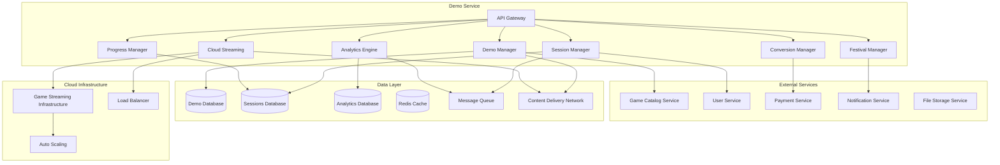

# Demo Service - Дизайн

## 📋 **Обзор**

Demo Service представляет собой комплексный микросервис для управления демо-версиями игр с поддержкой различных типов демо, облачного стриминга, демо-фестивалей и системы "попробовать перед покупкой". Сервис обеспечивает плавный переход от демо к полной версии игры с сохранением прогресса.

## 🏗️ **Архитектура**

### **Общая архитектура**


### **Микросервисная архитектура**
- **API Gateway**: Единая точка входа с аутентификацией и rate limiting
- **Demo Manager**: Управление жизненным циклом демо-версий
- **Cloud Streaming**: Облачный стриминг демо-версий
- **Session Manager**: Управление игровыми сессиями
- **Progress Manager**: Сохранение и перенос прогресса
- **Festival Manager**: Управление демо-фестивалями
- **Analytics Engine**: Сбор и анализ данных использования демо
- **Conversion Manager**: Управление конверсией в полные версии

## 🔧 **Компоненты и интерфейсы**

### **1. Demo Manager Component**
```typescript
interface DemoManager {
  // Управление демо
  createDemo(demoRequest: DemoCreationRequest): Promise<Demo>;
  updateDemo(demoId: string, updates: DemoUpdate): Promise<Demo>;
  deleteDemo(demoId: string): Promise<void>;
  
  // Получение демо
  getAvailableDemos(filters?: DemoFilters): Promise<Demo[]>;
  getDemoById(demoId: string): Promise<Demo>;
  getUserDemos(userId: string): Promise<UserDemo[]>;
  
  // Запуск демо
  startDemo(userId: string, demoId: string, options?: DemoStartOptions): Promise<DemoSession>;
  validateDemoAccess(userId: string, demoId: string): Promise<AccessValidation>;
}

interface DemoCreationRequest {
  gameId: string;
  name: string;
  description: string;
  type: DemoType;
  restrictions: DemoRestriction[];
  content: DemoContent;
  duration?: number; // для временных демо
  features: DemoFeature[];
  requirements: SystemRequirements;
  conversionSettings: ConversionSettings;
}

interface Demo {
  id: string;
  gameId: string;
  name: string;
  description: string;
  type: DemoType;
  status: DemoStatus;
  restrictions: DemoRestriction[];
  content: DemoContent;
  duration?: number;
  features: DemoFeature[];
  downloadSize: number;
  streamingAvailable: boolean;
  createdAt: Date;
  updatedAt: Date;
  statistics: DemoStatistics;
}

enum DemoType {
  TIME_LIMITED = 'time_limited',
  CONTENT_LIMITED = 'content_limited',
  FEATURE_LIMITED = 'feature_limited',
  STREAMING_ONLY = 'streaming_only',
  TRY_BEFORE_BUY = 'try_before_buy'
}
```

### **2. Cloud Streaming Component**
```typescript
interface CloudStreaming {
  // Управление стримингом
  startStreamingSession(userId: string, demoId: string): Promise<StreamingSession>;
  getStreamingStatus(sessionId: string): Promise<StreamingStatus>;
  adjustStreamingQuality(sessionId: string, quality: StreamingQuality): Promise<void>;
  
  // Управление ресурсами
  allocateStreamingResources(demoId: string): Promise<StreamingResources>;
  releaseStreamingResources(sessionId: string): Promise<void>;
  
  // Мониторинг производительности
  getStreamingMetrics(sessionId: string): Promise<StreamingMetrics>;
  optimizeStreamingPerformance(sessionId: string): Promise<void>;
}

interface StreamingSession {
  id: string;
  userId: string;
  demoId: string;
  serverEndpoint: string;
  quality: StreamingQuality;
  latency: number;
  bandwidth: number;
  startTime: Date;
  maxDuration: number;
  status: StreamingStatus;
}

interface StreamingQuality {
  resolution: Resolution;
  framerate: number;
  bitrate: number;
  codec: string;
  adaptiveStreaming: boolean;
}

enum StreamingStatus {
  INITIALIZING = 'initializing',
  ACTIVE = 'active',
  PAUSED = 'paused',
  ENDED = 'ended',
  ERROR = 'error'
}
```

### **3. Session Manager Component**
```typescript
interface SessionManager {
  // Управление сессиями
  createSession(userId: string, demoId: string, sessionType: SessionType): Promise<DemoSession>;
  updateSession(sessionId: string, updates: SessionUpdate): Promise<DemoSession>;
  endSession(sessionId: string): Promise<SessionSummary>;
  
  // Мониторинг сессий
  getActiveSession(userId: string): Promise<DemoSession | null>;
  getSessionHistory(userId: string): Promise<DemoSession[]>;
  getSessionMetrics(sessionId: string): Promise<SessionMetrics>;
  
  // Управление временем
  extendSessionTime(sessionId: string, additionalTime: number): Promise<void>;
  pauseSession(sessionId: string): Promise<void>;
  resumeSession(sessionId: string): Promise<void>;
}

interface DemoSession {
  id: string;
  userId: string;
  demoId: string;
  sessionType: SessionType;
  startTime: Date;
  endTime?: Date;
  duration: number;
  remainingTime?: number;
  status: SessionStatus;
  progress: SessionProgress;
  metrics: SessionMetrics;
}

interface SessionProgress {
  levelsCompleted: number;
  achievementsUnlocked: string[];
  playtime: number;
  checkpoints: Checkpoint[];
  gameState: any;
}

enum SessionType {
  LOCAL_DOWNLOAD = 'local_download',
  CLOUD_STREAMING = 'cloud_streaming',
  HYBRID = 'hybrid'
}
```

### **4. Progress Manager Component**
```typescript
interface ProgressManager {
  // Сохранение прогресса
  saveProgress(sessionId: string, progressData: ProgressData): Promise<void>;
  loadProgress(userId: string, demoId: string): Promise<ProgressData | null>;
  
  // Перенос прогресса
  transferProgressToFullGame(userId: string, demoId: string, gameId: string): Promise<TransferResult>;
  validateProgressCompatibility(demoId: string, gameId: string): Promise<CompatibilityResult>;
  
  // Управление сохранениями
  createSavePoint(sessionId: string, saveData: SaveData): Promise<SavePoint>;
  getSavePoints(userId: string, demoId: string): Promise<SavePoint[]>;
  restoreSavePoint(savePointId: string): Promise<void>;
}

interface ProgressData {
  userId: string;
  demoId: string;
  gameState: GameState;
  achievements: Achievement[];
  statistics: PlayerStatistics;
  settings: GameSettings;
  saveData: SaveData;
  lastUpdated: Date;
}

interface TransferResult {
  success: boolean;
  transferredItems: TransferredItem[];
  incompatibleItems: IncompatibleItem[];
  bonusItems?: BonusItem[];
}

interface GameState {
  level: number;
  position: Position;
  inventory: InventoryItem[];
  skills: Skill[];
  questProgress: QuestProgress[];
}
```

### **5. Festival Manager Component**
```typescript
interface FestivalManager {
  // Управление фестивалями
  createFestival(festivalRequest: FestivalCreationRequest): Promise<DemoFestival>;
  updateFestival(festivalId: string, updates: FestivalUpdate): Promise<DemoFestival>;
  
  // Участие в фестивалях
  submitDemoToFestival(demoId: string, festivalId: string): Promise<FestivalSubmission>;
  getFestivalDemos(festivalId: string): Promise<FestivalDemo[]>;
  
  // Голосование и рейтинги
  voteForDemo(userId: string, demoId: string, festivalId: string): Promise<void>;
  getFestivalResults(festivalId: string): Promise<FestivalResults>;
  
  // Кураторство
  curateFestivalSelection(festivalId: string, curatorId: string): Promise<CuratedSelection>;
}

interface DemoFestival {
  id: string;
  name: string;
  description: string;
  theme: string;
  type: FestivalType;
  startDate: Date;
  endDate: Date;
  status: FestivalStatus;
  participatingDemos: string[];
  prizes: FestivalPrize[];
  votingEnabled: boolean;
  curatedSelection: boolean;
}

interface FestivalSubmission {
  id: string;
  demoId: string;
  festivalId: string;
  submittedBy: string;
  submissionDate: Date;
  status: SubmissionStatus;
  votes: number;
  rating: number;
}

enum FestivalType {
  SEASONAL = 'seasonal',
  GENRE_SPECIFIC = 'genre_specific',
  PUBLISHER_SHOWCASE = 'publisher_showcase',
  INDIE_SPOTLIGHT = 'indie_spotlight',
  COMMUNITY_CHOICE = 'community_choice'
}
```

### **6. Analytics Engine Component**
```typescript
interface AnalyticsEngine {
  // Сбор метрик
  trackDemoStart(userId: string, demoId: string, sessionId: string): Promise<void>;
  trackDemoProgress(sessionId: string, progressEvent: ProgressEvent): Promise<void>;
  trackDemoEnd(sessionId: string, endReason: EndReason): Promise<void>;
  
  // Анализ поведения
  analyzeDemoEngagement(demoId: string, period: DateRange): Promise<EngagementAnalysis>;
  identifyDropOffPoints(demoId: string): Promise<DropOffPoint[]>;
  calculateConversionFunnel(demoId: string): Promise<ConversionFunnel>;
  
  // Отчеты
  generateDemoReport(demoId: string, reportType: ReportType): Promise<DemoReport>;
  getDemoStatistics(demoId: string): Promise<DemoStatistics>;
  compareDemo Performance(demoIds: string[]): Promise<PerformanceComparison>;
}

interface EngagementAnalysis {
  demoId: string;
  totalSessions: number;
  averageSessionLength: number;
  completionRate: number;
  retentionRate: number;
  conversionRate: number;
  userFeedback: UserFeedback[];
}

interface DropOffPoint {
  location: string;
  dropOffRate: number;
  commonReasons: string[];
  suggestedImprovements: string[];
}
```

### **7. Conversion Manager Component**
```typescript
interface ConversionManager {
  // Управление конверсией
  initiateConversion(userId: string, demoId: string): Promise<ConversionProcess>;
  completeConversion(conversionId: string, purchaseId: string): Promise<ConversionResult>;
  
  // Персонализированные предложения
  generateConversionOffer(userId: string, demoId: string): Promise<ConversionOffer>;
  applyConversionDiscount(userId: string, demoId: string): Promise<DiscountApplication>;
  
  // Отслеживание конверсии
  trackConversionEvent(conversionId: string, event: ConversionEvent): Promise<void>;
  getConversionMetrics(demoId: string): Promise<ConversionMetrics>;
}

interface ConversionOffer {
  id: string;
  userId: string;
  demoId: string;
  gameId: string;
  discountPercentage: number;
  bonusContent: BonusContent[];
  validUntil: Date;
  personalizedMessage: string;
}

interface ConversionResult {
  success: boolean;
  gameId: string;
  progressTransferred: boolean;
  bonusItemsGranted: BonusItem[];
  conversionTime: Date;
}
```

## 📊 **Модели данных**

### **Основные сущности**
```typescript
interface Demo {
  id: string;
  gameId: string;
  name: string;
  description: string;
  type: DemoType;
  status: DemoStatus;
  restrictions: DemoRestriction[];
  content: DemoContent;
  duration?: number;
  features: DemoFeature[];
  downloadSize: number;
  streamingAvailable: boolean;
  requirements: SystemRequirements;
  conversionSettings: ConversionSettings;
  createdAt: Date;
  updatedAt: Date;
}

interface DemoSession {
  id: string;
  userId: string;
  demoId: string;
  sessionType: SessionType;
  startTime: Date;
  endTime?: Date;
  duration: number;
  remainingTime?: number;
  status: SessionStatus;
  progress: SessionProgress;
  metrics: SessionMetrics;
  cloudSessionId?: string;
}

interface DemoFestival {
  id: string;
  name: string;
  description: string;
  theme: string;
  type: FestivalType;
  startDate: Date;
  endDate: Date;
  status: FestivalStatus;
  participatingDemos: string[];
  prizes: FestivalPrize[];
  votingEnabled: boolean;
  curatedSelection: boolean;
  organizer: string;
}

interface UserDemo {
  userId: string;
  demoId: string;
  firstPlayedAt: Date;
  lastPlayedAt: Date;
  totalPlayTime: number;
  sessionsCount: number;
  completed: boolean;
  converted: boolean;
  rating?: number;
  feedback?: string;
}
```

### **Типы и перечисления**
```typescript
enum DemoStatus {
  DRAFT = 'draft',
  ACTIVE = 'active',
  PAUSED = 'paused',
  EXPIRED = 'expired',
  ARCHIVED = 'archived'
}

enum SessionStatus {
  ACTIVE = 'active',
  PAUSED = 'paused',
  COMPLETED = 'completed',
  EXPIRED = 'expired',
  TERMINATED = 'terminated'
}

enum FestivalStatus {
  UPCOMING = 'upcoming',
  ACTIVE = 'active',
  VOTING = 'voting',
  COMPLETED = 'completed',
  CANCELLED = 'cancelled'
}

enum EndReason {
  TIME_EXPIRED = 'time_expired',
  CONTENT_COMPLETED = 'content_completed',
  USER_QUIT = 'user_quit',
  CONVERTED_TO_FULL = 'converted_to_full',
  TECHNICAL_ERROR = 'technical_error'
}
```

## 🛡️ **Обработка ошибок**

### **Стратегия обработки ошибок**
```typescript
enum DemoErrorCode {
  // Ошибки демо
  DEMO_NOT_FOUND = 'DEMO_NOT_FOUND',
  DEMO_NOT_AVAILABLE = 'DEMO_NOT_AVAILABLE',
  DEMO_EXPIRED = 'DEMO_EXPIRED',
  DEMO_LIMIT_EXCEEDED = 'DEMO_LIMIT_EXCEEDED',
  
  // Ошибки сессий
  SESSION_NOT_FOUND = 'SESSION_NOT_FOUND',
  SESSION_EXPIRED = 'SESSION_EXPIRED',
  CONCURRENT_SESSION_LIMIT = 'CONCURRENT_SESSION_LIMIT',
  
  // Ошибки стриминга
  STREAMING_NOT_AVAILABLE = 'STREAMING_NOT_AVAILABLE',
  STREAMING_QUALITY_DEGRADED = 'STREAMING_QUALITY_DEGRADED',
  STREAMING_CONNECTION_LOST = 'STREAMING_CONNECTION_LOST',
  
  // Ошибки прогресса
  PROGRESS_SAVE_FAILED = 'PROGRESS_SAVE_FAILED',
  PROGRESS_TRANSFER_FAILED = 'PROGRESS_TRANSFER_FAILED',
  INCOMPATIBLE_SAVE_DATA = 'INCOMPATIBLE_SAVE_DATA',
  
  // Системные ошибки
  INSUFFICIENT_RESOURCES = 'INSUFFICIENT_RESOURCES',
  DOWNLOAD_FAILED = 'DOWNLOAD_FAILED',
  INSTALLATION_FAILED = 'INSTALLATION_FAILED'
}

interface DemoError {
  code: DemoErrorCode;
  message: string;
  details?: any;
  timestamp: Date;
  demoId?: string;
  sessionId?: string;
  userId?: string;
}
```

## 🧪 **Стратегия тестирования**

### **Модульное тестирование**
- Тестирование логики ограничений демо
- Валидация переноса прогресса
- Проверка расчета времени сессий
- Тестирование конверсии в полные версии

### **Интеграционное тестирование**
- Интеграция с Game Catalog Service
- Интеграция с облачной инфраструктурой
- Интеграция с Payment Service для конверсии
- Тестирование CDN для загрузки демо

### **Нагрузочное тестирование**
- Одновременные стриминговые сессии
- Массовые загрузки демо-версий
- Производительность при демо-фестивалях
- Автоскейлинг облачных ресурсов

### **End-to-End тестирование**
- Полный цикл: загрузка → игра → конверсия
- Перенос прогресса между версиями
- Участие в демо-фестивалях
- Облачный стриминг с различным качеством соединения

## 🔧 **Технические детали реализации**

### **База данных**
- **PostgreSQL**: Основное хранилище демо и сессий
- **Redis**: Кэширование активных сессий и быстрый доступ
- **ClickHouse**: Аналитические данные и метрики

### **Облачная инфраструктура**
- **Kubernetes**: Оркестрация контейнеров для стриминга
- **Auto Scaling**: Динамическое масштабирование ресурсов
- **Load Balancing**: Распределение нагрузки между серверами
- **CDN**: Глобальное распространение демо-контента

### **Безопасность**
- DRM защита демо-контента
- Защита от злоупотребления временными ограничениями
- Шифрование стриминговых сессий
- Audit logging всех действий с демо

### **Производительность**
- Предварительная загрузка популярных демо
- Интеллектуальное кэширование игрового контента
- Оптимизация стриминга под различные устройства
- Асинхронная обработка аналитики

### **Мониторинг**
- Метрики производительности стриминга
- Мониторинг конверсии демо в продажи
- Алерты на технические проблемы
- Дашборды аналитики для разработчиков