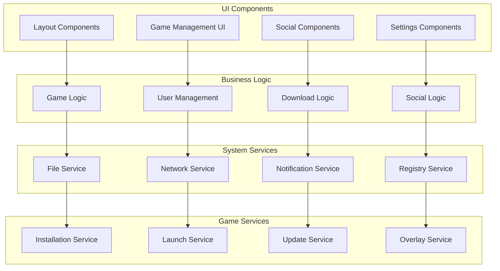

# Desktop Application Design Document

## Overview

Десктопное приложение российской игровой платформы построено на Tauri - современном фреймворке, который сочетает Rust backend для производительности и безопасности с React frontend для богатого пользовательского интерфейса. Приложение служит как полнофункциональный игровой лаунчер, так и клиент платформы с глубокой интеграцией в операционную систему.

## Architecture

### High-Level Architecture


### Component Architecture



## Technology Stack

### Core Technologies
- **Tauri 1.5+**: Cross-platform desktop framework
- **Rust**: Backend language for performance and security
- **React 18+**: Frontend UI framework
- **TypeScript**: Type safety for frontend
- **Vite**: Fast development and build tool

### Frontend Stack
- **React Router**: Client-side routing
- **Zustand**: Lightweight state management
- **TanStack Query**: Server state and caching
- **Tailwind CSS**: Utility-first styling
- **Framer Motion**: Animations and transitions

### Rust Backend
- **Tokio**: Async runtime for Rust
- **Serde**: Serialization/deserialization
- **Reqwest**: HTTP client
- **SQLite**: Local database
- **Tauri Plugins**: System integrations

### System Integration
- **Windows API**: Windows-specific features
- **Linux APIs**: Linux system integration
- **File System Watchers**: Monitor file changes
- **System Tray**: Background operation
- **Auto-updater**: Application updates

### Game Integration
- **Process Management**: Game launching and monitoring
- **DirectX/OpenGL Hooks**: Overlay integration
- **Performance Counters**: System monitoring
- **Registry Management**: Game installations
- **Steam API**: Steam integration (optional)

## Components and Interfaces

### 1. Tauri Core Interface
**Purpose:** Bridge between React frontend and Rust backend

**Interfaces:**
```typescript
// Frontend to Backend Commands
interface TauriCommands {
  // Game Management
  installGame(gameId: string, path: string): Promise<InstallResult>
  launchGame(gameId: string, args?: string[]): Promise<LaunchResult>
  uninstallGame(gameId: string): Promise<boolean>
  getGameInfo(gameId: string): Promise<GameInfo>
  
  // System Integration
  showInSystemTray(): Promise<void>
  hideFromSystemTray(): Promise<void>
  setAutoStart(enabled: boolean): Promise<void>
  getSystemInfo(): Promise<SystemInfo>
  
  // File Operations
  selectInstallPath(): Promise<string | null>
  openGameFolder(gameId: string): Promise<void>
  checkDiskSpace(path: string): Promise<DiskSpace>
}

// Backend to Frontend Events
interface TauriEvents {
  gameInstallProgress: (progress: InstallProgress) => void
  gameStateChanged: (gameId: string, state: GameState) => void
  systemNotification: (notification: SystemNotification) => void
  overlayToggled: (visible: boolean) => void
}
```

### 2. Game Manager
**Purpose:** Handle game installation, launching, and lifecycle management

**Interfaces:**
```rust
// Rust Backend Interfaces
pub struct GameManager {
    pub async fn install_game(&self, game_id: &str, install_path: &str) -> Result<InstallResult>
    pub async fn launch_game(&self, game_id: &str, args: Option<Vec<String>>) -> Result<LaunchResult>
    pub async fn uninstall_game(&self, game_id: &str) -> Result<bool>
    pub async fn update_game(&self, game_id: &str) -> Result<UpdateResult>
    pub async fn get_installed_games(&self) -> Result<Vec<InstalledGame>>
}

pub struct InstallResult {
    pub success: bool,
    pub game_id: String,
    pub install_path: String,
    pub size_bytes: u64,
    pub error: Option<String>,
}

pub struct LaunchResult {
    pub success: bool,
    pub process_id: Option<u32>,
    pub error: Option<String>,
}
```

### 3. Download Manager
**Purpose:** Handle game downloads with resume capability and bandwidth management

**Interfaces:**
```rust
pub struct DownloadManager {
    pub async fn start_download(&self, url: &str, destination: &str) -> Result<DownloadId>
    pub async fn pause_download(&self, download_id: DownloadId) -> Result<()>
    pub async fn resume_download(&self, download_id: DownloadId) -> Result<()>
    pub async fn cancel_download(&self, download_id: DownloadId) -> Result<()>
    pub async fn set_bandwidth_limit(&self, bytes_per_second: Option<u64>) -> Result<()>
}

pub struct DownloadProgress {
    pub download_id: DownloadId,
    pub bytes_downloaded: u64,
    pub total_bytes: u64,
    pub speed_bytes_per_second: u64,
    pub eta_seconds: Option<u64>,
    pub status: DownloadStatus,
}

pub enum DownloadStatus {
    Pending,
    Downloading,
    Paused,
    Completed,
    Failed(String),
    Cancelled,
}
```

### 4. System Integration Manager
**Purpose:** Handle OS-specific integrations and system tray functionality

**Interfaces:**
```rust
pub struct SystemIntegration {
    pub async fn create_system_tray(&self) -> Result<()>
    pub async fn show_notification(&self, title: &str, body: &str) -> Result<()>
    pub async fn set_auto_start(&self, enabled: bool) -> Result<()>
    pub async fn register_file_associations(&self) -> Result<()>
    pub async fn get_system_performance(&self) -> Result<SystemPerformance>
}

pub struct SystemPerformance {
    pub cpu_usage_percent: f32,
    pub memory_usage_bytes: u64,
    pub memory_total_bytes: u64,
    pub gpu_usage_percent: Option<f32>,
    pub disk_usage: Vec<DiskUsage>,
}

pub struct DiskUsage {
    pub drive: String,
    pub used_bytes: u64,
    pub total_bytes: u64,
}
```

### 5. Game Overlay System
**Purpose:** Provide in-game overlay for platform features

**Interfaces:**
```rust
pub struct OverlayManager {
    pub async fn inject_overlay(&self, process_id: u32) -> Result<()>
    pub async fn show_overlay(&self) -> Result<()>
    pub async fn hide_overlay(&self) -> Result<()>
    pub async fn capture_screenshot(&self) -> Result<ScreenshotResult>
    pub async fn start_recording(&self, settings: RecordingSettings) -> Result<()>
}

pub struct ScreenshotResult {
    pub file_path: String,
    pub width: u32,
    pub height: u32,
    pub format: ImageFormat,
}

pub struct RecordingSettings {
    pub quality: VideoQuality,
    pub fps: u32,
    pub audio_enabled: bool,
    pub output_path: String,
}
```

## Data Models

### Game Data Models
```typescript
interface InstalledGame {
  id: string
  title: string
  version: string
  installPath: string
  executablePath: string
  sizeBytes: number
  lastPlayed?: Date
  totalPlaytime: number
  isRunning: boolean
  needsUpdate: boolean
  launchOptions: LaunchOptions
}

interface LaunchOptions {
  arguments: string[]
  workingDirectory?: string
  runAsAdmin: boolean
  compatibility: CompatibilitySettings
}

interface CompatibilitySettings {
  windowsCompatibility?: WindowsVersion
  directxVersion?: DirectXVersion
  useDiscreteGpu: boolean
  highDpiAware: boolean
}
```

### Download Data Models
```typescript
interface DownloadItem {
  id: string
  gameId: string
  url: string
  destinationPath: string
  totalBytes: number
  downloadedBytes: number
  status: DownloadStatus
  priority: DownloadPriority
  startTime: Date
  estimatedCompletion?: Date
  error?: string
}

interface DownloadQueue {
  activeDownloads: DownloadItem[]
  queuedDownloads: DownloadItem[]
  completedDownloads: DownloadItem[]
  failedDownloads: DownloadItem[]
  maxConcurrentDownloads: number
  bandwidthLimitBps?: number
}
```

### System Data Models
```typescript
interface SystemInfo {
  os: OperatingSystem
  architecture: Architecture
  cpuInfo: CpuInfo
  memoryInfo: MemoryInfo
  gpuInfo: GpuInfo[]
  storageInfo: StorageInfo[]
}

interface CpuInfo {
  name: string
  cores: number
  threads: number
  baseClockMhz: number
  maxClockMhz: number
}

interface GpuInfo {
  name: string
  vendor: string
  memoryMb: number
  driverVersion: string
  isDiscrete: boolean
}
```

## UI Architecture

### Main Window Layout
```typescript
interface MainWindowLayout {
  header: HeaderComponent
  sidebar: SidebarComponent
  content: ContentAreaComponent
  footer: FooterComponent
  overlay?: OverlayComponent
}

interface HeaderComponent {
  userProfile: UserProfileWidget
  searchBar: SearchBarWidget
  notifications: NotificationWidget
  windowControls: WindowControlsWidget
}

interface SidebarComponent {
  navigation: NavigationMenu
  gameLibrary: GameLibraryWidget
  downloads: DownloadsWidget
  friends: FriendsWidget
}
```

### Screen Components
```typescript
// Library Screen
interface LibraryScreenProps {
  games: InstalledGame[]
  sortBy: SortOption
  filterBy: FilterOption
  viewMode: 'grid' | 'list'
  onGameLaunch: (gameId: string) => void
  onGameUninstall: (gameId: string) => void
}

// Store Screen
interface StoreScreenProps {
  featuredGames: Game[]
  categories: GameCategory[]
  searchResults: Game[]
  onGamePurchase: (gameId: string) => void
  onGameInstall: (gameId: string) => void
}

// Downloads Screen
interface DownloadsScreenProps {
  activeDownloads: DownloadItem[]
  queuedDownloads: DownloadItem[]
  completedDownloads: DownloadItem[]
  onDownloadPause: (downloadId: string) => void
  onDownloadResume: (downloadId: string) => void
  onDownloadCancel: (downloadId: string) => void
}
```

## Performance Optimization

### Resource Management
```rust
// Rust Backend Optimization
pub struct ResourceManager {
    pub async fn optimize_for_gaming(&self) -> Result<()>
    pub async fn restore_normal_mode(&self) -> Result<()>
    pub async fn monitor_resource_usage(&self) -> Result<ResourceUsage>
    pub async fn cleanup_temporary_files(&self) -> Result<u64>
}

pub struct ResourceUsage {
    pub cpu_usage: f32,
    pub memory_usage: u64,
    pub disk_io: DiskIO,
    pub network_io: NetworkIO,
}
```

### Frontend Optimization
```typescript
// React Performance Optimization
interface PerformanceConfig {
  virtualizedLists: boolean
  lazyLoadImages: boolean
  debounceSearch: number
  cacheSize: number
  preloadNextScreen: boolean
}

// Memory Management
interface MemoryManager {
  clearImageCache(): void
  clearComponentCache(): void
  optimizeForLowMemory(): void
  getMemoryUsage(): MemoryUsage
}
```

## Security Implementation

### DRM and License Management
```rust
pub struct DRMManager {
    pub async fn validate_license(&self, game_id: &str) -> Result<LicenseStatus>
    pub async fn activate_game(&self, game_id: &str, license_key: &str) -> Result<ActivationResult>
    pub async fn deactivate_game(&self, game_id: &str) -> Result<()>
    pub async fn check_offline_period(&self, game_id: &str) -> Result<OfflineStatus>
}

pub enum LicenseStatus {
    Valid,
    Expired,
    Invalid,
    RequiresOnlineValidation,
    OfflinePeriodExceeded,
}

pub struct ActivationResult {
    pub success: bool,
    pub offline_days_remaining: Option<u32>,
    pub error: Option<String>,
}
```

### Application Security
```rust
pub struct SecurityManager {
    pub async fn verify_game_integrity(&self, game_id: &str) -> Result<IntegrityResult>
    pub async fn scan_for_cheats(&self, process_id: u32) -> Result<CheatScanResult>
    pub async fn encrypt_save_data(&self, data: &[u8]) -> Result<Vec<u8>>
    pub async fn decrypt_save_data(&self, encrypted_data: &[u8]) -> Result<Vec<u8>>
}
```

## System Integration

### Windows Integration
```rust
#[cfg(target_os = "windows")]
pub struct WindowsIntegration {
    pub async fn register_protocol_handler(&self) -> Result<()>
    pub async fn create_start_menu_shortcut(&self) -> Result<()>
    pub async fn set_game_mode(&self, enabled: bool) -> Result<()>
    pub async fn get_windows_version(&self) -> Result<WindowsVersion>
}
```

### Linux Integration
```rust
#[cfg(target_os = "linux")]
pub struct LinuxIntegration {
    pub async fn create_desktop_entry(&self) -> Result<()>
    pub async fn register_mime_types(&self) -> Result<()>
    pub async fn setup_wine_compatibility(&self) -> Result<()>
    pub async fn get_desktop_environment(&self) -> Result<DesktopEnvironment>
}
```

## Auto-Update System

### Update Manager
```rust
pub struct UpdateManager {
    pub async fn check_for_updates(&self) -> Result<UpdateInfo>
    pub async fn download_update(&self, update_info: &UpdateInfo) -> Result<()>
    pub async fn install_update(&self) -> Result<()>
    pub async fn rollback_update(&self) -> Result<()>
}

pub struct UpdateInfo {
    pub version: String,
    pub size_bytes: u64,
    pub release_notes: String,
    pub is_critical: bool,
    pub download_url: String,
    pub signature: String,
}
```

## Testing Strategy

### Rust Backend Testing
```rust
#[cfg(test)]
mod tests {
    use super::*;
    
    #[tokio::test]
    async fn test_game_installation() {
        let game_manager = GameManager::new();
        let result = game_manager.install_game("test_game", "/tmp/test").await;
        assert!(result.is_ok());
    }
    
    #[tokio::test]
    async fn test_download_manager() {
        let download_manager = DownloadManager::new();
        let download_id = download_manager.start_download("http://example.com/file", "/tmp/file").await;
        assert!(download_id.is_ok());
    }
}
```

### Frontend Testing
```typescript
// Component Testing
describe('GameLibrary Component', () => {
  it('should display installed games', () => {
    const mockGames = createMockGames()
    render(<GameLibrary games={mockGames} />)
    expect(screen.getByText(mockGames[0].title)).toBeInTheDocument()
  })
})

// Integration Testing
describe('Game Launch Flow', () => {
  it('should launch game successfully', async () => {
    const mockTauri = createMockTauri()
    render(<App />)
    
    fireEvent.click(screen.getByTestId('launch-game-1'))
    await waitFor(() => {
      expect(mockTauri.invoke).toHaveBeenCalledWith('launch_game', { gameId: '1' })
    })
  })
})
```

## Build and Deployment

### Build Configuration
```toml
# Cargo.toml
[package]
name = "gaming-platform-launcher"
version = "1.0.0"
edition = "2021"

[dependencies]
tauri = { version = "1.5", features = ["api-all"] }
tokio = { version = "1.0", features = ["full"] }
serde = { version = "1.0", features = ["derive"] }
reqwest = { version = "0.11", features = ["json"] }
sqlx = { version = "0.7", features = ["sqlite", "runtime-tokio-rustls"] }

[build-dependencies]
tauri-build = { version = "1.5", features = [] }
```

### Tauri Configuration
```json
{
  "build": {
    "beforeDevCommand": "npm run dev",
    "beforeBuildCommand": "npm run build",
    "devPath": "http://localhost:1420",
    "distDir": "../dist"
  },
  "package": {
    "productName": "Russian Gaming Platform",
    "version": "1.0.0"
  },
  "tauri": {
    "allowlist": {
      "all": false,
      "shell": {
        "all": false,
        "open": true
      },
      "dialog": {
        "all": false,
        "open": true,
        "save": true
      },
      "fs": {
        "all": true,
        "scope": ["$APPDATA", "$DOCUMENT", "$DOWNLOAD", "$PICTURE", "$VIDEO"]
      }
    },
    "bundle": {
      "active": true,
      "targets": "all",
      "identifier": "ru.gaming-platform.launcher",
      "icon": [
        "icons/32x32.png",
        "icons/128x128.png",
        "icons/icon.icns",
        "icons/icon.ico"
      ]
    },
    "security": {
      "csp": null
    },
    "updater": {
      "active": true,
      "endpoints": [
        "https://updates.gaming-platform.ru/{{target}}/{{current_version}}"
      ],
      "dialog": true,
      "pubkey": "dW50cnVzdGVkIGNvbW1lbnQ6IG1pbmlzaWduIHB1YmxpYyBrZXk6IDFBQ0Q5RTdBNzQwNzI4NzAK"
    },
    "windows": [
      {
        "fullscreen": false,
        "resizable": true,
        "title": "Russian Gaming Platform",
        "width": 1200,
        "height": 800,
        "minWidth": 800,
        "minHeight": 600
      }
    ],
    "systemTray": {
      "iconPath": "icons/icon.png",
      "iconAsTemplate": true
    }
  }
}
```

## Monitoring and Analytics

### Performance Monitoring
```rust
pub struct PerformanceMonitor {
    pub async fn track_app_startup_time(&self) -> Result<()>
    pub async fn track_game_launch_time(&self, game_id: &str, duration: Duration) -> Result<()>
    pub async fn track_download_speed(&self, speed_mbps: f64) -> Result<()>
    pub async fn track_system_performance(&self, metrics: SystemMetrics) -> Result<()>
}
```

### Error Reporting
```rust
pub struct ErrorReporter {
    pub async fn report_crash(&self, crash_info: CrashInfo) -> Result<()>
    pub async fn report_error(&self, error: &dyn std::error::Error) -> Result<()>
    pub async fn report_performance_issue(&self, issue: PerformanceIssue) -> Result<()>
}
```

This comprehensive design document provides the technical foundation for building a high-performance, secure, and feature-rich desktop gaming launcher that integrates seamlessly with the Russian gaming platform ecosystem.