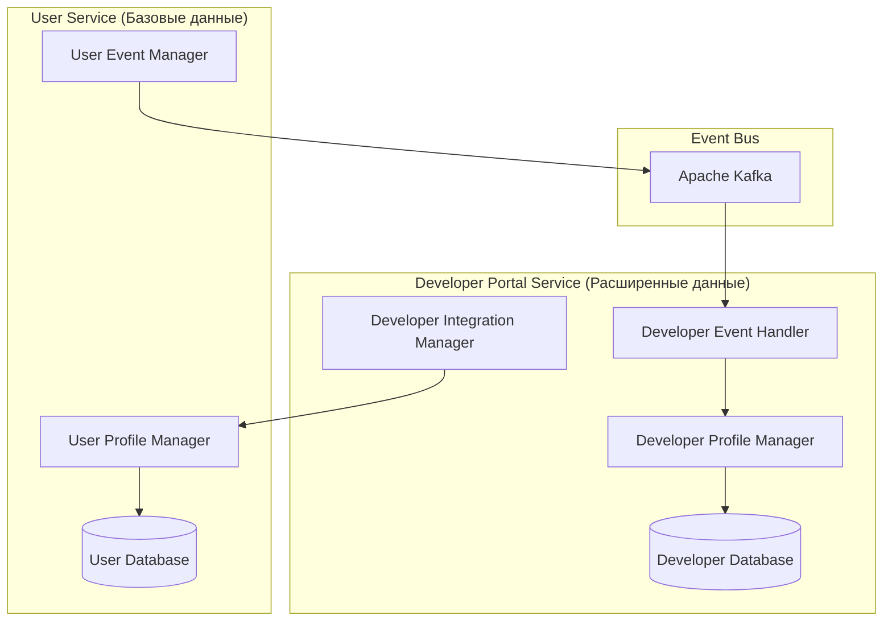
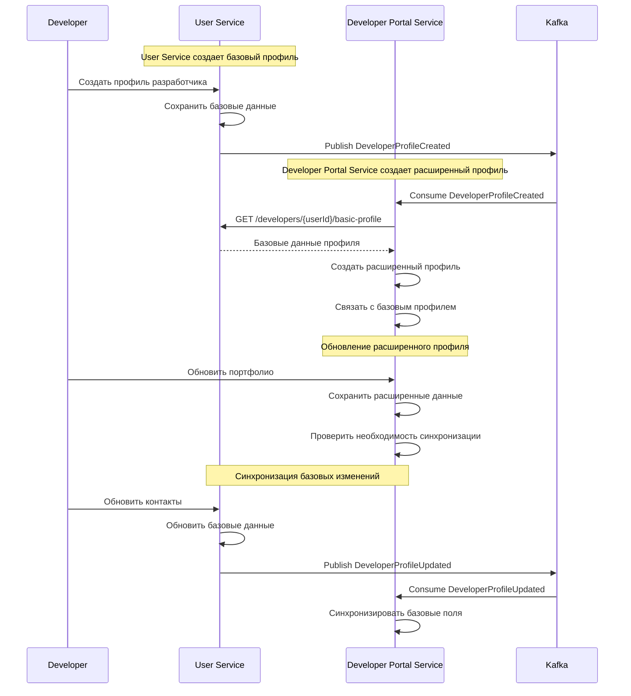

# Архитектурный дизайн - Developer Portal Service

## Обзор

Developer Portal Service является центральным хабом для разработчиков игр на российской Steam-платформе. Сервис предоставляет комплексные инструменты для управления жизненным циклом игр, от загрузки и публикации до аналитики и взаимодействия с игроками. 

### Расширенная функциональность включает:

- **Онбординг разработчиков**: Пошаговый процесс регистрации с верификацией и персональным менеджером
- **Workflow управления играми**: Структурированный процесс от создания до релиза с автоматизированными проверками
- **Комплексные инструменты разработчика**: SDK, аналитика, тестирование, маркетинговые инструменты
- **Система монетизации**: Гибкое revenue sharing, прозрачные выплаты, региональное ценообразование
- **Партнерские программы**: Финансирование, издательские соглашения, менторство
- **Автоматизация процессов**: CI/CD пайплайны, автоматическая локализация, маркетинговая автоматизация
- **Комплексная аналитика**: Real-time метрики, прогнозирование, конкурентный анализ

Система построена на микросервисной архитектуре с интеграцией в экосистему платформы.

## Архитектура

### Высокоуровневая архитектура

```mermaid
graph TB
    subgraph "Developer Portal Service"
        DPS[Developer Portal API]
        
        subgraph "Core Modules"
            GM[Game Management]
            RM[Release Management]
            AM[Analytics Module]
            PM[Payment Management]
        end
        
        subgraph "Extended Modules"
            OM[Onboarding Module]
            WM[Workflow Management]
            TM[Tools & SDK Module]
            MM[Monetization Module]
            PPM[Partnership Module]
            AUM[Automation Module]
            CAM[Comprehensive Analytics]
        end
        
        subgraph "Support Modules"
            CM[Content Management]
            TEM[Testing Management]
            MEM[Mentorship Module]
            GRM[Grant Management]
        end
    end
    
    subgraph "External Services"
        GCS[Game Catalog Service]
        PS[Payment Service]
        AS[Analytics Service]
        CMS[Content Moderation Service]
        RCS[Regional Compliance Service]
        NS[Notification Service]
        US[User Service]
        SS[Security Service]
    end
    
    subgraph "Storage"
        PDB[(PostgreSQL)]
        REDIS[(Redis Cache)]
        S3[(File Storage)]
        ES[(Elasticsearch)]
    end
    
    subgraph "External Tools"
        UNITY[Unity Plugin]
        UE[Unreal Engine Plugin]
        CICD[CI/CD Integration]
        ANALYTICS[External Analytics]
    end
    
    DPS --> GM
    DPS --> RM
    DPS --> AM
    DPS --> PM
    DPS --> CM
    DPS --> TM
    DPS --> MM
    DPS --> GM_MOD
    
    GM --> GCS
    PM --> PS
    AM --> AS
    CM --> CMS
    CM --> RCS
    DPS --> NS
    DPS --> US
    DPS --> SS
    
    GM --> PDB
    RM --> PDB
    AM --> ES
    DPS --> REDIS
    CM --> S3
    
    UNITY --> DPS
    UE --> DPS
    CICD --> DPS
    AM --> ANALYTICS
```



### Компонентная архитектура

```mermaid
graph TB
    subgraph "API Layer"
        REST[REST API]
        WS[WebSocket API]
        WEBHOOK[Webhook Handler]
    end
    
    subgraph "Business Logic Layer"
        subgraph "Game Management"
            GU[Game Upload]
            GM[Game Metadata]
            GV[Game Validation]
        end
        
        subgraph "Release Management"
            RC[Release Creation]
            RD[Release Deployment]
            RV[Release Versioning]
        end
        
        subgraph "Onboarding Management"
            OR[Onboarding Registration]
            OV[Document Verification]
            OM[Manager Assignment]
            OG[Guidance System]
        end
        
        subgraph "Workflow Management"
            WC[Workflow Creation]
            WV[Validation Pipeline]
            WA[Approval System]
            WR[Rollout Management]
        end
        
        subgraph "Tools & SDK"
            SDK[SDK Management]
            API[API Integration]
            DOC[Documentation]
            SUP[Support Tools]
        end
        
        subgraph "Monetization"
            RS[Revenue Sharing]
            PY[Payout System]
            PR[Pricing Management]
            AN[Analytics Integration]
        end
        
        subgraph "Partnership"
            FN[Funding Management]
            PU[Publishing Agreements]
            ST[Studio Management]
            CO[Contract Management]
        end
        
        subgraph "Automation"
            CI[CI/CD Pipeline]
            CM[Content Management]
            MK[Marketing Automation]
            MO[Monitoring System]
        end
        end
        
        subgraph "Analytics & Reporting"
            SA[Sales Analytics]
            PA[Player Analytics]
            RA[Revenue Analytics]
            AB[A/B Testing]
        end
        
        subgraph "Developer Tools"
            BT[Beta Testing]
            ACH[Achievement Management]
            INT[External Integrations]
        end
        
        subgraph "Business Programs"
            CORP[Corporate Sales]
            MENT[Mentorship Program]
            GRANT[Grant Management]
        end
    end
    
    subgraph "Data Access Layer"
        REPO[Repository Pattern]
        CACHE[Caching Layer]
        QUEUE[Message Queue]
    end
    
    REST --> GU
    REST --> GM
    REST --> RC
    REST --> SA
    REST --> BT
    REST --> CORP
    
    WS --> PA
    WS --> AB
    
    WEBHOOK --> RD
    WEBHOOK --> ACH
    
    GU --> REPO
    GM --> CACHE
    SA --> QUEUE
```

## Компоненты и интерфейсы

### 1. Developer Profile Integration Module (Новый)

**Назначение:** Интеграция с User Service для управления расширенными профилями разработчиков.

**Ответственность:**
- Получение базовых данных профилей из User Service
- Управление расширенной информацией разработчиков
- Синхронизация изменений между сервисами
- Обработка событий от User Service

**Основные компоненты:**
- User Service Integration Client - клиент для взаимодействия с User Service
- Extended Profile Manager - управление расширенными данными профилей
- Event Handler - обработка событий от User Service
- Profile Synchronizer - синхронизация данных между сервисами

**API Endpoints:**
```typescript
// Внутренние API для интеграции
GET /api/v1/developers/{userId}/extended-profile
PUT /api/v1/developers/{userId}/extended-profile
POST /api/v1/developers/{userId}/sync-with-user-service
GET /api/v1/developers/{userId}/verification-status

// Обработка событий от User Service
POST /internal/events/developer-verification-changed
POST /internal/events/developer-profile-updated
```

**Интерфейсы:**
```typescript
interface DeveloperProfileIntegration {
  // Получение базовых данных из User Service
  getBasicDeveloperProfile(userId: string): Promise<BasicDeveloperProfile>
  
  // Создание расширенного профиля на основе базового
  createExtendedProfile(userId: string, extendedData: ExtendedDeveloperData): Promise<ExtendedDeveloperProfile>
  
  // Синхронизация с User Service
  syncBasicProfileChanges(userId: string, changes: BasicProfileChanges): Promise<SyncResult>
  
  // Обработка событий от User Service
  handleDeveloperVerificationChanged(event: DeveloperVerificationChangedEvent): Promise<void>
  handleDeveloperProfileUpdated(event: DeveloperProfileUpdatedEvent): Promise<void>
  
  // Получение полной информации о разработчике
  getCompleteDeveloperProfile(userId: string): Promise<CompleteDeveloperProfile>
}

interface CompleteDeveloperProfile {
  // Базовые данные из User Service
  basicProfile: BasicDeveloperProfile
  
  // Расширенные данные из Developer Portal Service
  extendedProfile: ExtendedDeveloperProfile
  
  // Метаданные интеграции
  lastSyncAt: Date
  syncStatus: 'synced' | 'pending' | 'error'
}
```

### 2. Game Management Module

**Назначение:** Управление загрузкой, метаданными и валидацией игр.

**Основные компоненты:**
- Game Upload Handler - обработка загрузки файлов игр
- Metadata Manager - управление описаниями, скриншотами, системными требованиями
- Validation Engine - проверка файлов на вирусы и целостность
- Version Control - управление версиями игр

**API Endpoints:**
```typescript
POST /api/v1/games/upload
GET /api/v1/games/{gameId}/metadata
PUT /api/v1/games/{gameId}/metadata
POST /api/v1/games/{gameId}/validate
GET /api/v1/games/{gameId}/versions
```

### 2. Release Management Module

**Назначение:** Управление релизами, обновлениями и публикацией игр.

**Основные компоненты:**
- Release Pipeline - автоматизированный процесс релиза
- Update Manager - управление обновлениями
- Publication Controller - контроль публикации в каталоге
- Rollback Manager - откат к предыдущим версиям

**API Endpoints:**
```typescript
POST /api/v1/releases/create
PUT /api/v1/releases/{releaseId}/publish
POST /api/v1/releases/{releaseId}/rollback
GET /api/v1/releases/{gameId}/history
```

### 3. Analytics Module

**Назначение:** Предоставление аналитики продаж, поведения игроков и производительности игр.

**Основные компоненты:**
- Sales Analytics Engine - анализ продаж и доходов
- Player Behavior Analyzer - анализ поведения игроков
- Performance Monitor - мониторинг производительности игр
- Report Generator - генерация отчетов

**API Endpoints:**
```typescript
GET /api/v1/analytics/sales/{gameId}
GET /api/v1/analytics/players/{gameId}
GET /api/v1/analytics/performance/{gameId}
POST /api/v1/analytics/reports/generate
```

### 4. Testing Management Module

**Назначение:** Управление бета-тестированием и A/B тестами.

**Основные компоненты:**
- Beta Test Manager - организация закрытого тестирования
- A/B Test Engine - проведение A/B тестов
- Feedback Collector - сбор отзывов тестировщиков
- Bug Report System - автоматическое создание баг-репортов

**API Endpoints:**
```typescript
POST /api/v1/testing/beta/create
GET /api/v1/testing/beta/{testId}/participants
POST /api/v1/testing/ab/create
GET /api/v1/testing/ab/{testId}/results
```

### 5. Payment Management Module

**Назначение:** Управление ценообразованием и выплатами разработчикам.

**Основные компоненты:**
- Pricing Manager - управление ценами игр
- Payout Calculator - расчет выплат разработчикам
- Revenue Tracker - отслеживание доходов
- Refund Handler - обработка возвратов

**API Endpoints:**
```typescript
PUT /api/v1/pricing/{gameId}
GET /api/v1/payouts/developer/{developerId}
POST /api/v1/payouts/calculate
GET /api/v1/revenue/{gameId}/summary
```

### 6. Onboarding Module (Новый)

**Назначение:** Управление процессом онбординга новых разработчиков с пошаговым руководством.

**Основные компоненты:**
- Registration Handler - обработка регистрации разработчиков
- Document Verification - проверка документов и верификация личности
- Manager Assignment - назначение персональных менеджеров
- Guidance System - система пошагового руководства

**Интерфейсы:**
```typescript
interface OnboardingService {
  startOnboarding(developerData: DeveloperRegistration): Promise<OnboardingSession>
  uploadDocuments(sessionId: string, documents: Document[]): Promise<VerificationResult>
  assignManager(developerId: string, managerId: string): Promise<void>
  getOnboardingProgress(sessionId: string): Promise<OnboardingProgress>
  completeOnboarding(sessionId: string): Promise<DeveloperProfile>
}

interface OnboardingSession {
  id: string
  developerId: string
  currentStep: OnboardingStep
  progress: number
  assignedManager?: string
  documentsStatus: DocumentStatus
  estimatedCompletion: Date
}
```

**API Endpoints:**
```typescript
POST /api/v1/onboarding/start
POST /api/v1/onboarding/{sessionId}/documents
GET /api/v1/onboarding/{sessionId}/progress
PUT /api/v1/onboarding/{sessionId}/manager
POST /api/v1/onboarding/{sessionId}/complete
```

### 7. Workflow Management Module (Новый)

**Назначение:** Структурированный процесс загрузки и управления играми с автоматизированными проверками.

**Основные компоненты:**
- Workflow Engine - управление жизненным циклом игр
- Validation Pipeline - автоматические проверки безопасности и производительности
- Approval System - система одобрения релизов
- Rollout Manager - поэтапный rollout с возможностью отката

**Интерфейсы:**
```typescript
interface WorkflowService {
  createGameWorkflow(gameData: GameCreationData): Promise<GameWorkflow>
  uploadBuild(workflowId: string, build: GameBuild): Promise<BuildValidationResult>
  runValidationPipeline(buildId: string): Promise<ValidationReport>
  submitForApproval(workflowId: string): Promise<ApprovalRequest>
  startRollout(workflowId: string, rolloutConfig: RolloutConfiguration): Promise<RolloutStatus>
  rollbackRelease(workflowId: string, reason: string): Promise<void>
}

interface GameWorkflow {
  id: string
  gameId: string
  currentStage: WorkflowStage
  stages: WorkflowStageStatus[]
  validationResults: ValidationResult[]
  approvalStatus: ApprovalStatus
  rolloutStatus?: RolloutStatus
}
```

**API Endpoints:**
```typescript
POST /api/v1/workflow/games/create
POST /api/v1/workflow/{workflowId}/build
POST /api/v1/workflow/{workflowId}/validate
POST /api/v1/workflow/{workflowId}/submit
POST /api/v1/workflow/{workflowId}/rollout
POST /api/v1/workflow/{workflowId}/rollback
```

### 8. Tools & SDK Module (Новый)

**Назначение:** Комплексный набор инструментов для разработки, тестирования и аналитики.

**Основные компоненты:**
- SDK Manager - управление SDK для различных платформ
- Analytics Integration - интеграция аналитики в игры
- Testing Tools - инструменты для тестирования производительности
- Marketing Tools - инструменты для оптимизации страниц и промо

**Интерфейсы:**
```typescript
interface ToolsService {
  // SDK Management
  generateSDK(platform: Platform, features: SDKFeature[]): Promise<SDKPackage>
  getSDKDocumentation(platform: Platform, version: string): Promise<Documentation>
  
  // Analytics Integration
  setupGameAnalytics(gameId: string, config: AnalyticsConfig): Promise<AnalyticsSetup>
  getAnalyticsDashboard(gameId: string): Promise<AnalyticsDashboard>
  
  // Testing Tools
  runPerformanceTest(gameId: string, testConfig: PerformanceTestConfig): Promise<PerformanceReport>
  createBetaTest(gameId: string, betaConfig: BetaTestConfig): Promise<BetaTest>
  
  // Marketing Tools
  optimizeStorePage(gameId: string, optimization: StorePageOptimization): Promise<OptimizationResult>
  generatePressKit(gameId: string): Promise<PressKit>
}
```

**API Endpoints:**
```typescript
POST /api/v1/tools/sdk/generate
GET /api/v1/tools/sdk/{platform}/docs
POST /api/v1/tools/analytics/setup
GET /api/v1/tools/analytics/{gameId}/dashboard
POST /api/v1/tools/testing/performance
POST /api/v1/tools/testing/beta
POST /api/v1/tools/marketing/optimize
POST /api/v1/tools/marketing/presskit
```

### 9. Monetization Module (Новый)

**Назначение:** Гибкая система монетизации с прозрачными выплатами и аналитикой доходов.

**Основные компоненты:**
- Revenue Sharing Engine - расчет revenue sharing по различным моделям
- Payout System - автоматические выплаты с различными способами
- Pricing Manager - региональное и динамическое ценообразование
- Revenue Analytics - детальная аналитика доходов

**Интерфейсы:**
```typescript
interface MonetizationService {
  // Revenue Sharing
  calculateRevenue(gameId: string, period: DateRange): Promise<RevenueCalculation>
  updateRevenueShare(developerId: string, shareModel: RevenueShareModel): Promise<void>
  
  // Payouts
  schedulePayout(developerId: string, amount: number, method: PayoutMethod): Promise<PayoutSchedule>
  getPayoutHistory(developerId: string, period: DateRange): Promise<PayoutHistory>
  
  // Pricing
  setRegionalPricing(gameId: string, pricing: RegionalPricing): Promise<void>
  updateDynamicPricing(gameId: string, rules: DynamicPricingRules): Promise<void>
  
  // Analytics
  getRevenueAnalytics(developerId: string, period: DateRange): Promise<RevenueAnalytics>
  generateRevenueReport(developerId: string, reportType: ReportType): Promise<RevenueReport>
}
```

**API Endpoints:**
```typescript
GET /api/v1/monetization/revenue/{gameId}
PUT /api/v1/monetization/revenue-share/{developerId}
POST /api/v1/monetization/payout/schedule
GET /api/v1/monetization/payout/history
PUT /api/v1/monetization/pricing/regional
PUT /api/v1/monetization/pricing/dynamic
GET /api/v1/monetization/analytics/revenue
POST /api/v1/monetization/reports/generate
```

### 10. Partnership Module (Новый)

**Назначение:** Управление различными типами партнерств для расширения бизнеса.

**Основные компоненты:**
- Funding Manager - управление программами финансирования
- Publishing Agreements - издательские соглашения
- Studio Management - управление партнерскими студиями
- Contract Manager - создание и управление контрактами

**Интерфейсы:**
```typescript
interface PartnershipService {
  // Developer Partnerships
  createFundingProgram(programData: FundingProgramData): Promise<FundingProgram>
  applyForFunding(developerId: string, applicationData: FundingApplication): Promise<Application>
  
  // Publishing Agreements
  createPublishingAgreement(publisherData: PublishingAgreementData): Promise<PublishingAgreement>
  manageDistribution(agreementId: string, distributionConfig: DistributionConfig): Promise<void>
  
  // Platform Partnerships
  createExclusiveAgreement(partnerData: ExclusiveAgreementData): Promise<ExclusiveAgreement>
  manageCrossPromo(gameId: string, promoConfig: CrossPromoConfig): Promise<void>
  
  // Contract Management
  generateContract(contractData: ContractData): Promise<Contract>
  trackContractPerformance(contractId: string): Promise<ContractPerformance>
}
```

**API Endpoints:**
```typescript
POST /api/v1/partnerships/funding/programs
POST /api/v1/partnerships/funding/apply
POST /api/v1/partnerships/publishing/agreements
PUT /api/v1/partnerships/publishing/distribution
POST /api/v1/partnerships/platform/exclusive
PUT /api/v1/partnerships/platform/cross-promo
POST /api/v1/partnerships/contracts/generate
GET /api/v1/partnerships/contracts/{contractId}/performance
```

### 11. Automation Module (Новый)

**Назначение:** Автоматизация рутинных задач для повышения эффективности разработки.

**Основные компоненты:**
- CI/CD Pipeline Manager - управление пайплайнами сборки и деплоя
- Content Automation - автоматическая локализация и валидация контента
- Marketing Automation - автоматизация маркетинговых кампаний
- Monitoring & Alerts - мониторинг процессов и алертинг

**Интерфейсы:**
```typescript
interface AutomationService {
  // CI/CD
  setupPipeline(gameId: string, pipelineConfig: PipelineConfiguration): Promise<Pipeline>
  triggerBuild(pipelineId: string, buildConfig: BuildConfiguration): Promise<BuildResult>
  
  // Content Automation
  autoLocalize(gameId: string, targetLanguages: string[]): Promise<LocalizationResult>
  validateContent(gameId: string, validationRules: ValidationRule[]): Promise<ValidationResult>
  
  // Marketing Automation
  createCampaign(gameId: string, campaignConfig: CampaignConfiguration): Promise<MarketingCampaign>
  schedulePromotion(gameId: string, promotionSchedule: PromotionSchedule): Promise<void>
  
  // Monitoring
  setupMonitoring(gameId: string, monitoringConfig: MonitoringConfiguration): Promise<MonitoringSetup>
  getAutomationStatus(gameId: string): Promise<AutomationStatus>
}
```

**API Endpoints:**
```typescript
POST /api/v1/automation/pipeline/setup
POST /api/v1/automation/pipeline/build
POST /api/v1/automation/content/localize
POST /api/v1/automation/content/validate
POST /api/v1/automation/marketing/campaign
POST /api/v1/automation/marketing/schedule
POST /api/v1/automation/monitoring/setup
GET /api/v1/automation/{gameId}/status
```

### 12. Comprehensive Analytics Module (Расширенный)

**Назначение:** Детальная аналитика и отчетность с прогнозированием для принятия обоснованных бизнес-решений.

**Дополнительные компоненты:**
- Predictive Analytics - прогнозирование продаж и трендов
- Competitive Analysis - анализ конкурентов
- User Behavior Analytics - глубокий анализ поведения пользователей
- Custom Reporting - создание пользовательских отчетов

**Расширенные интерфейсы:**
```typescript
interface ComprehensiveAnalyticsService extends AnalyticsService {
  // Predictive Analytics
  predictSales(gameId: string, predictionPeriod: DateRange): Promise<SalesPrediction>
  analyzeMarketTrends(genre: string, region: string): Promise<MarketTrends>
  
  // Competitive Analysis
  compareWithCompetitors(gameId: string, competitorIds: string[]): Promise<CompetitiveAnalysis>
  getMarketPosition(gameId: string): Promise<MarketPosition>
  
  // Advanced User Analytics
  analyzeUserJourney(gameId: string, userId: string): Promise<UserJourney>
  segmentUsers(gameId: string, segmentationCriteria: SegmentationCriteria): Promise<UserSegments>
  
  // Custom Reporting
  createCustomReport(reportConfig: CustomReportConfig): Promise<CustomReport>
  scheduleReport(reportId: string, schedule: ReportSchedule): Promise<void>
}
```

**Дополнительные API Endpoints:**
```typescript
GET /api/v1/analytics/predictions/sales/{gameId}
GET /api/v1/analytics/market/trends
GET /api/v1/analytics/competitive/compare
GET /api/v1/analytics/competitive/position
GET /api/v1/analytics/users/journey
POST /api/v1/analytics/users/segment
POST /api/v1/analytics/reports/custom
POST /api/v1/analytics/reports/schedule
```

## Архитектура интеграции с User Service

### Разделение ответственности профилей разработчиков

Developer Portal Service управляет расширенными данными профилей, получая базовую информацию из User Service:



### Последовательность создания расширенного профиля



### Модели интеграции

```typescript
// Базовые данные из User Service
interface BasicDeveloperProfile {
  userId: string
  companyName: string
  companyType: 'individual' | 'llc' | 'corporation'
  contactEmail: string
  contactPhone: string
  website?: string
  verificationStatus: VerificationStatus
  verifiedAt?: Date
  createdAt: Date
  updatedAt: Date
}

// Расширенные данные в Developer Portal Service
interface ExtendedDeveloperProfile {
  id: string
  userId: string // Ссылка на User Service
  
  // Детальная информация о студии
  studioInfo: {
    foundedYear: number
    teamSize: number
    specialization: string[]
    experience: string
    previousProjects: ProjectInfo[]
    awards: Award[]
    certifications: Certification[]
  }
  
  // Портфолио
  portfolio: {
    games: GamePortfolioEntry[]
    totalGames: number
    featuredGames: string[]
    upcomingGames: GamePortfolioEntry[]
  }
  
  // Статистика (только в Developer Portal Service)
  stats: {
    gamesPublished: number
    totalDownloads: number
    totalRevenue: number
    averageRating: number
    totalReviews: number
    monthlyActiveUsers: number
    conversionRate: number
  }
  
  // Инструменты и настройки
  tools: {
    sdkVersion: string
    preferredPlatforms: string[]
    developmentTools: string[]
    analyticsEnabled: boolean
    betaTestingEnabled: boolean
  }
  
  // Социальные функции
  social: {
    newsUpdates: DeveloperNews[]
    communityPosts: CommunityPost[]
    reviewResponses: ReviewResponse[]
    followerCount: number
    isFollowingEnabled: boolean
  }
  
  // Метаданные синхронизации
  syncMetadata: {
    lastSyncWithUserService: Date
    syncStatus: 'synced' | 'pending' | 'error'
    syncErrors: SyncError[]
  }
  
  createdAt: Date
  updatedAt: Date
}

// События интеграции
interface DeveloperIntegrationEvents {
  DeveloperVerificationChanged: {
    userId: string
    developerId: string
    oldStatus: VerificationStatus
    newStatus: VerificationStatus
    verifiedAt?: Date
    timestamp: Date
  }
  
  DeveloperProfileUpdated: {
    userId: string
    developerId: string
    changedFields: string[]
    basicData: BasicDeveloperProfile
    timestamp: Date
  }
}
```

## Модели данных

### Game Model
```typescript
interface Game {
  id: string;
  developerId: string;
  title: string;
  description: string;
  shortDescription: string;
  genre: string[];
  tags: string[];
  systemRequirements: SystemRequirements;
  media: GameMedia;
  pricing: GamePricing;
  status: GameStatus;
  metadata: GameMetadata;
  createdAt: Date;
  updatedAt: Date;
}

interface SystemRequirements {
  minimum: {
    os: string;
    processor: string;
    memory: string;
    graphics: string;
    storage: string;
  };
  recommended: {
    os: string;
    processor: string;
    memory: string;
    graphics: string;
    storage: string;
  };
}

interface GameMedia {
  headerImage: string;
  screenshots: string[];
  videos: string[];
  logo: string;
}

interface GamePricing {
  basePrice: number;
  currency: string;
  discounts: Discount[];
  regionalPricing: RegionalPrice[];
}

enum GameStatus {
  DRAFT = 'draft',
  UNDER_REVIEW = 'under_review',
  APPROVED = 'approved',
  PUBLISHED = 'published',
  SUSPENDED = 'suspended'
}
```

### Release Model
```typescript
interface Release {
  id: string;
  gameId: string;
  version: string;
  buildNumber: number;
  releaseNotes: string;
  files: ReleaseFile[];
  status: ReleaseStatus;
  publishedAt?: Date;
  createdAt: Date;
  updatedAt: Date;
}

interface ReleaseFile {
  id: string;
  filename: string;
  size: number;
  checksum: string;
  downloadUrl: string;
  platform: Platform;
}

enum ReleaseStatus {
  BUILDING = 'building',
  READY = 'ready',
  PUBLISHED = 'published',
  ROLLED_BACK = 'rolled_back'
}
```

### Onboarding Models (Новые)
```typescript
interface DeveloperRegistration {
  personalInfo: {
    firstName: string
    lastName: string
    email: string
    phone: string
    country: string
  }
  companyInfo: {
    name: string
    type: 'individual' | 'llc' | 'corporation'
    inn?: string
    ogrn?: string
    address: string
  }
  experience: {
    yearsOfExperience: number
    previousProjects: string[]
    specialization: string[]
    teamSize: number
  }
}

interface OnboardingProgress {
  sessionId: string
  currentStep: OnboardingStep
  completedSteps: OnboardingStep[]
  progress: number
  nextActions: NextAction[]
  estimatedCompletion: Date
  blockers: Blocker[]
}

enum OnboardingStep {
  BASIC_INFO = 'basic_info',
  DOCUMENT_UPLOAD = 'document_upload',
  VERIFICATION = 'verification',
  TAX_SETUP = 'tax_setup',
  BANKING_SETUP = 'banking_setup',
  AGREEMENT_SIGNING = 'agreement_signing',
  ACCOUNT_ACTIVATION = 'account_activation'
}
```

### Workflow Models (Новые)
```typescript
interface GameWorkflow {
  id: string
  gameId: string
  developerId: string
  currentStage: WorkflowStage
  stages: WorkflowStageStatus[]
  metadata: WorkflowMetadata
  createdAt: Date
  updatedAt: Date
}

interface WorkflowStageStatus {
  stage: WorkflowStage
  status: StageStatus
  startedAt?: Date
  completedAt?: Date
  duration?: number
  blockers: Blocker[]
  requirements: Requirement[]
}

enum WorkflowStage {
  GAME_INFO = 'game_info',
  MEDIA_UPLOAD = 'media_upload',
  BUILD_UPLOAD = 'build_upload',
  STORE_PAGE = 'store_page',
  PRICING_SETUP = 'pricing_setup',
  MODERATION = 'moderation',
  RELEASE_READY = 'release_ready'
}

interface ValidationReport {
  buildId: string
  overallStatus: 'passed' | 'failed' | 'warning'
  checks: ValidationCheck[]
  securityScan: SecurityScanResult
  performanceTest: PerformanceTestResult
  compatibilityTest: CompatibilityTestResult
  recommendations: Recommendation[]
}
```

### Tools & SDK Models (Новые)
```typescript
interface SDKPackage {
  id: string
  platform: Platform
  version: string
  features: SDKFeature[]
  downloadUrl: string
  documentation: Documentation
  examples: CodeExample[]
  size: number
  checksum: string
}

interface AnalyticsSetup {
  gameId: string
  trackingId: string
  configuration: AnalyticsConfiguration
  endpoints: AnalyticsEndpoint[]
  dashboardUrl: string
  apiKeys: APIKey[]
}

interface BetaTest {
  id: string
  gameId: string
  name: string
  description: string
  participants: BetaParticipant[]
  duration: DateRange
  feedback: BetaFeedback[]
  metrics: BetaMetrics
  status: BetaTestStatus
}
```

### Monetization Models (Новые)
```typescript
interface RevenueCalculation {
  gameId: string
  period: DateRange
  grossRevenue: number
  platformFee: number
  netRevenue: number
  developerShare: number
  breakdown: RevenueBreakdown
  projections: RevenueProjection[]
}

interface RevenueShareModel {
  developerId: string
  gameId?: string
  sharePercentage: number
  tierStructure: RevenueTier[]
  bonuses: RevenueBonus[]
  effectiveDate: Date
  expirationDate?: Date
}

interface PayoutSchedule {
  id: string
  developerId: string
  amount: number
  currency: string
  method: PayoutMethod
  scheduledDate: Date
  status: PayoutStatus
  fees: PayoutFee[]
  taxWithholding: number
}

enum PayoutMethod {
  BANK_TRANSFER = 'bank_transfer',
  PAYPAL = 'paypal',
  CRYPTOCURRENCY = 'cryptocurrency',
  YANDEX_MONEY = 'yandex_money'
}
```

### Partnership Models (Новые)
```typescript
interface FundingProgram {
  id: string
  name: string
  description: string
  fundingAmount: number
  requirements: FundingRequirement[]
  milestones: Milestone[]
  applicationDeadline: Date
  status: ProgramStatus
  applicants: FundingApplication[]
}

interface PublishingAgreement {
  id: string
  publisherId: string
  developerId: string
  gameId: string
  terms: PublishingTerms
  revenueShare: RevenueShareTerms
  marketingCommitment: MarketingCommitment
  exclusivity: ExclusivityTerms
  duration: ContractDuration
  status: AgreementStatus
}

interface Contract {
  id: string
  type: ContractType
  parties: ContractParty[]
  terms: ContractTerms
  milestones: ContractMilestone[]
  payments: ContractPayment[]
  status: ContractStatus
  signedAt?: Date
  expiresAt?: Date
}
```

### Automation Models (Новые)
```typescript
interface Pipeline {
  id: string
  gameId: string
  name: string
  configuration: PipelineConfiguration
  stages: PipelineStage[]
  triggers: PipelineTrigger[]
  status: PipelineStatus
  lastRun?: PipelineRun
  metrics: PipelineMetrics
}

interface PipelineConfiguration {
  buildEnvironment: BuildEnvironment
  testSuites: TestSuite[]
  deploymentTargets: DeploymentTarget[]
  notifications: NotificationConfig[]
  rollbackStrategy: RollbackStrategy
}

interface MarketingCampaign {
  id: string
  gameId: string
  name: string
  type: CampaignType
  channels: MarketingChannel[]
  schedule: CampaignSchedule
  budget: CampaignBudget
  targeting: TargetingCriteria
  creatives: CampaignCreative[]
  metrics: CampaignMetrics
  status: CampaignStatus
}
```

### Comprehensive Analytics Models (Расширенные)
```typescript
interface SalesPrediction {
  gameId: string
  predictionPeriod: DateRange
  predictedSales: number
  confidenceInterval: ConfidenceInterval
  factors: PredictionFactor[]
  scenarios: PredictionScenario[]
  recommendations: PredictionRecommendation[]
}

interface CompetitiveAnalysis {
  gameId: string
  competitors: CompetitorData[]
  marketPosition: MarketPosition
  strengthsWeaknesses: SWOT
  opportunities: MarketOpportunity[]
  threats: MarketThreat[]
  recommendations: CompetitiveRecommendation[]
}

interface UserJourney {
  userId: string
  gameId: string
  touchpoints: Touchpoint[]
  conversionEvents: ConversionEvent[]
  dropoffPoints: DropoffPoint[]
  engagementScore: number
  lifetimeValue: number
  churnProbability: number
}

interface CustomReport {
  id: string
  name: string
  description: string
  configuration: ReportConfiguration
  dataSource: DataSource[]
  visualizations: Visualization[]
  schedule?: ReportSchedule
  recipients: ReportRecipient[]
  lastGenerated?: Date
}
}

enum Platform {
  WINDOWS = 'windows',
  MAC = 'mac',
  LINUX = 'linux'
}
```

### Developer Model
```typescript
interface Developer {
  id: string;
  userId: string;
  companyName?: string;
  displayName: string;
  email: string;
  phone?: string;
  address: Address;
  taxInfo: TaxInfo;
  paymentInfo: PaymentInfo;
  status: DeveloperStatus;
  tier: DeveloperTier;
  createdAt: Date;
  updatedAt: Date;
}

interface TaxInfo {
  taxId: string;
  vatNumber?: string;
  taxResidency: string;
}

interface PaymentInfo {
  bankAccount: string;
  routingNumber: string;
  paymentMethod: PaymentMethod;
}

enum DeveloperStatus {
  PENDING = 'pending',
  VERIFIED = 'verified',
  SUSPENDED = 'suspended'
}

enum DeveloperTier {
  INDIE = 'indie',
  PROFESSIONAL = 'professional',
  ENTERPRISE = 'enterprise'
}
```

### Analytics Models
```typescript
interface SalesAnalytics {
  gameId: string;
  period: AnalyticsPeriod;
  totalSales: number;
  totalRevenue: number;
  averagePrice: number;
  refunds: number;
  netRevenue: number;
  regionalBreakdown: RegionalSales[];
  conversionRate: number;
}

interface PlayerAnalytics {
  gameId: string;
  period: AnalyticsPeriod;
  totalPlayers: number;
  activeUsers: number;
  averageSessionTime: number;
  retentionRate: RetentionRate;
  churnRate: number;
  demographicBreakdown: DemographicData[];
}

interface RetentionRate {
  day1: number;
  day7: number;
  day30: number;
}
```

### Beta Testing Models
```typescript
interface BetaTest {
  id: string;
  gameId: string;
  name: string;
  description: string;
  maxParticipants: number;
  currentParticipants: number;
  startDate: Date;
  endDate: Date;
  status: BetaTestStatus;
  inviteCode: string;
  feedback: BetaFeedback[];
}

interface BetaFeedback {
  id: string;
  participantId: string;
  rating: number;
  comment: string;
  bugs: BugReport[];
  createdAt: Date;
}

interface BugReport {
  id: string;
  title: string;
  description: string;
  severity: BugSeverity;
  status: BugStatus;
  logs: string;
  screenshots: string[];
}
```

## Интеграции с внешними сервисами

### 1. Game Catalog Service Integration
```typescript
interface GameCatalogIntegration {
  syncGameMetadata(gameId: string, metadata: GameMetadata): Promise<void>;
  updateGameStatus(gameId: string, status: GameStatus): Promise<void>;
  publishGame(gameId: string): Promise<void>;
  unpublishGame(gameId: string): Promise<void>;
}
```

### 2. Payment Service Integration
```typescript
interface PaymentServiceIntegration {
  updateGamePricing(gameId: string, pricing: GamePricing): Promise<void>;
  calculateDeveloperPayout(developerId: string, period: DateRange): Promise<PayoutCalculation>;
  processPayout(payoutId: string): Promise<PayoutResult>;
  handleRefund(transactionId: string): Promise<RefundResult>;
}
```

### 3. Analytics Service Integration
```typescript
interface AnalyticsServiceIntegration {
  getGameAnalytics(gameId: string, period: AnalyticsPeriod): Promise<GameAnalytics>;
  trackEvent(event: AnalyticsEvent): Promise<void>;
  generateReport(reportConfig: ReportConfig): Promise<AnalyticsReport>;
}
```

### 4. Content Moderation Service Integration
```typescript
interface ContentModerationIntegration {
  submitForModeration(content: ModerationContent): Promise<ModerationRequest>;
  getModerationStatus(requestId: string): Promise<ModerationStatus>;
  handleModerationResult(result: ModerationResult): Promise<void>;
}
```

## Обработка ошибок

### Стратегия обработки ошибок

1. **Валидационные ошибки** - возвращаются с кодом 400 и детальным описанием
2. **Ошибки авторизации** - код 401/403 с информацией о требуемых правах
3. **Ошибки интеграции** - код 502/503 с fallback механизмами
4. **Системные ошибки** - код 500 с логированием для мониторинга

### Коды ошибок
```typescript
enum ErrorCodes {
  // Game Management
  GAME_UPLOAD_FAILED = 'GAME_001',
  INVALID_GAME_FORMAT = 'GAME_002',
  GAME_TOO_LARGE = 'GAME_003',
  VIRUS_DETECTED = 'GAME_004',
  
  // Release Management
  RELEASE_BUILD_FAILED = 'REL_001',
  INVALID_VERSION = 'REL_002',
  RELEASE_NOT_READY = 'REL_003',
  
  // Analytics
  ANALYTICS_DATA_UNAVAILABLE = 'ANA_001',
  REPORT_GENERATION_FAILED = 'ANA_002',
  
  // Payment
  PAYOUT_CALCULATION_FAILED = 'PAY_001',
  INSUFFICIENT_BALANCE = 'PAY_002',
  INVALID_PAYMENT_INFO = 'PAY_003',
  
  // Testing
  BETA_TEST_FULL = 'TEST_001',
  INVALID_INVITE_CODE = 'TEST_002',
  AB_TEST_CONFLICT = 'TEST_003'
}
```

### Retry и Circuit Breaker

```typescript
interface RetryConfig {
  maxAttempts: number;
  backoffMultiplier: number;
  maxBackoffTime: number;
}

interface CircuitBreakerConfig {
  failureThreshold: number;
  recoveryTimeout: number;
  monitoringPeriod: number;
}

// Применяется для всех внешних интеграций
const defaultRetryConfig: RetryConfig = {
  maxAttempts: 3,
  backoffMultiplier: 2,
  maxBackoffTime: 30000
};

const defaultCircuitBreakerConfig: CircuitBreakerConfig = {
  failureThreshold: 5,
  recoveryTimeout: 60000,
  monitoringPeriod: 300000
};
```

## Стратегия тестирования

### Unit Testing
- Покрытие всех бизнес-логических компонентов
- Мокирование внешних зависимостей
- Тестирование edge cases и error scenarios
- Минимальное покрытие: 85%

### Integration Testing
- Тестирование интеграций с внешними сервисами
- End-to-end тестирование критических пользовательских сценариев
- Тестирование API endpoints
- Тестирование webhook обработчиков

### Performance Testing
- Нагрузочное тестирование API endpoints
- Тестирование загрузки больших файлов игр
- Тестирование генерации аналитических отчетов
- Тестирование concurrent операций

### Security Testing
- Тестирование авторизации и аутентификации
- Валидация входных данных
- Тестирование загрузки файлов на безопасность
- Проверка защиты от OWASP Top 10

## Производительность и масштабирование

### Требования к производительности
- API Response Time: < 200ms для 95% запросов
- File Upload: поддержка файлов до 50GB
- Concurrent Users: до 10,000 одновременных разработчиков
- Analytics Processing: обработка до 1M событий в час

### Стратегии кэширования
```typescript
interface CacheStrategy {
  // Game metadata - 1 hour TTL
  gameMetadata: CacheConfig;
  // Analytics data - 15 minutes TTL
  analyticsData: CacheConfig;
  // Developer profiles - 30 minutes TTL
  developerProfiles: CacheConfig;
  // Release information - 5 minutes TTL
  releaseInfo: CacheConfig;
}

interface CacheConfig {
  ttl: number;
  maxSize: number;
  evictionPolicy: 'LRU' | 'LFU' | 'TTL';
}
```

### Масштабирование
- Горизонтальное масштабирование API серверов
- Шардинг базы данных по developerId
- CDN для статических ресурсов (скриншоты, видео)
- Асинхронная обработка тяжелых операций через очереди

## Безопасность

### Аутентификация и авторизация
- JWT токены для API доступа
- OAuth 2.0 для интеграций с внешними инструментами
- Role-based access control (RBAC)
- API rate limiting

### Защита данных
- Шифрование данных в покое (AES-256)
- TLS 1.3 для передачи данных
- Хеширование паролей (bcrypt)
- Регулярная ротация ключей

### Валидация и санитизация
- Строгая валидация всех входных данных
- Санитизация пользовательского контента
- Проверка файлов на вирусы при загрузке
- Rate limiting для предотвращения abuse

## Мониторинг и логирование

### Метрики
- Business metrics: количество загруженных игр, активных разработчиков, доходы
- Technical metrics: response time, error rate, throughput
- Infrastructure metrics: CPU, memory, disk usage

### Логирование
- Структурированные логи в JSON формате
- Корреляционные ID для трассировки запросов
- Различные уровни логирования (DEBUG, INFO, WARN, ERROR)
- Централизованное хранение логов

### Алерты
- Критические ошибки системы
- Превышение SLA по производительности
- Подозрительная активность (security)
- Проблемы с внешними интеграциями

## Развертывание и DevOps

### Containerization
```dockerfile
FROM node:18-alpine
WORKDIR /app
COPY package*.json ./
RUN npm ci --only=production
COPY . .
EXPOSE 3000
CMD ["npm", "start"]
```

### Kubernetes Configuration
```yaml
apiVersion: apps/v1
kind: Deployment
metadata:
  name: developer-portal-service
spec:
  replicas: 3
  selector:
    matchLabels:
      app: developer-portal-service
  template:
    metadata:
      labels:
        app: developer-portal-service
    spec:
      containers:
      - name: developer-portal-service
        image: developer-portal-service:latest
        ports:
        - containerPort: 3000
        env:
        - name: NODE_ENV
          value: "production"
        resources:
          requests:
            memory: "512Mi"
            cpu: "250m"
          limits:
            memory: "1Gi"
            cpu: "500m"
```

### CI/CD Pipeline
1. Code commit triggers pipeline
2. Run unit and integration tests
3. Build Docker image
4. Security scanning
5. Deploy to staging environment
6. Run E2E tests
7. Deploy to production with blue-green strategy
8. Monitor deployment health

## Roadmap и будущие улучшения

### Фаза 1 (MVP) - 3 месяца
- Базовая загрузка и управление играми
- Простая аналитика продаж
- Интеграция с основными сервисами платформы

### Фаза 2 (Расширение) - 6 месяцев
- A/B тестирование
- Бета-тестирование
- Продвинутая аналитика
- Система менторства

### Фаза 3 (Продвинутые функции) - 12 месяцев
- AI-powered рекомендации
- Автоматизированное тестирование
- Система грантов
- Интеграция с внешними инструментами разработки

### Будущие инновации
- Machine Learning для предсказания успеха игр
- Blockchain интеграция для NFT и смарт-контрактов
- VR/AR поддержка для разработчиков
- Автоматическая локализация игр