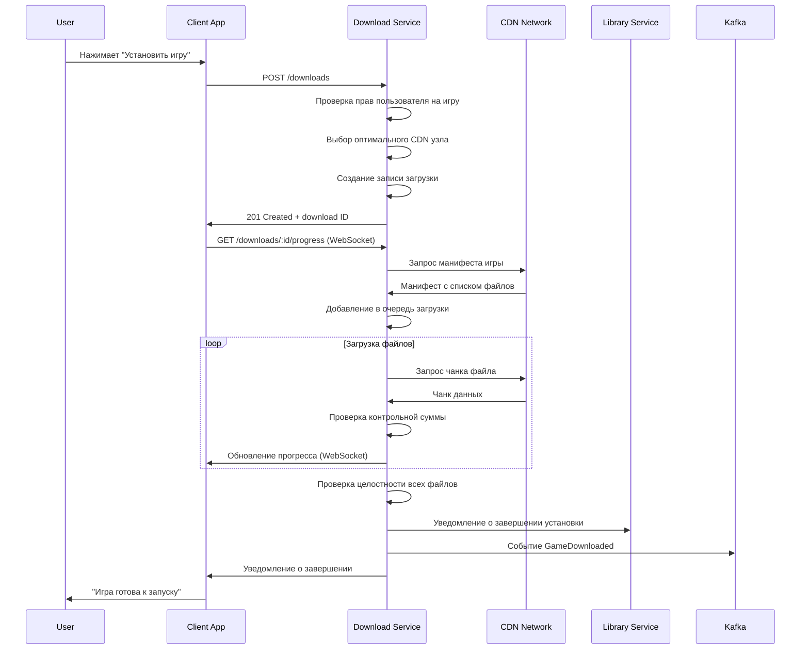
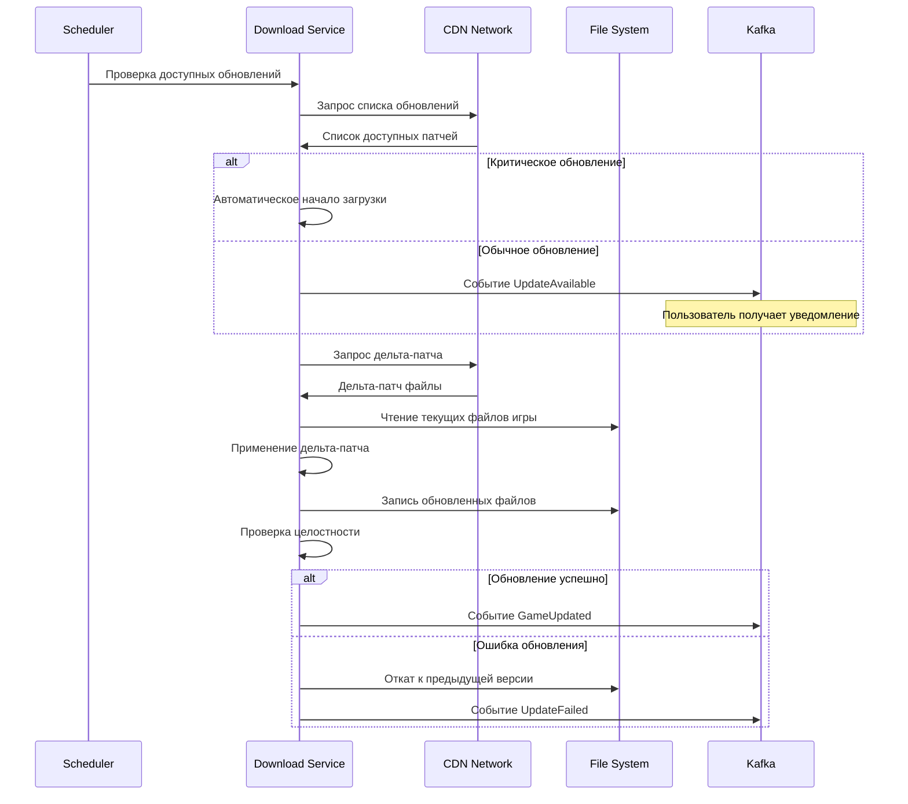
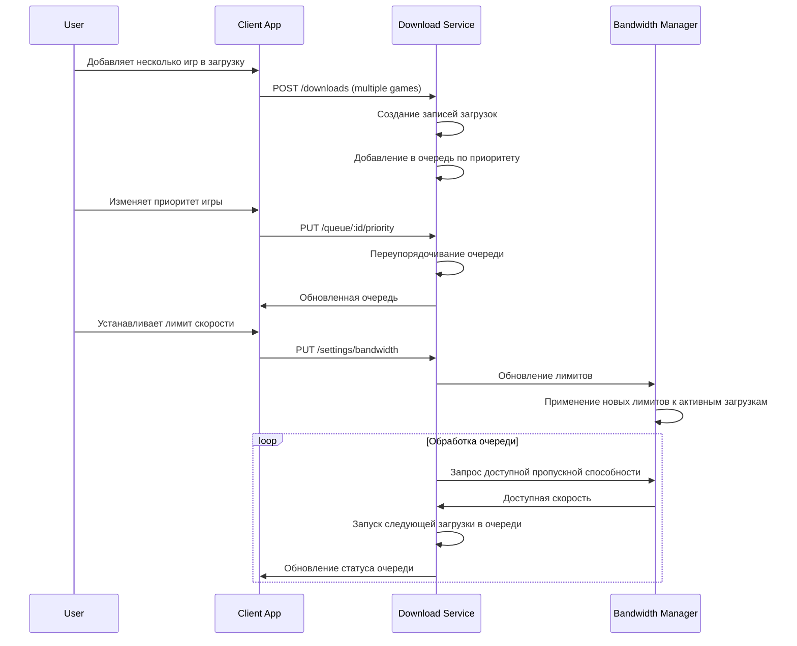
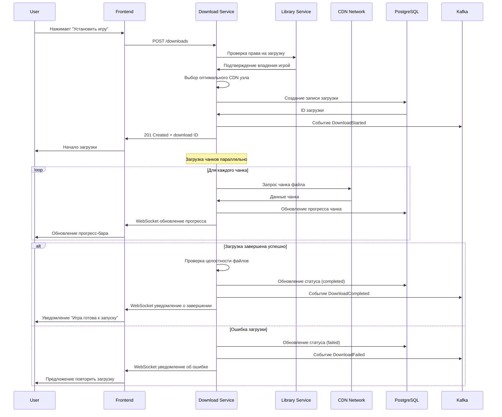
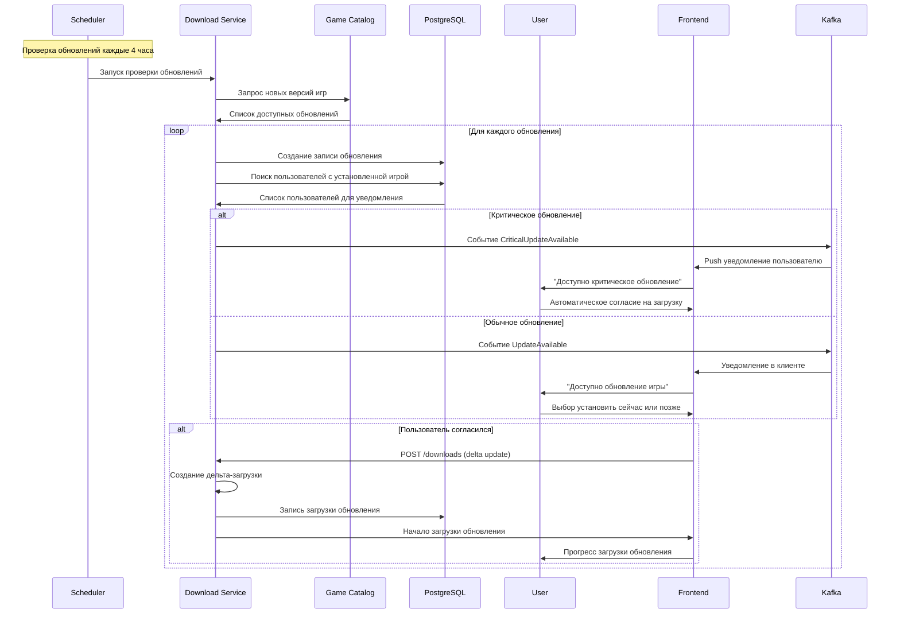
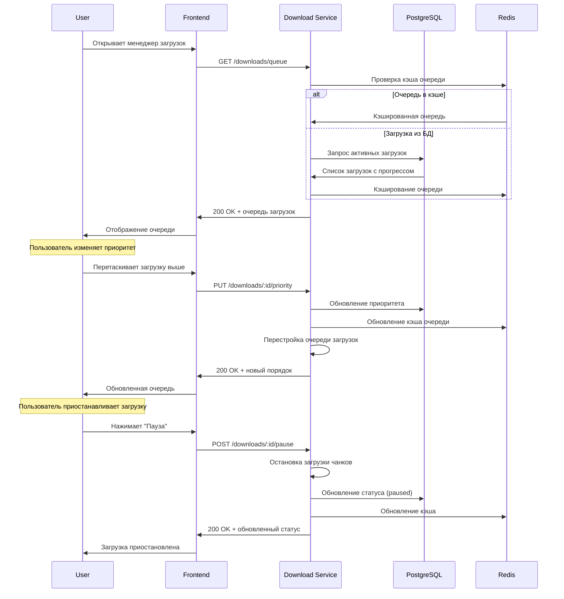
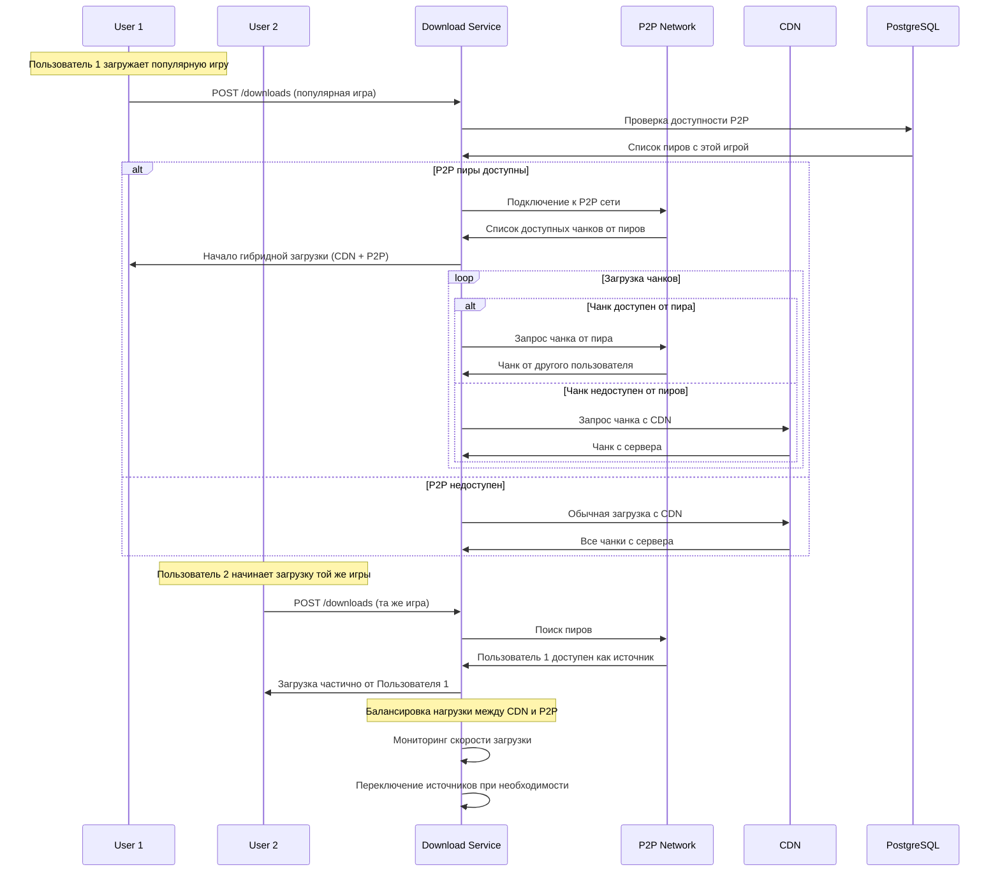

# Дизайн Download Service

## Обзор

Download Service является критически важным сервисом для загрузки и обновления игр российской игровой платформы. Сервис обеспечивает высокоскоростные загрузки через CDN, дельта-обновления, управление очередью загрузок, проверку целостности файлов и интеграцию с клиентскими приложениями.

### Ключевые принципы дизайна

- **Высокая скорость**: Оптимальное использование CDN и P2P технологий
- **Надежность**: Возобновление прерванных загрузок и проверка целостности
- **Масштабируемость**: Поддержка 100,000+ одновременных загрузок
- **Эффективность**: Дельта-обновления и сжатие контента
- **Управляемость**: Гибкое управление пропускной способностью

## Архитектура

### Общая архитектура

```mermaid
graph TB
    subgraph "CDN Network"
        CDN1[CDN Moscow]
        CDN2[CDN St.Petersburg]
        CDN3[CDN Novosibirsk]
        P2P[P2P Network]
    end
    
    subgraph "External Services"
        S3[S3 Storage]
        Torrent[BitTorrent Tracker]
        AV[Antivirus Scanner]
    end
    
    subgraph "API Gateway"
        Gateway[API Gateway]
    end
    
    subgraph "Download Service"
        API[REST API]
        DownloadManager[Download Manager]
        QueueManager[Queue Manager]
        UpdateManager[Update Manager]
        IntegrityChecker[Integrity Checker]
        BandwidthManager[Bandwidth Manager]
        Events[Event Publisher]
        
        API --> DownloadManager
        API --> QueueManager
        API --> UpdateManager
        DownloadManager --> IntegrityChecker
        DownloadManager --> BandwidthManager
        DownloadManager --> Events
        UpdateManager --> Events
    end
    
    subgraph "Data Layer"
        PostgreSQL[(PostgreSQL)]
        Redis[(Redis Cache)]
        Kafka[Apache Kafka]
    end
    
    subgraph "Other Services"
        Library[Library Service]
        User[User Service]
        Catalog[Game Catalog]
        Notification[Notification Service]
    end
    
    Gateway --> API
    DownloadManager --> CDN1
    DownloadManager --> CDN2
    DownloadManager --> CDN3
    DownloadManager --> P2P
    DownloadManager --> S3
    UpdateManager --> Torrent
    IntegrityChecker --> AV
    
    API --> PostgreSQL
    API --> Redis
    Events --> Kafka
    
    Kafka --> Library
    Kafka --> User
    Kafka --> Catalog
    Kafka --> Notification
```## 
API Эндпоинты и маршруты

### Структура API

```
Base URL: https://api.gaming-platform.ru/download-service/v1
```

### Download Management Endpoints

```typescript
// Управление загрузками
POST   /downloads                  // Создание новой загрузки
GET    /downloads                  // Список загрузок пользователя
GET    /downloads/:id              // Статус конкретной загрузки
PUT    /downloads/:id/pause        // Приостановка загрузки
PUT    /downloads/:id/resume       // Возобновление загрузки
PUT    /downloads/:id/cancel       // Отмена загрузки
DELETE /downloads/:id              // Удаление загрузки

// Очередь загрузок
GET    /queue                      // Очередь загрузок пользователя
PUT    /queue/reorder              // Изменение порядка в очереди
PUT    /queue/:id/priority         // Изменение приоритета загрузки
POST   /queue/pause-all            // Приостановка всех загрузок
POST   /queue/resume-all           // Возобновление всех загрузок

// Прогресс и статистика
GET    /downloads/:id/progress     // Детальный прогресс загрузки
GET    /downloads/:id/speed        // Текущая скорость загрузки
GET    /stats/bandwidth            // Статистика использования пропускной способности
GET    /stats/storage              // Использование дискового пространства
```

### Update Management Endpoints

```typescript
// Обновления игр
GET    /updates                    // Доступные обновления
POST   /updates/:gameId/check      // Проверка обновлений для игры
POST   /updates/:gameId/download   // Загрузка обновления
GET    /updates/:gameId/changelog  // Список изменений в обновлении

// Автоматические обновления
GET    /auto-updates/settings      // Настройки автообновлений
PUT    /auto-updates/settings      // Изменение настроек автообновлений
POST   /auto-updates/schedule      // Планирование обновлений
```

### Content Management Endpoints

```typescript
// Управление контентом
GET    /content/:gameId/manifest   // Манифест файлов игры
GET    /content/:gameId/chunks     // Список чанков для загрузки
POST   /content/:gameId/verify     // Проверка целостности файлов
POST   /content/:gameId/repair     // Восстановление поврежденных файлов

// Предзагрузка
POST   /preload/:gameId            // Начало предзагрузки
GET    /preload/:gameId/status     // Статус предзагрузки
POST   /preload/:gameId/unlock     // Разблокировка после релиза
```

### Settings & Configuration Endpoints

```typescript
// Настройки пользователя
GET    /settings                   // Настройки загрузок пользователя
PUT    /settings/bandwidth         // Лимиты пропускной способности
PUT    /settings/storage           // Настройки хранилища
PUT    /settings/schedule          // Расписание загрузок

// Региональные настройки
GET    /regions                    // Доступные регионы CDN
PUT    /regions/preferred          // Предпочитаемые регионы
GET    /regions/performance        // Производительность регионов
```

## User Flows (Пользовательские сценарии)

### 1. Загрузка новой игры



### 2. Обновление игры с дельта-патчем



### 3. Управление очередью загрузок



## Модели данных

### Основные сущности

```typescript
interface Download {
  id: string
  userId: string
  gameId: string
  
  // Метаданные игры
  gameName: string
  gameVersion: string
  
  // Статус загрузки
  status: DownloadStatus
  priority: number
  
  // Прогресс
  totalSize: number
  downloadedSize: number
  progress: number // 0-100
  
  // Скорость и время
  currentSpeed: number // bytes/sec
  averageSpeed: number
  estimatedTimeRemaining: number // seconds
  
  // Файлы
  totalFiles: number
  downloadedFiles: number
  failedFiles: string[]
  
  // CDN и источники
  cdnNodes: CDNNode[]
  activeSources: DownloadSource[]
  
  // Настройки
  bandwidthLimit?: number
  scheduledStart?: Date
  
  // Метаданные
  createdAt: Date
  startedAt?: Date
  completedAt?: Date
  lastResumedAt?: Date
  
  // Ошибки
  lastError?: string
  retryCount: number
}

interface DownloadChunk {
  id: string
  downloadId: string
  
  // Информация о чанке
  fileName: string
  chunkIndex: number
  offset: number
  size: number
  
  // Статус
  status: 'pending' | 'downloading' | 'completed' | 'failed'
  downloadedSize: number
  
  // Проверка целостности
  expectedHash: string
  actualHash?: string
  
  // Источник
  cdnUrl: string
  retryCount: number
  
  createdAt: Date
  completedAt?: Date
}

interface GameUpdate {
  id: string
  gameId: string
  
  // Версии
  fromVersion: string
  toVersion: string
  
  // Тип обновления
  updateType: 'patch' | 'hotfix' | 'major' | 'dlc'
  priority: 'low' | 'normal' | 'high' | 'critical'
  
  // Размер
  fullSize: number
  deltaSize: number
  
  // Файлы
  manifest: UpdateManifest
  changelog: string
  
  // Статус
  isAvailable: boolean
  isRequired: boolean
  
  // Даты
  releasedAt: Date
  availableUntil?: Date
  
  createdAt: Date
}

interface CDNNode {
  id: string
  region: string
  endpoint: string
  
  // Производительность
  latency: number
  bandwidth: number
  reliability: number
  
  // Статус
  isActive: boolean
  currentLoad: number
  maxConnections: number
  
  // Геолокация
  country: string
  city: string
  coordinates: {
    lat: number
    lng: number
  }
  
  lastCheckedAt: Date
}

interface UserDownloadSettings {
  userId: string
  
  // Пропускная способность
  maxDownloadSpeed?: number // bytes/sec
  maxUploadSpeed?: number // для P2P
  maxConcurrentDownloads: number
  
  // Расписание
  scheduledDownloads: boolean
  downloadSchedule: ScheduleRule[]
  
  // Хранилище
  defaultInstallPath: string
  installPaths: Record<string, string> // gameId -> path
  
  // Автообновления
  autoUpdatesEnabled: boolean
  autoUpdateSchedule: string // cron expression
  
  // P2P
  p2pEnabled: boolean
  p2pUploadLimit?: number
  
  // Уведомления
  notifyOnComplete: boolean
  notifyOnError: boolean
  
  updatedAt: Date
}
```

## Детальная схема базы данных

```sql
-- Загрузки пользователей
CREATE TABLE downloads (
    id UUID PRIMARY KEY DEFAULT gen_random_uuid(),
    user_id UUID NOT NULL,
    game_id VARCHAR(255) NOT NULL,
    
    -- Метаданные игры
    game_name VARCHAR(255) NOT NULL,
    game_version VARCHAR(50) NOT NULL,
    
    -- Статус загрузки
    status VARCHAR(20) DEFAULT 'pending' CHECK (status IN ('pending', 'downloading', 'paused', 'completed', 'failed', 'cancelled')),
    priority INTEGER DEFAULT 0,
    
    -- Прогресс
    total_size BIGINT NOT NULL,
    downloaded_size BIGINT DEFAULT 0,
    progress DECIMAL(5,2) DEFAULT 0,
    
    -- Скорость и время
    current_speed BIGINT DEFAULT 0,
    average_speed BIGINT DEFAULT 0,
    estimated_time_remaining INTEGER DEFAULT 0,
    
    -- Файлы
    total_files INTEGER NOT NULL,
    downloaded_files INTEGER DEFAULT 0,
    failed_files TEXT[] DEFAULT '{}',
    
    -- CDN и источники
    active_cdn_nodes JSONB DEFAULT '[]',
    active_sources JSONB DEFAULT '[]',
    
    -- Настройки
    bandwidth_limit BIGINT,
    scheduled_start TIMESTAMP,
    
    -- Метаданные
    created_at TIMESTAMP DEFAULT NOW(),
    started_at TIMESTAMP,
    completed_at TIMESTAMP,
    last_resumed_at TIMESTAMP,
    
    -- Ошибки
    last_error TEXT,
    retry_count INTEGER DEFAULT 0
);

-- Чанки загрузок
CREATE TABLE download_chunks (
    id UUID PRIMARY KEY DEFAULT gen_random_uuid(),
    download_id UUID NOT NULL REFERENCES downloads(id) ON DELETE CASCADE,
    
    -- Информация о чанке
    file_name VARCHAR(500) NOT NULL,
    chunk_index INTEGER NOT NULL,
    offset BIGINT NOT NULL,
    size BIGINT NOT NULL,
    
    -- Статус
    status VARCHAR(20) DEFAULT 'pending' CHECK (status IN ('pending', 'downloading', 'completed', 'failed')),
    downloaded_size BIGINT DEFAULT 0,
    
    -- Проверка целостности
    expected_hash VARCHAR(64) NOT NULL,
    actual_hash VARCHAR(64),
    
    -- Источник
    cdn_url VARCHAR(1000) NOT NULL,
    retry_count INTEGER DEFAULT 0,
    
    created_at TIMESTAMP DEFAULT NOW(),
    completed_at TIMESTAMP,
    
    UNIQUE(download_id, file_name, chunk_index)
);

-- Обновления игр
CREATE TABLE game_updates (
    id UUID PRIMARY KEY DEFAULT gen_random_uuid(),
    game_id VARCHAR(255) NOT NULL,
    
    -- Версии
    from_version VARCHAR(50) NOT NULL,
    to_version VARCHAR(50) NOT NULL,
    
    -- Тип обновления
    update_type VARCHAR(20) NOT NULL CHECK (update_type IN ('patch', 'hotfix', 'major', 'dlc')),
    priority VARCHAR(20) DEFAULT 'normal' CHECK (priority IN ('low', 'normal', 'high', 'critical')),
    
    -- Размер
    full_size BIGINT NOT NULL,
    delta_size BIGINT NOT NULL,
    
    -- Файлы
    manifest JSONB NOT NULL,
    changelog TEXT,
    
    -- Статус
    is_available BOOLEAN DEFAULT TRUE,
    is_required BOOLEAN DEFAULT FALSE,
    
    -- Даты
    released_at TIMESTAMP DEFAULT NOW(),
    available_until TIMESTAMP,
    
    created_at TIMESTAMP DEFAULT NOW(),
    
    UNIQUE(game_id, from_version, to_version)
);

-- CDN узлы
CREATE TABLE cdn_nodes (
    id UUID PRIMARY KEY DEFAULT gen_random_uuid(),
    region VARCHAR(50) NOT NULL,
    endpoint VARCHAR(500) NOT NULL,
    
    -- Производительность
    latency INTEGER DEFAULT 0,
    bandwidth BIGINT DEFAULT 0,
    reliability DECIMAL(5,2) DEFAULT 100.0,
    
    -- Статус
    is_active BOOLEAN DEFAULT TRUE,
    current_load INTEGER DEFAULT 0,
    max_connections INTEGER DEFAULT 1000,
    
    -- Геолокация
    country CHAR(2) NOT NULL,
    city VARCHAR(100) NOT NULL,
    latitude DECIMAL(10,8),
    longitude DECIMAL(11,8),
    
    last_checked_at TIMESTAMP DEFAULT NOW(),
    created_at TIMESTAMP DEFAULT NOW()
);

-- Настройки загрузок пользователей
CREATE TABLE user_download_settings (
    user_id UUID PRIMARY KEY,
    
    -- Пропускная способность
    max_download_speed BIGINT, -- bytes/sec
    max_upload_speed BIGINT,
    max_concurrent_downloads INTEGER DEFAULT 3,
    
    -- Расписание
    scheduled_downloads BOOLEAN DEFAULT FALSE,
    download_schedule JSONB DEFAULT '[]',
    
    -- Хранилище
    default_install_path TEXT NOT NULL,
    install_paths JSONB DEFAULT '{}',
    
    -- Автообновления
    auto_updates_enabled BOOLEAN DEFAULT TRUE,
    auto_update_schedule VARCHAR(100) DEFAULT '0 2 * * *', -- 2 AM daily
    
    -- P2P
    p2p_enabled BOOLEAN DEFAULT TRUE,
    p2p_upload_limit BIGINT,
    
    -- Уведомления
    notify_on_complete BOOLEAN DEFAULT TRUE,
    notify_on_error BOOLEAN DEFAULT TRUE,
    
    updated_at TIMESTAMP DEFAULT NOW()
);

-- Статистика загрузок
CREATE TABLE download_statistics (
    id UUID PRIMARY KEY DEFAULT gen_random_uuid(),
    user_id UUID NOT NULL,
    date DATE NOT NULL,
    
    -- Статистика за день
    total_downloaded BIGINT DEFAULT 0,
    total_uploaded BIGINT DEFAULT 0, -- P2P
    downloads_completed INTEGER DEFAULT 0,
    downloads_failed INTEGER DEFAULT 0,
    average_speed BIGINT DEFAULT 0,
    
    UNIQUE(user_id, date)
);

-- Очередь загрузок
CREATE TABLE download_queue (
    id UUID PRIMARY KEY DEFAULT gen_random_uuid(),
    user_id UUID NOT NULL,
    download_id UUID NOT NULL REFERENCES downloads(id) ON DELETE CASCADE,
    position INTEGER NOT NULL,
    added_at TIMESTAMP DEFAULT NOW(),
    
    UNIQUE(user_id, download_id),
    UNIQUE(user_id, position)
);

-- Предзагрузки
CREATE TABLE preloads (
    id UUID PRIMARY KEY DEFAULT gen_random_uuid(),
    game_id VARCHAR(255) NOT NULL,
    user_id UUID NOT NULL,
    
    -- Статус предзагрузки
    status VARCHAR(20) DEFAULT 'pending' CHECK (status IN ('pending', 'downloading', 'completed', 'unlocked')),
    
    -- Размер
    total_size BIGINT NOT NULL,
    downloaded_size BIGINT DEFAULT 0,
    
    -- Даты
    available_from TIMESTAMP NOT NULL,
    unlock_at TIMESTAMP NOT NULL,
    
    created_at TIMESTAMP DEFAULT NOW(),
    completed_at TIMESTAMP,
    unlocked_at TIMESTAMP,
    
    UNIQUE(game_id, user_id)
);

-- Индексы для производительности
CREATE INDEX idx_downloads_user_status ON downloads(user_id, status);
CREATE INDEX idx_downloads_status_created ON downloads(status, created_at);
CREATE INDEX idx_downloads_game_version ON downloads(game_id, game_version);

CREATE INDEX idx_download_chunks_download ON download_chunks(download_id, status);
CREATE INDEX idx_download_chunks_status ON download_chunks(status) WHERE status IN ('pending', 'downloading');

CREATE INDEX idx_game_updates_game ON game_updates(game_id, is_available) WHERE is_available = TRUE;
CREATE INDEX idx_game_updates_priority ON game_updates(priority, released_at);

CREATE INDEX idx_cdn_nodes_region_active ON cdn_nodes(region, is_active) WHERE is_active = TRUE;
CREATE INDEX idx_cdn_nodes_performance ON cdn_nodes(reliability DESC, latency ASC) WHERE is_active = TRUE;

CREATE INDEX idx_download_queue_user_position ON download_queue(user_id, position);

CREATE INDEX idx_preloads_unlock ON preloads(unlock_at, status) WHERE status = 'completed';

CREATE INDEX idx_download_stats_user_date ON download_statistics(user_id, date DESC);

-- Триггеры для автоматического обновления
CREATE OR REPLACE FUNCTION update_download_progress()
RETURNS TRIGGER AS $$
BEGIN
    -- Обновляем прогресс основной загрузки при завершении чанка
    IF NEW.status = 'completed' AND OLD.status != 'completed' THEN
        UPDATE downloads 
        SET downloaded_files = downloaded_files + 1,
            downloaded_size = (
                SELECT COALESCE(SUM(downloaded_size), 0) 
                FROM download_chunks 
                WHERE download_id = NEW.download_id
            ),
            progress = (
                SELECT (COUNT(*) FILTER (WHERE status = 'completed') * 100.0 / COUNT(*))::DECIMAL(5,2)
                FROM download_chunks 
                WHERE download_id = NEW.download_id
            )
        WHERE id = NEW.download_id;
    END IF;
    
    RETURN NEW;
END;
$$ LANGUAGE plpgsql;

CREATE TRIGGER trigger_update_download_progress
    AFTER UPDATE ON download_chunks
    FOR EACH ROW EXECUTE FUNCTION update_download_progress();
```

## User Flows (Пользовательские сценарии)

### 1. Загрузка игры



### 2. Обновление игры



### 3. Управление очередью загрузок



### 4. P2P распределение контента


CREATE OR REPLACE FUNCTION update_download_progress()
RETURNS TRIGGER AS $$
BEGIN
    -- Обновляем прогресс загрузки при изменении чанков
    UPDATE downloads 
    SET 
        downloaded_size = (
            SELECT COALESCE(SUM(downloaded_size), 0) 
            FROM download_chunks 
            WHERE download_id = NEW.download_id
        ),
        progress = (
            SELECT CASE 
                WHEN total_size > 0 THEN 
                    (COALESCE(SUM(dc.downloaded_size), 0) * 100.0 / total_size)
                ELSE 0 
            END
            FROM downloads d
            LEFT JOIN download_chunks dc ON dc.download_id = d.id
            WHERE d.id = NEW.download_id
            GROUP BY d.id, d.total_size
        ),
        downloaded_files = (
            SELECT COUNT(*) 
            FROM download_chunks 
            WHERE download_id = NEW.download_id AND status = 'completed'
        )
    WHERE id = NEW.download_id;
    
    RETURN NEW;
END;
$$ LANGUAGE plpgsql;

CREATE TRIGGER trigger_update_download_progress
    AFTER UPDATE ON download_chunks
    FOR EACH ROW EXECUTE FUNCTION update_download_progress();

-- Функция для очистки старых данных
CREATE OR REPLACE FUNCTION cleanup_old_downloads()
RETURNS void AS $$
BEGIN
    -- Удаляем завершенные загрузки старше 30 дней
    DELETE FROM downloads 
    WHERE status IN ('completed', 'cancelled') 
    AND completed_at < NOW() - INTERVAL '30 days';
    
    -- Удаляем старую статистику (старше 1 года)
    DELETE FROM download_statistics 
    WHERE date < CURRENT_DATE - INTERVAL '1 year';
    
    -- Удаляем просроченные предзагрузки
    DELETE FROM preloads 
    WHERE unlock_at < NOW() - INTERVAL '7 days' 
    AND status != 'unlocked';
END;
$$ LANGUAGE plpgsql;
```

Этот дизайн обеспечивает высокопроизводительную и надежную систему загрузок с поддержкой CDN, P2P, дельта-обновлений и гибкого управления для Download Service российской игровой платформы.