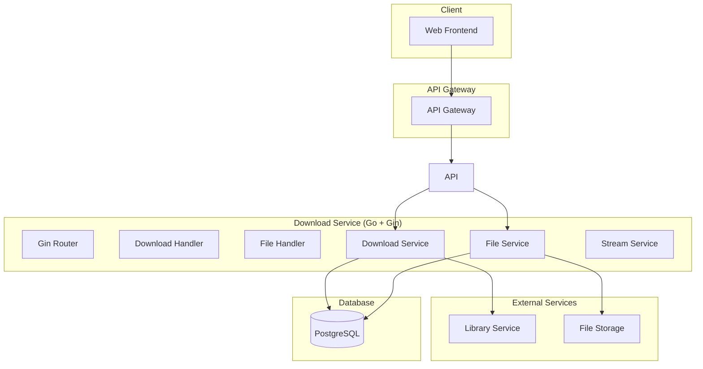

# Design Document - Download Service MVP

## Overview

Download Service - высокопроизводительный сервис загрузки игр для MVP российской игровой платформы. Обеспечивает быструю загрузку купленных игр с управлением процессом и оптимизацией пропускной способности.

**Технологический стек:** Go + Gin + PostgreSQL + Redis (высокопроизводительный стек для файловых операций)

## Architecture

### System Architecture



## Go Architecture

### Project Structure

```
download-service/
├── cmd/
│   └── server/
│       └── main.go
├── internal/
│   ├── handlers/
│   │   ├── download.go
│   │   └── file.go
│   ├── services/
│   │   ├── download.go
│   │   ├── file.go
│   │   └── stream.go
│   ├── models/
│   │   └── download.go
│   ├── repository/
│   │   └── postgres.go
│   └── middleware/
│       ├── auth.go
│       └── logging.go
├── pkg/
│   ├── config/
│   └── logger/
└── go.mod
```

### Gin Handlers

```go
// Download Handler
func (h *DownloadHandler) StartDownload(c *gin.Context) {
    var req StartDownloadRequest
    if err := c.ShouldBindJSON(&req); err != nil {
        c.JSON(400, gin.H{"error": err.Error()})
        return
    }
    
    download, err := h.downloadService.StartDownload(req.UserID, req.GameID)
    if err != nil {
        c.JSON(500, gin.H{"error": err.Error()})
        return
    }
    
    c.JSON(201, download)
}

func (h *DownloadHandler) GetDownloadStatus(c *gin.Context) {
    downloadID := c.Param("id")
    download, err := h.downloadService.GetDownload(downloadID)
    if err != nil {
        c.JSON(404, gin.H{"error": "Download not found"})
        return
    }
    
    c.JSON(200, download)
}
```

## Components and Interfaces

### REST API Endpoints

#### Downloads
- `POST /downloads` - Начать загрузку
- `GET /downloads/:id` - Статус загрузки
- `PUT /downloads/:id/pause` - Приостановить загрузку
- `PUT /downloads/:id/resume` - Возобновить загрузку
- `GET /downloads/user/:userId` - Загрузки пользователя

### Services

#### DownloadService
- `startDownload(userId, gameId)` - Начать загрузку
- `pauseDownload(downloadId)` - Приостановить загрузку
- `resumeDownload(downloadId)` - Возобновить загрузку
- `getDownloadStatus(downloadId)` - Статус загрузки

#### FileService
- `downloadFile(gameId, filePath)` - Загрузить файл
- `verifyFile(filePath, expectedSize)` - Проверить файл
- `cleanupFiles(downloadId)` - Очистить файлы

## Data Models

### Download Entity

```typescript
interface Download {
  id: string;
  userId: string;
  gameId: string;
  status: 'pending' | 'downloading' | 'paused' | 'completed' | 'failed';
  progress: number; // 0-100
  totalSize: number;
  downloadedSize: number;
  speed: number; // bytes per second
  createdAt: Date;
  updatedAt: Date;
}
```

### DownloadFile Entity

```typescript
interface DownloadFile {
  id: string;
  downloadId: string;
  fileName: string;
  filePath: string;
  fileSize: number;
  downloadedSize: number;
  status: 'pending' | 'downloading' | 'completed' | 'failed';
}
```

## Error Handling

### Error Types
- `ValidationError` - Ошибки валидации
- `DownloadNotFoundError` - Загрузка не найдена
- `AccessDeniedError` - Нет прав на игру
- `FileCorruptedError` - Файл поврежден
- `StorageError` - Ошибка хранилища

## Testing Strategy

### Unit Tests
- DownloadService методы
- FileService методы
- Валидация данных

### Integration Tests
- API endpoints
- Интеграция с Library Service
- File operations