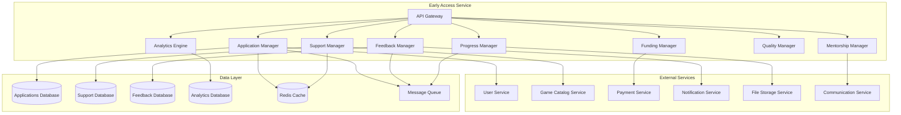

# Early Access Service - Дизайн

## 📋 **Обзор**

Early Access Service представляет собой комплексный микросервис для управления программой раннего доступа для независимых разработчиков. Сервис обеспечивает полный жизненный цикл участия в программе: от подачи заявки до успешного релиза, включая многоуровневую поддержку, менторство, финансирование и систему обратной связи.

## 🏗️ **Архитектура**

### **Общая архитектура**


### **Микросервисная архитектура**
- **API Gateway**: Единая точка входа с аутентификацией и авторизацией
- **Application Manager**: Управление заявками на участие в программе
- **Support Manager**: Многоуровневая система поддержки разработчиков
- **Mentorship Manager**: Система менторства и наставничества
- **Funding Manager**: Управление грантами и финансовой поддержкой
- **Feedback Manager**: Сбор и обработка обратной связи
- **Progress Manager**: Отслеживание прогресса разработки
- **Quality Manager**: Контроль качества и соответствия стандартам
- **Analytics Engine**: Аналитика эффективности программы

## 🔧 **Компоненты и интерфейсы**

### **1. Application Manager Component**
```typescript
interface ApplicationManager {
  // Управление заявками
  submitApplication(application: EarlyAccessApplication): Promise<ApplicationSubmission>;
  updateApplication(applicationId: string, updates: ApplicationUpdate): Promise<Application>;
  
  // Обработка заявок
  reviewApplication(applicationId: string, review: ApplicationReview): Promise<ReviewResult>;
  approveApplication(applicationId: string, supportLevel: SupportLevel): Promise<ApprovalResult>;
  rejectApplication(applicationId: string, reason: RejectionReason): Promise<void>;
  
  // Получение заявок
  getApplication(applicationId: string): Promise<Application>;
  getDeveloperApplications(developerId: string): Promise<Application[]>;
  getPendingApplications(): Promise<Application[]>;
  
  // Валидация
  validateApplicationRequirements(application: EarlyAccessApplication): Promise<ValidationResult>;
}

interface EarlyAccessApplication {
  developerId: string;
  gameId: string;
  gameConcept: GameConcept;
  playableDemo: DemoSubmission;
  developmentRoadmap: DevelopmentRoadmap;
  teamInformation: TeamInfo;
  marketingPlan: MarketingPlan;
  monetizationStrategy: MonetizationStrategy;
  requestedSupportLevel: SupportLevel;
  estimatedReleaseDate: Date;
}

interface Application {
  id: string;
  developerId: string;
  gameId: string;
  status: ApplicationStatus;
  supportLevel?: SupportLevel;
  submittedAt: Date;
  reviewedAt?: Date;
  approvedAt?: Date;
  reviewComments: ReviewComment[];
  requirements: ApplicationRequirement[];
  milestones: ApplicationMilestone[];
}

enum ApplicationStatus {
  DRAFT = 'draft',
  SUBMITTED = 'submitted',
  UNDER_REVIEW = 'under_review',
  APPROVED = 'approved',
  REJECTED = 'rejected',
  WITHDRAWN = 'withdrawn'
}

enum SupportLevel {
  BRONZE = 'bronze',
  SILVER = 'silver',
  GOLD = 'gold',
  PLATINUM = 'platinum'
}
```

### **2. Support Manager Component**
```typescript
interface SupportManager {
  // Управление поддержкой
  assignSupportLevel(developerId: string, level: SupportLevel): Promise<SupportAssignment>;
  updateSupportLevel(developerId: string, newLevel: SupportLevel): Promise<void>;
  
  // Техническая поддержка
  createSupportTicket(ticket: SupportTicketRequest): Promise<SupportTicket>;
  assignSupportManager(developerId: string, managerId: string): Promise<void>;
  
  // Маркетинговая поддержка
  requestMarketingSupport(request: MarketingSupportRequest): Promise<MarketingSupport>;
  schedulePromotionalCampaign(campaignRequest: CampaignRequest): Promise<Campaign>;
  
  // Техническая консультация
  requestTechnicalConsultation(request: TechnicalConsultationRequest): Promise<Consultation>;
  scheduleCodeReview(reviewRequest: CodeReviewRequest): Promise<CodeReview>;
}

interface SupportAssignment {
  id: string;
  developerId: string;
  supportLevel: SupportLevel;
  assignedManager?: string;
  benefits: SupportBenefit[];
  startDate: Date;
  reviewDate: Date;
  status: SupportStatus;
}

interface SupportBenefit {
  type: BenefitType;
  description: string;
  isActive: boolean;
  usageLimit?: number;
  usageCount: number;
}

enum BenefitType {
  TECHNICAL_SUPPORT = 'technical_support',
  MARKETING_SUPPORT = 'marketing_support',
  PRIORITY_REVIEW = 'priority_review',
  FEATURED_PLACEMENT = 'featured_placement',
  FINANCIAL_SUPPORT = 'financial_support',
  MENTORSHIP = 'mentorship'
}

interface SupportTicket {
  id: string;
  developerId: string;
  type: TicketType;
  priority: TicketPriority;
  subject: string;
  description: string;
  status: TicketStatus;
  assignedTo?: string;
  createdAt: Date;
  resolvedAt?: Date;
  responses: TicketResponse[];
}
```

### **3. Mentorship Manager Component**
```typescript
interface MentorshipManager {
  // Управление менторством
  requestMentor(request: MentorshipRequest): Promise<MentorshipAssignment>;
  assignMentor(developerId: string, mentorId: string): Promise<MentorshipPair>;
  
  // Менторские сессии
  scheduleMentorshipSession(session: SessionRequest): Promise<MentorshipSession>;
  conductMentorshipSession(sessionId: string): Promise<SessionResult>;
  
  // Отслеживание прогресса
  trackMentorshipProgress(pairId: string): Promise<MentorshipProgress>;
  provideMentorshipFeedback(feedback: MentorshipFeedback): Promise<void>;
  
  // Управление менторами
  registerMentor(mentor: MentorRegistration): Promise<Mentor>;
  getMentorAvailability(mentorId: string): Promise<MentorAvailability>;
}

interface MentorshipRequest {
  developerId: string;
  gameGenre: string;
  experienceLevel: ExperienceLevel;
  specificNeeds: string[];
  preferredMentorType: MentorType;
  timeCommitment: TimeCommitment;
}

interface MentorshipPair {
  id: string;
  developerId: string;
  mentorId: string;
  startDate: Date;
  endDate?: Date;
  status: MentorshipStatus;
  goals: MentorshipGoal[];
  sessions: MentorshipSession[];
  progress: MentorshipProgress;
}

interface Mentor {
  id: string;
  userId: string;
  expertise: string[];
  experience: number;
  specializations: string[];
  availability: MentorAvailability;
  rating: number;
  mentorshipCount: number;
  isActive: boolean;
}

enum MentorshipStatus {
  REQUESTED = 'requested',
  MATCHED = 'matched',
  ACTIVE = 'active',
  COMPLETED = 'completed',
  TERMINATED = 'terminated'
}
```

### **4. Funding Manager Component**
```typescript
interface FundingManager {
  // Управление грантами
  applyForGrant(application: GrantApplication): Promise<GrantSubmission>;
  reviewGrantApplication(applicationId: string, review: GrantReview): Promise<ReviewResult>;
  approveGrant(applicationId: string, terms: GrantTerms): Promise<Grant>;
  
  // Выплаты
  createMilestonePayment(grantId: string, milestoneId: string): Promise<Payment>;
  processMilestoneCompletion(milestoneId: string, evidence: MilestoneEvidence): Promise<void>;
  
  // Отслеживание использования
  trackGrantUsage(grantId: string): Promise<GrantUsage>;
  requestUsageReport(grantId: string): Promise<UsageReport>;
  
  // Возврат средств
  calculateRevenueShare(grantId: string, revenue: number): Promise<RevenueShare>;
  processRevenueShare(grantId: string, amount: number): Promise<void>;
}

interface GrantApplication {
  developerId: string;
  gameId: string;
  requestedAmount: number;
  purpose: GrantPurpose;
  budget: BudgetBreakdown;
  milestones: GrantMilestone[];
  expectedROI: number;
  riskAssessment: RiskAssessment;
}

interface Grant {
  id: string;
  developerId: string;
  gameId: string;
  approvedAmount: number;
  disbursedAmount: number;
  remainingAmount: number;
  terms: GrantTerms;
  milestones: GrantMilestone[];
  status: GrantStatus;
  approvedAt: Date;
  completedAt?: Date;
}

interface GrantTerms {
  revenueSharePercentage: number;
  revenueShareDuration: number; // в месяцах
  reportingRequirements: ReportingRequirement[];
  milestoneRequirements: MilestoneRequirement[];
  intellectualPropertyTerms: IPTerms;
}

enum GrantStatus {
  APPLIED = 'applied',
  UNDER_REVIEW = 'under_review',
  APPROVED = 'approved',
  ACTIVE = 'active',
  COMPLETED = 'completed',
  DEFAULTED = 'defaulted'
}
```

### **5. Feedback Manager Component**
```typescript
interface FeedbackManager {
  // Сбор обратной связи
  collectPlayerFeedback(feedback: PlayerFeedback): Promise<void>;
  aggregateFeedback(gameId: string, period: DateRange): Promise<FeedbackSummary>;
  
  // Анализ обратной связи
  analyzeFeedbackSentiment(gameId: string): Promise<SentimentAnalysis>;
  identifyCommonIssues(gameId: string): Promise<IssueReport>;
  
  // Коммуникация с разработчиками
  notifyDeveloperOfFeedback(developerId: string, feedback: CriticalFeedback): Promise<void>;
  createFeedbackReport(gameId: string): Promise<FeedbackReport>;
  
  // Система опросов
  createPlayerSurvey(survey: SurveyRequest): Promise<Survey>;
  analyzeSurveyResults(surveyId: string): Promise<SurveyAnalysis>;
}

interface PlayerFeedback {
  gameId: string;
  userId: string;
  type: FeedbackType;
  category: FeedbackCategory;
  rating: number;
  comment: string;
  attachments?: string[];
  gameVersion: string;
  platform: string;
  submittedAt: Date;
}

interface FeedbackSummary {
  gameId: string;
  period: DateRange;
  totalFeedback: number;
  averageRating: number;
  categoryBreakdown: Map<FeedbackCategory, number>;
  sentimentScore: number;
  commonIssues: CommonIssue[];
  improvementSuggestions: string[];
}

enum FeedbackType {
  BUG_REPORT = 'bug_report',
  FEATURE_REQUEST = 'feature_request',
  BALANCE_ISSUE = 'balance_issue',
  UI_UX_FEEDBACK = 'ui_ux_feedback',
  GENERAL_FEEDBACK = 'general_feedback'
}

enum FeedbackCategory {
  GAMEPLAY = 'gameplay',
  GRAPHICS = 'graphics',
  AUDIO = 'audio',
  PERFORMANCE = 'performance',
  STORY = 'story',
  CONTROLS = 'controls'
}
```

### **6. Progress Manager Component**
```typescript
interface ProgressManager {
  // Отслеживание прогресса
  createDevelopmentRoadmap(roadmap: DevelopmentRoadmap): Promise<Roadmap>;
  updateMilestone(milestoneId: string, update: MilestoneUpdate): Promise<Milestone>;
  
  // Публичные обновления
  publishProgressUpdate(update: ProgressUpdate): Promise<void>;
  scheduleRegularUpdates(schedule: UpdateSchedule): Promise<void>;
  
  // Аналитика прогресса
  calculateDevelopmentVelocity(gameId: string): Promise<DevelopmentVelocity>;
  predictReleaseDate(gameId: string): Promise<ReleasePrediction>;
  
  // Коммуникация с сообществом
  createDevBlog(blog: DevBlogPost): Promise<void>;
  scheduleDevStream(stream: DevStreamRequest): Promise<DevStream>;
}

interface DevelopmentRoadmap {
  gameId: string;
  developerId: string;
  phases: DevelopmentPhase[];
  milestones: Milestone[];
  estimatedReleaseDate: Date;
  lastUpdated: Date;
}

interface Milestone {
  id: string;
  name: string;
  description: string;
  targetDate: Date;
  completedDate?: Date;
  status: MilestoneStatus;
  deliverables: Deliverable[];
  dependencies: string[];
  progress: number;
}

interface ProgressUpdate {
  gameId: string;
  developerId: string;
  title: string;
  content: string;
  achievements: string[];
  upcomingFeatures: string[];
  screenshots?: string[];
  videos?: string[];
  publishedAt: Date;
}

enum MilestoneStatus {
  NOT_STARTED = 'not_started',
  IN_PROGRESS = 'in_progress',
  COMPLETED = 'completed',
  DELAYED = 'delayed',
  CANCELLED = 'cancelled'
}
```

### **7. Quality Manager Component**
```typescript
interface QualityManager {
  // Контроль качества
  performQualityCheck(gameId: string): Promise<QualityReport>;
  setQualityStandards(standards: QualityStandards): Promise<void>;
  
  // Мониторинг соответствия
  monitorGameCompliance(gameId: string): Promise<ComplianceStatus>;
  flagQualityIssues(gameId: string, issues: QualityIssue[]): Promise<void>;
  
  // Процесс исключения
  initiateRemovalProcess(gameId: string, reason: RemovalReason): Promise<RemovalProcess>;
  appealRemovalDecision(gameId: string, appeal: RemovalAppeal): Promise<void>;
}

interface QualityReport {
  gameId: string;
  overallScore: number;
  categories: QualityCategory[];
  issues: QualityIssue[];
  recommendations: string[];
  complianceStatus: ComplianceStatus;
  generatedAt: Date;
}

interface QualityStandards {
  minimumRating: number;
  maximumBugReports: number;
  requiredFeatures: string[];
  performanceStandards: PerformanceStandard[];
  contentGuidelines: ContentGuideline[];
}
```

## 📊 **Модели данных**

### **Основные сущности**
```typescript
interface Application {
  id: string;
  developerId: string;
  gameId: string;
  status: ApplicationStatus;
  supportLevel?: SupportLevel;
  submittedAt: Date;
  reviewedAt?: Date;
  approvedAt?: Date;
  gameConcept: GameConcept;
  playableDemo: DemoSubmission;
  developmentRoadmap: DevelopmentRoadmap;
  teamInformation: TeamInfo;
  reviewComments: ReviewComment[];
  requirements: ApplicationRequirement[];
}

interface Grant {
  id: string;
  developerId: string;
  gameId: string;
  approvedAmount: number;
  disbursedAmount: number;
  remainingAmount: number;
  terms: GrantTerms;
  milestones: GrantMilestone[];
  status: GrantStatus;
  approvedAt: Date;
  completedAt?: Date;
  usageReports: UsageReport[];
}

interface MentorshipPair {
  id: string;
  developerId: string;
  mentorId: string;
  startDate: Date;
  endDate?: Date;
  status: MentorshipStatus;
  goals: MentorshipGoal[];
  sessions: MentorshipSession[];
  progress: MentorshipProgress;
  feedback: MentorshipFeedback[];
}

interface SupportAssignment {
  id: string;
  developerId: string;
  supportLevel: SupportLevel;
  assignedManager?: string;
  benefits: SupportBenefit[];
  startDate: Date;
  reviewDate: Date;
  status: SupportStatus;
  tickets: SupportTicket[];
}
```

## 🛡️ **Обработка ошибок**

### **Стратегия обработки ошибок**
```typescript
enum EarlyAccessErrorCode {
  // Ошибки заявок
  APPLICATION_NOT_FOUND = 'APPLICATION_NOT_FOUND',
  INVALID_APPLICATION_DATA = 'INVALID_APPLICATION_DATA',
  APPLICATION_ALREADY_EXISTS = 'APPLICATION_ALREADY_EXISTS',
  REQUIREMENTS_NOT_MET = 'REQUIREMENTS_NOT_MET',
  
  // Ошибки поддержки
  SUPPORT_LEVEL_NOT_AVAILABLE = 'SUPPORT_LEVEL_NOT_AVAILABLE',
  MANAGER_NOT_AVAILABLE = 'MANAGER_NOT_AVAILABLE',
  SUPPORT_LIMIT_EXCEEDED = 'SUPPORT_LIMIT_EXCEEDED',
  
  // Ошибки менторства
  MENTOR_NOT_AVAILABLE = 'MENTOR_NOT_AVAILABLE',
  MENTORSHIP_LIMIT_REACHED = 'MENTORSHIP_LIMIT_REACHED',
  INCOMPATIBLE_MATCH = 'INCOMPATIBLE_MATCH',
  
  // Ошибки финансирования
  GRANT_NOT_ELIGIBLE = 'GRANT_NOT_ELIGIBLE',
  INSUFFICIENT_FUNDS = 'INSUFFICIENT_FUNDS',
  MILESTONE_NOT_COMPLETED = 'MILESTONE_NOT_COMPLETED',
  
  // Ошибки качества
  QUALITY_STANDARDS_NOT_MET = 'QUALITY_STANDARDS_NOT_MET',
  COMPLIANCE_VIOLATION = 'COMPLIANCE_VIOLATION'
}
```

## 🧪 **Стратегия тестирования**

### **Модульное тестирование**
- Тестирование логики оценки заявок
- Валидация требований программы
- Проверка расчетов грантов
- Тестирование алгоритмов подбора менторов

### **Интеграционное тестирование**
- Интеграция с User Service
- Интеграция с Payment Service для грантов
- Интеграция с Game Catalog Service
- Тестирование системы уведомлений

### **End-to-End тестирование**
- Полный цикл участия в программе
- Процесс менторства от начала до конца
- Выдача и использование грантов
- Система обратной связи и улучшений

## 🔧 **Технические детали реализации**

### **База данных**
- **PostgreSQL**: Основное хранилище заявок и данных программы
- **Redis**: Кэширование и управление сессиями
- **ClickHouse**: Аналитические данные и метрики

### **Безопасность**
- Защита конфиденциальных данных разработчиков
- Audit logging всех операций с грантами
- Контроль доступа к менторским материалам
- Защита интеллектуальной собственности

### **Производительность**
- Асинхронная обработка заявок
- Кэширование результатов анализа обратной связи
- Оптимизация запросов аналитики
- Масштабирование системы поддержки

### **Мониторинг**
- Метрики успешности программы
- Мониторинг качества игр в программе
- Алерты на критические проблемы
- Дашборды для менеджеров программы