# Дизайн Environmental Service

## Обзор

Environmental Service обеспечивает экологическую ответственность российской Steam-платформы через мониторинг углеродного следа, оптимизацию энергопотребления, продвижение экологических инициатив среди игроков и достижение углеродной нейтральности.

## Архитектура

### Высокоуровневая архитектура

```mermaid
graph TB
    subgraph "Environmental Service"
        API[Environmental API Gateway]
        CARBON[Carbon Footprint Tracker]
        ENERGY[Energy Optimization Engine]
        ECO[Eco Initiatives Manager]
        RATING[Green Rating System]
        OFFSET[Carbon Offset Manager]
        MONITOR[Environmental Monitor]
        EDUCATION[Eco Education Engine]
    end
    
    subgraph "Data Collection"
        METRICS[Infrastructure Metrics]
        GAME_METRICS[Game Performance Metrics]
        USER_METRICS[User Activity Metrics]
        EXTERNAL[External Environmental Data]
    end
    
    subgraph "External Partners"
        CARBON_OFFSET[Carbon Offset Providers]
        ECO_ORGS[Environmental Organizations]
        RENEWABLE[Renewable Energy Providers]
        CERTIFICATION[Green Certifications]
    end
    
    subgraph "Internal Services"
        ACHIEVEMENT[Achievement Service]
        ANALYTICS[Analytics Service]
        USER[User Service]
        GAME_CATALOG[Game Catalog Service]
        NOTIFICATION[Notification Service]
    end
    
    API --> CARBON
    API --> ENERGY
    API --> ECO
    API --> RATING
    API --> OFFSET
    API --> MONITOR
    API --> EDUCATION
    
    CARBON --> METRICS
    ENERGY --> GAME_METRICS
    MONITOR --> USER_METRICS
    ECO --> EXTERNAL
    
    OFFSET --> CARBON_OFFSET
    ECO --> ECO_ORGS
    ENERGY --> RENEWABLE
    RATING --> CERTIFICATION
    
    API --> ACHIEVEMENT
    API --> ANALYTICS
    API --> USER
    API --> GAME_CATALOG
    API --> NOTIFICATION
```



### Микросервисная архитектура

Environmental Service состоит из следующих основных компонентов:

1. **Environmental API Gateway** - единая точка входа для экологических операций
2. **Carbon Footprint Tracker** - отслеживание углеродного следа
3. **Energy Optimization Engine** - оптимизация энергопотребления
4. **Eco Initiatives Manager** - управление экологическими инициативами
5. **Green Rating System** - система экологических рейтингов
6. **Carbon Offset Manager** - управление углеродными офсетами
7. **Environmental Monitor** - мониторинг экологических показателей
8. **Eco Education Engine** - образовательные экологические программы

## Компоненты и интерфейсы

### Environmental API Gateway

**Назначение:** Централизованная точка доступа ко всем экологическим функциям

**Основные функции:**
- Аутентификация и авторизация экологических операций
- Маршрутизация запросов к соответствующим экологическим сервисам
- Rate limiting для предотвращения злоупотреблений
- Интеграция с внешними экологическими API
- Мониторинг и логирование экологических операций

**API Endpoints:**
```
GET /api/v1/carbon-footprint/{userId}
GET /api/v1/energy/optimization-suggestions
POST /api/v1/eco-initiatives/participate
GET /api/v1/games/{gameId}/green-rating
POST /api/v1/carbon-offset/purchase
GET /api/v1/environmental/dashboard
POST /api/v1/eco-education/complete-module
GET /api/v1/sustainability/report
```

### Carbon Footprint Tracker

**Назначение:** Отслеживание и расчет углеродного следа пользователей и платформы

**Основные функции:**
- Мониторинг энергопотребления игровых устройств
- Расчет углеродного следа игровых сессий
- Агрегация данных по пользователям и играм
- Прогнозирование экологического воздействия
- Генерация персональных экологических отчетов

**Методология расчета:**
- Энергопотребление устройства (кВт⋅ч)
- Углеродная интенсивность электросети региона (кг CO₂/кВт⋅ч)
- Время игровой сессии
- Оптимизация настроек графики
- Серверная нагрузка и дата-центры

**Формула расчета:**
```
CO₂ = Энергопотребление × Углеродная_интенсивность × Время_сессии × Коэффициент_оптимизации
```

### Energy Optimization Engine

**Назначение:** Оптимизация энергопотребления игр и инфраструктуры

**Стратегии оптимизации:**
- **Adaptive Graphics** - динамическая подстройка графических настроек
- **Smart Scheduling** - планирование ресурсоемких операций на периоды низкого потребления
- **Green Mode** - специальный режим для минимизации энергопотребления
- **Server Optimization** - оптимизация серверной инфраструктуры

**Алгоритмы оптимизации:**
- Machine Learning для предсказания оптимальных настроек
- Real-time мониторинг производительности
- Балансировка между качеством и энергоэффективностью
- Адаптация под характеристики устройства

### Eco Initiatives Manager

**Назначение:** Управление экологическими инициативами и событиями

**Типы инициатив:**
- **Tree Planting Campaigns** - кампании по посадке деревьев
- **Clean Energy Challenges** - челленджи по использованию чистой энергии
- **Eco Gaming Events** - экологические игровые события
- **Environmental Education** - образовательные программы
- **Carbon Neutral Gaming** - программы углеродно-нейтрального гейминга

**Механизмы участия:**
- Игровые достижения за экологические действия
- Виртуальная валюта за участие в эко-программах
- Реальные награды и сертификаты
- Социальные функции для командного участия

### Green Rating System

**Назначение:** Система экологических рейтингов для игр и разработчиков

**Критерии оценки игр:**
- **Energy Efficiency** - энергоэффективность кода
- **Resource Usage** - использование системных ресурсов
- **Carbon Footprint** - углеродный след при разработке
- **Sustainable Practices** - экологические практики разработчика
- **Educational Value** - образовательная ценность в области экологии

**Рейтинговая шкала:**
- 🌱 **Green Champion** (90-100 баллов) - лидер экологичности
- 🌿 **Eco Friendly** (70-89 баллов) - экологически дружественный
- 🟡 **Moderate Impact** (50-69 баллов) - умеренное воздействие
- 🟠 **High Impact** (30-49 баллов) - высокое воздействие
- 🔴 **Eco Unfriendly** (0-29 баллов) - неэкологичный

### Carbon Offset Manager

**Назначение:** Управление программами углеродной компенсации

**Типы офсетов:**
- **Reforestation Projects** - проекты лесовосстановления
- **Renewable Energy** - проекты возобновляемой энергетики
- **Carbon Capture** - технологии улавливания углерода
- **Methane Reduction** - проекты снижения выбросов метана

**Партнеры по офсетам:**
- Международные организации (Gold Standard, VCS)
- Российские экологические фонды
- Локальные проекты лесовосстановления
- Технологические стартапы в области климата

### Environmental Monitor

**Назначение:** Мониторинг экологических показателей в реальном времени

**Мониторируемые метрики:**
- Общее энергопотребление платформы
- Углеродный след по регионам
- Эффективность оптимизационных мер
- Прогресс достижения экологических целей
- Воздействие экологических инициатив

**Системы алертов:**
- Превышение углеродных лимитов
- Неэффективное использование энергии
- Возможности для дополнительной оптимизации
- Успешное достижение экологических целей

### Eco Education Engine

**Назначение:** Образовательные программы по экологии через игры

**Образовательные модули:**
- **Climate Change Basics** - основы изменения климата
- **Renewable Energy** - возобновляемые источники энергии
- **Sustainable Living** - устойчивый образ жизни
- **Biodiversity Conservation** - сохранение биоразнообразия
- **Circular Economy** - циркулярная экономика

**Игровые механики обучения:**
- Интерактивные симуляции экосистем
- Квесты по решению экологических проблем
- Виртуальные лаборатории для экспериментов
- Соревнования по экологическим знаниям

## Модели данных

### Carbon Footprint Record
```json
{
  "record_id": "string",
  "user_id": "string",
  "session_id": "string",
  "game_id": "string",
  "timestamp": "2025-08-24T10:00:00Z",
  "energy_consumption_kwh": 0.5,
  "carbon_emissions_kg": 0.25,
  "device_info": {
    "type": "desktop",
    "gpu": "RTX 4070",
    "cpu": "Intel i7-12700K",
    "power_rating_watts": 500
  },
  "session_duration_minutes": 120,
  "graphics_settings": "high",
  "optimization_applied": true,
  "region_carbon_intensity": 0.5,
  "renewable_energy_percentage": 30
}
```

### Eco Initiative
```json
{
  "initiative_id": "string",
  "title": "Plant Trees for Gaming",
  "description": "Plant a tree for every 10 hours of eco-friendly gaming",
  "type": "tree_planting",
  "status": "active",
  "start_date": "2025-08-24T00:00:00Z",
  "end_date": "2025-12-31T23:59:59Z",
  "target_participants": 10000,
  "current_participants": 7500,
  "environmental_impact": {
    "trees_planted": 15000,
    "co2_offset_tons": 300,
    "biodiversity_areas_protected": 5
  },
  "participation_requirements": {
    "min_eco_score": 50,
    "required_actions": ["enable_green_mode", "complete_eco_quiz"]
  },
  "rewards": {
    "achievement_id": "eco_warrior",
    "virtual_currency": 1000,
    "real_world_certificate": true
  }
}
```

### Green Rating
```json
{
  "rating_id": "string",
  "game_id": "string",
  "overall_score": 85,
  "rating_level": "eco_friendly",
  "last_updated": "2025-08-24T10:00:00Z",
  "criteria_scores": {
    "energy_efficiency": 90,
    "resource_usage": 80,
    "carbon_footprint": 85,
    "sustainable_practices": 88,
    "educational_value": 75
  },
  "optimization_suggestions": [
    "Implement dynamic resolution scaling",
    "Optimize shader compilation",
    "Add green mode settings"
  ],
  "certification": {
    "certified": true,
    "certifying_body": "Green Gaming Alliance",
    "certificate_id": "GGA-2025-001234"
  },
  "developer_commitment": {
    "carbon_neutral": true,
    "renewable_energy": 80,
    "offset_programs": ["reforestation", "renewable_energy"]
  }
}
```

### Environmental Dashboard
```json
{
  "dashboard_id": "string",
  "user_id": "string",
  "period": "monthly",
  "date_range": {
    "start": "2025-08-01T00:00:00Z",
    "end": "2025-08-31T23:59:59Z"
  },
  "carbon_footprint": {
    "total_kg_co2": 12.5,
    "daily_average": 0.4,
    "reduction_from_previous_period": 15,
    "offset_purchased_kg": 15.0
  },
  "energy_consumption": {
    "total_kwh": 25.0,
    "renewable_percentage": 40,
    "optimization_savings_kwh": 5.2
  },
  "eco_achievements": [
    {
      "achievement_id": "green_gamer",
      "earned_date": "2025-08-15T10:00:00Z",
      "environmental_impact": "Saved 2kg CO2"
    }
  ],
  "initiatives_participated": 3,
  "trees_planted": 2,
  "eco_score": 78,
  "recommendations": [
    "Enable green mode for 20% energy savings",
    "Try eco-friendly games this week"
  ]
}
```

### Carbon Offset Transaction
```json
{
  "transaction_id": "string",
  "user_id": "string",
  "offset_amount_kg_co2": 10.0,
  "cost_rub": 500,
  "offset_type": "reforestation",
  "project_id": "siberian_forest_restoration_2025",
  "project_details": {
    "name": "Siberian Forest Restoration",
    "location": "Krasnoyarsk Region, Russia",
    "certification": "Gold Standard",
    "additional_benefits": ["biodiversity", "local_employment"]
  },
  "purchase_date": "2025-08-24T10:00:00Z",
  "certificate_url": "https://certificates.greenoffset.ru/cert123",
  "retirement_date": "2025-08-24T10:00:00Z",
  "status": "completed"
}
```

## Обработка ошибок

### Стратегии обработки ошибок

1. **Data Collection Failures**
   - Fallback на estimated values при недоступности точных данных
   - Graceful degradation мониторинга
   - Offline caching для критических экологических данных
   - Уведомления о проблемах сбора данных

2. **Carbon Offset Failures**
   - Retry механизмы для транзакций офсетов
   - Alternative offset providers при недоступности основного
   - Manual verification для критических офсетов
   - Refund procedures при неудачных транзакциях

3. **External API Failures**
   - Cached environmental data для continuity
   - Multiple data sources для reliability
   - Graceful degradation экологических функций
   - User notifications о временных ограничениях

### Коды ошибок

```
ENV_001: Carbon footprint calculation failed
ENV_002: Energy optimization unavailable
ENV_003: Eco initiative enrollment failed
ENV_004: Green rating calculation error
ENV_005: Carbon offset purchase failed
ENV_006: Environmental data unavailable
ENV_007: Certification verification failed
ENV_008: External partner API error
ENV_009: Insufficient eco credits
ENV_010: Environmental goal not met
```

## Стратегия тестирования

### Unit Testing
- Тестирование алгоритмов расчета углеродного следа
- Валидация энергетических оптимизаций
- Проверка логики экологических рейтингов
- Тестирование образовательных модулей

### Integration Testing
- Тестирование интеграции с внешними экологическими API
- Проверка взаимодействия с carbon offset провайдерами
- Тестирование интеграции с игровыми движками
- End-to-end тестирование экологических инициатив

### Environmental Impact Testing
- Измерение реального энергопотребления оптимизаций
- Валидация точности расчетов углеродного следа
- Тестирование эффективности образовательных программ
- A/B тестирование экологических интерфейсов

### Compliance Testing
- Проверка соответствия экологическим стандартам
- Валидация сертификационных процессов
- Тестирование отчетности для регуляторов
- Audit trail testing для экологических данных

## Безопасность и соответствие стандартам

### Environmental Standards Compliance
- ISO 14001 (Environmental Management Systems)
- GHG Protocol для расчета углеродного следа
- Science Based Targets initiative (SBTi)
- UN Sustainable Development Goals alignment

### Data Security
- Encrypted storage экологических данных
- Secure transmission к партнерам по офсетам
- Access control для чувствительных экологических данных
- Audit logging всех экологических операций

### Certification Management
- Secure storage сертификатов и credentials
- Automated renewal процессы
- Verification workflows для новых сертификаций
- Integration с международными certification bodies

## Мониторинг и метрики

### Environmental KPIs
- Platform carbon footprint (тонны CO₂/месяц)
- Energy efficiency improvements (% снижения)
- User eco engagement rate
- Carbon offset coverage percentage

### Business Impact Metrics
- Cost savings от энергетических оптимизаций
- Revenue от eco-friendly игр
- User retention в экологических программах
- Brand reputation metrics

### Technical Performance
- Energy optimization algorithm effectiveness
- Carbon calculation accuracy
- API response times для экологических сервисов
- Data collection completeness

### Educational Effectiveness
- Eco education module completion rates
- Knowledge retention после обучения
- Behavioral change metrics
- Real-world action conversion rates

## Партнерства и интеграции

### Carbon Offset Providers
- Российские экологические фонды
- Международные offset marketplaces
- Local reforestation projects
- Technology-based carbon removal

### Environmental Organizations
- WWF Russia
- Greenpeace Russia
- Russian Geographical Society
- Local environmental NGOs

### Certification Bodies
- Green Gaming Alliance
- Climate Neutral Certified
- B Corporation certification
- Russian Green Building Council

### Government Initiatives
- Russian Ministry of Natural Resources programs
- Regional environmental initiatives
- Federal climate action plans
- International climate agreements

## Масштабирование и будущее развитие

### Horizontal Scaling
- Distributed carbon footprint calculations
- Multi-region environmental monitoring
- Scalable offset transaction processing
- Global eco initiative management

### Advanced Features Roadmap
- AI-powered environmental optimization
- Blockchain-based carbon credit trading
- VR environmental education experiences
- IoT integration для точного energy monitoring

### International Expansion
- Multi-country carbon intensity data
- Localized environmental regulations
- Regional offset project partnerships
- Cultural adaptation экологических программ