# Дизайн Family Sharing Service

## Обзор

Family Sharing Service обеспечивает безопасное семейное использование российской Steam-платформы с возможностью совместного доступа к играм, родительского контроля, мониторинга игровой активности детей и соблюдения российского законодательства о защите несовершеннолетних.

## Архитектура

### Высокоуровневая архитектура

```mermaid
graph TB
    subgraph "Family Sharing Service"
        API[Family API Gateway]
        FAMILY[Family Manager]
        PARENTAL[Parental Control]
        SHARING[Game Sharing Engine]
        MONITOR[Activity Monitor]
        COMPLIANCE[Age Compliance]
        REWARDS[Rewards System]
        EDUCATION[Education Integration]
    end
    
    subgraph "Storage Layer"
        POSTGRES[(PostgreSQL)]
        REDIS[(Redis Cache)]
        ANALYTICS[Analytics DB]
        LOGS[Audit Logs]
    end
    
    subgraph "External Services"
        USER[User Service]
        LIBRARY[Library Service]
        REGIONAL[Regional Compliance]
        PAYMENT[Payment Service]
        ACHIEVEMENT[Achievement Service]
        SOCIAL[Social Service]
        NOTIFICATION[Notification Service]
    end
    
    subgraph "Educational Systems"
        SCHOOL[School Systems]
        LEARNING[Learning Platforms]
        GRADEBOOK[Electronic Gradebook]
    end
    
    API --> FAMILY
    API --> PARENTAL
    API --> SHARING
    API --> MONITOR
    API --> COMPLIANCE
    API --> REWARDS
    API --> EDUCATION
    
    FAMILY --> POSTGRES
    PARENTAL --> REDIS
    MONITOR --> ANALYTICS
    COMPLIANCE --> LOGS
    
    API --> USER
    API --> LIBRARY
    API --> REGIONAL
    API --> PAYMENT
    API --> ACHIEVEMENT
    API --> SOCIAL
    API --> NOTIFICATION
    
    EDUCATION --> SCHOOL
    EDUCATION --> LEARNING
    EDUCATION --> GRADEBOOK
```



### Микросервисная архитектура

Family Sharing Service состоит из следующих основных компонентов:

1. **Family API Gateway** - единая точка входа для семейных операций
2. **Family Manager** - управление семейными группами и связями
3. **Parental Control** - система родительского контроля
4. **Game Sharing Engine** - механизм совместного доступа к играм
5. **Activity Monitor** - мониторинг игровой активности детей
6. **Age Compliance** - соблюдение возрастных ограничений
7. **Rewards System** - система мотивации и наград
8. **Education Integration** - интеграция с образовательными системами

## Компоненты и интерфейсы

### Family API Gateway

**Назначение:** Централизованная точка доступа ко всем семейным функциям

**Основные функции:**
- Аутентификация и авторизация семейных операций
- Валидация семейных связей и прав доступа
- Rate limiting для предотвращения злоупотреблений
- Логирование всех семейных операций
- Интеграция с системой уведомлений

**API Endpoints:**
```
POST /api/v1/family/create
POST /api/v1/family/invite/{userId}
DELETE /api/v1/family/remove/{userId}
GET /api/v1/family/members
POST /api/v1/parental/limits/{childId}
GET /api/v1/parental/activity/{childId}
POST /api/v1/sharing/enable/{gameId}
GET /api/v1/sharing/available/{childId}
POST /api/v1/rewards/grant/{childId}
```

### Family Manager

**Назначение:** Управление семейными группами и связями

**Основные функции:**
- Создание и управление семейными группами
- Приглашение и удаление членов семьи
- Управление ролями (родитель, ребенок, опекун)
- Верификация семейных связей
- Автоматическое управление возрастными переходами

**Семейные роли:**
- **Организатор семьи** - полные права управления
- **Родитель** - права родительского контроля
- **Взрослый** - ограниченные права управления
- **Подросток** (13-17 лет) - частичная самостоятельность
- **Ребенок** (до 13 лет) - полный родительский контроль

**Ограничения семейной группы:**
- Максимум 6 членов семьи
- Максимум 2 организатора
- Обязательная верификация родительских прав
- Географические ограничения (один регион)

### Parental Control

**Назначение:** Система родительского контроля и ограничений

**Основные функции:**
- Установка временных лимитов игры
- Контроль доступа к контенту по возрасту
- Мониторинг игровой активности
- Управление покупками и тратами
- Контроль социальных взаимодействий

**Типы ограничений:**
- **Временные лимиты** - ежедневные/еженедельные лимиты игрового времени
- **Возрастные ограничения** - блокировка контента по возрастному рейтингу
- **Временные окна** - разрешенные часы для игр
- **Финансовые лимиты** - ограничения на покупки
- **Социальные ограничения** - контроль общения и друзей

**Система уведомлений:**
- Real-time уведомления о нарушениях
- Ежедневные отчеты об активности
- Еженедельные сводки и аналитика
- Экстренные уведомления о проблемах

### Game Sharing Engine

**Назначение:** Механизм совместного доступа к играм в семье

**Основные функции:**
- Предоставление доступа к семейным библиотекам
- Управление одновременным доступом к играм
- Проверка возрастных ограничений
- Приоритизация доступа владельца игры
- Синхронизация семейных покупок

**Правила совместного доступа:**
- Владелец игры имеет приоритетный доступ
- Одновременно играть может только один член семьи
- Возрастные ограничения применяются автоматически
- Образовательные игры доступны без ограничений
- DLC и дополнения наследуются от основной игры

**Алгоритм распределения доступа:**
1. Проверка возрастных ограничений
2. Проверка доступности игры (не играет ли владелец)
3. Проверка временных лимитов ребенка
4. Проверка родительских разрешений
5. Предоставление доступа с мониторингом

### Activity Monitor

**Назначение:** Мониторинг игровой активности детей

**Основные функции:**
- Отслеживание времени игры по играм и категориям
- Мониторинг социальных взаимодействий
- Анализ игрового поведения и предпочтений
- Выявление потенциально проблемного контента
- Генерация отчетов для родителей

**Отслеживаемые метрики:**
- Общее время игры за день/неделю/месяц
- Время по категориям игр (экшен, образовательные, стратегии)
- Социальная активность (чаты, друзья, группы)
- Покупки и траты
- Достижения и прогресс в играх

**Типы отчетов:**
- Ежедневные сводки активности
- Еженедельные аналитические отчеты
- Месячные тренды и сравнения
- Специальные отчеты по запросу

### Age Compliance

**Назначение:** Соблюдение возрастных ограничений и российского законодательства

**Основные функции:**
- Применение российских возрастных рейтингов
- Блокировка неподходящего контента
- Верификация возраста пользователей
- Соблюдение закона о защите детей от вредной информации
- Интеграция с Regional Compliance Service

**Российские возрастные категории:**
- **0+** - для детей любого возраста
- **6+** - для детей старше 6 лет
- **12+** - для детей старше 12 лет
- **16+** - для детей старше 16 лет
- **18+** - только для взрослых

**Система фильтрации контента:**
- Автоматическая классификация игр по возрасту
- Блокировка контента с насилием, алкоголем, наркотиками
- Фильтрация пользовательского контента
- Модерация чатов и сообщений

### Rewards System

**Назначение:** Система мотивации и наград для детей

**Основные функции:**
- Создание системы достижений для семьи
- Награждение за образовательную активность
- Мотивационные программы для учебы
- Семейные челленджи и конкурсы
- Интеграция с системой достижений платформы

**Типы наград:**
- **Временные бонусы** - дополнительное игровое время
- **Игровые награды** - скидки на игры, DLC, внутриигровые предметы
- **Семейные достижения** - совместные награды для всей семьи
- **Образовательные бонусы** - доступ к премиум образовательному контенту

### Education Integration

**Назначение:** Интеграция с образовательными системами

**Основные функции:**
- Подключение к электронным дневникам
- Синхронизация с системами дистанционного обучения
- Интеграция с образовательными платформами
- Связь игровой активности с учебными успехами
- Автоматическое управление доступом на основе оценок

**Поддерживаемые системы:**
- Российская электронная школа (РЭШ)
- Московская электронная школа (МЭШ)
- Дневник.ру
- Учи.ру
- Региональные образовательные порталы

## Модели данных

### Family Group
```json
{
  "family_id": "string",
  "name": "Семья Ивановых",
  "organizer_id": "string",
  "created_at": "2025-08-24T10:00:00Z",
  "region": "RU",
  "members": [
    {
      "user_id": "string",
      "role": "parent",
      "joined_at": "2025-08-24T10:00:00Z",
      "permissions": ["manage_children", "approve_purchases"]
    }
  ],
  "settings": {
    "shared_library": true,
    "purchase_approval_required": true,
    "activity_reports": "weekly",
    "emergency_contacts": ["email@example.com"]
  },
  "status": "active"
}
```

### Parental Control Settings
```json
{
  "control_id": "string",
  "child_id": "string",
  "parent_id": "string",
  "time_limits": {
    "daily_limit_minutes": 120,
    "weekly_limit_minutes": 840,
    "allowed_hours": {
      "weekdays": ["16:00-20:00"],
      "weekends": ["10:00-12:00", "14:00-20:00"]
    },
    "bedtime_restriction": "22:00-07:00"
  },
  "content_restrictions": {
    "max_age_rating": "12+",
    "blocked_categories": ["horror", "gambling"],
    "educational_priority": true,
    "custom_blocked_games": ["game_id_1"]
  },
  "social_restrictions": {
    "friend_approval_required": true,
    "chat_monitoring": true,
    "voice_chat_disabled": false,
    "stranger_communication": "blocked"
  },
  "purchase_limits": {
    "monthly_limit_rub": 2000,
    "approval_required": true,
    "allowed_categories": ["educational"]
  },
  "updated_at": "2025-08-24T10:00:00Z"
}
```

### Activity Record
```json
{
  "activity_id": "string",
  "child_id": "string",
  "date": "2025-08-24",
  "total_playtime_minutes": 95,
  "games_played": [
    {
      "game_id": "string",
      "playtime_minutes": 60,
      "category": "educational",
      "age_rating": "6+",
      "achievements_unlocked": 2
    }
  ],
  "social_activity": {
    "messages_sent": 15,
    "friends_interacted": 3,
    "new_friend_requests": 1
  },
  "violations": [
    {
      "type": "time_limit_exceeded",
      "timestamp": "2025-08-24T20:05:00Z",
      "action_taken": "game_terminated"
    }
  ],
  "educational_progress": {
    "educational_games_time": 45,
    "learning_achievements": 3,
    "skill_improvements": ["math", "reading"]
  }
}
```

### Game Sharing Status
```json
{
  "sharing_id": "string",
  "game_id": "string",
  "owner_id": "string",
  "family_id": "string",
  "shared_with": [
    {
      "user_id": "string",
      "access_level": "full",
      "restrictions": ["time_limited"],
      "last_played": "2025-08-24T15:00:00Z"
    }
  ],
  "current_player": "string",
  "sharing_rules": {
    "simultaneous_play": false,
    "owner_priority": true,
    "age_restrictions_apply": true
  },
  "usage_stats": {
    "total_shared_hours": 120,
    "most_active_user": "string",
    "peak_usage_time": "16:00-18:00"
  }
}
```

### Educational Integration
```json
{
  "integration_id": "string",
  "child_id": "string",
  "school_system": "dnevnik_ru",
  "connection_status": "active",
  "last_sync": "2025-08-24T08:00:00Z",
  "academic_data": {
    "current_grades": {
      "math": 4,
      "russian": 5,
      "english": 4
    },
    "attendance_rate": 0.95,
    "behavior_score": "good",
    "recent_achievements": ["math_olympiad_winner"]
  },
  "gaming_rewards": {
    "bonus_time_earned": 30,
    "educational_content_unlocked": ["advanced_math_games"],
    "restrictions_lifted": ["weekend_extended_hours"]
  },
  "automation_rules": {
    "good_grades_bonus": 15,
    "poor_grades_restriction": 30,
    "absence_penalty": 60
  }
}
```

## Обработка ошибок

### Стратегии обработки ошибок

1. **Family Management Errors**
   - Валидация семейных связей перед операциями
   - Graceful handling при недоступности User Service
   - Rollback изменений при частичных сбоях
   - Уведомление всех членов семьи о критических изменениях

2. **Parental Control Violations**
   - Немедленное применение ограничений
   - Уведомление родителей в real-time
   - Логирование всех нарушений для аудита
   - Escalation при повторных нарушениях

3. **Game Sharing Conflicts**
   - Приоритизация владельца игры
   - Graceful termination игровых сессий
   - Уведомление о конфликтах доступа
   - Automatic retry для временных проблем

4. **Educational Integration Failures**
   - Fallback на cached данные об успеваемости
   - Manual override для родителей
   - Уведомление о проблемах синхронизации
   - Periodic retry для восстановления связи

### Коды ошибок

```
FAMILY_001: Family group not found
FAMILY_002: Maximum family size exceeded
FAMILY_003: Insufficient permissions
FAMILY_004: Age verification required
FAMILY_005: Parental approval required
FAMILY_006: Time limit exceeded
FAMILY_007: Content blocked by age rating
FAMILY_008: Game sharing conflict
FAMILY_009: Educational system unavailable
FAMILY_010: Purchase limit exceeded
```

## Стратегия тестирования

### Unit Testing
- Тестирование логики родительского контроля
- Валидация алгоритмов совместного доступа
- Проверка возрастных ограничений
- Тестирование системы наград

### Integration Testing
- Тестирование интеграции с User Service
- Проверка взаимодействия с Library Service
- Тестирование образовательных интеграций
- End-to-end тестирование семейных сценариев

### Security Testing
- Тестирование изоляции семейных данных
- Проверка прав доступа и авторизации
- Валидация защиты детских данных
- Penetration testing семейных API

### Compliance Testing
- Тестирование соответствия российскому законодательству
- Проверка возрастных ограничений
- Валидация защиты персональных данных детей
- Audit trail testing

## Безопасность и конфиденциальность

### Защита детских данных
- Минимизация сбора персональных данных детей
- Encrypted storage всех детских данных
- Ограниченный доступ только для родителей
- Автоматическое удаление данных при достижении совершеннолетия

### Семейная приватность
- Изоляция данных между семьями
- Secure sharing только внутри семейной группы
- Audit trails для всех операций с детскими данными
- Compliance с российским законодательством о персональных данных

### Родительская верификация
- Обязательная верификация родительских прав
- Multi-factor authentication для критических операций
- Secure communication каналы для семейных уведомлений
- Emergency access procedures

## Мониторинг и метрики

### Family Metrics
- Количество активных семейных групп
- Средний размер семьи
- Adoption rate семейных функций
- User satisfaction семейными возможностями

### Parental Control Metrics
- Эффективность временных ограничений
- Частота нарушений по возрастам
- Usage patterns образовательного контента
- Parent engagement с отчетами

### Safety Metrics
- Blocked content attempts
- Successful age verification rate
- Educational integration success rate
- Child safety incident reports

### Technical Metrics
- API response times для семейных операций
- Game sharing conflict resolution time
- Educational system sync success rate
- Real-time notification delivery rate

## Соответствие российскому законодательству

### Закон о защите детей от вредной информации
- Автоматическая классификация контента по возрастам
- Блокировка запрещенного для детей контента
- Система возрастной верификации
- Отчетность о заблокированном контенте

### Персональные данные детей
- Минимизация сбора данных о детях
- Согласие родителей на обработку данных
- Secure storage и transmission
- Право на удаление данных

### Образовательные стандарты
- Интеграция с российскими образовательными системами
- Поддержка государственных образовательных программ
- Соответствие ФГОС требованиям
- Отчетность для образовательных учреждений

## Масштабирование

### Horizontal Scaling
- Kubernetes для оркестрации семейных сервисов
- Load balancing для API Gateway
- Auto-scaling на основе семейной активности
- Distributed caching для семейных данных

### Data Partitioning
- Sharding семейных групп по регионам
- Separate databases для детских данных
- Optimized indexing для быстрых семейных запросов
- Automated backup для критических семейных данных

### Performance Optimization
- Caching семейных настроек и ограничений
- Async processing для non-critical операций
- Batch processing для отчетов и аналитики
- CDN для образовательного контента