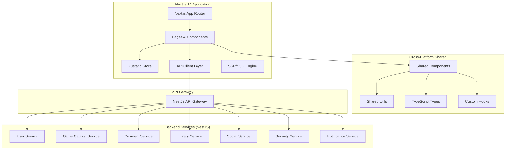

# Design Document - Frontend Application MVP

## Overview

Frontend Application - кросс-платформенное веб-приложение для MVP российской игровой платформы, построенное на Next.js 14 с 85-90% переиспользования кода между платформами. Обеспечивает современный пользовательский интерфейс для всех основных функций платформы.

## Technology Stack

### Core Technologies
- **Framework**: Next.js 14 + React 18 + TypeScript
- **Features**: SSR/SSG, SEO оптимизация, PWA готовность
- **Build**: Webpack (встроенный в Next.js)
- **Deployment**: Vercel / Docker
- **State Management**: Zustand (легковесная альтернатива Redux)
- **Styling**: Tailwind CSS + CSS Modules
- **API Client**: Axios с TypeScript типизацией
- **Forms**: React Hook Form + Zod валидация
- **Testing**: Jest + React Testing Library + Playwright (E2E)

### Cross-Platform Architecture
- **Web Application**: Next.js 14 (основная платформа)
- **Mobile Preparation**: Shared components для React Native
- **Desktop Preparation**: Shared logic для Tauri
- **Code Reuse**: 85-90% переиспользования между платформами

## Architecture

### System Architecture



## Components and Interfaces

### Next.js App Router Structure

#### App Directory Structure
```
app/
├── (auth)/
│   ├── login/page.tsx
│   └── register/page.tsx
├── (dashboard)/
│   ├── library/page.tsx
│   ├── profile/page.tsx
│   └── friends/page.tsx
├── games/
│   ├── page.tsx (catalog)
│   └── [id]/page.tsx (details)
├── layout.tsx (root layout)
├── page.tsx (home)
├── loading.tsx
├── error.tsx
└── not-found.tsx
```

### Shared Components (Cross-Platform Ready)

#### Layout Components
- `RootLayout` - Next.js root layout с провайдерами
- `Header` - Адаптивная шапка с навигацией
- `Footer` - Подвал сайта
- `Sidebar` - Боковая панель для desktop
- `MobileNav` - Мобильная навигация
- `ThemeProvider` - Провайдер тем оформления

#### Game Components
- `GameCard` - Переиспользуемая карточка игры
- `GameGrid` - Сетка игр с виртуализацией
- `GameSearch` - Компонент поиска с debounce
- `GameFilters` - Фильтры с состоянием в URL
- `GameDetails` - Детальная информация об игре
- `PurchaseButton` - Кнопка покупки с состояниями

#### User Components
- `UserAvatar` - Аватар пользователя
- `UserProfile` - Профиль с редактированием
- `FriendsList` - Список друзей с поиском
- `ChatWindow` - Окно чата (подготовка к real-time)

#### UI Components (Design System)
- `Button` - Кнопки всех типов
- `Input` - Поля ввода с валидацией
- `Modal` - Модальные окна
- `Toast` - Уведомления
- `LoadingSpinner` - Индикаторы загрузки
- `ErrorBoundary` - Обработка ошибок

### State Management (Zustand)

#### Store Slices
```typescript
// stores/auth.ts
interface AuthStore {
  user: User | null;
  token: string | null;
  isLoading: boolean;
  login: (credentials: LoginCredentials) => Promise<void>;
  logout: () => void;
  register: (data: RegisterData) => Promise<void>;
}

// stores/games.ts
interface GamesStore {
  catalog: Game[];
  currentGame: Game | null;
  filters: GameFilters;
  searchQuery: string;
  isLoading: boolean;
  fetchGames: () => Promise<void>;
  setFilters: (filters: GameFilters) => void;
  searchGames: (query: string) => void;
}

// stores/library.ts
interface LibraryStore {
  games: LibraryGame[];
  downloads: DownloadStatus[];
  isLoading: boolean;
  fetchLibrary: () => Promise<void>;
  startDownload: (gameId: string) => Promise<void>;
}
```

## Data Models

### TypeScript Interfaces (Shared across platforms)

```typescript
// types/user.ts
interface User {
  id: string;
  email: string;
  username: string;
  displayName: string;
  avatar?: string;
  createdAt: Date;
  lastLoginAt: Date;
}

interface LoginCredentials {
  email: string;
  password: string;
}

interface RegisterData {
  email: string;
  username: string;
  password: string;
  confirmPassword: string;
}

// types/game.ts
interface Game {
  id: string;
  title: string;
  description: string;
  shortDescription: string;
  price: number;
  discountPrice?: number;
  images: GameImage[];
  videos: GameVideo[];
  genre: string[];
  developer: string;
  publisher: string;
  releaseDate: Date;
  rating: number;
  reviewCount: number;
  systemRequirements: SystemRequirements;
  tags: string[];
}

interface GameImage {
  id: string;
  url: string;
  type: 'screenshot' | 'artwork' | 'logo';
  order: number;
}

interface LibraryGame {
  gameId: string;
  game: Game;
  purchaseDate: Date;
  downloadStatus: 'not_started' | 'downloading' | 'paused' | 'completed' | 'error';
  downloadProgress?: number;
  installPath?: string;
  lastPlayedAt?: Date;
  playtime: number;
}

// types/social.ts
interface Friend {
  id: string;
  user: User;
  status: 'pending' | 'accepted' | 'blocked';
  createdAt: Date;
}

interface Message {
  id: string;
  senderId: string;
  receiverId: string;
  content: string;
  type: 'text' | 'image' | 'game_invite';
  createdAt: Date;
  readAt?: Date;
}
```

### API Response Types

```typescript
// types/api.ts
interface ApiResponse<T> {
  success: boolean;
  data: T;
  message?: string;
  errors?: ValidationError[];
}

interface PaginatedResponse<T> {
  items: T[];
  total: number;
  page: number;
  limit: number;
  hasNext: boolean;
  hasPrev: boolean;
}

interface ValidationError {
  field: string;
  message: string;
}
```

## REST API Integration

### API Client Architecture

```typescript
// lib/api/client.ts
class ApiClient {
  private baseURL: string;
  private token: string | null = null;

  constructor(baseURL: string) {
    this.baseURL = baseURL;
  }

  setToken(token: string) {
    this.token = token;
  }

  async request<T>(endpoint: string, options: RequestOptions): Promise<ApiResponse<T>> {
    // Стандартная обработка HTTP запросов
    // Автоматическое добавление JWT токена
    // Обработка ошибок и retry логика
  }
}

// API Services
class UserService {
  async login(credentials: LoginCredentials): Promise<ApiResponse<{ user: User; token: string }>> {
    return apiClient.request('/auth/login', {
      method: 'POST',
      body: credentials
    });
  }

  async register(data: RegisterData): Promise<ApiResponse<User>> {
    return apiClient.request('/auth/register', {
      method: 'POST',
      body: data
    });
  }
}
```

### REST Endpoints Integration

```typescript
// services/games.service.ts
export const gamesService = {
  // GET /api/games
  getGames: (params: GameFilters) => apiClient.get<PaginatedResponse<Game>>('/games', { params }),
  
  // GET /api/games/:id
  getGame: (id: string) => apiClient.get<Game>(`/games/${id}`),
  
  // POST /api/games/:id/purchase
  purchaseGame: (id: string, paymentData: PaymentData) => 
    apiClient.post<PurchaseResult>(`/games/${id}/purchase`, paymentData),
};

// services/library.service.ts
export const libraryService = {
  // GET /api/library
  getLibrary: () => apiClient.get<LibraryGame[]>('/library'),
  
  // POST /api/library/:gameId/download
  startDownload: (gameId: string) => 
    apiClient.post<DownloadInfo>(`/library/${gameId}/download`),
};
```

## Error Handling

### Error Types & Handling

```typescript
// types/errors.ts
class ApiError extends Error {
  constructor(
    public status: number,
    public message: string,
    public errors?: ValidationError[]
  ) {
    super(message);
  }
}

// Error Boundary Component
export function ErrorBoundary({ children }: { children: React.ReactNode }) {
  return (
    <ErrorBoundaryProvider
      fallback={({ error, resetError }) => (
        <ErrorFallback error={error} onReset={resetError} />
      )}
    >
      {children}
    </ErrorBoundaryProvider>
  );
}

// Toast Notifications
export const toast = {
  success: (message: string) => showToast('success', message),
  error: (message: string) => showToast('error', message),
  warning: (message: string) => showToast('warning', message),
  info: (message: string) => showToast('info', message),
};
```

### Form Validation (Zod + React Hook Form)

```typescript
// schemas/auth.schema.ts
export const loginSchema = z.object({
  email: z.string().email('Неверный формат email'),
  password: z.string().min(6, 'Пароль должен быть не менее 6 символов'),
});

// components/LoginForm.tsx
export function LoginForm() {
  const { register, handleSubmit, formState: { errors } } = useForm({
    resolver: zodResolver(loginSchema)
  });

  const onSubmit = async (data: LoginFormData) => {
    try {
      await authStore.login(data);
      router.push('/');
    } catch (error) {
      toast.error('Ошибка входа в систему');
    }
  };
}
```

## Testing Strategy

### Testing Stack
- **Unit Tests**: Jest + React Testing Library
- **Integration Tests**: MSW (Mock Service Worker) для API
- **E2E Tests**: Playwright для критических пользовательских сценариев
- **Visual Tests**: Chromatic для компонентов

### Test Structure

```typescript
// __tests__/components/GameCard.test.tsx
describe('GameCard', () => {
  it('should render game information correctly', () => {
    render(<GameCard game={mockGame} />);
    expect(screen.getByText(mockGame.title)).toBeInTheDocument();
  });

  it('should handle purchase button click', async () => {
    const onPurchase = jest.fn();
    render(<GameCard game={mockGame} onPurchase={onPurchase} />);
    
    await user.click(screen.getByRole('button', { name: /купить/i }));
    expect(onPurchase).toHaveBeenCalledWith(mockGame.id);
  });
});

// __tests__/e2e/purchase-flow.spec.ts
test('user can purchase a game', async ({ page }) => {
  await page.goto('/games/1');
  await page.click('[data-testid="purchase-button"]');
  await page.fill('[data-testid="card-number"]', '4111111111111111');
  await page.click('[data-testid="confirm-purchase"]');
  await expect(page.locator('[data-testid="success-message"]')).toBeVisible();
});
```

## Performance Optimization

### Next.js Optimizations
- **SSR/SSG**: Статическая генерация для каталога игр
- **Image Optimization**: Next.js Image component с lazy loading
- **Code Splitting**: Автоматическое разделение кода по маршрутам
- **Bundle Analysis**: webpack-bundle-analyzer для оптимизации размера

### Runtime Optimizations
- **Virtual Scrolling**: Для больших списков игр
- **Debounced Search**: Оптимизация поиска
- **Memoization**: React.memo для тяжелых компонентов
- **Lazy Loading**: Динамический импорт компонентов