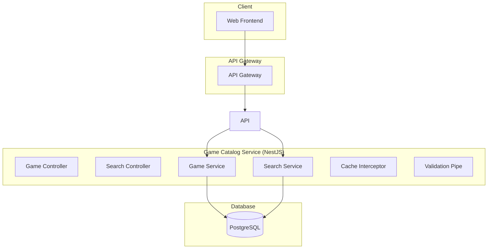

# Design Document - Game Catalog Service MVP

## Overview

Game Catalog Service - базовый сервис каталога игр для MVP российской игровой платформы. Обеспечивает просмотр каталога игр и детальную информацию о каждой игре через REST API.

**Технологический стек:** NestJS + TypeScript + PostgreSQL + Redis (основной стек для бизнес-логики)

## Architecture

### System Architecture



## NestJS Architecture

### Module Structure

```typescript
@Module({
  imports: [
    TypeOrmModule.forFeature([Game, Genre, Developer]),
    CacheModule.register({
      ttl: 300, // 5 minutes cache for games
    }),
  ],
  controllers: [GameController, SearchController],
  providers: [
    GameService,
    SearchService,
    GameRepository,
  ],
  exports: [GameService],
})
export class GameCatalogModule {}
```

### Controllers

```typescript
@Controller('games')
export class GameController {
  constructor(private readonly gameService: GameService) {}

  @Get()
  @UseInterceptors(CacheInterceptor)
  async getGames(@Query() query: GetGamesDto) {
    return this.gameService.getGames(query);
  }

  @Get(':id')
  @UseInterceptors(CacheInterceptor)
  async getGame(@Param('id') id: string) {
    return this.gameService.getGameById(id);
  }
}
```

## Components and Interfaces

### REST API Endpoints

#### Games
- `GET /games` - Получить список игр с пагинацией
- `GET /games/:id` - Получить детальную информацию об игре
- `GET /games/search` - Поиск игр по названию
- `GET /games/:id/purchase-info` - Получить информацию для покупки (для Payment Service)

### Services

#### GameService
- `getAllGames(page, limit)` - Получить список игр
- `getGameById(id)` - Получить игру по ID
- `getGameDetails(id)` - Получить детальную информацию

#### SearchService
- `searchGames(query, page, limit)` - Поиск игр
- `getGamesByGenre(genre)` - Игры по жанру

#### PurchaseInfoService
- `getGamePurchaseInfo(gameId)` - Получить информацию для покупки игры
- `validateGameAvailability(gameId)` - Проверить доступность игры для покупки

## Data Models

### Game Entity

```typescript
interface Game {
  id: string;
  title: string;
  description: string;
  shortDescription: string;
  price: number;
  currency: string;
  genre: string;
  developer: string;
  publisher: string;
  releaseDate: Date;
  images: string[];
  systemRequirements: {
    minimum: string;
    recommended: string;
  };
  createdAt: Date;
  updatedAt: Date;
}
```

### Game List Response

```typescript
interface GameListResponse {
  games: Game[];
  total: number;
  page: number;
  limit: number;
  hasNext: boolean;
}
```

## Error Handling

### Error Types
- `ValidationError` - Ошибки валидации параметров
- `GameNotFoundError` - Игра не найдена
- `SearchError` - Ошибка поиска

### Error Response Format

```json
{
  "error": {
    "code": "GAME_NOT_FOUND",
    "message": "Game with id 123 not found"
  }
}
```

## Testing Strategy

### Unit Tests
- GameService методы
- SearchService методы
- Валидация данных

### Integration Tests
- API endpoints
- Database операции
- Поиск игр

### Test Data
- Seed данные с тестовыми играми
- Различные жанры и разработчики