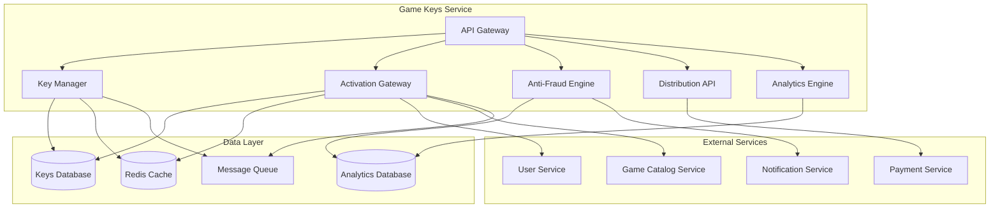

# Game Keys Service - Дизайн

## 📋 **Обзор**

Game Keys Service представляет собой высоконагруженный микросервис для управления игровыми ключами с поддержкой генерации, распространения, активации и защиты от мошенничества. Сервис обеспечивает безопасное и эффективное управление жизненным циклом игровых ключей от создания до активации.

## 🏗️ **Архитектура**

### **Общая архитектура**


### **Микросервисная архитектура**
- **API Gateway**: Единая точка входа с аутентификацией и rate limiting
- **Key Manager**: Генерация, управление и валидация ключей
- **Activation Gateway**: Обработка активации ключей пользователями
- **Anti-Fraud Engine**: Обнаружение и предотвращение мошенничества
- **Distribution API**: Управление распространением через ритейлеров
- **Analytics Engine**: Сбор и анализ данных использования ключей

## 🔧 **Компоненты и интерфейсы**

### **1. Key Manager Component**
```typescript
interface KeyManager {
  // Генерация ключей
  generateKeys(request: KeyGenerationRequest): Promise<KeyBatch>;
  generateBatch(request: BatchGenerationRequest): Promise<KeyBatch>;
  
  // Управление ключами
  getKeyInfo(keyId: string): Promise<KeyInfo>;
  updateKeyStatus(keyId: string, status: KeyStatus): Promise<void>;
  revokeKey(keyId: string, reason: string): Promise<void>;
  
  // Валидация
  validateKey(key: string): Promise<KeyValidationResult>;
  checkDuplicate(key: string): Promise<boolean>;
}

interface KeyGenerationRequest {
  gameId: string;
  developerId: string;
  keyType: KeyType;
  quantity: number;
  regionalRestrictions?: RegionalRestriction[];
  expirationDate?: Date;
  metadata?: KeyMetadata;
}

interface KeyBatch {
  batchId: string;
  keys: GameKey[];
  generatedAt: Date;
  expiresAt?: Date;
  status: BatchStatus;
}
```

### **2. Activation Gateway Component**
```typescript
interface ActivationGateway {
  // Активация ключей
  redeemKey(request: KeyRedemptionRequest): Promise<RedemptionResult>;
  validateRedemption(key: string, userId: string): Promise<ValidationResult>;
  
  // История активаций
  getActivationHistory(userId: string): Promise<ActivationHistory[]>;
  getKeyActivationStatus(keyId: string): Promise<ActivationStatus>;
  
  // Ограничения
  checkRegionalRestrictions(key: string, userRegion: string): Promise<boolean>;
  checkAccountRestrictions(userId: string): Promise<RestrictionResult>;
}

interface KeyRedemptionRequest {
  key: string;
  userId: string;
  userRegion: string;
  deviceInfo: DeviceInfo;
  ipAddress: string;
}

interface RedemptionResult {
  success: boolean;
  gameId?: string;
  error?: RedemptionError;
  transactionId: string;
}
```

### **3. Anti-Fraud Engine Component**
```typescript
interface AntiFraudEngine {
  // Анализ мошенничества
  analyzeActivation(request: FraudAnalysisRequest): Promise<FraudScore>;
  detectSuspiciousPatterns(userId: string): Promise<SuspiciousActivity[]>;
  
  // Управление правилами
  updateFraudRules(rules: FraudRule[]): Promise<void>;
  getFraudStatistics(): Promise<FraudStatistics>;
  
  // Блокировка и разблокировка
  blockSuspiciousActivity(activityId: string): Promise<void>;
  reviewFraudCase(caseId: string, decision: FraudDecision): Promise<void>;
}

interface FraudAnalysisRequest {
  keyId: string;
  userId: string;
  activationContext: ActivationContext;
  deviceFingerprint: string;
  behaviorMetrics: BehaviorMetrics;
}

interface FraudScore {
  score: number; // 0-100
  riskLevel: 'LOW' | 'MEDIUM' | 'HIGH' | 'CRITICAL';
  reasons: string[];
  recommendedAction: FraudAction;
}
```

### **4. Distribution API Component**
```typescript
interface DistributionAPI {
  // Управление ритейлерами
  addRetailer(retailer: RetailerInfo): Promise<string>;
  getRetailers(): Promise<RetailerInfo[]>;
  updateRetailer(retailerId: string, updates: Partial<RetailerInfo>): Promise<void>;
  
  // Выделение ключей
  allocateKeys(request: KeyAllocationRequest): Promise<KeyAllocation>;
  getRetailerKeys(retailerId: string): Promise<RetailerKeyInfo[]>;
  
  // Отчетность
  getSalesReport(retailerId: string, period: DateRange): Promise<SalesReport>;
  getDistributionAnalytics(): Promise<DistributionAnalytics>;
}

interface KeyAllocationRequest {
  retailerId: string;
  gameId: string;
  quantity: number;
  keyType: KeyType;
  pricing: PricingInfo;
  restrictions?: DistributionRestriction[];
}
```

### **5. Analytics Engine Component**
```typescript
interface AnalyticsEngine {
  // Генерация отчетов
  generateActivationReport(gameId: string, period: DateRange): Promise<ActivationReport>;
  getRegionalUsageStats(gameId: string): Promise<RegionalStats>;
  
  // Аналитика производительности
  getKeyPerformanceMetrics(batchId: string): Promise<PerformanceMetrics>;
  getRetailerPerformance(retailerId: string): Promise<RetailerMetrics>;
  
  // Тренды и прогнозы
  getActivationTrends(gameId: string): Promise<TrendData>;
  predictKeyDemand(gameId: string): Promise<DemandForecast>;
}
```

## 📊 **Модели данных**

### **Основные сущности**
```typescript
interface GameKey {
  id: string;
  key: string; // 16-символьный ключ в формате XXXX-XXXX-XXXX-XXXX
  gameId: string;
  developerId: string;
  batchId: string;
  keyType: KeyType;
  status: KeyStatus;
  regionalRestrictions: RegionalRestriction[];
  createdAt: Date;
  expiresAt?: Date;
  activatedAt?: Date;
  activatedBy?: string;
  metadata: KeyMetadata;
}

interface KeyBatch {
  id: string;
  gameId: string;
  developerId: string;
  keyType: KeyType;
  totalKeys: number;
  generatedKeys: number;
  activatedKeys: number;
  status: BatchStatus;
  createdAt: Date;
  expiresAt?: Date;
  distributionInfo?: DistributionInfo;
}

interface KeyActivation {
  id: string;
  keyId: string;
  userId: string;
  gameId: string;
  activatedAt: Date;
  userRegion: string;
  deviceInfo: DeviceInfo;
  ipAddress: string;
  fraudScore: number;
  status: ActivationStatus;
}

interface RetailerInfo {
  id: string;
  name: string;
  contactInfo: ContactInfo;
  apiCredentials: ApiCredentials;
  commissionRate: number;
  status: RetailerStatus;
  allocatedKeys: KeyAllocation[];
  salesHistory: SalesRecord[];
}
```

### **Типы и перечисления**
```typescript
enum KeyType {
  RETAIL = 'retail',
  PROMOTIONAL = 'promotional',
  DEVELOPER = 'developer',
  GIFT = 'gift',
  SUBSCRIPTION = 'subscription'
}

enum KeyStatus {
  GENERATED = 'generated',
  ALLOCATED = 'allocated',
  SOLD = 'sold',
  ACTIVATED = 'activated',
  REVOKED = 'revoked',
  EXPIRED = 'expired'
}

enum ActivationStatus {
  SUCCESS = 'success',
  FAILED = 'failed',
  BLOCKED = 'blocked',
  PENDING_REVIEW = 'pending_review'
}
```

## 🛡️ **Обработка ошибок**

### **Стратегия обработки ошибок**
```typescript
enum GameKeysErrorCode {
  // Ошибки ключей
  KEY_NOT_FOUND = 'KEY_NOT_FOUND',
  KEY_ALREADY_ACTIVATED = 'KEY_ALREADY_ACTIVATED',
  KEY_EXPIRED = 'KEY_EXPIRED',
  KEY_REVOKED = 'KEY_REVOKED',
  INVALID_KEY_FORMAT = 'INVALID_KEY_FORMAT',
  
  // Региональные ошибки
  REGION_RESTRICTED = 'REGION_RESTRICTED',
  VPN_DETECTED = 'VPN_DETECTED',
  
  // Ошибки мошенничества
  SUSPICIOUS_ACTIVITY = 'SUSPICIOUS_ACTIVITY',
  FRAUD_DETECTED = 'FRAUD_DETECTED',
  ACCOUNT_BLOCKED = 'ACCOUNT_BLOCKED',
  
  // Ошибки распространения
  RETAILER_NOT_AUTHORIZED = 'RETAILER_NOT_AUTHORIZED',
  INSUFFICIENT_KEY_ALLOCATION = 'INSUFFICIENT_KEY_ALLOCATION',
  
  // Системные ошибки
  GENERATION_FAILED = 'GENERATION_FAILED',
  DATABASE_ERROR = 'DATABASE_ERROR',
  EXTERNAL_SERVICE_ERROR = 'EXTERNAL_SERVICE_ERROR'
}

interface GameKeysError {
  code: GameKeysErrorCode;
  message: string;
  details?: any;
  timestamp: Date;
  requestId: string;
}
```

### **Обработка специфических ошибок**
- **Дублирование ключей**: Автоматическая регенерация при обнаружении дубликатов
- **Региональные ограничения**: Детальное объяснение причин блокировки
- **Мошенничество**: Временная блокировка с возможностью апелляции
- **Системные сбои**: Graceful degradation с сохранением критической функциональности

## 🧪 **Стратегия тестирования**

### **Модульное тестирование**
- Тестирование генерации уникальных ключей
- Валидация форматов ключей
- Проверка региональных ограничений
- Тестирование антифрод алгоритмов

### **Интеграционное тестирование**
- Интеграция с User Service для активации
- Интеграция с Game Catalog Service для валидации игр
- Интеграция с Payment Service для обработки возвратов
- Тестирование webhook уведомлений

### **Нагрузочное тестирование**
- Массовая генерация ключей (до 100,000 за операцию)
- Одновременная активация множества ключей
- Производительность антифрод системы под нагрузкой
- Масштабирование при пиковых нагрузках

### **Тестирование безопасности**
- Проверка защиты от брутфорс атак
- Тестирование обхода региональных ограничений
- Валидация антифрод механизмов
- Проверка утечек данных ключей

### **End-to-End тестирование**
- Полный цикл: генерация → распространение → активация
- Сценарии мошенничества и их обнаружение
- Процессы возврата и отзыва ключей
- Интеграция с внешними ритейлерами

## 🔧 **Технические детали реализации**

### **База данных**
- **PostgreSQL**: Основное хранилище ключей и метаданных
- **Redis**: Кэширование часто используемых данных и rate limiting
- **ClickHouse**: Аналитические данные и логи активаций

### **Безопасность**
- Шифрование ключей в базе данных
- OAuth 2.0 для API аутентификации
- Rate limiting для предотвращения злоупотреблений
- Audit logging всех операций с ключами

### **Масштабирование**
- Горизонтальное масштабирование через микросервисы
- Шардирование базы данных по играм
- Асинхронная обработка массовых операций
- CDN для распространения ключей

### **Мониторинг**
- Метрики активации ключей в реальном времени
- Алерты на подозрительную активность
- Мониторинг производительности API
- Отслеживание ошибок и их частоты