# Дизайн Game Launcher Service

## Обзор

Game Launcher Service является центральным компонентом для запуска и управления играми на российской Steam-платформе. Сервис обеспечивает безопасный запуск игр с DRM защитой, интеграцию с игровыми движками, мониторинг производительности, поддержку модов, игровой оверлей и систему записи геймплея.

## Архитектура

### Высокоуровневая архитектура

```mermaid
graph TB
    subgraph "Game Launcher Service"
        API[Launcher API Gateway]
        LAUNCH[Launch Engine]
        DRM[DRM Manager]
        OVERLAY[Game Overlay]
        RECORD[Recording Service]
        MOD[Mod Manager]
        DIAG[Diagnostics Engine]
        PERF[Performance Monitor]
        ANTICHEAT[Anti-Cheat Integration]
    end
    
    subgraph "Client Components"
        CLIENT[Launcher Client]
        HOOK[Game Hooks]
        CAPTURE[Screen Capture]
        VR[VR Integration]
    end
    
    subgraph "Storage & Cache"
        REDIS[(Redis Cache)]
        POSTGRES[(PostgreSQL)]
        FILES[File Storage]
        LOGS[Log Storage]
    end
    
    subgraph "External Services"
        LIBRARY[Library Service]
        ACHIEVEMENT[Achievement Service]
        DOWNLOAD[Download Service]
        ANALYTICS[Analytics Service]
        SECURITY[Security Service]
        SUPPORT[Support Service]
    end
    
    API --> LAUNCH
    API --> DRM
    API --> OVERLAY
    API --> RECORD
    API --> MOD
    API --> DIAG
    API --> PERF
    API --> ANTICHEAT
    
    LAUNCH --> CLIENT
    OVERLAY --> HOOK
    RECORD --> CAPTURE
    LAUNCH --> VR
    
    LAUNCH --> REDIS
    DRM --> POSTGRES
    RECORD --> FILES
    DIAG --> LOGS
    
    API --> LIBRARY
    API --> ACHIEVEMENT
    API --> DOWNLOAD
    API --> ANALYTICS
    API --> SECURITY
    API --> SUPPORT
```



### Микросервисная архитектура

Game Launcher Service состоит из следующих основных компонентов:

1. **Launcher API Gateway** - единая точка входа для всех операций запуска
2. **Launch Engine** - ядро запуска и управления игровыми процессами
3. **DRM Manager** - система защиты от пиратства и управления лицензиями
4. **Game Overlay** - игровой оверлей для доступа к функциям платформы
5. **Recording Service** - запись и обработка геймплея
6. **Mod Manager** - управление модификациями игр
7. **Diagnostics Engine** - диагностика и решение проблем
8. **Performance Monitor** - мониторинг производительности игр
9. **Anti-Cheat Integration** - интеграция с системами защиты от читов

## Компоненты и интерфейсы

### Launcher API Gateway

**Назначение:** Централизованная точка доступа ко всем функциям лаунчера

**Основные функции:**
- Аутентификация и авторизация пользователей
- Маршрутизация запросов к соответствующим компонентам
- Rate limiting и защита от злоупотреблений
- Логирование и мониторинг операций
- Управление сессиями пользователей

**API Endpoints:**
```
POST /api/v1/games/launch/{gameId}
GET /api/v1/games/status/{gameId}
POST /api/v1/games/terminate/{gameId}
GET /api/v1/games/diagnostics/{gameId}
POST /api/v1/overlay/toggle
GET /api/v1/mods/list/{gameId}
POST /api/v1/recording/start
POST /api/v1/recording/stop
```

### Launch Engine

**Назначение:** Ядро запуска и управления игровыми процессами

**Основные функции:**
- Запуск исполняемых файлов игр
- Мониторинг состояния игровых процессов
- Управление параметрами запуска
- Интеграция с игровыми движками
- Обработка событий игр

**Процесс запуска игры:**
1. Проверка лицензии пользователя
2. Валидация целостности файлов игры
3. Подготовка окружения запуска
4. Инициализация игровых хуков
5. Запуск исполняемого файла
6. Мониторинг процесса игры

**Поддерживаемые игровые движки:**
- Unity (через Unity Analytics API)
- Unreal Engine (через Unreal Engine Telemetry)
- Custom engines (через Steam API)
- Web games (через JavaScript API)

### DRM Manager

**Назначение:** Система защиты от пиратства и управления лицензиями

**Основные функции:**
- Проверка цифровых подписей игр
- Валидация лицензий пользователей
- Офлайн кэширование лицензий
- Мониторинг попыток взлома
- Интеграция с системами защиты

**Технологии защиты:**
- Code signing для проверки подлинности
- Hardware fingerprinting для привязки к устройству
- Encrypted communication с серверами лицензий
- Tamper detection для обнаружения модификаций

**Офлайн режим:**
- Кэширование лицензий на 30 дней
- Периодическая онлайн-проверка
- Graceful degradation при отсутствии интернета
- Secure local storage лицензионных данных

### Game Overlay

**Назначение:** Игровой оверлей для доступа к функциям платформы

**Основные функции:**
- Отображение друзей и чатов
- Показ достижений и уведомлений
- Доступ к настройкам игры
- Интеграция с социальными функциями
- Web browser для внутриигрового контента

**Технологии реализации:**
- DirectX/OpenGL hooking для рендеринга
- Win32 API для обработки ввода
- Chromium Embedded Framework для web контента
- WebRTC для голосового чата

**Поддерживаемые API:**
- DirectX 9/10/11/12
- OpenGL 3.x/4.x
- Vulkan API
- Metal (для macOS)

### Recording Service

**Назначение:** Запись и обработка геймплея

**Основные функции:**
- Захват видео и аудио игры
- Real-time кодирование и сжатие
- Автоматическая загрузка в облако
- Создание highlights и клипов
- Интеграция с социальными сетями

**Технологии захвата:**
- NVIDIA NVENC для аппаратного кодирования
- AMD VCE для AMD видеокарт
- Intel Quick Sync для Intel GPU
- Software encoding как fallback

**Форматы записи:**
- MP4 с H.264/H.265 кодированием
- WebM для web-совместимости
- Настраиваемое качество (720p/1080p/4K)
- Variable bitrate для оптимизации размера

### Mod Manager

**Назначение:** Управление модификациями игр

**Основные функции:**
- Установка и удаление модов
- Проверка совместимости модов
- Управление порядком загрузки
- Автоматическое обновление модов
- Резервное копирование оригинальных файлов

**Поддерживаемые форматы:**
- Steam Workshop интеграция
- Nexus Mods совместимость
- Кастомные mod formats
- Archive formats (ZIP, RAR, 7Z)

**Система безопасности:**
- Сканирование модов на вирусы
- Sandbox для тестирования модов
- Whitelist проверенных модов
- Rollback при проблемах

### Diagnostics Engine

**Назначение:** Диагностика и решение проблем с играми

**Основные функции:**
- Автоматическая диагностика проблем
- Сбор системной информации
- Анализ crash dumps
- Предложение решений
- Создание support tickets

**Диагностические проверки:**
- Системные требования игр
- Драйверы видеокарт и DirectX
- Антивирусное ПО и firewall
- Целостность игровых файлов
- Конфликты с другим ПО

### Performance Monitor

**Назначение:** Мониторинг производительности игр

**Основные функции:**
- Real-time мониторинг FPS и latency
- Отслеживание использования ресурсов
- Анализ bottlenecks производительности
- Рекомендации по оптимизации
- Benchmark и stress testing

**Мониторируемые метрики:**
- CPU и GPU utilization
- Memory usage и VRAM
- Disk I/O и network latency
- Frame times и input lag
- Temperature и power consumption

### Anti-Cheat Integration

**Назначение:** Интеграция с системами защиты от читов

**Основные функции:**
- Сканирование процессов на читы
- Интеграция с BattlEye, EasyAntiCheat
- Мониторинг подозрительной активности
- Блокировка известных чит-программ
- Отправка отчетов в Security Service

**Поддерживаемые системы:**
- BattlEye Anti-Cheat
- Easy Anti-Cheat (EAC)
- Valve Anti-Cheat (VAC)
- Кастомные античит системы

## Модели данных

### Game Launch Session
```json
{
  "session_id": "string",
  "user_id": "string",
  "game_id": "string",
  "device_id": "string",
  "started_at": "2025-08-24T10:00:00Z",
  "ended_at": "2025-08-24T12:00:00Z",
  "duration_seconds": 7200,
  "launch_parameters": ["-windowed", "-resolution=1920x1080"],
  "performance_metrics": {
    "avg_fps": 60.5,
    "min_fps": 45,
    "max_fps": 75,
    "cpu_usage": 65.2,
    "gpu_usage": 78.9,
    "memory_usage": 4096
  },
  "achievements_unlocked": ["achievement_1", "achievement_2"],
  "mods_active": ["mod_1", "mod_2"],
  "crashes": 0,
  "status": "completed"
}
```

### DRM License
```json
{
  "license_id": "string",
  "user_id": "string",
  "game_id": "string",
  "license_type": "full",
  "issued_at": "2025-08-24T10:00:00Z",
  "expires_at": "2025-12-31T23:59:59Z",
  "device_fingerprint": "string",
  "offline_cache_expires": "2025-09-24T10:00:00Z",
  "activation_count": 1,
  "max_activations": 5,
  "restrictions": {
    "corporate_hours_only": false,
    "max_session_duration": null,
    "allowed_regions": ["RU", "BY", "KZ"]
  },
  "status": "active"
}
```

### Game Recording
```json
{
  "recording_id": "string",
  "session_id": "string",
  "user_id": "string",
  "game_id": "string",
  "started_at": "2025-08-24T10:00:00Z",
  "ended_at": "2025-08-24T10:30:00Z",
  "duration_seconds": 1800,
  "file_path": "s3://recordings/user/game/recording.mp4",
  "file_size_bytes": 524288000,
  "resolution": "1920x1080",
  "fps": 60,
  "codec": "h264",
  "bitrate": 8000,
  "highlights": [
    {
      "timestamp": 300,
      "duration": 30,
      "type": "achievement",
      "description": "Boss defeated"
    }
  ],
  "shared_to": ["youtube", "twitch"],
  "status": "processed"
}
```

### Mod Installation
```json
{
  "mod_id": "string",
  "game_id": "string",
  "user_id": "string",
  "mod_name": "Enhanced Graphics Pack",
  "mod_version": "2.1.0",
  "author": "ModAuthor123",
  "installed_at": "2025-08-24T10:00:00Z",
  "file_size_bytes": 104857600,
  "installation_path": "C:/Games/MyGame/Mods/GraphicsPack/",
  "dependencies": ["mod_dependency_1"],
  "conflicts": [],
  "load_order": 5,
  "enabled": true,
  "auto_update": true,
  "backup_created": true,
  "status": "active"
}
```

### Diagnostic Report
```json
{
  "report_id": "string",
  "user_id": "string",
  "game_id": "string",
  "created_at": "2025-08-24T10:00:00Z",
  "issue_type": "launch_failure",
  "system_info": {
    "os": "Windows 11",
    "cpu": "Intel i7-12700K",
    "gpu": "NVIDIA RTX 4070",
    "ram": "32GB",
    "directx": "12"
  },
  "detected_issues": [
    {
      "issue": "outdated_gpu_driver",
      "severity": "high",
      "description": "GPU driver is outdated",
      "solution": "Update NVIDIA driver to version 531.79"
    }
  ],
  "auto_fixes_applied": ["cleared_shader_cache"],
  "manual_fixes_suggested": ["update_gpu_driver"],
  "support_ticket_created": false,
  "status": "resolved"
}
```

## Обработка ошибок

### Стратегии обработки ошибок

1. **Launch Failures**
   - Автоматическая диагностика причин
   - Предложение исправлений
   - Fallback на safe mode запуск
   - Создание support ticket при критических ошибках

2. **DRM Validation Errors**
   - Retry с exponential backoff
   - Fallback на cached лицензии
   - Graceful degradation для офлайн режима
   - User notification о проблемах с лицензией

3. **Performance Issues**
   - Автоматическая оптимизация настроек
   - Предупреждения о bottlenecks
   - Рекомендации по upgrade оборудования
   - Adaptive quality settings

4. **Mod Conflicts**
   - Автоматическое отключение конфликтующих модов
   - Rollback к предыдущей конфигурации
   - User notification о конфликтах
   - Предложение альтернативных модов

### Коды ошибок

```
LAUNCH_001: Game executable not found
LAUNCH_002: License validation failed
LAUNCH_003: Insufficient system requirements
LAUNCH_004: DRM protection triggered
LAUNCH_005: Mod conflict detected
LAUNCH_006: Anti-cheat blocked launch
LAUNCH_007: VR device not ready
LAUNCH_008: Network connectivity required
LAUNCH_009: Corporate policy violation
LAUNCH_010: Game files corrupted
```

## Стратегия тестирования

### Unit Testing
- Тестирование алгоритмов запуска игр
- Валидация DRM логики
- Проверка mod compatibility
- Тестирование diagnostic algorithms

### Integration Testing
- Тестирование интеграции с игровыми движками
- Проверка взаимодействия с внешними сервисами
- End-to-end тестирование запуска игр
- Тестирование overlay functionality

### Performance Testing
- Load testing для множественных запусков
- Stress testing recording service
- Memory leak testing для long-running sessions
- Latency testing для overlay operations

### Security Testing
- Тестирование DRM защиты
- Проверка anti-cheat интеграции
- Penetration testing API endpoints
- Validation bypass testing

## Безопасность

### DRM Security
- Code signing для всех компонентов
- Encrypted communication с license servers
- Hardware fingerprinting для device binding
- Tamper detection и response

### Process Security
- Sandboxing для mod execution
- Process isolation для games
- Memory protection для sensitive data
- Secure storage для license cache

### Network Security
- TLS 1.3 для всех communications
- Certificate pinning для critical endpoints
- API rate limiting и DDoS protection
- Encrypted telemetry data

### Anti-Cheat Security
- Kernel-level protection integration
- Real-time process monitoring
- Behavioral analysis для cheat detection
- Secure reporting к anti-cheat services

## Мониторинг и метрики

### Business Metrics
- Game launch success rate
- Average launch time по играм
- User engagement metrics
- Mod adoption rates

### Technical Metrics
- API response times
- DRM validation latency
- Recording service performance
- Overlay rendering performance

### Security Metrics
- DRM bypass attempts
- Anti-cheat detections
- License validation failures
- Suspicious activity alerts

### User Experience Metrics
- Time to game launch
- Crash rates по играм
- User satisfaction scores
- Support ticket volume

## Масштабирование

### Horizontal Scaling
- Kubernetes для оркестрации
- Load balancing для API Gateway
- Auto-scaling на основе нагрузки
- Distributed caching с Redis

### Performance Optimization
- Async processing для non-critical operations
- Connection pooling для database access
- CDN для game assets
- Edge computing для low latency

### Storage Scaling
- Distributed file storage для recordings
- Tiered storage для historical data
- Compression для log data
- Automated cleanup policies

### Global Distribution
- Regional deployment для low latency
- Edge locations для content delivery
- Multi-region disaster recovery
- Localized content serving