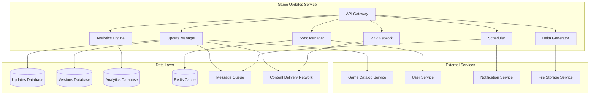

# Game Updates Service - Дизайн

## 📋 **Обзор**

Game Updates Service представляет собой интеллектуальный микросервис для управления обновлениями игр с поддержкой автоматических обновлений, дельта-патчей, отката версий, кросс-платформенной синхронизации и P2P распространения. Сервис обеспечивает эффективную доставку обновлений с минимальным воздействием на пользовательский опыт.

## 🏗️ **Архитектура**

### **Общая архитектура**


### **Микросервисная архитектура**
- **API Gateway**: Единая точка входа с rate limiting и аутентификацией
- **Update Manager**: Управление жизненным циклом обновлений
- **Delta Generator**: Генерация и применение дельта-патчей
- **Sync Manager**: Кросс-платформенная синхронизация обновлений
- **Scheduler**: Интеллектуальное планирование обновлений
- **P2P Network**: Peer-to-peer распространение обновлений
- **Analytics Engine**: Сбор и анализ метрик обновлений

## 🔧 **Компоненты и интерфейсы**

### **1. Update Manager Component**
```typescript
interface UpdateManager {
  // Управление обновлениями
  checkForUpdates(gameId: string, currentVersion: string): Promise<UpdateInfo[]>;
  downloadUpdate(updateId: string, options: DownloadOptions): Promise<DownloadResult>;
  installUpdate(updateId: string, installOptions: InstallOptions): Promise<InstallResult>;
  
  // Автоматические обновления
  enableAutoUpdates(gameId: string, settings: AutoUpdateSettings): Promise<void>;
  scheduleUpdate(updateId: string, schedule: UpdateSchedule): Promise<void>;
  
  // Управление версиями
  getVersionHistory(gameId: string): Promise<GameVersion[]>;
  rollbackToVersion(gameId: string, targetVersion: string): Promise<RollbackResult>;
  createBackup(gameId: string, version: string): Promise<BackupInfo>;
}

interface UpdateInfo {
  updateId: string;
  gameId: string;
  fromVersion: string;
  toVersion: string;
  updateType: UpdateType;
  size: number;
  deltaSize?: number;
  priority: UpdatePriority;
  releaseDate: Date;
  changelog: string;
  requirements: SystemRequirements;
}

interface DownloadOptions {
  useDelta: boolean;
  useP2P: boolean;
  bandwidthLimit?: number;
  backgroundDownload: boolean;
  preload: boolean;
}
```

### **2. Delta Generator Component**
```typescript
interface DeltaGenerator {
  // Генерация дельта-патчей
  generateDelta(fromVersion: string, toVersion: string): Promise<DeltaPatch>;
  calculateDeltaSize(fromVersion: string, toVersion: string): Promise<number>;
  
  // Применение патчей
  applyDelta(gameId: string, deltaPatch: DeltaPatch): Promise<PatchResult>;
  verifyIntegrity(gameId: string, expectedChecksum: string): Promise<boolean>;
  
  // Оптимизация
  optimizePatch(deltaPatch: DeltaPatch): Promise<OptimizedPatch>;
  compressPatch(deltaPatch: DeltaPatch): Promise<CompressedPatch>;
}

interface DeltaPatch {
  patchId: string;
  gameId: string;
  fromVersion: string;
  toVersion: string;
  patchData: PatchData[];
  checksum: string;
  compressionRatio: number;
  estimatedApplyTime: number;
}

interface PatchData {
  operation: 'ADD' | 'MODIFY' | 'DELETE';
  filePath: string;
  offset?: number;
  data?: Buffer;
  checksum: string;
}
```

### **3. Sync Manager Component**
```typescript
interface SyncManager {
  // Кросс-платформенная синхронизация
  syncUserDevices(userId: string): Promise<SyncResult>;
  getDeviceVersions(userId: string): Promise<DeviceVersionInfo[]>;
  resolveVersionConflicts(conflicts: VersionConflict[]): Promise<ConflictResolution>;
  
  // Облачная синхронизация
  uploadVersionState(deviceId: string, gameVersions: GameVersionState[]): Promise<void>;
  downloadVersionState(deviceId: string): Promise<GameVersionState[]>;
  
  // Уведомления о синхронизации
  notifyDevicesOfUpdate(userId: string, updateInfo: UpdateInfo): Promise<void>;
}

interface DeviceVersionInfo {
  deviceId: string;
  deviceType: DeviceType;
  gameVersions: Map<string, string>;
  lastSyncTime: Date;
  isOnline: boolean;
}

interface VersionConflict {
  gameId: string;
  conflictingVersions: Map<string, string>; // deviceId -> version
  recommendedResolution: ConflictResolution;
}
```

### **4. Scheduler Component**
```typescript
interface Scheduler {
  // Интеллектуальное планирование
  createOptimalSchedule(userId: string, updates: UpdateInfo[]): Promise<UpdateSchedule>;
  analyzeUserActivity(userId: string): Promise<ActivityPattern>;
  
  // Управление расписанием
  scheduleUpdate(updateId: string, schedule: UpdateSchedule): Promise<void>;
  rescheduleUpdate(updateId: string, newSchedule: UpdateSchedule): Promise<void>;
  cancelScheduledUpdate(updateId: string): Promise<void>;
  
  // Адаптивное планирование
  adjustScheduleBasedOnUsage(userId: string, usageData: UsageData): Promise<void>;
  optimizeForBandwidth(schedule: UpdateSchedule, bandwidthProfile: BandwidthProfile): Promise<UpdateSchedule>;
}

interface UpdateSchedule {
  updateId: string;
  scheduledTime: Date;
  priority: SchedulePriority;
  conditions: ScheduleCondition[];
  fallbackOptions: FallbackOption[];
}

interface ActivityPattern {
  userId: string;
  activeHours: TimeRange[];
  gamePlayPatterns: Map<string, PlayPattern>;
  networkUsagePatterns: NetworkPattern[];
  preferredUpdateWindows: TimeRange[];
}
```

### **5. P2P Network Component**
```typescript
interface P2PNetwork {
  // P2P управление
  enableP2P(userId: string, settings: P2PSettings): Promise<void>;
  findPeers(updateId: string): Promise<PeerInfo[]>;
  
  // Распространение контента
  shareUpdate(updateId: string, peerSettings: PeerSettings): Promise<void>;
  downloadFromPeers(updateId: string, peers: PeerInfo[]): Promise<P2PDownloadResult>;
  
  // Мониторинг P2P
  getP2PStatistics(userId: string): Promise<P2PStatistics>;
  reportPeerQuality(peerId: string, quality: PeerQuality): Promise<void>;
}

interface P2PSettings {
  enabled: boolean;
  maxUploadSpeed: number;
  maxDownloadSpeed: number;
  shareOnMeteredConnection: boolean;
  maxConcurrentPeers: number;
}

interface PeerInfo {
  peerId: string;
  availableUpdates: string[];
  uploadSpeed: number;
  reliability: number;
  distance: number; // network distance
  lastSeen: Date;
}
```

### **6. Analytics Engine Component**
```typescript
interface AnalyticsEngine {
  // Метрики обновлений
  trackUpdateDownload(updateId: string, metrics: DownloadMetrics): Promise<void>;
  trackUpdateInstallation(updateId: string, metrics: InstallMetrics): Promise<void>;
  trackRollback(gameId: string, rollbackInfo: RollbackInfo): Promise<void>;
  
  // Аналитические отчеты
  getAdoptionRate(updateId: string): Promise<AdoptionMetrics>;
  getUpdateSuccessRate(gameId: string, period: DateRange): Promise<SuccessRateMetrics>;
  getBandwidthUsage(period: DateRange): Promise<BandwidthMetrics>;
  
  // Прогнозирование
  predictUpdateLoad(updateId: string): Promise<LoadPrediction>;
  recommendOptimalReleaseTime(updateInfo: UpdateInfo): Promise<Date>;
}
```

## 📊 **Модели данных**

### **Основные сущности**
```typescript
interface GameUpdate {
  id: string;
  gameId: string;
  fromVersion: string;
  toVersion: string;
  updateType: UpdateType;
  priority: UpdatePriority;
  size: number;
  deltaSize?: number;
  releaseDate: Date;
  changelog: string;
  downloadUrl: string;
  deltaUrl?: string;
  checksum: string;
  requirements: SystemRequirements;
  status: UpdateStatus;
  createdAt: Date;
  updatedAt: Date;
}

interface GameVersion {
  id: string;
  gameId: string;
  version: string;
  buildNumber: number;
  releaseDate: Date;
  isStable: boolean;
  isBeta: boolean;
  changelog: string;
  fileManifest: FileManifest;
  dependencies: VersionDependency[];
  rollbackSupported: boolean;
}

interface UpdateInstallation {
  id: string;
  updateId: string;
  userId: string;
  deviceId: string;
  status: InstallationStatus;
  startedAt: Date;
  completedAt?: Date;
  progress: number;
  errorMessage?: string;
  installMethod: InstallMethod;
  rollbackAvailable: boolean;
}

interface UserUpdateSettings {
  userId: string;
  autoUpdatesEnabled: boolean;
  updateSchedule: UpdateSchedule;
  bandwidthLimits: BandwidthLimits;
  p2pSettings: P2PSettings;
  notificationPreferences: NotificationPreferences;
  rollbackPreferences: RollbackPreferences;
}
```

### **Типы и перечисления**
```typescript
enum UpdateType {
  CRITICAL = 'critical',
  MAJOR = 'major',
  MINOR = 'minor',
  HOTFIX = 'hotfix',
  BETA = 'beta',
  EXPERIMENTAL = 'experimental'
}

enum UpdatePriority {
  IMMEDIATE = 'immediate',
  HIGH = 'high',
  NORMAL = 'normal',
  LOW = 'low',
  DEFERRED = 'deferred'
}

enum InstallationStatus {
  PENDING = 'pending',
  DOWNLOADING = 'downloading',
  INSTALLING = 'installing',
  COMPLETED = 'completed',
  FAILED = 'failed',
  ROLLED_BACK = 'rolled_back'
}

enum InstallMethod {
  FULL_DOWNLOAD = 'full_download',
  DELTA_PATCH = 'delta_patch',
  P2P_DOWNLOAD = 'p2p_download',
  PRELOADED = 'preloaded'
}
```

## 🛡️ **Обработка ошибок**

### **Стратегия обработки ошибок**
```typescript
enum UpdateErrorCode {
  // Ошибки загрузки
  DOWNLOAD_FAILED = 'DOWNLOAD_FAILED',
  NETWORK_TIMEOUT = 'NETWORK_TIMEOUT',
  INSUFFICIENT_STORAGE = 'INSUFFICIENT_STORAGE',
  CORRUPTED_DOWNLOAD = 'CORRUPTED_DOWNLOAD',
  
  // Ошибки установки
  INSTALLATION_FAILED = 'INSTALLATION_FAILED',
  DELTA_PATCH_FAILED = 'DELTA_PATCH_FAILED',
  INTEGRITY_CHECK_FAILED = 'INTEGRITY_CHECK_FAILED',
  PERMISSION_DENIED = 'PERMISSION_DENIED',
  
  // Ошибки отката
  ROLLBACK_FAILED = 'ROLLBACK_FAILED',
  BACKUP_NOT_FOUND = 'BACKUP_NOT_FOUND',
  INCOMPATIBLE_SAVE_DATA = 'INCOMPATIBLE_SAVE_DATA',
  
  // Ошибки синхронизации
  SYNC_CONFLICT = 'SYNC_CONFLICT',
  DEVICE_OFFLINE = 'DEVICE_OFFLINE',
  VERSION_MISMATCH = 'VERSION_MISMATCH',
  
  // P2P ошибки
  P2P_CONNECTION_FAILED = 'P2P_CONNECTION_FAILED',
  PEER_UNRELIABLE = 'PEER_UNRELIABLE',
  P2P_VERIFICATION_FAILED = 'P2P_VERIFICATION_FAILED'
}

interface UpdateError {
  code: UpdateErrorCode;
  message: string;
  details?: any;
  timestamp: Date;
  updateId: string;
  userId: string;
  deviceId: string;
  retryable: boolean;
  suggestedAction?: string;
}
```

### **Стратегии восстановления**
- **Автоматический retry**: Для временных сетевых ошибок
- **Fallback на полное обновление**: При сбое дельта-патчей
- **P2P fallback**: Переключение на официальные серверы при проблемах с P2P
- **Graceful degradation**: Отключение неосновных функций при системных проблемах

## 🧪 **Стратегия тестирования**

### **Модульное тестирование**
- Тестирование генерации дельта-патчей
- Валидация алгоритмов планирования
- Проверка логики отката обновлений
- Тестирование P2P алгоритмов

### **Интеграционное тестирование**
- Интеграция с Game Catalog Service
- Интеграция с User Service для синхронизации
- Интеграция с File Storage Service
- Тестирование CDN интеграции

### **Нагрузочное тестирование**
- Массовые одновременные обновления
- P2P сеть под высокой нагрузкой
- Производительность дельта-генерации
- Масштабирование при пиковых нагрузках

### **End-to-End тестирование**
- Полный цикл обновления: проверка → загрузка → установка
- Кросс-платформенная синхронизация
- Сценарии отката и восстановления
- P2P распространение обновлений

## 🔧 **Технические детали реализации**

### **База данных**
- **PostgreSQL**: Основное хранилище обновлений и версий
- **Redis**: Кэширование и управление очередями
- **ClickHouse**: Аналитические данные и метрики

### **Файловое хранилище**
- **S3-совместимое хранилище**: Для файлов обновлений
- **CDN**: Глобальное распространение контента
- **P2P сеть**: Децентрализованное распространение

### **Безопасность**
- Цифровые подписи обновлений
- Проверка целостности файлов
- Шифрование P2P соединений
- Audit logging всех операций

### **Производительность**
- Асинхронная обработка обновлений
- Интеллектуальное кэширование
- Оптимизация дельта-алгоритмов
- Адаптивное управление пропускной способностью

### **Мониторинг**
- Метрики производительности обновлений
- Мониторинг P2P сети
- Алерты на критические ошибки
- Дашборды аналитики в реальном времени