# Дизайн Gift Service

## Обзор

Gift Service обеспечивает комплексную систему подарков на российской Steam-платформе, включая дарение игр, внутриигровых предметов, подарочных карт, корпоративные подарки, групповые подарки и интеграцию с социальными функциями платформы.

## Архитектура

### Высокоуровневая архитектура

```mermaid
graph TB
    subgraph "Gift Service"
        API[Gift API Gateway]
        GIFT[Gift Manager]
        CARD[Gift Card System]
        GROUP[Group Gift Manager]
        CORP[Corporate Gift System]
        WISHLIST[Wishlist Integration]
        DELIVERY[Gift Delivery Engine]
        ANALYTICS[Gift Analytics]
    end
    
    subgraph "Gift Storage"
        POSTGRES[(PostgreSQL)]
        REDIS[(Redis Cache)]
        QUEUE[Message Queue]
        FILES[Gift Assets Storage]
    end
    
    subgraph "External Services"
        PAYMENT[Payment Service]
        LIBRARY[Library Service]
        SOCIAL[Social Service]
        USER[User Service]
        NOTIFICATION[Notification Service]
    end
    
    subgraph "Gift Processing"
        VALIDATOR[Gift Validator]
        SCHEDULER[Gift Scheduler]
        REFUND[Refund Processor]
        FRAUD[Fraud Detection]
    end
    
    API --> GIFT
    API --> CARD
    API --> GROUP
    API --> CORP
    API --> WISHLIST
    API --> DELIVERY
    API --> ANALYTICS
    
    GIFT --> POSTGRES
    CARD --> REDIS
    GROUP --> QUEUE
    DELIVERY --> FILES
    
    API --> PAYMENT
    API --> LIBRARY
    API --> SOCIAL
    API --> USER
    API --> NOTIFICATION
    
    GIFT --> VALIDATOR
    DELIVERY --> SCHEDULER
    GIFT --> REFUND
    ANALYTICS --> FRAUD
```



### Микросервисная архитектура

Gift Service состоит из следующих основных компонентов:

1. **Gift API Gateway** - единая точка входа для всех операций с подарками
2. **Gift Manager** - ядро управления подарками
3. **Gift Card System** - система подарочных карт
4. **Group Gift Manager** - управление групповыми подарками
5. **Corporate Gift System** - корпоративные подарки
6. **Wishlist Integration** - интеграция со списками желаний
7. **Gift Delivery Engine** - доставка и планирование подарков
8. **Gift Analytics** - аналитика и мониторинг подарков

## Компоненты и интерфейсы

### Gift API Gateway

**Назначение:** Централизованная точка доступа ко всем функциям подарков

**Основные функции:**
- Аутентификация и авторизация операций с подарками
- Валидация подарочных операций
- Rate limiting для предотвращения злоупотреблений
- Интеграция с внешними сервисами
- Мониторинг и логирование подарочных операций

**API Endpoints:**
```
POST /api/v1/gifts/send
GET /api/v1/gifts/received/{userId}
POST /api/v1/gifts/{giftId}/accept
POST /api/v1/gifts/{giftId}/decline
POST /api/v1/gift-cards/purchase
POST /api/v1/gift-cards/redeem
POST /api/v1/group-gifts/create
POST /api/v1/corporate-gifts/bulk-send
GET /api/v1/wishlist/{userId}/giftable
```

### Gift Manager

**Назначение:** Ядро управления всеми типами подарков

**Типы подарков:**
- **Game Gifts** - подарки игр
- **DLC Gifts** - подарки дополнительного контента
- **In-Game Item Gifts** - внутриигровые предметы
- **Subscription Gifts** - подарочные подписки
- **Bundle Gifts** - наборы игр

**Основные функции:**
- Создание и валидация подарков
- Проверка права собственности получателя
- Управление статусами подарков
- Обработка принятия/отклонения подарков
- Автоматические возвраты

**Жизненный цикл подарка:**
1. **Created** - подарок создан, ожидает оплаты
2. **Paid** - подарок оплачен, готов к отправке
3. **Sent** - подарок отправлен получателю
4. **Pending** - ожидает принятия получателем
5. **Accepted** - подарок принят и добавлен в библиотеку
6. **Declined** - подарок отклонен, инициирован возврат
7. **Expired** - подарок истек (30 дней), возврат средств
8. **Refunded** - средства возвращены дарителю

### Gift Card System

**Назначение:** Система подарочных карт и цифровых кодов

**Типы подарочных карт:**
- **Fixed Amount Cards** - карты фиксированного номинала
- **Custom Amount Cards** - карты произвольного номинала
- **Regional Cards** - карты для определенных регионов
- **Promotional Cards** - промо-карты с бонусами

**Основные функции:**
- Генерация уникальных кодов активации
- Шифрование и защита кодов
- Активация и зачисление средств
- Отслеживание использования карт
- Предотвращение мошенничества

**Формат кода подарочной карты:**
```
STEAM-XXXXX-XXXXX-XXXXX
```
- Длина: 17 символов
- Алфавит: A-Z, 0-9 (исключая похожие символы)
- Контрольная сумма для валидации
- Региональный префикс

### Group Gift Manager

**Назначение:** Управление групповыми подарками

**Основные функции:**
- Создание групповых подарочных кампаний
- Приглашение участников
- Сбор взносов от участников
- Автоматическая отправка при достижении цели
- Возврат средств при неудаче

**Алгоритм группового подарка:**
1. Инициатор создает групповой подарок
2. Система рассчитывает долю каждого участника
3. Отправляются приглашения участникам
4. Участники вносят свои доли
5. При достижении 100% - автоматическая отправка
6. При истечении времени - возврат средств

**Стратегии распределения долей:**
- **Equal Split** - равные доли для всех
- **Custom Split** - настраиваемые доли
- **Voluntary** - добровольные взносы
- **Minimum Threshold** - минимальный порог участия

### Corporate Gift System

**Назначение:** Система корпоративных подарков для организаций

**Корпоративные функции:**
- Bulk операции для массовых подарков
- Корпоративные скидки и тарифы
- Брендинг и кастомизация сообщений
- Отчетность и аналитика
- Интеграция с HR системами

**Типы корпоративных подарков:**
- **Employee Rewards** - награды сотрудникам
- **Team Building** - командообразующие подарки
- **Holiday Gifts** - праздничные подарки
- **Achievement Rewards** - награды за достижения
- **Welcome Packages** - приветственные наборы

### Wishlist Integration

**Назначение:** Интеграция со списками желаний пользователей

**Основные функции:**
- Получение wishlist данных пользователей
- Фильтрация подходящих для подарка игр
- Уведомления о скидках на желаемые игры
- Автоматическое обновление wishlist после подарков
- Рекомендации подарков на основе wishlist

**Smart Gift Suggestions:**
- Анализ wishlist друзей
- Учет ценовых предпочтений
- Сезонные рекомендации
- Популярные подарки в кругу друзей

### Gift Delivery Engine

**Назначение:** Доставка и планирование подарков

**Функции доставки:**
- Немедленная доставка
- Запланированная доставка (к празднику)
- Условная доставка (при входе получателя)
- Повторная попытка доставки
- Уведомления о доставке

**Праздничные и сезонные функции:**
- Тематическое оформление подарков
- Праздничные анимации и эффекты
- Сезонные подарочные наборы
- Автоматическая доставка к праздникам

### Gift Analytics

**Назначение:** Аналитика и мониторинг подарочной активности

**Аналитические метрики:**
- Объем подарочных операций
- Популярные подарки по сезонам
- Конверсия подарков (принятие/отклонение)
- Географическое распределение подарков
- Средняя стоимость подарков

**Fraud Detection:**
- Выявление подозрительных паттернов
- Анализ массовых операций
- Детекция фиктивных аккаунтов
- Мониторинг возвратов и отмен

## Модели данных

### Gift
```json
{
  "gift_id": "string",
  "sender_id": "string",
  "recipient_id": "string",
  "gift_type": "game",
  "item_id": "string",
  "item_name": "Cyberpunk 2077",
  "amount": 2999.00,
  "currency": "RUB",
  "status": "pending",
  "created_at": "2025-08-24T10:00:00Z",
  "sent_at": "2025-08-24T10:05:00Z",
  "expires_at": "2025-09-23T10:05:00Z",
  "message": "С днем рождения!",
  "is_anonymous": false,
  "gift_wrapping": {
    "theme": "birthday",
    "animation": "confetti",
    "custom_image": null
  },
  "delivery_options": {
    "immediate": true,
    "scheduled_for": null,
    "notify_on_login": false
  }
}
```

### Gift Card
```json
{
  "card_id": "string",
  "code": "STEAM-AB123-CD456-EF789",
  "amount": 1000.00,
  "currency": "RUB",
  "purchaser_id": "string",
  "recipient_email": "user@example.com",
  "status": "active",
  "created_at": "2025-08-24T10:00:00Z",
  "redeemed_at": null,
  "redeemed_by": null,
  "expires_at": "2026-08-24T10:00:00Z",
  "region_lock": "RU",
  "custom_message": "Поздравляю с праздником!",
  "design_theme": "new_year_2025"
}
```

### Group Gift
```json
{
  "group_gift_id": "string",
  "initiator_id": "string",
  "target_gift": {
    "item_id": "string",
    "item_name": "Elden Ring",
    "total_amount": 2499.00
  },
  "recipient_id": "string",
  "participants": [
    {
      "user_id": "string",
      "contribution_amount": 500.00,
      "status": "paid",
      "joined_at": "2025-08-24T10:00:00Z"
    }
  ],
  "total_collected": 1500.00,
  "target_amount": 2499.00,
  "status": "collecting",
  "created_at": "2025-08-24T10:00:00Z",
  "deadline": "2025-08-31T23:59:59Z",
  "min_participants": 3,
  "max_participants": 10,
  "collection_strategy": "equal_split"
}
```

### Corporate Gift Campaign
```json
{
  "campaign_id": "string",
  "company_id": "string",
  "campaign_name": "New Year 2025 Rewards",
  "gift_template": {
    "item_type": "gift_card",
    "amount": 500.00,
    "custom_message": "Thank you for your hard work!"
  },
  "recipients": [
    {
      "employee_id": "string",
      "email": "employee@company.com",
      "status": "sent",
      "sent_at": "2025-08-24T10:00:00Z"
    }
  ],
  "total_budget": 50000.00,
  "spent_amount": 25000.00,
  "status": "active",
  "created_at": "2025-08-24T10:00:00Z",
  "scheduled_delivery": "2025-12-31T00:00:00Z",
  "corporate_branding": {
    "logo_url": "https://company.com/logo.png",
    "brand_colors": ["#FF0000", "#00FF00"],
    "custom_template": "corporate_holiday"
  }
}
```

### Gift Transaction
```json
{
  "transaction_id": "string",
  "gift_id": "string",
  "type": "purchase",
  "amount": 2999.00,
  "currency": "RUB",
  "payment_method": "card",
  "payment_id": "string",
  "status": "completed",
  "created_at": "2025-08-24T10:00:00Z",
  "completed_at": "2025-08-24T10:01:00Z",
  "refund_info": {
    "refundable": true,
    "refund_deadline": "2025-09-23T10:05:00Z",
    "refund_amount": 2999.00,
    "refund_reason": null
  }
}
```

## Обработка ошибок

### Стратегии обработки ошибок

1. **Gift Validation Errors**
   - Проверка права собственности получателя
   - Валидация региональных ограничений
   - Проверка возрастных ограничений
   - Graceful handling недоступных игр

2. **Payment Processing Errors**
   - Retry механизмы для временных сбоев
   - Rollback подарков при неудачных платежах
   - Уведомления о проблемах с оплатой
   - Alternative payment methods

3. **Delivery Failures**
   - Retry доставки при недоступности получателя
   - Queue механизмы для отложенной доставки
   - Fallback на email уведомления
   - Manual intervention для критических подарков

4. **Group Gift Failures**
   - Automatic refunds при неудачных сборах
   - Partial refunds для участников
   - Notification всех участников о статусе
   - Alternative gift suggestions

### Коды ошибок

```
GIFT_001: Recipient already owns this item
GIFT_002: Insufficient funds for gift
GIFT_003: Gift recipient not found
GIFT_004: Regional restriction violation
GIFT_005: Age restriction violation
GIFT_006: Gift card code invalid
GIFT_007: Gift card already redeemed
GIFT_008: Group gift collection failed
GIFT_009: Corporate gift quota exceeded
GIFT_010: Gift delivery failed
```

## Стратегия тестирования

### Unit Testing
- Тестирование логики валидации подарков
- Проверка алгоритмов группового сбора
- Валидация генерации gift card кодов
- Тестирование fraud detection алгоритмов

### Integration Testing
- Тестирование интеграции с Payment Service
- Проверка взаимодействия с Library Service
- Тестирование уведомлений через Social Service
- End-to-end тестирование подарочных сценариев

### Performance Testing
- Load testing для массовых корпоративных подарков
- Stress testing gift card generation
- Latency testing для real-time gift operations
- Scalability testing для праздничных пиков

### Security Testing
- Тестирование защиты gift card кодов
- Проверка fraud detection mechanisms
- Validation gift authorization flows
- Penetration testing gift APIs

## Безопасность

### Gift Card Security
- Cryptographically secure код generation
- Encrypted storage gift card данных
- Rate limiting для redemption attempts
- Fraud detection для suspicious patterns

### Transaction Security
- Secure payment processing integration
- Encrypted storage transaction данных
- Audit trails для всех gift операций
- Anti-money laundering compliance

### Privacy Protection
- Anonymization опции для подарков
- Secure handling recipient данных
- GDPR compliance для gift данных
- Right to be forgotten implementation

## Мониторинг и метрики

### Business Metrics
- Gift conversion rates (sent vs accepted)
- Average gift value по категориям
- Seasonal gift volume trends
- Corporate gift program ROI

### Technical Metrics
- Gift processing latency
- Payment success rates
- Delivery success rates
- System uptime и availability

### User Experience Metrics
- Time to gift delivery
- User satisfaction с gift experience
- Gift return/refund rates
- Support ticket volume

### Fraud Detection Metrics
- Suspicious activity detection rate
- False positive rates
- Blocked fraudulent transactions
- Recovery rate от fraud attempts

## Масштабирование

### Horizontal Scaling
- Kubernetes для gift service components
- Load balancing для gift API operations
- Auto-scaling на основе gift volume
- Distributed caching для gift данных

### Database Optimization
- Sharding gift данных по пользователям
- Read replicas для gift analytics
- Indexing для быстрых gift lookups
- Automated cleanup expired gifts

### Performance Optimization
- Caching популярных gift items
- Async processing для non-critical operations
- Batch processing для bulk corporate gifts
- CDN для gift assets и images

### Global Distribution
- Multi-region gift processing
- Regional gift card compliance
- Localized gift recommendations
- Cross-region gift delivery optimization

## Интеграции и партнерства

### Payment Integration
- Multiple payment methods support
- Regional payment providers
- Corporate billing integration
- Subscription payment handling

### Social Integration
- Friend list integration для gift suggestions
- Social sharing gift activities
- Community gift events
- Influencer gift programs

### Corporate Partnerships
- HR system integrations
- Bulk purchasing agreements
- Corporate branding customization
- Enterprise reporting tools

### Holiday and Event Integration
- Calendar integration для scheduled gifts
- Event-based gift recommendations
- Seasonal gift promotions
- Cultural holiday support