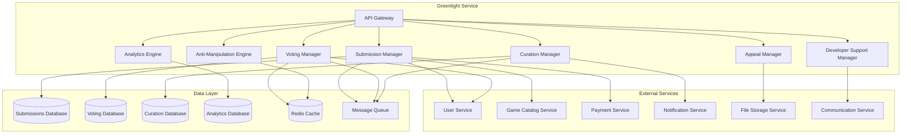

# Greenlight Service - Дизайн

## 📋 **Обзор**

Greenlight Service представляет собой комплексный микросервис для реализации российской системы "Зеленый Свет" - платформы, где сообщество голосует за игры независимых разработчиков для их попадания на основную платформу. Сервис включает систему подачи заявок, голосования, кураторства, поддержки разработчиков и предотвращения манипуляций.

## 🏗️ **Архитектура**

### **Общая архитектура**


### **Микросервисная архитектура**
- **API Gateway**: Единая точка входа с аутентификацией и rate limiting
- **Submission Manager**: Управление подачей заявок на Greenlight
- **Voting Manager**: Система голосования сообщества
- **Curation Manager**: Модерация и кураторство контента
- **Anti-Manipulation Engine**: Предотвращение накрутки и мошенничества
- **Developer Support Manager**: Поддержка и менторство разработчиков
- **Appeal Manager**: Система апелляций и повторного рассмотрения
- **Analytics Engine**: Аналитика эффективности системы

## 🔧 **Компоненты и интерфейсы**

### **1. Submission Manager Component**
```typescript
interface SubmissionManager {
  // Управление заявками
  submitGame(submission: GreenlightSubmission): Promise<Submission>;
  updateSubmission(submissionId: string, updates: SubmissionUpdate): Promise<Submission>;
  withdrawSubmission(submissionId: string, reason: string): Promise<void>;
  
  // Получение заявок
  getSubmission(submissionId: string): Promise<Submission>;
  getActiveSubmissions(filters?: SubmissionFilters): Promise<Submission[]>;
  getDeveloperSubmissions(developerId: string): Promise<Submission[]>;
  
  // Валидация и обработка
  validateSubmission(submission: GreenlightSubmission): Promise<ValidationResult>;
  processSubmissionFee(submissionId: string, paymentId: string): Promise<PaymentResult>;
  activateSubmissionForVoting(submissionId: string): Promise<void>;
}

interface GreenlightSubmission {
  developerId: string;
  gameTitle: string;
  gameDescription: string;
  gameGenre: string[];
  targetAudience: string;
  uniqueSellingPoints: string[];
  developmentTimeline: DevelopmentTimeline;
  teamInformation: TeamInfo;
  gameDemo: GameDemo;
  businessPlan: BusinessPlan;
  submissionFee: number;
}

interface Submission {
  id: string;
  developerId: string;
  gameTitle: string;
  gameDescription: string;
  status: SubmissionStatus;
  submittedAt: Date;
  votingStartDate?: Date;
  votingEndDate?: Date;
  gameDemo: GameDemo;
  teamInformation: TeamInfo;
  businessPlan: BusinessPlan;
  moderationNotes: ModerationNote[];
  votingResults?: VotingResults;
  feeStatus: FeeStatus;
}

enum SubmissionStatus {
  DRAFT = 'draft',
  SUBMITTED = 'submitted',
  UNDER_MODERATION = 'under_moderation',
  ACTIVE_VOTING = 'active_voting',
  VOTING_COMPLETED = 'voting_completed',
  APPROVED = 'approved',
  REJECTED = 'rejected',
  WITHDRAWN = 'withdrawn'
}

interface GameDemo {
  type: DemoType;
  downloadUrl?: string;
  videoUrl?: string;
  playableUrl?: string;
  screenshots: string[];
  systemRequirements: SystemRequirements;
  estimatedPlayTime: number;
}
```

### **2. Voting Manager Component**
```typescript
interface VotingManager {
  // Управление голосованием
  castVote(vote: GreenlightVote): Promise<VoteResult>;
  updateVote(voteId: string, newVote: VoteUpdate): Promise<VoteResult>;
  
  // Проверка права голоса
  checkVotingEligibility(userId: string): Promise<EligibilityResult>;
  getUserVotingHistory(userId: string): Promise<UserVote[]>;
  
  // Результаты голосования
  getVotingResults(submissionId: string): Promise<VotingResults>;
  calculateWeightedResults(submissionId: string): Promise<WeightedResults>;
  
  // Статистика
  getVotingStatistics(submissionId: string): Promise<VotingStatistics>;
  getTrendingSubmissions(): Promise<TrendingSubmission[]>;
}

interface GreenlightVote {
  userId: string;
  submissionId: string;
  vote: VoteType;
  categories: CategoryVote[];
  comment?: string;
  playedDemo: boolean;
  recommendToFriends: boolean;
}

interface VotingResults {
  submissionId: string;
  totalVotes: number;
  positiveVotes: number;
  negativeVotes: number;
  approvalRate: number;
  weightedApprovalRate: number;
  categoryBreakdown: CategoryResults[];
  voterDemographics: VoterDemographics;
  isApproved: boolean;
}

interface CategoryVote {
  category: VoteCategory;
  score: number; // 1-5
  comment?: string;
}

enum VoteType {
  YES = 'yes',
  NO = 'no',
  ABSTAIN = 'abstain'
}

enum VoteCategory {
  GAMEPLAY = 'gameplay',
  PRESENTATION = 'presentation',
  INNOVATION = 'innovation',
  MARKET_APPEAL = 'market_appeal',
  TECHNICAL_QUALITY = 'technical_quality'
}

interface UserVote {
  submissionId: string;
  gameTitle: string;
  vote: VoteType;
  votedAt: Date;
  categories: CategoryVote[];
  comment?: string;
}
```

### **3. Curation Manager Component**
```typescript
interface CurationManager {
  // Модерация заявок
  moderateSubmission(submissionId: string, moderation: ModerationAction): Promise<ModerationResult>;
  assignModerator(submissionId: string, moderatorId: string): Promise<void>;
  
  // Экспертная панель
  submitToExpertPanel(submissionId: string): Promise<ExpertReview>;
  getExpertReviews(submissionId: string): Promise<ExpertReview[]>;
  
  // Управление кураторами
  registerCurator(curator: CuratorRegistration): Promise<Curator>;
  updateCuratorStatus(curatorId: string, status: CuratorStatus): Promise<void>;
  
  // Качество контента
  performQualityCheck(submissionId: string): Promise<QualityReport>;
  flagInappropriateContent(submissionId: string, flags: ContentFlag[]): Promise<void>;
}

interface ModerationAction {
  moderatorId: string;
  action: ModerationType;
  reason: string;
  notes?: string;
  requiredChanges?: string[];
  deadline?: Date;
}

interface ExpertReview {
  id: string;
  submissionId: string;
  expertId: string;
  overallScore: number;
  categoryScores: Map<VoteCategory, number>;
  strengths: string[];
  weaknesses: string[];
  recommendations: string[];
  marketPotential: MarketPotential;
  technicalAssessment: TechnicalAssessment;
  reviewDate: Date;
  isPublic: boolean;
}

interface Curator {
  id: string;
  userId: string;
  specializations: string[];
  experience: number;
  moderationCount: number;
  accuracy: number;
  status: CuratorStatus;
  permissions: CuratorPermission[];
}

enum ModerationType {
  APPROVE = 'approve',
  REJECT = 'reject',
  REQUEST_CHANGES = 'request_changes',
  ESCALATE_TO_EXPERTS = 'escalate_to_experts',
  FLAG_FOR_REVIEW = 'flag_for_review'
}

enum CuratorStatus {
  ACTIVE = 'active',
  INACTIVE = 'inactive',
  SUSPENDED = 'suspended',
  PROBATION = 'probation'
}
```

### **4. Anti-Manipulation Engine Component**
```typescript
interface AntiManipulationEngine {
  // Обнаружение манипуляций
  detectVoteManipulation(submissionId: string): Promise<ManipulationReport>;
  analyzeSuspiciousActivity(userId: string): Promise<SuspiciousActivity>;
  
  // Проверка аккаунтов
  validateUserAccount(userId: string): Promise<AccountValidation>;
  detectSockPuppets(userIds: string[]): Promise<SockPuppetAnalysis>;
  
  // Действия против манипуляций
  flagSuspiciousVotes(voteIds: string[]): Promise<void>;
  penalizeManipulator(userId: string, penalty: ManipulationPenalty): Promise<void>;
  
  // Мониторинг
  monitorVotingPatterns(): Promise<PatternAnalysis>;
  generateManipulationReport(period: DateRange): Promise<ManipulationReport>;
}

interface ManipulationReport {
  submissionId: string;
  suspiciousVotes: SuspiciousVote[];
  manipulationScore: number;
  detectedPatterns: ManipulationPattern[];
  recommendedActions: RecommendedAction[];
  confidence: number;
}

interface SuspiciousActivity {
  userId: string;
  activityType: SuspiciousActivityType;
  riskScore: number;
  evidence: Evidence[];
  relatedAccounts: string[];
  recommendedAction: string;
}

interface AccountValidation {
  userId: string;
  isValid: boolean;
  validationScore: number;
  flags: ValidationFlag[];
  accountAge: number;
  purchaseHistory: number;
  communityReputation: number;
}

enum SuspiciousActivityType {
  VOTE_BRIGADING = 'vote_brigading',
  SOCK_PUPPET_VOTING = 'sock_puppet_voting',
  COORDINATED_MANIPULATION = 'coordinated_manipulation',
  FAKE_ACCOUNT_CREATION = 'fake_account_creation',
  REVIEW_BOMBING = 'review_bombing'
}

interface ManipulationPenalty {
  type: PenaltyType;
  duration: number;
  reason: string;
  appealable: boolean;
}

enum PenaltyType {
  WARNING = 'warning',
  VOTING_SUSPENSION = 'voting_suspension',
  ACCOUNT_SUSPENSION = 'account_suspension',
  PERMANENT_BAN = 'permanent_ban'
}
```

### **5. Developer Support Manager Component**
```typescript
interface DeveloperSupportManager {
  // Поддержка разработчиков
  requestSupport(request: SupportRequest): Promise<SupportTicket>;
  assignMentor(developerId: string, mentorId: string): Promise<MentorshipAssignment>;
  
  // Ресурсы и инструменты
  getAvailableResources(developerId: string): Promise<DeveloperResource[]>;
  requestTechnicalConsultation(request: TechnicalConsultationRequest): Promise<Consultation>;
  
  // Финансовая поддержка
  applyForGrant(application: GrantApplication): Promise<GrantSubmission>;
  checkGrantEligibility(developerId: string): Promise<GrantEligibility>;
  
  // Сообщество разработчиков
  createForumPost(post: ForumPost): Promise<void>;
  joinDeveloperGroup(developerId: string, groupId: string): Promise<void>;
}

interface SupportRequest {
  developerId: string;
  submissionId?: string;
  supportType: SupportType;
  priority: SupportPriority;
  description: string;
  attachments?: string[];
}

interface MentorshipAssignment {
  id: string;
  developerId: string;
  mentorId: string;
  focus: MentorshipFocus[];
  startDate: Date;
  duration: number;
  status: MentorshipStatus;
  goals: MentorshipGoal[];
}

interface DeveloperResource {
  id: string;
  title: string;
  type: ResourceType;
  category: ResourceCategory;
  url: string;
  description: string;
  difficulty: DifficultyLevel;
  tags: string[];
}

enum SupportType {
  TECHNICAL = 'technical',
  BUSINESS = 'business',
  MARKETING = 'marketing',
  LEGAL = 'legal',
  MENTORSHIP = 'mentorship'
}

enum ResourceType {
  GUIDE = 'guide',
  TUTORIAL = 'tutorial',
  TOOL = 'tool',
  TEMPLATE = 'template',
  WEBINAR = 'webinar'
}
```

### **6. Appeal Manager Component**
```typescript
interface AppealManager {
  // Управление апелляциями
  submitAppeal(appeal: GreenlightAppeal): Promise<Appeal>;
  reviewAppeal(appealId: string, review: AppealReview): Promise<AppealResult>;
  
  // Процесс апелляции
  assignAppealReviewer(appealId: string, reviewerId: string): Promise<void>;
  scheduleAppealHearing(appealId: string, hearing: AppealHearing): Promise<void>;
  
  // Результаты апелляций
  getAppealStatus(appealId: string): Promise<AppealStatus>;
  getAppealHistory(submissionId: string): Promise<Appeal[]>;
}

interface GreenlightAppeal {
  submissionId: string;
  developerId: string;
  appealReason: AppealReason;
  improvementsMade: string[];
  additionalEvidence: string[];
  newMaterials?: AppealMaterials;
}

interface Appeal {
  id: string;
  submissionId: string;
  developerId: string;
  status: AppealStatus;
  submittedAt: Date;
  reviewedAt?: Date;
  appealReason: AppealReason;
  improvementsMade: string[];
  reviewerNotes: string[];
  decision: AppealDecision;
  newVotingPeriod?: VotingPeriod;
}

enum AppealReason {
  TECHNICAL_ISSUES = 'technical_issues',
  MISUNDERSTANDING = 'misunderstanding',
  SIGNIFICANT_IMPROVEMENTS = 'significant_improvements',
  PROCEDURAL_ERROR = 'procedural_error',
  BIAS_CLAIM = 'bias_claim'
}

enum AppealDecision {
  APPROVED = 'approved',
  REJECTED = 'rejected',
  PARTIAL_APPROVAL = 'partial_approval',
  REQUIRES_CHANGES = 'requires_changes'
}
```

### **7. Analytics Engine Component**
```typescript
interface AnalyticsEngine {
  // Метрики системы
  getSystemMetrics(period: DateRange): Promise<SystemMetrics>;
  getSubmissionAnalytics(submissionId: string): Promise<SubmissionAnalytics>;
  
  // Анализ сообщества
  analyzeCommunityEngagement(period: DateRange): Promise<CommunityEngagement>;
  getVoterBehaviorAnalysis(): Promise<VoterBehavior>;
  
  // Успешность системы
  calculateSuccessRate(): Promise<SuccessMetrics>;
  analyzeGraduatePerformance(): Promise<GraduateAnalysis>;
  
  // Прогнозирование
  predictSubmissionSuccess(submissionId: string): Promise<SuccessPrediction>;
  forecastSystemLoad(): Promise<LoadForecast>;
}

interface SystemMetrics {
  period: DateRange;
  totalSubmissions: number;
  activeVotings: number;
  completedVotings: number;
  approvalRate: number;
  averageVotingDuration: number;
  communityParticipation: number;
  qualityScore: number;
}

interface CommunityEngagement {
  activeVoters: number;
  averageVotesPerUser: number;
  voterRetention: number;
  communityGrowth: number;
  engagementTrends: EngagementTrend[];
}

interface SuccessMetrics {
  graduatedGames: number;
  commercialSuccessRate: number;
  averagePostLaunchRating: number;
  revenueGenerated: number;
  playerSatisfaction: number;
}
```

## 📊 **Модели данных**

### **Основные сущности**
```typescript
interface Submission {
  id: string;
  developerId: string;
  gameTitle: string;
  gameDescription: string;
  status: SubmissionStatus;
  submittedAt: Date;
  votingStartDate?: Date;
  votingEndDate?: Date;
  gameDemo: GameDemo;
  teamInformation: TeamInfo;
  businessPlan: BusinessPlan;
  moderationNotes: ModerationNote[];
  votingResults?: VotingResults;
  feeStatus: FeeStatus;
  appealHistory: Appeal[];
}

interface Vote {
  id: string;
  userId: string;
  submissionId: string;
  vote: VoteType;
  categories: CategoryVote[];
  comment?: string;
  weight: number;
  votedAt: Date;
  isValid: boolean;
  suspiciousFlags: SuspiciousFlag[];
}

interface Curator {
  id: string;
  userId: string;
  specializations: string[];
  experience: number;
  moderationCount: number;
  accuracy: number;
  status: CuratorStatus;
  permissions: CuratorPermission[];
  assignedSubmissions: string[];
}

interface Appeal {
  id: string;
  submissionId: string;
  developerId: string;
  status: AppealStatus;
  submittedAt: Date;
  reviewedAt?: Date;
  appealReason: AppealReason;
  improvementsMade: string[];
  reviewerNotes: string[];
  decision: AppealDecision;
  newVotingPeriod?: VotingPeriod;
}
```

## 🛡️ **Обработка ошибок**

### **Стратегия обработки ошибок**
```typescript
enum GreenlightErrorCode {
  // Ошибки заявок
  SUBMISSION_NOT_FOUND = 'SUBMISSION_NOT_FOUND',
  INVALID_SUBMISSION_DATA = 'INVALID_SUBMISSION_DATA',
  SUBMISSION_FEE_NOT_PAID = 'SUBMISSION_FEE_NOT_PAID',
  DEMO_NOT_ACCESSIBLE = 'DEMO_NOT_ACCESSIBLE',
  
  // Ошибки голосования
  VOTING_NOT_ELIGIBLE = 'VOTING_NOT_ELIGIBLE',
  VOTING_PERIOD_ENDED = 'VOTING_PERIOD_ENDED',
  DUPLICATE_VOTE = 'DUPLICATE_VOTE',
  SUSPICIOUS_VOTING_DETECTED = 'SUSPICIOUS_VOTING_DETECTED',
  
  // Ошибки модерации
  MODERATOR_NOT_AUTHORIZED = 'MODERATOR_NOT_AUTHORIZED',
  MODERATION_CONFLICT = 'MODERATION_CONFLICT',
  EXPERT_REVIEW_REQUIRED = 'EXPERT_REVIEW_REQUIRED',
  
  // Ошибки апелляций
  APPEAL_NOT_ALLOWED = 'APPEAL_NOT_ALLOWED',
  APPEAL_DEADLINE_PASSED = 'APPEAL_DEADLINE_PASSED',
  INSUFFICIENT_IMPROVEMENTS = 'INSUFFICIENT_IMPROVEMENTS'
}
```

## 🧪 **Стратегия тестирования**

### **Модульное тестирование**
- Тестирование алгоритмов взвешенного голосования
- Валидация требований к заявкам
- Проверка обнаружения манипуляций
- Тестирование логики апелляций

### **Интеграционное тестирование**
- Интеграция с Payment Service для взносов
- Интеграция с User Service для проверки права голоса
- Интеграция с Game Catalog Service
- Тестирование системы уведомлений

### **End-to-End тестирование**
- Полный цикл: подача → голосование → одобрение
- Процесс апелляции и повторного рассмотрения
- Система поддержки разработчиков
- Обнаружение и предотвращение манипуляций

## 🔧 **Технические детали реализации**

### **База данных**
- **PostgreSQL**: Основное хранилище заявок и голосов
- **Redis**: Кэширование результатов голосования и защита от спама
- **ClickHouse**: Аналитические данные и обнаружение паттернов

### **Безопасность**
- Защита от накрутки голосов
- Валидация подлинности аккаунтов
- Audit logging всех действий модераторов
- Защита персональных данных разработчиков

### **Производительность**
- Кэширование результатов голосования
- Асинхронная обработка аналитики
- Оптимизация запросов для больших объемов голосов
- Масштабирование системы модерации

### **Мониторинг**
- Метрики активности сообщества
- Мониторинг качества одобренных игр
- Алерты на подозрительную активность
- Дашборды для кураторов и администраторов