# Дизайн Health Service

## Обзор

Health Service обеспечивает комплексную заботу о здоровье игроков российской Steam-платформы через мониторинг игровой активности, профилактику игровой зависимости, интеграцию с фитнес-трекерами, поддержку психического здоровья и соответствие российским медицинским стандартам.

## Архитектура

### Высокоуровневая архитектура

```mermaid
graph TB
    subgraph "Health Service"
        API[Health API Gateway]
        MONITOR[Health Monitor]
        WELLNESS[Wellness Engine]
        FITNESS[Fitness Integration]
        MENTAL[Mental Health Support]
        ERGO[Ergonomics Advisor]
        REHAB[Rehabilitation Games]
        SOCIAL[Health Social Features]
    end
    
    subgraph "Health Data Sources"
        GAME_DATA[Game Activity Data]
        BIOMETRIC[Biometric Sensors]
        FITNESS_TRACKERS[Fitness Trackers]
        MEDICAL_RECORDS[Medical Records]
    end
    
    subgraph "External Health Services"
        TELEMEDICINE[Telemedicine Platforms]
        MEDICAL_DB[Medical Databases]
        FITNESS_APPS[Fitness Applications]
        HEALTH_ORGS[Health Organizations]
    end
    
    subgraph "Internal Services"
        USER[User Service]
        FAMILY[Family Sharing Service]
        ACHIEVEMENT[Achievement Service]
        NOTIFICATION[Notification Service]
        ANALYTICS[Analytics Service]
    end
    
    API --> MONITOR
    API --> WELLNESS
    API --> FITNESS
    API --> MENTAL
    API --> ERGO
    API --> REHAB
    API --> SOCIAL
    
    MONITOR --> GAME_DATA
    WELLNESS --> BIOMETRIC
    FITNESS --> FITNESS_TRACKERS
    MENTAL --> MEDICAL_RECORDS
    
    API --> TELEMEDICINE
    API --> MEDICAL_DB
    FITNESS --> FITNESS_APPS
    SOCIAL --> HEALTH_ORGS
    
    API --> USER
    API --> FAMILY
    API --> ACHIEVEMENT
    API --> NOTIFICATION
    API --> ANALYTICS
```



### Микросервисная архитектура

Health Service состоит из следующих основных компонентов:

1. **Health API Gateway** - единая точка входа для всех операций здоровья
2. **Health Monitor** - мониторинг игровой активности и здоровья
3. **Wellness Engine** - система wellness рекомендаций и напоминаний
4. **Fitness Integration** - интеграция с фитнес-трекерами и приложениями
5. **Mental Health Support** - поддержка психического здоровья
6. **Ergonomics Advisor** - советы по эргономике и физическому здоровью
7. **Rehabilitation Games** - терапевтические игры для реабилитации
8. **Health Social Features** - социальные функции для поддержки здоровья

## Компоненты и интерфейсы

### Health API Gateway

**Назначение:** Централизованная точка доступа ко всем функциям здоровья

**Основные функции:**
- Аутентификация и авторизация health операций
- Защита медицинских данных согласно российскому законодательству
- Интеграция с внешними медицинскими сервисами
- Rate limiting для предотвращения злоупотреблений
- Audit logging всех операций с медицинскими данными

**API Endpoints:**
```
GET /api/v1/health/dashboard/{userId}
POST /api/v1/health/break-reminder
GET /api/v1/health/fitness-data/{userId}
POST /api/v1/health/mental-health-check
GET /api/v1/health/ergonomics-tips
POST /api/v1/health/rehabilitation/progress
GET /api/v1/health/social/challenges
POST /api/v1/health/medical-integration
```

### Health Monitor

**Назначение:** Мониторинг игровой активности и влияния на здоровье

**Отслеживаемые метрики:**
- Время непрерывной игры
- Общее время игры за день/неделю
- Частота и продолжительность перерывов
- Время игры в различные периоды дня
- Интенсивность игровых сессий
- Паттерны игрового поведения

**Алгоритмы анализа:**
- Выявление признаков игровой зависимости
- Анализ влияния игр на режим сна
- Детекция стрессовых игровых ситуаций
- Мониторинг изменений в игровом поведении
- Корреляция игровой активности с самочувствием

**Система алертов:**
- Напоминания о перерывах каждые 2 часа
- Предупреждения о превышении дневных лимитов
- Уведомления о нарушении режима сна
- Алерты для родителей о детской активности

### Wellness Engine

**Назначение:** Система wellness рекомендаций и здоровых привычек

**Типы рекомендаций:**
- **Break Reminders** - напоминания о перерывах
- **Eye Exercises** - упражнения для глаз
- **Posture Corrections** - коррекция осанки
- **Hydration Reminders** - напоминания о питье воды
- **Sleep Hygiene** - рекомендации по гигиене сна

**Персонализация:**
- Адаптация под индивидуальные особенности
- Учет медицинских ограничений
- Настройка частоты напоминаний
- Интеграция с личным расписанием

**Упражнения и активности:**
```json
{
  "exercise_id": "eye_20_20_20",
  "name": "Правило 20-20-20",
  "description": "Каждые 20 минут смотрите на объект в 20 футах в течение 20 секунд",
  "duration_seconds": 20,
  "frequency_minutes": 20,
  "category": "eye_health",
  "instructions": [
    "Отвлекитесь от экрана",
    "Найдите объект на расстоянии 6 метров",
    "Смотрите на него 20 секунд",
    "Вернитесь к игре"
  ],
  "benefits": ["Снижение усталости глаз", "Профилактика близорукости"]
}
```

### Fitness Integration

**Назначение:** Интеграция с фитнес-трекерами и поощрение физической активности

**Поддерживаемые устройства:**
- Apple Watch и HealthKit
- Fitbit и Fitbit API
- Samsung Health
- Google Fit
- Xiaomi Mi Band
- Российские фитнес-трекеры

**Игровые награды за активность:**
- Очки опыта за достижение дневной нормы шагов
- Игровая валюта за тренировки
- Эксклюзивные предметы за спортивные достижения
- Бонусы к игровым характеристикам за физическую форму

**Фитнес-челленджи:**
- Ежедневные цели по шагам
- Недельные спортивные вызовы
- Командные фитнес-соревнования
- Сезонные марафоны и активности

### Mental Health Support

**Назначение:** Поддержка психического здоровья и профилактика игровой зависимости

**Функции мониторинга:**
- Анализ эмоционального состояния через игровое поведение
- Выявление признаков стресса и фрустрации
- Детекция паттернов игровой зависимости
- Мониторинг социального взаимодействия

**Поддерживающие активности:**
- Медитативные мини-игры
- Дыхательные упражнения
- Релаксационные звуки и музыка
- Позитивные аффирмации и мотивация

**Интеграция с профессиональной помощью:**
- Рекомендации обращения к психологу
- Интеграция с телемедицинскими платформами
- Связь с российскими психологическими службами
- Анонимные группы поддержки

### Ergonomics Advisor

**Назначение:** Советы по эргономике и профилактике физических проблем

**Области консультирования:**
- **Рабочее место** - настройка стола и кресла
- **Освещение** - оптимальное освещение для игр
- **Положение экрана** - высота и расстояние до монитора
- **Клавиатура и мышь** - эргономичное расположение
- **VR безопасность** - особенности использования VR

**Упражнения и растяжки:**
- Упражнения для шеи и плеч
- Растяжка запястий и пальцев
- Упражнения для спины
- Гимнастика для глаз
- Общие разминочные упражнения

**Персональные рекомендации:**
- Анализ игрового setup через фото
- Индивидуальные советы по улучшению эргономики
- Рекомендации эргономичного оборудования
- Планы постепенного улучшения рабочего места

### Rehabilitation Games

**Назначение:** Терапевтические игры для медицинской реабилитации

**Типы реабилитационных игр:**
- **Моторная реабилитация** - восстановление двигательных функций
- **Когнитивная реабилитация** - тренировка памяти и внимания
- **Речевая терапия** - восстановление речевых функций
- **Координация** - улучшение координации движений
- **Баланс** - тренировка равновесия

**Медицинская интеграция:**
- Совместная работа с врачами и терапевтами
- Отслеживание прогресса реабилитации
- Адаптация сложности под состояние пациента
- Генерация медицинских отчетов

**Примеры реабилитационных активностей:**
```json
{
  "therapy_game": "hand_coordination",
  "medical_purpose": "Восстановление мелкой моторики",
  "target_conditions": ["инсульт", "травма руки", "артрит"],
  "difficulty_levels": 10,
  "session_duration": "15-30 минут",
  "progress_metrics": [
    "точность движений",
    "скорость реакции",
    "устойчивость движений"
  ],
  "medical_supervision": "рекомендуется"
}
```

### Health Social Features

**Назначение:** Социальные функции для поддержки здоровых привычек

**Социальные механики:**
- **Health Buddies** - партнеры по здоровому образу жизни
- **Wellness Groups** - группы по интересам здоровья
- **Challenge Teams** - командные health челленджи
- **Support Communities** - сообщества взаимной поддержки

**Функции мотивации:**
- Публичные цели здоровья
- Совместные достижения
- Peer pressure для здоровых привычек
- Празднование health milestone'ов

## Модели данных

### Health Profile
```json
{
  "profile_id": "string",
  "user_id": "string",
  "created_at": "2025-08-24T10:00:00Z",
  "updated_at": "2025-08-24T12:00:00Z",
  "medical_conditions": [
    {
      "condition": "близорукость",
      "severity": "легкая",
      "medications": ["очки для компьютера"],
      "restrictions": ["частые перерывы для глаз"]
    }
  ],
  "fitness_goals": {
    "daily_steps": 10000,
    "weekly_workouts": 3,
    "sleep_hours": 8
  },
  "preferences": {
    "reminder_frequency": "normal",
    "exercise_types": ["eye_exercises", "posture_correction"],
    "notification_times": ["10:00", "14:00", "18:00"]
  },
  "emergency_contacts": [
    {
      "name": "Семейный врач",
      "phone": "+7-XXX-XXX-XXXX",
      "relationship": "doctor"
    }
  ]
}
```

### Gaming Session Health Data
```json
{
  "session_id": "string",
  "user_id": "string",
  "game_id": "string",
  "start_time": "2025-08-24T14:00:00Z",
  "end_time": "2025-08-24T17:30:00Z",
  "duration_minutes": 210,
  "breaks_taken": [
    {
      "start_time": "2025-08-24T16:00:00Z",
      "duration_minutes": 10,
      "activity": "eye_exercises"
    }
  ],
  "health_metrics": {
    "stress_level": "medium",
    "fatigue_indicators": ["eye_strain", "neck_tension"],
    "posture_warnings": 3,
    "hydration_reminders": 2
  },
  "biometric_data": {
    "heart_rate_avg": 75,
    "heart_rate_max": 95,
    "stress_score": 6.5
  },
  "recommendations_given": [
    "take_break",
    "adjust_posture",
    "eye_exercise"
  ]
}
```

### Fitness Integration Data
```json
{
  "integration_id": "string",
  "user_id": "string",
  "device_type": "apple_watch",
  "last_sync": "2025-08-24T12:00:00Z",
  "daily_activity": {
    "date": "2025-08-24",
    "steps": 8500,
    "calories_burned": 2200,
    "active_minutes": 45,
    "sleep_hours": 7.5,
    "heart_rate_avg": 72
  },
  "gaming_rewards": {
    "xp_earned": 150,
    "currency_bonus": 50,
    "achievements_unlocked": ["daily_walker"],
    "special_items": ["fitness_badge"]
  },
  "weekly_goals": {
    "steps_goal": 70000,
    "steps_current": 42000,
    "workouts_goal": 3,
    "workouts_current": 2
  }
}
```

### Mental Health Assessment
```json
{
  "assessment_id": "string",
  "user_id": "string",
  "assessment_date": "2025-08-24T10:00:00Z",
  "assessment_type": "routine_check",
  "mood_indicators": {
    "gaming_frustration": "low",
    "social_interaction": "normal",
    "sleep_quality": "good",
    "stress_level": "moderate"
  },
  "behavioral_patterns": {
    "gaming_time_increase": false,
    "social_withdrawal": false,
    "aggressive_behavior": false,
    "addiction_risk": "low"
  },
  "recommendations": [
    {
      "type": "activity",
      "description": "Попробуйте медитативные игры",
      "priority": "medium"
    }
  ],
  "professional_referral": {
    "recommended": false,
    "urgency": "none",
    "specialist_type": null
  }
}
```

### Rehabilitation Progress
```json
{
  "progress_id": "string",
  "patient_id": "string",
  "therapist_id": "string",
  "condition": "post_stroke_rehabilitation",
  "therapy_start": "2025-07-01T00:00:00Z",
  "current_phase": "motor_recovery",
  "games_completed": [
    {
      "game_id": "hand_coordination_v1",
      "sessions": 15,
      "avg_score": 78,
      "improvement": 25
    }
  ],
  "medical_metrics": {
    "motor_function_score": 7.2,
    "cognitive_function_score": 8.5,
    "coordination_score": 6.8,
    "balance_score": 7.0
  },
  "next_goals": [
    "Улучшить точность движений на 15%",
    "Увеличить скорость реакции"
  ],
  "therapist_notes": "Отличный прогресс в координации движений"
}
```

## Обработка ошибок

### Стратегии обработки ошибок

1. **Medical Data Errors**
   - Строгая валидация медицинских данных
   - Encrypted backup критических health данных
   - Graceful degradation при недоступности медицинских сервисов
   - Emergency protocols для критических health алертов

2. **Fitness Integration Failures**
   - Fallback на manual data entry
   - Cached fitness data для continuity
   - Alternative fitness tracking methods
   - User notifications о проблемах синхронизации

3. **Mental Health Assessment Errors**
   - Conservative approach при неопределенности
   - Human oversight для критических случаев
   - Multiple assessment methods для validation
   - Professional referral при любых сомнениях

### Коды ошибок

```
HEALTH_001: Medical data validation failed
HEALTH_002: Fitness tracker sync error
HEALTH_003: Mental health assessment incomplete
HEALTH_004: Rehabilitation progress tracking failed
HEALTH_005: Emergency contact unreachable
HEALTH_006: Medical service integration error
HEALTH_007: Health reminder delivery failed
HEALTH_008: Biometric data collection error
HEALTH_009: Professional referral system unavailable
HEALTH_010: Health privacy violation detected
```

## Стратегия тестирования

### Unit Testing
- Тестирование алгоритмов health мониторинга
- Валидация медицинских расчетов и рекомендаций
- Проверка fitness integration логики
- Тестирование mental health assessment algorithms

### Integration Testing
- Тестирование интеграции с медицинскими сервисами
- Проверка fitness tracker connectivity
- Тестирование emergency notification systems
- End-to-end тестирование rehabilitation workflows

### Medical Validation Testing
- Клиническая валидация реабилитационных игр
- Проверка точности health recommendations
- Тестирование с медицинскими профессионалами
- Validation health outcome measurements

### Privacy and Security Testing
- Тестирование защиты медицинских данных
- Проверка соответствия медицинским стандартам конфиденциальности
- Audit trail testing для health операций
- Penetration testing health APIs

## Безопасность и соответствие медицинским стандартам

### Medical Data Protection
- End-to-end encryption медицинских данных
- Соответствие российскому ФЗ "О персональных данных"
- HIPAA-like протоколы для медицинской информации
- Secure storage биометрических данных

### Professional Medical Integration
- Сертификация медицинских алгоритмов
- Collaboration с российскими медицинскими учреждениями
- Professional oversight критических health features
- Medical liability insurance coverage

### Regulatory Compliance
- Соответствие российским медицинским стандартам
- Integration с государственными health системами
- Compliance с международными health data standards
- Regular audits медицинских функций

## Мониторинг и метрики

### Health Outcome Metrics
- Improvement в health indicators пользователей
- Reduction в gaming-related health issues
- User engagement с health features
- Success rate реабилитационных программ

### Preventive Care Metrics
- Early detection rate health issues
- User compliance с health recommendations
- Reduction в emergency health situations
- Improvement в overall user wellness

### System Performance Metrics
- Health monitoring accuracy
- Fitness integration reliability
- Mental health assessment effectiveness
- Emergency response times

### Medical Integration Metrics
- Professional referral success rates
- Medical service integration uptime
- Patient outcome improvements
- Healthcare provider satisfaction

## Масштабирование и будущее развитие

### Advanced Health Monitoring
- AI-powered health prediction
- Wearable device ecosystem expansion
- Real-time biometric monitoring
- Predictive health analytics

### Medical AI Integration
- Machine learning для health pattern recognition
- AI-assisted diagnosis support
- Personalized treatment recommendations
- Automated health risk assessment

### Telemedicine Expansion
- Integrated video consultations
- Remote patient monitoring
- Digital prescription management
- Virtual reality therapy sessions