# Дизайн Integration Service

## Обзор

Integration Service является центральным компонентом для интеграции российской Steam платформы с внешними сервисами и системами. Сервис обеспечивает унифицированный подход к интеграции с социальными сетями, игровыми лаунчерами, образовательными системами, корпоративными решениями и российскими специализированными сервисами.

## Архитектура

### Высокоуровневая архитектура

```mermaid
graph TB
    subgraph "Integration Service"
        API[Integration API Gateway]
        AUTH[Authentication Manager]
        ADAPTER[Integration Adapters]
        QUEUE[Message Queue]
        CACHE[Integration Cache]
        CONFIG[Configuration Manager]
    end
    
    subgraph "External Systems"
        VK[VKontakte API]
        TG[Telegram Bot API]
        STEAM[Steam API]
        SBER[Sberbank Acquiring]
        TINK[Tinkoff Acquiring]
        YUMONEY[YuMoney API]
        AD[Active Directory]
        IGDB[IGDB Database]
    end
    
    subgraph "Internal Services"
        USER[User Service]
        SOCIAL[Social Service]
        GAME[Game Catalog Service]
        STREAM[Streaming Service]
        PAYMENT[Payment Service]
    end
    
    API --> AUTH
    API --> ADAPTER
    ADAPTER --> QUEUE
    ADAPTER --> CACHE
    CONFIG --> ADAPTER
    
    ADAPTER --> VK
    ADAPTER --> TG
    ADAPTER --> STEAM
    ADAPTER --> SBER
    ADAPTER --> TINK
    ADAPTER --> YUMONEY
    ADAPTER --> AD
    ADAPTER --> IGDB
    
    API --> USER
    API --> SOCIAL
    API --> GAME
    API --> STREAM
    API --> PAYMENT
```



### Компонентная архитектура

#### Integration API Gateway
- Единая точка входа для всех интеграционных запросов
- Маршрутизация запросов к соответствующим адаптерам
- Валидация и авторизация запросов
- Rate limiting для внешних API

#### Authentication Manager
- Управление OAuth токенами для внешних сервисов
- Обновление и ротация токенов
- Безопасное хранение учетных данных
- SSO интеграция для корпоративных систем

#### Integration Adapters
Специализированные адаптеры для каждого типа интеграции:

**Social Media Adapters:**
- VKontakte Adapter
- Telegram Adapter
- Odnoklassniki Adapter

**Gaming Platform Adapters:**
- Steam Library Adapter
- Epic Games Adapter
- Origin Adapter

**Payment System Adapters:**
- Sberbank Acquiring Adapter
- Tinkoff Acquiring Adapter
- YuMoney Adapter
- QIWI Adapter

**Corporate System Adapters:**
- Active Directory Adapter
- LDAP Adapter
- SAML SSO Adapter

**Data Source Adapters:**
- IGDB Adapter
- MobyGames Adapter
- Steam Store API Adapter

## Компоненты и интерфейсы

### 1. Integration API Gateway

```typescript
interface IntegrationAPIGateway {
  // Социальные интеграции
  connectSocialAccount(userId: string, platform: SocialPlatform, credentials: OAuthCredentials): Promise<IntegrationResult>
  shareAchievement(userId: string, achievementId: string, platforms: SocialPlatform[]): Promise<ShareResult>
  importFriends(userId: string, platform: SocialPlatform): Promise<FriendImportResult>
  
  // Игровые библиотеки
  importGameLibrary(userId: string, platform: GamingPlatform, credentials: PlatformCredentials): Promise<LibraryImportResult>
  syncGameProgress(userId: string, gameId: string, platform: GamingPlatform): Promise<SyncResult>
  
  // Платежные системы
  initializePayment(userId: string, amount: number, currency: string, paymentMethod: PaymentMethod): Promise<PaymentInitResult>
  processPayment(paymentId: string, paymentData: PaymentData): Promise<PaymentResult>
  refundPayment(paymentId: string, amount?: number): Promise<RefundResult>
  
  // Корпоративные системы
  configureSSOProvider(organizationId: string, ssoConfig: SSOConfiguration): Promise<SSOSetupResult>
  syncEmployeeData(organizationId: string): Promise<EmployeeSyncResult>
}
```

### 2. Authentication Manager

```typescript
interface AuthenticationManager {
  // OAuth управление
  initiateOAuth(platform: string, redirectUri: string): Promise<OAuthInitResult>
  exchangeCodeForToken(platform: string, code: string): Promise<TokenResult>
  refreshToken(platform: string, refreshToken: string): Promise<TokenResult>
  revokeToken(platform: string, token: string): Promise<RevokeResult>
  
  // SSO управление
  configureSAMLProvider(config: SAMLConfiguration): Promise<SAMLSetupResult>
  validateSAMLAssertion(assertion: string): Promise<UserInfo>
  
  // Безопасность
  encryptCredentials(credentials: any): Promise<string>
  decryptCredentials(encryptedData: string): Promise<any>
}
```

### 3. Integration Adapters

#### VKontakte Adapter
```typescript
interface VKontakteAdapter {
  getUserFriends(accessToken: string): Promise<VKFriend[]>
  postToWall(accessToken: string, message: string, attachments?: VKAttachment[]): Promise<VKPostResult>
  getGameGroups(accessToken: string): Promise<VKGroup[]>
  sendNotification(accessToken: string, userId: string, message: string): Promise<VKNotificationResult>
}
```

#### Steam Library Adapter
```typescript
interface SteamLibraryAdapter {
  getOwnedGames(steamId: string, apiKey: string): Promise<SteamGame[]>
  getGameDetails(appId: number): Promise<SteamGameDetails>
  getPlayerAchievements(steamId: string, appId: number): Promise<SteamAchievement[]>
  getPlayerStats(steamId: string, appId: number): Promise<SteamPlayerStats>
}
```

#### Payment Acquiring Adapter
```typescript
interface PaymentAcquiringAdapter {
  initializePayment(amount: number, currency: string, orderData: OrderData): Promise<PaymentSession>
  processPayment(sessionId: string, paymentMethod: PaymentMethodData): Promise<PaymentResult>
  checkPaymentStatus(paymentId: string): Promise<PaymentStatus>
  refundPayment(paymentId: string, refundAmount?: number): Promise<RefundResult>
  getPaymentMethods(): Promise<PaymentMethod[]>
}
```

## Модели данных

### Integration Configuration
```typescript
interface IntegrationConfiguration {
  id: string
  type: IntegrationType
  platform: string
  organizationId?: string
  userId?: string
  credentials: EncryptedCredentials
  settings: IntegrationSettings
  status: IntegrationStatus
  createdAt: Date
  updatedAt: Date
  lastSyncAt?: Date
}

enum IntegrationType {
  SOCIAL_MEDIA = 'social_media',
  GAMING_PLATFORM = 'gaming_platform',
  PAYMENT_SYSTEM = 'payment_system',
  CORPORATE_SYSTEM = 'corporate_system',
  DATA_SOURCE = 'data_source'
}

enum IntegrationStatus {
  ACTIVE = 'active',
  INACTIVE = 'inactive',
  ERROR = 'error',
  PENDING = 'pending'
}
```

### Social Integration Data
```typescript
interface SocialIntegrationData {
  platform: SocialPlatform
  externalUserId: string
  displayName: string
  profileUrl: string
  friends: SocialFriend[]
  permissions: SocialPermission[]
  lastActivitySync: Date
}

interface SocialFriend {
  externalId: string
  displayName: string
  profileUrl: string
  isRegistered: boolean
  internalUserId?: string
}
```

### Game Library Import Data
```typescript
interface GameLibraryImportData {
  platform: GamingPlatform
  externalUserId: string
  games: ImportedGame[]
  totalGames: number
  importedAt: Date
  syncStatus: SyncStatus
}

interface ImportedGame {
  externalGameId: string
  title: string
  playtime: number
  achievements: ImportedAchievement[]
  lastPlayed?: Date
  internalGameId?: string
  importStatus: GameImportStatus
}
```

### Payment Integration Data
```typescript
interface PaymentIntegrationData {
  provider: PaymentProvider
  merchantId: string
  apiCredentials: EncryptedCredentials
  supportedMethods: PaymentMethod[]
  configuration: PaymentConfiguration
  status: PaymentProviderStatus
  lastTransactionAt?: Date
}

interface PaymentTransaction {
  id: string
  externalTransactionId: string
  provider: PaymentProvider
  amount: number
  currency: string
  status: TransactionStatus
  userId: string
  orderId: string
  createdAt: Date
  completedAt?: Date
  refundedAmount?: number
}

enum PaymentProvider {
  SBERBANK = 'sberbank',
  TINKOFF = 'tinkoff',
  YUMONEY = 'yumoney',
  QIWI = 'qiwi'
}

enum TransactionStatus {
  PENDING = 'pending',
  COMPLETED = 'completed',
  FAILED = 'failed',
  REFUNDED = 'refunded',
  PARTIALLY_REFUNDED = 'partially_refunded'
}
```

## Обработка ошибок

### Error Handling Strategy

```typescript
interface IntegrationError {
  code: IntegrationErrorCode
  message: string
  platform: string
  details?: any
  retryable: boolean
  timestamp: Date
}

enum IntegrationErrorCode {
  // Аутентификация
  INVALID_CREDENTIALS = 'INVALID_CREDENTIALS',
  TOKEN_EXPIRED = 'TOKEN_EXPIRED',
  INSUFFICIENT_PERMISSIONS = 'INSUFFICIENT_PERMISSIONS',
  
  // API ошибки
  RATE_LIMIT_EXCEEDED = 'RATE_LIMIT_EXCEEDED',
  API_UNAVAILABLE = 'API_UNAVAILABLE',
  INVALID_API_RESPONSE = 'INVALID_API_RESPONSE',
  
  // Данные
  DATA_SYNC_FAILED = 'DATA_SYNC_FAILED',
  INVALID_DATA_FORMAT = 'INVALID_DATA_FORMAT',
  DUPLICATE_INTEGRATION = 'DUPLICATE_INTEGRATION',
  
  // Конфигурация
  INVALID_CONFIGURATION = 'INVALID_CONFIGURATION',
  UNSUPPORTED_PLATFORM = 'UNSUPPORTED_PLATFORM'
}
```

### Retry Logic
- Экспоненциальная задержка для повторных попыток
- Максимум 3 попытки для большинства операций
- Специальная обработка для rate limiting
- Circuit breaker для недоступных сервисов

## Стратегия тестирования

### Unit Tests
- Тестирование каждого адаптера изолированно
- Мокирование внешних API
- Тестирование обработки ошибок
- Валидация трансформации данных

### Integration Tests
- Тестирование с реальными sandbox API
- Проверка OAuth flow
- Тестирование синхронизации данных
- Проверка rate limiting

### End-to-End Tests
- Полный цикл интеграции пользователя
- Тестирование импорта библиотек
- Проверка социальных функций
- Тестирование корпоративного SSO

### Performance Tests
- Нагрузочное тестирование API
- Тестирование массового импорта данных
- Проверка производительности кэширования
- Мониторинг использования памяти

## Безопасность

### Защита учетных данных
- Шифрование всех токенов и паролей
- Использование Azure Key Vault или аналогов
- Ротация ключей шифрования
- Аудит доступа к учетным данным

### API Security
- OAuth 2.0 для всех внешних интеграций
- HTTPS для всех соединений
- Валидация и санитизация входных данных
- Rate limiting и DDoS защита

### Соответствие требованиям
- Соблюдение GDPR для европейских пользователей
- Соответствие российскому законодательству о персональных данных
- Аудит логов интеграций
- Возможность удаления пользовательских данных

## Мониторинг и наблюдаемость

### Метрики
- Количество активных интеграций по платформам
- Успешность API вызовов
- Время отклика внешних сервисов
- Объем синхронизированных данных

### Логирование
- Структурированные логи всех интеграционных операций
- Отслеживание пользовательских действий
- Логирование ошибок с контекстом
- Аудит изменений конфигураций

### Алерты
- Превышение лимитов внешних API
- Неудачные аутентификации
- Критические ошибки интеграции
- Аномальная активность пользователей

## Масштабируемость

### Горизонтальное масштабирование
- Stateless дизайн всех компонентов
- Использование очередей сообщений для асинхронной обработки
- Кэширование часто используемых данных
- Балансировка нагрузки между инстансами

### Производительность
- Пакетная обработка массовых операций
- Асинхронная синхронизация данных
- Оптимизация запросов к внешним API
- Сжатие данных при передаче

### Отказоустойчивость
- Circuit breaker для внешних сервисов
- Graceful degradation при недоступности интеграций
- Резервное копирование конфигураций
- Автоматическое восстановление после сбоев