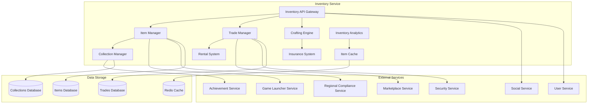

# Дизайн Inventory Service

## Обзор

Inventory Service управляет всеми цифровыми активами пользователей российской Steam платформы, включая внутриигровые предметы, коллекционные карточки, значки, эмоции, фоны профилей и другие цифровые активы. Сервис обеспечивает безопасное хранение, торговлю, крафт и персонализацию предметов.

## Архитектура

### Высокоуровневая архитектура



### Компонентная архитектура

#### Item Manager
- Управление жизненным циклом предметов
- Добавление, удаление, обновление предметов
- Валидация и проверка подлинности
- Интеграция с играми для синхронизации

#### Trade Manager
- Управление торговыми операциями
- Блокировка/разблокировка предметов
- Интеграция с торговой площадкой
- Защита от мошенничества

#### Crafting Engine
- Система крафта и комбинирования предметов
- Управление рецептами и материалами
- Валидация крафтовых операций
- Обработка неудачных попыток

#### Collection Manager
- Управление коллекциями карточек и значков
- Отслеживание прогресса коллекций
- Автоматическое создание значков
- Система обмена дубликатов

## Компоненты и интерфейсы

### 1. Inventory API Gateway

```typescript
interface InventoryAPIGateway {
  // Управление предметами
  getInventory(userId: string, filters: InventoryFilters): Promise<InventoryPage>
  getItem(itemId: string): Promise<InventoryItem>
  addItem(userId: string, item: ItemData): Promise<AddItemResult>
  removeItem(userId: string, itemId: string): Promise<RemoveItemResult>
  
  // Торговые операции
  lockItemForTrade(userId: string, itemId: string, tradeId: string): Promise<LockResult>
  unlockItem(userId: string, itemId: string): Promise<UnlockResult>
  transferItem(fromUserId: string, toUserId: string, itemId: string): Promise<TransferResult>
  
  // Коллекции и значки
  getCollections(userId: string): Promise<UserCollection[]>
  craftBadge(userId: string, collectionId: string): Promise<CraftBadgeResult>
  exchangeCards(userId: string, exchange: CardExchange): Promise<ExchangeResult>
  
  // Крафт и комбинирование
  getCraftingRecipes(gameId: string): Promise<CraftingRecipe[]>
  craftItem(userId: string, recipeId: string, materials: ItemStack[]): Promise<CraftResult>
  upgradeItem(userId: string, itemId: string, materials: ItemStack[]): Promise<UpgradeResult>
  
  // Персонализация профиля
  setProfileBackground(userId: string, backgroundId: string): Promise<ProfileUpdateResult>
  setProfileEmoticon(userId: string, emoticonId: string): Promise<ProfileUpdateResult>
  setShowcaseItems(userId: string, itemIds: string[]): Promise<ShowcaseResult>
  
  // Аренда и страхование
  rentItem(userId: string, itemId: string, duration: number): Promise<RentalResult>
  insureItem(userId: string, itemId: string): Promise<InsuranceResult>
  
  // Аналитика и рекомендации
  getInventoryAnalytics(userId: string): Promise<InventoryAnalytics>
  getItemRecommendations(userId: string): Promise<ItemRecommendation[]>
}
```

### 2. Item Manager

```typescript
interface ItemManager {
  // Управление предметами
  createItem(itemData: CreateItemRequest): Promise<InventoryItem>
  updateItem(itemId: string, updates: ItemUpdate): Promise<UpdateResult>
  deleteItem(itemId: string, reason: DeletionReason): Promise<DeletionResult>
  
  // Валидация и проверка
  validateItem(item: InventoryItem): Promise<ValidationResult>
  checkItemAuthenticity(itemId: string): Promise<AuthenticityCheck>
  detectDuplicateItems(userId: string): Promise<DuplicateDetectionResult>
  
  // Интеграция с играми
  syncWithGame(userId: string, gameId: string, gameItems: GameItem[]): Promise<SyncResult>
  provideItemsToGame(userId: string, gameId: string): Promise<GameItemsResult>
  handleItemConsumption(userId: string, itemId: string, quantity: number): Promise<ConsumptionResult>
  
  // Поиск и фильтрация
  searchItems(userId: string, query: SearchQuery): Promise<SearchResult>
  filterItems(userId: string, filters: ItemFilters): Promise<FilterResult>
  sortItems(userId: string, sortBy: SortCriteria): Promise<SortResult>
  
  // Массовые операции
  bulkAddItems(userId: string, items: BulkItemData[]): Promise<BulkAddResult>
  bulkUpdateItems(updates: BulkItemUpdate[]): Promise<BulkUpdateResult>
  bulkDeleteItems(itemIds: string[], reason: DeletionReason): Promise<BulkDeleteResult>
}
```

### 3. Trade Manager

```typescript
interface TradeManager {
  // Управление торговыми блокировками
  lockItem(userId: string, itemId: string, lockReason: LockReason): Promise<LockResult>
  unlockItem(userId: string, itemId: string): Promise<UnlockResult>
  getLockStatus(itemId: string): Promise<LockStatus>
  
  // Передача предметов
  initiateTransfer(transfer: ItemTransferRequest): Promise<TransferInitResult>
  completeTransfer(transferId: string): Promise<TransferCompleteResult>
  cancelTransfer(transferId: string, reason: string): Promise<TransferCancelResult>
  
  // Безопасность торговли
  validateTradeEligibility(userId: string, itemId: string): Promise<TradeEligibilityResult>
  checkItemHistory(itemId: string): Promise<ItemHistory>
  flagSuspiciousActivity(userId: string, activity: SuspiciousActivity): Promise<FlagResult>
  
  // Интеграция с торговой площадкой
  prepareForMarketplace(userId: string, itemId: string): Promise<MarketplacePreparationResult>
  handleMarketplaceSale(saleData: MarketplaceSale): Promise<SaleHandlingResult>
  processMarketplaceReturn(returnData: MarketplaceReturn): Promise<ReturnResult>
  
  // Аудит и отчетность
  getTradeHistory(userId: string, period: TimePeriod): Promise<TradeHistory>
  generateTradeReport(filters: TradeReportFilters): Promise<TradeReport>
  auditItemMovement(itemId: string): Promise<ItemMovementAudit>
}
```

### 4. Crafting Engine

```typescript
interface CraftingEngine {
  // Управление рецептами
  getAvailableRecipes(userId: string, gameId?: string): Promise<CraftingRecipe[]>
  validateRecipe(recipeId: string, materials: ItemStack[]): Promise<RecipeValidation>
  
  // Крафт предметов
  craftItem(userId: string, recipeId: string, materials: ItemStack[]): Promise<CraftResult>
  upgradeItem(userId: string, itemId: string, upgradeData: UpgradeData): Promise<UpgradeResult>
  combineItems(userId: string, itemIds: string[], combinationType: CombinationType): Promise<CombineResult>
  
  // Система неудач и возвратов
  handleCraftFailure(craftAttempt: CraftAttempt): Promise<FailureHandlingResult>
  calculateMaterialReturn(failedCraft: FailedCraft): Promise<MaterialReturnResult>
  
  // Специальные крафты
  craftSeasonalItem(userId: string, seasonalRecipe: SeasonalRecipe): Promise<SeasonalCraftResult>
  craftLimitedEdition(userId: string, limitedRecipe: LimitedRecipe): Promise<LimitedCraftResult>
  
  // Аналитика крафта
  getCraftingStatistics(userId: string): Promise<CraftingStatistics>
  getPopularRecipes(gameId?: string): Promise<PopularRecipe[]>
  predictCraftSuccess(recipeId: string, materials: ItemStack[]): Promise<SuccessPrediction>
}
```

### 5. Collection Manager

```typescript
interface CollectionManager {
  // Управление коллекциями
  getUserCollections(userId: string): Promise<UserCollection[]>
  getCollectionProgress(userId: string, collectionId: string): Promise<CollectionProgress>
  addCardToCollection(userId: string, cardId: string): Promise<AddCardResult>
  
  // Создание значков
  checkBadgeEligibility(userId: string, collectionId: string): Promise<BadgeEligibility>
  craftBadge(userId: string, collectionId: string): Promise<BadgeCraftResult>
  upgradeBadge(userId: string, badgeId: string): Promise<BadgeUpgradeResult>
  
  // Обмен карточек
  findTradingPartners(userId: string, wantedCards: string[], offeredCards: string[]): Promise<TradingPartner[]>
  initiateCardExchange(exchange: CardExchangeRequest): Promise<ExchangeInitResult>
  completeCardExchange(exchangeId: string): Promise<ExchangeCompleteResult>
  
  // Случайные дропы
  generateCardDrop(userId: string, gameId: string, playTime: number): Promise<CardDropResult>
  calculateDropProbability(userId: string, gameId: string): Promise<DropProbability>
  
  // Коллекционная аналитика
  getCollectionValue(userId: string, collectionId: string): Promise<CollectionValue>
  getCompletionRecommendations(userId: string): Promise<CompletionRecommendation[]>
  trackCollectionTrends(collectionId: string): Promise<CollectionTrends>
}
```

### 6. Rental System

```typescript
interface RentalSystem {
  // Управление арендой
  rentItem(userId: string, itemId: string, rentalPeriod: RentalPeriod): Promise<RentalResult>
  extendRental(userId: string, rentalId: string, additionalTime: number): Promise<ExtensionResult>
  terminateRental(userId: string, rentalId: string): Promise<TerminationResult>
  
  // Мониторинг аренды
  getRentalStatus(rentalId: string): Promise<RentalStatus>
  getActiveRentals(userId: string): Promise<ActiveRental[]>
  checkRentalExpiration(): Promise<ExpirationCheckResult>
  
  // Уведомления об аренде
  sendRentalReminders(userId: string, rentalId: string): Promise<ReminderResult>
  notifyRentalExpiration(userId: string, rentalId: string): Promise<ExpirationNotificationResult>
  
  // Аналитика аренды
  getRentalAnalytics(userId: string): Promise<RentalAnalytics>
  getPopularRentalItems(): Promise<PopularRentalItem[]>
  calculateRentalROI(itemId: string): Promise<RentalROI>
}
```

## Модели данных

### Inventory Item
```typescript
interface InventoryItem {
  id: string
  userId: string
  gameId: string
  itemType: ItemType
  name: string
  description: string
  rarity: ItemRarity
  quality: ItemQuality
  quantity: number
  stackable: boolean
  tradable: boolean
  marketable: boolean
  consumable: boolean
  durability?: number
  maxDurability?: number
  attributes: ItemAttribute[]
  tags: string[]
  iconUrl: string
  imageUrl: string
  acquiredAt: Date
  lastUsedAt?: Date
  expiresAt?: Date
  isLocked: boolean
  lockReason?: LockReason
  marketValue?: number
  metadata: ItemMetadata
}

enum ItemType {
  WEAPON = 'weapon',
  ARMOR = 'armor',
  CONSUMABLE = 'consumable',
  TRADING_CARD = 'trading_card',
  BADGE = 'badge',
  EMOTICON = 'emoticon',
  PROFILE_BACKGROUND = 'profile_background',
  PROFILE_FRAME = 'profile_frame',
  STICKER = 'sticker',
  MUSIC_KIT = 'music_kit',
  GRAFFITI = 'graffiti'
}

enum ItemRarity {
  COMMON = 'common',
  UNCOMMON = 'uncommon',
  RARE = 'rare',
  EPIC = 'epic',
  LEGENDARY = 'legendary',
  MYTHICAL = 'mythical',
  IMMORTAL = 'immortal'
}

interface ItemAttribute {
  name: string
  value: any
  type: AttributeType
  displayName: string
  description?: string
}
```

### Collection
```typescript
interface Collection {
  id: string
  gameId: string
  name: string
  description: string
  series: number
  totalCards: number
  badgeReward: BadgeReward
  isActive: boolean
  releaseDate: Date
  endDate?: Date
  cards: CollectionCard[]
}

interface UserCollection {
  userId: string
  collectionId: string
  ownedCards: OwnedCard[]
  completedAt?: Date
  badgeLevel: number
  totalCrafted: number
  progress: CollectionProgress
}

interface CollectionCard {
  id: string
  collectionId: string
  name: string
  description: string
  imageUrl: string
  rarity: CardRarity
  dropRate: number
  isSpecial: boolean
}

interface OwnedCard {
  cardId: string
  quantity: number
  acquiredAt: Date[]
  tradable: boolean
}

enum CardRarity {
  NORMAL = 'normal',
  FOIL = 'foil',
  HOLOGRAPHIC = 'holographic',
  SPECIAL_EDITION = 'special_edition'
}
```

### Crafting Recipe
```typescript
interface CraftingRecipe {
  id: string
  gameId: string
  name: string
  description: string
  category: CraftingCategory
  materials: RecipeMaterial[]
  result: CraftingResult
  successRate: number
  cooldown?: number
  requirements: CraftingRequirement[]
  isActive: boolean
  isLimited: boolean
  limitedQuantity?: number
  availableFrom?: Date
  availableUntil?: Date
}

interface RecipeMaterial {
  itemType: ItemType
  itemId?: string
  quantity: number
  consumeOnUse: boolean
  alternatives?: string[]
}

interface CraftingResult {
  itemId: string
  quantity: number
  bonusItems?: BonusItem[]
  experienceGained: number
}

enum CraftingCategory {
  WEAPONS = 'weapons',
  ARMOR = 'armor',
  CONSUMABLES = 'consumables',
  DECORATIVE = 'decorative',
  SPECIAL = 'special'
}
```

### Trade Transaction
```typescript
interface TradeTransaction {
  id: string
  type: TradeType
  fromUserId: string
  toUserId: string
  items: TradedItem[]
  status: TradeStatus
  initiatedAt: Date
  completedAt?: Date
  cancelledAt?: Date
  reason?: string
  marketplaceId?: string
  securityFlags: SecurityFlag[]
  auditTrail: AuditEntry[]
}

interface TradedItem {
  itemId: string
  fromInventoryId: string
  toInventoryId: string
  transferredAt: Date
  previousOwners: string[]
  transferReason: TransferReason
}

enum TradeType {
  DIRECT_TRADE = 'direct_trade',
  MARKETPLACE_SALE = 'marketplace_sale',
  GIFT = 'gift',
  SYSTEM_TRANSFER = 'system_transfer',
  RENTAL = 'rental'
}

enum TradeStatus {
  PENDING = 'pending',
  COMPLETED = 'completed',
  CANCELLED = 'cancelled',
  FAILED = 'failed',
  DISPUTED = 'disputed'
}
```

### Rental Agreement
```typescript
interface RentalAgreement {
  id: string
  renterId: string
  ownerId: string
  itemId: string
  startDate: Date
  endDate: Date
  rentalPeriod: RentalPeriod
  cost: number
  currency: string
  status: RentalStatus
  extensions: RentalExtension[]
  terms: RentalTerms
  paymentId: string
  securityDeposit?: number
}

interface RentalPeriod {
  duration: number
  unit: TimeUnit
  renewable: boolean
  maxRenewals?: number
}

enum RentalStatus {
  ACTIVE = 'active',
  EXPIRED = 'expired',
  TERMINATED = 'terminated',
  PENDING_PAYMENT = 'pending_payment'
}

interface RentalTerms {
  usageRestrictions: string[]
  damagePolicy: string
  returnConditions: string[]
  penaltyClause?: string
}
```

### Insurance Policy
```typescript
interface InsurancePolicy {
  id: string
  userId: string
  itemId: string
  policyType: InsurancePolicyType
  coverage: InsuranceCoverage
  premium: number
  deductible: number
  startDate: Date
  endDate: Date
  status: PolicyStatus
  claims: InsuranceClaim[]
  terms: PolicyTerms
}

interface InsuranceCoverage {
  theft: boolean
  accidentalLoss: boolean
  systemError: boolean
  hackingIncident: boolean
  maxCoverage: number
  replacementValue: boolean
}

enum InsurancePolicyType {
  BASIC = 'basic',
  COMPREHENSIVE = 'comprehensive',
  PREMIUM = 'premium'
}

interface InsuranceClaim {
  id: string
  policyId: string
  incidentDate: Date
  claimDate: Date
  incidentType: IncidentType
  description: string
  evidence: ClaimEvidence[]
  status: ClaimStatus
  assessorId?: string
  settlementAmount?: number
  settlementDate?: Date
}
```

## Обработка ошибок

### Error Handling Strategy

```typescript
interface InventoryError {
  code: InventoryErrorCode
  message: string
  userId?: string
  itemId?: string
  tradeId?: string
  details?: any
  timestamp: Date
}

enum InventoryErrorCode {
  // Предметы
  ITEM_NOT_FOUND = 'ITEM_NOT_FOUND',
  ITEM_NOT_OWNED = 'ITEM_NOT_OWNED',
  ITEM_LOCKED = 'ITEM_LOCKED',
  ITEM_EXPIRED = 'ITEM_EXPIRED',
  ITEM_NOT_TRADABLE = 'ITEM_NOT_TRADABLE',
  
  // Торговля
  TRADE_BLOCKED = 'TRADE_BLOCKED',
  INSUFFICIENT_ITEMS = 'INSUFFICIENT_ITEMS',
  TRADE_COOLDOWN = 'TRADE_COOLDOWN',
  SECURITY_HOLD = 'SECURITY_HOLD',
  
  // Крафт
  RECIPE_NOT_FOUND = 'RECIPE_NOT_FOUND',
  INSUFFICIENT_MATERIALS = 'INSUFFICIENT_MATERIALS',
  CRAFT_FAILED = 'CRAFT_FAILED',
  CRAFT_COOLDOWN = 'CRAFT_COOLDOWN',
  
  // Коллекции
  COLLECTION_NOT_FOUND = 'COLLECTION_NOT_FOUND',
  BADGE_ALREADY_CRAFTED = 'BADGE_ALREADY_CRAFTED',
  INCOMPLETE_COLLECTION = 'INCOMPLETE_COLLECTION',
  
  // Аренда
  RENTAL_NOT_AVAILABLE = 'RENTAL_NOT_AVAILABLE',
  RENTAL_EXPIRED = 'RENTAL_EXPIRED',
  RENTAL_PAYMENT_FAILED = 'RENTAL_PAYMENT_FAILED',
  
  // Страхование
  ITEM_NOT_INSURABLE = 'ITEM_NOT_INSURABLE',
  INSURANCE_CLAIM_DENIED = 'INSURANCE_CLAIM_DENIED',
  POLICY_EXPIRED = 'POLICY_EXPIRED'
}
```

### Recovery Mechanisms
- Автоматическое восстановление предметов при системных сбоях
- Компенсация за потерянные предметы из-за багов
- Откат торговых операций при обнаружении мошенничества
- Восстановление коллекций из резервных копий

## Стратегия тестирования

### Unit Tests
- Тестирование логики крафта и рецептов
- Проверка алгоритмов торговых блокировок
- Тестирование системы коллекций и значков
- Валидация системы аренды и страхования

### Integration Tests
- Тестирование интеграции с торговой площадкой
- Проверка взаимодействия с играми
- Тестирование системы достижений
- Проверка социальных функций

### End-to-End Tests
- Полный цикл получения и использования предметов
- Тестирование торговых операций
- Проверка крафта и коллекций
- Тестирование аренды и страхования

### Performance Tests
- Нагрузочное тестирование инвентаря с большим количеством предметов
- Тестирование производительности поиска и фильтрации
- Проверка масштабирования торговых операций
- Стресс-тестирование системы крафта

## Безопасность

### Item Security
- Защита от дублирования предметов
- Валидация подлинности всех предметов
- Мониторинг подозрительных торговых операций
- Система восстановления украденных предметов

### Trade Security
- Двухфакторная аутентификация для ценных сделок
- Система задержек для подозрительных операций
- Автоматическое обнаружение мошенничества
- Аудит всех торговых операций

### Data Protection
- Шифрование всех данных инвентаря
- Защита от несанкционированного доступа
- Соблюдение требований по персональным данным
- Безопасное удаление данных при закрытии аккаунта

## Производительность и масштабируемость

### Caching Strategy
- Кэширование часто используемых предметов
- Кэширование результатов поиска и фильтрации
- Кэширование данных коллекций
- Кэширование рыночных цен предметов

### Database Optimization
- Индексирование для быстрого поиска предметов
- Партиционирование больших инвентарей
- Архивирование старых торговых данных
- Оптимизация запросов аналитики

### Horizontal Scaling
- Микросервисная архитектура
- Распределение нагрузки по типам предметов
- Асинхронная обработка торговых операций
- Автоматическое масштабирование при высокой нагрузке

## Соответствие российским требованиям

### Legal Compliance
- Соблюдение российского законодательства о цифровых активах
- Интеграция с системами налогообложения
- Соответствие требованиям по защите детей
- Ведение документооборота согласно российским стандартам

### Data Localization
- Хранение данных инвентаря на российских серверах
- Локализация торговых операций
- Соответствие требованиям по персональным данным
- Интеграция с российскими платежными системами

### Regional Adaptation
- Адаптация контента под российские культурные особенности
- Поддержка российских праздников в коллекциях
- Интеграция с российскими игровыми сообществами
- Учет российских предпочтений в дизайне предметов