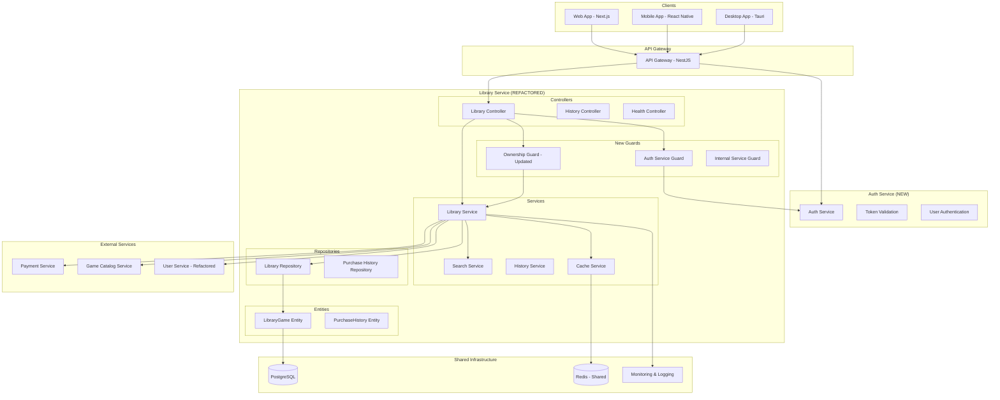
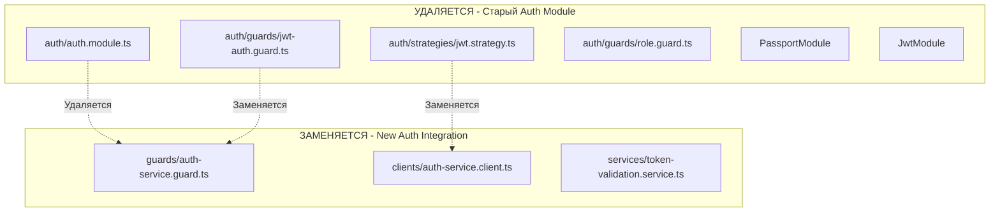

# Design Document - Library Service Refactoring

## Overview

Рефакторинг Library Service направлен на удаление устаревшего auth кода после миграции аутентификации в отдельный Auth Service, оптимизацию интеграции с новой микросервисной архитектурой и улучшение производительности. Сервис будет сосредоточен исключительно на управлении библиотеками игр пользователей с эффективной интеграцией через общий Redis и стандартизированные REST API.

**Ключевые изменения:**
- **Удаление auth модуля**: Полное удаление локальной аутентификации
- **Интеграция с Auth Service**: Валидация токенов через внешний сервис
- **Оптимизация кэширования**: Использование общего Redis с namespace
- **Улучшение производительности**: Оптимизация запросов и кэширования
- **Стандартизация API**: Единообразные форматы ответов и ошибок

## Architecture

### Новая архитектура после рефакторинга



### Удаляемые компоненты



## Components and Interfaces

### Новые Guards (замена auth модуля)

#### AuthServiceGuard (замена JwtAuthGuard)
```typescript
@Injectable()
export class AuthServiceGuard implements CanActivate {
  constructor(
    private readonly authServiceClient: AuthServiceClient,
    private readonly cacheService: CacheService,
    private readonly configService: ConfigService,
  ) {}

  async canActivate(context: ExecutionContext): Promise<boolean> {
    const request = context.switchToHttp().getRequest();
    const token = this.extractTokenFromHeader(request);
    
    if (!token) {
      throw new UnauthorizedException('Token not provided');
    }

    // Попытка локальной валидации JWT (fallback)
    const localValidation = await this.validateTokenLocally(token);
    if (localValidation.valid) {
      request.user = localValidation.user;
      return true;
    }

    // Валидация через Auth Service
    try {
      const user = await this.authServiceClient.validateToken(token);
      request.user = user;
      return true;
    } catch (error) {
      throw new UnauthorizedException('Invalid token');
    }
  }

  private extractTokenFromHeader(request: any): string | undefined
  private async validateTokenLocally(token: string): Promise<{valid: boolean, user?: any}>
}
```

#### InternalServiceGuard (обновленный)
```typescript
@Injectable()
export class InternalServiceGuard implements CanActivate {
  constructor(
    private readonly configService: ConfigService,
    private readonly authServiceClient: AuthServiceClient,
  ) {}

  async canActivate(context: ExecutionContext): Promise<boolean> {
    const request = context.switchToHttp().getRequest();
    
    // Проверка internal API key
    const internalKey = this.extractInternalKey(request);
    if (internalKey && this.validateInternalKey(internalKey)) {
      return true;
    }

    // Проверка service-to-service токена через Auth Service
    const serviceToken = this.extractServiceToken(request);
    if (serviceToken) {
      try {
        const validation = await this.authServiceClient.validateServiceToken(serviceToken);
        return validation.valid && validation.service;
      } catch (error) {
        // Fallback к локальной валидации
        return this.validateServiceTokenLocally(serviceToken);
      }
    }

    throw new UnauthorizedException('Internal service authentication required');
  }

  private extractInternalKey(request: any): string | undefined
  private extractServiceToken(request: any): string | undefined
  private validateInternalKey(key: string): boolean
  private validateServiceTokenLocally(token: string): boolean
}
```

### Новые Clients

#### AuthServiceClient
```typescript
@Injectable()
export class AuthServiceClient {
  constructor(
    private readonly httpService: HttpService,
    private readonly configService: ConfigService,
    private readonly cacheService: CacheService,
  ) {}

  async validateToken(token: string): Promise<AuthUser> {
    const cacheKey = `auth_token_${this.hashToken(token)}`;
    
    // Проверка кэша
    const cached = await this.cacheService.get<AuthUser>(cacheKey);
    if (cached) {
      return cached;
    }

    // Запрос к Auth Service
    try {
      const response = await this.httpService.post('/auth/validate', { token }).toPromise();
      const user = response.data.user;
      
      // Кэширование на короткое время
      await this.cacheService.set(cacheKey, user, 300); // 5 минут
      
      return user;
    } catch (error) {
      throw new UnauthorizedException('Token validation failed');
    }
  }

  async validateServiceToken(token: string): Promise<{valid: boolean, service: boolean}> {
    try {
      const response = await this.httpService.post('/auth/validate-service', { token }).toPromise();
      return response.data;
    } catch (error) {
      return { valid: false, service: false };
    }
  }

  private hashToken(token: string): string {
    // Хэширование токена для безопасного кэширования
    return crypto.createHash('sha256').update(token).digest('hex').substring(0, 16);
  }
}
```

### Обновленные Services

#### CacheService (с namespace для Library Service)
```typescript
@Injectable()
export class CacheService {
  private readonly namespace = 'library:';
  
  constructor(
    @Inject(CACHE_MANAGER) private cacheManager: Cache,
    private readonly configService: ConfigService,
  ) {}

  async get<T>(key: string): Promise<T | undefined> {
    const namespacedKey = this.getNamespacedKey(key);
    return await this.cacheManager.get<T>(namespacedKey);
  }

  async set<T>(key: string, value: T, ttl?: number): Promise<void> {
    const namespacedKey = this.getNamespacedKey(key);
    const defaultTtl = this.configService.get<number>('cache.defaultTtl', 300);
    await this.cacheManager.set(namespacedKey, value, ttl || defaultTtl);
  }

  async invalidateUserLibraryCache(userId: string): Promise<void> {
    const patterns = [
      `${this.namespace}library_${userId}_*`,
      `${this.namespace}ownership_${userId}_*`,
      `${this.namespace}search_${userId}_*`,
    ];
    
    for (const pattern of patterns) {
      await this.invalidateByPattern(pattern);
    }
  }

  async mget<T>(keys: string[]): Promise<Map<string, T>> {
    const namespacedKeys = keys.map(key => this.getNamespacedKey(key));
    const results = new Map<string, T>();
    
    for (const [index, namespacedKey] of namespacedKeys.entries()) {
      const value = await this.cacheManager.get<T>(namespacedKey);
      if (value !== undefined) {
        results.set(keys[index], value);
      }
    }
    
    return results;
  }

  async mset<T>(entries: Array<{key: string, value: T, ttl?: number}>): Promise<void> {
    for (const entry of entries) {
      await this.set(entry.key, entry.value, entry.ttl);
    }
  }

  private getNamespacedKey(key: string): string {
    return `${this.namespace}${key}`;
  }

  private async invalidateByPattern(pattern: string): Promise<void> {
    // Реализация зависит от Redis client
    // Для ioredis можно использовать SCAN + DEL
  }
}
```

### Обновленные Controllers

#### LibraryController (без auth модуля)
```typescript
@ApiTags('Library')
@ApiBearerAuth()
@Controller('library')
export class LibraryController {
  constructor(
    private readonly libraryService: LibraryService,
    private readonly searchService: SearchService,
  ) {}

  @Get('my')
  @UseGuards(AuthServiceGuard, OwnershipGuard) // Заменено с JwtAuthGuard
  @UseInterceptors(CacheInterceptor)
  @CacheTTL(300)
  async getMyLibrary(
    @Req() request: AuthenticatedRequest,
    @Query() query: LibraryQueryDto,
  ): Promise<LibraryResponseDto> {
    const userId = request.user.id;
    return this.libraryService.getUserLibrary(userId, query);
  }

  @Get('my/search')
  @UseGuards(AuthServiceGuard) // Заменено с JwtAuthGuard
  async searchMyLibrary(
    @Req() request: AuthenticatedRequest,
    @Query() query: SearchLibraryDto,
  ): Promise<LibraryResponseDto> {
    const userId = request.user.id;
    return this.searchService.searchUserLibrary(userId, query);
  }

  @Get('ownership/:gameId')
  @UseGuards(AuthServiceGuard) // Заменено с JwtAuthGuard
  async checkOwnership(
    @Req() request: AuthenticatedRequest,
    @Param('gameId', new ParseUUIDPipe()) gameId: string,
  ): Promise<OwnershipResponseDto> {
    const userId = request.user.id;
    return this.libraryService.checkGameOwnership(userId, gameId);
  }

  @Post('add')
  @UseGuards(InternalServiceGuard) // Обновленный guard
  async addGameToLibrary(
    @Body() dto: AddGameToLibraryDto,
  ): Promise<LibraryGameDto> {
    const libraryGame = await this.libraryService.addGameToLibrary(dto);
    return LibraryGameDto.fromEntity(libraryGame);
  }

  @Delete('remove')
  @UseGuards(InternalServiceGuard) // Обновленный guard
  async removeGameFromLibrary(
    @Body() dto: RemoveGameFromLibraryDto,
  ): Promise<void> {
    return this.libraryService.removeGameFromLibrary(dto.userId, dto.gameId);
  }

  @Get('user/:userId/games')
  @UseGuards(InternalServiceGuard) // Обновленный guard
  async getUserGamesInternal(
    @Param('userId') userId: string,
    @Query() query: LibraryQueryDto,
  ): Promise<LibraryResponseDto> {
    return this.libraryService.getUserLibrary(userId, query);
  }
}
```

## Data Models

### Обновленные DTOs

#### AuthUser (для интеграции с Auth Service)
```typescript
export interface AuthUser {
  id: string;
  username: string;
  email: string;
  roles: string[];
  isActive: boolean;
  lastLoginAt?: Date;
}

export interface AuthenticatedRequest extends Request {
  user: AuthUser;
}
```

#### Стандартизированные Response DTOs
```typescript
export class StandardResponseDto<T> {
  success: boolean;
  data?: T;
  error?: {
    code: string;
    message: string;
    details?: any;
  };
  meta?: {
    timestamp: string;
    requestId: string;
    version: string;
  };
}

export class LibraryResponseDto extends StandardResponseDto<{
  games: LibraryGameDto[];
  pagination: PaginationDto;
}> {}

export class OwnershipResponseDto extends StandardResponseDto<{
  owns: boolean;
  purchaseDate?: Date;
  purchasePrice?: number;
  currency?: string;
}> {}
```

### Обновленные Configuration

#### AuthConfig
```typescript
export interface AuthConfig {
  authService: {
    baseUrl: string;
    timeout: number;
    retries: number;
  };
  jwt: {
    secret: string; // Для локальной валидации (fallback)
    expiresIn: string;
  };
  internal: {
    apiKey: string;
    serviceTokenSecret: string;
  };
}
```

## Error Handling

### Стандартизированные Exception Filters

#### GlobalExceptionFilter (обновленный)
```typescript
@Catch()
export class GlobalExceptionFilter implements ExceptionFilter {
  private readonly logger = new Logger(GlobalExceptionFilter.name);

  catch(exception: unknown, host: ArgumentsHost): void {
    const ctx = host.switchToHttp();
    const response = ctx.getResponse<Response>();
    const request = ctx.getRequest<Request>();

    const requestId = request.headers['x-request-id'] || this.generateRequestId();
    
    let status: number;
    let errorResponse: StandardErrorResponse;

    if (exception instanceof HttpException) {
      status = exception.getStatus();
      errorResponse = this.handleHttpException(exception, requestId);
    } else if (exception instanceof QueryFailedError) {
      status = 500;
      errorResponse = this.handleDatabaseException(exception, requestId);
    } else {
      status = 500;
      errorResponse = this.handleUnknownException(exception, requestId);
    }

    // Логирование с correlation ID
    this.logger.error(
      `Request ${requestId} failed: ${errorResponse.error.message}`,
      exception instanceof Error ? exception.stack : String(exception),
    );

    response.status(status).json(errorResponse);
  }

  private handleHttpException(exception: HttpException, requestId: string): StandardErrorResponse {
    const response = exception.getResponse();
    const message = typeof response === 'string' ? response : (response as any).message;
    
    return {
      success: false,
      error: {
        code: this.getErrorCode(exception),
        message: Array.isArray(message) ? message.join(', ') : message,
        details: typeof response === 'object' ? response : undefined,
      },
      meta: {
        timestamp: new Date().toISOString(),
        requestId,
        version: '1.0.0',
      },
    };
  }

  private getErrorCode(exception: HttpException): string {
    const status = exception.getStatus();
    const constructorName = exception.constructor.name;
    
    const errorCodes: Record<number, string> = {
      400: 'BAD_REQUEST',
      401: 'UNAUTHORIZED',
      403: 'FORBIDDEN',
      404: 'NOT_FOUND',
      409: 'CONFLICT',
      422: 'UNPROCESSABLE_ENTITY',
      500: 'INTERNAL_SERVER_ERROR',
      503: 'SERVICE_UNAVAILABLE',
    };

    return errorCodes[status] || constructorName.replace('Exception', '').toUpperCase();
  }

  private generateRequestId(): string {
    return `req_${Date.now()}_${Math.random().toString(36).substr(2, 9)}`;
  }
}
```

### Новые Custom Exceptions

#### AuthServiceException
```typescript
export class AuthServiceException extends HttpException {
  constructor(message: string, originalError?: any) {
    super({
      error: 'AUTH_SERVICE_ERROR',
      message: `Authentication service error: ${message}`,
      originalError: originalError?.message || originalError,
    }, 503);
  }
}

export class TokenValidationException extends HttpException {
  constructor(reason: string) {
    super({
      error: 'TOKEN_VALIDATION_FAILED',
      message: `Token validation failed: ${reason}`,
    }, 401);
  }
}
```

## Testing Strategy

### Unit Tests (обновленные)

#### AuthServiceGuard Tests
```typescript
describe('AuthServiceGuard', () => {
  let guard: AuthServiceGuard;
  let authServiceClient: jest.Mocked<AuthServiceClient>;
  let cacheService: jest.Mocked<CacheService>;

  beforeEach(async () => {
    const module = await Test.createTestingModule({
      providers: [
        AuthServiceGuard,
        {
          provide: AuthServiceClient,
          useValue: {
            validateToken: jest.fn(),
          },
        },
        {
          provide: CacheService,
          useValue: {
            get: jest.fn(),
            set: jest.fn(),
          },
        },
        {
          provide: ConfigService,
          useValue: {
            get: jest.fn(),
          },
        },
      ],
    }).compile();

    guard = module.get<AuthServiceGuard>(AuthServiceGuard);
    authServiceClient = module.get(AuthServiceClient);
    cacheService = module.get(CacheService);
  });

  describe('canActivate', () => {
    it('should allow access with valid token from Auth Service', async () => {
      const mockUser = { id: 'user1', username: 'test', roles: ['user'] };
      authServiceClient.validateToken.mockResolvedValue(mockUser);

      const context = createMockExecutionContext('Bearer valid-token');
      const result = await guard.canActivate(context);

      expect(result).toBe(true);
      expect(context.switchToHttp().getRequest().user).toEqual(mockUser);
    });

    it('should fallback to local validation when Auth Service is unavailable', async () => {
      authServiceClient.validateToken.mockRejectedValue(new Error('Service unavailable'));
      
      const context = createMockExecutionContext('Bearer valid-local-token');
      jest.spyOn(guard as any, 'validateTokenLocally').mockResolvedValue({
        valid: true,
        user: { id: 'user1', username: 'test' }
      });

      const result = await guard.canActivate(context);

      expect(result).toBe(true);
    });

    it('should throw UnauthorizedException for invalid token', async () => {
      authServiceClient.validateToken.mockRejectedValue(new Error('Invalid token'));
      jest.spyOn(guard as any, 'validateTokenLocally').mockResolvedValue({ valid: false });

      const context = createMockExecutionContext('Bearer invalid-token');

      await expect(guard.canActivate(context)).rejects.toThrow(UnauthorizedException);
    });
  });
});
```

#### LibraryService Tests (обновленные)
```typescript
describe('LibraryService', () => {
  // Тесты остаются в основном теми же, но обновляются моки для новых зависимостей
  
  it('should handle Auth Service unavailability gracefully', async () => {
    // Тест для проверки работы при недоступности Auth Service
  });

  it('should use namespaced cache keys', async () => {
    // Тест для проверки использования namespace в кэше
  });
});
```

### Integration Tests (обновленные)

#### Auth Integration Tests
```typescript
describe('Library API with Auth Service Integration', () => {
  beforeEach(async () => {
    // Настройка тестового Auth Service mock
  });

  it('should authenticate via Auth Service', async () => {
    // Тест интеграции с Auth Service
  });

  it('should fallback to local validation when Auth Service is down', async () => {
    // Тест fallback механизма
  });
});
```

## Performance Optimizations

### Кэширование с namespace

```typescript
// Старый подход (без namespace)
await cacheManager.set('library_user1_page1', data);

// Новый подход (с namespace)
await cacheService.set('library_user1_page1', data); // Автоматически: "library:library_user1_page1"
```

### Batch операции для кэша

```typescript
// Оптимизированное получение данных игр
const gameDetailsMap = await this.cacheService.mget<GameDetailsDto>(
  gameIds.map(id => `game_details_${id}`)
);

// Оптимизированное сохранение в кэш
await this.cacheService.mset([
  { key: 'game_details_1', value: gameData1, ttl: 1800 },
  { key: 'game_details_2', value: gameData2, ttl: 1800 },
]);
```

### Circuit Breaker для внешних сервисов

```typescript
@Injectable()
export class AuthServiceClient {
  private circuitBreaker = new CircuitBreaker(this.validateTokenInternal.bind(this), {
    timeout: 3000,
    errorThresholdPercentage: 50,
    resetTimeout: 30000,
  });

  async validateToken(token: string): Promise<AuthUser> {
    try {
      return await this.circuitBreaker.fire(token);
    } catch (error) {
      // Fallback к локальной валидации
      return this.validateTokenLocally(token);
    }
  }
}
```

## Migration Strategy

### Поэтапная миграция

#### Phase 1: Подготовка
1. Создание новых guards и clients
2. Обновление конфигурации
3. Добавление fallback механизмов

#### Phase 2: Замена auth модуля
1. Замена JwtAuthGuard на AuthServiceGuard
2. Обновление InternalAuthGuard
3. Удаление auth модуля

#### Phase 3: Оптимизация
1. Внедрение namespace для кэша
2. Оптимизация производительности
3. Улучшение мониторинга

#### Phase 4: Очистка
1. Удаление неиспользуемых зависимостей
2. Обновление документации
3. Финальное тестирование

### Rollback Plan

В случае проблем:
1. Временное восстановление auth модуля
2. Переключение на локальную валидацию
3. Откат изменений в guards
4. Восстановление старой конфигурации

## Monitoring and Observability

### Новые метрики

```typescript
// Метрики для Auth Service интеграции
auth_service_requests_total
auth_service_requests_duration_seconds
auth_service_errors_total
auth_service_fallback_total

// Метрики кэширования
library_cache_hits_total
library_cache_misses_total
library_cache_invalidations_total
```

### Логирование

```typescript
// Структурированное логирование с correlation ID
this.logger.log({
  message: 'Token validated successfully',
  userId: user.id,
  requestId: request.headers['x-request-id'],
  source: 'auth-service',
  duration: Date.now() - startTime,
});
```

### Health Checks (обновленные)

```typescript
@Injectable()
export class HealthService {
  @HealthCheck()
  async checkAuthService(): Promise<HealthIndicatorResult> {
    try {
      await this.authServiceClient.healthCheck();
      return this.healthIndicator.isHealthy('auth-service', { status: 'up' });
    } catch (error) {
      return this.healthIndicator.isUnhealthy('auth-service', { status: 'down', error: error.message });
    }
  }
}
```