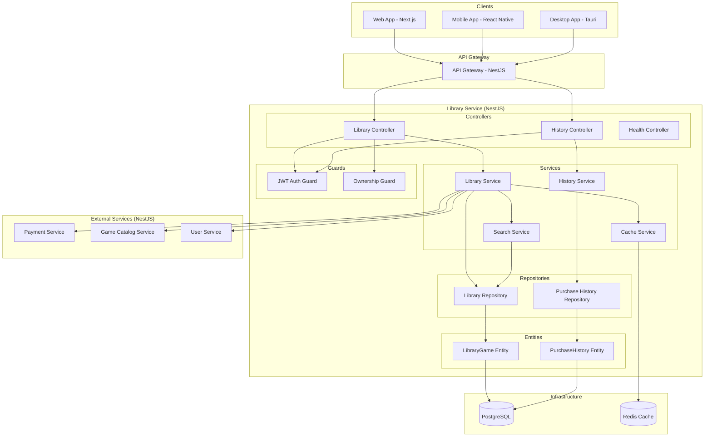

# Design Document - Library Service

## Overview

Library Service управляет библиотеками пользователей в российской игровой платформе, обеспечивая просмотр купленных игр, поиск, историю покупок и интеграцию с другими микросервисами через REST API. Реализован с использованием единого технологического стека NestJS + TypeScript для максимального переиспользования кода и соответствия архитектурным стандартам платформы.

**Единый технологический стек (NestJS + TypeScript):**
- **Framework**: NestJS (встроенная поддержка микросервисов, DI, декораторы)
- **Runtime**: Node.js 18+ / TypeScript
- **База данных**: PostgreSQL 14+ (primary), Redis (cache)
- **Message Queue**: Apache Kafka (для будущих event-driven интеграций)
- **ORM**: TypeORM (встроенная поддержка в NestJS)
- **Тестирование**: Jest + Supertest (встроенные в NestJS)
- **Документация**: Swagger/OpenAPI (автогенерация)
- **Контейнеризация**: Docker + Kubernetes готовность
- **API**: REST API First (никаких событий в MVP)

## Architecture

### NestJS Модульная Архитектура (Единый стек платформы)

Следует принципам единого технологического стека с максимальным переиспользованием кода между всеми микросервисами платформы. Использует REST API First подход для MVP с готовностью к будущему переходу на Apache Kafka для event-driven интеграций.



## Components and Interfaces

### NestJS Controllers

#### LibraryController
```typescript
@Controller('library')
@UseGuards(JwtAuthGuard)
@ApiTags('Library')
export class LibraryController {
  @Get('my')
  @UseGuards(OwnershipGuard)
  @ApiOperation({ summary: 'Get user library' })
  async getMyLibrary(@Req() request: AuthRequest, @Query() query: LibraryQueryDto): Promise<LibraryResponseDto>
  
  @Get('my/search')
  @ApiOperation({ summary: 'Search in user library' })
  async searchMyLibrary(@Req() request: AuthRequest, @Query() query: SearchLibraryDto): Promise<LibraryResponseDto>
  
  @Post('add')
  @ApiOperation({ summary: 'Add game to library (internal)' })
  async addGameToLibrary(@Body() dto: AddGameToLibraryDto): Promise<LibraryGameDto>
  
  @Get('ownership/:gameId')
  @ApiOperation({ summary: 'Check game ownership' })
  async checkOwnership(@Req() request: AuthRequest, @Param('gameId') gameId: string): Promise<OwnershipResponseDto>
}
```

#### HistoryController
```typescript
@Controller('library/history')
@UseGuards(JwtAuthGuard)
@ApiTags('Purchase History')
export class HistoryController {
  @Get()
  @ApiOperation({ summary: 'Get purchase history' })
  async getPurchaseHistory(@Req() request: AuthRequest, @Query() query: HistoryQueryDto): Promise<HistoryResponseDto>
  
  @Get('search')
  @ApiOperation({ summary: 'Search in purchase history' })
  async searchHistory(@Req() request: AuthRequest, @Query() query: SearchHistoryDto): Promise<HistoryResponseDto>
  
  @Get(':purchaseId')
  @ApiOperation({ summary: 'Get purchase details' })
  async getPurchaseDetails(@Req() request: AuthRequest, @Param('purchaseId') purchaseId: string): Promise<PurchaseDetailsDto>
}
```

### NestJS Services

#### LibraryService
```typescript
@Injectable()
export class LibraryService {
  async getUserLibrary(userId: string, options: LibraryQueryOptions): Promise<LibraryResponse>
  async addGameToLibrary(dto: AddGameToLibraryDto): Promise<LibraryGame>
  async checkGameOwnership(userId: string, gameId: string): Promise<boolean>
  async removeGameFromLibrary(userId: string, gameId: string): Promise<void>
  private async enrichWithGameDetails(libraryGames: LibraryGame[]): Promise<EnrichedLibraryGame[]>
}
```

#### SearchService
```typescript
@Injectable()
export class SearchService {
  async searchUserLibrary(userId: string, query: string, options: SearchOptions): Promise<LibraryGame[]>
  async searchPurchaseHistory(userId: string, query: string, options: SearchOptions): Promise<PurchaseHistory[]>
  private buildSearchQuery(query: string): string
}
```

#### HistoryService
```typescript
@Injectable()
export class HistoryService {
  async getPurchaseHistory(userId: string, options: HistoryQueryOptions): Promise<PurchaseHistoryResponse>
  async getPurchaseDetails(userId: string, purchaseId: string): Promise<PurchaseHistory>
  async createPurchaseRecord(dto: CreatePurchaseRecordDto): Promise<PurchaseHistory>
}
```

### REST API Endpoints (REST API First - MVP)

#### Library Management
```typescript
// Public endpoints (через API Gateway)
GET    /api/library/my                    // Получить библиотеку текущего пользователя
GET    /api/library/my/search             // Поиск в библиотеке
GET    /api/library/ownership/:gameId     // Проверить владение игрой

// Internal endpoints (между сервисами - только REST)
POST   /api/library/add                  // Добавить игру в библиотеку (из Payment Service)
DELETE /api/library/remove               // Удалить игру из библиотеки (рефанды)
GET    /api/library/user/:userId/games   // Получить игры пользователя (для Download Service)
```

#### Purchase History
```typescript
GET    /api/library/history              // История покупок
GET    /api/library/history/search       // Поиск в истории
GET    /api/library/history/:purchaseId  // Детали покупки
POST   /api/library/history              // Создать запись о покупке (internal)
```

#### Health & Monitoring
```typescript
GET    /health                           // Health check
GET    /health/detailed                  // Detailed health status
GET    /metrics                          // Prometheus metrics
```

## Data Models

### TypeORM Entities

#### LibraryGame Entity
```typescript
@Entity('library_games')
@Index(['userId', 'gameId'], { unique: true })
export class LibraryGame {
  @PrimaryGeneratedColumn('uuid')
  id: string;

  @Column('uuid')
  @Index()
  userId: string;

  @Column('uuid')
  @Index()
  gameId: string;

  @Column('timestamp')
  purchaseDate: Date;

  @Column('decimal', { precision: 10, scale: 2 })
  purchasePrice: number;

  @Column('varchar', { length: 3 })
  currency: string;

  @Column('uuid')
  orderId: string;

  @Column('uuid', { nullable: true })
  purchaseId: string;

  @CreateDateColumn()
  createdAt: Date;

  @UpdateDateColumn()
  updatedAt: Date;
}
```

#### PurchaseHistory Entity
```typescript
@Entity('purchase_history')
export class PurchaseHistory {
  @PrimaryGeneratedColumn('uuid')
  id: string;

  @Column('uuid')
  @Index()
  userId: string;

  @Column('uuid')
  gameId: string;

  @Column('uuid')
  orderId: string;

  @Column('decimal', { precision: 10, scale: 2 })
  amount: number;

  @Column('varchar', { length: 3 })
  currency: string;

  @Column('enum', { enum: ['completed', 'refunded', 'cancelled'] })
  status: PurchaseStatus;

  @Column('varchar', { length: 100 })
  paymentMethod: string;

  @Column('jsonb', { nullable: true })
  metadata: Record<string, any>;

  @CreateDateColumn()
  createdAt: Date;

  @UpdateDateColumn()
  updatedAt: Date;
}
```

### DTOs (Data Transfer Objects)

#### Request DTOs
```typescript
export class LibraryQueryDto {
  @IsOptional()
  @IsInt()
  @Min(1)
  @Transform(({ value }) => parseInt(value))
  page?: number = 1;

  @IsOptional()
  @IsInt()
  @Min(1)
  @Max(100)
  @Transform(({ value }) => parseInt(value))
  limit?: number = 20;

  @IsOptional()
  @IsEnum(['purchaseDate', 'title', 'developer'])
  sortBy?: string = 'purchaseDate';

  @IsOptional()
  @IsEnum(['asc', 'desc'])
  sortOrder?: 'asc' | 'desc' = 'desc';
}

export class SearchLibraryDto extends LibraryQueryDto {
  @IsString()
  @IsNotEmpty()
  @MinLength(2)
  @MaxLength(100)
  query: string;
}

export class AddGameToLibraryDto {
  @IsUUID()
  userId: string;

  @IsUUID()
  gameId: string;

  @IsUUID()
  orderId: string;

  @IsUUID()
  purchaseId: string;

  @IsNumber()
  @Min(0)
  purchasePrice: number;

  @IsString()
  @Length(3, 3)
  currency: string;

  @IsDateString()
  purchaseDate: string;
}
```

#### Response DTOs
```typescript
export class LibraryGameDto {
  id: string;
  gameId: string;
  purchaseDate: Date;
  purchasePrice: number;
  currency: string;
  orderId: string;
  gameDetails?: GameDetailsDto;
}

export class LibraryResponseDto {
  games: LibraryGameDto[];
  pagination: {
    total: number;
    page: number;
    limit: number;
    totalPages: number;
  };
}

export class GameDetailsDto {
  id: string;
  title: string;
  developer: string;
  publisher: string;
  images: string[];
  tags: string[];
  releaseDate: Date;
}

export class OwnershipResponseDto {
  owns: boolean;
  purchaseDate?: Date;
  purchasePrice?: number;
  currency?: string;
}
```

### Enums
```typescript
export enum PurchaseStatus {
  COMPLETED = 'completed',
  REFUNDED = 'refunded',
  CANCELLED = 'cancelled'
}

export enum SortBy {
  PURCHASE_DATE = 'purchaseDate',
  TITLE = 'title',
  DEVELOPER = 'developer',
  PRICE = 'price'
}
```

## Error Handling

### NestJS Exception Filters

#### GlobalExceptionFilter
```typescript
@Catch()
export class GlobalExceptionFilter implements ExceptionFilter {
  catch(exception: unknown, host: ArgumentsHost): void
  private handleValidationException(exception: ValidationException, response: Response): void
  private handleBusinessException(exception: BusinessException, response: Response): void
  private handleDatabaseException(exception: QueryFailedError, response: Response): void
}
```

### Custom Exception Classes
```typescript
export class GameNotOwnedException extends HttpException {
  constructor(userId: string, gameId: string) {
    super({
      error: 'GAME_NOT_OWNED',
      message: `User ${userId} does not own game ${gameId}`,
      statusCode: 403
    }, 403);
  }
}

export class LibraryNotFoundException extends HttpException {
  constructor(userId: string) {
    super({
      error: 'LIBRARY_NOT_FOUND',
      message: `Library not found for user ${userId}`,
      statusCode: 404
    }, 404);
  }
}

export class DuplicateGameException extends HttpException {
  constructor(userId: string, gameId: string) {
    super({
      error: 'DUPLICATE_GAME',
      message: `Game ${gameId} already exists in user ${userId} library`,
      statusCode: 409
    }, 409);
  }
}

export class PurchaseNotFoundException extends HttpException {
  constructor(purchaseId: string) {
    super({
      error: 'PURCHASE_NOT_FOUND',
      message: `Purchase ${purchaseId} not found`,
      statusCode: 404
    }, 404);
  }
}
```

### HTTP Status Code Mapping
- `400` - Bad Request (валидация данных)
- `401` - Unauthorized (отсутствует токен)
- `403` - Forbidden (игра не принадлежит пользователю)
- `404` - Not Found (библиотека/покупка не найдена)
- `409` - Conflict (игра уже в библиотеке)
- `422` - Unprocessable Entity (бизнес-логика)
- `500` - Internal Server Error (системная ошибка)
- `503` - Service Unavailable (внешний сервис недоступен)

## Testing Strategy

### Unit Tests (Jest)
```typescript
describe('LibraryService', () => {
  describe('getUserLibrary', () => {
    it('should return user library with pagination')
    it('should return empty library for new user')
    it('should enrich games with details from catalog service')
  })
  
  describe('addGameToLibrary', () => {
    it('should add game to library successfully')
    it('should throw error if game already exists')
    it('should validate purchase data')
  })
  
  describe('checkGameOwnership', () => {
    it('should return true for owned game')
    it('should return false for not owned game')
  })
})

describe('SearchService', () => {
  describe('searchUserLibrary', () => {
    it('should find games by title')
    it('should find games by developer')
    it('should return empty results for no matches')
  })
})
```

### Integration Tests (Supertest)
```typescript
describe('Library API Integration', () => {
  describe('GET /library/my', () => {
    it('should return authenticated user library')
    it('should require authentication')
    it('should support pagination')
  })
  
  describe('POST /library/add', () => {
    it('should add game to library')
    it('should prevent duplicate additions')
    it('should validate input data')
  })
  
  describe('GET /library/ownership/:gameId', () => {
    it('should check game ownership correctly')
    it('should return ownership details')
  })
})
```

### End-to-End Tests
```typescript
describe('Library E2E', () => {
  describe('Purchase Flow Integration', () => {
    it('should add game to library after successful purchase')
    it('should handle purchase failures gracefully')
    it('should update purchase history')
  })
  
  describe('Search Functionality', () => {
    it('should search across all user games')
    it('should handle special characters in search')
    it('should support fuzzy matching')
  })
})
```

### Performance Tests
- **Load Testing**: 1000 concurrent users accessing libraries
- **Database Performance**: Complex queries with large datasets
- **Cache Efficiency**: Redis cache hit rates
- **Search Performance**: Full-text search response times

## Future Architecture Considerations

### Apache Kafka Integration (Post-MVP)

После успешного запуска MVP планируется переход на event-driven архитектуру с Apache Kafka:

#### Event Schemas
```typescript
// Будущие события для Kafka
interface GamePurchasedEvent {
  userId: string;
  gameId: string;
  orderId: string;
  purchasePrice: number;
  currency: string;
  timestamp: Date;
}

interface GameRemovedFromLibraryEvent {
  userId: string;
  gameId: string;
  reason: 'refund' | 'admin_action';
  timestamp: Date;
}
```

#### Migration Strategy
1. **Phase 1 (MVP)**: REST API интеграции для быстрого запуска
2. **Phase 2**: Добавление Kafka producers для событий библиотеки
3. **Phase 3**: Переход внешних сервисов на consumption событий
4. **Phase 4**: Полный переход на event-driven архитектуру

### Scalability Considerations
- **Horizontal Scaling**: Kubernetes HPA на основе CPU/Memory
- **Database Sharding**: По userId для больших объемов данных
- **Cache Strategy**: Redis Cluster для высокой доступности
- **Event Sourcing**: Возможность восстановления состояния из событий