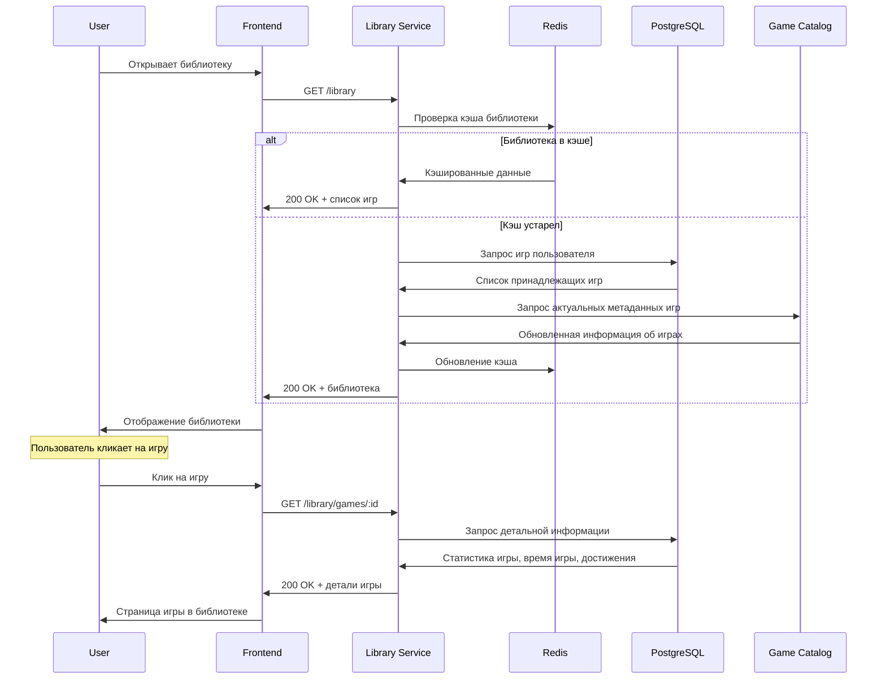
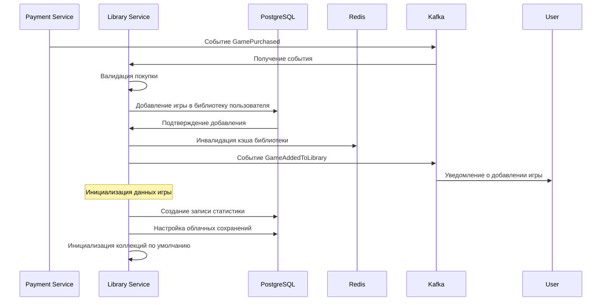
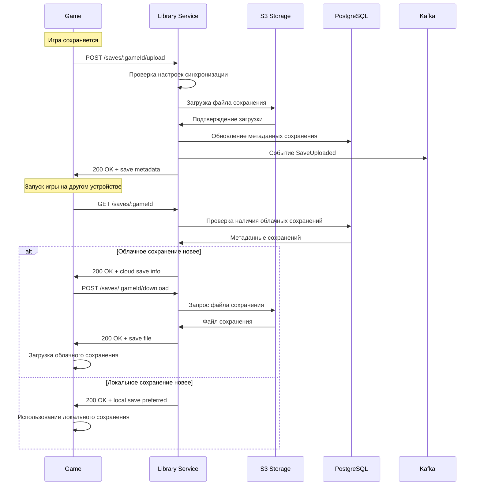
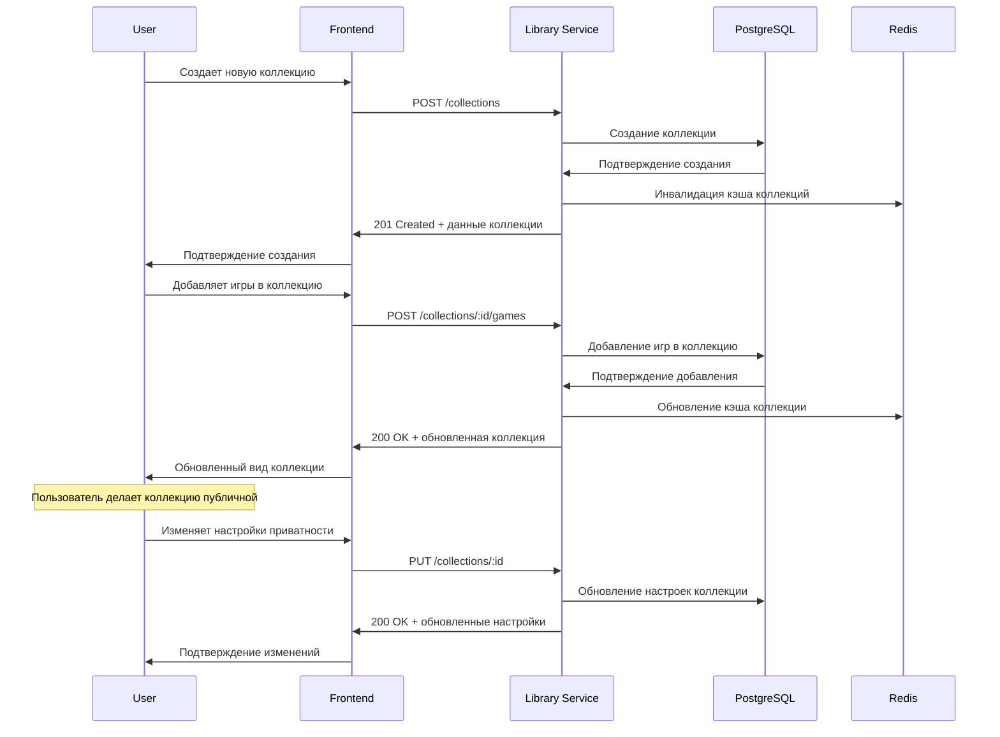

# Дизайн Library Service

## Обзор

Library Service управляет библиотеками игр пользователей российской игровой платформы. Сервис обеспечивает хранение информации о принадлежащих играх, управление коллекциями, синхронизацию облачных сохранений, статистику игрового времени и интеграцию с другими сервисами.

### Ключевые принципы дизайна

- **Быстрый доступ**: Загрузка библиотеки менее 300мс
- **Синхронизация**: Реальное время обновления между устройствами  
- **Масштабируемость**: Поддержка миллионов пользователей
- **Надежность**: Резервное копирование игровых сохранений
- **Персонализация**: ML-рекомендации на основе игровых привычек

## Архитектура

### Общая архитектура

```mermaid
graph TB
    subgraph "External Services"
        Steam[Steam API]
        CloudStorage[Облачное хранилище]
        ML[ML Recommendation Engine]
        GameLauncher[Game Launcher]
    end
    
    subgraph "API Gateway"
        Gateway[API Gateway]
    end
    
    subgraph "Library Service"
        API[REST API]
        LibraryManager[Library Manager]
        CollectionManager[Collection Manager]
        SaveManager[Save Manager]
        StatsManager[Stats Manager]
        Events[Event Publisher]
        
        API --> LibraryManager
        API --> CollectionManager
        API --> SaveManager
        API --> StatsManager
        LibraryManager --> Events
        SaveManager --> Events
        StatsManager --> Events
    end
    
    subgraph "Data Layer"
        PostgreSQL[(PostgreSQL)]
        Redis[(Redis Cache)]
        S3[S3 для сохранений]
        Kafka[Apache Kafka]
    end
    
    subgraph "Other Services"
        User[User Service]
        Payment[Payment Service]
        Catalog[Game Catalog]
        Achievement[Achievement Service]
        Social[Social Service]
    end
    
    Gateway --> API
    LibraryManager --> Steam
    SaveManager --> CloudStorage
    StatsManager --> ML
    LibraryManager --> GameLauncher
    
    API --> PostgreSQL
    API --> Redis
    SaveManager --> S3
    Events --> Kafka
    
    Kafka --> User
    Kafka --> Payment
    Kafka --> Catalog
    Kafka --> Achievement
    Kafka --> Social
```## API Энд
поинты и маршруты

### Структура API

```
Base URL: https://api.gaming-platform.ru/library-service/v1
```

### Library Management Endpoints

```typescript
// Основная библиотека
GET    /library                    // Получение библиотеки пользователя
GET    /library/games/:id          // Детальная информация об игре в библиотеке
PUT    /library/games/:id          // Обновление информации об игре
DELETE /library/games/:id          // Удаление игры из библиотеки (скрытие)

// Фильтрация и поиск
GET    /library/search             // Поиск игр в библиотеке
GET    /library/filter             // Фильтрация по жанрам, статусу
GET    /library/recent             // Недавно запущенные игры
GET    /library/favorites          // Избранные игры

// Коллекции
GET    /collections                // Список коллекций пользователя
POST   /collections                // Создание новой коллекции
GET    /collections/:id            // Игры в коллекции
PUT    /collections/:id            // Обновление коллекции
DELETE /collections/:id            // Удаление коллекции
POST   /collections/:id/games      // Добавление игры в коллекцию
DELETE /collections/:id/games/:gameId // Удаление игры из коллекции
```

### Game Statistics Endpoints

```typescript
// Статистика игрового времени
GET    /stats/playtime             // Общая статистика времени игры
GET    /stats/playtime/:gameId     // Время игры для конкретной игры
POST   /stats/playtime/:gameId     // Обновление времени игры
GET    /stats/activity             // Игровая активность по периодам

// Достижения и прогресс
GET    /stats/achievements         // Статистика достижений
GET    /stats/achievements/:gameId // Достижения в конкретной игре
GET    /stats/progress             // Общий прогресс по играм
```

### Cloud Saves Endpoints

```typescript
// Облачные сохранения
GET    /saves                      // Список игр с облачными сохранениями
GET    /saves/:gameId              // Сохранения конкретной игры
POST   /saves/:gameId/upload       // Загрузка сохранения в облако
POST   /saves/:gameId/download     // Скачивание сохранения из облака
DELETE /saves/:gameId              // Удаление облачных сохранений
POST   /saves/:gameId/sync         // Синхронизация сохранений

// Управление конфликтами
GET    /saves/:gameId/conflicts    // Конфликты сохранений
POST   /saves/:gameId/resolve      // Разрешение конфликта
```

### Installation Management Endpoints

```typescript
// Управление установками
GET    /installations              // Статус установок на всех устройствах
GET    /installations/:deviceId    // Установки на конкретном устройстве
POST   /installations/:gameId      // Отметка об установке игры
DELETE /installations/:gameId      // Отметка об удалении игры
PUT    /installations/:gameId/launch // Запуск игры
```

## User Flows (Пользовательские сценарии)

### 1. Просмотр библиотеки игр



### 2. Синхронизация облачных сохранений

```mermaid
sequenceDiagram
    participant G as Game
    participant L as Library Service
    participant S as S3 Storage
    participant P as PostgreSQL
    participant K as Kafka

    Note over G: Игра сохраняется
    G->>L: POST /saves/:gameId/upload
    L->>L: Проверка настроек синхронизации
    L->>S: Загрузка файла сохранения
    S->>L: Подтверждение загрузки
    L->>P: Обновление метаданных сохранения
    L->>K: Событие SaveUploaded
    L->>G: 200 OK + save metadata
    
    Note over G: Запуск игры на другом устройстве
    G->>L: GET /saves/:gameId
    L->>P: Проверка наличия облачных сохранений
    P->>L: Метаданные сохранений
    
    alt Облачное сохранение новее
        L->>G: 200 OK + cloud save info
        G->>L: POST /saves/:gameId/download
        L->>S: Запрос файла сохранения
        S->>L: Файл сохранения
        L->>G: 200 OK + save file
        G->>G: Загрузка облачного сохранения
    else Локальное сохранение новее
        L->>G: 200 OK + local save preferred
        G->>G: Использование локального сохранения
    end
```##
# 3. Добавление игры в библиотеку после покупки

```mermaid
sequenceDiagram
    participant P as Payment Service
    participant L as Library Service
    participant DB as PostgreSQL
    participant R as Redis
    participant K as Kafka
    participant U as User

    P->>K: Событие GamePurchased
    K->>L: Получение события
    L->>L: Валидация покупки
    L->>DB: Добавление игры в библиотеку пользователя
    DB->>L: Подтверждение добавления
    L->>R: Инвалидация кэша библиотеки
    L->>K: Событие GameAddedToLibrary
    K->>U: Уведомление о добавлении игры
    
    Note over L: Инициализация данных игры
    L->>DB: Создание записи статистики
    L->>DB: Настройка облачных сохранений
    L->>L: Инициализация коллекций по умолчанию
```

## Модели данных

### Основные сущности

```typescript
interface LibraryGame {
  id: string
  userId: string
  gameId: string
  
  // Метаданные игры (кэш из Catalog Service)
  title: string
  headerImage: string
  
  // Статус в библиотеке
  status: 'owned' | 'hidden' | 'refunded'
  addedAt: Date
  lastPlayedAt?: Date
  
  // Статистика
  totalPlaytime: number // в минутах
  sessionsCount: number
  
  // Установки
  installations: GameInstallation[]
  
  // Настройки
  cloudSavesEnabled: boolean
  notificationsEnabled: boolean
  
  // Пользовательские данные
  userRating?: number
  userTags: string[]
  notes?: string
  
  createdAt: Date
  updatedAt: Date
}

interface Collection {
  id: string
  userId: string
  name: string
  description?: string
  color: string
  icon?: string
  
  // Настройки
  isPublic: boolean
  sortOrder: number
  
  // Игры в коллекции
  games: CollectionGame[]
  
  createdAt: Date
  updatedAt: Date
}

interface GameSession {
  id: string
  userId: string
  gameId: string
  
  // Сессия
  startedAt: Date
  endedAt?: Date
  duration: number // в минутах
  
  // Устройство
  deviceId: string
  deviceType: string
  
  // Достижения за сессию
  achievementsUnlocked: string[]
  
  createdAt: Date
}

interface CloudSave {
  id: string
  userId: string
  gameId: string
  
  // Файл сохранения
  fileName: string
  fileSize: number
  fileHash: string
  s3Key: string
  
  // Метаданные
  gameVersion: string
  saveSlot: number
  description?: string
  
  // Синхронизация
  uploadedAt: Date
  lastSyncAt: Date
  syncStatus: 'synced' | 'conflict' | 'error'
  
  // Устройство
  deviceId: string
  deviceName: string
  
  createdAt: Date
}

interface GameInstallation {
  id: string
  userId: string
  gameId: string
  deviceId: string
  
  // Статус установки
  status: 'installed' | 'uninstalled' | 'installing' | 'updating'
  installPath?: string
  installSize?: number
  
  // Версия
  gameVersion: string
  lastLaunchedAt?: Date
  
  createdAt: Date
  updatedAt: Date
}
```

## Детальная схема базы данных

```sql
-- Игры в библиотеке пользователей
CREATE TABLE library_games (
    id UUID PRIMARY KEY DEFAULT gen_random_uuid(),
    user_id UUID NOT NULL,
    game_id VARCHAR(255) NOT NULL,
    
    -- Кэшированные метаданные игры
    title VARCHAR(255) NOT NULL,
    header_image VARCHAR(500),
    
    -- Статус в библиотеке
    status VARCHAR(20) DEFAULT 'owned' CHECK (status IN ('owned', 'hidden', 'refunded')),
    added_at TIMESTAMP DEFAULT NOW(),
    last_played_at TIMESTAMP,
    
    -- Статистика
    total_playtime INTEGER DEFAULT 0, -- в минутах
    sessions_count INTEGER DEFAULT 0,
    
    -- Настройки
    cloud_saves_enabled BOOLEAN DEFAULT TRUE,
    notifications_enabled BOOLEAN DEFAULT TRUE,
    
    -- Пользовательские данные
    user_rating INTEGER CHECK (user_rating >= 1 AND user_rating <= 5),
    user_tags TEXT[] DEFAULT '{}',
    notes TEXT,
    
    created_at TIMESTAMP DEFAULT NOW(),
    updated_at TIMESTAMP DEFAULT NOW(),
    
    UNIQUE(user_id, game_id)
);

-- Коллекции игр
CREATE TABLE collections (
    id UUID PRIMARY KEY DEFAULT gen_random_uuid(),
    user_id UUID NOT NULL,
    name VARCHAR(100) NOT NULL,
    description TEXT,
    color VARCHAR(7) DEFAULT '#007bff',
    icon VARCHAR(50),
    
    -- Настройки
    is_public BOOLEAN DEFAULT FALSE,
    sort_order INTEGER DEFAULT 0,
    
    created_at TIMESTAMP DEFAULT NOW(),
    updated_at TIMESTAMP DEFAULT NOW(),
    
    UNIQUE(user_id, name)
);

-- Игры в коллекциях
CREATE TABLE collection_games (
    id UUID PRIMARY KEY DEFAULT gen_random_uuid(),
    collection_id UUID NOT NULL REFERENCES collections(id) ON DELETE CASCADE,
    library_game_id UUID NOT NULL REFERENCES library_games(id) ON DELETE CASCADE,
    sort_order INTEGER DEFAULT 0,
    added_at TIMESTAMP DEFAULT NOW(),
    
    UNIQUE(collection_id, library_game_id)
);

-- Игровые сессии
CREATE TABLE game_sessions (
    id UUID PRIMARY KEY DEFAULT gen_random_uuid(),
    user_id UUID NOT NULL,
    game_id VARCHAR(255) NOT NULL,
    
    -- Сессия
    started_at TIMESTAMP DEFAULT NOW(),
    ended_at TIMESTAMP,
    duration INTEGER DEFAULT 0, -- в минутах
    
    -- Устройство
    device_id VARCHAR(255) NOT NULL,
    device_type VARCHAR(50) NOT NULL,
    device_name VARCHAR(100),
    
    -- Достижения за сессию
    achievements_unlocked TEXT[] DEFAULT '{}',
    
    created_at TIMESTAMP DEFAULT NOW()
);

-- Облачные сохранения
CREATE TABLE cloud_saves (
    id UUID PRIMARY KEY DEFAULT gen_random_uuid(),
    user_id UUID NOT NULL,
    game_id VARCHAR(255) NOT NULL,
    
    -- Файл сохранения
    file_name VARCHAR(255) NOT NULL,
    file_size BIGINT NOT NULL,
    file_hash VARCHAR(64) NOT NULL,
    s3_key VARCHAR(500) NOT NULL,
    
    -- Метаданные
    game_version VARCHAR(50),
    save_slot INTEGER DEFAULT 0,
    description TEXT,
    
    -- Синхронизация
    uploaded_at TIMESTAMP DEFAULT NOW(),
    last_sync_at TIMESTAMP DEFAULT NOW(),
    sync_status VARCHAR(20) DEFAULT 'synced' CHECK (sync_status IN ('synced', 'conflict', 'error')),
    
    -- Устройство
    device_id VARCHAR(255) NOT NULL,
    device_name VARCHAR(100),
    
    created_at TIMESTAMP DEFAULT NOW(),
    
    UNIQUE(user_id, game_id, save_slot, device_id)
);

-- Установки игр на устройствах
CREATE TABLE game_installations (
    id UUID PRIMARY KEY DEFAULT gen_random_uuid(),
    user_id UUID NOT NULL,
    game_id VARCHAR(255) NOT NULL,
    device_id VARCHAR(255) NOT NULL,
    
    -- Статус установки
    status VARCHAR(20) DEFAULT 'installed' CHECK (status IN ('installed', 'uninstalled', 'installing', 'updating')),
    install_path TEXT,
    install_size BIGINT,
    
    -- Версия
    game_version VARCHAR(50),
    last_launched_at TIMESTAMP,
    
    created_at TIMESTAMP DEFAULT NOW(),
    updated_at TIMESTAMP DEFAULT NOW(),
    
    UNIQUE(user_id, game_id, device_id)
);

-- Статистика игрового времени по дням
CREATE TABLE daily_playtime_stats (
    id UUID PRIMARY KEY DEFAULT gen_random_uuid(),
    user_id UUID NOT NULL,
    game_id VARCHAR(255) NOT NULL,
    date DATE NOT NULL,
    playtime_minutes INTEGER DEFAULT 0,
    sessions_count INTEGER DEFAULT 0,
    
    UNIQUE(user_id, game_id, date)
);

-- Рекомендации для пользователей
CREATE TABLE user_recommendations (
    id UUID PRIMARY KEY DEFAULT gen_random_uuid(),
    user_id UUID NOT NULL,
    game_id VARCHAR(255) NOT NULL,
    
    -- Рекомендация
    score DECIMAL(3,2) NOT NULL, -- 0.00 - 1.00
    reason VARCHAR(100) NOT NULL, -- 'similar_games', 'genre_preference', 'friend_recommendation'
    
    -- Статус
    status VARCHAR(20) DEFAULT 'active' CHECK (status IN ('active', 'dismissed', 'purchased')),
    
    -- Метаданные
    generated_at TIMESTAMP DEFAULT NOW(),
    expires_at TIMESTAMP,
    
    UNIQUE(user_id, game_id)
);

-- Индексы для производительности
CREATE INDEX idx_library_games_user ON library_games(user_id, status) WHERE status = 'owned';
CREATE INDEX idx_library_games_last_played ON library_games(user_id, last_played_at DESC) WHERE last_played_at IS NOT NULL;
CREATE INDEX idx_library_games_playtime ON library_games(user_id, total_playtime DESC);

CREATE INDEX idx_collections_user ON collections(user_id, sort_order);

CREATE INDEX idx_collection_games_collection ON collection_games(collection_id, sort_order);

CREATE INDEX idx_game_sessions_user_game ON game_sessions(user_id, game_id, started_at DESC);
CREATE INDEX idx_game_sessions_device ON game_sessions(device_id, started_at DESC);

CREATE INDEX idx_cloud_saves_user_game ON cloud_saves(user_id, game_id, uploaded_at DESC);
CREATE INDEX idx_cloud_saves_sync_status ON cloud_saves(sync_status, last_sync_at) WHERE sync_status != 'synced';

CREATE INDEX idx_installations_user_device ON game_installations(user_id, device_id);
CREATE INDEX idx_installations_status ON game_installations(status, updated_at) WHERE status IN ('installing', 'updating');

CREATE INDEX idx_daily_stats_user_date ON daily_playtime_stats(user_id, date DESC);
CREATE INDEX idx_daily_stats_game_date ON daily_playtime_stats(game_id, date DESC);

CREATE INDEX idx_recommendations_user_score ON user_recommendations(user_id, score DESC) WHERE status = 'active';

-- Триггеры для автоматического обновления
CREATE OR REPLACE FUNCTION update_updated_at_column()
RETURNS TRIGGER AS $$
BEGIN
    NEW.updated_at = NOW();
    RETURN NEW;
END;
$$ language 'plpgsql';

CREATE TRIGGER update_library_games_updated_at BEFORE UPDATE ON library_games
    FOR EACH ROW EXECUTE FUNCTION update_updated_at_column();

CREATE TRIGGER update_collections_updated_at BEFORE UPDATE ON collections
    FOR EACH ROW EXECUTE FUNCTION update_updated_at_column();

CREATE TRIGGER update_installations_updated_at BEFORE UPDATE ON game_installations
    FOR EACH ROW EXECUTE FUNCTION update_updated_at_column();

-- Функция для обновления статистики при завершении сессии
CREATE OR REPLACE FUNCTION update_playtime_stats()
RETURNS TRIGGER AS $$
BEGIN
    IF NEW.ended_at IS NOT NULL AND OLD.ended_at IS NULL THEN
        -- Обновляем общую статистику игры в библиотеке
        UPDATE library_games 
        SET total_playtime = total_playtime + NEW.duration,
            sessions_count = sessions_count + 1,
            last_played_at = NEW.ended_at
        WHERE user_id = NEW.user_id AND game_id = NEW.game_id;
        
        -- Обновляем дневную статистику
        INSERT INTO daily_playtime_stats (user_id, game_id, date, playtime_minutes, sessions_count)
        VALUES (NEW.user_id, NEW.game_id, DATE(NEW.started_at), NEW.duration, 1)
        ON CONFLICT (user_id, game_id, date)
        DO UPDATE SET 
            playtime_minutes = daily_playtime_stats.playtime_minutes + NEW.duration,
            sessions_count = daily_playtime_stats.sessions_count + 1;
    END IF;
    
    RETURN NEW;
END;
$$ LANGUAGE plpgsql;

CREATE TRIGGER trigger_update_playtime_stats
    AFTER UPDATE ON game_sessions
    FOR EACH ROW EXECUTE FUNCTION update_playtime_stats();
```

## User Flows (Пользовательские сценарии)

### 1. Добавление игры в библиотеку после покупки



### 2. Синхронизация облачных сохранений



### 3. Управление коллекциями



### 4. Отслеживание игрового времени

```mermaid
sequenceDiagram
    participant G as Game Client
    participant L as Library Service
    participant P as PostgreSQL
    participant A as Analytics Service
    participant K as Kafka

    Note over G: Пользователь запускает игру
    G->>L: POST /sessions/start
    L->>P: Создание новой игровой сессии
    P->>L: ID сессии
    L->>G: 200 OK + session ID
    
    Note over G: Периодические обновления (каждые 5 минут)
    loop Во время игры
        G->>L: PUT /sessions/:id/heartbeat
        L->>P: Обновление времени последней активности
        L->>G: 200 OK
    end
    
    Note over G: Пользователь закрывает игру
    G->>L: POST /sessions/:id/end
    L->>P: Завершение сессии + расчет времени
    P->>L: Обновленная статистика
    L->>P: Обновление общего времени игры
    L->>K: Событие GameSessionEnded
    L->>G: 200 OK + session stats
    
    K->>A: Обновление аналитики игрового времени
```$
BEGIN
    NEW.updated_at = NOW();
    RETURN NEW;
END;
$$ language 'plpgsql';

CREATE TRIGGER update_library_games_updated_at BEFORE UPDATE ON library_games
    FOR EACH ROW EXECUTE FUNCTION update_updated_at_column();

CREATE TRIGGER update_collections_updated_at BEFORE UPDATE ON collections
    FOR EACH ROW EXECUTE FUNCTION update_updated_at_column();

CREATE TRIGGER update_installations_updated_at BEFORE UPDATE ON game_installations
    FOR EACH ROW EXECUTE FUNCTION update_updated_at_column();

-- Функция для обновления статистики при завершении сессии
CREATE OR REPLACE FUNCTION update_playtime_stats()
RETURNS TRIGGER AS $$
BEGIN
    IF NEW.ended_at IS NOT NULL AND OLD.ended_at IS NULL THEN
        -- Обновляем общую статистику в library_games
        UPDATE library_games 
        SET 
            total_playtime = total_playtime + NEW.duration,
            sessions_count = sessions_count + 1,
            last_played_at = NEW.ended_at
        WHERE user_id = NEW.user_id AND game_id = NEW.game_id;
        
        -- Обновляем дневную статистику
        INSERT INTO daily_playtime_stats (user_id, game_id, date, playtime_minutes, sessions_count)
        VALUES (NEW.user_id, NEW.game_id, DATE(NEW.started_at), NEW.duration, 1)
        ON CONFLICT (user_id, game_id, date)
        DO UPDATE SET 
            playtime_minutes = daily_playtime_stats.playtime_minutes + NEW.duration,
            sessions_count = daily_playtime_stats.sessions_count + 1;
    END IF;
    RETURN NEW;
END;
$$ LANGUAGE plpgsql;

CREATE TRIGGER trigger_update_playtime_stats
    AFTER UPDATE ON game_sessions
    FOR EACH ROW EXECUTE FUNCTION update_playtime_stats();

-- Функция для очистки старых данных
CREATE OR REPLACE FUNCTION cleanup_old_data()
RETURNS void AS $$
BEGIN
    -- Удаляем старые сессии (старше 2 лет)
    DELETE FROM game_sessions WHERE created_at < NOW() - INTERVAL '2 years';
    
    -- Удаляем просроченные рекомендации
    DELETE FROM user_recommendations WHERE expires_at < NOW();
    
    -- Удаляем старые облачные сохранения с ошибками (старше 30 дней)
    DELETE FROM cloud_saves 
    WHERE sync_status = 'error' AND created_at < NOW() - INTERVAL '30 days';
END;
$$ LANGUAGE plpgsql;
```

Этот дизайн обеспечивает эффективное управление библиотеками игр с поддержкой облачных сохранений, статистики и персонализации для Library Service российской игровой платформы.