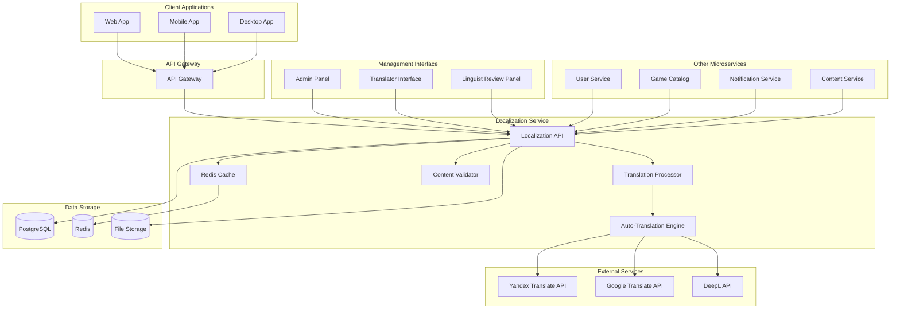
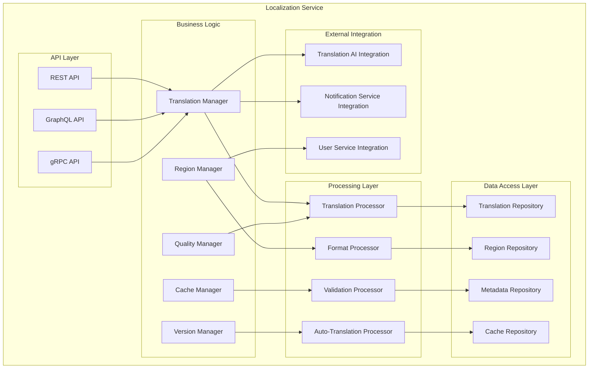

# Дизайн Localization Service

## Обзор

Localization Service - это критически важный микросервис российской Steam-платформы, обеспечивающий многоязычную поддержку, управление переводами, региональные настройки и адаптацию контента. Сервис построен на принципах высокой производительности, масштабируемости и простоты интеграции с другими микросервисами.

## Архитектура

### Высокоуровневая архитектура



### Компонентная архитектура



## Компоненты и интерфейсы

### 1. Translation Manager
**Назначение:** Центральный компонент для управления переводами

**Интерфейсы:**
```typescript
interface TranslationManager {
  getTranslation(key: string, language: string, context?: TranslationContext): Promise<Translation>
  getTranslations(keys: string[], language: string): Promise<Translation[]>
  setTranslation(key: string, language: string, value: string, metadata: TranslationMetadata): Promise<void>
  deleteTranslation(key: string, language: string): Promise<void>
  getAvailableLanguages(): Promise<Language[]>
  validateTranslation(translation: Translation): Promise<ValidationResult>
}

interface Translation {
  key: string
  language: string
  value: string
  context?: string
  metadata: TranslationMetadata
  version: number
  status: TranslationStatus
}

interface TranslationMetadata {
  author: string
  reviewer?: string
  createdAt: Date
  updatedAt: Date
  source: TranslationSource
  quality: QualityScore
}

enum TranslationStatus {
  DRAFT = 'draft',
  PENDING_REVIEW = 'pending_review',
  APPROVED = 'approved',
  REJECTED = 'rejected',
  PUBLISHED = 'published'
}
```

### 2. Region Manager
**Назначение:** Управление региональными настройками и форматированием

**Интерфейсы:**
```typescript
interface RegionManager {
  getRegionSettings(regionCode: string): Promise<RegionSettings>
  setRegionSettings(regionCode: string, settings: RegionSettings): Promise<void>
  formatCurrency(amount: number, regionCode: string): Promise<string>
  formatDate(date: Date, regionCode: string): Promise<string>
  formatTime(time: Date, regionCode: string): Promise<string>
  detectUserRegion(userContext: UserContext): Promise<string>
}

interface RegionSettings {
  regionCode: string
  language: string
  currency: string
  timezone: string
  dateFormat: string
  timeFormat: string
  numberFormat: NumberFormat
  culturalSettings: CulturalSettings
}

interface CulturalSettings {
  weekStartDay: number
  workingDays: number[]
  holidays: Holiday[]
  rtlSupport: boolean
}
```

### 3. Auto-Translation Processor
**Назначение:** Автоматический перевод контента с использованием внешних API

**Интерфейсы:**
```typescript
interface AutoTranslationProcessor {
  translateText(text: string, fromLang: string, toLang: string): Promise<AutoTranslation>
  translateBatch(texts: string[], fromLang: string, toLang: string): Promise<AutoTranslation[]>
  detectLanguage(text: string): Promise<LanguageDetection>
  getTranslationQuality(translation: AutoTranslation): Promise<QualityScore>
}

interface AutoTranslation {
  originalText: string
  translatedText: string
  confidence: number
  provider: TranslationProvider
  detectedLanguage?: string
  alternatives?: string[]
}

enum TranslationProvider {
  YANDEX = 'yandex',
  GOOGLE = 'google',
  DEEPL = 'deepl',
  INTERNAL = 'internal'
}
```

### 4. Quality Manager
**Назначение:** Контроль качества переводов и лингвистическая проверка

**Интерфейсы:**
```typescript
interface QualityManager {
  reviewTranslation(translationId: string, review: TranslationReview): Promise<void>
  getTranslationReviews(translationId: string): Promise<TranslationReview[]>
  calculateQualityScore(translation: Translation): Promise<QualityScore>
  flagTranslation(translationId: string, reason: string): Promise<void>
  getQualityMetrics(language: string, period: DateRange): Promise<QualityMetrics>
}

interface TranslationReview {
  reviewerId: string
  translationId: string
  score: number
  comments: string
  suggestions: string[]
  approved: boolean
  reviewedAt: Date
}

interface QualityScore {
  overall: number
  grammar: number
  accuracy: number
  fluency: number
  culturalAdaptation: number
}
```

### 5. Cache Manager
**Назначение:** Высокопроизводительное кэширование переводов

**Интерфейсы:**
```typescript
interface CacheManager {
  getFromCache(key: string): Promise<any>
  setCache(key: string, value: any, ttl?: number): Promise<void>
  invalidateCache(pattern: string): Promise<void>
  warmupCache(language: string): Promise<void>
  getCacheStats(): Promise<CacheStats>
}

interface CacheStats {
  hitRate: number
  missRate: number
  totalRequests: number
  cacheSize: number
  memoryUsage: number
}
```

## Модели данных

### Translation Schema
```sql
CREATE TABLE translations (
    id UUID PRIMARY KEY DEFAULT gen_random_uuid(),
    key VARCHAR(255) NOT NULL,
    language VARCHAR(10) NOT NULL,
    value TEXT NOT NULL,
    context TEXT,
    namespace VARCHAR(100) DEFAULT 'default',
    version INTEGER DEFAULT 1,
    status translation_status DEFAULT 'draft',
    metadata JSONB,
    created_at TIMESTAMP DEFAULT NOW(),
    updated_at TIMESTAMP DEFAULT NOW(),
    created_by UUID REFERENCES users(id),
    reviewed_by UUID REFERENCES users(id),
    
    UNIQUE(key, language, namespace)
);

CREATE INDEX idx_translations_key_lang ON translations(key, language);
CREATE INDEX idx_translations_namespace ON translations(namespace);
CREATE INDEX idx_translations_status ON translations(status);
```

### Region Settings Schema
```sql
CREATE TABLE region_settings (
    id UUID PRIMARY KEY DEFAULT gen_random_uuid(),
    region_code VARCHAR(10) UNIQUE NOT NULL,
    language VARCHAR(10) NOT NULL,
    currency VARCHAR(3) NOT NULL,
    timezone VARCHAR(50) NOT NULL,
    date_format VARCHAR(20) NOT NULL,
    time_format VARCHAR(20) NOT NULL,
    number_format JSONB NOT NULL,
    cultural_settings JSONB NOT NULL,
    created_at TIMESTAMP DEFAULT NOW(),
    updated_at TIMESTAMP DEFAULT NOW()
);
```

### Translation Reviews Schema
```sql
CREATE TABLE translation_reviews (
    id UUID PRIMARY KEY DEFAULT gen_random_uuid(),
    translation_id UUID REFERENCES translations(id),
    reviewer_id UUID REFERENCES users(id),
    score INTEGER CHECK (score >= 1 AND score <= 5),
    comments TEXT,
    suggestions TEXT[],
    approved BOOLEAN DEFAULT FALSE,
    reviewed_at TIMESTAMP DEFAULT NOW()
);
```

## Обработка ошибок

### Стратегия обработки ошибок
1. **Graceful Degradation**: При недоступности переводов возврат к базовому языку
2. **Circuit Breaker**: Защита от каскадных сбоев внешних API
3. **Retry Logic**: Экспоненциальная задержка для временных сбоев
4. **Fallback Mechanisms**: Кэшированные переводы при недоступности БД

### Типы ошибок
```typescript
enum LocalizationErrorType {
  TRANSLATION_NOT_FOUND = 'TRANSLATION_NOT_FOUND',
  LANGUAGE_NOT_SUPPORTED = 'LANGUAGE_NOT_SUPPORTED',
  INVALID_TRANSLATION_KEY = 'INVALID_TRANSLATION_KEY',
  TRANSLATION_SERVICE_UNAVAILABLE = 'TRANSLATION_SERVICE_UNAVAILABLE',
  CACHE_ERROR = 'CACHE_ERROR',
  VALIDATION_ERROR = 'VALIDATION_ERROR',
  PERMISSION_DENIED = 'PERMISSION_DENIED'
}

interface LocalizationError {
  type: LocalizationErrorType
  message: string
  details?: any
  fallbackValue?: string
}
```

## Стратегия тестирования

### Unit Tests
- Тестирование бизнес-логики компонентов
- Валидация форматирования региональных данных
- Проверка алгоритмов кэширования
- Тестирование обработки ошибок

### Integration Tests
- Интеграция с внешними API переводов
- Взаимодействие с базой данных
- Тестирование кэша Redis
- API endpoints тестирование

### Performance Tests
- Нагрузочное тестирование (10,000 RPS)
- Тестирование времени отклика (<10ms)
- Тестирование кэша под нагрузкой
- Memory leak тестирование

### E2E Tests
- Полный цикл перевода от создания до публикации
- Интеграция с другими микросервисами
- Тестирование пользовательских сценариев
- Региональные настройки end-to-end

## Безопасность

### Аутентификация и авторизация
- JWT токены для API доступа
- Role-based access control (RBAC)
- Разделение прав: переводчики, лингвисты, администраторы
- API rate limiting

### Защита данных
- Шифрование чувствительных переводов
- Аудит всех изменений переводов
- Защита от SQL injection
- Валидация входных данных

### Соответствие требованиям
- GDPR compliance для персональных данных
- 152-ФЗ соответствие для российских пользователей
- Логирование доступа к переводам
- Право на удаление данных

## Мониторинг и метрики

### Ключевые метрики
- Translation cache hit rate (>95%)
- API response time (<10ms)
- Translation quality scores
- Service availability (99.9%)
- Error rates по типам

### Алерты
- Cache miss rate >10%
- API response time >50ms
- External translation service failures
- Database connection issues
- Memory usage >80%

### Дашборды
- Real-time translation requests
- Quality metrics по языкам
- Regional usage statistics
- Performance metrics
- Error tracking

## Развертывание и масштабирование

### Containerization
```dockerfile
FROM node:18-alpine
WORKDIR /app
COPY package*.json ./
RUN npm ci --only=production
COPY . .
EXPOSE 3000
CMD ["npm", "start"]
```

### Kubernetes Configuration
```yaml
apiVersion: apps/v1
kind: Deployment
metadata:
  name: localization-service
spec:
  replicas: 3
  selector:
    matchLabels:
      app: localization-service
  template:
    metadata:
      labels:
        app: localization-service
    spec:
      containers:
      - name: localization-service
        image: localization-service:latest
        ports:
        - containerPort: 3000
        env:
        - name: DATABASE_URL
          valueFrom:
            secretKeyRef:
              name: db-secret
              key: url
        - name: REDIS_URL
          valueFrom:
            secretKeyRef:
              name: redis-secret
              key: url
        resources:
          requests:
            memory: "256Mi"
            cpu: "250m"
          limits:
            memory: "512Mi"
            cpu: "500m"
```

### Масштабирование
- Horizontal Pod Autoscaler на основе CPU/Memory
- Redis Cluster для кэша
- Read replicas для PostgreSQL
- CDN для статических переводов

## Интеграция с другими сервисами

### User Service
- Получение языковых предпочтений пользователя
- Определение региона пользователя
- Уведомления о смене языка

### Game Catalog Service
- Локализация названий и описаний игр
- Поддержка мультиязычных метаданных
- Фильтрация по поддерживаемым языкам

### Notification Service
- Локализация уведомлений
- Шаблоны уведомлений на разных языках
- Региональные настройки доставки

### Content Moderation Service
- Автоматический перевод для модерации
- Мультиязычная модерация контента
- Культурная адаптация правил модерации