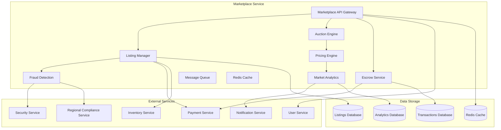

# Дизайн Marketplace Service

## Обзор

Marketplace Service является центральной торговой площадкой российской Steam платформы, обеспечивающей безопасную торговлю внутриигровыми предметами между игроками. Сервис включает систему лотов, аукционов, эскроу, антифрод защиту и интеграцию с российскими платежными системами.

## Архитектура

### Высокоуровневая архитектура



### Компонентная архитектура

#### Listing Manager
- Управление лотами и их жизненным циклом
- Валидация предметов и цен
- Интеграция с инвентарной системой
- Автоматическое снятие недоступных лотов

#### Auction Engine
- Управление аукционами и ставками
- Автоматическое завершение аукционов
- Система автоматических ставок
- Уведомления участников

#### Escrow Service
- Безопасное хранение средств и предметов
- Арбитраж спорных сделок
- Автоматическое завершение сделок
- Система гарантий

#### Fraud Detection
- Анализ подозрительных паттернов
- Машинное обучение для выявления мошенничества
- Интеграция с системами безопасности
- Автоматическая заморозка сделок

## Компоненты и интерфейсы

### 1. Marketplace API Gateway

```typescript
interface MarketplaceAPIGateway {
  // Управление лотами
  createListing(sellerId: string, item: MarketItem, price: number, duration: number): Promise<ListingResult>
  updateListing(listingId: string, updates: ListingUpdate): Promise<UpdateResult>
  cancelListing(listingId: string, sellerId: string): Promise<CancelResult>
  
  // Покупка предметов
  purchaseItem(buyerId: string, listingId: string): Promise<PurchaseResult>
  getListings(filters: MarketFilters, pagination: Pagination): Promise<ListingPage>
  
  // Аукционы
  createAuction(sellerId: string, item: MarketItem, startPrice: number, duration: number): Promise<AuctionResult>
  placeBid(bidderId: string, auctionId: string, amount: number): Promise<BidResult>
  
  // Аналитика
  getMarketAnalytics(itemId: string, period: TimePeriod): Promise<MarketAnalytics>
  getPriceHistory(itemId: string, period: TimePeriod): Promise<PriceHistory>
  
  // Пользовательские функции
  getWishlist(userId: string): Promise<WishlistItem[]>
  addToWishlist(userId: string, itemId: string, maxPrice?: number): Promise<WishlistResult>
}
```

### 2. Listing Manager

```typescript
interface ListingManager {
  // Управление лотами
  createListing(listing: CreateListingRequest): Promise<Listing>
  updateListingPrice(listingId: string, newPrice: number): Promise<UpdateResult>
  extendListing(listingId: string, additionalTime: number): Promise<ExtendResult>
  
  // Валидация
  validateItem(itemId: string, sellerId: string): Promise<ValidationResult>
  checkItemAvailability(itemId: string, sellerId: string): Promise<AvailabilityResult>
  
  // Поиск и фильтрация
  searchListings(query: SearchQuery): Promise<SearchResult>
  getListingsByCategory(category: ItemCategory, filters: CategoryFilters): Promise<CategoryResult>
  getFeaturedListings(): Promise<FeaturedListing[]>
  
  // Статистика
  getSellerStatistics(sellerId: string): Promise<SellerStats>
  getListingPerformance(listingId: string): Promise<ListingPerformance>
}
```

### 3. Auction Engine

```typescript
interface AuctionEngine {
  // Управление аукционами
  createAuction(auction: CreateAuctionRequest): Promise<Auction>
  placeBid(auctionId: string, bidderId: string, amount: number): Promise<BidResult>
  setAutoBid(auctionId: string, bidderId: string, maxAmount: number): Promise<AutoBidResult>
  
  // Завершение аукционов
  finalizeAuction(auctionId: string): Promise<AuctionFinalizationResult>
  processWinningBid(auctionId: string, winnerId: string): Promise<ProcessResult>
  
  // Мониторинг
  getActiveAuctions(filters: AuctionFilters): Promise<ActiveAuction[]>
  getAuctionHistory(auctionId: string): Promise<AuctionHistory>
  getBiddingHistory(userId: string): Promise<BiddingHistory>
}
```

### 4. Escrow Service

```typescript
interface EscrowService {
  // Управление эскроу
  createEscrowTransaction(transaction: EscrowTransactionRequest): Promise<EscrowTransaction>
  depositFunds(escrowId: string, amount: number, payerId: string): Promise<DepositResult>
  depositItem(escrowId: string, itemId: string, ownerId: string): Promise<ItemDepositResult>
  
  // Завершение сделок
  confirmDelivery(escrowId: string, buyerId: string): Promise<ConfirmationResult>
  releaseFunds(escrowId: string): Promise<ReleaseResult>
  releaseItem(escrowId: string): Promise<ItemReleaseResult>
  
  // Арбитраж
  initiateDispute(escrowId: string, initiatorId: string, reason: DisputeReason): Promise<DisputeResult>
  resolveDispute(disputeId: string, resolution: DisputeResolution): Promise<ResolutionResult>
  
  // Мониторинг
  getEscrowStatus(escrowId: string): Promise<EscrowStatus>
  getActiveEscrows(userId: string): Promise<ActiveEscrow[]>
}
```

### 5. Fraud Detection

```typescript
interface FraudDetection {
  // Анализ сделок
  analyzeListing(listing: Listing, sellerId: string): Promise<FraudAnalysis>
  analyzePurchase(purchase: Purchase, buyerId: string): Promise<PurchaseAnalysis>
  analyzeUserBehavior(userId: string, action: UserAction): Promise<BehaviorAnalysis>
  
  // Управление рисками
  calculateRiskScore(transaction: Transaction): Promise<RiskScore>
  flagSuspiciousActivity(userId: string, activity: SuspiciousActivity): Promise<FlagResult>
  
  // Машинное обучение
  trainFraudModel(trainingData: FraudTrainingData): Promise<ModelTrainingResult>
  updateFraudRules(rules: FraudRule[]): Promise<RuleUpdateResult>
  
  // Репутация
  updateUserReputation(userId: string, reputationChange: ReputationChange): Promise<ReputationResult>
  getUserRiskProfile(userId: string): Promise<RiskProfile>
}
```

## Модели данных

### Listing
```typescript
interface Listing {
  id: string
  sellerId: string
  itemId: string
  itemDetails: MarketItem
  price: number
  currency: string
  status: ListingStatus
  createdAt: Date
  expiresAt: Date
  views: number
  watchers: number
  category: ItemCategory
  tags: string[]
  description?: string
  images: string[]
  isPromoted: boolean
  promotionExpiresAt?: Date
}

enum ListingStatus {
  ACTIVE = 'active',
  SOLD = 'sold',
  CANCELLED = 'cancelled',
  EXPIRED = 'expired',
  SUSPENDED = 'suspended',
  PENDING_REVIEW = 'pending_review'
}

interface MarketItem {
  id: string
  gameId: string
  name: string
  description: string
  rarity: ItemRarity
  category: ItemCategory
  attributes: ItemAttribute[]
  imageUrl: string
  tradable: boolean
  marketable: boolean
}
```

### Auction
```typescript
interface Auction {
  id: string
  sellerId: string
  itemId: string
  itemDetails: MarketItem
  startPrice: number
  currentPrice: number
  buyoutPrice?: number
  currency: string
  status: AuctionStatus
  startTime: Date
  endTime: Date
  bids: Bid[]
  winnerId?: string
  watchers: number
}

interface Bid {
  id: string
  bidderId: string
  amount: number
  timestamp: Date
  isAutoBid: boolean
  maxAutoBidAmount?: number
}

enum AuctionStatus {
  SCHEDULED = 'scheduled',
  ACTIVE = 'active',
  ENDED = 'ended',
  COMPLETED = 'completed',
  CANCELLED = 'cancelled'
}
```

### Transaction
```typescript
interface Transaction {
  id: string
  type: TransactionType
  sellerId: string
  buyerId: string
  itemId: string
  amount: number
  currency: string
  commission: number
  tax: number
  status: TransactionStatus
  createdAt: Date
  completedAt?: Date
  escrowId?: string
  paymentId: string
  riskScore: number
  fraudFlags: FraudFlag[]
}

enum TransactionType {
  DIRECT_SALE = 'direct_sale',
  AUCTION_SALE = 'auction_sale',
  ESCROW_SALE = 'escrow_sale'
}

enum TransactionStatus {
  PENDING = 'pending',
  PROCESSING = 'processing',
  COMPLETED = 'completed',
  FAILED = 'failed',
  CANCELLED = 'cancelled',
  DISPUTED = 'disputed'
}
```

### Market Analytics
```typescript
interface MarketAnalytics {
  itemId: string
  period: TimePeriod
  averagePrice: number
  medianPrice: number
  minPrice: number
  maxPrice: number
  totalVolume: number
  totalTransactions: number
  priceChange: number
  priceChangePercent: number
  volatility: number
  trend: PriceTrend
  demandScore: number
  supplyScore: number
}

interface PriceHistory {
  itemId: string
  dataPoints: PriceDataPoint[]
  period: TimePeriod
}

interface PriceDataPoint {
  timestamp: Date
  price: number
  volume: number
  transactions: number
}
```

### User Reputation
```typescript
interface UserReputation {
  userId: string
  overallScore: number
  sellerScore: number
  buyerScore: number
  totalTransactions: number
  successfulTransactions: number
  disputesInitiated: number
  disputesWon: number
  averageResponseTime: number
  badges: ReputationBadge[]
  restrictions: ReputationRestriction[]
  lastUpdated: Date
}

interface ReputationBadge {
  type: BadgeType
  earnedAt: Date
  description: string
}

enum BadgeType {
  TRUSTED_SELLER = 'trusted_seller',
  POWER_TRADER = 'power_trader',
  QUICK_RESPONDER = 'quick_responder',
  FAIR_TRADER = 'fair_trader'
}
```

## Обработка ошибок

### Error Handling Strategy

```typescript
interface MarketplaceError {
  code: MarketplaceErrorCode
  message: string
  listingId?: string
  userId?: string
  transactionId?: string
  details?: any
  timestamp: Date
}

enum MarketplaceErrorCode {
  // Лоты
  ITEM_NOT_AVAILABLE = 'ITEM_NOT_AVAILABLE',
  ITEM_NOT_TRADABLE = 'ITEM_NOT_TRADABLE',
  INVALID_PRICE = 'INVALID_PRICE',
  LISTING_EXPIRED = 'LISTING_EXPIRED',
  
  // Покупки
  INSUFFICIENT_FUNDS = 'INSUFFICIENT_FUNDS',
  ITEM_ALREADY_SOLD = 'ITEM_ALREADY_SOLD',
  SELLER_BLOCKED = 'SELLER_BLOCKED',
  
  // Аукционы
  BID_TOO_LOW = 'BID_TOO_LOW',
  AUCTION_ENDED = 'AUCTION_ENDED',
  SELF_BIDDING = 'SELF_BIDDING',
  
  // Безопасность
  FRAUD_DETECTED = 'FRAUD_DETECTED',
  ACCOUNT_RESTRICTED = 'ACCOUNT_RESTRICTED',
  SUSPICIOUS_ACTIVITY = 'SUSPICIOUS_ACTIVITY',
  
  // Платежи
  PAYMENT_FAILED = 'PAYMENT_FAILED',
  ESCROW_TIMEOUT = 'ESCROW_TIMEOUT',
  DISPUTE_UNRESOLVED = 'DISPUTE_UNRESOLVED'
}
```

### Recovery Mechanisms
- Автоматическая отмена сделок при недоступности предметов
- Возврат средств при неудачных платежах
- Восстановление лотов после технических сбоев
- Компенсация пользователям при системных ошибках

## Стратегия тестирования

### Unit Tests
- Тестирование логики ценообразования
- Проверка алгоритмов антифрода
- Тестирование аукционных механизмов
- Валидация бизнес-правил

### Integration Tests
- Тестирование интеграции с платежными системами
- Проверка взаимодействия с инвентарной системой
- Тестирование уведомлений
- Проверка системы репутации

### End-to-End Tests
- Полный цикл создания и продажи лота
- Тестирование аукционов от создания до завершения
- Проверка эскроу сделок
- Тестирование арбитража споров

### Performance Tests
- Нагрузочное тестирование поиска
- Тестирование производительности аналитики
- Проверка масштабирования при высокой активности
- Стресс-тестирование аукционов

## Безопасность

### Fraud Prevention
- Машинное обучение для выявления мошенничества
- Анализ поведенческих паттернов
- Система репутации и доверия
- Автоматическая заморозка подозрительных сделок

### Financial Security
- Шифрование всех финансовых данных
- Двухфакторная аутентификация для крупных сделок
- Аудит всех финансовых операций
- Соответствие PCI DSS стандартам

### Data Protection
- Защита персональных данных пользователей
- Соблюдение GDPR и российского законодательства
- Анонимизация аналитических данных
- Безопасное хранение торговой истории

## Производительность и масштабируемость

### Caching Strategy
- Кэширование популярных лотов
- Кэширование результатов поиска
- Кэширование аналитических данных
- Кэширование пользовательских профилей

### Database Optimization
- Индексирование для быстрого поиска
- Партиционирование больших таблиц
- Архивирование старых данных
- Оптимизация запросов аналитики

### Horizontal Scaling
- Микросервисная архитектура
- Распределение нагрузки
- Асинхронная обработка
- Автоматическое масштабирование

## Соответствие российским требованиям

### Legal Compliance
- Соблюдение налогового законодательства
- Интеграция с системами валютного регулирования
- Соответствие требованиям ЦБ РФ
- Ведение документооборота согласно российским стандартам

### Data Localization
- Хранение данных на российских серверах
- Локализация платежных операций
- Соответствие требованиям по персональным данным
- Интеграция с российскими регуляторными системами