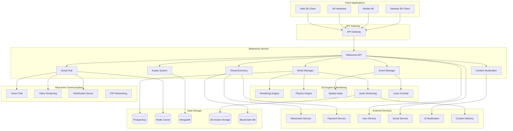

# Дизайн Metaverse Service

## Обзор

Metaverse Service - это микросервис для создания и управления виртуальными мирами и социальными пространствами российской Steam-платформы. Сервис обеспечивает иммерсивные 3D-среды для игровых выставок, социального взаимодействия, концертов, корпоративных встреч и образовательных мероприятий с поддержкой российской культуры и законодательства.

## Архитектура

### Высокоуровневая архитектура



## Компоненты и интерфейсы

### 1. World Manager
**Назначение:** Управление виртуальными мирами и пространствами

**Основные функции:**
- Создание и управление виртуальными мирами
- Инстансирование пространств для событий
- Управление виртуальной недвижимостью
- Система телепортации между мирами

**API Endpoints:**
```typescript
POST /api/v1/worlds - создание нового мира
GET /api/v1/worlds/{worldId} - получение информации о мире
PUT /api/v1/worlds/{worldId} - обновление мира
DELETE /api/v1/worlds/{worldId} - удаление мира
POST /api/v1/worlds/{worldId}/instances - создание инстанса мира
GET /api/v1/worlds/{worldId}/instances - список активных инстансов
```

### 2. Avatar System
**Назначение:** Управление 3D-аватарами пользователей

**Основные функции:**
- Создание и кастомизация аватаров
- Система анимаций и эмоций
- Синхронизация движений в реальном времени
- Персонализация внешнего вида

**API Endpoints:**
```typescript
POST /api/v1/avatars - создание аватара
GET /api/v1/avatars/{userId} - получение аватара пользователя
PUT /api/v1/avatars/{avatarId} - обновление аватара
POST /api/v1/avatars/{avatarId}/animations - управление анимациями
GET /api/v1/avatars/customization/items - доступные предметы кастомизации
```

### 3. Social Hub
**Назначение:** Социальные взаимодействия в метавселенной

**Основные функции:**
- Голосовой и текстовый чат
- Система друзей в 3D-пространстве
- Групповые активности
- Приватные виртуальные комнаты

**API Endpoints:**
```typescript
POST /api/v1/social/rooms - создание приватной комнаты
GET /api/v1/social/rooms/{roomId} - информация о комнате
POST /api/v1/social/rooms/{roomId}/invite - приглашение в комнату
GET /api/v1/social/friends/nearby - друзья поблизости в метавселенной
POST /api/v1/social/voice/channels - создание голосового канала
```

### 4. Event Manager
**Назначение:** Управление виртуальными событиями

**Основные функции:**
- Организация концертов и выставок
- Корпоративные мероприятия
- Образовательные события
- Система бронирования и билетов

**API Endpoints:**
```typescript
POST /api/v1/events - создание события
GET /api/v1/events - список предстоящих событий
POST /api/v1/events/{eventId}/register - регистрация на событие
GET /api/v1/events/{eventId}/attendees - список участников
POST /api/v1/events/{eventId}/stream - начало трансляции события
```

### 5. Virtual Economy
**Назначение:** Виртуальная экономика и NFT

**Основные функции:**
- Покупка/продажа виртуальной недвижимости
- NFT предметы и коллекционные карточки
- Виртуальная валюта
- Система аренды пространств

**API Endpoints:**
```typescript
POST /api/v1/economy/properties - покупка недвижимости
GET /api/v1/economy/properties/{userId} - недвижимость пользователя
POST /api/v1/economy/nft/mint - создание NFT предмета
GET /api/v1/economy/marketplace - виртуальный маркетплейс
POST /api/v1/economy/rent - аренда пространства
```

## Модели данных

### Virtual World
```typescript
interface VirtualWorld {
  id: string;
  name: string;
  description: string;
  type: 'exhibition' | 'social' | 'corporate' | 'educational' | 'concert';
  maxCapacity: number;
  currentUsers: number;
  owner: string;
  settings: {
    physics: boolean;
    voiceChat: boolean;
    allowBuilding: boolean;
    moderation: 'strict' | 'moderate' | 'relaxed';
  };
  assets: {
    environment: string;
    skybox: string;
    music?: string;
  };
  coordinates: {
    x: number;
    y: number;
    z: number;
  };
  createdAt: Date;
  updatedAt: Date;
}
```

### Avatar
```typescript
interface Avatar {
  id: string;
  userId: string;
  name: string;
  appearance: {
    body: string;
    face: string;
    hair: string;
    clothing: string[];
    accessories: string[];
  };
  animations: {
    idle: string;
    walk: string;
    run: string;
    dance: string[];
    gestures: string[];
  };
  position: {
    worldId: string;
    x: number;
    y: number;
    z: number;
    rotation: number;
  };
  status: 'online' | 'away' | 'busy' | 'invisible';
  createdAt: Date;
  updatedAt: Date;
}
```

### Virtual Event
```typescript
interface VirtualEvent {
  id: string;
  title: string;
  description: string;
  type: 'concert' | 'exhibition' | 'conference' | 'party' | 'educational';
  worldId: string;
  organizer: string;
  startTime: Date;
  endTime: Date;
  maxAttendees: number;
  currentAttendees: number;
  ticketPrice?: number;
  isPrivate: boolean;
  tags: string[];
  media: {
    poster: string;
    trailer?: string;
    screenshots: string[];
  };
  attendees: string[];
  createdAt: Date;
  updatedAt: Date;
}
```

### Virtual Property
```typescript
interface VirtualProperty {
  id: string;
  worldId: string;
  owner: string;
  type: 'land' | 'building' | 'room' | 'booth';
  coordinates: {
    x1: number;
    y1: number;
    z1: number;
    x2: number;
    y2: number;
    z2: number;
  };
  price: number;
  isForSale: boolean;
  isForRent: boolean;
  rentPrice?: number;
  nftTokenId?: string;
  customizations: {
    textures: string[];
    models: string[];
    lighting: any;
  };
  createdAt: Date;
  updatedAt: Date;
}
```

## Обработка ошибок

### Стандартные коды ошибок
- `WORLD_NOT_FOUND` - виртуальный мир не найден
- `WORLD_CAPACITY_EXCEEDED` - превышена вместимость мира
- `AVATAR_CREATION_FAILED` - ошибка создания аватара
- `EVENT_REGISTRATION_CLOSED` - регистрация на событие закрыта
- `INSUFFICIENT_VIRTUAL_CURRENCY` - недостаточно виртуальной валюты
- `PROPERTY_NOT_AVAILABLE` - недвижимость недоступна
- `MODERATION_VIOLATION` - нарушение правил модерации
- `VOICE_CHAT_UNAVAILABLE` - голосовой чат недоступен

### Обработка сетевых проблем
- Автоматическое переподключение при потере связи
- Кэширование состояния для офлайн-режима
- Graceful degradation при низкой пропускной способности
- Система приоритетов для критически важных данных

## Стратегия тестирования

### Unit тесты
- Тестирование логики создания миров
- Валидация данных аватаров
- Проверка экономических транзакций
- Тестирование системы модерации

### Integration тесты
- Взаимодействие с Blockchain Service
- Интеграция с Payment Service
- Синхронизация с User Service
- Тестирование real-time коммуникации

### Performance тесты
- Нагрузочное тестирование с 10000+ пользователей
- Тестирование производительности 3D-рендеринга
- Проверка масштабируемости событий
- Тестирование сетевой задержки

### VR/AR тесты
- Тестирование совместимости с VR-устройствами
- Проверка комфорта использования
- Тестирование motion sickness prevention
- Валидация пространственного аудио

## Безопасность

### Аутентификация и авторизация
- JWT токены для API доступа
- OAuth 2.0 интеграция с User Service
- Роли: пользователь, модератор, администратор, организатор событий
- Система разрешений для виртуальной недвижимости

### Защита данных
- Шифрование голосового трафика
- Защита 3D-ассетов от кражи
- Анонимизация пользовательских данных
- Соблюдение GDPR и российского 152-ФЗ

### Модерация контента
- AI-модерация 3D-контента в реальном времени
- Система жалоб и репортов
- Автоматическая блокировка неподходящего контента
- Человеческая модерация для сложных случаев

## Мониторинг и логирование

### Метрики производительности
- FPS (кадры в секунду) для каждого клиента
- Задержка сети и качество соединения
- Использование ресурсов сервера
- Количество одновременных пользователей

### Бизнес-метрики
- Время, проведенное в метавселенной
- Популярность различных миров
- Конверсия виртуальных покупок
- Активность на событиях

### Логирование
- Все пользовательские действия в 3D-пространстве
- Экономические транзакции
- Модерационные действия
- Технические ошибки и исключения

## Развертывание и масштабирование

### Контейнеризация
- Docker контейнеры для всех компонентов
- Kubernetes для оркестрации
- Helm charts для управления конфигурацией
- Multi-stage builds для оптимизации

### Масштабирование
- Горизонтальное масштабирование серверов миров
- Auto-scaling на основе нагрузки
- CDN для 3D-ассетов
- Edge computing для снижения задержек

### Мониторинг
- Prometheus для сбора метрик
- Grafana для визуализации
- ELK stack для логирования
- Jaeger для distributed tracing

## Интеграция с российскими сервисами

### Культурная адаптация
- Поддержка российских праздников и традиций
- Интеграция с российскими социальными сетями
- Локализация на русский язык
- Российские архитектурные стили

### Соответствие законодательству
- Соблюдение закона о персональных данных
- Интеграция с российскими платежными системами
- Модерация согласно российским стандартам
- Хранение данных на территории РФ