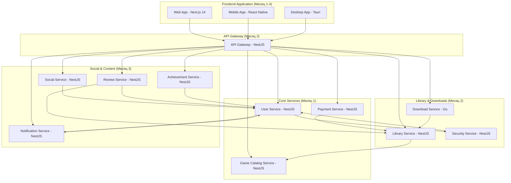

# Карта интеграций микросервисов - MVP российской игровой платформы

## Обзор

Данный документ описывает все интеграции между компонентами системы в рамках MVP (Месяцы 1-4) российской игровой платформы: **11 микросервисов + Frontend Application**. Все интеграции реализованы через REST API для упрощения разработки и отладки.

## Архитектура интеграций



## Детальная карта интеграций по сервисам

### 1. User Service (Месяц 1)

#### 📥 Входящие интеграции:
- **API Gateway** → User Service: Валидация JWT токенов
- **Social Service** → User Service: Получение данных пользователей, проверка существования
- **Review Service** → User Service: Проверка существования пользователя
- **Achievement Service** → User Service: Получение информации о пользователе
- **Security Service** → User Service: Проверка пользователя при событиях безопасности

#### 📤 Исходящие интеграции:
- **User Service** → Notification Service: Отправка welcome уведомлений
- **User Service** → Security Service: Логирование событий безопасности

#### API Endpoints:
```typescript
// Для API Gateway
GET /api/users/validate-token
Authorization: Bearer <jwt-token>

// Для Social Service
GET /api/users/batch?ids=uuid1,uuid2,uuid3
GET /api/users/:userId/exists

// Для Achievement Service
GET /api/users/:userId

// Для Security Service
GET /api/users/:userId/security-info
```

### 2. Game Catalog Service (Месяц 1)

#### 📥 Входящие интеграции:
- **API Gateway** → Game Catalog: Получение каталога игр
- **Library Service** → Game Catalog: Получение информации об играх
- **Review Service** → Game Catalog: Получение информации об играх для отзывов

#### 📤 Исходящие интеграции:
- НЕТ исходящих интеграций в MVP

#### API Endpoints:
```typescript
// Публичные endpoints
GET /api/games                    // Каталог игр с пагинацией
GET /api/games/:id               // Детальная информация об игре
GET /api/games/:id/images        // Изображения игры
GET /api/games/search            // Поиск игр
GET /api/games/search/suggestions // Автодополнение поиска

// Для других сервисов
GET /api/internal/games/batch?ids=uuid1,uuid2  // Информация о нескольких играх
GET /api/internal/games/:id/exists             // Проверка существования игры

// Мониторинг
GET /api/health                  // Health check
GET /api/metrics                 // Prometheus метрики
```

### 3. Payment Service (Месяц 1)

#### 📥 Входящие интеграции:
- **API Gateway** → Payment Service: Создание заказов и платежей

#### 📤 Исходящие интеграции:
- **Payment Service** → Library Service: Добавление игры в библиотеку после успешной покупки
- **Payment Service** → Notification Service: Уведомления о покупках
- **Payment Service** → Achievement Service: События покупок для достижений

#### API Endpoints:
```typescript
// Публичные endpoints
POST /api/orders                 // Создание заказа
GET /api/orders/:id             // Информация о заказе
POST /api/payments              // Создание платежа
GET /api/payments/:id           // Статус платежа

// Webhook endpoints
POST /api/payments/:id/confirm  // Подтверждение платежа
```

#### Исходящие вызовы:
```typescript
// К Library Service
POST /api/library/add
Body: {
  userId: string,
  gameId: string,
  orderId: string,
  purchasePrice: number,
  currency: string
}

// К Notification Service
POST /api/notifications
Body: {
  userId: string,
  type: 'purchase_success',
  title: 'Покупка завершена',
  message: 'Игра добавлена в вашу библиотеку'
}

// К Achievement Service
POST /api/achievements/progress/update
Body: {
  userId: string,
  eventType: 'game_purchase',
  eventData: { gameId: string, amount: number }
}
```

### 4. API Gateway (Месяц 2)

#### 📥 Входящие интеграции:
- **Frontend Applications** → API Gateway: Все клиентские запросы

#### 📤 Исходящие интеграции:
- **API Gateway** → User Service: Валидация токенов
- **API Gateway** → Game Catalog Service: Проксирование запросов каталога
- **API Gateway** → Payment Service: Проксирование платежных запросов
- **API Gateway** → Library Service: Проксирование запросов библиотеки
- **API Gateway** → Download Service: Проксирование запросов загрузок
- **API Gateway** → Social Service: Проксирование социальных запросов
- **API Gateway** → Review Service: Проксирование запросов отзывов
- **API Gateway** → Notification Service: Проксирование уведомлений
- **API Gateway** → Achievement Service: Проксирование достижений

#### Маршрутизация:
```typescript
// Маршруты к сервисам
/api/auth/*          → User Service
/api/users/*         → User Service
/api/games/*         → Game Catalog Service
/api/orders/*        → Payment Service
/api/payments/*      → Payment Service
/api/library/*       → Library Service
/api/downloads/*     → Download Service
/api/friends/*       → Social Service
/api/messages/*      → Social Service
/api/reviews/*       → Review Service
/api/notifications/* → Notification Service
/api/achievements/*  → Achievement Service
```

### 5. Library Service (Месяц 2)

#### 📥 Входящие интеграции:
- **API Gateway** → Library Service: Получение библиотеки пользователя
- **Payment Service** → Library Service: Добавление игр после покупки
- **Download Service** → Library Service: Проверка владения играми
- **Review Service** → Library Service: Проверка владения для создания отзывов

#### 📤 Исходящие интеграции:
- **Library Service** → Game Catalog Service: Получение информации об играх
- **Library Service** → User Service: Проверка существования пользователей

#### API Endpoints:
```typescript
// Публичные endpoints
GET /api/library/my              // Библиотека пользователя
GET /api/library/my/search       // Поиск в библиотеке
GET /api/library/ownership/:gameId // Проверка владения

// Для других сервисов
POST /api/library/add            // Добавить игру (от Payment Service)
GET /api/library/user/:userId/owns/:gameId // Проверка владения (от Review/Download)
```

#### Исходящие вызовы:
```typescript
// К Game Catalog Service
GET /api/internal/games/batch?ids=uuid1,uuid2
Response: { games: GameInfo[] }

GET /api/internal/games/:gameId/exists
Response: { exists: boolean }

// К User Service
GET /api/users/:userId/exists
Response: { exists: boolean }
```

### 6. Download Service (Месяц 2)

#### 📥 Входящие интеграции:
- **API Gateway** → Download Service: Управление загрузками

#### 📤 Исходящие интеграции:
- **Download Service** → Library Service: Проверка владения играми

#### API Endpoints:
```typescript
// Публичные endpoints
POST /api/downloads              // Начать загрузку
GET /api/downloads/:id          // Статус загрузки
PUT /api/downloads/:id/pause    // Приостановить
PUT /api/downloads/:id/resume   // Возобновить
```

#### Исходящие вызовы:
```typescript
// К Library Service
GET /api/library/user/:userId/owns/:gameId
Response: { owns: boolean, purchaseDate: Date }
```

### 7. Security Service (Месяц 2)

#### 📥 Входящие интеграции:
- **User Service** → Security Service: Логирование событий безопасности
- **API Gateway** → Security Service: Проверки безопасности (опционально)

#### 📤 Исходящие интеграции:
- **Security Service** → User Service: Проверка пользователей
- **Security Service** → Notification Service: Уведомления о безопасности

#### API Endpoints:
```typescript
// Для других сервисов
POST /api/security/report-event  // Логирование событий
POST /api/security/check-login   // Проверка входа
POST /api/security/check-transaction // Проверка транзакций
```

### 8. Social Service (Месяц 3)

#### 📥 Входящие интеграции:
- **API Gateway** → Social Service: Социальные функции

#### 📤 Исходящие интеграции:
- **Social Service** → User Service: Получение данных пользователей
- **Social Service** → Notification Service: Уведомления о социальных событиях
- **Social Service** → Achievement Service: События для достижений

#### API Endpoints:
```typescript
// Публичные endpoints
POST /api/friends/request        // Заявка в друзья
GET /api/friends                // Список друзей
POST /api/messages              // Отправить сообщение
GET /api/messages/conversations // Диалоги
PUT /api/status/online          // Установить статус
```

#### Исходящие вызовы:
```typescript
// К User Service
GET /api/users/batch?ids=uuid1,uuid2
GET /api/users/:userId/exists

// К Notification Service
POST /api/notifications
Body: {
  userId: string,
  type: 'friend_request',
  title: 'Новая заявка в друзья'
}

// К Achievement Service
POST /api/achievements/progress/update
Body: {
  userId: string,
  eventType: 'friend_added',
  eventData: { friendId: string }
}
```

### 9. Review Service (Месяц 3)

#### 📥 Входящие интеграции:
- **API Gateway** → Review Service: Управление отзывами

#### 📤 Исходящие интеграции:
- **Review Service** → User Service: Проверка существования пользователей
- **Review Service** → Library Service: Проверка владения играми
- **Review Service** → Game Catalog Service: Получение информации об играх
- **Review Service** → Achievement Service: События создания отзывов

#### API Endpoints:
```typescript
// Публичные endpoints
POST /api/reviews               // Создать отзыв
GET /api/reviews/game/:gameId   // Отзывы на игру
GET /api/ratings/game/:gameId   // Рейтинг игры
```

#### Исходящие вызовы:
```typescript
// К Library Service
GET /api/library/user/:userId/owns/:gameId
Response: { owns: boolean }

// К User Service
GET /api/users/:userId/exists
Response: { exists: boolean }

// К Achievement Service
POST /api/achievements/progress/update
Body: {
  userId: string,
  eventType: 'review_created',
  eventData: { gameId: string, rating: number }
}
```

### 10. Notification Service (Месяц 3)

#### 📥 Входящие интеграции:
- **API Gateway** → Notification Service: Управление уведомлениями
- **User Service** → Notification Service: Welcome уведомления
- **Payment Service** → Notification Service: Уведомления о покупках
- **Social Service** → Notification Service: Социальные уведомления
- **Security Service** → Notification Service: Уведомления о безопасности

#### 📤 Исходящие интеграции:
- **Notification Service** → User Service: Получение настроек пользователей

#### API Endpoints:
```typescript
// Публичные endpoints
GET /api/notifications/user/:userId    // Уведомления пользователя
POST /api/notifications               // Создать уведомление
PUT /api/notifications/:id/read       // Отметить как прочитанное
GET /api/notifications/settings/:userId // Настройки
```

### 11. Achievement Service (Месяц 3)

#### 📥 Входящие интеграции:
- **API Gateway** → Achievement Service: Управление достижениями
- **Payment Service** → Achievement Service: События покупок
- **Social Service** → Achievement Service: Социальные события
- **Review Service** → Achievement Service: События создания отзывов

#### 📤 Исходящие интеграции:
- **Achievement Service** → User Service: Получение информации о пользователях
- **Achievement Service** → Notification Service: Уведомления о достижениях

#### API Endpoints:
```typescript
// Публичные endpoints
GET /api/achievements                    // Все достижения
GET /api/achievements/user/:userId       // Достижения пользователя
POST /api/achievements/progress/update   // Обновить прогресс
```

### 12. Frontend Application (Месяцы 1-4)

#### 📥 Входящие интеграции:
- НЕТ входящих интеграций (Frontend - клиентское приложение)

#### 📤 Исходящие интеграции:
- **Frontend Application** → API Gateway: ВСЕ пользовательские запросы

#### Технологический стек:
- **Framework**: Next.js 14 + React 18 + TypeScript
- **State Management**: Zustand
- **Styling**: Tailwind CSS + CSS Modules
- **API Client**: Axios с TypeScript типизацией
- **Forms**: React Hook Form + Zod валидация

#### API Интеграции через API Gateway:
```typescript
// Аутентификация
POST /api/auth/register              // Регистрация
POST /api/auth/login                 // Вход в систему

// Каталог игр
GET /api/games                       // Каталог игр
GET /api/games/:id                   // Детали игры
GET /api/games/search                // Поиск игр

// Покупки
POST /api/orders                     // Создание заказа
POST /api/payments                   // Создание платежа

// Библиотека
GET /api/library/my                  // Моя библиотека
GET /api/library/my/search           // Поиск в библиотеке

// Загрузки
POST /api/downloads                  // Начать загрузку
GET /api/downloads/:id               // Статус загрузки

// Социальные функции
POST /api/friends/request            // Заявка в друзья
GET /api/friends                     // Список друзей
POST /api/messages                   // Отправить сообщение

// Отзывы
POST /api/reviews                    // Создать отзыв
GET /api/reviews/game/:gameId        // Отзывы на игру

// Уведомления
GET /api/notifications/user/:userId  // Мои уведомления
PUT /api/notifications/:id/read      // Отметить как прочитанное

// Достижения
GET /api/achievements                // Все достижения
GET /api/achievements/user/:userId   // Мои достижения
```

#### Структура приложения:
```typescript
// Next.js App Router структура
app/
├── (auth)/
│   ├── login/page.tsx              // Страница входа
│   └── register/page.tsx           // Страница регистрации
├── (dashboard)/
│   ├── library/page.tsx            // Библиотека игр
│   ├── profile/page.tsx            // Профиль пользователя
│   └── friends/page.tsx            // Друзья
├── games/
│   ├── page.tsx                    // Каталог игр
│   └── [id]/page.tsx              // Детали игры
├── store/                          // Zustand stores
├── components/                     // React компоненты
├── api/                           // API клиенты
└── types/                         // TypeScript типы
```

#### State Management (Zustand):
```typescript
// Основные stores
interface AuthStore {
  user: User | null;
  token: string | null;
  login: (credentials: LoginDto) => Promise<void>;
  logout: () => void;
}

interface GameStore {
  games: Game[];
  selectedGame: Game | null;
  fetchGames: () => Promise<void>;
  searchGames: (query: string) => Promise<void>;
}

interface LibraryStore {
  library: LibraryGame[];
  fetchLibrary: () => Promise<void>;
  checkOwnership: (gameId: string) => boolean;
}

interface SocialStore {
  friends: Friend[];
  conversations: Conversation[];
  fetchFriends: () => Promise<void>;
  sendMessage: (friendId: string, message: string) => Promise<void>;
}
```

## Последовательность разработки интеграций

### Месяц 1: Базовые сервисы
1. **User Service** - независимый, создать все endpoints для будущих интеграций
2. **Game Catalog Service** - независимый
3. **Payment Service** - создать HTTP клиенты с моками для Library/Notification

### Месяц 2: Инфраструктура
1. **API Gateway** - интегрировать с User Service для валидации токенов
2. **Library Service** - интегрировать с Payment Service и Game Catalog
3. **Download Service** - интегрировать с Library Service
4. **Security Service** - интегрировать с User Service

### Месяц 3: Социальные функции
1. **Social Service** - интегрировать с User Service и Notification
2. **Review Service** - интегрировать с User Service и Library Service
3. **Notification Service** - интегрировать с User Service
4. **Achievement Service** - интегрировать с User Service

### Месяцы 1-4: Frontend Application
1. **Месяц 1**: Базовые страницы (регистрация, вход, каталог игр)
2. **Месяц 2**: Библиотека, загрузки, профиль пользователя
3. **Месяц 3**: Социальные функции, отзывы, уведомления
4. **Месяц 4**: Достижения, полировка UI/UX

## Рекомендации по реализации

### 1. Создание HTTP клиентов
Каждый сервис должен иметь HTTP клиенты для внешних интеграций:

```typescript
// Пример структуры клиентов
src/
├── clients/
│   ├── user-service.client.ts
│   ├── notification-service.client.ts
│   ├── library-service.client.ts
│   └── game-catalog.client.ts
├── mocks/
│   └── external-services.mock.ts
└── interfaces/
    └── external-apis.interface.ts
```

### 2. Обработка ошибок интеграций
```typescript
// Пример обработки ошибок
async callExternalService(data: any): Promise<any> {
  try {
    return await this.httpClient.post('/api/endpoint', data);
  } catch (error) {
    if (error.status === 404) {
      // Обработка "не найдено"
      return null;
    }
    if (error.status >= 500) {
      // Логирование серверных ошибок
      this.logger.error('External service error', error);
    }
    // Не блокируем основную функциональность
    return this.getDefaultResponse();
  }
}
```

### 3. Конфигурация сервисов
```typescript
// environment variables
USER_SERVICE_URL=http://user-service:3001
GAME_CATALOG_SERVICE_URL=http://game-catalog-service:3002
PAYMENT_SERVICE_URL=http://payment-service:3003
LIBRARY_SERVICE_URL=http://library-service:3004
// ... и т.д.
```

### 4. Мониторинг интеграций
- Логирование всех внешних вызовов
- Метрики времени ответа
- Счетчики успешных/неуспешных запросов
- Health checks для всех зависимостей

## Статистика интеграций

### 📊 Полный состав системы:
- **11 микросервисов** (User, Game Catalog, Payment, API Gateway, Library, Download, Security, Social, Review, Notification, Achievement)
- **1 Frontend Application** (Next.js 14)
- **Всего компонентов**: 12

### 🔗 Интеграционная нагрузка:
- **User Service**: 5 входящих + 2 исходящие = 7 интеграций
- **API Gateway**: 0 входящих + 11 исходящих = 11 интеграций  
- **Frontend Application**: 0 входящих + 1 исходящая (к API Gateway) = 1 интеграция
- **Notification Service**: 5 входящих + 1 исходящая = 6 интеграций
- **Achievement Service**: 4 входящие + 2 исходящие = 6 интеграций

### 🎯 Критический путь разработки:
1. **User Service** → **API Gateway** → **Frontend Application**
2. Остальные сервисы могут разрабатываться параллельно

## Заключение

Данная карта интеграций **всех 12 компонентов системы** обеспечивает:
- **Четкое понимание** зависимостей между всеми компонентами
- **Последовательную разработку** без блокировок
- **Простоту отладки** через REST API
- **Готовность к масштабированию** в будущем
- **Полное покрытие** Frontend Application интеграций

Все интеграции спроектированы с учетом отказоустойчивости - сбой одного сервиса не должен полностью блокировать работу других компонентов системы.
