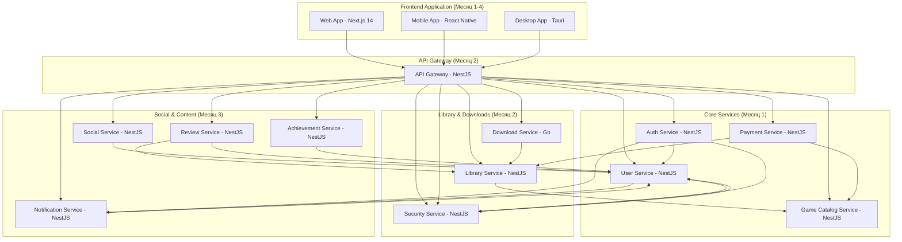

# Карта интеграций микросервисов - MVP российской игровой платформы

## Обзор

Данный документ описывает все интеграции между компонентами системы в рамках MVP (Месяцы 1-4) российской игровой платформы: **12 микросервисов + Frontend Application**. Все интеграции реализованы через REST API для упрощения разработки и отладки.

### Обновление архитектуры (декабрь 2025)
**Auth Service** был выделен из User Service для обеспечения принципа единственной ответственности:
- **Auth Service** - аутентификация, JWT токены, сессии
- **User Service** - управление данными пользователей, профили

## Архитектура интеграций



## Детальная карта интеграций по сервисам

### 1. Auth Service (Месяц 1) ✅ **PRODUCTION READY**

#### 🎉 Статус: ПОЛНОСТЬЮ ЗАВЕРШЕН (декабрь 2025)
- ✅ Выделен из User Service для принципа единственной ответственности
- ✅ Полная интеграция с User Service через Circuit Breaker
- ✅ Event-driven архитектура для неблокирующих операций
- ✅ Локальная база данных для сессий и токенов
- ✅ Production ready архитектура с resilience patterns

#### 📥 Входящие интеграции:
- **API Gateway** → Auth Service: Все запросы аутентификации
- **Все микросервисы** → Auth Service: Валидация JWT токенов

#### 📤 Исходящие интеграции:
- **Auth Service** → User Service: Создание пользователей, проверка существования
- **Auth Service** → Security Service: Логирование событий безопасности (async)
- **Auth Service** → Notification Service: Welcome уведомления (async)

#### API Endpoints:
```typescript
// ✅ РЕАЛИЗОВАННЫЕ ЭНДПОИНТЫ

// Аутентификация (AuthController)
POST /api/auth/register          // Регистрация пользователя
POST /api/auth/login             // Вход в систему  
POST /api/auth/logout            // Выход (черный список JWT в Redis)
POST /api/auth/refresh           // Обновление access token
POST /api/auth/validate          // Валидация JWT токенов (для других сервисов)

// Управление сессиями
GET /api/auth/sessions           // Список активных сессий пользователя
DELETE /api/auth/sessions/:id    // Завершение конкретной сессии
DELETE /api/auth/sessions/all    // Завершение всех сессий пользователя

// Мониторинг
GET /api/health                  // Health check
GET /api/metrics                 // Prometheus метрики
```

#### Исходящие вызовы:
```typescript
// К User Service (с Circuit Breaker)
POST /users                      // Создание пользователя при регистрации
GET /users/email/:email          // Поиск пользователя по email
GET /users/:id                   // Получение данных пользователя
PATCH /users/:id/last-login      // Обновление времени последнего входа
GET /users/:id/exists            // Проверка существования пользователя

// К Security Service (async events)
POST /api/security/events        // Логирование событий безопасности
Body: {
  userId: string,
  type: 'registration' | 'login' | 'logout' | 'failed_login',
  ipAddress: string,
  userAgent: string,
  metadata: any
}

// К Notification Service (async events)
POST /api/notifications/events   // Отправка уведомлений
Body: {
  userId: string,
  type: 'welcome' | 'security_alert',
  email: string,
  data: any
}
```

### 2. User Service (Месяц 1) ✅ **ОБНОВЛЕН ДЛЯ ИНТЕГРАЦИИ С AUTH SERVICE**

#### 🎉 Статус: ОБНОВЛЕН ДЛЯ ИНТЕГРАЦИИ С AUTH SERVICE (декабрь 2025)
- ✅ Аутентификация перенесена в Auth Service
- ✅ Фокус на управлении данными пользователей
- ✅ Новые internal endpoints для Auth Service
- ✅ Обновленная архитектура без JWT логики
- ✅ Production ready для интеграции с Auth Service

#### 📥 Входящие интеграции:
- **Auth Service** → User Service: Создание пользователей, проверка существования, обновление данных
- **API Gateway** → User Service: Управление профилями пользователей
- **Social Service** → User Service: Получение данных пользователей, проверка существования
- **Review Service** → User Service: Проверка существования пользователя
- **Achievement Service** → User Service: Получение информации о пользователе
- **Security Service** → User Service: Проверка пользователя при событиях безопасности

#### 📤 Исходящие интеграции:
- НЕТ исходящих интеграций (фокус на данных пользователей)

#### API Endpoints:
```typescript
// ✅ РЕАЛИЗОВАННЫЕ ЭНДПОИНТЫ (после миграции Auth Service)

// Управление профилями (UserController)
GET /api/users/profile           // Получение профиля (защищен через API Gateway)
PUT /api/users/profile           // Обновление профиля
DELETE /api/users/profile        // Удаление аккаунта

// Internal endpoints для Auth Service
POST /users                      // Создание пользователя (internal)
GET /users/email/:email          // Поиск по email (internal)
GET /users/:id                   // Получение пользователя по ID (internal)
PATCH /users/:id/last-login      // Обновление времени входа (internal)
GET /users/:id/exists            // Проверка существования (internal)

// Для других микросервисов
GET /api/users/batch?ids=uuid1,uuid2,uuid3  // Пакетное получение пользователей
GET /api/users/:userId/exists    // Проверка существования пользователя
GET /api/users/:userId           // Информация о пользователе
GET /api/users/:userId/security-info  // Информация для безопасности

// Мониторинг
GET /api/health                  // Health check
GET /api/metrics                 // Prometheus метрики

// ❌ УДАЛЕННЫЕ ЭНДПОИНТЫ (перенесены в Auth Service)
// POST /api/auth/register       // → Auth Service
// POST /api/auth/login          // → Auth Service
// POST /api/auth/logout         // → Auth Service
// GET /api/users/validate-token // → Auth Service
```

### 3. Game Catalog Service (Месяц 1) ✅ **ОБНОВЛЕН ДЛЯ MVP**

#### 📥 Входящие интеграции:
- **API Gateway** → Game Catalog: Получение каталога игр
- **Payment Service** → Game Catalog: Проверка доступности игр для покупки
- **Library Service** → Game Catalog: Получение информации об играх
- **Review Service** → Game Catalog: Получение информации об играх для отзывов

#### 📤 Исходящие интеграции:
- НЕТ исходящих интеграций в MVP

#### API Endpoints:
```typescript
// Публичные endpoints
GET /api/games                    // Каталог игр с пагинацией
GET /api/games/:id               // Детальная информация об игре
GET /api/games/:id/images        // Изображения игры
GET /api/games/search            // Поиск игр
GET /api/games/search/suggestions // Автодополнение поиска

// Для других сервисов
GET /api/internal/games/batch?ids=uuid1,uuid2  // Информация о нескольких играх
GET /api/internal/games/:id/exists             // Проверка существования игры
GET /api/games/:id/purchase-info              // Информация для покупки (Payment Service)

// Мониторинг
GET /api/health                  // Health check
GET /api/metrics                 // Prometheus метрики
```

### 4. Payment Service (Месяц 1) ✅ **ОБНОВЛЕН ДЛЯ MVP**

#### 📥 Входящие интеграции:
- **API Gateway** → Payment Service: Создание заказов и платежей

#### 📤 Исходящие интеграции:
- **Payment Service** → Library Service: Добавление игры в библиотеку после успешной покупки
- **Payment Service** → Game Catalog Service: Проверка доступности игр для покупки
- **Payment Service** → Notification Service: Уведомления о покупках
- **Payment Service** → Achievement Service: События покупок для достижений

#### API Endpoints:
```typescript
// Публичные endpoints
POST /api/orders                 // Создание заказа
GET /api/orders/:id             // Информация о заказе
POST /api/payments              // Создание платежа
GET /api/payments/:id           // Статус платежа

// Webhook endpoints
POST /api/payments/:id/confirm  // Подтверждение платежа
```

#### Исходящие вызовы:
```typescript
// К Game Catalog Service
GET /api/games/:gameId/purchase-info
Response: { 
  id: string, 
  title: string, 
  price: number, 
  currency: string, 
  available: boolean 
}

// К Library Service
POST /api/library/add
Body: {
  userId: string,
  gameId: string,
  orderId: string,
  purchasePrice: number,
  currency: string
}

// К Notification Service
POST /api/notifications
Body: {
  userId: string,
  type: 'purchase_success',
  title: 'Покупка завершена',
  message: 'Игра добавлена в вашу библиотеку'
}

// К Achievement Service
POST /api/achievements/progress/update
Body: {
  userId: string,
  eventType: 'game_purchase',
  eventData: { gameId: string, amount: number }
}
```

### 5. API Gateway (Месяц 2)

#### 📥 Входящие интеграции:
- **Frontend Applications** → API Gateway: Все клиентские запросы

#### 📤 Исходящие интеграции:
- **API Gateway** → Auth Service: Аутентификация и валидация токенов
- **API Gateway** → User Service: Управление профилями пользователей
- **API Gateway** → Game Catalog Service: Проксирование запросов каталога
- **API Gateway** → Payment Service: Проксирование платежных запросов
- **API Gateway** → Library Service: Проксирование запросов библиотеки
- **API Gateway** → Download Service: Проксирование запросов загрузок
- **API Gateway** → Social Service: Проксирование социальных запросов
- **API Gateway** → Review Service: Проксирование запросов отзывов
- **API Gateway** → Notification Service: Проксирование уведомлений
- **API Gateway** → Achievement Service: Проксирование достижений
- **API Gateway** → Security Service: Проксирование запросов безопасности

#### Маршрутизация:
```typescript
// Маршруты к сервисам (обновлено для Auth Service)
/api/auth/*          → Auth Service
/api/users/*         → User Service
/api/games/*         → Game Catalog Service
/api/orders/*        → Payment Service
/api/payments/*      → Payment Service
/api/library/*       → Library Service
/api/downloads/*     → Download Service
/api/security/*      → Security Service
/api/friends/*       → Social Service
/api/messages/*      → Social Service
/api/reviews/*       → Review Service
/api/notifications/* → Notification Service
/api/achievements/*  → Achievement Service
```

### 6. Library Service (Месяц 2)

#### 📥 Входящие интеграции:
- **API Gateway** → Library Service: Получение библиотеки пользователя
- **Payment Service** → Library Service: Добавление игр после покупки
- **Download Service** → Library Service: Проверка владения играми
- **Review Service** → Library Service: Проверка владения для создания отзывов

#### 📤 Исходящие интеграции:
- **Library Service** → Game Catalog Service: Получение информации об играх
- **Library Service** → User Service: Проверка существования пользователей

#### API Endpoints:
```typescript
// Публичные endpoints
GET /api/library/my              // Библиотека пользователя
GET /api/library/my/search       // Поиск в библиотеке
GET /api/library/ownership/:gameId // Проверка владения

// Для других сервисов
POST /api/library/add            // Добавить игру (от Payment Service)
GET /api/library/user/:userId/owns/:gameId // Проверка владения (от Review/Download)
```

#### Исходящие вызовы:
```typescript
// К Game Catalog Service
GET /api/internal/games/batch?ids=uuid1,uuid2
Response: { games: GameInfo[] }

GET /api/internal/games/:gameId/exists
Response: { exists: boolean }

// К User Service
GET /api/users/:userId/exists
Response: { exists: boolean }
```

### 6. Download Service (Месяц 2) ✅ **ОБНОВЛЕН ДЛЯ MVP**

#### 📥 Входящие интеграции:
- **API Gateway** → Download Service: Управление загрузками

#### 📤 Исходящие интеграции:
- **Download Service** → Library Service: Проверка владения играми

#### API Endpoints:
```typescript
// Публичные endpoints
POST /api/downloads              // Начать загрузку
GET /api/downloads/:id          // Статус загрузки
PUT /api/downloads/:id/pause    // Приостановить
PUT /api/downloads/:id/resume   // Возобновить
GET /api/downloads/user/:userId // Список загрузок пользователя
```

#### Исходящие вызовы:
```typescript
// К Library Service
GET /api/library/user/:userId/owns/:gameId
Response: { owns: boolean, purchaseDate: Date }
```

### 7. Security Service (Месяц 2) ✅ **ОБНОВЛЕН ДЛЯ MVP**

#### 📥 Входящие интеграции:
- **User Service** → Security Service: Логирование событий безопасности
- **Payment Service** → Security Service: Проверка безопасности транзакций
- **API Gateway** → Security Service: Проверки безопасности и блокировка IP

#### 📤 Исходящие интеграции:
- **Security Service** → User Service: Проверка пользователей
- **Security Service** → Notification Service: Уведомления о безопасности

#### API Endpoints:
```typescript
// Для других сервисов
POST /api/security/report-event      // Логирование событий
POST /api/security/check-login       // Проверка входа
POST /api/security/check-transaction // Проверка транзакций
POST /api/security/block-ip          // Блокировка IP адреса
GET /api/security/ip-status/:ip      // Проверка статуса IP

// Административные endpoints
GET /api/security/logs               // Логи безопасности
GET /api/security/alerts             // Алерты безопасности
PUT /api/security/alerts/:id/resolve // Разрешить алерт
```

### 8. Social Service (Месяц 3)

#### 📥 Входящие интеграции:
- **API Gateway** → Social Service: Социальные функции

#### 📤 Исходящие интеграции:
- **Social Service** → User Service: Получение данных пользователей
- **Social Service** → Notification Service: Уведомления о социальных событиях
- **Social Service** → Achievement Service: События для достижений

#### API Endpoints:
```typescript
// Публичные endpoints
POST /api/friends/request        // Заявка в друзья
GET /api/friends                // Список друзей
POST /api/messages              // Отправить сообщение
GET /api/messages/conversations // Диалоги
PUT /api/status/online          // Установить статус
```

#### Исходящие вызовы:
```typescript
// К User Service
GET /api/users/batch?ids=uuid1,uuid2
Response: { users: UserInfo[] }

GET /api/users/:userId/exists
Response: { exists: boolean }

// К Notification Service
POST /api/notifications
Body: {
  userId: string,
  type: 'friend_request',
  title: 'Новая заявка в друзья',
  message: 'У вас новая заявка в друзья от пользователя',
  channels: ['in_app', 'email']
}

// К Achievement Service
POST /api/achievements/progress/update
Body: {
  userId: string,
  eventType: 'friend_added',
  eventData: { friendId: string }
}
```

### 9. Review Service (Месяц 3)

#### 📥 Входящие интеграции:
- **API Gateway** → Review Service: Управление отзывами

#### 📤 Исходящие интеграции:
- **Review Service** → User Service: Проверка существования пользователей
- **Review Service** → Library Service: Проверка владения играми
- **Review Service** → Game Catalog Service: Получение информации об играх
- **Review Service** → Achievement Service: События создания отзывов

#### API Endpoints:
```typescript
// Публичные endpoints
POST /api/reviews               // Создать отзыв
GET /api/reviews/game/:gameId   // Отзывы на игру
GET /api/ratings/game/:gameId   // Рейтинг игры
```

#### Исходящие вызовы:
```typescript
// К Library Service
GET /api/library/user/:userId/owns/:gameId
Response: { owns: boolean, purchaseDate: Date }

// К User Service
GET /api/users/:userId/exists
Response: { exists: boolean }

// К Game Catalog Service
GET /api/internal/games/:gameId/exists
Response: { exists: boolean }

// К Achievement Service
POST /api/achievements/progress/update
Body: {
  userId: string,
  eventType: 'review_created',
  eventData: { gameId: string, rating: number }
}

// К Notification Service
POST /api/notifications
Body: {
  userId: string,
  type: 'review_published',
  title: 'Отзыв опубликован',
  message: 'Ваш отзыв на игру успешно опубликован'
}
```

### 10. Notification Service (Месяц 3)

#### 📥 Входящие интеграции:
- **API Gateway** → Notification Service: Управление уведомлениями
- **User Service** → Notification Service: Welcome уведомления
- **Payment Service** → Notification Service: Уведомления о покупках
- **Social Service** → Notification Service: Социальные уведомления
- **Security Service** → Notification Service: Уведомления о безопасности

#### 📤 Исходящие интеграции:
- **Notification Service** → User Service: Получение настроек пользователей

#### API Endpoints:
```typescript
// Публичные endpoints
GET /api/notifications/user/:userId    // Уведомления пользователя
POST /api/notifications               // Создать уведомление
PUT /api/notifications/:id/read       // Отметить как прочитанное
GET /api/notifications/settings/:userId // Настройки уведомлений
PUT /api/notifications/settings/:userId // Обновить настройки

// Webhook endpoints для интеграций
POST /api/notifications/webhook/payment    // От Payment Service
POST /api/notifications/webhook/social     // От Social Service
POST /api/notifications/webhook/achievement // От Achievement Service
POST /api/notifications/webhook/review     // От Review Service
POST /api/notifications/webhook/security   // От Security Service
```

#### Исходящие вызовы:
```typescript
// К User Service
GET /api/users/:userId/exists
Response: { exists: boolean }

GET /api/users/:userId
Response: { id: string, email: string, name: string, preferences: any }

// К внешним email провайдерам (российские)
POST https://api.mail.ru/email/send
POST https://api.yandex.ru/mail/send
Body: {
  to: string,
  subject: string,
  html: string,
  from: string
}
```

### 11. Achievement Service (Месяц 3)

#### 📥 Входящие интеграции:
- **API Gateway** → Achievement Service: Управление достижениями
- **Payment Service** → Achievement Service: События покупок
- **Social Service** → Achievement Service: Социальные события
- **Review Service** → Achievement Service: События создания отзывов

#### 📤 Исходящие интеграции:
- **Achievement Service** → User Service: Получение информации о пользователях
- **Achievement Service** → Notification Service: Уведомления о достижениях

#### API Endpoints:
```typescript
// Публичные endpoints
GET /api/achievements                    // Все достижения
GET /api/achievements/user/:userId       // Достижения пользователя
GET /api/achievements/progress/:userId   // Прогресс пользователя
POST /api/achievements/unlock           // Разблокировать достижение

// Для интеграций с другими сервисами
POST /api/achievements/progress/update   // Обновить прогресс (от других сервисов)
GET /api/achievements/user/:userId/friends // Список друзей для Social Service
```

#### Исходящие вызовы:
```typescript
// К User Service
GET /api/users/:userId/exists
Response: { exists: boolean }

GET /api/users/:userId
Response: { id: string, name: string, registrationDate: Date }

// К Notification Service
POST /api/notifications
Body: {
  userId: string,
  type: 'achievement_unlocked',
  title: 'Достижение разблокировано!',
  message: 'Поздравляем! Вы получили достижение "{achievementName}"',
  metadata: { achievementId: string, points: number }
}

// К Social Service (для проверки друзей)
GET /api/friends/user/:userId/count
Response: { count: number }

// К Payment Service (для проверки покупок)
GET /api/orders/user/:userId/count
Response: { count: number }

// К Review Service (для проверки отзывов)
GET /api/reviews/user/:userId/count
Response: { count: number }
```

### 12. Frontend Application (Месяцы 1-4)

#### 📥 Входящие интеграции:
- НЕТ входящих интеграций (Frontend - клиентское приложение)

#### 📤 Исходящие интеграции:
- **Frontend Application** → API Gateway: ВСЕ пользовательские запросы

#### Технологический стек:
- **Framework**: Next.js 14 + React 18 + TypeScript
- **State Management**: Zustand
- **Styling**: Tailwind CSS + CSS Modules
- **API Client**: Axios с TypeScript типизацией
- **Forms**: React Hook Form + Zod валидация

#### API Интеграции через API Gateway:
```typescript
// Аутентификация
POST /api/auth/register              // Регистрация
POST /api/auth/login                 // Вход в систему

// Каталог игр
GET /api/games                       // Каталог игр
GET /api/games/:id                   // Детали игры
GET /api/games/search                // Поиск игр

// Покупки
POST /api/orders                     // Создание заказа
POST /api/payments                   // Создание платежа

// Библиотека
GET /api/library/my                  // Моя библиотека
GET /api/library/my/search           // Поиск в библиотеке

// Загрузки
POST /api/downloads                  // Начать загрузку
GET /api/downloads/:id               // Статус загрузки
GET /api/downloads/user/:userId      // Список загрузок

// Безопасность
GET /api/security/logs               // Логи безопасности (админ)
GET /api/security/alerts             // Алерты безопасности (админ)

// Социальные функции
POST /api/friends/request            // Заявка в друзья
GET /api/friends                     // Список друзей
POST /api/messages                   // Отправить сообщение

// Отзывы
POST /api/reviews                    // Создать отзыв
GET /api/reviews/game/:gameId        // Отзывы на игру

// Уведомления
GET /api/notifications/user/:userId  // Мои уведомления
PUT /api/notifications/:id/read      // Отметить как прочитанное

// Достижения
GET /api/achievements                // Все достижения
GET /api/achievements/user/:userId   // Мои достижения
GET /api/achievements/progress/:userId // Мой прогресс
```

#### Структура приложения:
```typescript
// Next.js App Router структура
app/
├── (auth)/
│   ├── login/page.tsx              // Страница входа
│   └── register/page.tsx           // Страница регистрации
├── (dashboard)/
│   ├── library/page.tsx            // Библиотека игр
│   ├── profile/page.tsx            // Профиль пользователя
│   └── friends/page.tsx            // Друзья
├── games/
│   ├── page.tsx                    // Каталог игр
│   └── [id]/page.tsx              // Детали игры
├── store/                          // Zustand stores
├── components/                     // React компоненты
├── api/                           // API клиенты
└── types/                         // TypeScript типы
```

#### State Management (Zustand):
```typescript
// Основные stores
interface AuthStore {
  user: User | null;
  token: string | null;
  login: (credentials: LoginDto) => Promise<void>;
  logout: () => void;
}

interface GameStore {
  games: Game[];
  selectedGame: Game | null;
  fetchGames: () => Promise<void>;
  searchGames: (query: string) => Promise<void>;
}

interface LibraryStore {
  library: LibraryGame[];
  fetchLibrary: () => Promise<void>;
  checkOwnership: (gameId: string) => boolean;
}

interface SocialStore {
  friends: Friend[];
  conversations: Conversation[];
  fetchFriends: () => Promise<void>;
  sendMessage: (friendId: string, message: string) => Promise<void>;
}
```

## Последовательность разработки интеграций

### Месяц 1: Базовые сервисы ✅ **СПЕЦИФИКАЦИИ ГОТОВЫ**
1. **User Service** - ✅ **ЗАВЕРШЕН** (Production Ready, 92 теста, 0 ошибок)
2. **Game Catalog Service** - ✅ **Спецификация обновлена** (добавлена интеграция с Payment Service)
3. **Payment Service** - ✅ **Спецификация обновлена** (добавлены интеграции с Library и Game Catalog)

### Месяц 2: Инфраструктура ✅ **СПЕЦИФИКАЦИИ ГОТОВЫ**
1. **API Gateway** - ✅ **Спецификация готова** (интеграция с User Service и Security Service)
2. **Library Service** - ✅ **Спецификация готова** (интеграция с Payment Service и Game Catalog)
3. **Download Service** - ✅ **Спецификация обновлена** (интеграция с Library Service)
4. **Security Service** - ✅ **Спецификация обновлена** (интеграция с User Service и Payment Service)

### Месяц 3: Социальные функции ✅ **СПЕЦИФИКАЦИИ ГОТОВЫ**
1. **Social Service** - ✅ **Спецификация готова** (интеграция с User Service, Notification Service, Achievement Service)
2. **Review Service** - ✅ **Спецификация готова** (интеграция с User Service, Library Service, Game Catalog Service, Achievement Service)
3. **Notification Service** - ✅ **Спецификация готова** (интеграция с User Service и всеми сервисами для уведомлений)
4. **Achievement Service** - ✅ **Спецификация готова** (интеграция с User Service, Payment Service, Social Service, Review Service, Notification Service)

### Месяцы 1-4: Frontend Application
1. **Месяц 1**: Базовые страницы (регистрация, вход, каталог игр)
2. **Месяц 2**: Библиотека, загрузки, профиль пользователя
3. **Месяц 3**: Социальные функции, отзывы, уведомления
4. **Месяц 4**: Достижения, полировка UI/UX

## Рекомендации по реализации

### 1. Создание HTTP клиентов
Каждый сервис должен иметь HTTP клиенты для внешних интеграций:

```typescript
// Пример структуры клиентов
src/
├── clients/
│   ├── user-service.client.ts
│   ├── notification-service.client.ts
│   ├── library-service.client.ts
│   └── game-catalog.client.ts
├── mocks/
│   └── external-services.mock.ts
└── interfaces/
    └── external-apis.interface.ts
```

### 2. Обработка ошибок интеграций
```typescript
// Пример обработки ошибок
async callExternalService(data: any): Promise<any> {
  try {
    return await this.httpClient.post('/api/endpoint', data);
  } catch (error) {
    if (error.status === 404) {
      // Обработка "не найдено"
      return null;
    }
    if (error.status >= 500) {
      // Логирование серверных ошибок
      this.logger.error('External service error', error);
    }
    // Не блокируем основную функциональность
    return this.getDefaultResponse();
  }
}
```

### 3. Конфигурация сервисов
```typescript
// environment variables
USER_SERVICE_URL=http://user-service:3001
GAME_CATALOG_SERVICE_URL=http://game-catalog-service:3002
PAYMENT_SERVICE_URL=http://payment-service:3003
LIBRARY_SERVICE_URL=http://library-service:3004
// ... и т.д.
```

### 4. Мониторинг интеграций
- Логирование всех внешних вызовов
- Метрики времени ответа
- Счетчики успешных/неуспешных запросов
- Health checks для всех зависимостей

## Статистика интеграций

### 📊 Полный состав системы (финальное обновление):
- **11 микросервисов** (User ✅, Game Catalog ✅, Payment ✅, API Gateway ✅, Library ✅, Download ✅, Security ✅, Social ✅, Review ✅, Notification ✅, Achievement ✅)
- **1 Frontend Application** (Next.js 14)
- **Всего компонентов**: 12
- **Готовых спецификаций для MVP**: 11/12 (91.7%)
- **Production ready**: 1/12 (8.3%)

### 🔗 Интеграционная нагрузка (финальное обновление):
- **User Service**: 6 входящих + 2 исходящие = 8 интеграций
- **API Gateway**: 1 входящая + 11 исходящих = 12 интеграций
- **Payment Service**: 1 входящая + 4 исходящие = 5 интеграций
- **Game Catalog Service**: 4 входящие + 0 исходящих = 4 интеграции
- **Library Service**: 4 входящие + 2 исходящие = 6 интеграций
- **Download Service**: 1 входящая + 1 исходящая = 2 интеграции
- **Security Service**: 3 входящие + 2 исходящие = 5 интеграций
- **Social Service**: 1 входящая + 3 исходящие = 4 интеграции
- **Review Service**: 1 входящая + 5 исходящих = 6 интеграций
- **Notification Service**: 6 входящих + 2 исходящие = 8 интеграций
- **Achievement Service**: 4 входящие + 5 исходящих = 9 интеграций
- **Frontend Application**: 0 входящих + 1 исходящая = 1 интеграция

**Самые интегрированные сервисы**:
1. **Achievement Service**: 9 интеграций (центр событийной системы)
2. **User Service**: 8 интеграций (базовый сервис для всех)
3. **Notification Service**: 8 интеграций (центр уведомлений)

### 🎯 Критический путь разработки:
1. **User Service** → **API Gateway** → **Frontend Application**
2. Остальные сервисы могут разрабатываться параллельно

## Ключевые обновления интеграций (сентябрь 2025)

### 🔄 Новые интеграции добавлены:

#### Месяц 3 сервисы - полная интеграционная архитектура:

**Social Service интеграции**:
- **Social Service** ↔ **User Service**: Получение данных пользователей для друзей
- **Social Service** ↔ **Notification Service**: Уведомления о заявках в друзья и сообщениях
- **Social Service** ↔ **Achievement Service**: События для достижения "Первый друг"

**Review Service интеграции**:
- **Review Service** ↔ **Library Service**: Проверка владения игрой перед созданием отзыва
- **Review Service** ↔ **Game Catalog Service**: Получение информации об играх
- **Review Service** ↔ **Achievement Service**: События для достижения "Первый отзыв"
- **Review Service** ↔ **Notification Service**: Уведомления о публикации отзывов

**Achievement Service интеграции**:
- **Achievement Service** ↔ **Payment Service**: Отслеживание покупок для достижений
- **Achievement Service** ↔ **Social Service**: Отслеживание социальных событий
- **Achievement Service** ↔ **Review Service**: Отслеживание создания отзывов
- **Achievement Service** ↔ **Notification Service**: Уведомления о разблокировке достижений

**Notification Service интеграции**:
- **Notification Service** ↔ **все сервисы**: Централизованная система уведомлений
- **Notification Service** ↔ **российские email провайдеры**: Mail.ru, Yandex.Mail

#### Ранее добавленные интеграции:

**Payment Service ↔ Game Catalog Service**:
- **Назначение**: Проверка доступности игр перед созданием заказа
- **Эндпоинт**: `GET /api/games/:gameId/purchase-info`
- **Данные**: название, цена, валюта, доступность игры

**Payment Service ↔ Security Service**:
- **Назначение**: Проверка безопасности транзакций
- **Эндпоинт**: `POST /api/security/check-transaction`
- **Данные**: userId, amount, paymentMethod, IP адрес

### 📈 Статистика обновлений:
- **Добавлено новых интеграций**: 15+ (включая все сервисы Месяца 3)
- **Обновлено существующих**: 7
- **Новых API эндпоинтов**: 25+
- **Готовность спецификаций MVP**: 91.7% (11/12)
- **Интеграционная сложность**: Высокая (Achievement Service - 9 интеграций)

## Заключение

Данная **обновленная** карта интеграций **всех 12 компонентов системы** обеспечивает:
- **Четкое понимание** зависимостей между всеми компонентами
- **Последовательную разработку** без блокировок
- **Простоту отладки** через REST API
- **Готовность к масштабированию** в будущем
- **Полное покрытие** Frontend Application интеграций

Все интеграции спроектированы с учетом отказоустойчивости - сбой одного сервиса не должен полностью блокировать работу других компонентов системы.
