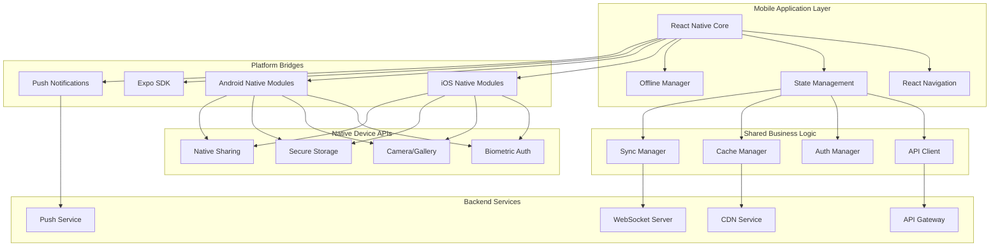
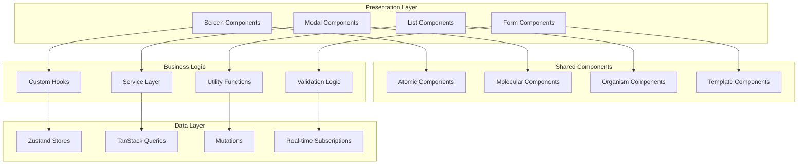

# Mobile Application Design Document

## Overview

Мобильное приложение российской игровой платформы построено на React Native для обеспечения кросс-платформенной разработки с максимальным переиспользованием кода. Приложение предоставляет полнофункциональный доступ к игровой экосистеме с нативной производительностью и интеграцией с системными возможностями устройств.

## Architecture

### High-Level Architecture



### Component Architecture



## Technology Stack

### Core Technologies
- **React Native 0.72+**: Cross-platform mobile framework
- **TypeScript**: Type safety and developer experience
- **Expo SDK 49+**: Development platform and native APIs
- **Metro**: JavaScript bundler for React Native

### Navigation & Routing
- **React Navigation 6**: Navigation library
- **Deep Linking**: URL-based navigation
- **Tab Navigation**: Bottom tab navigation
- **Stack Navigation**: Screen transitions

### State Management
- **Zustand**: Lightweight state management
- **TanStack Query**: Server state and caching
- **React Hook Form**: Form state management
- **AsyncStorage**: Local data persistence

### UI & Styling
- **NativeWind**: Tailwind CSS for React Native
- **React Native Reanimated 3**: High-performance animations
- **React Native Gesture Handler**: Touch gestures
- **React Native SVG**: Vector graphics

### Native Integrations
- **Expo SecureStore**: Secure data storage
- **Expo LocalAuthentication**: Biometric authentication
- **Expo Notifications**: Push notifications
- **Expo Camera**: Camera and image picker
- **Expo Sharing**: Native sharing functionality

### Real-time & Networking
- **Socket.IO Client**: Real-time communication
- **Axios**: HTTP client with interceptors
- **React Native NetInfo**: Network state monitoring
- **Background Tasks**: Background synchronization

### Development Tools
- **Expo CLI**: Development and build tools
- **EAS Build**: Cloud build service
- **EAS Update**: Over-the-air updates
- **Flipper**: Debugging and profiling

## Components and Interfaces

### 1. App Shell
**Purpose:** Main application wrapper with navigation and global state

**Interfaces:**
```typescript
interface AppShellProps {
  initialRoute?: string
  theme?: ThemeConfig
  locale?: string
}

interface NavigationState {
  currentRoute: string
  previousRoute?: string
  params?: Record<string, any>
  canGoBack: boolean
}

interface AppContextValue {
  navigation: NavigationState
  theme: ThemeConfig
  user: UserProfile | null
  isOnline: boolean
  isLoading: boolean
}
```

### 2. Authentication Manager
**Purpose:** Handle user authentication and session management

**Interfaces:**
```typescript
interface AuthManager {
  login(credentials: LoginCredentials): Promise<AuthResult>
  loginWithBiometric(): Promise<AuthResult>
  logout(): Promise<void>
  refreshToken(): Promise<string>
  isAuthenticated(): boolean
  enableBiometric(): Promise<void>
  disableBiometric(): Promise<void>
}

interface BiometricConfig {
  enabled: boolean
  type: 'fingerprint' | 'face' | 'iris' | 'none'
  fallbackToPassword: boolean
  promptMessage: string
}

interface AuthResult {
  success: boolean
  user?: UserProfile
  token?: string
  error?: string
  requiresBiometricSetup?: boolean
}
```

### 3. Offline Manager
**Purpose:** Handle offline functionality and data synchronization

**Interfaces:**
```typescript
interface OfflineManager {
  isOnline(): boolean
  queueAction(action: OfflineAction): void
  syncPendingActions(): Promise<void>
  getCachedData<T>(key: string): Promise<T | null>
  setCachedData<T>(key: string, data: T): Promise<void>
  clearCache(): Promise<void>
}

interface OfflineAction {
  id: string
  type: ActionType
  payload: any
  timestamp: Date
  retryCount: number
  priority: 'high' | 'medium' | 'low'
}

interface SyncStrategy {
  immediate: string[]  // Actions to sync immediately when online
  batched: string[]    // Actions to batch and sync periodically
  background: string[] // Actions to sync in background
}
```

### 4. Push Notification Manager
**Purpose:** Handle push notifications and local notifications

**Interfaces:**
```typescript
interface NotificationManager {
  requestPermissions(): Promise<boolean>
  registerForPushNotifications(): Promise<string>
  scheduleLocalNotification(notification: LocalNotification): Promise<string>
  cancelNotification(id: string): Promise<void>
  handleNotificationReceived(notification: Notification): void
  handleNotificationOpened(notification: Notification): void
}

interface NotificationConfig {
  enabled: boolean
  categories: NotificationCategory[]
  sound: boolean
  badge: boolean
  alert: boolean
}

interface LocalNotification {
  title: string
  body: string
  data?: Record<string, any>
  trigger?: NotificationTrigger
  categoryId?: string
}
```

### 5. Native Bridge Manager
**Purpose:** Interface with native device capabilities

**Interfaces:**
```typescript
interface NativeBridge {
  camera: CameraManager
  storage: StorageManager
  sharing: SharingManager
  biometric: BiometricManager
  device: DeviceManager
}

interface CameraManager {
  takePicture(options?: CameraOptions): Promise<ImageResult>
  pickImage(options?: ImagePickerOptions): Promise<ImageResult>
  requestPermissions(): Promise<boolean>
}

interface StorageManager {
  setSecureItem(key: string, value: string): Promise<void>
  getSecureItem(key: string): Promise<string | null>
  deleteSecureItem(key: string): Promise<void>
  setItem(key: string, value: string): Promise<void>
  getItem(key: string): Promise<string | null>
}

interface SharingManager {
  share(content: ShareContent): Promise<ShareResult>
  isAvailable(): Promise<boolean>
}
```

## Data Models

### User Profile Model
```typescript
interface UserProfile {
  id: string
  username: string
  displayName: string
  email: string
  avatar?: string
  level: number
  experience: number
  preferences: UserPreferences
  settings: UserSettings
  lastSeen: Date
  isOnline: boolean
}

interface UserPreferences {
  language: string
  theme: 'light' | 'dark' | 'system'
  notifications: NotificationPreferences
  privacy: PrivacySettings
  gameplay: GameplaySettings
}

interface UserSettings {
  biometricEnabled: boolean
  offlineMode: boolean
  dataUsage: 'unlimited' | 'wifi-only' | 'minimal'
  autoUpdates: boolean
  pushNotifications: boolean
}
```

### Game Library Model
```typescript
interface GameLibrary {
  games: LibraryGame[]
  collections: GameCollection[]
  recentlyPlayed: LibraryGame[]
  favorites: string[]
  totalGames: number
  totalPlaytime: number
}

interface LibraryGame {
  id: string
  title: string
  coverImage: string
  playtime: number
  lastPlayed?: Date
  achievements: Achievement[]
  progress?: GameProgress
  isInstalled: boolean
  canPlay: boolean
}

interface GameCollection {
  id: string
  name: string
  description?: string
  gameIds: string[]
  createdAt: Date
  updatedAt: Date
  isDefault: boolean
}
```

### Social Data Model
```typescript
interface SocialData {
  friends: Friend[]
  conversations: Conversation[]
  notifications: SocialNotification[]
  activities: Activity[]
}

interface Friend {
  id: string
  username: string
  displayName: string
  avatar?: string
  status: 'online' | 'offline' | 'playing' | 'away'
  currentGame?: string
  lastSeen: Date
  isFavorite: boolean
}

interface Conversation {
  id: string
  participants: string[]
  lastMessage?: Message
  unreadCount: number
  updatedAt: Date
  type: 'direct' | 'group'
}
```

## Screen Architecture

### Navigation Structure
```typescript
// Main Tab Navigator
interface MainTabsConfig {
  Home: HomeStackNavigator
  Library: LibraryStackNavigator
  Store: StoreStackNavigator
  Social: SocialStackNavigator
  Profile: ProfileStackNavigator
}

// Stack Navigators
interface HomeStackNavigator {
  HomeScreen: undefined
  GameDetailsScreen: { gameId: string }
  NewsScreen: undefined
  SearchScreen: { query?: string }
}

interface LibraryStackNavigator {
  LibraryScreen: undefined
  GameScreen: { gameId: string }
  CollectionScreen: { collectionId: string }
  StatsScreen: undefined
}
```

### Screen Components
```typescript
// Home Screen
interface HomeScreenProps {
  navigation: NavigationProp<HomeStackNavigator>
  route: RouteProp<HomeStackNavigator, 'HomeScreen'>
}

interface HomeScreenState {
  featuredGames: Game[]
  recentlyPlayed: Game[]
  recommendations: Game[]
  news: NewsItem[]
  isLoading: boolean
  refreshing: boolean
}

// Library Screen
interface LibraryScreenProps {
  navigation: NavigationProp<LibraryStackNavigator>
  route: RouteProp<LibraryStackNavigator, 'LibraryScreen'>
}

interface LibraryScreenState {
  games: LibraryGame[]
  collections: GameCollection[]
  sortBy: 'name' | 'playtime' | 'recent'
  filterBy: 'all' | 'installed' | 'favorites'
  searchQuery: string
}
```

## Performance Optimization

### Bundle Optimization
```typescript
// Code Splitting Strategy
const LazyGameDetails = lazy(() => import('./screens/GameDetailsScreen'))
const LazyProfile = lazy(() => import('./screens/ProfileScreen'))
const LazySettings = lazy(() => import('./screens/SettingsScreen'))

// Image Optimization
interface ImageConfig {
  quality: 'low' | 'medium' | 'high'
  format: 'webp' | 'jpeg' | 'png'
  caching: boolean
  placeholder: boolean
}

// List Virtualization
interface VirtualizedListConfig {
  itemHeight: number
  windowSize: number
  initialNumToRender: number
  maxToRenderPerBatch: number
  updateCellsBatchingPeriod: number
}
```

### Memory Management
```typescript
interface MemoryManager {
  clearImageCache(): Promise<void>
  clearDataCache(): Promise<void>
  getMemoryUsage(): Promise<MemoryInfo>
  optimizeForLowMemory(): void
}

interface MemoryInfo {
  used: number
  available: number
  total: number
  threshold: number
}
```

## Security Implementation

### Data Protection
```typescript
interface SecurityManager {
  encryptSensitiveData(data: string): Promise<string>
  decryptSensitiveData(encryptedData: string): Promise<string>
  validateAppIntegrity(): Promise<boolean>
  detectRootJailbreak(): Promise<boolean>
  secureNetworkRequest(config: RequestConfig): Promise<Response>
}

interface SecurityConfig {
  certificatePinning: boolean
  rootDetection: boolean
  debugDetection: boolean
  screenRecordingProtection: boolean
  screenshotProtection: boolean
}
```

### Authentication Security
```typescript
interface AuthSecurity {
  hashPassword(password: string): Promise<string>
  validateBiometric(): Promise<boolean>
  generateSecureToken(): string
  validateTokenIntegrity(token: string): boolean
  handleSecurityBreach(): void
}
```

## Accessibility Implementation

### Accessibility Features
```typescript
interface AccessibilityManager {
  configureScreenReader(): void
  setAccessibilityLabels(): void
  handleVoiceOver(): void
  configureFocusManagement(): void
  setAccessibilityHints(): void
}

interface AccessibilityConfig {
  screenReaderEnabled: boolean
  highContrastMode: boolean
  largeTextMode: boolean
  reduceMotion: boolean
  voiceControlEnabled: boolean
}
```

## Testing Strategy

### Unit Testing
```typescript
// Component Testing
describe('GameCard Component', () => {
  it('should display game information correctly', () => {
    const mockGame = createMockGame()
    render(<GameCard game={mockGame} />)
    expect(screen.getByText(mockGame.title)).toBeTruthy()
  })
})

// Hook Testing
describe('useGameLibrary Hook', () => {
  it('should fetch and cache game library', async () => {
    const { result } = renderHook(() => useGameLibrary())
    await waitFor(() => {
      expect(result.current.games).toHaveLength(5)
    })
  })
})
```

### Integration Testing
```typescript
// Navigation Testing
describe('Navigation Flow', () => {
  it('should navigate from home to game details', async () => {
    const navigation = createMockNavigation()
    render(<HomeScreen navigation={navigation} />)
    
    fireEvent.press(screen.getByTestId('game-card-1'))
    expect(navigation.navigate).toHaveBeenCalledWith('GameDetails', { gameId: '1' })
  })
})

// API Integration Testing
describe('API Integration', () => {
  it('should handle offline mode correctly', async () => {
    mockNetworkState(false)
    const { result } = renderHook(() => useGameCatalog())
    
    await waitFor(() => {
      expect(result.current.isOffline).toBe(true)
      expect(result.current.games).toEqual(cachedGames)
    })
  })
})
```

### E2E Testing (Detox)
```typescript
// User Journey Testing
describe('Game Purchase Flow', () => {
  it('should complete game purchase successfully', async () => {
    await device.launchApp()
    
    // Navigate to store
    await element(by.id('store-tab')).tap()
    
    // Select game
    await element(by.id('game-card-1')).tap()
    
    // Purchase game
    await element(by.id('buy-button')).tap()
    await element(by.id('confirm-purchase')).tap()
    
    // Verify purchase
    await expect(element(by.text('Purchase Successful'))).toBeVisible()
  })
})
```

## Deployment Strategy

### Build Configuration
```typescript
interface BuildConfig {
  environment: 'development' | 'staging' | 'production'
  bundleId: string
  version: string
  buildNumber: number
  signing: SigningConfig
  features: FeatureFlags
}

interface SigningConfig {
  ios: {
    teamId: string
    certificateType: 'development' | 'distribution'
    provisioningProfile: string
  }
  android: {
    keystore: string
    keyAlias: string
    storePassword: string
    keyPassword: string
  }
}
```

### CI/CD Pipeline
```yaml
# EAS Build Configuration
build:
  development:
    extends: base
    developmentClient: true
    distribution: internal
  preview:
    extends: base
    distribution: internal
  production:
    extends: base
    distribution: store

submit:
  production:
    ios:
      appleId: "your-apple-id"
      ascAppId: "your-asc-app-id"
    android:
      serviceAccountKeyPath: "path/to/service-account.json"
      track: production
```

### Over-the-Air Updates
```typescript
interface OTAUpdateManager {
  checkForUpdates(): Promise<UpdateInfo>
  downloadUpdate(): Promise<void>
  applyUpdate(): Promise<void>
  rollbackUpdate(): Promise<void>
}

interface UpdateInfo {
  available: boolean
  version: string
  size: number
  mandatory: boolean
  description: string
}
```

## Monitoring and Analytics

### Performance Monitoring
```typescript
interface PerformanceMonitor {
  trackScreenLoad(screenName: string, duration: number): void
  trackAPICall(endpoint: string, duration: number, success: boolean): void
  trackCrash(error: Error, context: CrashContext): void
  trackMemoryUsage(): void
}

interface CrashContext {
  userId?: string
  screenName: string
  action: string
  deviceInfo: DeviceInfo
  appVersion: string
}
```

### User Analytics
```typescript
interface AnalyticsManager {
  trackEvent(eventName: string, properties?: Record<string, any>): void
  trackScreen(screenName: string): void
  setUserProperties(properties: UserProperties): void
  trackPurchase(purchase: PurchaseEvent): void
}

interface PurchaseEvent {
  gameId: string
  price: number
  currency: string
  paymentMethod: string
  success: boolean
}
```

## Localization

### Multi-language Support
```typescript
interface LocalizationManager {
  getCurrentLanguage(): string
  setLanguage(language: string): Promise<void>
  translate(key: string, params?: TranslationParams): string
  formatCurrency(amount: number, currency: string): string
  formatDate(date: Date): string
}

interface TranslationResource {
  [key: string]: string | TranslationResource
}

// Russian Localization
const ruTranslations: TranslationResource = {
  common: {
    loading: 'Загрузка...',
    error: 'Ошибка',
    retry: 'Повторить',
    cancel: 'Отмена',
    confirm: 'Подтвердить'
  },
  games: {
    library: 'Библиотека',
    store: 'Магазин',
    wishlist: 'Список желаний',
    achievements: 'Достижения'
  }
}
```

This comprehensive design document provides the technical foundation for building a high-quality, cross-platform mobile application that integrates seamlessly with the Russian gaming platform ecosystem.