# Дизайн Mobile Gaming Service

## Обзор

Mobile Gaming Service - это микросервис для поддержки мобильных игр на российской Steam-платформе. Сервис обеспечивает кросс-платформенную синхронизацию, мобильные платежи, оптимизацию для различных устройств, семейные функции и интеграцию с российскими мобильными сервисами.

## Архитектура

### Высокоуровневая архитектура

```mermaid
graph TB
    subgraph "Mobile Clients"
        ANDROID[Android App]
        IOS[iOS App]
        PWA[Progressive Web App]
        HYBRID[Hybrid Games]
    end
    
    subgraph "API Gateway"
        GW[API Gateway]
        MOBILE_GW[Mobile API Gateway]
    end
    
    subgraph "Mobile Gaming Service"
        API[Mobile Gaming API]
        SYNC_MGR[Cross-Platform Sync Manager]
        DEVICE_MGR[Device Manager]
        PAYMENT_MGR[Mobile Payment Manager]
        PERF_OPT[Performance Optimizer]
        FAMILY_CTRL[Family Control]
        NOTIFICATION[Push Notification Manager]
    end
    
    subgraph "Game Processing"
        GAME_ADAPTER[Game Adapter]
        ASSET_OPT[Asset Optimizer]
        NETWORK_OPT[Network Optimizer]
        GRAPHICS_SCALER[Graphics Scaler]
    end
    
    subgraph "External Mobile Services"
        GOOGLE_PLAY[Google Play Services]
        APP_STORE[App Store Connect]
        FIREBASE[Firebase]
        HUAWEI[Huawei Mobile Services]
        RUSSIAN_BANKS[Russian Banking APIs]
        MOBILE_OPERATORS[Mobile Operators]
    end
    
    subgraph "Platform Services"
        USER[User Service]
        PAYMENT[Payment Service]
        SOCIAL[Social Service]
        CLOUD_SAVE[Cloud Save Service]
        TOURNAMENT[Tournament Service]
        FAMILY[Family Sharing Service]
    end
    
    subgraph "Data Storage"
        POSTGRES[(PostgreSQL)]
        REDIS[(Redis Cache)]
        MONGODB[(MongoDB)]
        S3[(Mobile Assets Storage)]
    end
    
    ANDROID --> MOBILE_GW
    IOS --> MOBILE_GW
    PWA --> GW
    HYBRID --> MOBILE_GW
    
    MOBILE_GW --> API
    GW --> API
    
    API --> SYNC_MGR
    API --> DEVICE_MGR
    API --> PAYMENT_MGR
    API --> PERF_OPT
    API --> FAMILY_CTRL
    API --> NOTIFICATION
    
    SYNC_MGR --> GAME_ADAPTER
    DEVICE_MGR --> ASSET_OPT
    PERF_OPT --> NETWORK_OPT
    PERF_OPT --> GRAPHICS_SCALER
    
    PAYMENT_MGR --> GOOGLE_PLAY
    PAYMENT_MGR --> APP_STORE
    PAYMENT_MGR --> RUSSIAN_BANKS
    PAYMENT_MGR --> MOBILE_OPERATORS
    
    NOTIFICATION --> FIREBASE
    NOTIFICATION --> HUAWEI
    
    API --> USER
    API --> PAYMENT
    API --> SOCIAL
    API --> CLOUD_SAVE
    API --> TOURNAMENT
    API --> FAMILY
    
    SYNC_MGR --> POSTGRES
    DEVICE_MGR --> MONGODB
    PAYMENT_MGR --> POSTGRES
    NOTIFICATION --> REDIS
    ASSET_OPT --> S3
```



## Компоненты и интерфейсы

### 1. Cross-Platform Sync Manager
**Назначение:** Синхронизация игрового прогресса между устройствами

**Основные функции:**
- Синхронизация сохранений между мобильными и десктопными версиями
- Кросс-платформенные достижения
- Синхронизация настроек игры
- Конфликт-резолюшн для одновременных изменений

**API Endpoints:**
```typescript
POST /api/v1/mobile/sync/save - синхронизация сохранения
GET /api/v1/mobile/sync/progress/{gameId} - получение прогресса игры
PUT /api/v1/mobile/sync/achievements - синхронизация достижений
POST /api/v1/mobile/sync/settings - синхронизация настроек
GET /api/v1/mobile/sync/conflicts - получение конфликтов синхронизации
```

### 2. Device Manager
**Назначение:** Управление характеристиками и оптимизацией для разных устройств

**Основные функции:**
- Определение характеристик устройства
- Профили производительности
- Адаптивные настройки графики
- Мониторинг температуры и батареи

**API Endpoints:**
```typescript
POST /api/v1/mobile/device/register - регистрация устройства
GET /api/v1/mobile/device/{deviceId}/profile - профиль устройства
PUT /api/v1/mobile/device/{deviceId}/settings - обновление настроек
GET /api/v1/mobile/device/{deviceId}/performance - метрики производительности
POST /api/v1/mobile/device/{deviceId}/optimize - оптимизация для устройства
```

### 3. Mobile Payment Manager
**Назначение:** Обработка мобильных платежей

**Основные функции:**
- Интеграция с Google Play Billing
- Интеграция с App Store In-App Purchases
- Поддержка российских мобильных платежей
- Биометрическая аутентификация платежей

**API Endpoints:**
```typescript
POST /api/v1/mobile/payments/purchase - инициация покупки
GET /api/v1/mobile/payments/methods - доступные способы оплаты
POST /api/v1/mobile/payments/verify - верификация покупки
GET /api/v1/mobile/payments/history - история мобильных платежей
POST /api/v1/mobile/payments/refund - возврат средств
```

### 4. Performance Optimizer
**Назначение:** Оптимизация производительности игр на мобильных устройствах

**Основные функции:**
- Динамическое масштабирование графики
- Адаптация к сетевым условиям
- Управление памятью и CPU
- Предотвращение перегрева

**API Endpoints:**
```typescript
POST /api/v1/mobile/performance/analyze - анализ производительности
PUT /api/v1/mobile/performance/settings - настройки производительности
GET /api/v1/mobile/performance/recommendations - рекомендации по оптимизации
POST /api/v1/mobile/performance/thermal - управление тепловым режимом
```

### 5. Family Control
**Назначение:** Семейные функции и родительский контроль для мобильных устройств

**Основные функции:**
- Синхронизация ограничений времени
- Контроль покупок на мобильных
- Мониторинг активности детей
- Удаленное управление играми

**API Endpoints:**
```typescript
GET /api/v1/mobile/family/{childId}/status - статус ребенка
PUT /api/v1/mobile/family/{childId}/limits - установка лимитов
POST /api/v1/mobile/family/{childId}/block - блокировка игр
GET /api/v1/mobile/family/{childId}/activity - активность ребенка
POST /api/v1/mobile/family/purchase/approve - одобрение покупки
```

### 6. Push Notification Manager
**Назначение:** Управление push-уведомлениями

**Основные функции:**
- Персонализированные уведомления
- Интеграция с Firebase и Huawei Push Kit
- Уведомления о событиях в играх
- Маркетинговые кампании

**API Endpoints:**
```typescript
POST /api/v1/mobile/notifications/send - отправка уведомления
PUT /api/v1/mobile/notifications/preferences - настройки уведомлений
GET /api/v1/mobile/notifications/history - история уведомлений
POST /api/v1/mobile/notifications/schedule - планирование уведомлений
DELETE /api/v1/mobile/notifications/{notificationId} - отмена уведомления
```

## Модели данных

### Mobile Device Profile
```typescript
interface MobileDeviceProfile {
  id: string;
  userId: string;
  deviceInfo: {
    platform: 'android' | 'ios' | 'huawei';
    model: string;
    osVersion: string;
    screenResolution: string;
    screenDensity: number;
    ram: number;
    storage: number;
    gpu: string;
    cpu: string;
  };
  performanceProfile: {
    tier: 'low' | 'medium' | 'high' | 'flagship';
    maxFPS: number;
    recommendedGraphicsLevel: number;
    thermalThrottling: boolean;
    batteryOptimization: boolean;
  };
  preferences: {
    dataUsageLimit: number;
    wifiOnlyDownloads: boolean;
    pushNotifications: boolean;
    hapticFeedback: boolean;
  };
  createdAt: Date;
  updatedAt: Date;
}
```

### Cross-Platform Save
```typescript
interface CrossPlatformSave {
  id: string;
  userId: string;
  gameId: string;
  platform: 'mobile' | 'desktop' | 'web';
  saveData: any;
  metadata: {
    level: number;
    playtime: number;
    achievements: string[];
    lastCheckpoint: string;
  };
  syncStatus: 'synced' | 'pending' | 'conflict';
  version: number;
  checksum: string;
  createdAt: Date;
  updatedAt: Date;
}
```

### Mobile Payment Transaction
```typescript
interface MobilePaymentTransaction {
  id: string;
  userId: string;
  gameId: string;
  platform: 'google_play' | 'app_store' | 'huawei_pay' | 'mobile_operator' | 'russian_bank';
  transactionId: string;
  productId: string;
  amount: number;
  currency: string;
  status: 'pending' | 'completed' | 'failed' | 'refunded';
  paymentMethod: {
    type: 'card' | 'mobile_billing' | 'digital_wallet' | 'biometric';
    details: any;
  };
  verification: {
    receipt: string;
    signature: string;
    verified: boolean;
  };
  createdAt: Date;
  updatedAt: Date;
}
```

### Mobile Game Session
```typescript
interface MobileGameSession {
  id: string;
  userId: string;
  gameId: string;
  deviceId: string;
  startTime: Date;
  endTime?: Date;
  duration: number;
  performance: {
    avgFPS: number;
    minFPS: number;
    maxFPS: number;
    memoryUsage: number;
    batteryDrain: number;
    thermalState: string;
  };
  networkStats: {
    dataUsed: number;
    connectionType: 'wifi' | '4g' | '5g' | 'offline';
    latency: number;
    disconnections: number;
  };
  achievements: string[];
  createdAt: Date;
}
```

### Push Notification
```typescript
interface PushNotification {
  id: string;
  userId: string;
  type: 'game_event' | 'friend_invite' | 'achievement' | 'promotion' | 'reminder';
  title: string;
  body: string;
  data: any;
  platform: 'android' | 'ios' | 'huawei' | 'all';
  status: 'scheduled' | 'sent' | 'delivered' | 'failed';
  scheduledAt?: Date;
  sentAt?: Date;
  deliveredAt?: Date;
  clickedAt?: Date;
  createdAt: Date;
}
```

## Обработка ошибок

### Стандартные коды ошибок
- `DEVICE_NOT_SUPPORTED` - устройство не поддерживается
- `SYNC_CONFLICT` - конфликт синхронизации данных
- `PAYMENT_VERIFICATION_FAILED` - ошибка верификации платежа
- `INSUFFICIENT_PERFORMANCE` - недостаточная производительность устройства
- `NETWORK_OPTIMIZATION_FAILED` - ошибка оптимизации сети
- `FAMILY_CONTROL_BLOCKED` - действие заблокировано родительским контролем
- `PUSH_NOTIFICATION_FAILED` - ошибка отправки уведомления
- `CROSS_PLATFORM_SYNC_FAILED` - ошибка кросс-платформенной синхронизации

### Обработка мобильных специфичных проблем
- Graceful degradation при низкой производительности
- Автоматическое переключение между Wi-Fi и мобильной сетью
- Обработка прерываний (звонки, уведомления)
- Восстановление после выхода из фонового режима

## Стратегия тестирования

### Unit тесты
- Тестирование логики синхронизации данных
- Валидация профилей устройств
- Проверка алгоритмов оптимизации
- Тестирование семейных ограничений

### Integration тесты
- Интеграция с Google Play Services
- Интеграция с App Store Connect
- Тестирование с российскими платежными системами
- Синхронизация с основными сервисами платформы

### Device тесты
- Тестирование на различных Android устройствах
- Тестирование на различных iOS устройствах
- Проверка производительности на бюджетных устройствах
- Тестирование на российских устройствах (Yandex Phone, etc.)

### Network тесты
- Тестирование при нестабильном соединении
- Проверка работы в режиме ограниченного трафика
- Тестирование переключения между сетями
- Проверка работы в роуминге

## Безопасность

### Аутентификация и авторизация
- JWT токены с коротким временем жизни для мобильных
- Биометрическая аутентификация для платежей
- Device fingerprinting для предотвращения мошенничества
- OAuth 2.0 интеграция с мобильными провайдерами

### Защита данных
- Шифрование локальных сохранений
- Secure communication с использованием certificate pinning
- Защита от reverse engineering
- Обфускация критически важного кода

### Платежная безопасность
- Верификация покупок через официальные API
- Защита от фальшивых транзакций
- Мониторинг подозрительной активности
- Соответствие PCI DSS требованиям

## Мониторинг и логирование

### Метрики производительности
- FPS и время отклика на различных устройствах
- Использование памяти и CPU
- Температура устройства и разряд батареи
- Качество сетевого соединения

### Бизнес-метрики
- Конверсия мобильных платежей
- Время сессий на мобильных устройствах
- Популярность игр на разных платформах
- Эффективность push-уведомлений

### Логирование
- Все мобильные транзакции
- События синхронизации данных
- Ошибки производительности
- Активность семейного контроля

## Развертывание и масштабирование

### Мобильная специфика
- App Store и Google Play deployment
- Поддержка различных архитектур (ARM, x86)
- A/B тестирование мобильных функций
- Постепенный rollout обновлений

### Масштабирование
- Горизонтальное масштабирование для push-уведомлений
- CDN для мобильных ассетов
- Edge computing для снижения задержек
- Региональные серверы для российских пользователей

### Мониторинг
- Crashlytics для отслеживания крашей
- Performance monitoring для мобильных приложений
- Real User Monitoring (RUM)
- Custom metrics для игровых событий

## Интеграция с российскими сервисами

### Платежные системы
- Интеграция с российскими банковскими приложениями
- Поддержка СБП (Система быстрых платежей)
- Интеграция с мобильными операторами (МТС, Билайн, Мегафон, Теле2)
- Поддержка российских цифровых кошельков

### Социальные функции
- Интеграция с VK, Одноклассники
- Поддержка Telegram Bot API
- Интеграция с российскими мессенджерами
- Локализация для российского рынка

### Соответствие законодательству
- Соблюдение закона о персональных данных (152-ФЗ)
- Хранение данных российских пользователей на территории РФ
- Интеграция с российскими системами возрастной классификации
- Соответствие требованиям Роскомнадзора