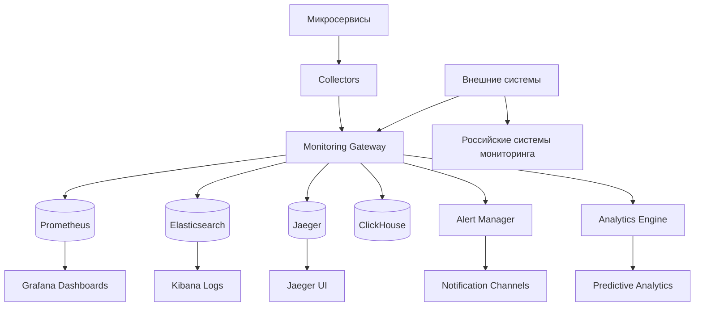

# Дизайн Monitoring Service

## Обзор

Monitoring Service обеспечивает комплексный мониторинг всех компонентов российской игровой платформы, включая производительность микросервисов, здоровье системы, пользовательский опыт и бизнес-метрики в реальном времени. Сервис построен на современном стеке наблюдаемости с поддержкой российских стандартов мониторинга.

## Архитектура

### Высокоуровневая архитектура



### Компоненты сервиса

1. **Metrics Collection** - сбор метрик производительности
2. **Logs Aggregation** - агрегация и анализ логов
3. **Distributed Tracing** - трассировка распределенных запросов
4. **Alerting System** - система алертов и уведомлений
5. **Dashboard Engine** - создание и управление дашбордами
6. **Analytics Engine** - аналитика и предиктивные модели
7. **Health Monitoring** - мониторинг здоровья сервисов
8. **Business Metrics** - бизнес-метрики и KPI

## Компоненты и интерфейсы

### API Endpoints

#### Метрики
- `POST /api/v1/metrics` - отправка метрик от сервисов
- `GET /api/v1/metrics/query` - запрос метрик с фильтрацией
- `GET /api/v1/metrics/range` - запрос метрик за период
- `POST /api/v1/metrics/custom` - создание кастомных метрик

#### Логи
- `POST /api/v1/logs` - отправка логов
- `GET /api/v1/logs/search` - поиск в логах
- `GET /api/v1/logs/stream` - стриминг логов в реальном времени
- `POST /api/v1/logs/analyze` - анализ паттернов в логах

#### Трассировка
- `POST /api/v1/traces` - отправка трейсов
- `GET /api/v1/traces/{traceId}` - получение конкретного трейса
- `GET /api/v1/traces/search` - поиск трейсов
- `GET /api/v1/traces/dependencies` - карта зависимостей сервисов

#### Алерты
- `GET /api/v1/alerts` - список активных алертов
- `POST /api/v1/alerts/rules` - создание правил алертов
- `PUT /api/v1/alerts/{alertId}/acknowledge` - подтверждение алерта
- `POST /api/v1/alerts/test` - тестирование правил алертов

#### Дашборды
- `GET /api/v1/dashboards` - список дашбордов
- `POST /api/v1/dashboards` - создание дашборда
- `PUT /api/v1/dashboards/{dashboardId}` - обновление дашборда
- `GET /api/v1/dashboards/{dashboardId}/data` - данные для дашборда

#### Здоровье сервисов
- `GET /api/v1/health` - общее состояние системы
- `GET /api/v1/health/services` - состояние всех сервисов
- `POST /api/v1/health/check` - принудительная проверка здоровья
- `GET /api/v1/health/dependencies` - проверка зависимостей

### Event-Driven Architecture

#### Входящие события
```typescript
interface MetricEvent {
  serviceName: string;
  metricName: string;
  value: number;
  timestamp: Date;
  labels: Record<string, string>;
  type: 'counter' | 'gauge' | 'histogram' | 'summary';
}

interface LogEvent {
  serviceName: string;
  level: 'debug' | 'info' | 'warn' | 'error' | 'fatal';
  message: string;
  timestamp: Date;
  correlationId?: string;
  userId?: string;
  metadata: Record<string, any>;
}

interface TraceEvent {
  traceId: string;
  spanId: string;
  parentSpanId?: string;
  operationName: string;
  serviceName: string;
  startTime: Date;
  duration: number;
  tags: Record<string, any>;
  logs: TraceLog[];
}
```

#### Исходящие события
```typescript
interface AlertTriggeredEvent {
  alertId: string;
  ruleName: string;
  severity: 'low' | 'medium' | 'high' | 'critical';
  message: string;
  affectedServices: string[];
  timestamp: Date;
  metadata: Record<string, any>;
}

interface ServiceHealthChangeEvent {
  serviceName: string;
  previousStatus: 'healthy' | 'degraded' | 'unhealthy';
  currentStatus: 'healthy' | 'degraded' | 'unhealthy';
  reason: string;
  timestamp: Date;
}
```

## Модели данных

### Основные сущности

#### Metric (Метрика)
```typescript
interface Metric {
  id: string;
  name: string;
  type: MetricType;
  description: string;
  unit: string;
  labels: MetricLabel[];
  retention: number;
  aggregations: AggregationType[];
  isCustom: boolean;
  createdAt: Date;
}

interface MetricDataPoint {
  metricId: string;
  timestamp: Date;
  value: number;
  labels: Record<string, string>;
}

enum MetricType {
  COUNTER = 'counter',
  GAUGE = 'gauge',
  HISTOGRAM = 'histogram',
  SUMMARY = 'summary'
}
```

#### AlertRule (Правило алерта)
```typescript
interface AlertRule {
  id: string;
  name: string;
  description: string;
  query: string;
  condition: AlertCondition;
  severity: AlertSeverity;
  duration: number;
  labels: Record<string, string>;
  annotations: Record<string, string>;
  isActive: boolean;
  createdBy: string;
  createdAt: Date;
  updatedAt: Date;
}

interface AlertCondition {
  operator: 'gt' | 'lt' | 'eq' | 'ne' | 'gte' | 'lte';
  threshold: number;
  aggregation?: 'avg' | 'sum' | 'min' | 'max' | 'count';
  timeWindow?: number;
}

interface Alert {
  id: string;
  ruleId: string;
  status: 'firing' | 'resolved' | 'acknowledged';
  startsAt: Date;
  endsAt?: Date;
  acknowledgedBy?: string;
  acknowledgedAt?: Date;
  value: number;
  labels: Record<string, string>;
  annotations: Record<string, string>;
}
```

#### Dashboard (Дашборд)
```typescript
interface Dashboard {
  id: string;
  title: string;
  description: string;
  tags: string[];
  panels: DashboardPanel[];
  variables: DashboardVariable[];
  timeRange: TimeRange;
  refreshInterval: number;
  isPublic: boolean;
  createdBy: string;
  createdAt: Date;
  updatedAt: Date;
}

interface DashboardPanel {
  id: string;
  title: string;
  type: 'graph' | 'singlestat' | 'table' | 'heatmap' | 'logs';
  query: string;
  position: { x: number; y: number; width: number; height: number };
  options: Record<string, any>;
}
```

#### ServiceHealth (Здоровье сервиса)
```typescript
interface ServiceHealth {
  serviceName: string;
  status: HealthStatus;
  lastCheck: Date;
  uptime: number;
  responseTime: number;
  errorRate: number;
  dependencies: ServiceDependency[];
  healthChecks: HealthCheck[];
  metadata: Record<string, any>;
}

interface HealthCheck {
  name: string;
  status: HealthStatus;
  message?: string;
  lastCheck: Date;
  duration: number;
}

enum HealthStatus {
  HEALTHY = 'healthy',
  DEGRADED = 'degraded',
  UNHEALTHY = 'unhealthy',
  UNKNOWN = 'unknown'
}
```

### Схема базы данных

```sql
-- Метрики (временные ряды в ClickHouse)
CREATE TABLE metrics (
    timestamp DateTime,
    metric_name String,
    service_name String,
    value Float64,
    labels Map(String, String)
) ENGINE = MergeTree()
PARTITION BY toYYYYMM(timestamp)
ORDER BY (service_name, metric_name, timestamp);

-- Логи (в Elasticsearch через API)
-- Структура документа в Elasticsearch:
{
  "timestamp": "2024-01-01T12:00:00Z",
  "service_name": "user-service",
  "level": "error",
  "message": "Database connection failed",
  "correlation_id": "abc-123",
  "user_id": "user-456",
  "metadata": {
    "error_code": "DB_CONNECTION_ERROR",
    "retry_count": 3
  }
}

-- Правила алертов (PostgreSQL)
CREATE TABLE alert_rules (
    id UUID PRIMARY KEY DEFAULT gen_random_uuid(),
    name VARCHAR(255) NOT NULL,
    description TEXT,
    query TEXT NOT NULL,
    condition JSONB NOT NULL,
    severity alert_severity NOT NULL,
    duration INTEGER DEFAULT 60,
    labels JSONB,
    annotations JSONB,
    is_active BOOLEAN DEFAULT TRUE,
    created_by UUID,
    created_at TIMESTAMP DEFAULT NOW(),
    updated_at TIMESTAMP DEFAULT NOW()
);

-- Активные алерты
CREATE TABLE alerts (
    id UUID PRIMARY KEY DEFAULT gen_random_uuid(),
    rule_id UUID NOT NULL REFERENCES alert_rules(id),
    status alert_status NOT NULL,
    starts_at TIMESTAMP NOT NULL,
    ends_at TIMESTAMP,
    acknowledged_by UUID,
    acknowledged_at TIMESTAMP,
    value DECIMAL(10,2),
    labels JSONB,
    annotations JSONB,
    created_at TIMESTAMP DEFAULT NOW()
);

-- Дашборды
CREATE TABLE dashboards (
    id UUID PRIMARY KEY DEFAULT gen_random_uuid(),
    title VARCHAR(255) NOT NULL,
    description TEXT,
    tags TEXT[],
    panels JSONB NOT NULL,
    variables JSONB,
    time_range JSONB,
    refresh_interval INTEGER DEFAULT 30,
    is_public BOOLEAN DEFAULT FALSE,
    created_by UUID,
    created_at TIMESTAMP DEFAULT NOW(),
    updated_at TIMESTAMP DEFAULT NOW()
);

-- Здоровье сервисов
CREATE TABLE service_health (
    service_name VARCHAR(100) PRIMARY KEY,
    status health_status NOT NULL,
    last_check TIMESTAMP NOT NULL,
    uptime BIGINT DEFAULT 0,
    response_time INTEGER,
    error_rate DECIMAL(5,2),
    dependencies JSONB,
    health_checks JSONB,
    metadata JSONB,
    updated_at TIMESTAMP DEFAULT NOW()
);
```

## Система сбора метрик

### Metrics Collector
```typescript
class MetricsCollector {
  async collectMetrics(serviceName: string): Promise<Metric[]> {
    const collectors = [
      new SystemMetricsCollector(),
      new ApplicationMetricsCollector(),
      new BusinessMetricsCollector(),
      new CustomMetricsCollector()
    ];
    
    const allMetrics: Metric[] = [];
    
    for (const collector of collectors) {
      try {
        const metrics = await collector.collect(serviceName);
        allMetrics.push(...metrics);
      } catch (error) {
        this.logger.error(`Failed to collect metrics from ${collector.name}`, error);
      }
    }
    
    return allMetrics;
  }
  
  async storeMetrics(metrics: Metric[]): Promise<void> {
    const batches = this.batchMetrics(metrics, 1000);
    
    for (const batch of batches) {
      await this.clickHouseClient.insert('metrics', batch);
    }
  }
}
```

### Система алертов
```typescript
class AlertingEngine {
  async evaluateRules(): Promise<void> {
    const rules = await this.getActiveAlertRules();
    
    for (const rule of rules) {
      try {
        const result = await this.evaluateRule(rule);
        await this.processRuleResult(rule, result);
      } catch (error) {
        this.logger.error(`Failed to evaluate rule ${rule.name}`, error);
      }
    }
  }
  
  private async evaluateRule(rule: AlertRule): Promise<AlertEvaluationResult> {
    const query = this.buildPrometheusQuery(rule);
    const result = await this.prometheusClient.query(query);
    
    return {
      ruleId: rule.id,
      isFiring: this.checkCondition(result, rule.condition),
      value: result.value,
      timestamp: new Date()
    };
  }
  
  private async processRuleResult(rule: AlertRule, result: AlertEvaluationResult): Promise<void> {
    const existingAlert = await this.getActiveAlert(rule.id);
    
    if (result.isFiring && !existingAlert) {
      await this.createAlert(rule, result);
    } else if (!result.isFiring && existingAlert) {
      await this.resolveAlert(existingAlert);
    }
  }
}
```

## Обработка ошибок

### Типы ошибок
```typescript
enum MonitoringErrorCode {
  METRIC_COLLECTION_FAILED = 'METRIC_COLLECTION_FAILED',
  ALERT_EVALUATION_FAILED = 'ALERT_EVALUATION_FAILED',
  DASHBOARD_RENDER_FAILED = 'DASHBOARD_RENDER_FAILED',
  STORAGE_UNAVAILABLE = 'STORAGE_UNAVAILABLE',
  QUERY_TIMEOUT = 'QUERY_TIMEOUT',
  INVALID_METRIC_FORMAT = 'INVALID_METRIC_FORMAT'
}

interface MonitoringError {
  code: MonitoringErrorCode;
  message: string;
  serviceName?: string;
  metricName?: string;
  details?: Record<string, any>;
  timestamp: Date;
}
```

### Стратегии отказоустойчивости
- **Circuit Breaker**: защита от каскадных сбоев при недоступности хранилищ
- **Graceful Degradation**: работа с кэшированными данными при сбоях
- **Retry Logic**: повторные попытки для временных сбоев
- **Fallback Storage**: резервные хранилища для критических метрик

## Стратегия тестирования

### Unit Tests
- Логика сбора и обработки метрик
- Алгоритмы оценки алертов
- Построение запросов и дашбордов
- Обработка ошибок

### Integration Tests
- Интеграция с Prometheus, Elasticsearch, Jaeger
- API endpoints
- Система алертов
- Сбор метрик от реальных сервисов

### Performance Tests
- Нагрузочное тестирование сбора метрик
- Производительность запросов к временным рядам
- Масштабируемость при росте количества сервисов

### End-to-End Tests
- Полный цикл мониторинга от сбора до алертов
- Интеграция с внешними системами уведомлений
- Восстановление после сбоев

## Безопасность

### Аутентификация и авторизация
- JWT токены для API доступа
- RBAC для доступа к различным метрикам
- Аудит доступа к чувствительным данным

### Защита данных
- Шифрование метрик в передаче и хранении
- Анонимизация пользовательских данных в метриках
- Ротация ключей доступа к внешним системам

## Производительность и масштабируемость

### Оптимизация сбора метрик
- Батчинг метрик для эффективной записи
- Сжатие данных временных рядов
- Партиционирование по времени и сервисам
- Агрегация метрик на лету

### Масштабирование хранилища
- Горизонтальное масштабирование ClickHouse
- Шардинг данных по сервисам
- Автоматическая очистка старых данных
- Сжатие исторических данных

### Кэширование
- Redis для кэширования:
  - Результаты частых запросов (TTL: 1 минута)
  - Конфигурация дашбордов (TTL: 5 минут)
  - Статус здоровья сервисов (TTL: 30 секунд)
  - Агрегированные метрики (TTL: 5 минут)

## Интеграция с российскими системами

### Поддержка российских стандартов
```typescript
interface RussianMonitoringIntegration {
  // Интеграция с российскими системами мониторинга
  async exportToRussianSystem(systemType: string, data: any): Promise<void>;
  
  // Адаптация форматов данных
  async adaptDataFormat(data: any, targetFormat: string): Promise<any>;
  
  // Соответствие ГОСТ требованиям
  async validateGOSTCompliance(metrics: Metric[]): Promise<ComplianceReport>;
}
```

### Специальные метрики для игровых платформ
```typescript
interface GamePlatformMetrics {
  // Игровые метрики
  playerCount: number;
  gameSessionDuration: number;
  fps: number;
  latency: number;
  
  // Метрики вовлеченности
  dailyActiveUsers: number;
  retention: number;
  conversionRate: number;
  
  // Метрики удовлетворенности
  playerSatisfaction: number;
  supportTickets: number;
  bugReports: number;
}
```

## Предиктивная аналитика

### ML модели для прогнозирования
```typescript
class PredictiveAnalytics {
  async predictServiceFailure(serviceName: string): Promise<FailurePrediction> {
    const historicalData = await this.getHistoricalMetrics(serviceName);
    const model = await this.loadMLModel('service_failure_prediction');
    
    return model.predict(historicalData);
  }
  
  async recommendOptimizations(serviceName: string): Promise<OptimizationRecommendation[]> {
    const metrics = await this.getServiceMetrics(serviceName);
    const patterns = await this.analyzePatterns(metrics);
    
    return this.generateRecommendations(patterns);
  }
}
```

## Мониторинг и наблюдаемость

### Self-Monitoring
- Мониторинг собственной производительности
- Метрики сбора и обработки данных
- Здоровье компонентов мониторинга
- SLA мониторинга системы

### Алерты для мониторинга
- Сбои в сборе метрик
- Переполнение очередей обработки
- Недоступность хранилищ данных
- Критические ошибки в алертах

## Развертывание

### Docker Configuration
```dockerfile
FROM node:18-alpine
WORKDIR /app
COPY package*.json ./
RUN npm ci --only=production
COPY dist/ ./dist/
EXPOSE 3000 9090
CMD ["node", "dist/index.js"]
```

### Kubernetes Deployment
- StatefulSet для компонентов с состоянием
- DaemonSet для сбора метрик на узлах
- ConfigMaps для конфигурации
- PersistentVolumes для данных
- ServiceMonitor для Prometheus

### Environment Variables
```env
PROMETHEUS_URL=http://prometheus:9090
ELASTICSEARCH_URL=http://elasticsearch:9200
JAEGER_URL=http://jaeger:14268
CLICKHOUSE_URL=http://clickhouse:8123
REDIS_URL=redis://redis:6379
ALERT_WEBHOOK_URL=http://alertmanager:9093
```