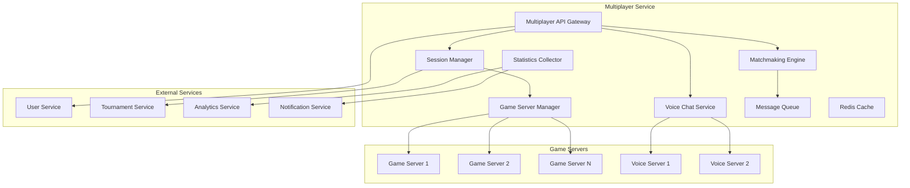

# Дизайн Multiplayer Service

## Обзор

Multiplayer Service является ключевым компонентом российской Steam платформы, обеспечивающим полнофункциональную мультиплеерную экосистему. Сервис включает интеллектуальный матчмейкинг, управление игровыми серверами, голосовую связь, интеграцию с турнирами и корпоративные функции.

## Архитектура

### Высокоуровневая архитектура



### Компонентная архитектура

#### Matchmaking Engine
- Интеллектуальный подбор игроков по навыкам (ELO/MMR)
- Балансировка команд
- Региональный матчмейкинг для минимизации пинга
- Поддержка различных игровых режимов

#### Session Manager
- Создание и управление игровыми сессиями
- Мониторинг состояния сессий
- Обработка подключений и отключений игроков
- Интеграция с турнирными системами

#### Game Server Manager
- Динамическое выделение игровых серверов
- Масштабирование серверной инфраструктуры
- Мониторинг производительности серверов
- Управление конфигурациями игр

#### Voice Chat Service
- Низколатентная голосовая связь
- Адаптивное качество звука
- Пространственный звук для VR игр
- Модерация и фильтрация контента

## Компоненты и интерфейсы

### 1. Multiplayer API Gateway

```typescript
interface MultiplayerAPIGateway {
  // Матчмейкинг
  findMatch(userId: string, gameId: string, preferences: MatchPreferences): Promise<MatchResult>
  cancelMatchmaking(userId: string): Promise<CancelResult>
  
  // Управление сессиями
  createCustomSession(hostId: string, sessionConfig: SessionConfiguration): Promise<SessionResult>
  joinSession(userId: string, sessionId: string, password?: string): Promise<JoinResult>
  leaveSession(userId: string, sessionId: string): Promise<LeaveResult>
  
  // Голосовой чат
  joinVoiceChannel(userId: string, channelId: string): Promise<VoiceJoinResult>
  leaveVoiceChannel(userId: string, channelId: string): Promise<VoiceLeaveResult>
  mutePlayer(userId: string, targetUserId: string): Promise<MuteResult>
  
  // Корпоративные функции
  createCorporateSession(organizationId: string, config: CorporateSessionConfig): Promise<CorporateSessionResult>
  getCorporateStatistics(organizationId: string, period: TimePeriod): Promise<CorporateStats>
}
```

### 2. Matchmaking Engine

```typescript
interface MatchmakingEngine {
  // Поиск матчей
  findPlayers(gameId: string, playerSkill: SkillRating, preferences: MatchPreferences): Promise<PlayerMatch[]>
  balanceTeams(players: Player[], gameMode: GameMode): Promise<TeamBalance>
  estimateWaitTime(gameId: string, playerSkill: SkillRating): Promise<number>
  
  // Управление очередями
  addToQueue(player: Player, gameId: string, preferences: MatchPreferences): Promise<QueueResult>
  removeFromQueue(playerId: string): Promise<RemoveResult>
  getQueueStatus(playerId: string): Promise<QueueStatus>
  
  // Рейтинговая система
  updatePlayerRating(playerId: string, gameResult: GameResult): Promise<RatingUpdate>
  getPlayerRating(playerId: string, gameId: string): Promise<SkillRating>
  calculateRatingChange(match: MatchResult): Promise<RatingChange[]>
}
```

### 3. Session Manager

```typescript
interface SessionManager {
  // Управление сессиями
  createSession(config: SessionConfiguration): Promise<GameSession>
  updateSession(sessionId: string, updates: SessionUpdate): Promise<UpdateResult>
  terminateSession(sessionId: string, reason: TerminationReason): Promise<TerminationResult>
  
  // Управление игроками
  addPlayerToSession(sessionId: string, playerId: string): Promise<AddPlayerResult>
  removePlayerFromSession(sessionId: string, playerId: string): Promise<RemovePlayerResult>
  transferHost(sessionId: string, newHostId: string): Promise<TransferResult>
  
  // Мониторинг
  getSessionStatus(sessionId: string): Promise<SessionStatus>
  getActiveSessions(gameId?: string): Promise<GameSession[]>
  getSessionStatistics(sessionId: string): Promise<SessionStatistics>
}
```

### 4. Game Server Manager

```typescript
interface GameServerManager {
  // Управление серверами
  allocateServer(gameId: string, requirements: ServerRequirements): Promise<GameServer>
  deallocateServer(serverId: string): Promise<DeallocationResult>
  getServerStatus(serverId: string): Promise<ServerStatus>
  
  // Конфигурация
  deployGameConfiguration(gameId: string, config: GameConfiguration): Promise<DeploymentResult>
  updateServerConfiguration(serverId: string, config: ServerConfiguration): Promise<UpdateResult>
  
  // Мониторинг
  getServerMetrics(serverId: string): Promise<ServerMetrics>
  getServerLogs(serverId: string, logLevel: LogLevel): Promise<ServerLogs>
  healthCheck(serverId: string): Promise<HealthStatus>
}
```

### 5. Voice Chat Service

```typescript
interface VoiceChatService {
  // Управление каналами
  createVoiceChannel(sessionId: string, channelConfig: VoiceChannelConfig): Promise<VoiceChannel>
  deleteVoiceChannel(channelId: string): Promise<DeleteResult>
  
  // Управление участниками
  addUserToChannel(channelId: string, userId: string): Promise<VoiceJoinResult>
  removeUserFromChannel(channelId: string, userId: string): Promise<VoiceLeaveResult>
  
  // Аудио управление
  muteUser(channelId: string, userId: string, muted: boolean): Promise<MuteResult>
  adjustVolume(channelId: string, userId: string, volume: number): Promise<VolumeResult>
  enableSpatialAudio(channelId: string, enabled: boolean): Promise<SpatialAudioResult>
  
  // Модерация
  reportUser(reporterId: string, targetUserId: string, reason: ReportReason): Promise<ReportResult>
  applyVoiceFilter(channelId: string, filter: VoiceFilter): Promise<FilterResult>
}
```

## Модели данных

### Game Session
```typescript
interface GameSession {
  id: string
  gameId: string
  hostId: string
  serverId?: string
  status: SessionStatus
  players: SessionPlayer[]
  configuration: SessionConfiguration
  voiceChannelId?: string
  createdAt: Date
  startedAt?: Date
  endedAt?: Date
  maxPlayers: number
  isPrivate: boolean
  password?: string
  region: string
  gameMode: string
  isTournament: boolean
  organizationId?: string
}

enum SessionStatus {
  WAITING = 'waiting',
  STARTING = 'starting',
  ACTIVE = 'active',
  PAUSED = 'paused',
  ENDING = 'ending',
  COMPLETED = 'completed',
  CANCELLED = 'cancelled'
}

interface SessionPlayer {
  userId: string
  teamId?: string
  role?: PlayerRole
  joinedAt: Date
  isReady: boolean
  ping: number
  status: PlayerStatus
}
```

### Match Preferences
```typescript
interface MatchPreferences {
  gameMode: string
  region: string[]
  maxPing: number
  skillRange: SkillRange
  teamSize: number
  allowCrossPlatform: boolean
  voiceChatRequired: boolean
  competitiveMode: boolean
}

interface SkillRange {
  min: number
  max: number
  preferred: number
}

interface SkillRating {
  rating: number
  confidence: number
  gamesPlayed: number
  winRate: number
  lastUpdated: Date
}
```

### Voice Channel
```typescript
interface VoiceChannel {
  id: string
  sessionId: string
  name: string
  participants: VoiceParticipant[]
  configuration: VoiceChannelConfig
  createdAt: Date
  isActive: boolean
}

interface VoiceParticipant {
  userId: string
  isMuted: boolean
  isSpeaking: boolean
  volume: number
  joinedAt: Date
  ping: number
}

interface VoiceChannelConfig {
  maxParticipants: number
  spatialAudioEnabled: boolean
  noiseSuppressionEnabled: boolean
  echoCancellationEnabled: boolean
  bitrate: number
  codec: AudioCodec
}
```

### Game Server
```typescript
interface GameServer {
  id: string
  gameId: string
  region: string
  ipAddress: string
  port: number
  status: ServerStatus
  currentPlayers: number
  maxPlayers: number
  configuration: GameConfiguration
  metrics: ServerMetrics
  allocatedAt: Date
  lastHeartbeat: Date
}

enum ServerStatus {
  STARTING = 'starting',
  READY = 'ready',
  ACTIVE = 'active',
  FULL = 'full',
  STOPPING = 'stopping',
  STOPPED = 'stopped',
  ERROR = 'error'
}

interface ServerMetrics {
  cpuUsage: number
  memoryUsage: number
  networkLatency: number
  tickRate: number
  playerCount: number
  uptime: number
}
```

## Обработка ошибок

### Error Handling Strategy

```typescript
interface MultiplayerError {
  code: MultiplayerErrorCode
  message: string
  sessionId?: string
  userId?: string
  details?: any
  timestamp: Date
}

enum MultiplayerErrorCode {
  // Матчмейкинг
  NO_SUITABLE_PLAYERS = 'NO_SUITABLE_PLAYERS',
  MATCHMAKING_TIMEOUT = 'MATCHMAKING_TIMEOUT',
  SKILL_MISMATCH = 'SKILL_MISMATCH',
  
  // Сессии
  SESSION_FULL = 'SESSION_FULL',
  SESSION_NOT_FOUND = 'SESSION_NOT_FOUND',
  INVALID_PASSWORD = 'INVALID_PASSWORD',
  PERMISSION_DENIED = 'PERMISSION_DENIED',
  
  // Серверы
  NO_AVAILABLE_SERVERS = 'NO_AVAILABLE_SERVERS',
  SERVER_ALLOCATION_FAILED = 'SERVER_ALLOCATION_FAILED',
  SERVER_CONNECTION_FAILED = 'SERVER_CONNECTION_FAILED',
  
  // Голосовой чат
  VOICE_CONNECTION_FAILED = 'VOICE_CONNECTION_FAILED',
  AUDIO_DEVICE_ERROR = 'AUDIO_DEVICE_ERROR',
  VOICE_CHANNEL_FULL = 'VOICE_CHANNEL_FULL'
}
```

### Retry and Recovery Logic
- Автоматический retry для временных сбоев сети
- Graceful degradation при недоступности голосового чата
- Миграция сессий при сбое игрового сервера
- Восстановление состояния после перезапуска сервиса

## Стратегия тестирования

### Unit Tests
- Тестирование алгоритмов матчмейкинга
- Проверка логики балансировки команд
- Тестирование управления сессиями
- Валидация рейтинговых расчетов

### Integration Tests
- Тестирование интеграции с игровыми серверами
- Проверка голосового чата end-to-end
- Тестирование взаимодействия с внешними сервисами
- Проверка корпоративных функций

### Load Tests
- Нагрузочное тестирование матчмейкинга
- Тестирование производительности голосового чата
- Проверка масштабирования игровых серверов
- Стресс-тестирование одновременных сессий

### Performance Tests
- Измерение времени поиска матчей
- Тестирование латентности голосового чата
- Мониторинг использования ресурсов серверов
- Проверка времени отклика API

## Безопасность

### Anti-Cheat Integration
- Интеграция с системами античита
- Мониторинг подозрительной активности
- Автоматическое отключение читеров
- Система репортов и модерации

### Voice Chat Security
- Шифрование голосового трафика
- Фильтрация неприемлемого контента
- Система жалоб на голосовые сообщения
- Автоматическая модерация

### Session Security
- Защита от DDoS атак на игровые серверы
- Валидация всех пользовательских действий
- Предотвращение спуфинга игровых данных
- Аудит всех административных действий

## Производительность и масштабируемость

### Horizontal Scaling
- Автоматическое масштабирование игровых серверов
- Распределение нагрузки матчмейкинга
- Региональное размещение серверов
- Кэширование часто используемых данных

### Optimization Strategies
- Предиктивное выделение серверов
- Оптимизация алгоритмов матчмейкинга
- Сжатие голосового трафика
- Батчинг операций с базой данных

### Monitoring and Alerting
- Мониторинг времени поиска матчей
- Отслеживание качества голосовой связи
- Алерты при превышении лимитов серверов
- Мониторинг пользовательского опыта

## Интеграция с российскими требованиями

### Data Localization
- Хранение игровых данных на российских серверах
- Соблюдение требований по локализации данных
- Интеграция с российскими дата-центрами
- Резервное копирование в пределах РФ

### Compliance
- Соответствие требованиям Роскомнадзора
- Интеграция с российскими системами модерации
- Поддержка российских стандартов шифрования
- Аудит соответствия нормативным требованиям