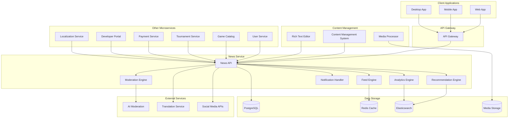
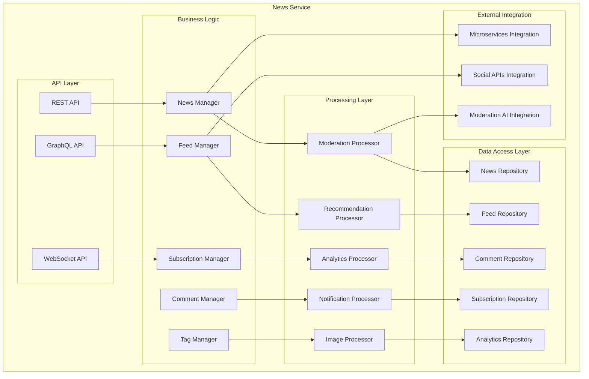

# Дизайн News Service

## Обзор

News Service - это центральный микросервис для управления новостной лентой российской Steam-платформы. Сервис обеспечивает создание, модерацию, персонализацию и распространение новостного контента, интегрируясь со всеми другими микросервисами для создания единой информационной экосистемы.

## Архитектура

### Высокоуровневая архитектура



### Компонентная архитектура



## Компоненты и интерфейсы

### 1. News Manager
**Назначение:** Центральный компонент для управления новостями

**Интерфейсы:**
```typescript
interface NewsManager {
  createNews(news: CreateNewsRequest): Promise<News>
  updateNews(id: string, updates: UpdateNewsRequest): Promise<News>
  deleteNews(id: string): Promise<void>
  getNews(id: string): Promise<News>
  getNewsList(filters: NewsFilters, pagination: Pagination): Promise<NewsList>
  publishNews(id: string): Promise<void>
  scheduleNews(id: string, publishAt: Date): Promise<void>
}

interface News {
  id: string
  title: string
  content: string
  summary: string
  author: Author
  category: NewsCategory
  tags: string[]
  media: MediaContent[]
  status: NewsStatus
  publishedAt?: Date
  scheduledAt?: Date
  metadata: NewsMetadata
  analytics: NewsAnalytics
}

interface CreateNewsRequest {
  title: string
  content: string
  summary?: string
  categoryId: string
  tags: string[]
  media: MediaUpload[]
  scheduledAt?: Date
  targetAudience?: TargetAudience
}

enum NewsStatus {
  DRAFT = 'draft',
  PENDING_MODERATION = 'pending_moderation',
  APPROVED = 'approved',
  PUBLISHED = 'published',
  ARCHIVED = 'archived',
  REJECTED = 'rejected'
}
```

### 2. Feed Manager
**Назначение:** Управление персонализированными новостными лентами

**Интерфейсы:**
```typescript
interface FeedManager {
  getUserFeed(userId: string, pagination: Pagination): Promise<NewsFeed>
  getPersonalizedFeed(userId: string, preferences: UserPreferences): Promise<NewsFeed>
  getTrendingNews(timeframe: TimeFrame): Promise<News[]>
  getNewsByCategory(category: NewsCategory): Promise<News[]>
  markAsRead(userId: string, newsId: string): Promise<void>
  getReadStatus(userId: string, newsIds: string[]): Promise<ReadStatus[]>
}

interface NewsFeed {
  items: FeedItem[]
  hasMore: boolean
  nextCursor?: string
  recommendations: RecommendedNews[]
}

interface FeedItem {
  news: News
  score: number
  reason: RecommendationReason
  readStatus: ReadStatus
  engagement: EngagementMetrics
}

interface UserPreferences {
  categories: NewsCategory[]
  tags: string[]
  developers: string[]
  games: string[]
  languages: string[]
  notificationSettings: NotificationSettings
}
```

### 3. Recommendation Engine
**Назначение:** Персонализация контента и рекомендации

**Интерфейсы:**
```typescript
interface RecommendationEngine {
  getRecommendations(userId: string, context: RecommendationContext): Promise<Recommendation[]>
  updateUserProfile(userId: string, interactions: UserInteraction[]): Promise<void>
  trainModel(trainingData: TrainingData): Promise<ModelMetrics>
  getModelPerformance(): Promise<PerformanceMetrics>
}

interface Recommendation {
  newsId: string
  score: number
  reason: RecommendationReason
  confidence: number
  explanation: string
}

interface UserInteraction {
  newsId: string
  action: InteractionType
  timestamp: Date
  duration?: number
  context: InteractionContext
}

enum InteractionType {
  VIEW = 'view',
  CLICK = 'click',
  SHARE = 'share',
  COMMENT = 'comment',
  LIKE = 'like',
  BOOKMARK = 'bookmark',
  SKIP = 'skip'
}
```

### 4. Moderation Engine
**Назначение:** Автоматическая и ручная модерация контента

**Интерфейсы:**
```typescript
interface ModerationEngine {
  moderateNews(newsId: string): Promise<ModerationResult>
  moderateComment(commentId: string): Promise<ModerationResult>
  reviewFlaggedContent(contentId: string, moderatorId: string): Promise<ModerationDecision>
  getContentForReview(moderatorId: string): Promise<ContentReviewQueue>
  updateModerationRules(rules: ModerationRules): Promise<void>
}

interface ModerationResult {
  contentId: string
  status: ModerationStatus
  confidence: number
  flags: ModerationFlag[]
  suggestedAction: ModerationAction
  explanation: string
}

enum ModerationStatus {
  APPROVED = 'approved',
  REJECTED = 'rejected',
  NEEDS_REVIEW = 'needs_review',
  FLAGGED = 'flagged'
}

interface ModerationFlag {
  type: FlagType
  severity: Severity
  description: string
  autoDetected: boolean
}
```

### 5. Comment Manager
**Назначение:** Управление комментариями и обсуждениями

**Интерфейсы:**
```typescript
interface CommentManager {
  createComment(comment: CreateCommentRequest): Promise<Comment>
  getComments(newsId: string, pagination: Pagination): Promise<CommentList>
  updateComment(commentId: string, updates: UpdateCommentRequest): Promise<Comment>
  deleteComment(commentId: string): Promise<void>
  likeComment(commentId: string, userId: string): Promise<void>
  reportComment(commentId: string, reason: string, reporterId: string): Promise<void>
}

interface Comment {
  id: string
  newsId: string
  authorId: string
  content: string
  parentId?: string
  replies: Comment[]
  likes: number
  dislikes: number
  status: CommentStatus
  createdAt: Date
  updatedAt: Date
}

interface CreateCommentRequest {
  newsId: string
  content: string
  parentId?: string
}
```

### 6. Analytics Engine
**Назначение:** Сбор и анализ метрик новостного контента

**Интерфейсы:**
```typescript
interface AnalyticsEngine {
  trackNewsView(newsId: string, userId: string, context: ViewContext): Promise<void>
  trackUserEngagement(userId: string, engagement: EngagementEvent): Promise<void>
  getNewsAnalytics(newsId: string, timeframe: TimeFrame): Promise<NewsAnalytics>
  getTrendingTopics(timeframe: TimeFrame): Promise<TrendingTopic[]>
  getAudienceInsights(newsId: string): Promise<AudienceInsights>
}

interface NewsAnalytics {
  views: number
  uniqueViews: number
  shares: number
  comments: number
  likes: number
  readTime: number
  bounceRate: number
  engagementRate: number
  demographics: Demographics
}

interface TrendingTopic {
  topic: string
  mentions: number
  growth: number
  sentiment: Sentiment
  relatedNews: string[]
}
```

## Модели данных

### News Schema
```sql
CREATE TABLE news (
    id UUID PRIMARY KEY DEFAULT gen_random_uuid(),
    title VARCHAR(500) NOT NULL,
    content TEXT NOT NULL,
    summary TEXT,
    author_id UUID REFERENCES users(id),
    category_id UUID REFERENCES news_categories(id),
    status news_status DEFAULT 'draft',
    published_at TIMESTAMP,
    scheduled_at TIMESTAMP,
    created_at TIMESTAMP DEFAULT NOW(),
    updated_at TIMESTAMP DEFAULT NOW(),
    metadata JSONB DEFAULT '{}',
    
    CONSTRAINT valid_title_length CHECK (length(title) >= 10),
    CONSTRAINT valid_content_length CHECK (length(content) >= 50)
);

CREATE INDEX idx_news_status ON news(status);
CREATE INDEX idx_news_published_at ON news(published_at DESC);
CREATE INDEX idx_news_category ON news(category_id);
CREATE INDEX idx_news_author ON news(author_id);
```

### Comments Schema
```sql
CREATE TABLE comments (
    id UUID PRIMARY KEY DEFAULT gen_random_uuid(),
    news_id UUID REFERENCES news(id) ON DELETE CASCADE,
    author_id UUID REFERENCES users(id),
    parent_id UUID REFERENCES comments(id),
    content TEXT NOT NULL,
    status comment_status DEFAULT 'published',
    likes INTEGER DEFAULT 0,
    dislikes INTEGER DEFAULT 0,
    created_at TIMESTAMP DEFAULT NOW(),
    updated_at TIMESTAMP DEFAULT NOW(),
    
    CONSTRAINT valid_comment_length CHECK (length(content) >= 1 AND length(content) <= 2000)
);

CREATE INDEX idx_comments_news_id ON comments(news_id);
CREATE INDEX idx_comments_parent_id ON comments(parent_id);
CREATE INDEX idx_comments_created_at ON comments(created_at DESC);
```

### User Subscriptions Schema
```sql
CREATE TABLE user_subscriptions (
    id UUID PRIMARY KEY DEFAULT gen_random_uuid(),
    user_id UUID REFERENCES users(id),
    subscription_type subscription_type NOT NULL,
    target_id UUID NOT NULL,
    notification_enabled BOOLEAN DEFAULT TRUE,
    created_at TIMESTAMP DEFAULT NOW(),
    
    UNIQUE(user_id, subscription_type, target_id)
);

CREATE INDEX idx_subscriptions_user_id ON user_subscriptions(user_id);
CREATE INDEX idx_subscriptions_target ON user_subscriptions(subscription_type, target_id);
```

### News Analytics Schema
```sql
CREATE TABLE news_analytics (
    id UUID PRIMARY KEY DEFAULT gen_random_uuid(),
    news_id UUID REFERENCES news(id),
    user_id UUID REFERENCES users(id),
    event_type analytics_event_type NOT NULL,
    event_data JSONB DEFAULT '{}',
    timestamp TIMESTAMP DEFAULT NOW(),
    session_id VARCHAR(100),
    ip_address INET,
    user_agent TEXT
);

CREATE INDEX idx_analytics_news_id ON news_analytics(news_id);
CREATE INDEX idx_analytics_timestamp ON news_analytics(timestamp DESC);
CREATE INDEX idx_analytics_event_type ON news_analytics(event_type);
```

## Обработка ошибок

### Стратегия обработки ошибок
1. **Graceful Degradation**: При недоступности рекомендаций показ базовой ленты
2. **Circuit Breaker**: Защита от каскадных сбоев внешних сервисов
3. **Retry Logic**: Экспоненциальная задержка для временных сбоев
4. **Fallback Content**: Кэшированный контент при недоступности БД

### Типы ошибок
```typescript
enum NewsErrorType {
  NEWS_NOT_FOUND = 'NEWS_NOT_FOUND',
  INVALID_CONTENT = 'INVALID_CONTENT',
  MODERATION_FAILED = 'MODERATION_FAILED',
  PERMISSION_DENIED = 'PERMISSION_DENIED',
  CONTENT_TOO_LARGE = 'CONTENT_TOO_LARGE',
  DUPLICATE_CONTENT = 'DUPLICATE_CONTENT',
  EXTERNAL_SERVICE_ERROR = 'EXTERNAL_SERVICE_ERROR'
}

interface NewsError {
  type: NewsErrorType
  message: string
  details?: any
  retryable: boolean
}
```

## Стратегия тестирования

### Unit Tests
- Тестирование бизнес-логики компонентов
- Валидация алгоритмов рекомендаций
- Проверка модерации контента
- Тестирование аналитических расчетов

### Integration Tests
- Интеграция с другими микросервисами
- Взаимодействие с внешними API
- Тестирование базы данных
- WebSocket соединения

### Performance Tests
- Нагрузочное тестирование API (5,000 RPS)
- Тестирование времени отклика (<100ms)
- Тестирование рекомендательной системы
- Memory и CPU профилирование

### E2E Tests
- Полный цикл создания и публикации новости
- Пользовательские сценарии чтения и комментирования
- Тестирование персонализации
- Интеграция с клиентскими приложениями

## Безопасность

### Аутентификация и авторизация
- JWT токены для API доступа
- Role-based access control (редакторы, модераторы, пользователи)
- Rate limiting для предотвращения спама
- CSRF защита для веб-интерфейса

### Защита контента
- XSS защита для пользовательского контента
- Content Security Policy (CSP)
- Валидация и санитизация входных данных
- Защита от SQL injection

### Модерация и соответствие
- Автоматическая модерация с ИИ
- Соответствие российскому законодательству
- Блокировка запрещенного контента
- Система жалоб и апелляций

## Мониторинг и метрики

### Ключевые метрики
- News engagement rate (>15%)
- API response time (<100ms)
- Content moderation accuracy (>95%)
- User retention rate
- Feed personalization effectiveness

### Алерты
- High error rate (>1%)
- Slow response time (>200ms)
- Moderation queue overflow
- Spam detection alerts
- Database connection issues

### Дашборды
- Real-time news consumption
- Content performance metrics
- User engagement analytics
- Moderation queue status
- System health monitoring

## Развертывание и масштабирование

### Containerization
```dockerfile
FROM node:18-alpine
WORKDIR /app
COPY package*.json ./
RUN npm ci --only=production
COPY . .
EXPOSE 3000
CMD ["npm", "start"]
```

### Kubernetes Configuration
```yaml
apiVersion: apps/v1
kind: Deployment
metadata:
  name: news-service
spec:
  replicas: 5
  selector:
    matchLabels:
      app: news-service
  template:
    metadata:
      labels:
        app: news-service
    spec:
      containers:
      - name: news-service
        image: news-service:latest
        ports:
        - containerPort: 3000
        env:
        - name: DATABASE_URL
          valueFrom:
            secretKeyRef:
              name: db-secret
              key: url
        - name: REDIS_URL
          valueFrom:
            secretKeyRef:
              name: redis-secret
              key: url
        resources:
          requests:
            memory: "512Mi"
            cpu: "500m"
          limits:
            memory: "1Gi"
            cpu: "1000m"
```

### Масштабирование
- Horizontal Pod Autoscaler на основе CPU/Memory
- Redis Cluster для кэширования
- Elasticsearch cluster для поиска
- CDN для медиа-контента
- Read replicas для аналитики

## Интеграция с другими сервисами

### Game Catalog Service
- Автоматическое создание новостей о релизах
- Интеграция метаданных игр
- Уведомления об обновлениях игр

### User Service
- Персонализация контента
- Управление подписками
- Система предпочтений пользователей

### Tournament Service
- Новости о турнирах и соревнованиях
- Результаты матчей
- Анонсы событий

### Payment Service
- Новости об акциях и скидках
- Специальные предложения
- Сезонные распродажи

### Developer Portal Service
- Новости от разработчиков
- Анонсы обновлений
- Релизные заметки

### Notification Service
- Push-уведомления о важных новостях
- Email-дайджесты
- Персонализированные уведомления

### Localization Service
- Мультиязычный контент
- Региональные новости
- Локализация интерфейса