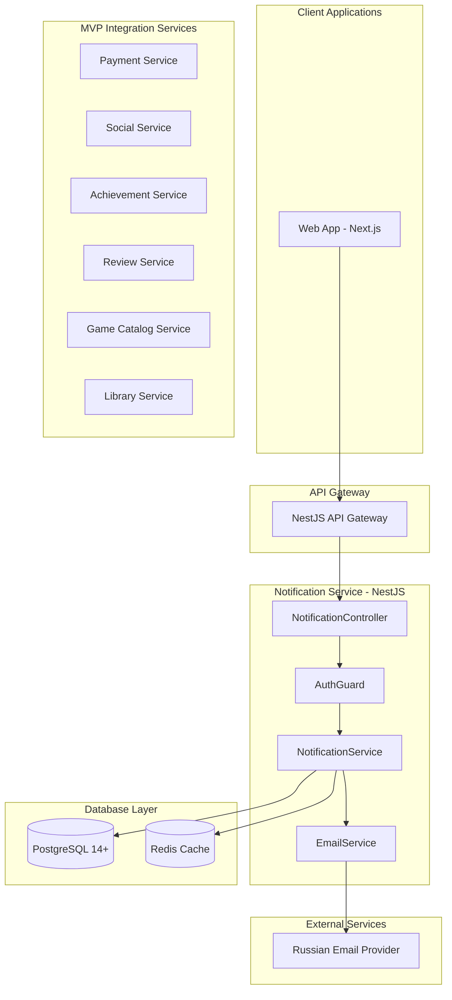

# Design Document - Notification Service MVP

## Overview

Notification Service - базовый микросервис уведомлений для MVP российской игровой платформы, построенный на **NestJS + TypeScript**. Обеспечивает простые уведомления в приложении и email уведомления через REST API.

**Технологический стек:**
- **Framework**: NestJS + TypeScript
- **База данных**: PostgreSQL 14+ (primary), Redis (cache)
- **Тестирование**: Jest + Supertest
- **Документация**: Swagger/OpenAPI
- **Контейнеризация**: Docker + Kubernetes

## Architecture

### NestJS Модульная архитектура MVP



## Components and Interfaces

### NestJS Modules

#### NotificationModule
```typescript
@Module({
  imports: [
    TypeOrmModule.forFeature([Notification, NotificationSettings]),
    CacheModule.register(),
    HttpModule,
  ],
  controllers: [NotificationController],
  providers: [
    NotificationService,
    EmailService,
  ],
  exports: [NotificationService],
})
export class NotificationModule {}
```

### REST API Endpoints

#### NotificationController
```typescript
@Controller('notifications')
@UseGuards(JwtAuthGuard)
@ApiTags('notifications')
export class NotificationController {
  
  @Get('user/:userId')
  @ApiOperation({ summary: 'Получить уведомления пользователя' })
  async getUserNotifications(
    @Param('userId') userId: string,
    @Query() query: GetNotificationsDto
  ): Promise<PaginatedNotificationsDto>

  @Post()
  @ApiOperation({ summary: 'Создать уведомление' })
  async createNotification(
    @Body() createDto: CreateNotificationDto
  ): Promise<NotificationDto>

  @Post('webhook/payment')
  @ApiOperation({ summary: 'Webhook для Payment Service' })
  async handlePaymentEvent(@Body() eventDto: PaymentEventDto): Promise<void>

  @Post('webhook/social')
  @ApiOperation({ summary: 'Webhook для Social Service' })
  async handleSocialEvent(@Body() eventDto: SocialEventDto): Promise<void>

  @Post('webhook/achievement')
  @ApiOperation({ summary: 'Webhook для Achievement Service' })
  async handleAchievementEvent(@Body() eventDto: AchievementEventDto): Promise<void>

  @Post('webhook/review')
  @ApiOperation({ summary: 'Webhook для Review Service' })
  async handleReviewEvent(@Body() eventDto: ReviewEventDto): Promise<void>

  @Put(':id/read')
  @ApiOperation({ summary: 'Отметить как прочитанное' })
  async markAsRead(@Param('id') id: string): Promise<void>

  @Get('settings/:userId')
  @ApiOperation({ summary: 'Получить настройки уведомлений' })
  async getSettings(@Param('userId') userId: string): Promise<NotificationSettingsDto>

  @Put('settings/:userId')
  @ApiOperation({ summary: 'Обновить настройки уведомлений' })
  async updateSettings(
    @Param('userId') userId: string,
    @Body() settingsDto: UpdateNotificationSettingsDto
  ): Promise<NotificationSettingsDto>
}
```

### NestJS Services

#### NotificationService
```typescript
@Injectable()
export class NotificationService {
  constructor(
    @InjectRepository(Notification)
    private notificationRepository: Repository<Notification>,
    @InjectRepository(NotificationSettings)
    private settingsRepository: Repository<NotificationSettings>,
    @Inject(CACHE_MANAGER) private cacheManager: Cache,
    private emailService: EmailService,
  ) {}

  async createNotification(dto: CreateNotificationDto): Promise<Notification>
  async getUserNotifications(userId: string, query: GetNotificationsDto): Promise<PaginatedResult<Notification>>
  async markAsRead(notificationId: string): Promise<void>
  async getSettings(userId: string): Promise<NotificationSettings>
  async updateSettings(userId: string, settings: UpdateNotificationSettingsDto): Promise<NotificationSettings>
}
```

#### EmailService
```typescript
@Injectable()
export class EmailService {
  constructor(
    private configService: ConfigService,
    private httpService: HttpService,
  ) {}

  async sendEmail(to: string, subject: string, template: string, data: any): Promise<void>
  async sendNotificationEmail(userId: string, notification: Notification): Promise<void>
}
```

## Data Models

### TypeORM Entities

#### Notification Entity
```typescript
@Entity('notifications')
export class Notification {
  @PrimaryGeneratedColumn('uuid')
  id: string;

  @Column('uuid')
  @Index()
  userId: string;

  @Column({
    type: 'enum',
    enum: NotificationType,
  })
  type: NotificationType;

  @Column()
  title: string;

  @Column('text')
  message: string;

  @Column({ default: false })
  isRead: boolean;

  @Column({
    type: 'enum',
    enum: NotificationPriority,
    default: NotificationPriority.NORMAL,
  })
  priority: NotificationPriority;

  @Column('jsonb', { nullable: true })
  metadata: Record<string, any>;

  @Column('jsonb', { nullable: true })
  channels: NotificationChannel[];

  @CreateDateColumn()
  @Index()
  createdAt: Date;

  @UpdateDateColumn()
  updatedAt: Date;

  @Column({ nullable: true })
  expiresAt: Date;
}

enum NotificationType {
  FRIEND_REQUEST = 'friend_request',
  GAME_UPDATE = 'game_update',
  ACHIEVEMENT = 'achievement',
  PURCHASE = 'purchase',
  SYSTEM = 'system',
}

enum NotificationPriority {
  NORMAL = 'normal',
  HIGH = 'high',
}

enum NotificationChannel {
  IN_APP = 'in_app',
  EMAIL = 'email',
}
```

#### NotificationSettings Entity
```typescript
@Entity('notification_settings')
export class NotificationSettings {
  @PrimaryGeneratedColumn('uuid')
  id: string;

  @Column('uuid', { unique: true })
  @Index()
  userId: string;

  @Column({ default: true })
  inAppNotifications: boolean;

  @Column({ default: true })
  emailNotifications: boolean;

  // Настройки по типам уведомлений
  @Column({ default: true })
  friendRequests: boolean;

  @Column({ default: true })
  gameUpdates: boolean;

  @Column({ default: true })
  achievements: boolean;

  @Column({ default: true })
  purchases: boolean;

  @Column({ default: true })
  systemNotifications: boolean;

  @UpdateDateColumn()
  updatedAt: Date;
}
```


### DTOs

#### CreateNotificationDto
```typescript
export class CreateNotificationDto {
  @IsUUID()
  @ApiProperty()
  userId: string;

  @IsEnum(NotificationType)
  @ApiProperty()
  type: NotificationType;

  @IsString()
  @MaxLength(200)
  @ApiProperty()
  title: string;

  @IsString()
  @MaxLength(1000)
  @ApiProperty()
  message: string;

  @IsEnum(NotificationPriority)
  @IsOptional()
  @ApiProperty()
  priority?: NotificationPriority;

  @IsArray()
  @IsEnum(NotificationChannel, { each: true })
  @IsOptional()
  @ApiProperty()
  channels?: NotificationChannel[];

  @IsObject()
  @IsOptional()
  @ApiProperty()
  metadata?: Record<string, any>;

  @IsDateString()
  @IsOptional()
  @ApiProperty()
  expiresAt?: Date;
}
```

#### GetNotificationsDto
```typescript
export class GetNotificationsDto {
  @IsOptional()
  @IsInt()
  @Min(1)
  @Max(100)
  @Type(() => Number)
  @ApiProperty({ default: 20 })
  limit?: number = 20;

  @IsOptional()
  @IsInt()
  @Min(0)
  @Type(() => Number)
  @ApiProperty({ default: 0 })
  offset?: number = 0;

  @IsOptional()
  @IsEnum(NotificationType)
  @ApiProperty()
  type?: NotificationType;

  @IsOptional()
  @IsBoolean()
  @Type(() => Boolean)
  @ApiProperty()
  isRead?: boolean;
}
```

## Error Handling

### NestJS Exception Filters

#### Custom Exceptions
```typescript
export class NotificationNotFoundException extends NotFoundException {
  constructor(id: string) {
    super(`Notification with ID ${id} not found`);
  }
}

export class EmailDeliveryException extends BadRequestException {
  constructor(error: string) {
    super(`Email delivery failed: ${error}`);
  }
}

export class PushNotificationException extends BadRequestException {
  constructor(error: string) {
    super(`Push notification failed: ${error}`);
  }
}

export class NotificationSettingsNotFoundException extends NotFoundException {
  constructor(userId: string) {
    super(`Notification settings for user ${userId} not found`);
  }
}
```

#### Global Exception Filter
```typescript
@Catch()
export class AllExceptionsFilter implements ExceptionFilter {
  catch(exception: unknown, host: ArgumentsHost) {
    const ctx = host.switchToHttp();
    const response = ctx.getResponse<Response>();
    const request = ctx.getRequest<Request>();

    const status = exception instanceof HttpException 
      ? exception.getStatus() 
      : HttpStatus.INTERNAL_SERVER_ERROR;

    const message = exception instanceof HttpException
      ? exception.getResponse()
      : 'Internal server error';

    this.logger.error(`${request.method} ${request.url}`, exception);

    response.status(status).json({
      statusCode: status,
      timestamp: new Date().toISOString(),
      path: request.url,
      message,
    });
  }
}
```

### Validation

#### Pipes
```typescript
@Injectable()
export class NotificationValidationPipe implements PipeTransform {
  transform(value: any, metadata: ArgumentMetadata) {
    // Custom validation logic
    return value;
  }
}
```

## Testing Strategy

### Jest Configuration
```typescript
// jest.config.js
module.exports = {
  moduleFileExtensions: ['js', 'json', 'ts'],
  rootDir: 'src',
  testRegex: '.*\\.spec\\.ts$',
  transform: {
    '^.+\\.(t|j)s$': 'ts-jest',
  },
  collectCoverageFrom: [
    '**/*.(t|j)s',
    '!**/*.spec.ts',
    '!**/node_modules/**',
  ],
  coverageDirectory: '../coverage',
  testEnvironment: 'node',
  coverageThreshold: {
    global: {
      branches: 80,
      functions: 80,
      lines: 80,
      statements: 80,
    },
  },
};
```

### Unit Tests
```typescript
describe('NotificationService', () => {
  let service: NotificationService;
  let repository: Repository<Notification>;

  beforeEach(async () => {
    const module: TestingModule = await Test.createTestingModule({
      providers: [
        NotificationService,
        {
          provide: getRepositoryToken(Notification),
          useClass: Repository,
        },
      ],
    }).compile();

    service = module.get<NotificationService>(NotificationService);
    repository = module.get<Repository<Notification>>(getRepositoryToken(Notification));
  });

  it('should create notification', async () => {
    // Test implementation
  });
});
```

### Integration Tests
```typescript
describe('NotificationController (e2e)', () => {
  let app: INestApplication;

  beforeEach(async () => {
    const moduleFixture: TestingModule = await Test.createTestingModule({
      imports: [NotificationModule],
    }).compile();

    app = moduleFixture.createNestApplication();
    await app.init();
  });

  it('/notifications (POST)', () => {
    return request(app.getHttpServer())
      .post('/notifications')
      .send(createNotificationDto)
      .expect(201);
  });
});
```

### Mock Services
```typescript
export const mockEmailService = {
  sendEmail: jest.fn(),
  sendNotificationEmail: jest.fn(),
};
```

## Performance & Scalability

### Caching Strategy
- Redis для кеширования настроек пользователей
- Базовое кеширование для MVP

### Database Optimization
- Индексы на userId и createdAt
- Базовая оптимизация для MVP

## Security

### Authentication & Authorization
- JWT токены для аутентификации
- Базовая авторизация для MVP