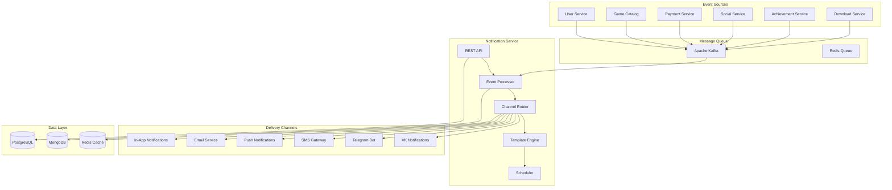
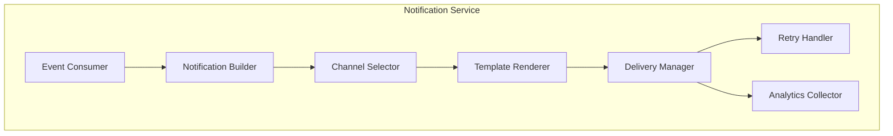
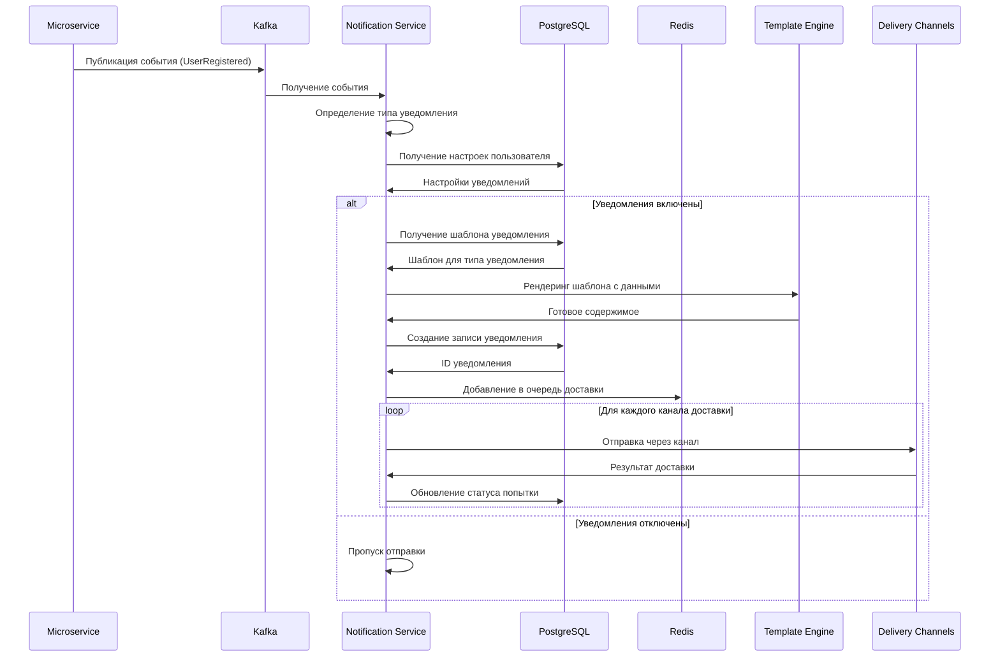
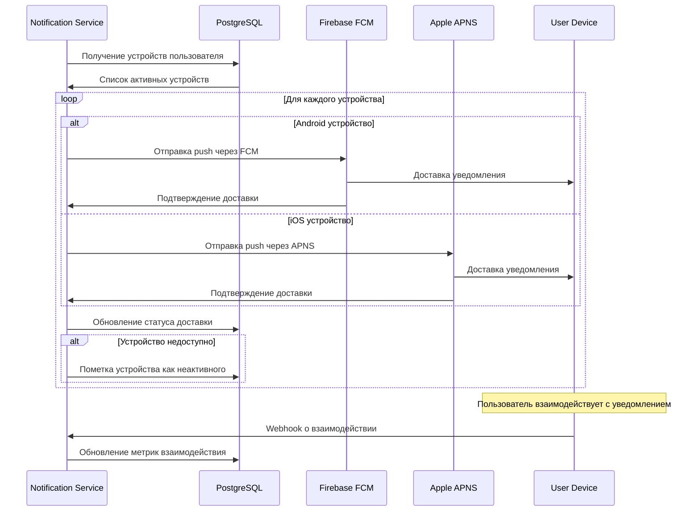
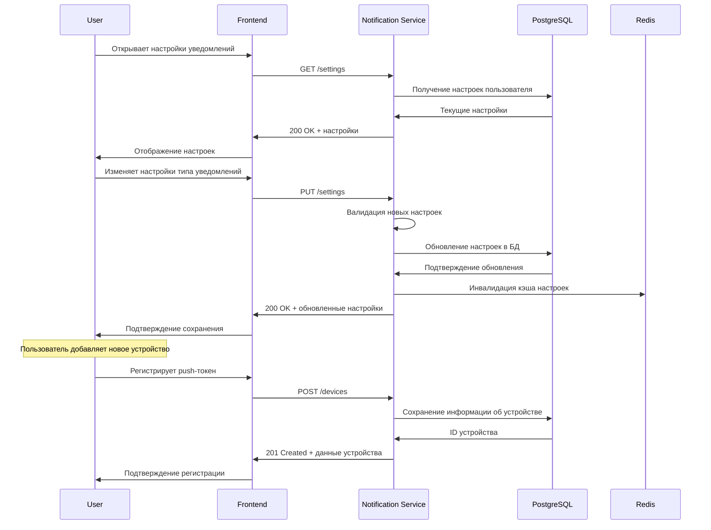
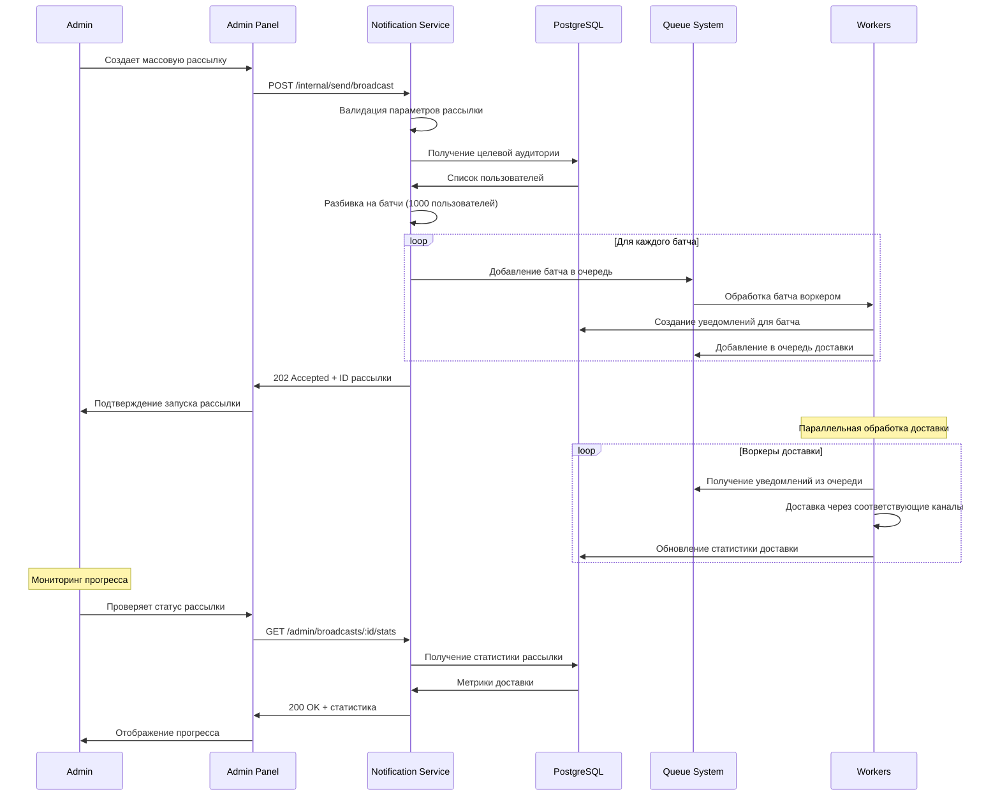

# Дизайн Notification Service

## Обзор

Notification Service является центральным сервисом для доставки уведомлений пользователям российской игровой платформы через различные каналы: в приложении, email, push-уведомления, SMS и Telegram. Сервис обеспечивает надежную доставку, персонализацию и соблюдение пользовательских предпочтений.

### Ключевые принципы дизайна

- **Многоканальность**: Поддержка всех популярных каналов доставки
- **Надежность**: Гарантированная доставка критически важных уведомлений
- **Персонализация**: Учет предпочтений и поведения пользователей
- **Производительность**: Обработка до 1 миллиона уведомлений в час
- **Соответствие законодательству**: Соблюдение российских требований по рассылкам

## Архитектура

### Общая архитектура



### Компонентная архитектура



## API Эндпоинты и маршруты

### Структура API

```
Base URL: https://api.gaming-platform.ru/notification-service/v1
```

### Public Endpoints

```typescript
// Получение уведомлений пользователя
GET    /notifications                    // Список уведомлений пользователя
GET    /notifications/unread            // Непрочитанные уведомления
PUT    /notifications/:id/read          // Отметить как прочитанное
PUT    /notifications/mark-all-read     // Отметить все как прочитанные
DELETE /notifications/:id              // Удалить уведомление

// Настройки уведомлений
GET    /settings                       // Получить настройки уведомлений
PUT    /settings                       // Обновить настройки
GET    /settings/channels              // Доступные каналы доставки
PUT    /settings/channels/:channel     // Настройки конкретного канала

// Подписки
GET    /subscriptions                  // Список подписок пользователя
POST   /subscriptions                  // Создать подписку
DELETE /subscriptions/:id              // Отписаться

// Устройства для push-уведомлений
POST   /devices                        // Регистрация устройства
PUT    /devices/:id                    // Обновление токена устройства
DELETE /devices/:id                    // Удаление устройства
```

### Internal API (для других сервисов)

```typescript
// Отправка уведомлений
POST   /internal/send                  // Отправить уведомление
POST   /internal/send/bulk             // Массовая отправка
POST   /internal/send/broadcast        // Широковещательная рассылка

// Шаблоны уведомлений
GET    /internal/templates             // Список шаблонов
POST   /internal/templates             // Создать шаблон
PUT    /internal/templates/:id         // Обновить шаблон
DELETE /internal/templates/:id         // Удалить шаблон

// Статистика
GET    /internal/stats/delivery        // Статистика доставки
GET    /internal/stats/engagement      // Статистика взаимодействий
```

### Admin Endpoints

```typescript
// Управление уведомлениями
GET    /admin/notifications            // Все уведомления в системе
GET    /admin/notifications/failed     // Неудачные доставки
POST   /admin/notifications/resend     // Повторная отправка

// Управление шаблонами
GET    /admin/templates                // Все шаблоны
POST   /admin/templates/test           // Тестирование шаблона
PUT    /admin/templates/:id/activate   // Активация шаблона

// Аналитика и отчеты
GET    /admin/analytics/delivery       // Аналитика доставки
GET    /admin/analytics/channels       // Эффективность каналов
GET    /admin/reports/compliance       // Отчеты соответствия
```

## Модели данных

### Основные сущности

```typescript
interface Notification {
  id: string
  userId: string
  
  // Содержание
  type: NotificationType
  title: string
  message: string
  data: Record<string, any>
  
  // Доставка
  channels: DeliveryChannel[]
  priority: NotificationPriority
  
  // Статус
  status: NotificationStatus
  deliveryAttempts: DeliveryAttempt[]
  
  // Планирование
  scheduledAt?: Date
  expiresAt?: Date
  
  // Метаданные
  createdAt: Date
  updatedAt: Date
  readAt?: Date
  clickedAt?: Date
  
  // Группировка
  groupKey?: string
  replaces?: string // ID уведомления для замены
}

interface NotificationTemplate {
  id: string
  name: string
  type: NotificationType
  
  // Шаблоны для разных каналов
  templates: {
    inApp: InAppTemplate
    email: EmailTemplate
    push: PushTemplate
    sms: SmsTemplate
    telegram: TelegramTemplate
  }
  
  // Настройки
  defaultChannels: DeliveryChannel[]
  priority: NotificationPriority
  
  // Локализация
  localizations: Record<string, LocalizedTemplate>
  
  // Статус
  isActive: boolean
  version: number
  
  createdAt: Date
  updatedAt: Date
}

interface UserNotificationSettings {
  userId: string
  
  // Общие настройки
  globalEnabled: boolean
  quietHours: {
    enabled: boolean
    start: string // HH:mm
    end: string   // HH:mm
    timezone: string
  }
  
  // Настройки по типам
  typeSettings: Record<NotificationType, TypeSettings>
  
  // Настройки каналов
  channelSettings: Record<DeliveryChannel, ChannelSettings>
  
  updatedAt: Date
}

interface TypeSettings {
  enabled: boolean
  channels: DeliveryChannel[]
  frequency: 'immediate' | 'hourly' | 'daily' | 'weekly'
  priority: NotificationPriority
}

interface ChannelSettings {
  enabled: boolean
  address?: string // email, phone, telegram username
  verified: boolean
  preferences: Record<string, any>
}

interface DeliveryAttempt {
  id: string
  notificationId: string
  channel: DeliveryChannel
  
  // Попытка доставки
  attemptNumber: number
  status: 'pending' | 'sent' | 'delivered' | 'failed' | 'bounced'
  
  // Детали
  providerId?: string // ID в внешней системе
  error?: string
  response?: any
  
  // Метрики
  sentAt?: Date
  deliveredAt?: Date
  openedAt?: Date
  clickedAt?: Date
  
  createdAt: Date
}

interface UserDevice {
  id: string
  userId: string
  
  // Устройство
  deviceType: 'ios' | 'android' | 'web'
  deviceToken: string
  deviceInfo: {
    model?: string
    os?: string
    appVersion?: string
    language?: string
  }
  
  // Статус
  isActive: boolean
  lastSeenAt: Date
  
  createdAt: Date
  updatedAt: Date
}

enum NotificationType {
  // Социальные
  FRIEND_REQUEST = 'friend_request',
  FRIEND_ACCEPTED = 'friend_accepted',
  GAME_INVITE = 'game_invite',
  MESSAGE_RECEIVED = 'message_received',
  
  // Игровые
  ACHIEVEMENT_UNLOCKED = 'achievement_unlocked',
  GAME_UPDATE_AVAILABLE = 'game_update_available',
  DOWNLOAD_COMPLETED = 'download_completed',
  
  // Коммерческие
  GAME_ON_SALE = 'game_on_sale',
  WISHLIST_ITEM_DISCOUNTED = 'wishlist_item_discounted',
  PAYMENT_COMPLETED = 'payment_completed',
  
  // Системные
  SECURITY_ALERT = 'security_alert',
  MAINTENANCE_NOTICE = 'maintenance_notice',
  ACCOUNT_VERIFICATION = 'account_verification'
}

enum DeliveryChannel {
  IN_APP = 'in_app',
  EMAIL = 'email',
  PUSH = 'push',
  SMS = 'sms',
  TELEGRAM = 'telegram',
  VK = 'vk'
}

enum NotificationPriority {
  LOW = 'low',
  NORMAL = 'normal',
  HIGH = 'high',
  CRITICAL = 'critical'
}
```

## Детальная схема базы данных

```sql
-- Уведомления
CREATE TABLE notifications (
    id UUID PRIMARY KEY DEFAULT gen_random_uuid(),
    user_id UUID NOT NULL,
    
    -- Содержание
    type VARCHAR(50) NOT NULL,
    title VARCHAR(255) NOT NULL,
    message TEXT NOT NULL,
    data JSONB DEFAULT '{}',
    
    -- Доставка
    channels TEXT[] NOT NULL,
    priority VARCHAR(20) DEFAULT 'normal' CHECK (priority IN ('low', 'normal', 'high', 'critical')),
    
    -- Статус
    status VARCHAR(20) DEFAULT 'pending' CHECK (status IN ('pending', 'processing', 'sent', 'delivered', 'failed', 'expired')),
    
    -- Планирование
    scheduled_at TIMESTAMP,
    expires_at TIMESTAMP,
    
    -- Взаимодействие
    read_at TIMESTAMP,
    clicked_at TIMESTAMP,
    
    -- Группировка
    group_key VARCHAR(255),
    replaces UUID REFERENCES notifications(id),
    
    created_at TIMESTAMP DEFAULT NOW(),
    updated_at TIMESTAMP DEFAULT NOW()
);

-- Шаблоны уведомлений
CREATE TABLE notification_templates (
    id UUID PRIMARY KEY DEFAULT gen_random_uuid(),
    name VARCHAR(100) UNIQUE NOT NULL,
    type VARCHAR(50) NOT NULL,
    
    -- Шаблоны
    in_app_template JSONB,
    email_template JSONB,
    push_template JSONB,
    sms_template JSONB,
    telegram_template JSONB,
    
    -- Настройки
    default_channels TEXT[] DEFAULT '{}',
    priority VARCHAR(20) DEFAULT 'normal',
    
    -- Локализация
    localizations JSONB DEFAULT '{}',
    
    -- Статус
    is_active BOOLEAN DEFAULT TRUE,
    version INTEGER DEFAULT 1,
    
    created_at TIMESTAMP DEFAULT NOW(),
    updated_at TIMESTAMP DEFAULT NOW()
);

-- Настройки уведомлений пользователей
CREATE TABLE user_notification_settings (
    user_id UUID PRIMARY KEY,
    
    -- Общие настройки
    global_enabled BOOLEAN DEFAULT TRUE,
    quiet_hours JSONB DEFAULT '{"enabled": false}',
    
    -- Настройки по типам
    type_settings JSONB DEFAULT '{}',
    
    -- Настройки каналов
    channel_settings JSONB DEFAULT '{}',
    
    updated_at TIMESTAMP DEFAULT NOW()
);

-- Попытки доставки
CREATE TABLE delivery_attempts (
    id UUID PRIMARY KEY DEFAULT gen_random_uuid(),
    notification_id UUID NOT NULL REFERENCES notifications(id) ON DELETE CASCADE,
    channel VARCHAR(20) NOT NULL,
    
    -- Попытка
    attempt_number INTEGER NOT NULL,
    status VARCHAR(20) DEFAULT 'pending' CHECK (status IN ('pending', 'sent', 'delivered', 'failed', 'bounced')),
    
    -- Детали
    provider_id VARCHAR(255),
    error_message TEXT,
    response_data JSONB,
    
    -- Метрики
    sent_at TIMESTAMP,
    delivered_at TIMESTAMP,
    opened_at TIMESTAMP,
    clicked_at TIMESTAMP,
    
    created_at TIMESTAMP DEFAULT NOW()
);

-- Устройства пользователей
CREATE TABLE user_devices (
    id UUID PRIMARY KEY DEFAULT gen_random_uuid(),
    user_id UUID NOT NULL,
    
    -- Устройство
    device_type VARCHAR(20) NOT NULL CHECK (device_type IN ('ios', 'android', 'web')),
    device_token VARCHAR(500) NOT NULL,
    device_info JSONB DEFAULT '{}',
    
    -- Статус
    is_active BOOLEAN DEFAULT TRUE,
    last_seen_at TIMESTAMP DEFAULT NOW(),
    
    created_at TIMESTAMP DEFAULT NOW(),
    updated_at TIMESTAMP DEFAULT NOW(),
    
    UNIQUE(user_id, device_token)
);

-- Подписки пользователей
CREATE TABLE user_subscriptions (
    id UUID PRIMARY KEY DEFAULT gen_random_uuid(),
    user_id UUID NOT NULL,
    
    -- Подписка
    subscription_type VARCHAR(50) NOT NULL,
    target_id VARCHAR(255), -- ID игры, разработчика, etc.
    
    -- Настройки
    channels TEXT[] DEFAULT '{}',
    frequency VARCHAR(20) DEFAULT 'immediate',
    
    -- Статус
    is_active BOOLEAN DEFAULT TRUE,
    
    created_at TIMESTAMP DEFAULT NOW(),
    
    UNIQUE(user_id, subscription_type, target_id)
);

-- Статистика доставки
CREATE TABLE delivery_stats (
    id UUID PRIMARY KEY DEFAULT gen_random_uuid(),
    date DATE NOT NULL,
    hour INTEGER NOT NULL CHECK (hour >= 0 AND hour <= 23),
    
    -- Группировка
    notification_type VARCHAR(50) NOT NULL,
    channel VARCHAR(20) NOT NULL,
    
    -- Метрики
    sent_count INTEGER DEFAULT 0,
    delivered_count INTEGER DEFAULT 0,
    opened_count INTEGER DEFAULT 0,
    clicked_count INTEGER DEFAULT 0,
    failed_count INTEGER DEFAULT 0,
    
    -- Производительность
    avg_delivery_time INTEGER DEFAULT 0, -- миллисекунды
    
    created_at TIMESTAMP DEFAULT NOW(),
    
    UNIQUE(date, hour, notification_type, channel)
);

-- Индексы для производительности
CREATE INDEX idx_notifications_user_created ON notifications(user_id, created_at DESC);
CREATE INDEX idx_notifications_status ON notifications(status, created_at) WHERE status IN ('pending', 'processing');
CREATE INDEX idx_notifications_scheduled ON notifications(scheduled_at) WHERE scheduled_at IS NOT NULL AND status = 'pending';
CREATE INDEX idx_notifications_expires ON notifications(expires_at) WHERE expires_at IS NOT NULL;
CREATE INDEX idx_notifications_type ON notifications(type, created_at DESC);
CREATE INDEX idx_notifications_group ON notifications(group_key, created_at DESC) WHERE group_key IS NOT NULL;

CREATE INDEX idx_delivery_attempts_notification ON delivery_attempts(notification_id, attempt_number);
CREATE INDEX idx_delivery_attempts_status ON delivery_attempts(status, created_at) WHERE status = 'pending';
CREATE INDEX idx_delivery_attempts_channel ON delivery_attempts(channel, created_at DESC);

CREATE INDEX idx_user_devices_user_active ON user_devices(user_id, is_active) WHERE is_active = TRUE;
CREATE INDEX idx_user_devices_token ON user_devices(device_token);

CREATE INDEX idx_user_subscriptions_user ON user_subscriptions(user_id, is_active) WHERE is_active = TRUE;
CREATE INDEX idx_user_subscriptions_type ON user_subscriptions(subscription_type, target_id);

CREATE INDEX idx_delivery_stats_date_type ON delivery_stats(date DESC, notification_type, channel);

-- Триггеры для автоматического обновления статистики
CREATE OR REPLACE FUNCTION update_delivery_stats()
RETURNS TRIGGER AS $$
BEGIN
    IF TG_OP = 'INSERT' OR (TG_OP = 'UPDATE' AND OLD.status != NEW.status) THEN
        INSERT INTO delivery_stats (date, hour, notification_type, channel, sent_count, delivered_count, opened_count, clicked_count, failed_count)
        SELECT 
            DATE(n.created_at),
            EXTRACT(HOUR FROM n.created_at)::INTEGER,
            n.type,
            NEW.channel,
            CASE WHEN NEW.status = 'sent' THEN 1 ELSE 0 END,
            CASE WHEN NEW.status = 'delivered' THEN 1 ELSE 0 END,
            CASE WHEN NEW.opened_at IS NOT NULL THEN 1 ELSE 0 END,
            CASE WHEN NEW.clicked_at IS NOT NULL THEN 1 ELSE 0 END,
            CASE WHEN NEW.status = 'failed' THEN 1 ELSE 0 END
        FROM notifications n
        WHERE n.id = NEW.notification_id
        ON CONFLICT (date, hour, notification_type, channel)
        DO UPDATE SET
            sent_count = delivery_stats.sent_count + CASE WHEN NEW.status = 'sent' THEN 1 ELSE 0 END,
            delivered_count = delivery_stats.delivered_count + CASE WHEN NEW.status = 'delivered' THEN 1 ELSE 0 END,
            opened_count = delivery_stats.opened_count + CASE WHEN NEW.opened_at IS NOT NULL THEN 1 ELSE 0 END,
            clicked_count = delivery_stats.clicked_count + CASE WHEN NEW.clicked_at IS NOT NULL THEN 1 ELSE 0 END,
            failed_count = delivery_stats.failed_count + CASE WHEN NEW.status = 'failed' THEN 1 ELSE 0 END;
    END IF;
    
    RETURN NEW;
END;
$$ LANGUAGE plpgsql;

CREATE TRIGGER trigger_update_delivery_stats
    AFTER INSERT OR UPDATE ON delivery_attempts
    FOR EACH ROW EXECUTE FUNCTION update_delivery_stats();
```

## User Flows (Пользовательские сценарии)

### 1. Отправка уведомления



### 2. Доставка push-уведомления



### 3. Управление настройками уведомлений



### 4. Обработка массовых уведомлений



Этот дизайн обеспечивает надежную, масштабируемую и гибкую систему уведомлений для российской игровой платформы с поддержкой всех популярных каналов доставки и соблюдением пользовательских предпочтений.