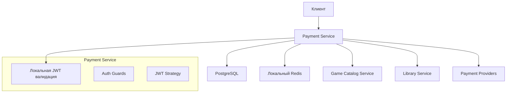
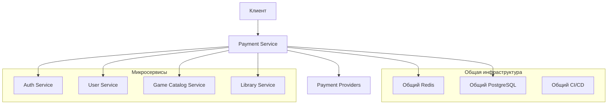
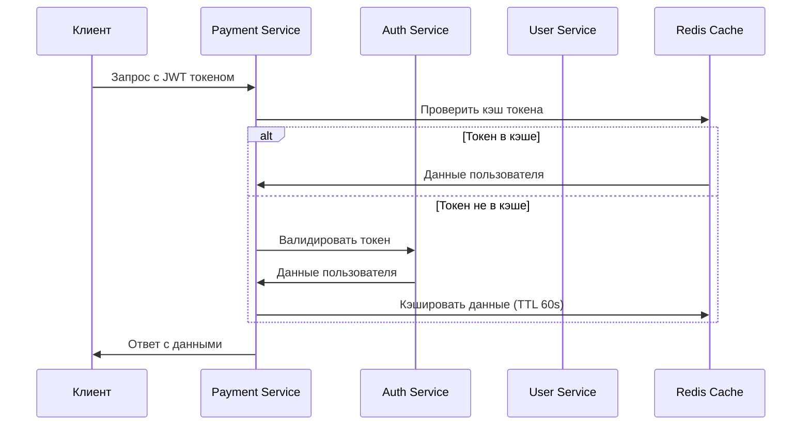

# Дизайн рефакторинга Payment Service

## Обзор

Рефакторинг Payment Service направлен на удаление дублирующего кода аутентификации, оптимизацию интеграций с микросервисами и улучшение архитектуры после миграции Auth Service. Основные цели: централизация аутентификации, оптимизация производительности, улучшение безопасности и интеграция с общей инфраструктурой платформы.

## Архитектура

### Текущая архитектура (до рефакторинга)


### Целевая архитектура (после рефакторинга)


### Поток аутентификации (новый)


## Компоненты и интерфейсы

### 1. Модуль аутентификации (рефакторинг)

#### Удаляемые компоненты:
- `src/common/auth/jwt.strategy.ts` - JWT стратегия Passport
- `src/common/auth/jwt-auth.guard.ts` - Локальный JWT guard
- Зависимости: `passport`, `passport-jwt`, `@nestjs/passport`

#### Новые компоненты:

**AuthService Integration**
```typescript
// src/common/auth/auth-integration.service.ts
@Injectable()
export class AuthIntegrationService {
  async validateToken(token: string): Promise<UserPayload> {
    // Валидация через Auth Service
  }
  
  async getUserFromCache(userId: string): Promise<UserPayload | null> {
    // Получение из Redis кэша
  }
  
  async cacheUser(user: UserPayload, ttl: number): Promise<void> {
    // Кэширование пользователя
  }
}
```

**New Auth Guard**
```typescript
// src/common/auth/service-auth.guard.ts
@Injectable()
export class ServiceAuthGuard implements CanActivate {
  constructor(
    private authIntegration: AuthIntegrationService,
    private cacheManager: Cache
  ) {}
  
  async canActivate(context: ExecutionContext): Promise<boolean> {
    // Валидация через Auth Service с кэшированием
  }
}
```

### 2. Интеграционный слой (улучшение)

#### Обновленные интеграции:

**Auth Service Integration**
```typescript
// src/integrations/auth/auth-service.client.ts
@Injectable()
export class AuthServiceClient {
  async validateToken(token: string): Promise<ValidationResult> {
    // HTTP запрос к Auth Service
  }
  
  async refreshToken(refreshToken: string): Promise<TokenPair> {
    // Обновление токена
  }
}
```

**User Service Integration**
```typescript
// src/integrations/user/user-service.client.ts
@Injectable()
export class UserServiceClient {
  async getUserById(userId: string): Promise<User> {
    // Получение данных пользователя
  }
  
  async getUsersByIds(userIds: string[]): Promise<User[]> {
    // Batch получение пользователей
  }
}
```

**Enhanced Game Catalog Integration**
```typescript
// src/integrations/game-catalog/game-catalog.client.ts
@Injectable()
export class GameCatalogClient {
  async validateGame(gameId: string): Promise<GameValidation> {
    // Валидация игры с кэшированием
  }
  
  async getGamePrice(gameId: string): Promise<GamePrice> {
    // Получение цены игры
  }
  
  async batchValidateGames(gameIds: string[]): Promise<GameValidation[]> {
    // Batch валидация игр
  }
}
```

### 3. Кэширование (новая архитектура)

#### Redis Cache Strategy
```typescript
// src/common/cache/cache.strategy.ts
export enum CacheKeys {
  USER_TOKEN = 'user:token:',
  GAME_VALIDATION = 'game:validation:',
  GAME_PRICE = 'game:price:',
  USER_DATA = 'user:data:'
}

export enum CacheTTL {
  TOKEN_VALIDATION = 60, // 1 минута
  GAME_DATA = 300,       // 5 минут
  USER_DATA = 180        // 3 минуты
}
```

#### Cache Service
```typescript
// src/common/cache/cache.service.ts
@Injectable()
export class CacheService {
  async get<T>(key: string): Promise<T | null> {
    // Получение из кэша
  }
  
  async set<T>(key: string, value: T, ttl: number): Promise<void> {
    // Сохранение в кэш
  }
  
  async invalidate(pattern: string): Promise<void> {
    // Инвалидация кэша по паттерну
  }
}
```

### 4. Обработка платежей (оптимизация)

#### Enhanced Payment Processing
```typescript
// src/modules/payment/payment.service.ts
@Injectable()
export class PaymentService {
  async createPayment(dto: CreatePaymentDto, user: UserPayload): Promise<Payment> {
    // Создание платежа с валидацией через микросервисы
  }
  
  async processPayment(paymentId: string, provider: PaymentProvider): Promise<PaymentResult> {
    // Обработка платежа с retry логикой
  }
  
  async handleWebhook(provider: PaymentProvider, payload: any): Promise<void> {
    // Обработка webhook с валидацией подписи
  }
}
```

#### Payment Provider Factory (улучшение)
```typescript
// src/modules/payment/providers/payment-provider.factory.ts
@Injectable()
export class PaymentProviderFactory {
  createProvider(type: PaymentProvider): IPaymentProvider {
    // Создание провайдера с улучшенной обработкой ошибок
  }
  
  async healthCheck(): Promise<ProviderHealthStatus[]> {
    // Проверка здоровья всех провайдеров
  }
}
```

### 5. Мониторинг и метрики (расширение)

#### Enhanced Metrics
```typescript
// src/common/metrics/payment.metrics.ts
@Injectable()
export class PaymentMetrics {
  // Существующие метрики
  private paymentsTotal: Counter;
  private paymentDuration: Histogram;
  
  // Новые метрики
  private authValidationDuration: Histogram;
  private serviceIntegrationErrors: Counter;
  private cacheHitRate: Gauge;
  private webhookProcessingTime: Histogram;
}
```

## Модели данных

### Обновленные модели

#### User Payload (для кэширования)
```typescript
interface UserPayload {
  id: string;
  email: string;
  roles: string[];
  permissions: string[];
  isActive: boolean;
  lastLoginAt: Date;
}
```

#### Service Integration Config
```typescript
interface ServiceConfig {
  baseUrl: string;
  timeout: number;
  retryAttempts: number;
  retryDelay: number;
  circuitBreakerThreshold: number;
}
```

#### Cache Entry
```typescript
interface CacheEntry<T> {
  data: T;
  timestamp: number;
  ttl: number;
}
```

## Обработка ошибок

### Стратегия обработки ошибок

#### Service Integration Errors
```typescript
// src/common/exceptions/service-integration.exception.ts
export class ServiceIntegrationException extends HttpException {
  constructor(
    service: string,
    operation: string,
    originalError: Error
  ) {
    super({
      message: `Integration with ${service} failed`,
      service,
      operation,
      timestamp: new Date().toISOString()
    }, HttpStatus.SERVICE_UNAVAILABLE);
  }
}
```

#### Fallback Mechanisms
```typescript
// src/common/resilience/fallback.service.ts
@Injectable()
export class FallbackService {
  async withFallback<T>(
    primary: () => Promise<T>,
    fallback: () => Promise<T>,
    condition: (error: Error) => boolean
  ): Promise<T> {
    // Реализация fallback логики
  }
}
```

#### Circuit Breaker Pattern
```typescript
// src/common/resilience/circuit-breaker.service.ts
@Injectable()
export class CircuitBreakerService {
  private breakers = new Map<string, CircuitBreaker>();
  
  async execute<T>(
    key: string,
    operation: () => Promise<T>,
    options: CircuitBreakerOptions
  ): Promise<T> {
    // Реализация circuit breaker
  }
}
```

## Стратегия тестирования

### Unit Tests (обновление)
- Тесты для новых интеграционных сервисов
- Тесты для кэширования
- Тесты для fallback механизмов
- Мокирование внешних сервисов

### Integration Tests (расширение)
- Тесты интеграции с Auth Service
- Тесты интеграции с User Service
- Тесты кэширования Redis
- Тесты circuit breaker

### E2E Tests (обновление)
- Полный цикл создания заказа с новой аутентификацией
- Обработка платежей через новую архитектуру
- Тестирование fallback сценариев
- Нагрузочное тестирование

### Performance Tests
- Тестирование производительности с кэшированием
- Нагрузочное тестирование интеграций
- Тестирование времени отклика < 200ms
- Тестирование 1000 одновременных запросов

## Миграционная стратегия

### Этап 1: Подготовка инфраструктуры
1. Настройка общего Redis
2. Обновление Docker Compose конфигурации
3. Настройка интеграций с Auth Service и User Service

### Этап 2: Рефакторинг аутентификации
1. Удаление локальной JWT логики
2. Реализация интеграции с Auth Service
3. Добавление кэширования токенов

### Этап 3: Оптимизация интеграций
1. Улучшение интеграций с микросервисами
2. Добавление batch операций
3. Реализация circuit breaker

### Этап 4: Тестирование и мониторинг
1. Обновление тестов
2. Добавление новых метрик
3. Настройка алертинга

### Этап 5: Деплой и валидация
1. Постепенный rollout
2. Мониторинг производительности
3. Валидация всех интеграций

## Конфигурация

### Переменные окружения (обновленные)

#### Интеграции с сервисами
```env
# Auth Service
AUTH_SERVICE_URL=http://auth-service:3003
AUTH_SERVICE_TIMEOUT=5000
AUTH_CACHE_TTL=60

# User Service  
USER_SERVICE_URL=http://user-service:3001
USER_SERVICE_TIMEOUT=3000

# Общий Redis
REDIS_HOST=redis-shared
REDIS_PORT=6379
REDIS_DB=0

# Circuit Breaker
CIRCUIT_BREAKER_THRESHOLD=5
CIRCUIT_BREAKER_TIMEOUT=30000
CIRCUIT_BREAKER_RESET_TIMEOUT=60000
```

#### Производительность
```env
# Connection Pooling
DB_POOL_SIZE=20
DB_POOL_MAX=50

# Cache Settings
CACHE_DEFAULT_TTL=300
CACHE_MAX_ITEMS=10000

# Rate Limiting
RATE_LIMIT_TTL=60
RATE_LIMIT_LIMIT=100
```

## Безопасность

### Обновленные меры безопасности

#### Token Validation
- Валидация токенов через Auth Service
- Кэширование результатов валидации
- Автоматическая инвалидация при изменении токена

#### Webhook Security
- Валидация подписей всех провайдеров
- Проверка IP адресов
- Rate limiting для webhook endpoints
- Защита от replay атак

#### Data Protection
- Шифрование чувствительных данных в кэше
- Исключение платежных данных из логов
- Audit trail для всех операций
- Соответствие PCI DSS требованиям

## Мониторинг и алертинг

### Новые метрики
- `payment_service_auth_validation_duration` - время валидации токенов
- `payment_service_cache_hit_ratio` - коэффициент попаданий в кэш
- `payment_service_service_integration_errors` - ошибки интеграций
- `payment_service_circuit_breaker_state` - состояние circuit breaker

### Алерты
- Высокое время валидации токенов (> 500ms)
- Низкий коэффициент попаданий в кэш (< 80%)
- Частые ошибки интеграций (> 5% за 5 минут)
- Срабатывание circuit breaker

### Health Checks (расширенные)
- Проверка подключения к Auth Service
- Проверка подключения к User Service
- Проверка состояния Redis кэша
- Проверка всех платежных провайдеров

## Производительность

### Целевые показатели
- Время создания заказа: < 200ms
- Время обработки платежа: < 500ms
- Время валидации токена: < 50ms
- Пропускная способность: 1000 RPS
- Коэффициент попаданий в кэш: > 80%

### Оптимизации
- Connection pooling для всех внешних сервисов
- Batch операции для множественных запросов
- Асинхронная обработка webhook'ов
- Кэширование результатов валидации
- Lazy loading для неиспользуемых данных