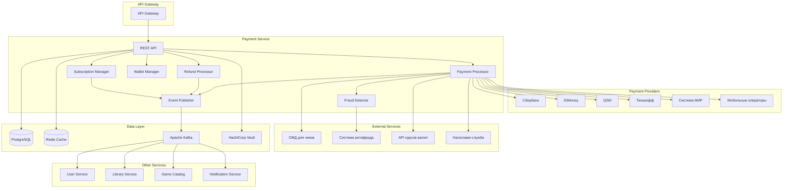
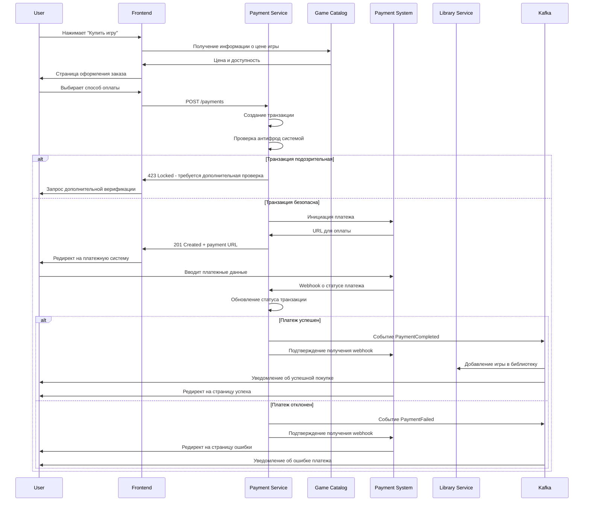
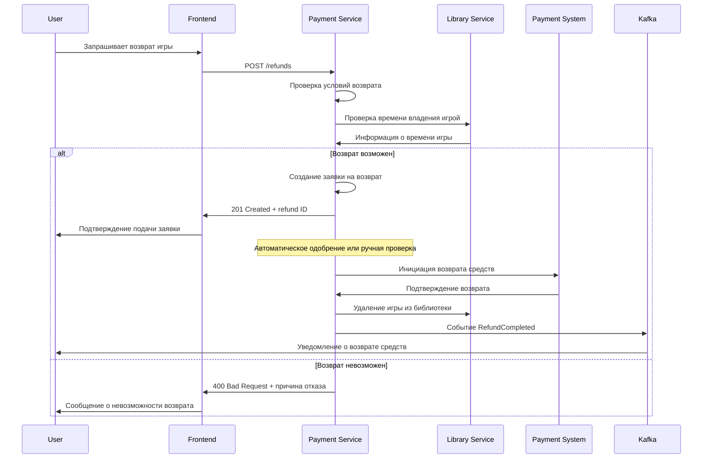
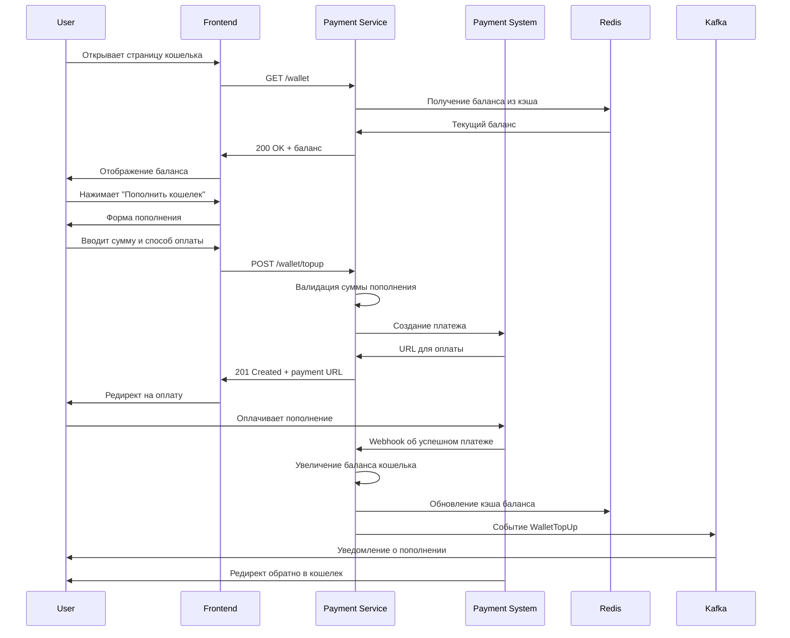
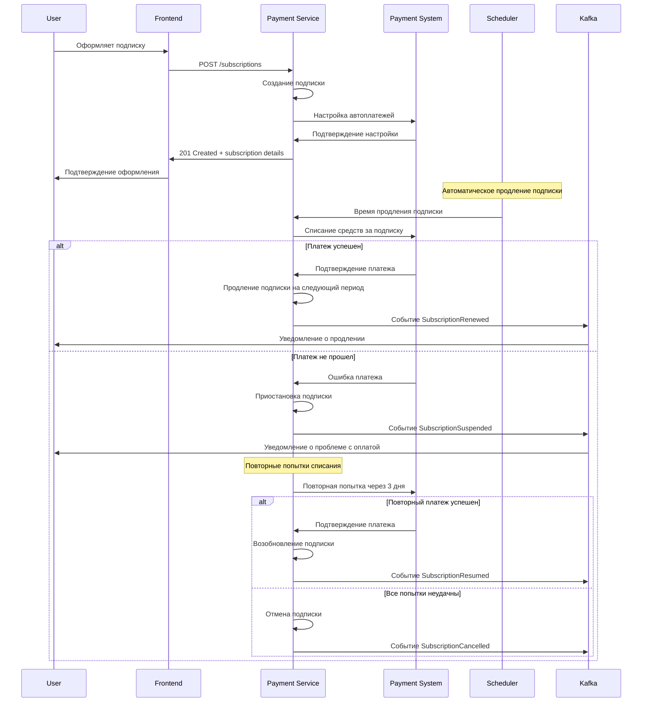
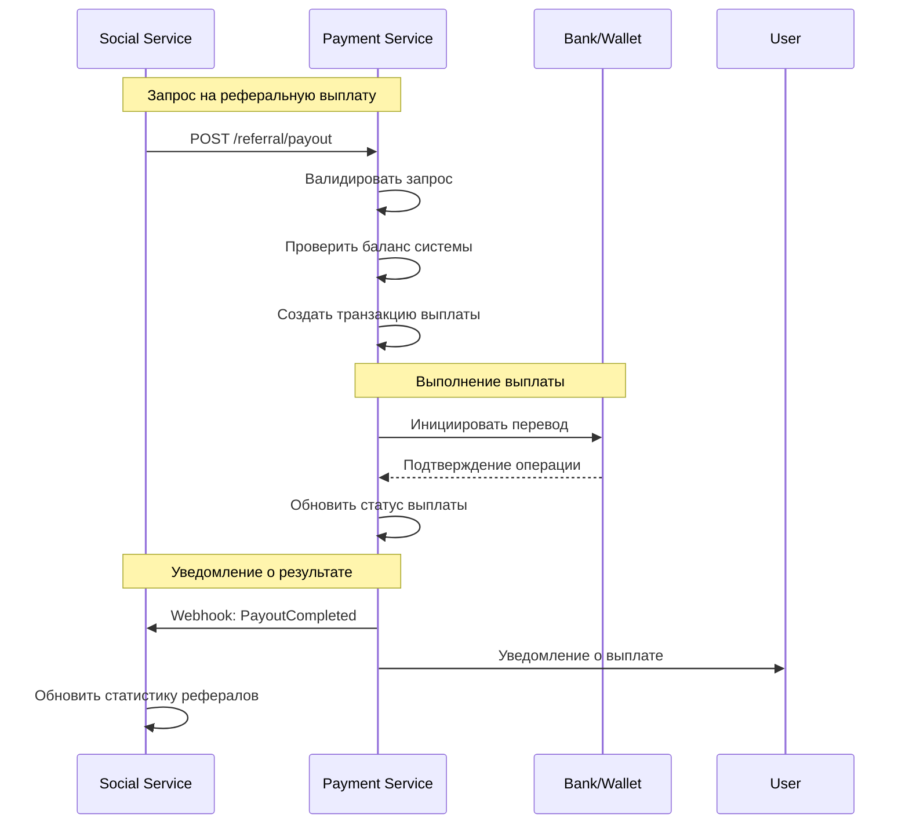
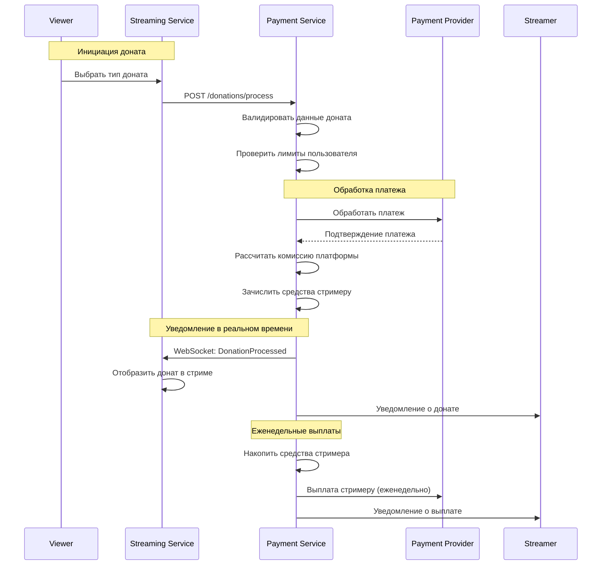

# Дизайн Payment Service

## Обзор

Payment Service является критически важным сервисом для обработки всех финансовых операций российской игровой платформы. Сервис обеспечивает интеграцию с российскими платежными системами, обработку транзакций, управление подписками, защиту от мошенничества и соблюдение российского законодательства.

### Ключевые принципы дизайна

- **Безопасность**: PCI DSS соответствие и защита платежных данных
- **Надежность**: 99.99% uptime для критических платежных операций
- **Соответствие законодательству**: Полное соблюдение 54-ФЗ и валютного законодательства РФ
- **Производительность**: Обработка до 5000 одновременных транзакций
- **Отказоустойчивость**: Автоматическое переключение между платежными провайдерами

## Архитектура

### Общая архитектура



## API Эндпоинты и маршруты

### Структура API

```
Base URL: https://api.gaming-platform.ru/payment-service/v1
```

### НОВЫЕ API Endpoints для расширенной функциональности

```typescript
// Система купонов и промокодов
GET    /coupons/validate/:code        // Валидация купона
POST   /coupons/apply                 // Применение купона к заказу
GET    /coupons/user/:userId          // Купоны пользователя
POST   /admin/coupons                 // Создание купона (админ)
PUT    /admin/coupons/:couponId       // Обновление купона
GET    /admin/coupons/analytics       // Аналитика использования купонов

// Система подарочных карт
POST   /gift-cards/purchase           // Покупка подарочной карты
POST   /gift-cards/activate           // Активация подарочной карты
GET    /gift-cards/:cardId/balance    // Баланс подарочной карты
GET    /gift-cards/:cardId/history    // История использования карты
POST   /gift-cards/corporate/bulk     // Корпоративная закупка карт
GET    /gift-cards/corporate/manage   // Управление корпоративными картами

// Система региональных цен
GET    /pricing/regional/:region      // Региональные цены
POST   /pricing/regional/update       // Обновление региональных цен
GET    /pricing/currency/rates        // Текущие курсы валют
POST   /pricing/currency/update       // Обновление курсов валют
GET    /pricing/regional/compliance   // Соответствие региональным требованиям

// Система донатов стримерам
POST   /donations/send                // Отправка доната стримеру
GET    /donations/streamer/:streamerId // Донаты стримера
POST   /donations/virtual-gift        // Отправка виртуального подарка
GET    /donations/leaderboard/:streamerId // Топ донатеров
POST   /donations/payout/request      // Запрос выплаты стримеру
GET    /donations/analytics/:streamerId // Аналитика донатов

// Система реферальных выплат
POST   /referrals/reward/calculate    // Расчет реферальной награды
POST   /referrals/payout/process      // Обработка реферальной выплаты
GET    /referrals/earnings/:userId    // Доходы от рефералов
POST   /referrals/withdraw            // Вывод реферальных средств
GET    /referrals/analytics           // Аналитика реферальной программы

// Система предзаказных платежей
POST   /preorders/payment             // Оплата предзаказа
PUT    /preorders/:preorderId/cancel  // Отмена предзаказа с возвратом
POST   /preorders/partial-payment     // Частичная предоплата
POST   /preorders/complete-payment    // Доплата при релизе
GET    /preorders/:preorderId/status  // Статус предзаказного платежа

// Расширенные платежные функции
POST   /payments/split                // Разделенные платежи
POST   /payments/installments         // Рассрочка
POST   /payments/crypto               // Криптовалютные платежи
GET    /payments/methods/available    // Доступные способы оплаты по региону
POST   /payments/fraud/report         // Сообщение о мошенничестве
```

### Payment Endpoints

```typescript
// Создание и обработка платежей
POST   /payments                   // Создание нового платежа
GET    /payments/:id               // Получение информации о платеже
PUT    /payments/:id/confirm       // Подтверждение платежа
PUT    /payments/:id/cancel        // Отмена платежа
POST   /payments/:id/callback      // Webhook от платежной системы

// Способы оплаты
GET    /payment-methods            // Доступные способы оплаты
POST   /payment-methods/validate   // Валидация платежных данных

// История платежей
GET    /payments/history           // История платежей пользователя
GET    /payments/history/:id       // Детали конкретного платежа
GET    /payments/receipts/:id      // Получение чека

// Возвраты
POST   /refunds                    // Создание запроса на возврат
GET    /refunds/:id                // Статус возврата
PUT    /refunds/:id/approve        // Одобрение возврата (admin)
PUT    /refunds/:id/reject         // Отклонение возврата (admin)
```

### Wallet Endpoints

```typescript
// Управление кошельком
GET    /wallet                     // Баланс кошелька
POST   /wallet/topup               // Пополнение кошелька
POST   /wallet/withdraw            // Вывод средств
GET    /wallet/transactions        // История операций кошелька

// Внутренние переводы
POST   /wallet/transfer            // Перевод между пользователями
GET    /wallet/transfer/:id        // Статус перевода
```

### Subscription Endpoints

```typescript
// Управление подписками
POST   /subscriptions              // Создание подписки
GET    /subscriptions              // Список подписок пользователя
GET    /subscriptions/:id          // Детали подписки
PUT    /subscriptions/:id/cancel   // Отмена подписки
PUT    /subscriptions/:id/pause    // Приостановка подписки
PUT    /subscriptions/:id/resume   // Возобновление подписки

// Автоплатежи
GET    /subscriptions/:id/payments // История платежей по подписке
PUT    /subscriptions/:id/payment-method // Изменение способа оплаты
```

### Gift & Promo Endpoints

```typescript
// Подарки
POST   /gifts                      // Покупка подарка
GET    /gifts/received             // Полученные подарки
GET    /gifts/sent                 // Отправленные подарки
PUT    /gifts/:id/accept           // Принятие подарка
PUT    /gifts/:id/decline          // Отклонение подарка

// Промокоды и скидки
POST   /promo/validate             // Проверка промокода
POST   /promo/apply                // Применение промокода
GET    /promo/active               // Активные акции
```

### Developer Payout Endpoints

```typescript
// Выплаты разработчикам
GET    /payouts/earnings           // Доходы разработчика
POST   /payouts/request            // Запрос выплаты
GET    /payouts/history            // История выплат
GET    /payouts/reports            // Финансовые отчеты
```

### Admin Endpoints

```typescript
// Администрирование платежей
GET    /admin/payments             // Все платежи с фильтрами
GET    /admin/payments/stats       // Статистика платежей
POST   /admin/payments/:id/refund  // Принудительный возврат
PUT    /admin/payments/:id/block   // Блокировка платежа

// Управление мошенничеством
GET    /admin/fraud/alerts         // Алерты о мошенничестве
PUT    /admin/fraud/rules          // Настройка правил антифрода
GET    /admin/fraud/reports        // Отчеты о мошенничестве

// Финансовая отчетность
GET    /admin/reports/revenue      // Отчет о доходах
GET    /admin/reports/taxes        // Налоговые отчеты
GET    /admin/reports/compliance   // Отчеты соответствия
```

## Компоненты для интеграции с другими сервисами

### Referral Payout Processor

**Ответственность:**
- Обработка запросов на реферальные выплаты от Social Service
- Валидация и выполнение финансовых операций
- Отправка подтверждений обратно в Social Service

**Интерфейсы:**

```typescript
interface ReferralPayoutService {
  // Обработка запросов от Social Service
  processReferralPayout(request: ReferralPayoutRequest): Promise<PayoutResult>
  validatePayoutRequest(request: ReferralPayoutRequest): Promise<ValidationResult>
  
  // Управление выплатами
  executeReferralPayout(payoutId: string): Promise<PayoutExecution>
  cancelReferralPayout(payoutId: string, reason: string): Promise<void>
  
  // Получение статуса
  getReferralPayoutStatus(payoutId: string): Promise<PayoutStatus>
  getReferralPayoutHistory(userId: string, dateRange: DateRange): Promise<PayoutHistory[]>
}

interface ReferralPayoutRequest {
  userId: string
  amount: number
  currency: string
  reason: string
  referralLevel: number
  sourceTransactionId: string
  payoutMethod: 'wallet' | 'bank_transfer' | 'electronic_wallet'
  metadata: Record<string, any>
}
```

### Donation Processor

**Ответственность:**
- Обработка донатов стримерам в реальном времени
- Интеграция со Streaming Service для UI/UX
- Управление выплатами стримерам

**Интерфейсы:**

```typescript
interface DonationService {
  // Обработка донатов от Streaming Service
  processDonation(request: DonationRequest): Promise<DonationResult>
  validateDonationRequest(request: DonationRequest): Promise<ValidationResult>
  
  // Управление донатами
  executeDonation(donationId: string): Promise<DonationExecution>
  refundDonation(donationId: string, reason: string): Promise<RefundResult>
  
  // Выплаты стримерам
  processStreamerPayout(streamerId: string, amount: number): Promise<PayoutResult>
  getStreamerBalance(streamerId: string): Promise<StreamerBalance>
  
  // Статистика и отчеты
  getDonationStats(streamerId: string, dateRange: DateRange): Promise<DonationStats>
  getDonationHistory(userId: string, dateRange: DateRange): Promise<DonationHistory[]>
}

interface DonationRequest {
  donorUserId: string
  streamerId: string
  amount: number
  currency: string
  donationType: 'money' | 'virtual_gift' | 'game_item'
  message?: string
  isAnonymous: boolean
  metadata: Record<string, any>
}
```

### Integration Event Handlers

**Ответственность:**
- Обработка событий от других сервисов
- Синхронизация состояния платежей

```typescript
interface IntegrationEventHandlers {
  // События от Social Service
  handleReferralPayoutRequest(event: ReferralPayoutRequestEvent): Promise<void>
  handleReferralProgramUpdate(event: ReferralProgramUpdateEvent): Promise<void>
  
  // События от Streaming Service
  handleDonationRequest(event: DonationRequestEvent): Promise<void>
  handleStreamerPayoutRequest(event: StreamerPayoutRequestEvent): Promise<void>
  
  // События от User Service
  handleUserBlocked(event: UserBlockedEvent): Promise<void>
  handleUserDeleted(event: UserDeletedEvent): Promise<void>
}
```

## User Flows (Пользовательские сценарии)

### 1. Покупка игры



### 2. Возврат средств



### 3. Пополнение кошелька



### 4. Управление подпиской



### 5. Обработка реферальной выплаты



### 6. Обработка доната стримеру



## Модели данных

### Основные сущности

```typescript
interface Payment {
  id: string
  userId: string
  
  // Детали платежа
  amount: number
  currency: string
  description: string
  
  // Товар/услуга
  itemType: 'game' | 'dlc' | 'subscription' | 'wallet_topup' | 'gift'
  itemId: string
  itemName: string
  
  // Платежная система
  paymentMethod: PaymentMethod
  paymentProvider: string
  externalTransactionId: string
  
  // Статус
  status: PaymentStatus
  statusHistory: PaymentStatusChange[]
  
  // Налоги и комиссии
  taxAmount: number
  feeAmount: number
  netAmount: number
  
  // Безопасность
  fraudScore: number
  fraudChecks: FraudCheck[]
  
  // Метаданные
  metadata: Record<string, any>
  createdAt: Date
  updatedAt: Date
  completedAt?: Date
  
  // Чек
  receiptId?: string
  receiptUrl?: string
}

interface Refund {
  id: string
  paymentId: string
  userId: string
  
  // Детали возврата
  amount: number
  reason: string
  requestedAt: Date
  
  // Статус
  status: RefundStatus
  approvedBy?: string
  approvedAt?: Date
  
  // Обработка
  processedAt?: Date
  externalRefundId?: string
  
  // Метаданные
  metadata: Record<string, any>
}

interface Wallet {
  id: string
  userId: string
  
  // Баланс
  balance: number
  currency: string
  
  // Лимиты
  dailySpendLimit: number
  monthlySpendLimit: number
  
  // Статус
  isActive: boolean
  isFrozen: boolean
  
  // Метаданные
  createdAt: Date
  updatedAt: Date
}

interface WalletTransaction {
  id: string
  walletId: string
  userId: string
  
  // Транзакция
  type: 'credit' | 'debit'
  amount: number
  balanceBefore: number
  balanceAfter: number
  
  // Описание
  description: string
  category: string
  
  // Связанные объекты
  relatedPaymentId?: string
  relatedRefundId?: string
  
  createdAt: Date
}

interface Subscription {
  id: string
  userId: string
  
  // План подписки
  planId: string
  planName: string
  
  // Цена
  price: number
  currency: string
  billingPeriod: 'monthly' | 'yearly'
  
  // Статус
  status: SubscriptionStatus
  
  // Даты
  startDate: Date
  endDate: Date
  nextBillingDate: Date
  cancelledAt?: Date
  
  // Платежный метод
  paymentMethodId: string
  
  // История платежей
  payments: SubscriptionPayment[]
  
  createdAt: Date
  updatedAt: Date
}

interface Gift {
  id: string
  senderId: string
  recipientId: string
  
  // Подарок
  itemType: 'game' | 'dlc' | 'wallet_credit'
  itemId: string
  itemName: string
  
  // Платеж
  paymentId: string
  amount: number
  
  // Сообщение
  message?: string
  
  // Статус
  status: 'pending' | 'accepted' | 'declined' | 'expired'
  
  // Даты
  sentAt: Date
  respondedAt?: Date
  expiresAt: Date
}

// НОВЫЕ ИНТЕРФЕЙСЫ ДЛЯ РАСШИРЕННОЙ ФУНКЦИОНАЛЬНОСТИ

interface Coupon {
  id: string
  code: string
  name: string
  description: string
  
  // Тип скидки
  discountType: 'percentage' | 'fixed_amount' | 'bogo' | 'free_shipping'
  discountValue: number
  
  // Ограничения
  minimumAmount?: number
  maximumDiscount?: number
  usageLimit?: number
  usageCount: number
  userUsageLimit?: number
  
  // Применимость
  applicableCategories: string[]
  applicableGames: string[]
  excludedCategories: string[]
  excludedGames: string[]
  
  // Персонализация
  isPersonal: boolean
  assignedUserId?: string
  
  // Стекинг
  canStackWith: string[] // коды других купонов
  stackingPriority: number
  
  // Валидность
  isActive: boolean
  startDate: Date
  endDate: Date
  
  // Метаданные
  createdBy: string
  createdAt: Date
  updatedAt: Date
}

interface GiftCard {
  id: string
  code: string // 16-значный код
  
  // Баланс
  initialAmount: number
  currentBalance: number
  currency: string
  
  // Дизайн
  designTemplate: string
  customMessage?: string
  senderName?: string
  recipientName?: string
  
  // Статус
  status: 'active' | 'redeemed' | 'expired' | 'cancelled'
  
  // Корпоративные карты
  isCorporate: boolean
  corporateAccountId?: string
  bulkOrderId?: string
  
  // Использование
  purchasedBy?: string
  redeemedBy?: string
  redeemedAt?: Date
  
  // Валидность
  expiresAt?: Date
  
  createdAt: Date
  updatedAt: Date
}

interface RegionalPricing {
  id: string
  gameId: string
  
  // Региональные цены
  regions: RegionalPrice[]
  
  // Базовая цена
  basePriceUSD: number
  
  // Автоматическое обновление
  autoUpdateEnabled: boolean
  lastUpdated: Date
  
  createdAt: Date
  updatedAt: Date
}

interface RegionalPrice {
  regionCode: string // ISO 3166-1 alpha-2
  currency: string
  price: number
  taxRate: number
  isAvailable: boolean
  
  // Ограничения
  vpnBlocked: boolean
  requiresLocalPayment: boolean
  
  // Метаданные
  lastUpdated: Date
}

interface StreamerDonation {
  id: string
  streamerId: string
  donorId?: string // может быть анонимным
  
  // Тип доната
  donationType: 'monetary' | 'virtual_gift' | 'game_key' | 'subscription'
  
  // Денежный донат
  amount?: number
  currency?: string
  
  // Виртуальный подарок
  virtualGiftId?: string
  virtualGiftName?: string
  
  // Игровой ключ
  gameKeyId?: string
  gameName?: string
  
  // Сообщение
  message?: string
  isAnonymous: boolean
  
  // Обработка
  paymentId: string
  platformFee: number // 15%
  streamerAmount: number // 85%
  
  // Статус
  status: 'pending' | 'completed' | 'refunded'
  
  // Отображение
  isHighlighted: boolean
  displayDuration: number // секунды
  
  createdAt: Date
  processedAt?: Date
}

interface StreamerPayout {
  id: string
  streamerId: string
  
  // Период
  periodStart: Date
  periodEnd: Date
  
  // Суммы
  totalDonations: number
  platformFees: number
  payoutAmount: number
  
  // Статус
  status: 'pending' | 'processing' | 'completed' | 'failed'
  
  // Обработка
  paymentMethodId: string
  externalTransactionId?: string
  
  // Налоги
  taxWithheld: number
  taxDocumentUrl?: string
  
  createdAt: Date
  processedAt?: Date
}

interface ReferralReward {
  id: string
  referrerId: string
  refereeId: string
  
  // Тип награды
  rewardType: 'cashback' | 'bonus_points' | 'game_key' | 'discount_coupon'
  
  // Денежная награда
  amount?: number
  currency?: string
  
  // Бонусные баллы
  bonusPoints?: number
  
  // Игровой ключ
  gameKeyId?: string
  
  // Купон
  couponId?: string
  
  // Триггер
  triggerEvent: 'signup' | 'first_purchase' | 'milestone_reached'
  triggerAmount?: number
  
  // Уровень реферала
  referralLevel: number // 1, 2, 3 для многоуровневой системы
  
  // Статус
  status: 'pending' | 'approved' | 'paid' | 'cancelled'
  
  // Обработка
  paymentId?: string
  
  createdAt: Date
  processedAt?: Date
}

interface PreorderPayment {
  id: string
  gameId: string
  userId: string
  preorderTierId: string
  
  // Платеж
  paymentType: 'full' | 'partial'
  paidAmount: number
  remainingAmount: number
  totalAmount: number
  
  // Статус
  status: 'active' | 'cancelled' | 'completed'
  
  // Обработка
  initialPaymentId: string
  finalPaymentId?: string
  
  // Отмена
  cancellationReason?: string
  refundId?: string
  
  // Релиз
  gameReleaseDate?: Date
  completedAt?: Date
  
  createdAt: Date
  updatedAt: Date
}

// Новые модели для интеграции с другими сервисами

interface ReferralPayout {
  id: string
  userId: string
  referralUserId: string
  
  // Детали выплаты
  amount: number
  currency: string
  referralLevel: number
  sourceTransactionId: string
  
  // Метод выплаты
  payoutMethod: 'wallet' | 'bank_transfer' | 'electronic_wallet'
  payoutDetails: PayoutMethodDetails
  
  // Статус
  status: 'pending' | 'processing' | 'completed' | 'failed' | 'cancelled'
  statusHistory: PayoutStatusChange[]
  
  // Связь с Social Service
  socialServiceRequestId: string
  
  // Метаданные
  reason: string
  metadata: Record<string, any>
  
  // Временные метки
  createdAt: Date
  processedAt?: Date
  completedAt?: Date
  
  // Ошибки
  errorCode?: string
  errorMessage?: string
}

interface Donation {
  id: string
  donorUserId: string
  streamerId: string
  
  // Детали доната
  amount: number
  currency: string
  donationType: 'money' | 'virtual_gift' | 'game_item'
  message?: string
  isAnonymous: boolean
  
  // Платежная информация
  paymentId: string
  paymentMethod: PaymentMethod
  
  // Комиссии и распределение
  platformFee: number
  streamerAmount: number
  
  // Статус
  status: 'pending' | 'processing' | 'completed' | 'failed' | 'refunded'
  statusHistory: DonationStatusChange[]
  
  // Связь со Streaming Service
  streamingServiceRequestId: string
  streamId?: string
  
  // Метаданные
  metadata: Record<string, any>
  
  // Временные метки
  createdAt: Date
  processedAt?: Date
  completedAt?: Date
  
  // Возврат
  refundId?: string
  refundReason?: string
}

interface StreamerBalance {
  streamerId: string
  
  // Баланс
  totalEarned: number
  availableBalance: number
  pendingBalance: number
  paidOut: number
  
  // Статистика
  totalDonations: number
  averageDonation: number
  topDonation: number
  
  // Настройки выплат
  payoutMethod: 'bank_transfer' | 'electronic_wallet'
  payoutSchedule: 'weekly' | 'monthly'
  minimumPayout: number
  
  // Последняя выплата
  lastPayoutAt?: Date
  lastPayoutAmount?: number
  
  // Временные метки
  createdAt: Date
  updatedAt: Date
}

interface StreamerPayout {
  id: string
  streamerId: string
  
  // Детали выплаты
  amount: number
  currency: string
  payoutMethod: string
  
  // Период
  periodStart: Date
  periodEnd: Date
  
  // Статус
  status: 'pending' | 'processing' | 'completed' | 'failed'
  
  // Детали транзакции
  transactionId?: string
  bankDetails?: BankTransferDetails
  
  // Временные метки
  createdAt: Date
  processedAt?: Date
  completedAt?: Date
  
  // Ошибки
  errorCode?: string
  errorMessage?: string
}
```

## Детальная схема базы данных

```sql
-- Основная таблица платежей
CREATE TABLE payments (
    id UUID PRIMARY KEY DEFAULT gen_random_uuid(),
    user_id UUID NOT NULL,
    
    -- Детали платежа
    amount DECIMAL(15,2) NOT NULL,
    currency CHAR(3) DEFAULT 'RUB',
    description TEXT NOT NULL,
    
    -- Товар/услуга
    item_type VARCHAR(20) NOT NULL CHECK (item_type IN ('game', 'dlc', 'subscription', 'wallet_topup', 'gift')),
    item_id VARCHAR(255) NOT NULL,
    item_name VARCHAR(255) NOT NULL,
    
    -- Платежная система
    payment_method VARCHAR(50) NOT NULL,
    payment_provider VARCHAR(50) NOT NULL,
    external_transaction_id VARCHAR(255),
    
    -- Статус
    status VARCHAR(20) DEFAULT 'pending' CHECK (status IN ('pending', 'processing', 'completed', 'failed', 'cancelled', 'refunded')),
    
    -- Налоги и комиссии
    tax_amount DECIMAL(15,2) DEFAULT 0,
    fee_amount DECIMAL(15,2) DEFAULT 0,
    net_amount DECIMAL(15,2) NOT NULL,
    
    -- Безопасность
    fraud_score INTEGER DEFAULT 0,
    is_fraud_checked BOOLEAN DEFAULT FALSE,
    
    -- IP и устройство
    ip_address INET,
    user_agent TEXT,
    
    -- Метаданные
    metadata JSONB DEFAULT '{}',
    
    -- Временные метки
    created_at TIMESTAMP DEFAULT NOW(),
    updated_at TIMESTAMP DEFAULT NOW(),
    completed_at TIMESTAMP,
    
    -- Чек
    receipt_id VARCHAR(255),
    receipt_url VARCHAR(500)
);

-- История изменений статуса платежей
CREATE TABLE payment_status_history (
    id UUID PRIMARY KEY DEFAULT gen_random_uuid(),
    payment_id UUID NOT NULL REFERENCES payments(id) ON DELETE CASCADE,
    old_status VARCHAR(20),
    new_status VARCHAR(20) NOT NULL,
    reason TEXT,
    changed_by VARCHAR(50), -- 'system', 'user', 'admin', 'provider'
    created_at TIMESTAMP DEFAULT NOW()
);

-- Возвраты
CREATE TABLE refunds (
    id UUID PRIMARY KEY DEFAULT gen_random_uuid(),
    payment_id UUID NOT NULL REFERENCES payments(id),
    user_id UUID NOT NULL,
    
    -- Детали возврата
    amount DECIMAL(15,2) NOT NULL,
    reason TEXT NOT NULL,
    
    -- Статус
    status VARCHAR(20) DEFAULT 'pending' CHECK (status IN ('pending', 'approved', 'rejected', 'processing', 'completed', 'failed')),
    
    -- Обработка
    approved_by UUID,
    approved_at TIMESTAMP,
    processed_at TIMESTAMP,
    external_refund_id VARCHAR(255),
    
    -- Метаданные
    metadata JSONB DEFAULT '{}',
    
    created_at TIMESTAMP DEFAULT NOW(),
    updated_at TIMESTAMP DEFAULT NOW()
);

-- Кошельки пользователей
CREATE TABLE wallets (
    id UUID PRIMARY KEY DEFAULT gen_random_uuid(),
    user_id UUID NOT NULL UNIQUE,
    
    -- Баланс
    balance DECIMAL(15,2) DEFAULT 0 CHECK (balance >= 0),
    currency CHAR(3) DEFAULT 'RUB',
    
    -- Лимиты
    daily_spend_limit DECIMAL(15,2) DEFAULT 50000,
    monthly_spend_limit DECIMAL(15,2) DEFAULT 500000,
    
    -- Статус
    is_active BOOLEAN DEFAULT TRUE,
    is_frozen BOOLEAN DEFAULT FALSE,
    frozen_reason TEXT,
    
    created_at TIMESTAMP DEFAULT NOW(),
    updated_at TIMESTAMP DEFAULT NOW()
);

-- Транзакции кошелька
CREATE TABLE wallet_transactions (
    id UUID PRIMARY KEY DEFAULT gen_random_uuid(),
    wallet_id UUID NOT NULL REFERENCES wallets(id),
    user_id UUID NOT NULL,
    
    -- Транзакция
    type VARCHAR(10) NOT NULL CHECK (type IN ('credit', 'debit')),
    amount DECIMAL(15,2) NOT NULL,
    balance_before DECIMAL(15,2) NOT NULL,
    balance_after DECIMAL(15,2) NOT NULL,
    
    -- Описание
    description TEXT NOT NULL,
    category VARCHAR(50) NOT NULL,
    
    -- Связанные объекты
    related_payment_id UUID REFERENCES payments(id),
    related_refund_id UUID REFERENCES refunds(id),
    
    created_at TIMESTAMP DEFAULT NOW()
);

-- Подписки
CREATE TABLE subscriptions (
    id UUID PRIMARY KEY DEFAULT gen_random_uuid(),
    user_id UUID NOT NULL,
    
    -- План подписки
    plan_id VARCHAR(50) NOT NULL,
    plan_name VARCHAR(255) NOT NULL,
    
    -- Цена
    price DECIMAL(15,2) NOT NULL,
    currency CHAR(3) DEFAULT 'RUB',
    billing_period VARCHAR(10) NOT NULL CHECK (billing_period IN ('monthly', 'yearly')),
    
    -- Статус
    status VARCHAR(20) DEFAULT 'active' CHECK (status IN ('active', 'paused', 'cancelled', 'expired')),
    
    -- Даты
    start_date DATE NOT NULL,
    end_date DATE NOT NULL,
    next_billing_date DATE NOT NULL,
    cancelled_at TIMESTAMP,
    
    -- Платежный метод
    payment_method_id VARCHAR(255) NOT NULL,
    
    created_at TIMESTAMP DEFAULT NOW(),
    updated_at TIMESTAMP DEFAULT NOW()
);

-- Платежи по подпискам
CREATE TABLE subscription_payments (
    id UUID PRIMARY KEY DEFAULT gen_random_uuid(),
    subscription_id UUID NOT NULL REFERENCES subscriptions(id),
    payment_id UUID NOT NULL REFERENCES payments(id),
    
    -- Период
    billing_period_start DATE NOT NULL,
    billing_period_end DATE NOT NULL,
    
    created_at TIMESTAMP DEFAULT NOW()
);

-- Подарки
CREATE TABLE gifts (
    id UUID PRIMARY KEY DEFAULT gen_random_uuid(),
    sender_id UUID NOT NULL,
    recipient_id UUID NOT NULL,
    
    -- Подарок
    item_type VARCHAR(20) NOT NULL,
    item_id VARCHAR(255) NOT NULL,
    item_name VARCHAR(255) NOT NULL,
    
    -- Платеж
    payment_id UUID NOT NULL REFERENCES payments(id),
    amount DECIMAL(15,2) NOT NULL,
    
    -- Сообщение
    message TEXT,
    
    -- Статус
    status VARCHAR(20) DEFAULT 'pending' CHECK (status IN ('pending', 'accepted', 'declined', 'expired')),
    
    -- Даты
    sent_at TIMESTAMP DEFAULT NOW(),
    responded_at TIMESTAMP,
    expires_at TIMESTAMP NOT NULL
);

-- Промокоды
CREATE TABLE promo_codes (
    id UUID PRIMARY KEY DEFAULT gen_random_uuid(),
    code VARCHAR(50) UNIQUE NOT NULL,
    
    -- Скидка
    discount_type VARCHAR(10) NOT NULL CHECK (discount_type IN ('percent', 'fixed')),
    discount_value DECIMAL(15,2) NOT NULL,
    max_discount_amount DECIMAL(15,2),
    
    -- Ограничения
    min_order_amount DECIMAL(15,2) DEFAULT 0,
    max_uses INTEGER,
    max_uses_per_user INTEGER DEFAULT 1,
    current_uses INTEGER DEFAULT 0,
    
    -- Применимость
    applicable_items JSONB DEFAULT '[]', -- список ID товаров
    applicable_categories JSONB DEFAULT '[]',
    
    -- Даты
    valid_from TIMESTAMP DEFAULT NOW(),
    valid_until TIMESTAMP NOT NULL,
    
    -- Статус
    is_active BOOLEAN DEFAULT TRUE,
    
    created_at TIMESTAMP DEFAULT NOW(),
    created_by UUID NOT NULL
);

-- Использование промокодов
CREATE TABLE promo_code_uses (
    id UUID PRIMARY KEY DEFAULT gen_random_uuid(),
    promo_code_id UUID NOT NULL REFERENCES promo_codes(id),
    user_id UUID NOT NULL,
    payment_id UUID NOT NULL REFERENCES payments(id),
    discount_amount DECIMAL(15,2) NOT NULL,
    used_at TIMESTAMP DEFAULT NOW(),
    
    UNIQUE(promo_code_id, user_id, payment_id)
);

-- Выплаты разработчикам
CREATE TABLE developer_payouts (
    id UUID PRIMARY KEY DEFAULT gen_random_uuid(),
    developer_id UUID NOT NULL,
    
    -- Период
    period_start DATE NOT NULL,
    period_end DATE NOT NULL,
    
    -- Суммы
    gross_revenue DECIMAL(15,2) NOT NULL,
    platform_fee DECIMAL(15,2) NOT NULL,
    tax_amount DECIMAL(15,2) NOT NULL,
    net_amount DECIMAL(15,2) NOT NULL,
    
    -- Статус
    status VARCHAR(20) DEFAULT 'pending' CHECK (status IN ('pending', 'approved', 'processing', 'completed', 'failed')),
    
    -- Обработка
    requested_at TIMESTAMP,
    approved_at TIMESTAMP,
    processed_at TIMESTAMP,
    
    -- Банковские реквизиты
    bank_details JSONB NOT NULL,
    
    created_at TIMESTAMP DEFAULT NOW(),
    updated_at TIMESTAMP DEFAULT NOW()
);

-- Детали выплат (какие игры принесли доход)
CREATE TABLE payout_details (
    id UUID PRIMARY KEY DEFAULT gen_random_uuid(),
    payout_id UUID NOT NULL REFERENCES developer_payouts(id),
    game_id VARCHAR(255) NOT NULL,
    game_name VARCHAR(255) NOT NULL,
    sales_count INTEGER NOT NULL,
    gross_revenue DECIMAL(15,2) NOT NULL,
    net_revenue DECIMAL(15,2) NOT NULL
);

-- Проверки антифрод системы
CREATE TABLE fraud_checks (
    id UUID PRIMARY KEY DEFAULT gen_random_uuid(),
    payment_id UUID NOT NULL REFERENCES payments(id),
    
    -- Результат проверки
    risk_score INTEGER NOT NULL, -- 0-100
    risk_level VARCHAR(10) NOT NULL CHECK (risk_level IN ('low', 'medium', 'high')),
    
    -- Правила, которые сработали
    triggered_rules JSONB DEFAULT '[]',
    
    -- Действие
    action VARCHAR(20) NOT NULL CHECK (action IN ('allow', 'review', 'block')),
    
    -- Детали
    details JSONB DEFAULT '{}',
    
    created_at TIMESTAMP DEFAULT NOW()
);

-- Индексы для производительности
CREATE INDEX idx_payments_user_id ON payments(user_id);
CREATE INDEX idx_payments_status ON payments(status);
CREATE INDEX idx_payments_created_at ON payments(created_at);
CREATE INDEX idx_payments_external_id ON payments(external_transaction_id);

CREATE INDEX idx_payment_status_history_payment ON payment_status_history(payment_id, created_at);

CREATE INDEX idx_refunds_payment_id ON refunds(payment_id);
CREATE INDEX idx_refunds_user_id ON refunds(user_id);
CREATE INDEX idx_refunds_status ON refunds(status);

CREATE INDEX idx_wallets_user_id ON wallets(user_id);

CREATE INDEX idx_wallet_transactions_wallet ON wallet_transactions(wallet_id, created_at);
CREATE INDEX idx_wallet_transactions_user ON wallet_transactions(user_id, created_at);

-- Новые таблицы для интеграции с другими сервисами

-- Реферальные выплаты
CREATE TABLE referral_payouts (
    id UUID PRIMARY KEY DEFAULT gen_random_uuid(),
    user_id UUID NOT NULL,
    referral_user_id UUID NOT NULL,
    
    -- Детали выплаты
    amount DECIMAL(15,2) NOT NULL,
    currency VARCHAR(3) NOT NULL DEFAULT 'RUB',
    referral_level INTEGER NOT NULL,
    source_transaction_id UUID,
    
    -- Метод выплаты
    payout_method VARCHAR(50) NOT NULL,
    payout_details JSONB,
    
    -- Статус
    status VARCHAR(20) NOT NULL DEFAULT 'pending',
    
    -- Связь с Social Service
    social_service_request_id VARCHAR(255) NOT NULL,
    
    -- Метаданные
    reason TEXT,
    metadata JSONB DEFAULT '{}',
    
    -- Временные метки
    created_at TIMESTAMP DEFAULT NOW(),
    processed_at TIMESTAMP,
    completed_at TIMESTAMP,
    
    -- Ошибки
    error_code VARCHAR(50),
    error_message TEXT
);

-- История статусов реферальных выплат
CREATE TABLE referral_payout_status_history (
    id UUID PRIMARY KEY DEFAULT gen_random_uuid(),
    referral_payout_id UUID NOT NULL REFERENCES referral_payouts(id) ON DELETE CASCADE,
    old_status VARCHAR(20),
    new_status VARCHAR(20) NOT NULL,
    reason TEXT,
    created_at TIMESTAMP DEFAULT NOW()
);

-- Донаты стримерам
CREATE TABLE donations (
    id UUID PRIMARY KEY DEFAULT gen_random_uuid(),
    donor_user_id UUID NOT NULL,
    streamer_id UUID NOT NULL,
    
    -- Детали доната
    amount DECIMAL(15,2) NOT NULL,
    currency VARCHAR(3) NOT NULL DEFAULT 'RUB',
    donation_type VARCHAR(20) NOT NULL,
    message TEXT,
    is_anonymous BOOLEAN DEFAULT FALSE,
    
    -- Платежная информация
    payment_id UUID REFERENCES payments(id),
    payment_method VARCHAR(50),
    
    -- Комиссии и распределение
    platform_fee DECIMAL(15,2) NOT NULL,
    streamer_amount DECIMAL(15,2) NOT NULL,
    
    -- Статус
    status VARCHAR(20) NOT NULL DEFAULT 'pending',
    
    -- Связь со Streaming Service
    streaming_service_request_id VARCHAR(255) NOT NULL,
    stream_id VARCHAR(255),
    
    -- Метаданные
    metadata JSONB DEFAULT '{}',
    
    -- Временные метки
    created_at TIMESTAMP DEFAULT NOW(),
    processed_at TIMESTAMP,
    completed_at TIMESTAMP,
    
    -- Возврат
    refund_id UUID,
    refund_reason TEXT
);

-- История статусов донатов
CREATE TABLE donation_status_history (
    id UUID PRIMARY KEY DEFAULT gen_random_uuid(),
    donation_id UUID NOT NULL REFERENCES donations(id) ON DELETE CASCADE,
    old_status VARCHAR(20),
    new_status VARCHAR(20) NOT NULL,
    reason TEXT,
    created_at TIMESTAMP DEFAULT NOW()
);

-- Балансы стримеров
CREATE TABLE streamer_balances (
    streamer_id UUID PRIMARY KEY,
    
    -- Баланс
    total_earned DECIMAL(15,2) DEFAULT 0,
    available_balance DECIMAL(15,2) DEFAULT 0,
    pending_balance DECIMAL(15,2) DEFAULT 0,
    paid_out DECIMAL(15,2) DEFAULT 0,
    
    -- Статистика
    total_donations INTEGER DEFAULT 0,
    average_donation DECIMAL(15,2) DEFAULT 0,
    top_donation DECIMAL(15,2) DEFAULT 0,
    
    -- Настройки выплат
    payout_method VARCHAR(50) DEFAULT 'bank_transfer',
    payout_schedule VARCHAR(20) DEFAULT 'weekly',
    minimum_payout DECIMAL(15,2) DEFAULT 1000,
    
    -- Последняя выплата
    last_payout_at TIMESTAMP,
    last_payout_amount DECIMAL(15,2),
    
    -- Временные метки
    created_at TIMESTAMP DEFAULT NOW(),
    updated_at TIMESTAMP DEFAULT NOW()
);

-- Выплаты стримерам
CREATE TABLE streamer_payouts (
    id UUID PRIMARY KEY DEFAULT gen_random_uuid(),
    streamer_id UUID NOT NULL REFERENCES streamer_balances(streamer_id),
    
    -- Детали выплаты
    amount DECIMAL(15,2) NOT NULL,
    currency VARCHAR(3) NOT NULL DEFAULT 'RUB',
    payout_method VARCHAR(50) NOT NULL,
    
    -- Период
    period_start TIMESTAMP NOT NULL,
    period_end TIMESTAMP NOT NULL,
    
    -- Статус
    status VARCHAR(20) NOT NULL DEFAULT 'pending',
    
    -- Детали транзакции
    transaction_id VARCHAR(255),
    bank_details JSONB,
    
    -- Временные метки
    created_at TIMESTAMP DEFAULT NOW(),
    processed_at TIMESTAMP,
    completed_at TIMESTAMP,
    
    -- Ошибки
    error_code VARCHAR(50),
    error_message TEXT
);

-- Дополнительные индексы для новых таблиц
CREATE INDEX idx_referral_payouts_user_id ON referral_payouts(user_id);
CREATE INDEX idx_referral_payouts_status ON referral_payouts(status);
CREATE INDEX idx_referral_payouts_social_request ON referral_payouts(social_service_request_id);
CREATE INDEX idx_referral_payouts_created_at ON referral_payouts(created_at);

CREATE INDEX idx_donations_donor ON donations(donor_user_id);
CREATE INDEX idx_donations_streamer ON donations(streamer_id);
CREATE INDEX idx_donations_status ON donations(status);
CREATE INDEX idx_donations_streaming_request ON donations(streaming_service_request_id);
CREATE INDEX idx_donations_created_at ON donations(created_at);

CREATE INDEX idx_streamer_balances_updated ON streamer_balances(updated_at);
CREATE INDEX idx_streamer_payouts_streamer ON streamer_payouts(streamer_id);
CREATE INDEX idx_streamer_payouts_status ON streamer_payouts(status);
CREATE INDEX idx_streamer_payouts_created_at ON streamer_payouts(created_at);

CREATE INDEX idx_subscriptions_user_id ON subscriptions(user_id);
CREATE INDEX idx_subscriptions_status ON subscriptions(status);
CREATE INDEX idx_subscriptions_next_billing ON subscriptions(next_billing_date) WHERE status = 'active';

CREATE INDEX idx_gifts_recipient ON gifts(recipient_id, status);
CREATE INDEX idx_gifts_sender ON gifts(sender_id);

CREATE INDEX idx_promo_codes_code ON promo_codes(code) WHERE is_active = TRUE;
CREATE INDEX idx_promo_codes_valid ON promo_codes(valid_from, valid_until) WHERE is_active = TRUE;

CREATE INDEX idx_promo_uses_user_code ON promo_code_uses(user_id, promo_code_id);

CREATE INDEX idx_payouts_developer ON developer_payouts(developer_id, created_at);
CREATE INDEX idx_payouts_status ON developer_payouts(status);

CREATE INDEX idx_fraud_checks_payment ON fraud_checks(payment_id);
CREATE INDEX idx_fraud_checks_risk ON fraud_checks(risk_level, created_at);

-- Триггеры для автоматического обновления
CREATE OR REPLACE FUNCTION update_updated_at_column()
RETURNS TRIGGER AS $$
BEGIN
    NEW.updated_at = NOW();
    RETURN NEW;
END;
$$ language 'plpgsql';

CREATE TRIGGER update_payments_updated_at BEFORE UPDATE ON payments
    FOR EACH ROW EXECUTE FUNCTION update_updated_at_column();

CREATE TRIGGER update_refunds_updated_at BEFORE UPDATE ON refunds
    FOR EACH ROW EXECUTE FUNCTION update_updated_at_column();

CREATE TRIGGER update_wallets_updated_at BEFORE UPDATE ON wallets
    FOR EACH ROW EXECUTE FUNCTION update_updated_at_column();

CREATE TRIGGER update_subscriptions_updated_at BEFORE UPDATE ON subscriptions
    FOR EACH ROW EXECUTE FUNCTION update_updated_at_column();

CREATE TRIGGER update_payouts_updated_at BEFORE UPDATE ON developer_payouts
    FOR EACH ROW EXECUTE FUNCTION update_updated_at_column();

-- Функция для обновления баланса кошелька
CREATE OR REPLACE FUNCTION update_wallet_balance()
RETURNS TRIGGER AS $$
BEGIN
    IF TG_OP = 'INSERT' THEN
        UPDATE wallets 
        SET balance = NEW.balance_after, updated_at = NOW()
        WHERE id = NEW.wallet_id;
        RETURN NEW;
    END IF;
    RETURN NULL;
END;
$$ LANGUAGE plpgsql;

CREATE TRIGGER trigger_update_wallet_balance
    AFTER INSERT ON wallet_transactions
    FOR EACH ROW EXECUTE FUNCTION update_wallet_balance();

-- Функция для записи истории статусов
CREATE OR REPLACE FUNCTION log_payment_status_change()
RETURNS TRIGGER AS $$
BEGIN
    IF OLD.status IS DISTINCT FROM NEW.status THEN
        INSERT INTO payment_status_history (payment_id, old_status, new_status, changed_by)
        VALUES (NEW.id, OLD.status, NEW.status, 'system');
    END IF;
    RETURN NEW;
END;
$$ LANGUAGE plpgsql;

CREATE TRIGGER trigger_log_payment_status_change
    AFTER UPDATE ON payments
    FOR EACH ROW EXECUTE FUNCTION log_payment_status_change();

-- НОВЫЕ ТАБЛИЦЫ ДЛЯ РАСШИРЕННОЙ ФУНКЦИОНАЛЬНОСТИ

-- Купоны и промокоды (расширенная версия)
CREATE TABLE coupons (
    id UUID PRIMARY KEY DEFAULT gen_random_uuid(),
    code VARCHAR(50) UNIQUE NOT NULL,
    name VARCHAR(255) NOT NULL,
    description TEXT,
    
    -- Тип скидки
    discount_type VARCHAR(20) NOT NULL CHECK (discount_type IN ('percentage', 'fixed_amount', 'bogo', 'free_shipping')),
    discount_value DECIMAL(15,2) NOT NULL,
    
    -- Ограничения
    minimum_amount DECIMAL(15,2),
    maximum_discount DECIMAL(15,2),
    usage_limit INTEGER,
    usage_count INTEGER DEFAULT 0,
    user_usage_limit INTEGER DEFAULT 1,
    
    -- Применимость
    applicable_categories TEXT[],
    applicable_games TEXT[],
    excluded_categories TEXT[],
    excluded_games TEXT[],
    
    -- Персонализация
    is_personal BOOLEAN DEFAULT FALSE,
    assigned_user_id UUID,
    
    -- Стекинг
    can_stack_with TEXT[],
    stacking_priority INTEGER DEFAULT 0,
    
    -- Валидность
    is_active BOOLEAN DEFAULT TRUE,
    start_date TIMESTAMP NOT NULL,
    end_date TIMESTAMP NOT NULL,
    
    -- Метаданные
    created_by UUID NOT NULL,
    created_at TIMESTAMP DEFAULT NOW(),
    updated_at TIMESTAMP DEFAULT NOW()
);

-- Использование купонов
CREATE TABLE coupon_usage (
    id UUID PRIMARY KEY DEFAULT gen_random_uuid(),
    coupon_id UUID NOT NULL REFERENCES coupons(id) ON DELETE CASCADE,
    user_id UUID NOT NULL,
    payment_id UUID NOT NULL REFERENCES payments(id),
    discount_amount DECIMAL(15,2) NOT NULL,
    used_at TIMESTAMP DEFAULT NOW(),
    
    UNIQUE(coupon_id, user_id, payment_id)
);

-- Подарочные карты
CREATE TABLE gift_cards (
    id UUID PRIMARY KEY DEFAULT gen_random_uuid(),
    code VARCHAR(16) UNIQUE NOT NULL, -- 16-значный код
    
    -- Баланс
    initial_amount DECIMAL(15,2) NOT NULL,
    current_balance DECIMAL(15,2) NOT NULL,
    currency CHAR(3) DEFAULT 'RUB',
    
    -- Дизайн
    design_template VARCHAR(100) DEFAULT 'default',
    custom_message TEXT,
    sender_name VARCHAR(255),
    recipient_name VARCHAR(255),
    
    -- Статус
    status VARCHAR(20) DEFAULT 'active' CHECK (status IN ('active', 'redeemed', 'expired', 'cancelled')),
    
    -- Корпоративные карты
    is_corporate BOOLEAN DEFAULT FALSE,
    corporate_account_id UUID,
    bulk_order_id UUID,
    
    -- Использование
    purchased_by UUID,
    redeemed_by UUID,
    redeemed_at TIMESTAMP,
    
    -- Валидность
    expires_at TIMESTAMP,
    
    created_at TIMESTAMP DEFAULT NOW(),
    updated_at TIMESTAMP DEFAULT NOW()
);

-- Транзакции подарочных карт
CREATE TABLE gift_card_transactions (
    id UUID PRIMARY KEY DEFAULT gen_random_uuid(),
    gift_card_id UUID NOT NULL REFERENCES gift_cards(id) ON DELETE CASCADE,
    user_id UUID NOT NULL,
    payment_id UUID REFERENCES payments(id),
    
    -- Транзакция
    transaction_type VARCHAR(20) NOT NULL CHECK (transaction_type IN ('purchase', 'redeem', 'refund')),
    amount DECIMAL(15,2) NOT NULL,
    balance_before DECIMAL(15,2) NOT NULL,
    balance_after DECIMAL(15,2) NOT NULL,
    
    -- Описание
    description TEXT,
    
    created_at TIMESTAMP DEFAULT NOW()
);

-- Региональные цены
CREATE TABLE regional_pricing (
    id UUID PRIMARY KEY DEFAULT gen_random_uuid(),
    game_id UUID NOT NULL,
    
    -- Базовая цена
    base_price_usd DECIMAL(15,2) NOT NULL,
    
    -- Автоматическое обновление
    auto_update_enabled BOOLEAN DEFAULT TRUE,
    last_updated TIMESTAMP DEFAULT NOW(),
    
    created_at TIMESTAMP DEFAULT NOW(),
    updated_at TIMESTAMP DEFAULT NOW()
);

-- Региональные цены по странам
CREATE TABLE regional_prices (
    id UUID PRIMARY KEY DEFAULT gen_random_uuid(),
    regional_pricing_id UUID NOT NULL REFERENCES regional_pricing(id) ON DELETE CASCADE,
    
    -- Регион
    region_code CHAR(2) NOT NULL, -- ISO 3166-1 alpha-2
    currency CHAR(3) NOT NULL,
    price DECIMAL(15,2) NOT NULL,
    tax_rate DECIMAL(5,2) DEFAULT 0,
    
    -- Доступность
    is_available BOOLEAN DEFAULT TRUE,
    vpn_blocked BOOLEAN DEFAULT FALSE,
    requires_local_payment BOOLEAN DEFAULT FALSE,
    
    -- Метаданные
    last_updated TIMESTAMP DEFAULT NOW(),
    
    UNIQUE(regional_pricing_id, region_code)
);

-- Донаты стримерам
CREATE TABLE streamer_donations (
    id UUID PRIMARY KEY DEFAULT gen_random_uuid(),
    streamer_id UUID NOT NULL,
    donor_id UUID, -- может быть NULL для анонимных донатов
    
    -- Тип доната
    donation_type VARCHAR(20) NOT NULL CHECK (donation_type IN ('monetary', 'virtual_gift', 'game_key', 'subscription')),
    
    -- Денежный донат
    amount DECIMAL(15,2),
    currency CHAR(3) DEFAULT 'RUB',
    
    -- Виртуальный подарок
    virtual_gift_id UUID,
    virtual_gift_name VARCHAR(255),
    
    -- Игровой ключ
    game_key_id UUID,
    game_name VARCHAR(255),
    
    -- Сообщение
    message TEXT,
    is_anonymous BOOLEAN DEFAULT FALSE,
    
    -- Обработка
    payment_id UUID NOT NULL REFERENCES payments(id),
    platform_fee DECIMAL(15,2) NOT NULL, -- 15%
    streamer_amount DECIMAL(15,2) NOT NULL, -- 85%
    
    -- Статус
    status VARCHAR(20) DEFAULT 'pending' CHECK (status IN ('pending', 'completed', 'refunded')),
    
    -- Отображение
    is_highlighted BOOLEAN DEFAULT FALSE,
    display_duration INTEGER DEFAULT 5, -- секунды
    
    created_at TIMESTAMP DEFAULT NOW(),
    processed_at TIMESTAMP
);

-- Выплаты стримерам
CREATE TABLE streamer_payouts (
    id UUID PRIMARY KEY DEFAULT gen_random_uuid(),
    streamer_id UUID NOT NULL,
    
    -- Период
    period_start DATE NOT NULL,
    period_end DATE NOT NULL,
    
    -- Суммы
    total_donations DECIMAL(15,2) NOT NULL,
    platform_fees DECIMAL(15,2) NOT NULL,
    payout_amount DECIMAL(15,2) NOT NULL,
    
    -- Статус
    status VARCHAR(20) DEFAULT 'pending' CHECK (status IN ('pending', 'processing', 'completed', 'failed')),
    
    -- Обработка
    payment_method_id UUID,
    external_transaction_id VARCHAR(255),
    
    -- Налоги
    tax_withheld DECIMAL(15,2) DEFAULT 0,
    tax_document_url VARCHAR(500),
    
    created_at TIMESTAMP DEFAULT NOW(),
    processed_at TIMESTAMP
);

-- Реферальные награды
CREATE TABLE referral_rewards (
    id UUID PRIMARY KEY DEFAULT gen_random_uuid(),
    referrer_id UUID NOT NULL,
    referee_id UUID NOT NULL,
    
    -- Тип награды
    reward_type VARCHAR(20) NOT NULL CHECK (reward_type IN ('cashback', 'bonus_points', 'game_key', 'discount_coupon')),
    
    -- Денежная награда
    amount DECIMAL(15,2),
    currency CHAR(3) DEFAULT 'RUB',
    
    -- Бонусные баллы
    bonus_points INTEGER,
    
    -- Игровой ключ
    game_key_id UUID,
    
    -- Купон
    coupon_id UUID REFERENCES coupons(id),
    
    -- Триггер
    trigger_event VARCHAR(20) NOT NULL CHECK (trigger_event IN ('signup', 'first_purchase', 'milestone_reached')),
    trigger_amount DECIMAL(15,2),
    
    -- Уровень реферала
    referral_level INTEGER DEFAULT 1 CHECK (referral_level BETWEEN 1 AND 3),
    
    -- Статус
    status VARCHAR(20) DEFAULT 'pending' CHECK (status IN ('pending', 'approved', 'paid', 'cancelled')),
    
    -- Обработка
    payment_id UUID REFERENCES payments(id),
    
    created_at TIMESTAMP DEFAULT NOW(),
    processed_at TIMESTAMP
);

-- Предзаказные платежи
CREATE TABLE preorder_payments (
    id UUID PRIMARY KEY DEFAULT gen_random_uuid(),
    game_id UUID NOT NULL,
    user_id UUID NOT NULL,
    preorder_tier_id UUID NOT NULL,
    
    -- Платеж
    payment_type VARCHAR(10) NOT NULL CHECK (payment_type IN ('full', 'partial')),
    paid_amount DECIMAL(15,2) NOT NULL,
    remaining_amount DECIMAL(15,2) DEFAULT 0,
    total_amount DECIMAL(15,2) NOT NULL,
    
    -- Статус
    status VARCHAR(20) DEFAULT 'active' CHECK (status IN ('active', 'cancelled', 'completed')),
    
    -- Обработка
    initial_payment_id UUID NOT NULL REFERENCES payments(id),
    final_payment_id UUID REFERENCES payments(id),
    
    -- Отмена
    cancellation_reason TEXT,
    refund_id UUID REFERENCES refunds(id),
    
    -- Релиз
    game_release_date DATE,
    completed_at TIMESTAMP,
    
    created_at TIMESTAMP DEFAULT NOW(),
    updated_at TIMESTAMP DEFAULT NOW()
);

-- Индексы для новых таблиц
CREATE INDEX idx_coupons_code ON coupons(code) WHERE is_active = TRUE;
CREATE INDEX idx_coupons_dates ON coupons(start_date, end_date) WHERE is_active = TRUE;
CREATE INDEX idx_coupons_personal ON coupons(assigned_user_id) WHERE is_personal = TRUE;
CREATE INDEX idx_coupon_usage_user ON coupon_usage(user_id, used_at);

CREATE INDEX idx_gift_cards_code ON gift_cards(code);
CREATE INDEX idx_gift_cards_status ON gift_cards(status);
CREATE INDEX idx_gift_cards_corporate ON gift_cards(corporate_account_id) WHERE is_corporate = TRUE;
CREATE INDEX idx_gift_card_transactions_card ON gift_card_transactions(gift_card_id, created_at);

CREATE INDEX idx_regional_pricing_game ON regional_pricing(game_id);
CREATE INDEX idx_regional_prices_region ON regional_prices(region_code, currency);

CREATE INDEX idx_streamer_donations_streamer ON streamer_donations(streamer_id, created_at);
CREATE INDEX idx_streamer_donations_donor ON streamer_donations(donor_id, created_at);
CREATE INDEX idx_streamer_donations_status ON streamer_donations(status);
CREATE INDEX idx_streamer_payouts_streamer ON streamer_payouts(streamer_id, period_end);

CREATE INDEX idx_referral_rewards_referrer ON referral_rewards(referrer_id, created_at);
CREATE INDEX idx_referral_rewards_referee ON referral_rewards(referee_id);
CREATE INDEX idx_referral_rewards_status ON referral_rewards(status);

CREATE INDEX idx_preorder_payments_game ON preorder_payments(game_id);
CREATE INDEX idx_preorder_payments_user ON preorder_payments(user_id, status);

-- Триггеры для новых таблиц
CREATE TRIGGER update_coupons_updated_at BEFORE UPDATE ON coupons
    FOR EACH ROW EXECUTE FUNCTION update_updated_at_column();

CREATE TRIGGER update_gift_cards_updated_at BEFORE UPDATE ON gift_cards
    FOR EACH ROW EXECUTE FUNCTION update_updated_at_column();

CREATE TRIGGER update_regional_pricing_updated_at BEFORE UPDATE ON regional_pricing
    FOR EACH ROW EXECUTE FUNCTION update_updated_at_column();

CREATE TRIGGER update_preorder_payments_updated_at BEFORE UPDATE ON preorder_payments
    FOR EACH ROW EXECUTE FUNCTION update_updated_at_column();

-- Функция для обновления баланса подарочной карты
CREATE OR REPLACE FUNCTION update_gift_card_balance()
RETURNS TRIGGER AS $
BEGIN
    IF TG_OP = 'INSERT' THEN
        UPDATE gift_cards 
        SET current_balance = NEW.balance_after, updated_at = NOW()
        WHERE id = NEW.gift_card_id;
        RETURN NEW;
    END IF;
    RETURN NULL;
END;
$ LANGUAGE plpgsql;

CREATE TRIGGER trigger_update_gift_card_balance
    AFTER INSERT ON gift_card_transactions
    FOR EACH ROW EXECUTE FUNCTION update_gift_card_balance();
```

Этот дизайн обеспечивает безопасную и надежную обработку всех финансовых операций с соблюдением российского законодательства для Payment Service игровой платформы, включая новую расширенную функциональность для купонов, подарочных карт, региональных цен, донатов стримерам и реферальных выплат.