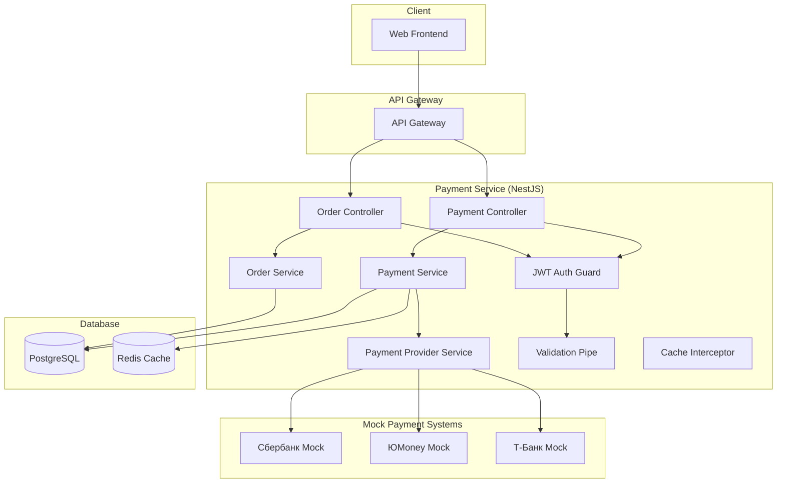

# Design Document - Payment Service MVP

## Overview

Payment Service - критически важный сервис платежей для MVP российской игровой платформы. Обеспечивает безопасную покупку игр через имитацию российских платежных систем с полной интеграцией через REST API.

**Технологический стек:** NestJS + TypeScript + PostgreSQL + Redis (основной стек для бизнес-логики)

## Architecture

### System Architecture



## NestJS Architecture

### Module Structure

```typescript
@Module({
  imports: [
    TypeOrmModule.forFeature([Order, Payment]),
    HttpModule,
    ConfigModule,
    CacheModule.register(),
    JwtModule.register({
      secret: process.env.JWT_SECRET,
      signOptions: { expiresIn: '1h' },
    }),
  ],
  controllers: [PaymentController, OrderController],
  providers: [
    PaymentService,
    OrderService,
    PaymentProviderService,
    SberbankPaymentProvider,
    YMoneyPaymentProvider,
    TBankPaymentProvider,
    JwtStrategy,
  ],
  exports: [PaymentService, OrderService],
})
export class PaymentModule {}
```

### Controllers

```typescript
@Controller('payments')
@UseGuards(JwtAuthGuard)
export class PaymentController {
  constructor(private readonly paymentService: PaymentService) {}

  @Post()
  @UsePipes(ValidationPipe)
  async createPayment(@Body() createPaymentDto: CreatePaymentDto) {
    return this.paymentService.createPayment(createPaymentDto);
  }

  @Get(':id')
  @UseInterceptors(CacheInterceptor)
  async getPayment(@Param('id') id: string) {
    return this.paymentService.getPayment(id);
  }

  @Post(':id/confirm')
  async confirmPayment(@Param('id') id: string) {
    return this.paymentService.confirmPayment(id);
  }

  @Post(':id/cancel')
  async cancelPayment(@Param('id') id: string) {
    return this.paymentService.cancelPayment(id);
  }
}

@Controller('orders')
@UseGuards(JwtAuthGuard)
export class OrderController {
  constructor(private readonly orderService: OrderService) {}

  @Post()
  @UsePipes(ValidationPipe)
  async createOrder(@Body() createOrderDto: CreateOrderDto, @Request() req) {
    return this.orderService.createOrder(req.user.id, createOrderDto);
  }

  @Get(':id')
  async getOrder(@Param('id') id: string, @Request() req) {
    return this.orderService.getOrder(id, req.user.id);
  }

  @Get()
  async getUserOrders(@Request() req, @Query() query: GetOrdersQueryDto) {
    return this.orderService.getUserOrders(req.user.id, query);
  }
}
```

## Components and Interfaces

### REST API Endpoints

#### Orders
- `POST /orders` - Создание заказа на покупку игры
- `GET /orders/:id` - Получение информации о заказе
- `GET /orders` - Список заказов пользователя с пагинацией

#### Payments
- `POST /payments` - Создание платежа для заказа
- `GET /payments/:id` - Получение статуса и информации о платеже
- `POST /payments/:id/confirm` - Подтверждение платежа (webhook от платежной системы)
- `POST /payments/:id/cancel` - Отмена платежа

### Services

#### OrderService
- `createOrder(userId, gameId, amount)` - Создание заказа с валидацией игры
- `getOrder(orderId, userId)` - Получение заказа с проверкой владельца
- `getUserOrders(userId, query)` - Заказы пользователя с фильтрацией и пагинацией
- `updateOrderStatus(orderId, status)` - Обновление статуса заказа

#### PaymentService
- `createPayment(orderId, method)` - Создание платежа с выбором провайдера
- `processPayment(paymentId)` - Инициация платежа через провайдера
- `confirmPayment(paymentId)` - Подтверждение успешного платежа
- `cancelPayment(paymentId)` - Отмена платежа
- `getPayment(paymentId)` - Получение информации о платеже

#### PaymentProviderService
- `processPayment(provider, amount, orderId)` - Обработка через конкретного провайдера
- `getPaymentStatus(provider, externalId)` - Проверка статуса у провайдера
- `handleWebhook(provider, data)` - Обработка webhook от провайдера

## Data Models

### Order Entity

```typescript
interface Order {
  id: string;
  userId: string;
  gameId: string;
  gameName: string;
  amount: number;
  currency: string; // 'RUB'
  status: 'pending' | 'paid' | 'cancelled' | 'expired';
  createdAt: Date;
  updatedAt: Date;
  expiresAt: Date;
}
```

### Payment Entity

```typescript
interface Payment {
  id: string;
  orderId: string;
  provider: 'sberbank' | 'yandex' | 'tbank';
  amount: number;
  currency: string; // 'RUB'
  status: 'pending' | 'processing' | 'completed' | 'failed' | 'cancelled';
  externalId?: string;
  paymentUrl?: string;
  webhookData?: any;
  createdAt: Date;
  updatedAt: Date;
  completedAt?: Date;
}
```

### DTO Classes

```typescript
interface CreateOrderDto {
  gameId: string;
  gameName: string;
  amount: number;
}

interface CreatePaymentDto {
  orderId: string;
  provider: 'sberbank' | 'yandex' | 'tbank';
}

interface GetOrdersQueryDto {
  page?: number;
  limit?: number;
  status?: string;
}

interface PaymentWebhookDto {
  externalId: string;
  status: string;
  amount: number;
  signature: string;
}
```

## Error Handling

### Error Types
- `ValidationError` - Ошибки валидации входных данных
- `PaymentError` - Ошибки обработки платежа
- `OrderNotFoundError` - Заказ не найден
- `PaymentNotFoundError` - Платеж не найден
- `OrderExpiredError` - Заказ истек
- `PaymentAlreadyProcessedError` - Платеж уже обработан
- `InvalidPaymentProviderError` - Неподдерживаемый провайдер
- `ExternalPaymentError` - Ошибка внешней платежной системы

### Error Response Format

```json
{
  "error": {
    "code": "ORDER_NOT_FOUND",
    "message": "Order with ID 123 not found",
    "details": {
      "orderId": "123"
    }
  }
}
```

## Testing Strategy

### Unit Tests
- OrderService методы (создание, получение, обновление статуса)
- PaymentService методы (создание, обработка, подтверждение)
- PaymentProviderService методы (mock провайдеры)
- Валидация DTO классов с class-validator

### Integration Tests
- REST API endpoints с supertest
- Database операции с TypeORM
- Mock платежные провайдеры
- Webhook обработка

### E2E Tests
- Полный цикл создания заказа и платежа
- Обработка webhook от платежных систем
- Сценарии ошибок и отмен

### Test Coverage
- Минимум 90% покрытие кода
- Все критические пути покрыты тестами
- Mock внешние зависимости