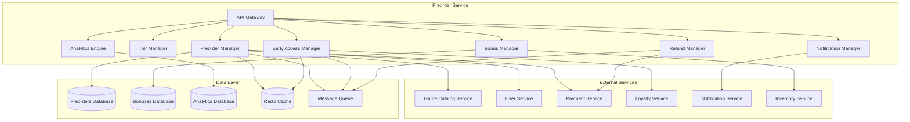

# Preorder Service - Дизайн

## 📋 **Обзор**

Preorder Service представляет собой комплексный микросервис для управления системой предзаказов игр с поддержкой многоуровневых предзаказов, раннего доступа, управления бонусами, гибкой системы отмены и интеграции с программами лояльности. Сервис обеспечивает полный жизненный цикл предзаказа от создания до выполнения.

## 🏗️ **Архитектура**

### **Общая архитектура**


### **Микросервисная архитектура**
- **API Gateway**: Единая точка входа с аутентификацией и rate limiting
- **Preorder Manager**: Управление жизненным циклом предзаказов
- **Tier Manager**: Управление уровнями предзаказов и апгрейдами
- **Bonus Manager**: Управление предзаказными бонусами
- **Early Access Manager**: Управление ранним доступом
- **Refund Manager**: Обработка отмен и возвратов
- **Notification Manager**: Система уведомлений для предзаказов
- **Analytics Engine**: Сбор и анализ данных предзаказов

## 🔧 **Компоненты и интерфейсы**

### **1. Preorder Manager Component**
```typescript
interface PreorderManager {
  // Управление предзаказами
  createPreorder(preorderRequest: PreorderCreationRequest): Promise<Preorder>;
  updatePreorder(preorderId: string, updates: PreorderUpdate): Promise<Preorder>;
  cancelPreorder(preorderId: string, reason: CancellationReason): Promise<CancellationResult>;
  
  // Получение предзаказов
  getPreorderById(preorderId: string): Promise<Preorder>;
  getUserPreorders(userId: string): Promise<UserPreorder[]>;
  getGamePreorders(gameId: string): Promise<GamePreorderInfo>;
  
  // Статус и валидация
  validatePreorderEligibility(userId: string, gameId: string): Promise<EligibilityResult>;
  getPreorderStatus(preorderId: string): Promise<PreorderStatus>;
  processPreorderFulfillment(preorderId: string): Promise<FulfillmentResult>;
}

interface PreorderCreationRequest {
  gameId: string;
  userId: string;
  tierId: string;
  paymentMethodId: string;
  shippingAddress?: ShippingAddress;
  giftRecipient?: string;
  loyaltyPointsUsed?: number;
}

interface Preorder {
  id: string;
  gameId: string;
  userId: string;
  tierId: string;
  status: PreorderStatus;
  purchaseDate: Date;
  releaseDate: Date;
  totalAmount: number;
  discountAmount: number;
  bonuses: PreorderBonus[];
  earlyAccessEnabled: boolean;
  earlyAccessDate?: Date;
  cancellationDeadline: Date;
  fulfillmentDate?: Date;
  createdAt: Date;
  updatedAt: Date;
}

enum PreorderStatus {
  PENDING_PAYMENT = 'pending_payment',
  CONFIRMED = 'confirmed',
  EARLY_ACCESS_ACTIVE = 'early_access_active',
  FULFILLED = 'fulfilled',
  CANCELLED = 'cancelled',
  REFUNDED = 'refunded'
}
```

### **2. Tier Manager Component**
```typescript
interface TierManager {
  // Управление уровнями
  createPreorderTier(tierRequest: TierCreationRequest): Promise<PreorderTier>;
  updatePreorderTier(tierId: string, updates: TierUpdate): Promise<PreorderTier>;
  
  // Получение уровней
  getGameTiers(gameId: string): Promise<PreorderTier[]>;
  getTierById(tierId: string): Promise<PreorderTier>;
  compareTiers(tierIds: string[]): Promise<TierComparison>;
  
  // Апгрейды
  upgradePreorderTier(preorderId: string, newTierId: string): Promise<UpgradeResult>;
  calculateUpgradeCost(preorderId: string, newTierId: string): Promise<UpgradeCost>;
  validateTierUpgrade(preorderId: string, newTierId: string): Promise<UpgradeValidation>;
}

interface PreorderTier {
  id: string;
  gameId: string;
  name: string;
  description: string;
  basePrice: number;
  discountPercentage: number;
  finalPrice: number;
  bonuses: TierBonus[];
  earlyAccessDays: number;
  maxQuantity?: number;
  currentQuantity: number;
  isLimited: boolean;
  availableFrom: Date;
  availableUntil: Date;
  priority: number;
}

interface TierBonus {
  id: string;
  type: BonusType;
  name: string;
  description: string;
  value: any;
  deliveryMethod: DeliveryMethod;
  availableAt: BonusAvailability;
}

enum BonusType {
  DIGITAL_CONTENT = 'digital_content',
  IN_GAME_CURRENCY = 'in_game_currency',
  EXCLUSIVE_SKIN = 'exclusive_skin',
  SEASON_PASS = 'season_pass',
  PHYSICAL_ITEM = 'physical_item',
  EARLY_ACCESS = 'early_access',
  BETA_ACCESS = 'beta_access'
}
```

### **3. Bonus Manager Component**
```typescript
interface BonusManager {
  // Управление бонусами
  createBonus(bonusRequest: BonusCreationRequest): Promise<PreorderBonus>;
  updateBonus(bonusId: string, updates: BonusUpdate): Promise<PreorderBonus>;
  
  // Выдача бонусов
  grantBonus(userId: string, bonusId: string): Promise<BonusGrant>;
  grantPreorderBonuses(preorderId: string): Promise<BonusGrant[]>;
  
  // Получение бонусов
  getUserBonuses(userId: string): Promise<UserBonus[]>;
  getPreorderBonuses(preorderId: string): Promise<PreorderBonus[]>;
  
  // Активация бонусов
  activateBonus(userId: string, bonusId: string): Promise<ActivationResult>;
  getBonusActivationStatus(bonusId: string): Promise<ActivationStatus>;
}

interface PreorderBonus {
  id: string;
  preorderId: string;
  type: BonusType;
  name: string;
  description: string;
  value: any;
  status: BonusStatus;
  grantedAt?: Date;
  activatedAt?: Date;
  expiresAt?: Date;
  deliveryMethod: DeliveryMethod;
  metadata: BonusMetadata;
}

interface BonusGrant {
  bonusId: string;
  userId: string;
  grantedAt: Date;
  activationCode?: string;
  deliveryInstructions?: string;
  trackingNumber?: string;
}

enum BonusStatus {
  PENDING = 'pending',
  GRANTED = 'granted',
  ACTIVATED = 'activated',
  EXPIRED = 'expired',
  REVOKED = 'revoked'
}

enum DeliveryMethod {
  AUTOMATIC = 'automatic',
  ACTIVATION_CODE = 'activation_code',
  PHYSICAL_SHIPPING = 'physical_shipping',
  EMAIL_DELIVERY = 'email_delivery',
  IN_GAME_GRANT = 'in_game_grant'
}
```

### **4. Early Access Manager Component**
```typescript
interface EarlyAccessManager {
  // Управление ранним доступом
  enableEarlyAccess(gameId: string, config: EarlyAccessConfig): Promise<void>;
  grantEarlyAccess(userId: string, gameId: string): Promise<EarlyAccessGrant>;
  
  // Проверка доступа
  checkEarlyAccessEligibility(userId: string, gameId: string): Promise<EligibilityResult>;
  getEarlyAccessStatus(userId: string, gameId: string): Promise<EarlyAccessStatus>;
  
  // Управление сессиями
  startEarlyAccessSession(userId: string, gameId: string): Promise<EarlyAccessSession>;
  getEarlyAccessProgress(userId: string, gameId: string): Promise<EarlyAccessProgress>;
  transferProgressToRelease(userId: string, gameId: string): Promise<ProgressTransfer>;
}

interface EarlyAccessConfig {
  gameId: string;
  startDate: Date;
  endDate: Date;
  eligibleTiers: string[];
  features: EarlyAccessFeature[];
  progressTransfer: boolean;
  maxConcurrentUsers?: number;
}

interface EarlyAccessGrant {
  id: string;
  userId: string;
  gameId: string;
  grantedAt: Date;
  accessStartDate: Date;
  accessEndDate: Date;
  status: EarlyAccessStatus;
  remainingTime?: number;
}

interface EarlyAccessSession {
  id: string;
  userId: string;
  gameId: string;
  startTime: Date;
  endTime?: Date;
  duration: number;
  progress: GameProgress;
  achievements: Achievement[];
}

enum EarlyAccessStatus {
  PENDING = 'pending',
  ACTIVE = 'active',
  EXPIRED = 'expired',
  TRANSFERRED = 'transferred'
}
```

### **5. Refund Manager Component**
```typescript
interface RefundManager {
  // Управление возвратами
  initiateRefund(preorderId: string, reason: RefundReason): Promise<RefundRequest>;
  processRefund(refundId: string): Promise<RefundResult>;
  
  // Проверка возможности возврата
  checkRefundEligibility(preorderId: string): Promise<RefundEligibility>;
  calculateRefundAmount(preorderId: string): Promise<RefundCalculation>;
  
  // Отмена предзаказов
  cancelPreorder(preorderId: string, reason: CancellationReason): Promise<CancellationResult>;
  getRefundPolicy(gameId: string): Promise<RefundPolicy>;
  
  // История возвратов
  getRefundHistory(userId: string): Promise<RefundHistory[]>;
  getRefundStatistics(gameId: string): Promise<RefundStatistics>;
}

interface RefundRequest {
  id: string;
  preorderId: string;
  userId: string;
  reason: RefundReason;
  requestedAmount: number;
  approvedAmount?: number;
  status: RefundStatus;
  requestedAt: Date;
  processedAt?: Date;
  notes?: string;
}

interface RefundEligibility {
  eligible: boolean;
  reason?: string;
  deadline?: Date;
  refundableAmount: number;
  nonRefundableItems: string[];
}

enum RefundReason {
  CHANGED_MIND = 'changed_mind',
  GAME_DELAYED = 'game_delayed',
  TECHNICAL_ISSUES = 'technical_issues',
  DUPLICATE_PURCHASE = 'duplicate_purchase',
  UNAUTHORIZED_PURCHASE = 'unauthorized_purchase'
}

enum RefundStatus {
  PENDING = 'pending',
  APPROVED = 'approved',
  REJECTED = 'rejected',
  PROCESSED = 'processed'
}
```

### **6. Analytics Engine Component**
```typescript
interface AnalyticsEngine {
  // Метрики предзаказов
  trackPreorderCreation(preorder: Preorder): Promise<void>;
  trackPreorderCancellation(preorderId: string, reason: CancellationReason): Promise<void>;
  trackTierUpgrade(preorderId: string, fromTier: string, toTier: string): Promise<void>;
  
  // Аналитические отчеты
  getPreorderConversionRate(gameId: string, period: DateRange): Promise<ConversionMetrics>;
  getTierPopularity(gameId: string): Promise<TierPopularityMetrics>;
  getRefundAnalytics(gameId: string): Promise<RefundAnalytics>;
  
  // Прогнозирование
  forecastPreorderSales(gameId: string): Promise<SalesForecast>;
  predictOptimalPricing(gameId: string): Promise<PricingRecommendation>;
  analyzePreorderTrends(): Promise<TrendAnalysis>;
}

interface ConversionMetrics {
  gameId: string;
  period: DateRange;
  totalViews: number;
  preorderConversions: number;
  conversionRate: number;
  revenueGenerated: number;
  averageOrderValue: number;
}

interface TierPopularityMetrics {
  gameId: string;
  tiers: TierMetrics[];
  mostPopularTier: string;
  revenueByTier: Map<string, number>;
  upgradePatterns: UpgradePattern[];
}
```

## 📊 **Модели данных**

### **Основные сущности**
```typescript
interface Preorder {
  id: string;
  gameId: string;
  userId: string;
  tierId: string;
  status: PreorderStatus;
  purchaseDate: Date;
  releaseDate: Date;
  totalAmount: number;
  discountAmount: number;
  loyaltyPointsUsed: number;
  bonuses: PreorderBonus[];
  earlyAccessEnabled: boolean;
  earlyAccessDate?: Date;
  cancellationDeadline: Date;
  fulfillmentDate?: Date;
  shippingAddress?: ShippingAddress;
  giftRecipient?: string;
  createdAt: Date;
  updatedAt: Date;
}

interface PreorderTier {
  id: string;
  gameId: string;
  name: string;
  description: string;
  basePrice: number;
  discountPercentage: number;
  finalPrice: number;
  bonuses: TierBonus[];
  earlyAccessDays: number;
  maxQuantity?: number;
  currentQuantity: number;
  isLimited: boolean;
  availableFrom: Date;
  availableUntil: Date;
  priority: number;
  metadata: TierMetadata;
}

interface PreorderBonus {
  id: string;
  preorderId: string;
  type: BonusType;
  name: string;
  description: string;
  value: any;
  status: BonusStatus;
  grantedAt?: Date;
  activatedAt?: Date;
  expiresAt?: Date;
  deliveryMethod: DeliveryMethod;
  trackingInfo?: TrackingInfo;
  metadata: BonusMetadata;
}

interface RefundRequest {
  id: string;
  preorderId: string;
  userId: string;
  reason: RefundReason;
  requestedAmount: number;
  approvedAmount?: number;
  status: RefundStatus;
  requestedAt: Date;
  processedAt?: Date;
  processedBy?: string;
  notes?: string;
  refundMethod: RefundMethod;
}
```

## 🛡️ **Обработка ошибок**

### **Стратегия обработки ошибок**
```typescript
enum PreorderErrorCode {
  // Ошибки предзаказов
  PREORDER_NOT_FOUND = 'PREORDER_NOT_FOUND',
  PREORDER_NOT_AVAILABLE = 'PREORDER_NOT_AVAILABLE',
  PREORDER_LIMIT_EXCEEDED = 'PREORDER_LIMIT_EXCEEDED',
  PREORDER_EXPIRED = 'PREORDER_EXPIRED',
  
  // Ошибки уровней
  TIER_NOT_FOUND = 'TIER_NOT_FOUND',
  TIER_SOLD_OUT = 'TIER_SOLD_OUT',
  INVALID_TIER_UPGRADE = 'INVALID_TIER_UPGRADE',
  
  // Ошибки платежей
  PAYMENT_FAILED = 'PAYMENT_FAILED',
  INSUFFICIENT_FUNDS = 'INSUFFICIENT_FUNDS',
  PAYMENT_METHOD_INVALID = 'PAYMENT_METHOD_INVALID',
  
  // Ошибки возвратов
  REFUND_NOT_ELIGIBLE = 'REFUND_NOT_ELIGIBLE',
  REFUND_DEADLINE_PASSED = 'REFUND_DEADLINE_PASSED',
  REFUND_ALREADY_PROCESSED = 'REFUND_ALREADY_PROCESSED',
  
  // Ошибки раннего доступа
  EARLY_ACCESS_NOT_AVAILABLE = 'EARLY_ACCESS_NOT_AVAILABLE',
  EARLY_ACCESS_EXPIRED = 'EARLY_ACCESS_EXPIRED',
  EARLY_ACCESS_LIMIT_REACHED = 'EARLY_ACCESS_LIMIT_REACHED'
}

interface PreorderError {
  code: PreorderErrorCode;
  message: string;
  details?: any;
  timestamp: Date;
  preorderId?: string;
  userId?: string;
}
```

## 🧪 **Стратегия тестирования**

### **Модульное тестирование**
- Тестирование логики ценообразования
- Валидация условий возврата
- Проверка выдачи бонусов
- Тестирование апгрейдов уровней

### **Интеграционное тестирование**
- Интеграция с Payment Service
- Интеграция с Game Catalog Service
- Интеграция с Loyalty Service
- Тестирование уведомлений

### **End-to-End тестирование**
- Полный цикл предзаказа
- Процесс раннего доступа
- Сценарии отмены и возврата
- Выдача и активация бонусов

## 🔧 **Технические детали реализации**

### **База данных**
- **PostgreSQL**: Основное хранилище предзаказов
- **Redis**: Кэширование и управление сессиями
- **ClickHouse**: Аналитические данные

### **Безопасность**
- Защита от дублирования предзаказов
- Валидация платежных данных
- Audit logging всех операций
- Защита персональных данных

### **Производительность**
- Асинхронная обработка бонусов
- Кэширование популярных игр
- Оптимизация запросов аналитики
- Горизонтальное масштабирование

### **Мониторинг**
- Метрики конверсии предзаказов
- Мониторинг процессов возврата
- Алерты на критические ошибки
- Дашборды для разработчиков и маркетологов